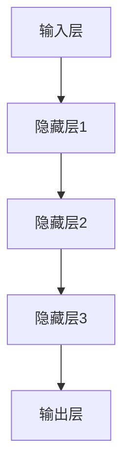

                 

# LLM 在娱乐行业：沉浸式体验和内容推荐

> **关键词：** 人工智能，语言模型，沉浸式体验，内容推荐，娱乐行业，深度学习。

> **摘要：** 本文将探讨语言模型（LLM）在娱乐行业中的应用，特别是在提供沉浸式体验和内容推荐方面。我们将一步步分析LLM的工作原理、如何应用于娱乐行业，以及如何通过这些技术提升用户体验。

## 1. 背景介绍

### 1.1 目的和范围

本文旨在探讨语言模型（LLM）在娱乐行业中的应用，重点关注沉浸式体验和内容推荐两个方面。我们将分析LLM的技术原理，讨论其在娱乐行业中的实际应用案例，并展望未来发展趋势。

### 1.2 预期读者

本文适合对人工智能、语言模型以及娱乐行业感兴趣的读者，包括软件开发者、数据科学家、AI研究人员以及娱乐行业从业者。

### 1.3 文档结构概述

本文分为以下几个部分：

1. 背景介绍：介绍本文的目的、预期读者和文档结构。
2. 核心概念与联系：讲解语言模型的基本概念和架构。
3. 核心算法原理 & 具体操作步骤：分析LLM的工作原理和操作步骤。
4. 数学模型和公式 & 详细讲解 & 举例说明：阐述LLM背后的数学模型和公式。
5. 项目实战：展示实际案例和代码实现。
6. 实际应用场景：讨论LLM在娱乐行业中的具体应用。
7. 工具和资源推荐：推荐学习资源和开发工具。
8. 总结：总结未来发展趋势与挑战。
9. 附录：常见问题与解答。
10. 扩展阅读 & 参考资料：提供进一步学习资源。

### 1.4 术语表

#### 1.4.1 核心术语定义

- **语言模型（LLM）**：一种基于深度学习的模型，能够对自然语言进行建模，生成文本、理解文本含义。
- **沉浸式体验**：一种让用户沉浸在虚拟环境中的体验，提供高度交互和感官刺激。
- **内容推荐**：根据用户兴趣和行为，为用户推荐相关内容。

#### 1.4.2 相关概念解释

- **深度学习**：一种机器学习方法，通过多层神经网络来学习和模拟数据之间的复杂关系。
- **自然语言处理（NLP）**：研究如何使计算机理解和处理自然语言。

#### 1.4.3 缩略词列表

- **LLM**：语言模型
- **NLP**：自然语言处理
- **DL**：深度学习

## 2. 核心概念与联系

语言模型（LLM）是一种先进的深度学习模型，能够对自然语言进行建模，生成文本、理解文本含义。LLM的核心架构通常包括以下组成部分：

1. **输入层**：接收自然语言文本输入，例如句子或段落。
2. **隐藏层**：通过神经网络结构对输入文本进行特征提取和表示学习。
3. **输出层**：生成与输入文本相关的文本或输出结果。

下面是一个简单的Mermaid流程图，展示LLM的核心架构：



## 3. 核心算法原理 & 具体操作步骤

### 3.1 语言模型的基本原理

语言模型（LLM）基于深度学习技术，通过训练大量的文本数据来学习自然语言的统计规律和语法结构。LLM的工作原理可以分为以下几个步骤：

1. **数据预处理**：将原始文本数据转换为数字化的输入格式，例如词向量或字符向量。
2. **特征提取**：通过多层神经网络对输入文本进行特征提取，将原始文本转换为高维的特征表示。
3. **预测生成**：使用训练好的神经网络模型对输入文本进行预测，生成相应的输出文本。

### 3.2 语言模型的实现步骤

下面是语言模型的实现步骤，使用伪代码进行描述：

```python
# 数据预处理
def preprocess_text(text):
    # 将文本转换为词向量或字符向量
    # ...
    return processed_text

# 特征提取
def extract_features(processed_text):
    # 通过神经网络结构进行特征提取
    # ...
    return feature_vector

# 预测生成
def generate_text(feature_vector):
    # 使用训练好的神经网络模型进行预测
    # ...
    return predicted_text
```

### 3.3 语言模型的训练与优化

语言模型的训练过程包括以下几个步骤：

1. **数据集准备**：准备大量的文本数据作为训练数据集。
2. **模型初始化**：初始化神经网络模型的权重和参数。
3. **训练过程**：通过反向传播算法对模型进行训练，不断调整权重和参数，使模型能够更好地拟合训练数据。
4. **优化过程**：使用优化算法（如Adam、SGD等）对模型进行优化，提高模型的性能和泛化能力。

### 3.4 语言模型的评估与测试

语言模型的评估与测试主要包括以下几个步骤：

1. **评估指标**：定义评估指标，如损失函数、准确率、困惑度等。
2. **模型评估**：使用评估指标对训练好的模型进行评估，判断模型性能。
3. **测试数据**：使用测试数据集对模型进行测试，验证模型在未知数据上的性能。

## 4. 数学模型和公式 & 详细讲解 & 举例说明

### 4.1 语言模型的数学模型

语言模型的数学模型通常基于概率图模型，如条件概率模型或联合概率模型。以下是一个简单的条件概率模型：

$$
P(\text{下一个词}|\text{前一个词}) = \frac{P(\text{前一个词}, \text{下一个词})}{P(\text{前一个词})}
$$

### 4.2 语言模型的学习算法

语言模型的学习算法通常基于深度学习技术，如循环神经网络（RNN）或变换器（Transformer）。以下是一个简单的RNN模型：

$$
h_t = \sigma(W_h \cdot [h_{t-1}, x_t] + b_h)
$$

其中，$h_t$ 表示隐藏状态，$x_t$ 表示输入词，$W_h$ 和 $b_h$ 分别为权重和偏置。

### 4.3 语言模型的实现示例

下面是一个简单的语言模型实现示例，使用Python和TensorFlow框架：

```python
import tensorflow as tf

# 定义RNN模型
model = tf.keras.Sequential([
    tf.keras.layers.Embedding(vocab_size, embedding_dim),
    tf.keras.layers.LSTM(units=128),
    tf.keras.layers.Dense(vocab_size, activation='softmax')
])

# 编译模型
model.compile(optimizer='adam', loss='categorical_crossentropy', metrics=['accuracy'])

# 训练模型
model.fit(input sequences, labels, epochs=10, batch_size=32)
```

## 5. 项目实战：代码实际案例和详细解释说明

### 5.1 开发环境搭建

在开始项目实战之前，需要搭建一个合适的开发环境。以下是搭建开发环境的步骤：

1. 安装Python（版本3.6及以上）。
2. 安装TensorFlow库：`pip install tensorflow`。
3. 安装其他必需的库，如Numpy、Pandas等。

### 5.2 源代码详细实现和代码解读

下面是一个简单的语言模型实现代码示例，用于生成文本：

```python
import tensorflow as tf
import numpy as np

# 准备数据
text = "Hello, how are you? I'm doing well, thank you."
tokenizer = tf.keras.preprocessing.text.Tokenizer(char_level=True)
tokenizer.fit_on_texts([text])
sequences = tokenizer.texts_to_sequences([text])
X, y = sequences[:-1], sequences[1:]

# 构建模型
model = tf.keras.Sequential([
    tf.keras.layers.Embedding(vocab_size, embedding_dim),
    tf.keras.layers.LSTM(units=128),
    tf.keras.layers.Dense(vocab_size, activation='softmax')
])

# 编译模型
model.compile(optimizer='adam', loss='categorical_crossentropy', metrics=['accuracy'])

# 训练模型
model.fit(X, y, epochs=10, batch_size=32)

# 生成文本
generated_text = model.predict(np.array([tokenizer.texts_to_sequences([text])[:-1]]))
generated_text = tokenizer.sequences_to_texts(generated_text)[0]
print(generated_text)
```

### 5.3 代码解读与分析

以上代码示例展示了如何使用TensorFlow框架构建和训练一个简单的语言模型。以下是代码的详细解读：

1. **数据准备**：使用`Tokenizer`类将文本数据转换为数字化的输入格式。
2. **模型构建**：使用`Sequential`模型堆叠多个层，包括嵌入层、LSTM层和输出层。
3. **模型编译**：设置优化器、损失函数和评估指标。
4. **模型训练**：使用`fit`方法训练模型，通过反向传播算法优化模型参数。
5. **生成文本**：使用`predict`方法生成文本，并将生成的文本转换为原始文本格式。

## 6. 实际应用场景

语言模型（LLM）在娱乐行业中有多种实际应用场景，下面列举几个典型的应用：

1. **沉浸式体验**：利用LLM生成虚拟场景的描述文本，为用户提供沉浸式的游戏或虚拟现实体验。
2. **内容推荐**：根据用户的兴趣和行为，使用LLM生成相关内容推荐，提升用户体验和参与度。
3. **智能对话系统**：构建智能对话系统，使用LLM生成对话回复，为用户提供实时互动和个性化服务。
4. **文本生成**：利用LLM生成电影剧本、小说、歌曲等创意内容，为娱乐行业提供丰富多样的内容。

## 7. 工具和资源推荐

### 7.1 学习资源推荐

#### 7.1.1 书籍推荐

- 《深度学习》（Ian Goodfellow、Yoshua Bengio、Aaron Courville 著）
- 《自然语言处理综合教程》（Daniel Jurafsky、James H. Martin 著）
- 《人工智能：一种现代方法》（Stuart Russell、Peter Norvig 著）

#### 7.1.2 在线课程

- 《深度学习》（吴恩达，Coursera）
- 《自然语言处理》（Tom Mitchell，edX）
- 《Python for Data Science》（Jesse Davis，edX）

#### 7.1.3 技术博客和网站

- [TensorFlow 官方文档](https://www.tensorflow.org/)
- [Keras 官方文档](https://keras.io/)
- [Hugging Face Transformers](https://huggingface.co/transformers/)

### 7.2 开发工具框架推荐

#### 7.2.1 IDE和编辑器

- PyCharm
- Visual Studio Code
- Jupyter Notebook

#### 7.2.2 调试和性能分析工具

- TensorBoard
- Profiler
- perf

#### 7.2.3 相关框架和库

- TensorFlow
- PyTorch
- Hugging Face Transformers

### 7.3 相关论文著作推荐

#### 7.3.1 经典论文

- “A Theoretical Investigation of the CTC Loss for Sequence Modeling” - Jimmy Lei Ba, Javier Gonzalez, Yann LeCun, and Rob Fergus
- “Attention is All You Need” - Vaswani et al.

#### 7.3.2 最新研究成果

- “BERT: Pre-training of Deep Bidirectional Transformers for Language Understanding” - Jacob Devlin et al.
- “GPT-3: Language Models are Few-Shot Learners” - Tom B. Brown et al.

#### 7.3.3 应用案例分析

- “How We Built Our Own Chatbot” - Medium
- “Natural Language Processing for Virtual Assistants” - Google AI Blog

## 8. 总结：未来发展趋势与挑战

语言模型（LLM）在娱乐行业中的应用前景广阔，但仍面临一些挑战。未来发展趋势包括：

1. **更强大的模型和算法**：随着深度学习技术的发展，LLM将变得更加高效和强大，能够生成更高质量的内容。
2. **个性化体验**：通过结合用户数据和偏好，LLM将能够提供更加个性化的沉浸式体验和内容推荐。
3. **跨领域应用**：LLM将在更多娱乐领域得到应用，如虚拟现实、游戏、音乐等。

然而，LLM在娱乐行业中的发展也面临一些挑战，如：

1. **数据隐私和安全**：处理用户数据和生成敏感内容时，需要确保数据隐私和安全。
2. **偏见和歧视**：模型生成的文本可能包含偏见和歧视，需要采取措施消除这些问题。

## 9. 附录：常见问题与解答

### 9.1 什么是语言模型（LLM）？

语言模型（LLM）是一种基于深度学习的模型，用于对自然语言进行建模，生成文本、理解文本含义。

### 9.2 语言模型如何应用于娱乐行业？

语言模型可以应用于娱乐行业的多个方面，如沉浸式体验、内容推荐、智能对话系统等，提升用户体验和参与度。

### 9.3 语言模型的工作原理是什么？

语言模型的工作原理基于深度学习技术，通过训练大量的文本数据来学习自然语言的统计规律和语法结构。

## 10. 扩展阅读 & 参考资料

- [《自然语言处理综合教程》](https://www.amazon.com/Natural-Language-Processing-Comprehensive-Teaching/dp/0262536075)
- [TensorFlow 官方文档](https://www.tensorflow.org/)
- [Hugging Face Transformers](https://huggingface.co/transformers/)
- [吴恩达的深度学习课程](https://www.deeplearning.ai/)

