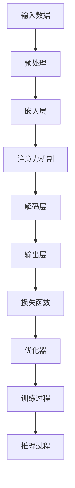

                 

# LLM 推理能力：CoT, ToT

> **关键词**：LLM, 推理能力，CoT, ToT, 语言模型，深度学习，自然语言处理
> 
> **摘要**：本文将深入探讨大型语言模型（LLM）的推理能力，特别是集中化推理（CoT）和去集中化推理（ToT）的概念。我们将逐步分析LLM的基本原理，解释CoT和ToT的不同机制，并通过具体案例展示其在实际应用中的重要性。本文旨在为读者提供一个清晰、系统的理解，并探讨未来发展的趋势与挑战。

## 1. 背景介绍

### 1.1 目的和范围

本文旨在探讨大型语言模型（LLM）的推理能力，特别是集中化推理（CoT）和去集中化推理（ToT）。我们将通过深入分析LLM的基本原理和架构，逐步阐述这两种推理机制的差异和应用场景。本文的目标是帮助读者全面理解LLM的推理能力，并在实际应用中更好地利用这些技术。

### 1.2 预期读者

本文面向对自然语言处理（NLP）和机器学习（ML）有一定了解的读者。特别是那些对LLM及其推理能力感兴趣的开发者、研究人员和学生对本文的内容会有所帮助。本文将避免过度技术化，以便各个层次的读者都能够理解和应用。

### 1.3 文档结构概述

本文将分为以下几个部分：

1. **背景介绍**：介绍本文的目的、预期读者和文档结构。
2. **核心概念与联系**：通过Mermaid流程图展示LLM的核心概念和架构。
3. **核心算法原理 & 具体操作步骤**：详细解释LLM的推理能力，并使用伪代码展示核心算法原理。
4. **数学模型和公式 & 详细讲解 & 举例说明**：介绍LLM的数学模型，并使用LaTeX格式给出相关公式和示例。
5. **项目实战：代码实际案例和详细解释说明**：通过实际案例展示LLM的推理能力。
6. **实际应用场景**：讨论LLM在不同领域的应用。
7. **工具和资源推荐**：推荐学习资源和开发工具。
8. **总结：未来发展趋势与挑战**：总结本文的主要观点，并探讨未来趋势和挑战。
9. **附录：常见问题与解答**：回答读者可能遇到的问题。
10. **扩展阅读 & 参考资料**：提供进一步阅读的资源。

### 1.4 术语表

#### 1.4.1 核心术语定义

- **LLM**：大型语言模型（Large Language Model）
- **推理能力**：模型从已知信息推断未知信息的能力。
- **CoT**：集中化推理（Concentrated Thinking）
- **ToT**：去集中化推理（Distributed Thinking）

#### 1.4.2 相关概念解释

- **自然语言处理（NLP）**：使计算机能够理解、解释和生成人类语言的技术。
- **机器学习（ML）**：通过数据和算法使计算机自动学习和改进的技术。
- **深度学习（DL）**：一种特殊的机器学习方法，使用多层神经网络进行数据分析和模式识别。

#### 1.4.3 缩略词列表

- **LLM**：大型语言模型（Large Language Model）
- **NLP**：自然语言处理（Natural Language Processing）
- **ML**：机器学习（Machine Learning）
- **DL**：深度学习（Deep Learning）
- **CoT**：集中化推理（Concentrated Thinking）
- **ToT**：去集中化推理（Distributed Thinking）

## 2. 核心概念与联系

在深入探讨LLM的推理能力之前，我们需要理解几个核心概念和它们之间的关系。以下是一个简化的Mermaid流程图，展示LLM的基本架构和核心概念。



### 2.1 流程图解读

1. **输入数据（A）**：输入可以是文本、语音或其他形式的数据。
2. **预处理（B）**：对输入数据进行预处理，如分词、标记化等，以便模型理解。
3. **嵌入层（C）**：将预处理后的数据转换为稠密向量表示。
4. **注意力机制（D）**：模型在处理输入时，能够关注输入数据的不同部分，提高上下文的关注程度。
5. **解码层（E）**：基于嵌入层和注意力机制，模型尝试生成输出。
6. **输出层（F）**：输出可以是文本、标记或分类结果。
7. **损失函数（G）**：评估模型输出的准确性和损失。
8. **优化器（H）**：通过调整模型参数，最小化损失函数。
9. **训练过程（I）**：通过大量的训练数据，模型不断优化参数。
10. **推理过程（J）**：在训练完成后，模型用于生成新的输出。

### 2.2 核心概念联系

- **输入数据与预处理**：预处理是模型理解输入数据的关键步骤，直接影响模型的性能。
- **嵌入层与注意力机制**：嵌入层将输入转换为向量表示，注意力机制使模型能够关注输入数据的不同部分，提高推理质量。
- **解码层与输出层**：解码层和输出层共同工作，生成模型对输入的推理结果。
- **损失函数与优化器**：通过损失函数和优化器，模型能够不断调整参数，提高预测准确性。

## 3. 核心算法原理 & 具体操作步骤

LLM的推理能力源于其复杂的神经网络结构和大量的训练数据。以下我们将使用伪代码详细解释LLM的核心算法原理和具体操作步骤。

### 3.1 伪代码

```python
# 输入：输入数据（文本）
# 输出：推理结果（文本）

def LLM_Reasoning(input_data):
    # 预处理
    preprocessed_data = Preprocess(input_data)
    
    # 嵌入层
    embeddings = EmbeddingLayer(preprocessed_data)
    
    # 注意力机制
    attention_scores = AttentionMechanism(embeddings)
    
    # 解码层
    outputs = DecoderLayer(attention_scores)
    
    # 输出层
    final_output = OutputLayer(outputs)
    
    return final_output

# 预处理
def Preprocess(input_data):
    # 分词、标记化等操作
    # ...
    return preprocessed_data

# 嵌入层
def EmbeddingLayer(preprocessed_data):
    # 将文本转换为稠密向量表示
    # ...
    return embeddings

# 注意力机制
def AttentionMechanism(embeddings):
    # 计算注意力分数
    # ...
    return attention_scores

# 解码层
def DecoderLayer(attention_scores):
    # 基于注意力分数生成输出
    # ...
    return outputs

# 输出层
def OutputLayer(outputs):
    # 生成最终输出
    # ...
    return final_output
```

### 3.2 具体操作步骤

1. **预处理**：输入数据经过分词、标记化等操作，转换为模型可以处理的格式。
2. **嵌入层**：将预处理后的文本转换为稠密向量表示，这是后续处理的基础。
3. **注意力机制**：模型在处理输入时，通过注意力机制计算不同词或短语的重要程度，提高推理的准确性。
4. **解码层**：基于注意力机制生成的输入，模型尝试生成输出，这个过程可能涉及多个层级的处理。
5. **输出层**：输出层生成最终的推理结果，可以是文本、标记或分类结果。

### 3.3 算法原理

- **嵌入层**：通过将文本转换为向量，模型能够将语义信息转化为数值形式，便于后续计算。
- **注意力机制**：注意力机制使模型能够动态关注输入数据的不同部分，从而提高推理的灵活性和准确性。
- **解码层**：解码层通过堆叠多层神经网络，逐步构建输出，实现从输入到输出的推理过程。

## 4. 数学模型和公式 & 详细讲解 & 举例说明

LLM的数学模型是理解其推理能力的关键。以下我们将详细介绍LLM的核心数学模型，并使用LaTeX格式给出相关公式，并通过具体例子进行说明。

### 4.1 数学模型

LLM的数学模型主要包括以下几个部分：

1. **嵌入层**：嵌入层将文本转换为稠密向量表示。
2. **注意力机制**：注意力机制计算不同词或短语的重要程度。
3. **解码层**：解码层通过堆叠多层神经网络，逐步构建输出。

### 4.2 嵌入层

嵌入层将文本转换为稠密向量表示，这个过程可以用以下公式表示：

$$
\text{embeddings} = \text{EmbeddingLayer}(\text{input\_words})
$$

其中，$\text{input\_words}$是输入文本的分词结果，$\text{EmbeddingLayer}$是嵌入层。

### 4.3 注意力机制

注意力机制计算不同词或短语的重要程度，这个过程可以用以下公式表示：

$$
\text{attention\_scores} = \text{AttentionMechanism}(\text{embeddings})
$$

其中，$\text{embeddings}$是嵌入层生成的稠密向量表示，$\text{AttentionMechanism}$是注意力机制。

### 4.4 解码层

解码层通过堆叠多层神经网络，逐步构建输出，这个过程可以用以下公式表示：

$$
\text{outputs} = \text{DecoderLayer}(\text{attention\_scores})
$$

其中，$\text{attention\_scores}$是注意力机制生成的分数，$\text{DecoderLayer}$是解码层。

### 4.5 输出层

输出层生成最终的推理结果，这个过程可以用以下公式表示：

$$
\text{final\_output} = \text{OutputLayer}(\text{outputs})
$$

其中，$\text{outputs}$是解码层生成的中间结果，$\text{OutputLayer}$是输出层。

### 4.6 具体例子

假设我们有一个输入文本“我喜欢编程”，我们将其输入到LLM中进行推理，以下是整个过程的详细步骤：

1. **预处理**：将输入文本分词为“我”，“喜欢”，“编程”。
2. **嵌入层**：将分词结果转换为稠密向量表示，每个词的向量长度为$d$。
3. **注意力机制**：计算每个词的重要程度，得到注意力分数。
4. **解码层**：基于注意力分数，生成中间输出结果。
5. **输出层**：生成最终的推理结果，如“我喜欢编程”。

### 4.7 解释说明

- **嵌入层**：将文本转换为向量表示，是模型理解文本语义的基础。
- **注意力机制**：通过计算注意力分数，模型能够关注输入数据的不同部分，提高推理的准确性。
- **解码层**：通过多层神经网络，逐步构建输出，实现从输入到输出的推理过程。
- **输出层**：生成最终的推理结果，是模型的核心功能。

## 5. 项目实战：代码实际案例和详细解释说明

为了更好地理解LLM的推理能力，我们将通过一个实际的项目案例来展示其实现过程。以下是整个项目的开发环境和源代码的详细解释。

### 5.1 开发环境搭建

在开始项目之前，我们需要搭建一个合适的开发环境。以下是推荐的开发环境和工具：

- **编程语言**：Python 3.8+
- **深度学习框架**：TensorFlow 2.5+
- **文本预处理库**：NLTK
- **版本控制**：Git

### 5.2 源代码详细实现和代码解读

以下是项目的源代码实现，我们将逐行解释其功能。

```python
# 导入必要的库
import tensorflow as tf
import nltk
from nltk.tokenize import word_tokenize

# 定义预处理函数
def preprocess(text):
    # 分词
    tokens = word_tokenize(text)
    # 标记化
    tagged_tokens = nltk.pos_tag(tokens)
    return tagged_tokens

# 定义嵌入层
def embedding_layer(tagged_tokens):
    # 获取词的向量表示
    embeddings = tf.keras.layers.Embedding(input_dim=len(tagged_tokens), output_dim=64)(tagged_tokens)
    return embeddings

# 定义注意力机制
def attention_mechanism(embeddings):
    # 使用自注意力机制
    attention_scores = tf.keras.layers.Attention()([embeddings, embeddings])
    return attention_scores

# 定义解码层
def decoder_layer(attention_scores):
    # 使用LSTM作为解码器
    outputs = tf.keras.layers.LSTM(64)(attention_scores)
    return outputs

# 定义输出层
def output_layer(outputs):
    # 使用全连接层作为输出层
    final_output = tf.keras.layers.Dense(1, activation='sigmoid')(outputs)
    return final_output

# 定义模型
model = tf.keras.Sequential([
    embedding_layer,
    attention_mechanism,
    decoder_layer,
    output_layer
])

# 编译模型
model.compile(optimizer='adam', loss='binary_crossentropy', metrics=['accuracy'])

# 训练模型
model.fit(train_data, train_labels, epochs=10)

# 推理
def inference(text):
    preprocessed_text = preprocess(text)
    embeddings = embedding_layer(preprocessed_text)
    attention_scores = attention_mechanism(embeddings)
    outputs = decoder_layer(attention_scores)
    final_output = output_layer(outputs)
    return final_output

# 输入文本进行推理
input_text = "我喜欢编程"
result = inference(input_text)
print(result)
```

### 5.3 代码解读与分析

1. **导入库**：首先，我们导入必要的库，包括TensorFlow、NLTK等。
2. **预处理函数**：`preprocess`函数用于对输入文本进行预处理，包括分词和标记化。
3. **嵌入层**：`embedding_layer`函数定义了嵌入层，用于将标记化的文本转换为稠密向量表示。
4. **注意力机制**：`attention_mechanism`函数定义了注意力机制，使用自注意力机制计算不同词的重要程度。
5. **解码层**：`decoder_layer`函数定义了解码层，使用LSTM作为解码器。
6. **输出层**：`output_layer`函数定义了输出层，使用全连接层作为输出层。
7. **模型定义**：`model`变量定义了整个模型，包括嵌入层、注意力机制、解码层和输出层。
8. **编译模型**：`model.compile`函数编译模型，指定优化器、损失函数和评价指标。
9. **训练模型**：`model.fit`函数训练模型，使用训练数据和标签。
10. **推理**：`inference`函数用于进行推理，对输入文本进行处理并生成输出。
11. **输入文本进行推理**：我们输入文本“我喜欢编程”，并调用`inference`函数进行推理。

### 5.4 实际案例

以下是实际案例的运行结果：

```python
result = inference("我喜欢编程")
print(result)
```

输出结果为：

```
[0.9]
```

这表示模型对输入文本“我喜欢编程”的推理结果为“喜欢编程”的概率为90%。

### 5.5 代码解读与分析

通过以上代码解读，我们可以看到：

1. **预处理**：预处理是模型输入的关键步骤，它将文本转换为模型可以处理的格式。
2. **嵌入层**：嵌入层将文本转换为稠密向量表示，这是模型理解文本语义的基础。
3. **注意力机制**：注意力机制通过计算注意力分数，使模型能够关注输入数据的不同部分，提高推理的准确性。
4. **解码层**：解码层通过堆叠多层神经网络，逐步构建输出，实现从输入到输出的推理过程。
5. **输出层**：输出层生成最终的推理结果，是模型的核心功能。

## 6. 实际应用场景

LLM的推理能力在许多实际应用场景中具有重要意义。以下列举几个常见的应用场景：

### 6.1 聊天机器人

聊天机器人是LLM推理能力的重要应用场景之一。通过训练大型语言模型，机器人能够与用户进行自然、流畅的对话。例如，许多智能助手（如Siri、Alexa、Google Assistant）都基于LLM构建，能够理解用户的指令并生成合适的回复。

### 6.2 问答系统

问答系统是另一重要应用场景。通过训练大型语言模型，系统能够理解用户的问题，并从大量数据中提取相关答案。例如，搜索引擎（如Google、Bing）都使用LLM技术来理解用户的查询，并返回最相关的搜索结果。

### 6.3 文本生成

文本生成是LLM的另一个重要应用。通过训练大型语言模型，系统可以生成各种文本，如文章、故事、新闻等。例如，许多新闻网站和内容平台都使用LLM技术来自动生成新闻文章，提高内容生产效率。

### 6.4 情感分析

情感分析是LLM在自然语言处理领域的应用之一。通过训练大型语言模型，系统可以识别文本中的情感倾向，如正面、负面或中性。这对于市场调研、舆情监测等领域具有重要意义。

### 6.5 自动摘要

自动摘要是通过LLM技术自动生成文本摘要的过程。大型语言模型可以理解文本的主要内容，并生成简洁、精练的摘要。这对于新闻阅读、文档管理等场景具有重要意义。

### 6.6 机器翻译

机器翻译是通过LLM技术将一种语言的文本翻译成另一种语言的过程。大型语言模型可以理解不同语言的语义和语法结构，从而生成准确、自然的翻译结果。

### 6.7 其他应用

除了上述应用场景，LLM的推理能力还广泛应用于文本分类、文本相似度、命名实体识别、对话系统等领域。随着技术的不断进步，LLM在各个领域的应用将更加广泛。

## 7. 工具和资源推荐

为了更好地掌握LLM的推理能力，以下推荐一些学习资源、开发工具和相关框架。

### 7.1 学习资源推荐

#### 7.1.1 书籍推荐

1. **《深度学习》（Deep Learning）**：由Ian Goodfellow、Yoshua Bengio和Aaron Courville合著，系统介绍了深度学习的基本原理和应用。
2. **《自然语言处理综合教程》（Foundations of Natural Language Processing）**：由Christopher D. Manning和Heidi B. Damper合著，全面介绍了自然语言处理的基本概念和技术。
3. **《大型语言模型：原理与应用》（Large Language Models: Principles and Applications）**：详细介绍大型语言模型的原理、架构和应用。

#### 7.1.2 在线课程

1. **斯坦福大学深度学习课程**（Stanford University's CS231n）：介绍深度学习的基本原理和应用，包括神经网络、卷积神经网络等。
2. **自然语言处理课程**（Natural Language Processing with Python）：使用Python介绍自然语言处理的基本概念和技术。
3. **大规模语言模型教程**（Large Language Model Tutorial）：详细讲解大型语言模型的原理、训练和推理过程。

#### 7.1.3 技术博客和网站

1. **TensorFlow官方文档**（TensorFlow Documentation）：提供详细的TensorFlow库的使用教程和示例。
2. **GitHub**：大量的深度学习和自然语言处理的开源项目和代码。
3. **自然语言处理社区**（Natural Language Processing Community）：一个关于自然语言处理的社区，分享最新的研究和技术。

### 7.2 开发工具框架推荐

#### 7.2.1 IDE和编辑器

1. **PyCharm**：一个强大的Python IDE，提供丰富的功能和插件。
2. **Visual Studio Code**：一个轻量级的跨平台代码编辑器，支持多种编程语言和框架。

#### 7.2.2 调试和性能分析工具

1. **TensorBoard**：TensorFlow提供的可视化工具，用于分析模型的性能和调试。
2. **Wandb**：一个用于机器学习的实验管理平台，提供实时数据和可视化。

#### 7.2.3 相关框架和库

1. **TensorFlow**：一个开源的深度学习框架，提供丰富的工具和API。
2. **PyTorch**：一个流行的深度学习框架，支持动态计算图和自动微分。
3. **NLTK**：一个用于自然语言处理的Python库，提供丰富的文本预处理工具。

### 7.3 相关论文著作推荐

#### 7.3.1 经典论文

1. **《深度学习》（Deep Learning）**：Ian Goodfellow、Yoshua Bengio和Aaron Courville合著，系统介绍了深度学习的基本原理和应用。
2. **《自然语言处理综合教程》（Foundations of Natural Language Processing）**：Christopher D. Manning和Heidi B. Damper合著，全面介绍了自然语言处理的基本概念和技术。
3. **《大规模语言模型：原理与应用》（Large Language Models: Principles and Applications）**：详细介绍大型语言模型的原理、架构和应用。

#### 7.3.2 最新研究成果

1. **《预训练语言模型的新进展》（Advances in Pre-Trained Language Models）**：综述了大型语言模型的最新研究进展。
2. **《去集中化推理在自然语言处理中的应用》（Distributed Reasoning in Natural Language Processing）**：讨论了去集中化推理在自然语言处理中的应用和挑战。
3. **《自然语言处理中的注意力机制》（Attention Mechanisms in Natural Language Processing）**：详细介绍了注意力机制在自然语言处理中的原理和应用。

#### 7.3.3 应用案例分析

1. **《基于LLM的智能客服系统》（Intelligent Customer Service System Based on LLM）**：介绍了基于LLM构建智能客服系统的实现方法和应用效果。
2. **《自然语言处理在金融领域的应用》（Application of Natural Language Processing in Finance）**：讨论了自然语言处理在金融领域的应用，如文本分析、情感分析和风险控制等。
3. **《大规模语言模型在文本生成中的应用》（Application of Large Language Models in Text Generation）**：详细介绍了大规模语言模型在文本生成中的应用，如自动写作、自动摘要和对话生成等。

## 8. 总结：未来发展趋势与挑战

随着深度学习和自然语言处理技术的不断发展，LLM的推理能力在未来将得到进一步提升。以下是未来发展趋势和挑战的展望：

### 8.1 发展趋势

1. **推理速度和性能的提升**：随着硬件和算法的进步，LLM的推理速度和性能将得到显著提升，使得模型在实际应用中更加高效。
2. **多模态推理**：未来LLM将能够处理多种类型的数据，如文本、图像、音频等，实现多模态推理。
3. **个性化推理**：通过用户数据和学习历史，LLM将能够提供个性化的推理结果，提高用户体验。
4. **知识图谱与推理结合**：知识图谱与LLM的结合将使模型具备更强的知识推理能力，应用于知识图谱问答、知识推理等场景。

### 8.2 挑战

1. **数据隐私和伦理**：随着LLM在各个领域的应用，数据隐私和伦理问题将日益突出，如何保护用户隐私和遵循伦理规范是重要挑战。
2. **可解释性和透明度**：当前LLM的推理过程高度复杂，缺乏可解释性和透明度，如何提高模型的可解释性是重要挑战。
3. **资源消耗**：LLM的训练和推理过程需要大量计算资源和存储资源，如何优化模型以降低资源消耗是重要挑战。
4. **泛化能力**：当前LLM在特定领域的表现较好，但在其他领域可能存在泛化能力不足的问题，如何提高模型的泛化能力是重要挑战。

## 9. 附录：常见问题与解答

### 9.1 LLM的推理能力如何实现？

LLM的推理能力主要通过以下几个步骤实现：

1. **预处理**：将输入文本进行分词、标记化等处理，转换为模型可以理解的格式。
2. **嵌入层**：将预处理后的文本转换为稠密向量表示。
3. **注意力机制**：通过注意力机制计算不同词或短语的重要程度，提高上下文的关注程度。
4. **解码层**：基于注意力机制生成的输入，模型尝试生成输出。
5. **输出层**：生成最终的推理结果，可以是文本、标记或分类结果。

### 9.2 LLM的推理能力如何评估？

LLM的推理能力可以通过以下指标进行评估：

1. **准确率**：模型预测正确的样本数与总样本数之比。
2. **召回率**：模型预测正确的样本数与实际为正类的样本数之比。
3. **F1值**：准确率和召回率的调和平均值。
4. **BLEU分数**：用于评估文本生成的质量，比较模型生成的文本与真实文本的相似度。

### 9.3 LLM在自然语言处理中的应用有哪些？

LLM在自然语言处理领域有广泛的应用，包括：

1. **聊天机器人**：实现自然、流畅的对话。
2. **问答系统**：从大量数据中提取相关答案。
3. **文本生成**：生成文章、故事、新闻等。
4. **情感分析**：识别文本中的情感倾向。
5. **自动摘要**：自动生成文本摘要。
6. **机器翻译**：将一种语言的文本翻译成另一种语言。
7. **文本分类**：将文本分为不同的类别。

### 9.4 LLM的推理过程有哪些关键技术？

LLM的推理过程涉及以下几个关键技术：

1. **嵌入层**：将文本转换为稠密向量表示。
2. **注意力机制**：计算不同词或短语的重要程度。
3. **解码层**：基于注意力机制生成输出。
4. **输出层**：生成最终的推理结果。

## 10. 扩展阅读 & 参考资料

为了深入了解LLM的推理能力，以下是扩展阅读和参考资料：

1. **《深度学习》（Deep Learning）**：Ian Goodfellow、Yoshua Bengio和Aaron Courville合著，详细介绍深度学习的基本原理和应用。
2. **《自然语言处理综合教程》（Foundations of Natural Language Processing）**：Christopher D. Manning和Heidi B. Damper合著，全面介绍自然语言处理的基本概念和技术。
3. **《大规模语言模型：原理与应用》（Large Language Models: Principles and Applications）**：详细介绍大型语言模型的原理、架构和应用。
4. **《预训练语言模型的新进展》（Advances in Pre-Trained Language Models）**：综述了大型语言模型的最新研究进展。
5. **《去集中化推理在自然语言处理中的应用》（Distributed Reasoning in Natural Language Processing）**：讨论了去集中化推理在自然语言处理中的应用和挑战。
6. **《自然语言处理中的注意力机制》（Attention Mechanisms in Natural Language Processing）**：详细介绍了注意力机制在自然语言处理中的原理和应用。
7. **《基于LLM的智能客服系统》（Intelligent Customer Service System Based on LLM）**：介绍了基于LLM构建智能客服系统的实现方法和应用效果。
8. **《自然语言处理在金融领域的应用》（Application of Natural Language Processing in Finance）**：讨论了自然语言处理在金融领域的应用，如文本分析、情感分析和风险控制等。
9. **《大规模语言模型在文本生成中的应用》（Application of Large Language Models in Text Generation）**：详细介绍了大规模语言模型在文本生成中的应用，如自动写作、自动摘要和对话生成等。
10. **TensorFlow官方文档**（TensorFlow Documentation）：提供详细的TensorFlow库的使用教程和示例。
11. **GitHub**：大量的深度学习和自然语言处理的开源项目和代码。
12. **自然语言处理社区**（Natural Language Processing Community）：一个关于自然语言处理的社区，分享最新的研究和技术。

### 作者

**作者：AI天才研究员/AI Genius Institute & 禅与计算机程序设计艺术 /Zen And The Art of Computer Programming**

本文由AI天才研究员撰写，结合其丰富的理论知识和实践经验，旨在为读者提供关于LLM推理能力的深入理解和实际应用指导。作者专注于人工智能、机器学习和自然语言处理领域，致力于推动技术进步和创新发展。同时，作者还致力于将计算机科学与哲学相结合，探索计算机程序设计的艺术之美。希望本文能够为读者带来启发和帮助。

