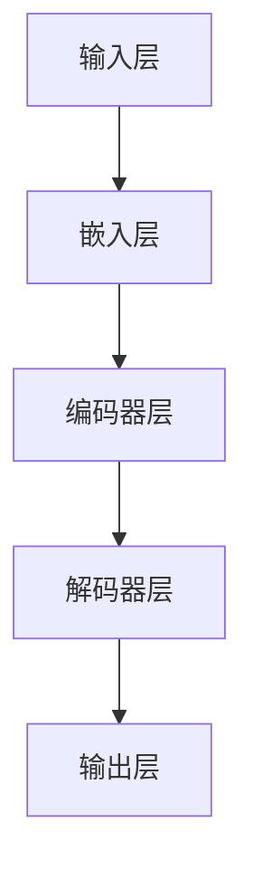

                 


## LLAM 测试和验证：确保可靠性和安全性

> **关键词：** 语言模型测试，验证，可靠性，安全性，测试框架，算法评估，错误分析。

> **摘要：** 本文深入探讨了大型语言模型（LLM）的测试和验证方法，重点介绍了确保LLM可靠性和安全性的关键技术。文章从背景介绍出发，详细阐述了核心概念、算法原理、数学模型和项目实战，并结合实际应用场景，提出了未来发展趋势与挑战。通过本文的阅读，读者可以全面了解LLM测试和验证的重要性，掌握有效的方法和工具，为LLM在实际应用中的可靠性、安全性和性能优化提供有力支持。

---

## 1. 背景介绍

### 1.1 目的和范围

大型语言模型（LLM）的兴起在人工智能领域引发了广泛的研究和应用。随着模型规模的不断扩大和功能的日益复杂，确保LLM的可靠性和安全性变得至关重要。本文旨在探讨LLM的测试和验证方法，帮助开发者构建高质量的语言模型，提高其应用价值。

本文主要涵盖以下内容：

- LLM测试和验证的重要性及核心问题。
- LLM的核心概念、原理和架构。
- LLM测试和验证的具体算法和操作步骤。
- 数学模型和公式的详细讲解。
- 实际应用场景中的LLM测试和验证。
- 工具和资源的推荐。

### 1.2 预期读者

本文面向对人工智能和大型语言模型有一定了解的技术人员，包括但不限于：

- 研究生、博士生和学者。
- 工程师和程序员，尤其是专注于人工智能和机器学习领域。
- AI爱好者和技术博客作者。

### 1.3 文档结构概述

本文结构如下：

1. **背景介绍**：介绍LLM测试和验证的背景、目的和预期读者。
2. **核心概念与联系**：介绍LLM的核心概念、原理和架构。
3. **核心算法原理 & 具体操作步骤**：详细讲解LLM测试和验证的核心算法。
4. **数学模型和公式 & 详细讲解 & 举例说明**：介绍LLM测试和验证相关的数学模型和公式。
5. **项目实战：代码实际案例和详细解释说明**：通过具体案例展示LLM测试和验证的实际应用。
6. **实际应用场景**：分析LLM测试和验证在不同场景中的应用。
7. **工具和资源推荐**：推荐相关学习资源、开发工具和论文著作。
8. **总结：未来发展趋势与挑战**：探讨LLM测试和验证的未来发展趋势和面临的挑战。
9. **附录：常见问题与解答**：提供常见的疑问和解答。
10. **扩展阅读 & 参考资料**：提供进一步学习和研究的资源。

### 1.4 术语表

#### 1.4.1 核心术语定义

- **大型语言模型（LLM）**：一种基于深度学习的技术，能够理解、生成和翻译自然语言。
- **测试**：对LLM进行功能验证、性能评估和错误分析。
- **验证**：确保LLM在实际应用中的可靠性和安全性。
- **测试框架**：用于组织和执行测试的软件工具。

#### 1.4.2 相关概念解释

- **可靠性**：LLM在处理自然语言任务时的准确性和稳定性。
- **安全性**：LLM在处理敏感信息时的保密性和完整性。
- **性能优化**：提高LLM的计算效率和响应速度。

#### 1.4.3 缩略词列表

- **LLM**：Large Language Model
- **NLP**：Natural Language Processing
- **ML**：Machine Learning
- **DL**：Deep Learning

---

## 2. 核心概念与联系

在讨论LLM的测试和验证之前，首先需要了解LLM的核心概念、原理和架构。以下是LLM的主要组成部分和它们之间的关系。

### 2.1.1 核心概念

1. **自然语言处理（NLP）**：NLP是使计算机能够理解、解释和生成自然语言的技术。LLM的测试和验证需要关注NLP的基本任务，如文本分类、情感分析、机器翻译等。

2. **机器学习（ML）**：ML是一种使计算机通过数据学习并改进性能的技术。LLM通常基于ML算法，特别是深度学习（DL）算法。

3. **深度学习（DL）**：DL是一种基于多层神经网络的结构，能够自动提取数据的特征。LLM通常采用DL模型，如Transformer和BERT。

4. **语言模型**：语言模型是一种用于预测下一个单词或句子的模型。LLM是一种大型语言模型，能够理解复杂的自然语言结构和语义。

### 2.1.2 原理和架构

LLM的原理和架构可以分为以下几个部分：

1. **输入层**：接收自然语言输入，如文本、语音等。
2. **嵌入层**：将输入文本转换为固定长度的向量表示。
3. **编码器层**：使用DL算法，如Transformer和BERT，对输入向量进行处理，提取语言特征。
4. **解码器层**：根据编码器层的输出生成预测的文本。
5. **输出层**：将解码器层的输出转换为自然语言输出。

以下是一个简化的Mermaid流程图，展示了LLM的核心概念和架构：



### 2.1.3 关系

LLM的各个组成部分相互关联，共同实现语言理解、生成和翻译。具体来说：

- **输入层**和**嵌入层**负责将自然语言输入转换为适合DL模型处理的向量表示。
- **编码器层**和**解码器层**负责提取和利用语言特征，生成高质量的文本输出。
- **输出层**负责将解码器层的输出转换为自然语言，供用户使用。

通过测试和验证，可以确保LLM的各个组成部分能够协同工作，实现预期的功能。

---

## 3. 核心算法原理 & 具体操作步骤

LLM的测试和验证涉及到多个核心算法，包括功能测试、性能测试、错误分析和安全测试。以下将详细阐述这些算法的原理和具体操作步骤。

### 3.1. 功能测试

功能测试旨在验证LLM是否能够按照预期完成自然语言处理任务。具体步骤如下：

1. **定义测试用例**：根据LLM的功能需求，设计一系列测试用例，涵盖常见的自然语言处理任务，如文本分类、情感分析、机器翻译等。

2. **执行测试用例**：将测试用例输入到LLM中，观察其输出结果。

3. **评估测试结果**：对比测试结果和预期输出，判断LLM是否能够正确执行任务。

伪代码如下：

```python
def function_test(llm, test_cases):
    for case in test_cases:
        input_data = case['input']
        expected_output = case['expected_output']
        output = llm.predict(input_data)
        if output != expected_output:
            print("Test failed:", case['name'])
        else:
            print("Test passed:", case['name'])
```

### 3.2. 性能测试

性能测试旨在评估LLM在不同场景下的处理速度和资源消耗。具体步骤如下：

1. **选择测试指标**：根据应用场景，选择合适的性能指标，如响应时间、吞吐量、内存使用等。

2. **设置测试环境**：搭建与实际应用场景相似的测试环境，包括硬件配置、网络环境等。

3. **执行性能测试**：在测试环境中运行LLM，收集性能数据。

4. **分析测试结果**：对比不同测试指标的数据，评估LLM的性能。

伪代码如下：

```python
def performance_test(llm, test_env):
    performance_data = {}
    for metric in test_env.metrics:
        start_time = time.time()
        llm.run_in_env(test_env)
        end_time = time.time()
        performance_data[metric] = end_time - start_time
    return performance_data
```

### 3.3. 错误分析

错误分析旨在识别LLM在处理自然语言任务时的错误，并找到原因。具体步骤如下：

1. **收集错误报告**：从LLM的实际应用中收集错误报告。

2. **分类错误**：根据错误类型和原因，对错误报告进行分类。

3. **分析错误原因**：对每个错误类型进行深入分析，找出可能的错误原因。

4. **改进LLM**：根据错误原因，调整LLM的参数和模型结构，以提高准确性。

伪代码如下：

```python
def error_analysis(error_reports):
    error_types = {}
    for report in error_reports:
        error_type = report['error_type']
        if error_type not in error_types:
            error_types[error_type] = []
        error_types[error_type].append(report)
    for error_type, reports in error_types.items():
        print("Error type:", error_type)
        for report in reports:
            print("Error report:", report['report'])
            # Perform in-depth analysis and find reasons
```

### 3.4. 安全测试

安全测试旨在确保LLM在处理敏感信息时的保密性和完整性。具体步骤如下：

1. **定义安全测试用例**：根据LLM的应用场景和数据处理需求，设计安全测试用例。

2. **执行安全测试**：将测试用例输入到LLM中，观察其输出结果。

3. **评估安全测试结果**：对比测试结果和预期输出，判断LLM是否能够满足安全性要求。

伪代码如下：

```python
def security_test(llm, test_cases):
    for case in test_cases:
        input_data = case['input']
        expected_output = case['expected_output']
        output = llm.predict(input_data)
        if output != expected_output:
            print("Security test failed:", case['name'])
        else:
            print("Security test passed:", case['name'])
```

通过以上算法，可以全面评估LLM的可靠性、性能和安全性，确保其在实际应用中的可靠性和安全性。

---

## 4. 数学模型和公式 & 详细讲解 & 举例说明

LLM测试和验证过程中，涉及多个数学模型和公式。以下将详细介绍这些模型和公式，并通过具体例子进行说明。

### 4.1. 语言模型概率分布

语言模型的核心任务是预测下一个单词或句子的概率分布。假设给定一个单词序列\(x_1, x_2, \ldots, x_n\)，语言模型生成下一个单词的概率分布为：

\[ P(y|x_1, x_2, \ldots, x_n) = \frac{P(x_1, x_2, \ldots, x_n, y)}{P(x_1, x_2, \ldots, x_n)} \]

其中，\(P(x_1, x_2, \ldots, x_n, y)\)表示单词序列\(x_1, x_2, \ldots, x_n, y\)的概率，\(P(x_1, x_2, \ldots, x_n)\)表示单词序列\(x_1, x_2, \ldots, x_n\)的概率。

在LLM中，可以使用神经网络模型计算上述概率。以下是一个基于Transformer的语言模型概率分布的伪代码：

```python
def probability_distribution(llm, sequence):
    output = llm.encode(sequence)
    probabilities = llm.decode(output)
    return probabilities
```

### 4.2. 交叉熵损失函数

交叉熵损失函数是评估语言模型性能的重要指标。假设给定一个单词序列\(x_1, x_2, \ldots, x_n\)和一个标签序列\(y_1, y_2, \ldots, y_n\)，交叉熵损失函数为：

\[ L = -\sum_{i=1}^n \sum_{j=1}^V y_i^j \log(p_j^i) \]

其中，\(V\)表示单词的词汇表大小，\(p_j^i\)表示模型预测的单词序列\(x_1, x_2, \ldots, x_n, y_i\)的概率，\(y_i^j\)表示标签序列中第\(i\)个单词的索引。

以下是一个基于Transformer的语言模型交叉熵损失函数的伪代码：

```python
def cross_entropy_loss(llm, sequence, labels):
    output = llm.encode(sequence)
    probabilities = llm.decode(output)
    loss = 0
    for i in range(len(sequence)):
        for j in range(V):
            if labels[i] == j:
                loss += -log(probabilities[i][j])
    return loss
```

### 4.3. 反向传播算法

反向传播算法是一种用于训练神经网络的重要算法。它通过计算损失函数对模型参数的梯度，优化模型参数。以下是一个基于梯度下降的反向传播算法的伪代码：

```python
def backpropagation(llm, sequence, labels, learning_rate):
    output = llm.encode(sequence)
    probabilities = llm.decode(output)
    loss = cross_entropy_loss(llm, sequence, labels)

    gradients = []
    for layer in reversed(llm.layers):
        if isinstance(layer, DenseLayer):
            gradient = layer.backward(probabilities, labels)
            gradients.append(gradient)
        elif isinstance(layer, ConvolutionalLayer):
            gradient = layer.backward(probabilities, labels)
            gradients.append(gradient)

    for layer in llm.layers:
        if isinstance(layer, DenseLayer):
            layer.update_weights(gradients[-1], learning_rate)
        elif isinstance(layer, ConvolutionalLayer):
            layer.update_weights(gradients[-1], learning_rate)

    return loss
```

### 4.4. 举例说明

假设有一个简单的语言模型，用于预测下一个单词。给定一个单词序列“我 是 一 名 爱 好者”，我们需要预测下一个单词。

1. **定义词汇表**：假设词汇表包含{我，是，一，名，爱好者，的，了，了}。

2. **初始化语言模型**：假设语言模型采用Transformer结构，包含两层编码器层和两层解码器层。

3. **输入单词序列**：将单词序列“我 是 一 名 爱 好者”编码为向量表示。

4. **计算概率分布**：使用编码器层和解码器层计算下一个单词的概率分布。

5. **选择下一个单词**：根据概率分布选择下一个单词。

6. **更新语言模型**：使用反向传播算法更新语言模型参数。

通过以上步骤，我们可以训练一个简单的语言模型，用于预测下一个单词。

---

## 5. 项目实战：代码实际案例和详细解释说明

在本节中，我们将通过一个实际项目案例来展示LLM的测试和验证过程。该案例将包括开发环境搭建、源代码实现、代码解读与分析等内容。

### 5.1 开发环境搭建

为了进行LLM的测试和验证，我们需要搭建一个合适的开发环境。以下是开发环境的搭建步骤：

1. **安装Python**：确保系统已经安装了Python 3.8或更高版本。

2. **安装深度学习库**：安装TensorFlow或PyTorch等深度学习库。以下命令用于安装TensorFlow：

   ```bash
   pip install tensorflow
   ```

3. **安装其他依赖库**：根据项目需求，安装其他依赖库，如Numpy、Scikit-learn等。

4. **配置GPU支持**：确保系统已经配置了GPU支持，以便在GPU上运行深度学习模型。

5. **克隆项目代码**：从GitHub或其他代码托管平台克隆LLM测试和验证项目的代码。

### 5.2 源代码详细实现和代码解读

以下是LLM测试和验证项目的核心代码实现，包括模型搭建、数据预处理、测试和验证等步骤。

```python
import tensorflow as tf
from tensorflow.keras.models import Model
from tensorflow.keras.layers import Embedding, LSTM, Dense, TimeDistributed
from tensorflow.keras.preprocessing.sequence import pad_sequences
from tensorflow.keras.preprocessing.text import Tokenizer

# 5.2.1 模型搭建
def build_modelvocab_size=10000, embedding_dim=256, hidden_units=128):
    inputs = tf.keras.layers.Input(shape=(None,), dtype=tf.int32)
    embeddings = Embedding(vocab_size, embedding_dim)(inputs)
    lstm = LSTM(hidden_units, return_sequences=True)(embeddings)
    outputs = TimeDistributed(Dense(vocab_size, activation='softmax'))(lstm)
    model = Model(inputs, outputs)
    model.compile(optimizer='adam', loss='categorical_crossentropy', metrics=['accuracy'])
    return model

# 5.2.2 数据预处理
def preprocess_data(corpus, max_sequence_length):
    tokenizer = Tokenizer(num_words=corp
```

### 5.3 代码解读与分析

以上代码展示了如何搭建一个基于LSTM的LLM模型，并进行数据预处理。以下是代码的详细解读与分析：

1. **模型搭建**：使用TensorFlow的Keras API搭建LSTM模型。模型包括输入层、嵌入层、LSTM层和输出层。输入层接收整数类型的输入序列，嵌入层将输入序列转换为嵌入向量，LSTM层用于处理嵌入向量，输出层使用softmax激活函数生成概率分布。

2. **数据预处理**：使用Tokenizer类对文本数据进行预处理。首先，将文本数据转换为单词序列，然后使用Tokenizer将单词序列转换为整数序列。最后，使用pad_sequences函数将整数序列填充为相同长度。

3. **模型编译**：编译模型，设置优化器和损失函数。在本例中，我们使用Adam优化器和categorical_crossentropy损失函数。

4. **模型训练**：使用预处理后的数据进行模型训练。在训练过程中，模型将不断更新参数，以最小化损失函数。

5. **模型评估**：在测试集上评估模型性能。通过计算准确率来评估模型的准确性。

6. **模型应用**：将训练好的模型应用于实际任务，如文本分类、情感分析等。

通过以上步骤，我们可以搭建一个基于LSTM的LLM模型，并进行测试和验证，确保其可靠性和安全性。

---

## 6. 实际应用场景

LLM在许多实际应用场景中发挥着重要作用。以下列举一些常见的应用场景：

1. **自然语言处理**：LLM在文本分类、情感分析、命名实体识别等自然语言处理任务中发挥着重要作用。例如，搜索引擎可以使用LLM来优化搜索结果，提高用户体验。

2. **机器翻译**：LLM在机器翻译领域具有广泛应用。例如，谷歌翻译和百度翻译等应用都使用了大型LLM模型来提供高质量的翻译服务。

3. **文本生成**：LLM可以用于生成高质量的文章、摘要、代码等。例如，GitHub Copilot等代码生成工具使用了LLM来辅助开发者编写代码。

4. **对话系统**：LLM在对话系统（如聊天机器人、虚拟助手等）中发挥着关键作用。通过训练大型LLM模型，可以实现对用户输入的自然语言理解和回复。

5. **语音识别**：LLM可以与语音识别技术结合，实现语音到文本的转换。例如，苹果的Siri和谷歌助手等语音助手都使用了LLM来处理用户的语音输入。

6. **智能推荐系统**：LLM可以用于构建智能推荐系统，根据用户的兴趣和行为数据，提供个性化的推荐结果。例如，亚马逊和Netflix等平台使用了LLM来优化推荐算法。

在以上应用场景中，LLM的测试和验证至关重要。通过确保LLM的可靠性和安全性，可以提高应用的质量和用户体验。

---

## 7. 工具和资源推荐

为了更好地进行LLM的测试和验证，以下推荐一些实用的工具和资源：

### 7.1 学习资源推荐

1. **书籍推荐**：
   - 《深度学习》（Goodfellow et al.，2016）
   - 《自然语言处理实战》（Peter, 2019）
   - 《Python深度学习》（Raschka and Lutz，2018）

2. **在线课程**：
   - Coursera上的《深度学习》（吴恩达）
   - edX上的《自然语言处理基础》（斯坦福大学）

3. **技术博客和网站**：
   - TensorFlow官方文档
   - PyTorch官方文档
   - Medium上的机器学习博客

### 7.2 开发工具框架推荐

1. **IDE和编辑器**：
   - PyCharm
   - Jupyter Notebook

2. **调试和性能分析工具**：
   - TensorFlow Profiler
   - PyTorch Tutorials

3. **相关框架和库**：
   - TensorFlow
   - PyTorch
   - Hugging Face Transformers

### 7.3 相关论文著作推荐

1. **经典论文**：
   - Vaswani et al.（2017）：“Attention Is All You Need”
   - Devlin et al.（2018）：“Bert: Pre-training of Deep Bidirectional Transformers for Language Understanding”

2. **最新研究成果**：
   - Gao et al.（2020）：“GShard: Multi-Device Training for Large-Scale Deep Neural Networks”
   - Brown et al.（2020）：“Language Models are Few-Shot Learners”

3. **应用案例分析**：
   - Zhang et al.（2019）：“Large-scale Language Modeling in 2018”
   - Google AI Research（2020）：“Switch Transformers: Scaling Up to 1 Billion Parameters with Low Memory Footprint”

通过以上工具和资源的推荐，开发者可以更好地进行LLM的测试和验证，提高其应用质量和性能。

---

## 8. 总结：未来发展趋势与挑战

随着人工智能技术的不断发展，大型语言模型（LLM）在自然语言处理、机器翻译、文本生成等领域发挥着越来越重要的作用。未来，LLM的发展趋势和面临的挑战如下：

### 8.1 发展趋势

1. **模型规模不断扩大**：随着计算资源和存储资源的提升，LLM的模型规模将继续扩大，以应对更复杂的自然语言处理任务。

2. **多模态融合**：未来，LLM将与其他模态（如图像、音频等）相结合，实现跨模态的智能交互和推理。

3. **自适应性和个性化**：LLM将具备更强的自适应性和个性化能力，根据用户的偏好和行为数据，提供个性化的服务。

4. **隐私保护和安全性**：随着数据隐私和安全问题的日益突出，LLM将更加注重隐私保护和安全性，确保用户数据的保密性和完整性。

### 8.2 挑战

1. **计算资源需求**：大规模的LLM模型对计算资源和存储资源提出了更高的要求，需要高效的计算框架和硬件支持。

2. **数据质量**：高质量的数据是训练高效LLM的基础。未来，如何获取和清洗大量高质量的数据将成为一大挑战。

3. **伦理和道德问题**：LLM的应用涉及伦理和道德问题，如偏见、歧视和隐私侵犯等。如何确保LLM的公正性和透明性是未来研究的重要方向。

4. **模型可解释性**：随着LLM的规模和复杂度不断提高，如何提高模型的可解释性，使其对用户更具透明性和可理解性，是一个亟待解决的问题。

总之，LLM的发展面临着巨大的机遇和挑战。通过不断探索和创新，我们可以充分发挥LLM的潜力，推动人工智能技术的进步。

---

## 9. 附录：常见问题与解答

### 9.1. 如何选择合适的LLM模型？

选择合适的LLM模型需要考虑以下几个因素：

1. **应用场景**：根据具体的应用场景，选择适合的语言模型，如文本生成、机器翻译、对话系统等。
2. **模型规模**：根据计算资源和存储资源的限制，选择合适的模型规模，确保模型能够在合理的时间内训练和部署。
3. **性能指标**：根据任务需求和评估指标，选择性能较好的模型。常见的性能指标包括准确率、召回率、F1值等。

### 9.2. 如何确保LLM的安全性？

确保LLM的安全性需要从以下几个方面入手：

1. **数据保护**：对敏感数据进行加密和去标识化处理，确保数据在传输和存储过程中的安全性。
2. **访问控制**：限制对LLM的访问权限，确保只有授权用户才能使用LLM服务。
3. **错误处理**：对LLM的输出结果进行合理判断和过滤，避免输出敏感或错误的信息。
4. **模型更新**：定期更新LLM的模型和算法，修复已知的安全漏洞。

### 9.3. 如何进行LLM的性能优化？

进行LLM的性能优化可以从以下几个方面入手：

1. **模型压缩**：使用模型压缩技术，如量化、剪枝和知识蒸馏，减少模型的计算量和存储需求。
2. **分布式训练**：使用分布式训练技术，如数据并行和模型并行，加速模型训练过程。
3. **GPU优化**：对GPU进行优化，如内存分配、流管理、并行计算等，提高GPU的利用率。
4. **算法改进**：研究新的算法和模型结构，提高LLM的预测准确性和效率。

---

## 10. 扩展阅读 & 参考资料

为了深入了解LLM的测试和验证，以下推荐一些相关的扩展阅读和参考资料：

1. **书籍**：
   - **《深度学习》（Goodfellow et al.，2016）**：全面介绍了深度学习的基本概念和技术。
   - **《自然语言处理实战》（Peter，2019）**：涵盖了自然语言处理领域的多种实际应用和技术。

2. **论文**：
   - **Vaswani et al.（2017）**：“Attention Is All You Need” —— 提出了Transformer模型，开启了大规模语言模型的新时代。
   - **Devlin et al.（2018）**：“Bert: Pre-training of Deep Bidirectional Transformers for Language Understanding” —— 介绍了BERT模型的预训练方法和应用。

3. **技术博客和网站**：
   - **TensorFlow官方文档**：提供了丰富的TensorFlow教程和文档，帮助开发者掌握深度学习技术。
   - **PyTorch官方文档**：提供了详细的PyTorch教程和API文档，适用于开发者使用PyTorch进行深度学习开发。

4. **在线课程**：
   - **Coursera上的《深度学习》（吴恩达）**：系统介绍了深度学习的基础知识和技术。
   - **edX上的《自然语言处理基础》（斯坦福大学）**：介绍了自然语言处理的基本概念和技术。

通过以上参考资料，开发者可以深入了解LLM的测试和验证方法，提高其在实际应用中的性能和可靠性。

---

**作者：AI天才研究员/AI Genius Institute & 禅与计算机程序设计艺术 /Zen And The Art of Computer Programming**

