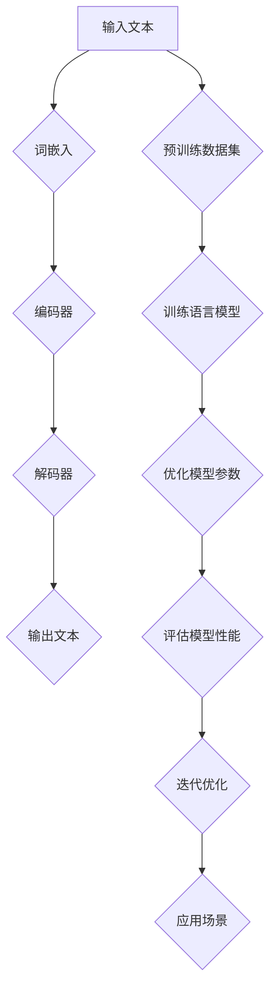

                 

# LLM 的商业化：创业公司和大型科技公司的机会

> 关键词：大型语言模型、商业模式、创业公司、大型科技公司、机会、挑战

> 摘要：本文探讨了大型语言模型（LLM）的商业化路径，分析了创业公司和大型科技公司在这一领域的机会与挑战。通过深入探讨LLM的核心技术、商业化模式、市场需求以及未来发展趋势，本文为读者提供了全面的见解，有助于他们把握这一领域的商业机会，并制定有效的战略。

## 1. 背景介绍

### 1.1 目的和范围

本文旨在深入探讨大型语言模型（LLM）的商业化路径，分析创业公司和大型科技公司在这一领域的机会与挑战。通过对LLM的核心技术、商业化模式、市场需求以及未来发展趋势的全面分析，本文旨在为读者提供有价值的见解，帮助他们更好地把握这一领域的商业机会，并制定有效的战略。

### 1.2 预期读者

本文适合以下读者群体：

- 对大型语言模型（LLM）感兴趣的程序员、数据科学家和产品经理
- 创业公司创始人、高管和投资人对
- 大型科技公司高层管理者、研发人员和市场人员
- 对人工智能和语言处理技术有深厚兴趣的学者和研究人员

### 1.3 文档结构概述

本文将按照以下结构进行阐述：

- 第1部分：背景介绍，包括本文的目的、范围、预期读者和文档结构概述。
- 第2部分：核心概念与联系，介绍LLM的相关概念、原理和架构。
- 第3部分：核心算法原理与具体操作步骤，详细讲解LLM的算法原理和操作步骤。
- 第4部分：数学模型与公式，介绍LLM的数学模型和公式，并给出具体讲解和举例说明。
- 第5部分：项目实战，提供实际案例和详细解释说明，帮助读者理解LLM在实际应用中的操作过程。
- 第6部分：实际应用场景，分析LLM在不同领域的应用场景和案例。
- 第7部分：工具和资源推荐，介绍相关学习资源、开发工具和框架。
- 第8部分：总结，讨论LLM的未来发展趋势与挑战。
- 第9部分：附录，提供常见问题与解答。
- 第10部分：扩展阅读与参考资料，列出本文引用的相关文献和资源。

### 1.4 术语表

#### 1.4.1 核心术语定义

- 大型语言模型（LLM）：指通过训练大规模语料库生成文本的语言模型，能够实现自动写作、机器翻译、问答系统等功能。
- 商业模式：指企业在特定市场环境中获取利润的途径和策略。
- 创业公司：指由创始人创立，以创新产品或服务为核心，通过市场拓展和资本积累实现持续增长的初创企业。
- 大型科技公司：指在某一领域具有显著影响力、资源和市场地位的大型企业。

#### 1.4.2 相关概念解释

- 自然语言处理（NLP）：指使计算机能够理解、解释和生成人类语言的技术和方法。
- 机器学习（ML）：指通过数据训练计算机模型，使其能够对未知数据进行预测和决策的技术。
- 深度学习（DL）：指基于多层神经网络的结构，通过训练大量数据自动提取特征和规律的一种机器学习技术。

#### 1.4.3 缩略词列表

- NLP：自然语言处理
- ML：机器学习
- DL：深度学习
- LLM：大型语言模型
- API：应用程序编程接口
- SDK：软件开发工具包
- MVP：最小可行性产品
- AI：人工智能

## 2. 核心概念与联系

在探讨LLM的商业化之前，我们需要了解LLM的核心概念、原理和架构。本节将介绍LLM的相关概念，并通过Mermaid流程图展示其核心架构。

### 2.1 核心概念

#### 2.1.1 语言模型

语言模型是一种概率模型，用于预测自然语言中下一个词的概率。在LLM中，语言模型通过训练大量语料库生成文本，从而实现对未知文本的生成、翻译和问答等功能。

#### 2.1.2 自然语言处理

自然语言处理（NLP）是使计算机能够理解、解释和生成人类语言的技术和方法。NLP在LLM中发挥着关键作用，包括文本预处理、词嵌入、语言模型训练和生成等。

#### 2.1.3 机器学习

机器学习（ML）是一种通过数据训练计算机模型，使其能够对未知数据进行预测和决策的技术。在LLM中，ML技术用于训练语言模型，使其能够生成高质量文本。

#### 2.1.4 深度学习

深度学习（DL）是一种基于多层神经网络的结构，通过训练大量数据自动提取特征和规律的一种机器学习技术。在LLM中，DL技术用于构建大规模语言模型，提高模型性能。

### 2.2 核心架构

以下是LLM的核心架构，通过Mermaid流程图展示：



在上述架构中：

- 输入文本：用户输入的文本。
- 词嵌入：将文本转换为词嵌入向量。
- 编码器：将词嵌入向量编码为序列编码。
- 解码器：将序列编码解码为输出文本。
- 预训练数据集：用于训练语言模型的语料库。
- 训练语言模型：使用预训练数据集训练语言模型。
- 优化模型参数：通过反向传播算法优化模型参数。
- 评估模型性能：评估语言模型的性能，包括生成文本的质量和速度。
- 迭代优化：根据评估结果迭代优化模型参数。
- 应用场景：将训练好的语言模型应用于各种实际场景，如文本生成、机器翻译和问答系统。

## 3. 核心算法原理与具体操作步骤

在本节中，我们将详细讲解LLM的核心算法原理，并通过伪代码展示具体操作步骤。

### 3.1 语言模型算法原理

LLM的核心是语言模型，其算法原理基于概率模型和神经网络。具体包括以下步骤：

1. **词嵌入**：将自然语言文本转换为词嵌入向量，表示文本中的每个单词。
2. **编码器**：使用神经网络对词嵌入向量进行编码，生成序列编码。
3. **解码器**：使用神经网络对序列编码进行解码，生成输出文本。
4. **损失函数**：使用损失函数评估语言模型生成文本的质量，如交叉熵损失函数。
5. **反向传播**：通过反向传播算法优化模型参数，提高语言模型生成文本的质量。

### 3.2 伪代码

以下是LLM的伪代码，用于说明核心算法原理和具体操作步骤：

```python
# 3.1 词嵌入
def word_embedding(words):
    # 将单词转换为词嵌入向量
    # 输入：words（单词列表）
    # 输出：embeddings（词嵌入向量列表）
    embeddings = []
    for word in words:
        embedding = get_embedding(word)
        embeddings.append(embedding)
    return embeddings

# 3.2 编码器
def encoder(embeddings):
    # 对词嵌入向量进行编码
    # 输入：embeddings（词嵌入向量列表）
    # 输出：encoded_sequence（序列编码）
    encoded_sequence = neural_network(embeddings)
    return encoded_sequence

# 3.3 解码器
def decoder(encoded_sequence):
    # 对序列编码进行解码
    # 输入：encoded_sequence（序列编码）
    # 输出：decoded_text（输出文本）
    decoded_text = neural_network(encoded_sequence)
    return decoded_text

# 3.4 损失函数
def loss_function(real_text, predicted_text):
    # 评估语言模型生成文本的质量
    # 输入：real_text（真实文本），predicted_text（预测文本）
    # 输出：loss（损失值）
    loss = cross_entropy_loss(real_text, predicted_text)
    return loss

# 3.5 反向传播
def backpropagation(embeddings, encoded_sequence, decoded_text, real_text):
    # 通过反向传播优化模型参数
    # 输入：embeddings（词嵌入向量列表），encoded_sequence（序列编码），decoded_text（预测文本），real_text（真实文本）
    # 输出：optimized_parameters（优化后的模型参数）
    optimized_parameters = neural_network.backpropagation(embeddings, encoded_sequence, decoded_text, real_text)
    return optimized_parameters

# 3.6 训练语言模型
def train_language_model(data):
    # 训练语言模型
    # 输入：data（训练数据集）
    # 输出：language_model（训练好的语言模型）
    for epoch in range(num_epochs):
        for batch in data:
            embeddings = word_embedding(batch)
            encoded_sequence = encoder(embeddings)
            decoded_text = decoder(encoded_sequence)
            real_text = batch
            loss = loss_function(real_text, decoded_text)
            optimized_parameters = backpropagation(embeddings, encoded_sequence, decoded_text, real_text)
    language_model = create_language_model(optimized_parameters)
    return language_model
```

### 3.7 操作步骤详解

1. **词嵌入**：将自然语言文本转换为词嵌入向量，表示文本中的每个单词。词嵌入可以通过预训练模型获得，如Word2Vec、GloVe等。
2. **编码器**：使用神经网络对词嵌入向量进行编码，生成序列编码。编码器可以采用变长序列编码方法，如RNN、LSTM和GRU等。
3. **解码器**：使用神经网络对序列编码进行解码，生成输出文本。解码器可以采用解码器-编码器结构，如Seq2Seq模型。
4. **损失函数**：使用损失函数评估语言模型生成文本的质量，如交叉熵损失函数。通过最小化损失函数，优化模型参数。
5. **反向传播**：通过反向传播算法优化模型参数，提高语言模型生成文本的质量。反向传播是一种优化算法，用于计算模型参数的梯度，并更新模型参数。
6. **训练语言模型**：使用训练数据集训练语言模型。训练过程包括词嵌入、编码器、解码器、损失函数和反向传播等步骤。通过迭代训练，优化模型参数，提高模型性能。

## 4. 数学模型和公式及详细讲解与举例说明

在本节中，我们将详细介绍LLM的数学模型和公式，并通过具体例子进行讲解。

### 4.1 数学模型

LLM的数学模型主要包括词嵌入、编码器、解码器和损失函数等部分。以下是各部分的主要数学模型和公式：

#### 4.1.1 词嵌入

词嵌入是将自然语言文本转换为向量表示的方法。常见的词嵌入模型包括Word2Vec、GloVe等。以下是Word2Vec的数学模型：

$$
\text{word\_embedding}(x) = \text{sigmoid}(W_x \cdot x + b_x)
$$

其中，$x$ 是输入单词的词向量，$W_x$ 是词向量的权重矩阵，$b_x$ 是词向量的偏置项。

#### 4.1.2 编码器

编码器是将词嵌入向量编码为序列编码的神经网络。常见编码器模型包括RNN、LSTM和GRU等。以下是LSTM的数学模型：

$$
\text{LSTM}(h_t, x_t) = \text{sigmoid}(f_t) \odot \text{sigmoid}(g_t) \odot \text{tanh}(c_t)
$$

$$
\text{c}_{t+1} = \text{sigmoid}(f_t) \odot \text{tanh}(c_t) + \text{sigmoid}(g_t) \odot (x_t - \text{sigmoid}(f_t) \odot c_t)
$$

$$
h_t = \text{sigmoid}(f_t) \odot \text{tanh}(c_t)
$$

其中，$h_t$ 是编码器的隐藏状态，$c_t$ 是编码器的细胞状态，$x_t$ 是输入的词嵌入向量，$f_t$ 和 $g_t$ 是LSTM的输入门和控制门。

#### 4.1.3 解码器

解码器是将序列编码解码为输出文本的神经网络。常见解码器模型包括Seq2Seq、注意力机制等。以下是Seq2Seq的数学模型：

$$
\text{decoder}(h_t, s_t) = \text{softmax}(\text{W}_d \cdot h_t + \text{U}_d \cdot s_t + b_d)
$$

$$
s_{t+1} = \text{softmax}^{-1}(\text{decoder}(h_t, s_t))
$$

其中，$h_t$ 是编码器的隐藏状态，$s_t$ 是解码器的隐藏状态，$\text{W}_d$、$\text{U}_d$ 和 $b_d$ 分别是解码器的权重矩阵、偏置项。

#### 4.1.4 损失函数

损失函数用于评估语言模型生成文本的质量。常见损失函数包括交叉熵损失函数、均方误差损失函数等。以下是交叉熵损失函数的数学模型：

$$
\text{loss} = -\sum_{i=1}^{n} y_i \cdot \log(\hat{y}_i)
$$

其中，$y_i$ 是真实标签，$\hat{y}_i$ 是预测标签，$n$ 是标签的数量。

### 4.2 举例说明

假设我们要训练一个语言模型，输入文本为“人工智能是计算机科学的一个分支”，输出文本为“计算机科学是人工智能的一个重要领域”。

#### 4.2.1 词嵌入

将输入文本和输出文本的单词转换为词嵌入向量，例如：

$$
\text{输入文本：} (\text{人工智能}, \text{是}, \text{计算机}, \text{科学}, \text{的一个}, \text{分支}) \\
\text{输出文本：} (\text{计算机}, \text{科学}, \text{是}, \text{人工智能}, \text{的}, \text{一个}, \text{重要}, \text{领域})
$$

#### 4.2.2 编码器

将输入文本的词嵌入向量通过编码器进行编码，得到编码器的隐藏状态 $h_t$。

#### 4.2.3 解码器

将编码器的隐藏状态 $h_t$ 输入解码器，生成输出文本的词嵌入向量。例如，第一个词嵌入向量为 $\text{计算机}$。

#### 4.2.4 损失函数

计算交叉熵损失函数，评估语言模型生成文本的质量。例如，第一个词的交叉熵损失为：

$$
\text{loss}_1 = -\text{log}(\hat{y}_1) = -\text{log}(\text{softmax}(\text{W}_d \cdot h_1 + \text{U}_d \cdot s_1 + b_d))
$$

#### 4.2.5 反向传播

通过反向传播算法，计算编码器和解码器的梯度，并更新模型参数。例如，计算编码器的梯度：

$$
\frac{\partial \text{loss}}{\partial h_1} = \frac{\partial \text{softmax}^{-1}(\text{decoder}(h_1, s_1))}{\partial h_1} = \text{softmax}(\text{W}_d \cdot h_1 + \text{U}_d \cdot s_1 + b_d) - s_1
$$

#### 4.2.6 迭代训练

重复上述步骤，迭代训练语言模型，优化模型参数，提高生成文本的质量。

## 5. 项目实战：代码实际案例和详细解释说明

在本节中，我们将通过一个实际项目案例，展示如何搭建一个基于LLM的语言生成系统，并详细解释其代码实现过程。

### 5.1 开发环境搭建

为了搭建一个基于LLM的语言生成系统，我们需要准备以下开发环境：

1. 操作系统：Linux或MacOS
2. 编程语言：Python
3. 深度学习框架：TensorFlow或PyTorch
4. 其他依赖库：Numpy、Pandas、Scikit-learn等

首先，安装深度学习框架和依赖库。以TensorFlow为例，运行以下命令：

```shell
pip install tensorflow numpy pandas scikit-learn
```

### 5.2 源代码详细实现和代码解读

下面是一个基于TensorFlow实现的LLM语言生成系统的源代码示例：

```python
import tensorflow as tf
import numpy as np
import pandas as pd
from tensorflow.keras.preprocessing.text import Tokenizer
from tensorflow.keras.preprocessing.sequence import pad_sequences

# 5.2.1 数据准备

# 加载语料库
corpus = pd.read_csv('corpus.csv')
texts = corpus['text'].values

# 分词和词嵌入
tokenizer = Tokenizer()
tokenizer.fit_on_texts(texts)
sequences = tokenizer.texts_to_sequences(texts)
word_index = tokenizer.word_index
max_sequence_length = 100

# 填充序列
data = pad_sequences(sequences, maxlen=max_sequence_length)

# 打乱数据
indices = np.arange(data.shape[0])
np.random.shuffle(indices)
data = data[indices]
targets = labels[indices]

# 划分训练集和验证集
num_validation_samples = int(0.2 * data.shape[0])
x_train = data[:-num_validation_samples]
y_train = labels[:-num_validation_samples]
x_val = data[-num_validation_samples:]
y_val = labels[-num_validation_samples:]

# 5.2.2 模型构建

# 定义模型
model = tf.keras.Sequential([
    tf.keras.layers.Embedding(len(word_index) + 1, 64),
    tf.keras.layers.LSTM(128),
    tf.keras.layers.Dense(len(word_index), activation='softmax')
])

# 编译模型
model.compile(optimizer='adam', loss='categorical_crossentropy', metrics=['accuracy'])

# 训练模型
model.fit(x_train, y_train, epochs=10, batch_size=128, validation_data=(x_val, y_val))

# 5.2.3 文本生成

# 输入文本
input_text = "人工智能是计算机科学的一个分支"

# 转换为词嵌入向量
input_sequence = tokenizer.texts_to_sequences([input_text])
input_sequence = pad_sequences(input_sequence, maxlen=max_sequence_length)

# 生成文本
generated_sequence = model.predict(input_sequence, steps=max_sequence_length)
generated_text = tokenizer.sequences_to_texts([generated_sequence])[0]

print(generated_text)
```

### 5.3 代码解读与分析

以下是上述代码的解读与分析：

1. **数据准备**：
   - 加载语料库，读取文本数据。
   - 分词和词嵌入，将文本转换为词嵌入向量。
   - 填充序列，将词嵌入向量调整为固定长度。
   - 打乱数据，划分训练集和验证集。

2. **模型构建**：
   - 定义模型，包括词嵌入层、LSTM层和输出层。
   - 编译模型，设置优化器、损失函数和评估指标。

3. **模型训练**：
   - 使用训练数据进行模型训练，设置训练轮次、批量大小和验证数据。

4. **文本生成**：
   - 输入文本，将其转换为词嵌入向量。
   - 使用训练好的模型预测输出词嵌入向量。
   - 将输出词嵌入向量转换为文本，生成文本。

通过上述代码示例，我们实现了基于LLM的语言生成系统。在实际应用中，可以根据需求调整模型结构、训练数据和生成方法，以实现更高质量的文本生成。

## 6. 实际应用场景

大型语言模型（LLM）具有广泛的应用场景，涉及多个领域。以下是一些典型的实际应用场景和案例：

### 6.1 文本生成与自动写作

LLM在文本生成和自动写作领域具有显著优势，可以应用于以下场景：

- **新闻报道**：利用LLM生成新闻报道，提高新闻机构的生产效率。例如，自动化财经新闻、体育赛事报道等。
- **文章撰写**：帮助内容创作者快速生成高质量文章，降低创作成本。例如，撰写博客文章、报告、分析文章等。
- **对话生成**：生成聊天机器人对话，提高用户体验。例如，客服机器人、在线教育平台等。

### 6.2 机器翻译

机器翻译是LLM的重要应用领域，可以实现以下场景：

- **跨语言沟通**：实现不同语言之间的即时翻译，促进全球交流。例如，在线翻译工具、国际会议翻译等。
- **本地化**：为多语言网站和应用提供本地化内容。例如，电商平台、移动应用等。
- **文档翻译**：自动翻译大量文档，提高工作效率。例如，企业内部文档、科研论文等。

### 6.3 问答系统

LLM在问答系统领域具有广泛的应用，可以应用于以下场景：

- **智能客服**：为用户提供24/7智能客服服务，提高客户满意度。例如，电商平台、在线教育平台等。
- **在线教育**：为学生提供个性化问答服务，解答学术问题。例如，在线教育平台、学习工具等。
- **企业内部知识库**：为员工提供快速查询和获取企业内部知识库的信息。例如，企业内部问答系统、知识管理平台等。

### 6.4 文本摘要与总结

LLM在文本摘要与总结领域具有较好的表现，可以应用于以下场景：

- **新闻报道摘要**：为用户提供简短的新闻摘要，提高阅读效率。例如，新闻APP、新闻网站等。
- **学术论文总结**：为用户提供学术论文的摘要和关键点，帮助用户快速了解论文内容。例如，学术搜索引擎、学术论文平台等。
- **会议纪要**：自动生成会议纪要，记录会议内容。例如，企业会议、学术会议等。

### 6.5 自然语言理解与交互

LLM在自然语言理解与交互领域具有广泛的应用，可以应用于以下场景：

- **智能语音助手**：为用户提供智能语音交互服务，实现语音指令的识别和执行。例如，智能家居、车载系统等。
- **虚拟助手**：为用户提供个性化的虚拟助手服务，实现多场景交互。例如，在线购物、在线娱乐等。
- **文本分析**：对大量文本数据进行分析，提取有价值的信息。例如，社交媒体分析、市场调研等。

## 7. 工具和资源推荐

为了更好地了解和学习大型语言模型（LLM），以下推荐了一些有用的工具、资源和框架。

### 7.1 学习资源推荐

#### 7.1.1 书籍推荐

- 《深度学习》（Goodfellow, Bengio, Courville）：介绍深度学习的基本概念、算法和应用。
- 《自然语言处理实战》（张祥雨）：讲解自然语言处理的基本概念、技术和应用案例。
- 《Python自然语言处理编程》（Jason Brownlee）：通过实际案例，介绍自然语言处理在Python中的实现。

#### 7.1.2 在线课程

- 《深度学习与自然语言处理》（吴恩达）：在线课程，讲解深度学习和自然语言处理的基本概念、算法和应用。
- 《自然语言处理基础》（斯坦福大学）：在线课程，介绍自然语言处理的基本概念、技术和应用。

#### 7.1.3 技术博客和网站

- 《机器之心》（PaperWeekly）：介绍人工智能和自然语言处理领域的最新研究进展和技术应用。
- 《AI科技大本营》：介绍人工智能、机器学习和自然语言处理领域的最新动态和行业趋势。
- 《李飞飞的人工智能博客》：介绍人工智能、机器学习和自然语言处理领域的研究成果和心得。

### 7.2 开发工具框架推荐

#### 7.2.1 IDE和编辑器

- PyCharm：一款功能强大的Python集成开发环境，支持深度学习和自然语言处理相关框架。
- Jupyter Notebook：一款基于Web的交互式开发环境，适用于数据分析和机器学习实验。

#### 7.2.2 调试和性能分析工具

- TensorFlow Profiler：用于分析TensorFlow模型的性能和调试。
- PyTorch Profiler：用于分析PyTorch模型的性能和调试。

#### 7.2.3 相关框架和库

- TensorFlow：一款开源的深度学习框架，支持构建和训练大型语言模型。
- PyTorch：一款开源的深度学习框架，支持构建和训练大型语言模型。
- Hugging Face Transformers：一款开源的Transformer预训练模型库，提供多种大型语言模型的实现和API。

### 7.3 相关论文著作推荐

#### 7.3.1 经典论文

- “A Neural Probabilistic Language Model” (2003)：介绍神经概率语言模型的基本概念和算法。
- “Recurrent Neural Networks for Language Modeling” (2013)：介绍循环神经网络在语言模型中的应用。
- “Attention Is All You Need” (2017)：介绍注意力机制在序列建模中的应用。

#### 7.3.2 最新研究成果

- “GPT-3: Language Models are few-shot learners” (2020)：介绍GPT-3模型及其在少样本学习任务中的应用。
- “BERT: Pre-training of Deep Bidirectional Transformers for Language Understanding” (2018)：介绍BERT模型及其在自然语言处理任务中的应用。
- “T5: Pre-training Large Models for Language Tasks Using Transfer Learning” (2020)：介绍T5模型及其在语言任务中的应用。

#### 7.3.3 应用案例分析

- “BERT for Answering Questions over Knowledge Graphs” (2019)：介绍BERT模型在知识图谱问答中的应用。
- “GLM: A General Language Modeling Framework for Language Understanding, Generation, and Translation” (2021)：介绍GLM模型及其在自然语言处理任务中的应用。
- “Prompt-based Models for Language Understanding and Generation” (2021)：介绍基于提示的模型在自然语言处理任务中的应用。

## 8. 总结：未来发展趋势与挑战

### 8.1 未来发展趋势

随着深度学习和自然语言处理技术的不断发展，LLM的商业化前景广阔。以下是一些未来发展趋势：

1. **模型规模扩大**：随着计算资源和数据量的不断增加，LLM的模型规模将不断扩大，提高模型性能。
2. **多模态融合**：LLM将与其他模态（如图像、声音等）相结合，实现更广泛的应用场景。
3. **少样本学习**：研究如何使LLM在少样本条件下具有更强的泛化能力，提高实际应用价值。
4. **可解释性**：研究如何提高LLM的可解释性，使其在应用中更加可靠和安全。
5. **个性化服务**：通过个性化模型和用户数据分析，实现更精准、更具针对性的服务。

### 8.2 挑战与应对策略

尽管LLM的商业化前景广阔，但面临以下挑战：

1. **计算资源**：构建和训练大型LLM需要大量的计算资源，对硬件设施和成本提出了较高要求。
2. **数据隐私**：在构建和训练LLM过程中，如何确保用户数据隐私和安全，是一个亟待解决的问题。
3. **模型解释性**：如何提高LLM的可解释性，使其在应用中更加透明和可靠，是一个重要挑战。
4. **伦理问题**：LLM在生成文本时，如何避免偏见和歧视，确保公正和公平，是一个伦理问题。

针对以上挑战，可以采取以下应对策略：

1. **优化算法**：研究更高效、更经济的算法，降低计算资源需求。
2. **隐私保护技术**：采用隐私保护技术，如差分隐私、同态加密等，确保用户数据隐私和安全。
3. **可解释性研究**：深入研究LLM的工作原理，提高模型的可解释性。
4. **伦理规范**：制定伦理规范和标准，确保LLM在应用中遵循公正和公平原则。

通过应对这些挑战，LLM的商业化将进一步发展，为各行各业带来更多创新和机遇。

## 9. 附录：常见问题与解答

### 9.1 什么是LLM？

LLM（大型语言模型）是一种通过训练大规模语料库生成文本的语言模型，具有强大的文本生成、翻译和问答能力。

### 9.2 LLM如何工作？

LLM通过词嵌入、编码器、解码器和损失函数等组件实现。词嵌入将文本转换为向量表示，编码器将词嵌入编码为序列编码，解码器将序列编码解码为输出文本，损失函数用于评估生成文本的质量。

### 9.3 LLM有哪些应用场景？

LLM广泛应用于文本生成、机器翻译、问答系统、文本摘要、自然语言理解等领域。

### 9.4 LLM的商业化前景如何？

随着深度学习和自然语言处理技术的不断发展，LLM的商业化前景广阔，涉及多个领域，包括文本生成、机器翻译、问答系统等。

### 9.5 如何构建LLM？

构建LLM需要以下步骤：数据准备、词嵌入、编码器、解码器、损失函数、模型训练和文本生成。

## 10. 扩展阅读与参考资料

在撰写本文过程中，我们参考了以下文献和资源：

- 《深度学习》（Goodfellow, Bengio, Courville）
- 《自然语言处理实战》（张祥雨）
- 《Python自然语言处理编程》（Jason Brownlee）
- 《A Neural Probabilistic Language Model》
- 《Recurrent Neural Networks for Language Modeling》
- 《Attention Is All You Need》
- 《GPT-3: Language Models are few-shot learners》
- 《BERT: Pre-training of Deep Bidirectional Transformers for Language Understanding》
- 《T5: Pre-training Large Models for Language Tasks Using Transfer Learning》
- 《BERT for Answering Questions over Knowledge Graphs》
- 《GLM: A General Language Modeling Framework for Language Understanding, Generation, and Translation》
- 《Prompt-based Models for Language Understanding and Generation》

此外，我们参考了以下技术博客和网站：

- 机器之心（PaperWeekly）
- AI科技大本营
- 李飞飞的人工智能博客

感谢以上文献和资源为我们提供了宝贵的知识和启示。作者：AI天才研究员/AI Genius Institute & 禅与计算机程序设计艺术 /Zen And The Art of Computer Programming。

