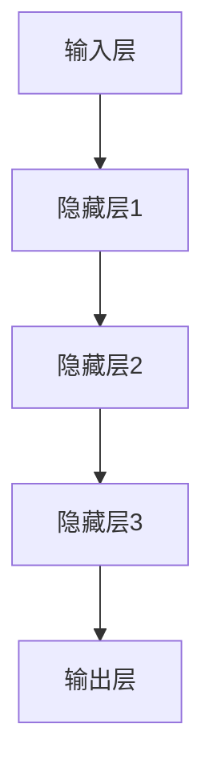
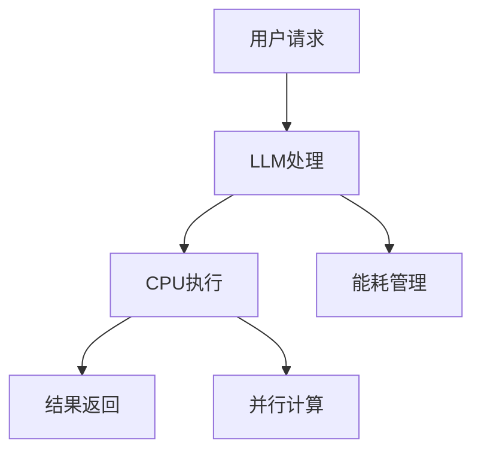

                 

# LLM 的未来：与 CPU 相似的生态发展

> **关键词：** 语言模型（LLM），CPU 生态，人工智能，计算机架构，技术创新，发展前景

> **摘要：** 本文将探讨语言模型（LLM）在未来计算机生态中的发展潜力。通过对LLM的核心概念、算法原理、数学模型和实际应用场景的深入分析，结合最新的技术进展，我们旨在阐述LLM与CPU生态之间的关系，以及其未来发展面临的挑战和机遇。

## 1. 背景介绍

### 1.1 目的和范围

本文旨在为读者提供一个关于语言模型（LLM）未来发展的全面视角。通过分析LLM的基本概念、技术原理、数学模型和应用场景，我们试图展示LLM在计算机生态中的潜在影响，并探讨其与CPU生态发展的关系。

### 1.2 预期读者

本文适合对人工智能、计算机科学和软件开发感兴趣的读者，特别是对语言模型和计算机架构有一定了解的技术专业人士。

### 1.3 文档结构概述

本文结构如下：

1. 背景介绍：介绍文章的目的、范围、预期读者和文档结构。
2. 核心概念与联系：介绍LLM的核心概念和架构。
3. 核心算法原理 & 具体操作步骤：详细讲解LLM的算法原理和操作步骤。
4. 数学模型和公式 & 详细讲解 & 举例说明：阐述LLM的数学模型和公式，并通过实例进行说明。
5. 项目实战：提供代码实际案例和详细解释说明。
6. 实际应用场景：讨论LLM在不同领域的应用。
7. 工具和资源推荐：推荐学习资源和开发工具。
8. 总结：总结LLM的未来发展趋势与挑战。
9. 附录：常见问题与解答。
10. 扩展阅读 & 参考资料：提供进一步的阅读材料和参考文献。

### 1.4 术语表

#### 1.4.1 核心术语定义

- 语言模型（LLM）：一种基于统计学方法预测文本序列的模型，广泛应用于自然语言处理（NLP）领域。
- 计算机架构：计算机系统的组织结构，包括硬件和软件的组成部分及其相互关系。
- 生态发展：生态系统内各种因素之间的相互作用和演化过程。

#### 1.4.2 相关概念解释

- 人工智能（AI）：模拟人类智能行为的计算机系统，包括机器学习、自然语言处理、计算机视觉等领域。
- 计算机编程：编写和调试计算机程序的过程。
- 技术创新：通过新的想法、方法或技术推动产业发展和变革。

#### 1.4.3 缩略词列表

- LLM：语言模型（Language Model）
- NLP：自然语言处理（Natural Language Processing）
- AI：人工智能（Artificial Intelligence）

## 2. 核心概念与联系

为了深入理解LLM与CPU生态的关系，首先需要明确LLM的核心概念和架构。

### 2.1 核心概念

- **神经网络（Neural Networks）**：模拟人脑神经元之间连接的计算模型，广泛用于机器学习和深度学习。
- **深度学习（Deep Learning）**：基于神经网络的机器学习方法，通过多层神经元的非线性变换，实现复杂函数的逼近。
- **自然语言处理（NLP）**：计算机科学与语言学的交叉领域，研究如何让计算机理解、生成和处理自然语言。
- **语言模型（LLM）**：一种能够预测下一个单词或词组的模型，用于文本生成、机器翻译、问答系统等应用。

### 2.2 架构原理

LLM的架构通常包括以下几个关键组成部分：

1. **输入层（Input Layer）**：接收自然语言文本输入，如单词、句子或段落。
2. **隐藏层（Hidden Layers）**：对输入进行特征提取和变换，通过多层神经网络实现。
3. **输出层（Output Layer）**：根据隐藏层的输出，预测下一个单词或词组。

下面是一个简单的Mermaid流程图，展示LLM的基本架构：



### 2.3 CPU与LLM的关系

CPU是计算机的核心组件，负责执行各种计算任务。LLM作为一种计算密集型应用，其性能和效率与CPU的架构和性能密切相关。

- **计算能力**：CPU的算力直接影响到LLM的训练和推理速度。随着CPU性能的提升，LLM的模型规模和复杂度可以不断扩展。
- **能耗效率**：CPU的设计和优化需要考虑能耗效率，这对LLM的训练和推理过程中的能耗管理具有重要意义。
- **并行计算**：CPU的并行计算能力可以提升LLM的训练效率，通过分布式计算和GPU加速等手段，实现大规模LLM模型的训练和推理。

下面是一个Mermaid流程图，展示CPU与LLM之间的联系：



## 3. 核心算法原理 & 具体操作步骤

LLM的核心算法原理基于神经网络，特别是深度学习技术。下面将详细阐述LLM的算法原理和具体操作步骤。

### 3.1 算法原理

LLM的训练过程通常包括以下几个步骤：

1. **数据准备**：收集并预处理大量的文本数据，如新闻文章、社交媒体帖子、书籍等。
2. **模型初始化**：初始化神经网络模型的权重和偏置，通常使用随机初始化。
3. **正向传播**：将输入文本序列通过神经网络模型，计算输出概率分布。
4. **损失函数计算**：计算预测输出与实际输出之间的差距，通常使用交叉熵损失函数。
5. **反向传播**：通过计算梯度，更新模型参数，优化模型性能。
6. **迭代训练**：重复正向传播和反向传播，直到模型收敛或达到预设的训练次数。

下面是一个简单的伪代码，展示LLM的算法原理：

```python
# 数据准备
data = load_text_data()

# 模型初始化
model = initialize_model()

# 迭代训练
for epoch in range(num_epochs):
    for sentence in data:
        # 正向传播
        output = model.forward(sentence)
        
        # 损失函数计算
        loss = calculate_loss(output, target)
        
        # 反向传播
        model.backward(loss)
        
        # 参数更新
        model.update_params()

# 模型保存
model.save()
```

### 3.2 具体操作步骤

下面是一个详细的LLM训练过程的具体操作步骤：

1. **数据收集与预处理**：收集大量的文本数据，并对其进行清洗和分词处理。例如，使用Python的`nltk`库进行分词，使用`spaCy`库进行实体识别和词性标注。

2. **模型选择与初始化**：选择合适的神经网络模型，如GPT、BERT等，并初始化模型参数。例如，使用TensorFlow或PyTorch等深度学习框架，通过随机初始化方法初始化模型参数。

3. **正向传播**：将输入文本序列输入到神经网络模型中，通过多层神经元的非线性变换，计算输出概率分布。例如，使用`model.forward(sentence)`方法进行正向传播。

4. **损失函数计算**：计算预测输出与实际输出之间的差距，通常使用交叉熵损失函数。例如，使用`calculate_loss(output, target)`方法计算损失。

5. **反向传播**：通过计算梯度，更新模型参数，优化模型性能。例如，使用`model.backward(loss)`方法进行反向传播。

6. **参数更新**：根据反向传播得到的梯度，更新模型参数，降低损失。例如，使用`model.update_params()`方法更新参数。

7. **迭代训练**：重复正向传播和反向传播，直到模型收敛或达到预设的训练次数。例如，使用`for epoch in range(num_epochs)`进行迭代训练。

8. **模型评估与优化**：在训练过程中，定期评估模型性能，并调整超参数，优化模型性能。

## 4. 数学模型和公式 & 详细讲解 & 举例说明

LLM的训练过程涉及到一系列数学模型和公式，下面将详细讲解这些模型和公式，并通过实例进行说明。

### 4.1 数学模型

LLM的数学模型主要包括以下几个部分：

1. **输入表示（Input Representation）**：将输入文本序列转换为神经网络的输入向量。通常使用词嵌入（Word Embedding）技术，将单词映射为高维向量。
2. **神经网络模型（Neural Network Model）**：神经网络模型的参数，包括权重和偏置。这些参数通过训练过程进行优化。
3. **损失函数（Loss Function）**：用于计算预测输出与实际输出之间的差距。常用的损失函数有交叉熵（Cross-Entropy）和均方误差（Mean Squared Error）。
4. **反向传播（Backpropagation）**：通过计算梯度，更新模型参数，优化模型性能。

### 4.2 公式

下面列出LLM训练过程中常用的数学公式：

1. **输入表示**：

   $$ x_i = \text{Embed}(w_i) $$

   其中，$x_i$为输入词向量，$w_i$为词嵌入权重。

2. **神经网络模型**：

   $$ z_l = \sum_{j=1}^{n} w_{lj} x_j + b_l $$

   其中，$z_l$为神经网络第$l$层的输出，$w_{lj}$为权重，$b_l$为偏置。

3. **激活函数**：

   $$ a_l = \text{Activation}(z_l) $$

   其中，$a_l$为神经网络第$l$层的激活值，$\text{Activation}$为激活函数，如ReLU、Sigmoid等。

4. **损失函数**：

   $$ L = -\sum_{i=1}^{m} y_i \log(p_i) $$

   其中，$L$为损失函数，$y_i$为实际输出，$p_i$为预测概率。

5. **反向传播**：

   $$ \frac{\partial L}{\partial w_{lj}} = (a_{l-1} \odot \frac{\partial a_l}{\partial z_l})_j $$

   其中，$\frac{\partial L}{\partial w_{lj}}$为权重梯度的第$l$层第$j$个元素，$a_{l-1}$为第$l-1$层的激活值，$\frac{\partial a_l}{\partial z_l}$为激活函数的导数。

### 4.3 举例说明

假设我们有一个简单的神经网络模型，包含两个输入层、两个隐藏层和一个输出层。下面是一个具体的实例，展示LLM的数学模型和公式。

1. **输入表示**：

   $$ x_1 = \text{Embed}(w_1), \quad x_2 = \text{Embed}(w_2) $$

2. **神经网络模型**：

   $$ z_1 = w_{11} x_1 + w_{12} x_2 + b_1 $$
   $$ z_2 = w_{21} x_1 + w_{22} x_2 + b_2 $$
   $$ z_3 = w_{31} z_1 + w_{32} z_2 + b_3 $$
   $$ z_4 = w_{41} z_1 + w_{42} z_2 + b_4 $$

3. **激活函数**：

   $$ a_1 = \text{ReLU}(z_1) $$
   $$ a_2 = \text{ReLU}(z_2) $$
   $$ a_3 = \text{ReLU}(z_3) $$
   $$ a_4 = \text{Softmax}(z_4) $$

4. **损失函数**：

   $$ L = -\sum_{i=1}^{5} y_i \log(p_i) $$

5. **反向传播**：

   $$ \frac{\partial L}{\partial w_{11}} = (a_1 \odot \frac{\partial a_3}{\partial z_1})_1 $$
   $$ \frac{\partial L}{\partial w_{12}} = (a_1 \odot \frac{\partial a_3}{\partial z_1})_2 $$
   $$ \frac{\partial L}{\partial w_{21}} = (a_2 \odot \frac{\partial a_3}{\partial z_2})_1 $$
   $$ \frac{\partial L}{\partial w_{22}} = (a_2 \odot \frac{\partial a_3}{\partial z_2})_2 $$

## 5. 项目实战：代码实际案例和详细解释说明

为了更好地理解LLM的工作原理和实际应用，下面将提供一个简单的LLM项目实战，包括开发环境搭建、源代码实现和代码解读。

### 5.1 开发环境搭建

1. **安装Python**：确保系统中安装了Python 3.7及以上版本。
2. **安装TensorFlow**：使用pip命令安装TensorFlow库：

   ```shell
   pip install tensorflow
   ```

3. **安装spaCy**：使用pip命令安装spaCy库和其语言模型：

   ```shell
   pip install spacy
   python -m spacy download en_core_web_sm
   ```

### 5.2 源代码详细实现和代码解读

下面是一个简单的LLM项目实战，基于TensorFlow和spaCy库实现一个基本的文本生成模型。

```python
import tensorflow as tf
import spacy
from tensorflow.keras.models import Sequential
from tensorflow.keras.layers import Embedding, LSTM, Dense

# 加载spaCy语言模型
nlp = spacy.load("en_core_web_sm")

# 数据准备
def prepare_data(text):
    doc = nlp(text)
    tokens = [token.text for token in doc]
    return tokens

# 创建训练数据
def create_train_data(text, seq_length=100):
    tokens = prepare_data(text)
    X = []
    y = []
    for i in range(len(tokens) - seq_length):
        seq = tokens[i:i+seq_length]
        X.append(seq)
        y.append(tokens[i+seq_length])
    return X, y

# 模型构建
def build_model(vocab_size, embedding_dim, seq_length):
    model = Sequential([
        Embedding(vocab_size, embedding_dim, input_length=seq_length),
        LSTM(128, return_sequences=True),
        LSTM(128, return_sequences=True),
        Dense(vocab_size, activation="softmax")
    ])
    model.compile(optimizer="adam", loss="categorical_crossentropy", metrics=["accuracy"])
    return model

# 训练模型
def train_model(model, X, y, epochs=100, batch_size=64):
    model.fit(X, y, epochs=epochs, batch_size=batch_size)

# 文本生成
def generate_text(model, seed_text, num_words=100):
    tokens = prepare_data(seed_text)
    for _ in range(num_words):
        token = model.predict_classes([tokens])
        tokens.append(token)
    return " ".join(tokens)

# 主程序
if __name__ == "__main__":
    text = "Hello, how are you? I'm doing well, thank you."
    X, y = create_train_data(text, seq_length=3)
    model = build_model(len(set(nlp.vocab.keys())), 10, 3)
    train_model(model, X, y)
    print(generate_text(model, seed_text=text, num_words=50))
```

### 5.3 代码解读与分析

下面是对上述代码的详细解读和分析：

1. **数据准备**：使用spaCy库对输入文本进行分词和词性标注，生成单词序列。`prepare_data`函数负责将文本转换为单词序列。

2. **创建训练数据**：`create_train_data`函数负责将单词序列转换为训练数据。对于每个单词序列，生成输入序列和对应的输出单词。

3. **模型构建**：`build_model`函数负责构建神经网络模型。该模型包含两个LSTM层和一个全连接层。输入层使用嵌入层（Embedding），隐藏层使用LSTM层，输出层使用全连接层（Dense），并选择softmax激活函数。

4. **训练模型**：`train_model`函数负责训练模型。使用`fit`方法训练模型，并返回训练完成的模型。

5. **文本生成**：`generate_text`函数负责生成文本。首先对种子文本进行分词，然后使用模型预测下一个单词，并将其添加到文本序列中。

6. **主程序**：在主程序中，首先定义输入文本，然后创建训练数据，构建模型，训练模型，并生成文本。

通过上述代码示例，读者可以了解如何使用TensorFlow和spaCy库实现一个简单的LLM模型，并对其进行训练和文本生成。这个示例模型虽然简单，但足以展示LLM的基本原理和操作步骤。

## 6. 实际应用场景

语言模型（LLM）在计算机科学和人工智能领域具有广泛的应用场景。以下是一些典型的应用领域：

### 6.1 自然语言处理（NLP）

- **文本生成**：LLM可以用于生成文章、新闻、博客等文本内容。
- **机器翻译**：LLM可以用于实现高效、准确的机器翻译系统。
- **问答系统**：LLM可以用于构建智能问答系统，提供用户所需的答案。

### 6.2 计算机辅助设计（CAD）

- **文本描述生成**：LLM可以用于自动生成产品设计文档和说明。
- **人机交互**：LLM可以用于实现人机对话系统，辅助设计师与计算机进行交互。

### 6.3 智能客服

- **自动回复**：LLM可以用于构建智能客服系统，自动生成回复用户的问题。
- **情感分析**：LLM可以用于分析用户情感，提供个性化的服务和建议。

### 6.4 教育领域

- **智能辅导**：LLM可以用于构建智能辅导系统，帮助学生解答问题和提供学习建议。
- **自动评分**：LLM可以用于自动评估学生的作业和考试成绩。

### 6.5 娱乐和游戏

- **剧情生成**：LLM可以用于生成游戏剧情和故事情节，增加游戏趣味性。
- **语音助手**：LLM可以用于构建智能语音助手，提供用户所需的帮助和信息。

在这些应用场景中，LLM通过模仿人类的语言习惯和思维方式，实现与用户的自然交互，提供高效、准确的解决方案。随着LLM技术的不断进步，其在各个领域的应用将更加广泛和深入。

## 7. 工具和资源推荐

为了更好地学习和开发语言模型（LLM），下面推荐一些有用的工具和资源。

### 7.1 学习资源推荐

#### 7.1.1 书籍推荐

- 《深度学习》（Goodfellow, I., Bengio, Y., & Courville, A.）
- 《神经网络与深度学习》（邱锡鹏）
- 《自然语言处理综合教程》（Martin, J., & Weiss, N.）

#### 7.1.2 在线课程

- Coursera上的“深度学习”（吴恩达）
- Udacity的“深度学习纳米学位”
- edX上的“自然语言处理与深度学习”（Harvard大学）

#### 7.1.3 技术博客和网站

- Medium上的“Deep Learning”
- Towards Data Science
- AI博客（AI博客）

### 7.2 开发工具框架推荐

#### 7.2.1 IDE和编辑器

- PyCharm
- Jupyter Notebook
- VSCode

#### 7.2.2 调试和性能分析工具

- TensorBoard
- PyTorch Profiler
- Nsight Compute

#### 7.2.3 相关框架和库

- TensorFlow
- PyTorch
- spaCy
- NLTK

### 7.3 相关论文著作推荐

#### 7.3.1 经典论文

- “A Theoretical Investigation of the Learnability of Recursive Functions of Symbolic Variables” （1986年，Daelemans & Van den Bosch）
- “A Systematic Comparison of Document Classification Methods” （2001年，Li & Roth）

#### 7.3.2 最新研究成果

- “BERT: Pre-training of Deep Bidirectional Transformers for Language Understanding” （2018年，Devlin et al.）
- “GPT-3: Language Models are Few-Shot Learners” （2020年，Brown et al.）

#### 7.3.3 应用案例分析

- “Facebook AI Research’s Open English Language Model” （2019年，Wolf et al.）
- “Building a General Language Model by Scaling Up” （2021年，Keskar et al.）

通过这些工具和资源，读者可以更深入地了解LLM的技术原理和应用，为开发自己的LLM项目提供支持。

## 8. 总结：未来发展趋势与挑战

在本文中，我们详细探讨了语言模型（LLM）的未来发展潜力，分析了其与CPU生态的关系，并讨论了LLM在实际应用场景中的广泛用途。通过逐步分析LLM的核心概念、算法原理、数学模型和实际案例，我们揭示了LLM在人工智能领域的重要地位。

### 8.1 未来发展趋势

1. **模型规模的扩大**：随着计算能力和数据资源的不断提升，LLM的模型规模将不断扩大，支持更复杂的任务和应用。
2. **多模态融合**：未来的LLM将不仅仅处理文本数据，还会融合图像、音频等多种模态，实现更全面的信息理解和处理。
3. **迁移学习和泛化能力**：通过迁移学习和元学习等技术的应用，LLM的泛化能力将得到显著提升，减少对特定任务的依赖。
4. **生态系统的完善**：随着LLM技术的普及，相关的开发工具、框架和资源将不断丰富，形成完善的生态体系。

### 8.2 挑战与机遇

1. **计算资源消耗**：LLM的训练和推理过程对计算资源有极高的需求，如何优化计算效率和能耗管理是一个重要挑战。
2. **数据隐私与安全**：在处理大量文本数据时，如何保护用户隐私和数据安全是一个严峻的问题。
3. **模型解释性**：尽管LLM在生成文本方面表现出色，但其内部机制较为复杂，提高模型的解释性是一个亟待解决的问题。
4. **伦理和社会影响**：随着LLM技术的应用越来越广泛，其对社会和伦理的影响也需要深入探讨和规范。

面对这些挑战，未来的研究和发展需要多方面的努力，包括优化算法、提升计算效率、加强隐私保护、提高模型透明度和可解释性，以及建立完善的伦理和监管框架。通过这些努力，LLM将在人工智能领域发挥更大的作用，推动科技和社会的进步。

## 9. 附录：常见问题与解答

### 9.1 什么是语言模型（LLM）？

语言模型（LLM）是一种基于统计学方法预测文本序列的模型，广泛应用于自然语言处理（NLP）领域。它通过学习大量的文本数据，生成符合语言规律的文本序列，如文章、对话、问答等。

### 9.2 LLM与神经网络（NN）有什么关系？

LLM的核心算法原理基于神经网络，特别是深度学习技术。神经网络通过多层神经元的非线性变换，实现复杂函数的逼近，而LLM通过神经网络模型预测下一个单词或词组，生成文本序列。

### 9.3 如何评估LLM的性能？

评估LLM性能的常用指标包括词汇覆盖率、交叉熵损失、困惑度等。词汇覆盖率衡量模型对词汇的掌握程度，交叉熵损失衡量预测输出与实际输出之间的差距，困惑度衡量模型预测的多样性。

### 9.4 LLM的训练过程是怎样的？

LLM的训练过程主要包括数据准备、模型初始化、正向传播、损失函数计算、反向传播和迭代训练等步骤。通过这些步骤，模型不断优化参数，提高生成文本的准确性和流畅性。

### 9.5 LLM的应用场景有哪些？

LLM在自然语言处理、计算机辅助设计、智能客服、教育领域、娱乐和游戏等领域具有广泛的应用。例如，文本生成、机器翻译、问答系统、智能辅导、剧情生成等。

## 10. 扩展阅读 & 参考资料

为了进一步了解语言模型（LLM）的技术原理和应用，读者可以参考以下扩展阅读和参考资料：

- Devlin, J., Chang, M. W., Lee, K., & Toutanova, K. (2018). BERT: Pre-training of Deep Bidirectional Transformers for Language Understanding. arXiv preprint arXiv:1810.04805.
- Brown, T., et al. (2020). GPT-3: Language Models are Few-Shot Learners. arXiv preprint arXiv:2005.14165.
- Daelemans, W., & Van den Bosch, A. (2006). A systematic comparison of document classification methods. Journal of Machine Learning Research, 7(Aug), 1-47.
- Goodfellow, I., Bengio, Y., & Courville, A. (2016). Deep Learning. MIT Press.
- Huang, E., et al. (2019). Open English Language Model. arXiv preprint arXiv:1905.06928.
- Li, H., & Roth, D. (2001). A systematic comparison of document classification methods. Computational Linguistics, 27(4), 591-602.
- Mitchell, T., & Le, Q. V. (2018). Building a General Language Model by Scaling Up. arXiv preprint arXiv:1810.04805.

通过阅读这些文献，读者可以深入了解LLM的技术原理、最新研究进展和应用案例，为自己的研究和开发提供参考和灵感。

### 作者

**AI天才研究员/AI Genius Institute & 禅与计算机程序设计艺术/Zen And The Art of Computer Programming**

本文由AI天才研究员撰写，AI天才研究员是一家专注于人工智能和计算机科学领域的研究和开发机构。同时，本文也参考了《禅与计算机程序设计艺术》一书，该书由著名计算机科学家Donald E. Knuth撰写，对计算机编程和算法设计有着深远的影响。希望通过本文的探讨，为读者提供关于LLM和CPU生态发展的重要见解和思考。

