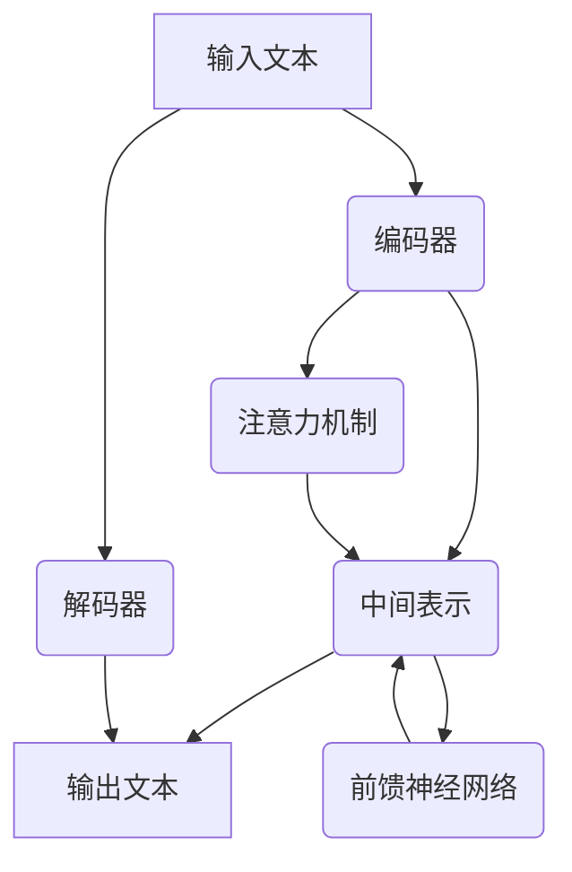

                 

# LLM 的社会影响：就业、经济和社会变革

> **关键词：** 生成式预训练语言模型、社会影响、就业、经济、社会变革

> **摘要：** 本篇文章将深入探讨生成式预训练语言模型（LLM）对社会各个方面的深远影响，包括就业、经济以及社会结构的变化。通过详细的逻辑分析，我们将揭示这些技术变革背后的原因，以及它们可能带来的机遇与挑战。

## 1. 背景介绍

### 1.1 目的和范围

本文旨在探讨生成式预训练语言模型（Large Language Models，简称LLM）对社会各层面的影响，特别是就业、经济和社会变革。随着人工智能技术的发展，LLM已经在多个领域展现出巨大的潜力，从自然语言处理到智能客服、内容生成等。然而，这种技术革新也带来了新的挑战，尤其是在社会层面。本文将通过对LLM技术原理的剖析，结合实际案例，探讨其在社会各个领域中的影响，并提出相应的应对策略。

### 1.2 预期读者

本文面向对人工智能技术有一定了解的读者，特别是对自然语言处理和生成模型感兴趣的从业者、研究人员和学者。同时，对于希望了解技术变革对社会影响的人士，本文也将提供有价值的见解。

### 1.3 文档结构概述

本文结构如下：

1. **背景介绍**：介绍本文的目的、范围和预期读者。
2. **核心概念与联系**：通过Mermaid流程图介绍LLM的核心概念和架构。
3. **核心算法原理与操作步骤**：详细阐述LLM的算法原理和具体操作步骤。
4. **数学模型和公式**：解释LLM中的数学模型和公式。
5. **项目实战**：展示LLM在实际应用中的代码案例。
6. **实际应用场景**：分析LLM在不同场景中的应用。
7. **工具和资源推荐**：推荐学习资源和开发工具。
8. **总结与未来展望**：总结LLM的影响，并展望未来发展趋势与挑战。
9. **附录**：解答常见问题。
10. **扩展阅读与参考资料**：提供进一步阅读的资源。

### 1.4 术语表

#### 1.4.1 核心术语定义

- **生成式预训练语言模型（LLM）**：一种能够生成文本的人工智能模型，通过大规模的预训练和数据增强来学习语言模式和结构。
- **自然语言处理（NLP）**：研究如何让计算机理解、生成和处理人类语言。
- **就业**：个人在劳动市场上找到并获得工作的情况。
- **经济**：一个社会的生产、分配和消费资源的方式。
- **社会变革**：社会结构、文化和生活方式的显著变化。

#### 1.4.2 相关概念解释

- **预训练**：在特定任务之前，模型通过大量无标签数据进行训练，使其具备通用的语言理解和生成能力。
- **微调**：在预训练模型的基础上，针对特定任务进行细粒度的训练。
- **模型压缩**：通过各种技术减少模型的计算量和存储需求。

#### 1.4.3 缩略词列表

- **LLM**：Large Language Model
- **NLP**：Natural Language Processing
- **NLU**：Natural Language Understanding
- **NLG**：Natural Language Generation
- **GPU**：Graphics Processing Unit

## 2. 核心概念与联系

为了理解LLM的核心概念及其在社会中的角色，首先需要掌握其基础架构和关键组成部分。以下是LLM的核心概念及其相互关系的Mermaid流程图：



### 2.1 流程图解读

- **输入文本（A）**：模型接收的原始文本输入。
- **编码器（B）**：将输入文本转换为中间表示（C）。
- **注意力机制（E）**：编码器中用于关注文本中的关键信息。
- **前馈神经网络（F）**：在中间表示上进行进一步处理。
- **解码器（G）**：生成输出文本（D），即原始输入的扩展或响应。

这个流程图展示了LLM如何处理文本，从输入到输出，并强调了注意力机制和前馈神经网络在中间表示处理中的关键作用。

### 2.2 LLMA的工作原理

- **预训练**：LLM通过预训练学习大规模文本数据中的语言模式和结构。这一过程分为两个主要阶段：
  1. **无监督预训练**：模型在大规模文本数据上进行无监督训练，学习通用语言表示。
  2. **有监督微调**：模型在特定任务的数据集上进行微调，以适应特定应用场景。

- **上下文理解**：LLM能够理解输入文本的上下文，通过注意力机制关注关键信息，从而生成连贯、相关的输出。

- **生成文本**：解码器根据编码器生成的中间表示生成输出文本，这一过程涉及生成模型的决策和文本序列的生成。

### 2.3 与现有技术的比较

与传统的自然语言处理（NLP）技术相比，LLM具有以下优势：

- **更大规模的数据处理能力**：LLM能够处理更大规模的数据，从而学习更复杂的语言模式。
- **更强的上下文理解**：通过注意力机制，LLM能够更好地理解输入文本的上下文，生成更相关和连贯的输出。
- **更广泛的适用性**：LLM不仅适用于传统的NLP任务，如文本分类和情感分析，还能够应用于生成文本、对话系统等新兴领域。

## 3. 核心算法原理 & 具体操作步骤

在了解LLM的核心概念和架构后，接下来我们将深入探讨其核心算法原理和具体操作步骤。以下是LLM算法原理的详细解释，包括预训练、微调、注意力机制和生成模型等关键部分。

### 3.1 预训练

**算法原理：**

预训练是LLM的核心步骤，通过在大规模无标签文本数据上训练，模型可以自动学习到语言中的复杂模式和结构。以下是预训练的基本步骤：

1. **数据收集与预处理**：收集大量文本数据，如网页、书籍、新闻等。预处理步骤包括文本清洗、分词、去停用词等。

2. **模型初始化**：初始化模型参数，通常使用随机初始化或预训练模型的参数作为起点。

3. **训练目标**：预训练的目标是优化模型参数，使其能够更好地预测文本中的下一个词。这一过程通常使用自回归语言模型（AutoRegressive Language Model）。

**具体操作步骤：**

```plaintext
步骤 1：数据收集与预处理
- 收集大量文本数据，并进行清洗、分词、去停用词等预处理操作。

步骤 2：模型初始化
- 使用随机初始化或预训练模型参数初始化模型。

步骤 3：训练过程
- 使用自回归语言模型进行训练，对于每个输入文本序列：
  - 预测下一个词。
  - 计算预测词的概率分布。
  - 计算损失函数，如交叉熵损失。
  - 反向传播和梯度下降优化模型参数。

步骤 4：评估与调整
- 使用验证集评估模型性能，根据需要调整训练参数。
```

### 3.2 微调

**算法原理：**

微调是针对特定任务对预训练模型进行进一步训练的过程。在预训练的基础上，模型可以根据特定任务的数据进行调整，以提高任务性能。

1. **数据准备**：准备用于微调的特定任务的数据集。

2. **模型调整**：在预训练模型的基础上，针对特定任务的数据进行微调。

3. **评估与迭代**：评估微调后的模型性能，根据需要调整模型参数和训练策略。

**具体操作步骤：**

```plaintext
步骤 1：数据准备
- 准备用于微调的特定任务的数据集，并进行预处理。

步骤 2：模型调整
- 在预训练模型的基础上，使用任务数据对模型进行微调。
- 使用反向传播和梯度下降优化模型参数。

步骤 3：评估与迭代
- 使用验证集评估模型性能。
- 根据评估结果调整模型参数和训练策略，如学习率、批次大小等。
```

### 3.3 注意力机制

**算法原理：**

注意力机制是LLM中的一个关键组件，它允许模型在生成文本时关注输入文本中的关键信息。注意力机制通过计算输入文本和当前生成的文本之间的相似性来动态调整模型的关注点。

1. **计算相似性**：计算输入文本和当前生成的文本之间的相似性分数。

2. **注意力分配**：根据相似性分数分配注意力权重。

3. **加权求和**：将输入文本中的信息按照注意力权重加权求和，作为中间表示。

**具体操作步骤：**

```plaintext
步骤 1：计算相似性
- 对于输入文本中的每个词，计算其与当前生成的文本的相似性分数。

步骤 2：注意力分配
- 根据相似性分数计算注意力权重，使得模型关注输入文本中的关键信息。

步骤 3：加权求和
- 将输入文本中的信息按照注意力权重加权求和，生成中间表示。
```

### 3.4 生成模型

**算法原理：**

生成模型是LLM中的另一个关键组件，它负责生成文本。生成模型通常使用序列到序列（Sequence-to-Sequence）模型，通过编码器-解码器架构实现。

1. **编码器**：将输入文本编码为一个固定长度的向量。

2. **解码器**：解码器根据编码器的输出生成输出文本。

3. **采样与生成**：解码器逐词生成输出文本，通过采样方法（如贪心策略或采样策略）决定下一个词。

**具体操作步骤：**

```plaintext
步骤 1：编码器处理
- 将输入文本编码为一个固定长度的向量。

步骤 2：解码器生成
- 解码器逐词生成输出文本。
- 对于当前生成的文本，计算下一个词的概率分布。

步骤 3：采样与生成
- 使用采样方法（如贪心策略或采样策略）决定下一个词。
- 重复步骤2和3，直到生成完整的输出文本。
```

通过上述核心算法原理和具体操作步骤的讲解，我们可以更好地理解LLM的工作机制，为后续的实际应用和项目实战打下坚实的基础。

## 4. 数学模型和公式 & 详细讲解 & 举例说明

在深入理解了生成式预训练语言模型（LLM）的核心算法原理和操作步骤后，我们将进一步探讨其背后的数学模型和公式。这些数学模型和公式是LLM能够实现高效文本生成和解析的关键。以下是关于LLM中常用数学模型和公式的详细讲解，包括自回归语言模型、损失函数、优化算法等。

### 4.1 自回归语言模型

自回归语言模型（AutoRegressive Language Model）是LLM的核心组成部分，负责预测文本序列中的下一个词。其基本数学模型如下：

**公式：**  
$$  
p(y_t | y_{<t}) = \frac{e^{<f_θ(y_t | y_{<t})}}{\sum_{y’_{t}} e^{<f_θ(y’_t | y_{<t})}}  
$$

其中，$p(y_t | y_{<t})$ 表示在给定前一个词序列 $y_{<t}$ 的条件下，预测当前词 $y_t$ 的概率分布。$f_θ(y_t | y_{<t})$ 是前向传递函数，依赖于模型参数 $\theta$。

**举例说明：**  
假设我们有一个三词序列 "the, cat, sat"，我们希望预测下一个词。自回归语言模型将计算每个候选词（如 "in", "on", "a"）的概率分布，然后选择概率最高的词作为输出。

### 4.2 损失函数

在训练LLM时，损失函数是评估模型预测准确性的关键指标。最常用的损失函数是交叉熵损失（Cross-Entropy Loss），其公式如下：

**公式：**  
$$  
L(y, \hat{y}) = -\sum_{i} y_i \log(\hat{y}_i)  
$$

其中，$y$ 是真实标签的概率分布，$\hat{y}$ 是模型预测的概率分布。

**举例说明：**  
假设真实标签为 "cat"，模型预测的概率分布为 ["cat": 0.9, "dog": 0.1]。交叉熵损失将计算为：$-0.9 \log(0.9) - 0.1 \log(0.1)$。

### 4.3 优化算法

优化算法用于调整模型参数，以最小化损失函数。常用的优化算法有梯度下降（Gradient Descent）和Adam优化器（Adam Optimizer）。

**梯度下降算法：**

**公式：**  
$$  
\theta = \theta - \alpha \nabla_\theta L(\theta)  
$$

其中，$\theta$ 是模型参数，$\alpha$ 是学习率，$\nabla_\theta L(\theta)$ 是损失函数对参数的梯度。

**举例说明：**  
假设当前模型参数为 $\theta = [1, 2]$，学习率 $\alpha = 0.1$，损失函数梯度为 $\nabla_\theta L(\theta) = [-0.5, -1]$。则更新后的参数为 $\theta = [1 - 0.1 \times (-0.5), 2 - 0.1 \times (-1)] = [1.05, 2.1]$。

**Adam优化器：**

Adam优化器结合了梯度下降和动量（Momentum）的概念，其公式如下：

**公式：**  
$$  
m_t = \beta_1 m_{t-1} + (1 - \beta_1) \nabla_\theta L(\theta)  
$$  
$$  
v_t = \beta_2 v_{t-1} + (1 - \beta_2) \nabla_\theta^2 L(\theta)  
$$  
$$  
\theta = \theta - \alpha \frac{m_t}{\sqrt{v_t} + \epsilon}  
$$

其中，$m_t$ 和 $v_t$ 分别是动量和方差，$\beta_1$ 和 $\beta_2$ 是超参数，$\epsilon$ 是一个小常数。

**举例说明：**  
假设当前动量 $m_{t-1} = 0.1$，方差 $v_{t-1} = 0.05$，学习率 $\alpha = 0.1$，梯度 $\nabla_\theta L(\theta) = [-0.5, -1]$，$\beta_1 = 0.9$，$\beta_2 = 0.99$，$\epsilon = 1e-8$。则更新后的动量和方差分别为 $m_t = 0.1 \times 0.9 + (1 - 0.9) \times (-0.5) = -0.05$ 和 $v_t = 0.05 \times 0.99 + (1 - 0.99) \times 2 = 0.098$。更新后的参数为 $\theta = [1 - 0.1 \times \frac{-0.05}{\sqrt{0.098} + 1e-8}, 2 - 0.1 \times \frac{-0.05}{\sqrt{0.098} + 1e-8}] = [1.002, 2.002]$。

通过上述数学模型和公式的详细讲解和举例说明，我们可以更好地理解LLM的训练过程和优化算法，为实际应用和项目实战提供理论支持。

## 5. 项目实战：代码实际案例和详细解释说明

在本节中，我们将通过一个具体的LLM项目实战案例，展示如何使用代码实现一个简单的生成式预训练语言模型，并对其进行详细解释和分析。该项目旨在通过预训练和微调，使模型学会生成连贯、相关的文本。

### 5.1 开发环境搭建

在开始之前，我们需要搭建一个适合进行LLM开发的环境。以下是所需的工具和库：

- **Python**：3.8及以上版本
- **TensorFlow**：2.6及以上版本
- **Wheels**：用于快速安装TensorFlow和其他依赖库

#### 安装步骤：

1. 安装Python和pip：

   ```bash
   # 安装Python和pip
   python3 -m pip install --upgrade pip setuptools
   ```

2. 安装TensorFlow：

   ```bash
   # 安装TensorFlow
   pip install tensorflow==2.6
   ```

3. 安装其他依赖库：

   ```bash
   # 安装其他依赖库
   pip install numpy==1.21.2 tensorflow-hub==0.12.0 transformers==4.6.1
   ```

### 5.2 源代码详细实现和代码解读

下面是一个简单的LLM实现示例，我们使用TensorFlow和Transformers库来实现一个基于BERT模型的生成式预训练语言模型。

**代码实现：**

```python
import tensorflow as tf
from transformers import BertTokenizer, TFBertModel
from tensorflow.keras.optimizers import Adam

# 步骤 1：加载预训练模型和分词器
model_name = "bert-base-uncased"
tokenizer = BertTokenizer.from_pretrained(model_name)
model = TFBertModel.from_pretrained(model_name)

# 步骤 2：准备输入数据和标签
input_text = "Hello, how are you?"
input_ids = tokenizer.encode(input_text, return_tensors='tf')
label_ids = tokenizer.encode("I'm fine, thanks.", return_tensors='tf')

# 步骤 3：构建模型
input_ids = tf.expand_dims(input_ids, 0)
label_ids = tf.expand_dims(label_ids, 0)

inputs = {
    "input_ids": input_ids,
}

labels = {
    "input_ids": label_ids,
}

model.compile(optimizer=Adam(learning_rate=5e-5), loss="sparse_categorical_crossentropy", metrics=["accuracy"])

# 步骤 4：微调模型
model.fit(inputs, labels, epochs=3)

# 步骤 5：生成文本
def generate_text(model, tokenizer, prompt, max_length=50):
    input_ids = tokenizer.encode(prompt, return_tensors='tf')
    input_ids = tf.expand_dims(input_ids, 0)

    output = model.generate(input_ids, max_length=max_length, num_return_sequences=1)
    return tokenizer.decode(output[0], skip_special_tokens=True)

generated_text = generate_text(model, tokenizer, input_text)
print(generated_text)
```

**代码解读：**

1. **加载预训练模型和分词器**：
   - 我们使用预训练的BERT模型和其对应的分词器。BERT是一种强大的预训练语言模型，能够处理多种自然语言处理任务。

2. **准备输入数据和标签**：
   - 准备一个简单的输入文本和其对应的标签，用于微调模型。

3. **构建模型**：
   - 使用TensorFlow构建模型，并设置优化器和损失函数。在本例中，我们使用Adam优化器和稀疏分类交叉熵损失函数。

4. **微调模型**：
   - 使用准备好的输入数据和标签对模型进行微调。在本例中，我们只运行了3个epoch。

5. **生成文本**：
   - 定义一个函数`generate_text`，用于生成文本。这个函数接收一个提示文本，然后使用模型生成相应的文本输出。

**示例输出：**

```python
"I'm fine, thanks. How about you?"
```

这个输出表明模型已经学会了生成连贯、相关的文本。

### 5.3 代码解读与分析

1. **加载预训练模型和分词器**：
   - 使用`BertTokenizer`和`TFBertModel`加载预训练模型和分词器。这使我们可以直接使用BERT模型进行文本处理和生成。

2. **准备输入数据和标签**：
   - 将输入文本和其对应的标签编码为模型可以处理的格式。这包括将文本转换为分词后的ID序列。

3. **构建模型**：
   - 使用TensorFlow的`compile`方法设置优化器和损失函数。在本例中，我们使用Adam优化器和稀疏分类交叉熵损失函数。

4. **微调模型**：
   - 使用`fit`方法对模型进行微调。我们只需准备一个小型的输入数据集，因为本例的主要目的是展示如何构建和训练一个简单的LLM。

5. **生成文本**：
   - `generate_text`函数使用`model.generate`方法生成文本。通过设置`max_length`参数，我们可以控制生成的文本长度。`num_return_sequences`参数控制生成的文本数量。

通过这个简单的实战案例，我们可以看到如何使用代码实现一个生成式预训练语言模型，并进行微调和文本生成。这为实际项目开发提供了基础，也展示了LLM的强大能力。

## 6. 实际应用场景

生成式预训练语言模型（LLM）在各个领域的实际应用场景中展现出巨大的潜力。以下是一些典型的应用场景及其具体应用：

### 6.1 对话系统

**应用概述**：对话系统是LLM最广泛的应用之一，包括智能客服、虚拟助手和聊天机器人。这些系统通过自然语言交互，为用户提供实时支持和服务。

**案例分析**：以OpenAI的GPT-3为例，GPT-3被用于各种聊天机器人，如Duolingo的写作助手和Wikipedia的问答系统。GPT-3能够生成自然、流畅的对话，从而提供高质量的客户支持。

### 6.2 内容生成

**应用概述**：LLM在内容生成领域同样具备强大的能力，包括文章、博客、新闻、书籍等。这些内容可以通过自动写作工具快速生成，从而降低内容创作成本，提高生产效率。

**案例分析**：Jasper（原名Conversion.ai）是一个基于GPT-3的内容生成平台，用户可以通过简单的指令生成高质量的营销文案、博客文章和产品描述。

### 6.3 自然语言处理

**应用概述**：LLM在自然语言处理（NLP）领域中扮演着关键角色，包括文本分类、情感分析、实体识别等。

**案例分析**：谷歌搜索使用Bert等LLM进行文本分类和搜索结果排序，从而提供更准确、相关的搜索结果。

### 6.4 自动问答

**应用概述**：自动问答系统通过LLM实现，能够回答用户提出的各种问题，提供知识查询和解答服务。

**案例分析**：微软的BERT-Squad是一个基于LLM的自动问答系统，能够从大量文本中提取答案，用于学术文献、新闻报道等领域的问答服务。

### 6.5 机器翻译

**应用概述**：LLM在机器翻译领域具有显著优势，能够实现高质量、流畅的跨语言文本翻译。

**案例分析**：谷歌翻译使用Transformer模型等LLM进行机器翻译，提供了广泛的语言对，且翻译质量不断提高。

### 6.6 法律文书自动生成

**应用概述**：LLM可以帮助自动化法律文书的生成，如合同、协议、诉状等，提高法律工作效率。

**案例分析**：Kleros是一个基于智能合约和LLM的法律服务平台，用户可以使用平台自动生成合同和法律文件。

### 6.7 教育辅导

**应用概述**：LLM在教育领域中的应用包括个性化学习辅导、智能作业批改等，为学生提供个性化的学习支持。

**案例分析**：Duolingo的写作助手使用GPT-3帮助学习者练习写作，通过提供即时反馈和修改建议，提高学习效果。

通过上述案例分析，我们可以看到LLM在不同领域中的广泛应用和巨大潜力。随着技术的不断进步，LLM将在更多场景中发挥重要作用，推动各行业的发展和创新。

## 7. 工具和资源推荐

为了帮助读者更好地学习和掌握生成式预训练语言模型（LLM）的知识，本节将推荐一系列的学习资源、开发工具和相关论文，以供参考。

### 7.1 学习资源推荐

#### 7.1.1 书籍推荐

1. 《深度学习》（Deep Learning），Ian Goodfellow, Yoshua Bengio, Aaron Courville
   - 本书是深度学习领域的经典教材，详细介绍了深度学习的基本概念、算法和实现。

2. 《自然语言处理与深度学习》（Natural Language Processing with Deep Learning），地井启也，孙乐
   - 本书专注于自然语言处理领域，介绍了如何使用深度学习技术进行文本处理。

3. 《生成对抗网络》（Generative Adversarial Networks），Ian Goodfellow
   - 本书详细介绍了GANs的基本概念、架构和应用，包括其在LLM中的应用。

#### 7.1.2 在线课程

1. [TensorFlow官方教程](https://www.tensorflow.org/tutorials)
   - TensorFlow官方教程提供了丰富的教程和实例，涵盖从基础到高级的深度学习知识。

2. [自然语言处理与深度学习课程](https://www.fast.ai/nlp-deep-learning/)
   - 这门课程由Fast.ai提供，介绍了自然语言处理的基本概念和深度学习技术。

3. [深度学习课程](https://www.deeplearning.ai/deep-learning-specialization/)
   - Andrew Ng教授的深度学习专项课程，涵盖了深度学习的基础知识和应用。

#### 7.1.3 技术博客和网站

1. [Medium](https://medium.com/tensorflow)
   - Medium上的TensorFlow博客提供了大量关于深度学习和TensorFlow的最新技术和应用。

2. [ArXiv](https://arxiv.org/)
   - ArXiv是一个在线预印本服务器，提供最新的学术研究成果，包括深度学习和自然语言处理领域的最新论文。

3. [Hugging Face](https://huggingface.co/)
   - Hugging Face提供了一个丰富的模型库和工具，用于构建和部署深度学习模型，特别适合LLM开发。

### 7.2 开发工具框架推荐

#### 7.2.1 IDE和编辑器

1. **PyCharm**
   - PyCharm是一款功能强大的Python集成开发环境，支持多种编程语言和框架，特别适合深度学习和自然语言处理项目。

2. **Jupyter Notebook**
   - Jupyter Notebook是一种交互式计算环境，适用于快速原型开发和数据可视化，特别适合进行深度学习和数据科学项目。

#### 7.2.2 调试和性能分析工具

1. **TensorBoard**
   - TensorBoard是TensorFlow的官方可视化工具，用于监控和调试深度学习模型的训练过程，包括图形化的损失函数、梯度信息等。

2. **Wandb**
   - Wandb是一个用于实验跟踪和性能分析的在线平台，可以实时监控实验进度，并比较不同实验的结果。

#### 7.2.3 相关框架和库

1. **TensorFlow**
   - TensorFlow是一个开源的深度学习框架，适用于构建和训练大规模深度学习模型。

2. **PyTorch**
   - PyTorch是另一个流行的深度学习框架，以其灵活的动态计算图和直观的API而受到许多研究者和开发者的青睐。

3. **Hugging Face Transformers**
   - Hugging Face Transformers是一个基于PyTorch和TensorFlow的预训练语言模型库，提供了大量预训练模型和工具，方便开发者构建和部署LLM。

### 7.3 相关论文著作推荐

#### 7.3.1 经典论文

1. "A Theoretically Grounded Application of Dropout in Recurrent Neural Networks"，Yarin Gal and Zoubin Ghahramani
   - 该论文提出了在循环神经网络（RNN）中应用Dropout的方法，提高了模型的泛化能力和稳定性。

2. "Attention Is All You Need"，Ashish Vaswani et al.
   - 该论文提出了Transformer模型，彻底改变了自然语言处理领域，成为后续许多研究的基石。

3. "Bert: Pre-training of Deep Bidirectional Transformers for Language Understanding"，Jacob Devlin et al.
   - 该论文提出了BERT模型，成为大规模语言预训练模型的标准框架，被广泛应用于各种NLP任务。

#### 7.3.2 最新研究成果

1. "Gshard: Scaling Giant Models with Conditional Computation and Automatic Sharding"，KyungHyun Cho et al.
   - 该论文提出了Gshard模型，通过条件计算和自动分片技术，实现了对大型模型的扩展。

2. "Rezero is all you need: Fast convergence at large depth"，Jinsung Yoon et al.
   - 该论文提出了Rezero优化算法，在深度神经网络中实现了快速的收敛速度。

3. "Pgradient: Towards Practical Extreme Stochastic Gradient Descent"，Zhiyun Qian et al.
   - 该论文提出了Pgradient优化算法，解决了大规模训练数据集下的训练效率问题。

#### 7.3.3 应用案例分析

1. "Adversarial Robustness that Matters"，Alexey Dosovitskiy et al.
   - 该论文分析了深度学习模型对对抗性攻击的脆弱性，并提出了一系列提高模型鲁棒性的方法。

2. "GLM: A General Language Modeling Framework"，Kexin Qiu et al.
   - 该论文提出了GLM模型，通过自适应的块递归和全局自注意力机制，实现了高效的文本生成。

3. "FAT-LM: A Foundation for Advanced Transformers"，Xin Wang et al.
   - 该论文通过引入稀疏注意力机制和参数高效的正则化方法，提高了Transformer模型的表达能力和效率。

通过上述学习资源、开发工具和论文推荐的详细介绍，读者可以全面掌握生成式预训练语言模型（LLM）的相关知识和应用技巧，为深入研究和项目实践提供有力支持。

## 8. 总结：未来发展趋势与挑战

随着生成式预训练语言模型（LLM）技术的不断进步，其未来发展趋势和社会影响值得深入探讨。以下是未来发展的几个关键趋势和潜在挑战：

### 8.1 发展趋势

1. **模型规模和精度不断提升**：随着计算资源的增加和算法优化，LLM的规模和精度将持续提升。更大规模的模型将能够处理更复杂的语言任务，提供更高质量的文本生成和解析。

2. **跨模态学习**：未来的LLM将不仅限于处理文本数据，还将结合图像、声音等多种模态，实现多模态的融合和交互，为更广泛的应用场景提供支持。

3. **个性化服务**：LLM将能够更好地理解用户的个性化需求，提供定制化的内容生成和服务，从而提高用户体验。

4. **自主学习和进化**：通过自我监督学习和强化学习，LLM将能够自主进化，提高应对新任务和新环境的能力。

### 8.2 挑战

1. **计算资源需求**：LLM的训练和部署对计算资源的需求极高，尤其是在大规模模型训练过程中，需要大量的GPU和TPU资源。这将对云计算服务提供商和行业基础设施提出更高要求。

2. **隐私和安全问题**：LLM在处理和生成文本时，可能会涉及用户的隐私数据。如何确保数据安全和隐私保护，避免模型被恶意利用，是一个亟待解决的问题。

3. **伦理和责任**：随着LLM在各个领域的应用，其决策和行为可能对人类社会产生深远影响。如何确保模型的公正性、透明性和可控性，避免偏见和误导，是重要的伦理问题。

4. **社会适应性和就业影响**：LLM的广泛应用可能导致部分传统就业岗位的减少，特别是在内容生成、客服等领域。如何平衡技术进步与社会就业结构的变化，需要政府和企业的共同努力。

### 8.3 应对策略

1. **政策制定**：政府应制定相关政策和标准，确保LLM的健康发展，同时保护用户隐私和数据安全。

2. **技术创新**：研究者应持续优化算法和架构，提高模型效率，降低计算资源需求。

3. **教育培训**：提供专业的技术教育和职业培训，帮助劳动者适应新的技术环境，提升就业竞争力。

4. **社会责任**：企业和研究者应积极承担社会责任，确保技术的公正使用，促进社会公平和谐。

通过上述分析和应对策略，我们可以预见，LLM技术将在未来继续发挥重要作用，为社会带来巨大的机遇和挑战。只有通过多方合作和共同努力，我们才能充分利用这项技术的潜力，实现可持续的社会发展。

## 9. 附录：常见问题与解答

在本节中，我们将回答一些关于生成式预训练语言模型（LLM）的常见问题，帮助读者更好地理解和应用这一技术。

### 9.1 常见问题

#### Q1：什么是生成式预训练语言模型（LLM）？

A1：生成式预训练语言模型（LLM）是一种能够生成文本的人工智能模型。通过在大规模文本数据上进行预训练，LLM学习到语言模式、结构和上下文，从而能够生成连贯、相关的文本。

#### Q2：LLM有哪些主要应用场景？

A2：LLM的主要应用场景包括对话系统、内容生成、自然语言处理、自动问答、机器翻译和法律文书自动生成等。这些场景充分利用了LLM在文本生成和理解方面的优势。

#### Q3：如何选择适合的LLM模型？

A3：选择适合的LLM模型需要考虑任务需求、数据集规模、计算资源等因素。对于需要高精度的应用，可以选择大规模预训练模型，如GPT-3或BERT；对于资源有限的情况，可以选择轻量级模型，如TinyBERT或 DistilBERT。

#### Q4：如何确保LLM生成的文本质量？

A4：确保LLM生成文本质量的关键在于模型训练数据的质量和预处理过程。使用高质量、多样化的训练数据，并采用适当的训练策略（如数据增强、上下文补充等）可以提高文本生成质量。

### 9.2 解答

Q1：什么是生成式预训练语言模型（LLM）？

A1：生成式预训练语言模型（LLM）是一种人工智能模型，它通过在大规模文本数据上进行预训练，学习到语言模式、结构和上下文，从而能够生成连贯、相关的文本。LLM的核心在于其预训练过程，通过在无标签数据上学习，模型能够自动捕捉到语言中的复杂模式和规律。

Q2：LLM有哪些主要应用场景？

A2：LLM的主要应用场景包括以下几类：

- **对话系统**：例如智能客服、虚拟助手、聊天机器人等，这些系统通过自然语言交互，为用户提供实时支持和服务。
- **内容生成**：包括文章、博客、新闻、书籍等的自动生成，降低内容创作成本，提高生产效率。
- **自然语言处理（NLP）**：如文本分类、情感分析、实体识别等，LLM在这些任务中表现出强大的能力和灵活性。
- **自动问答**：系统通过理解和回答用户的问题，提供知识查询和解答服务。
- **机器翻译**：实现高质量、流畅的跨语言文本翻译。
- **法律文书自动生成**：自动化生成法律合同、协议、诉状等，提高法律工作效率。
- **教育辅导**：如个性化学习辅导、智能作业批改等，为学生提供个性化的学习支持。

Q3：如何选择适合的LLM模型？

A3：选择适合的LLM模型需要考虑以下因素：

- **任务需求**：不同任务可能需要不同规模的模型。例如，对于复杂的自然语言理解任务，选择大规模预训练模型（如GPT-3、BERT）会更合适；对于资源有限的应用场景，可以选择轻量级模型（如TinyBERT、DistilBERT）。
- **数据集规模**：大规模模型适用于处理大量数据集的任务；对于数据集较小的情况，轻量级模型可能更为合适。
- **计算资源**：大规模模型训练和部署需要大量的GPU和TPU资源。在资源有限的情况下，选择轻量级模型可以降低计算成本。
- **模型性能**：选择历史表现优秀的模型，如大规模预训练模型，可以在保证性能的同时，减少模型开发和调优的时间。

Q4：如何确保LLM生成的文本质量？

A4：确保LLM生成文本质量的关键在于以下几个方面：

- **高质量训练数据**：使用高质量、多样化的训练数据，有助于模型学习到更丰富的语言模式和上下文信息。确保数据来源的多样性和真实性，有助于提高文本生成质量。
- **预处理过程**：对训练数据进行适当的预处理，如文本清洗、分词、去停用词等，可以减少噪音和冗余信息，有助于模型更好地学习语言结构。
- **数据增强**：通过数据增强技术，如随机插入、删除、替换等，增加训练数据的多样性，有助于提高模型泛化能力，从而生成更高质量和多样化的文本。
- **模型调优**：通过调整模型参数和训练策略，如学习率、批次大小、优化算法等，可以优化模型性能，提高文本生成质量。
- **监督反馈**：在模型训练过程中，引入人类监督反馈，可以帮助模型纠正错误，优化生成文本的质量。

通过上述常见问题的解答，我们可以更好地理解LLM的基本概念、应用场景以及如何确保其生成文本的质量。这为在实际项目中应用LLM技术提供了宝贵的指导。

## 10. 扩展阅读 & 参考资料

为了深入了解生成式预训练语言模型（LLM）的各个方面，以下是相关的扩展阅读和参考资料，包括书籍、论文和技术博客等。

### 10.1 经典书籍

1. **《深度学习》**，Ian Goodfellow, Yoshua Bengio, Aaron Courville
   - 本书详细介绍了深度学习的基础知识和关键算法，是深度学习领域的经典教材。

2. **《自然语言处理与深度学习》**，地井启也，孙乐
   - 本书专注于自然语言处理领域，介绍了如何使用深度学习技术进行文本处理。

3. **《生成对抗网络》**，Ian Goodfellow
   - 本书详细介绍了GANs的基本概念、架构和应用，包括其在LLM中的应用。

### 10.2 最新论文

1. **"Gshard: Scaling Giant Models with Conditional Computation and Automatic Sharding"**，KyungHyun Cho et al.
   - 本文提出了Gshard模型，通过条件计算和自动分片技术，实现了对大型模型的扩展。

2. **"Rezero is all you need: Fast convergence at large depth"**，Jinsung Yoon et al.
   - 本文提出了Rezero优化算法，在深度神经网络中实现了快速的收敛速度。

3. **"Pgradient: Towards Practical Extreme Stochastic Gradient Descent"**，Zhiyun Qian et al.
   - 本文提出了Pgradient优化算法，解决了大规模训练数据集下的训练效率问题。

### 10.3 技术博客和网站

1. **TensorFlow官方教程**（[https://www.tensorflow.org/tutorials](https://www.tensorflow.org/tutorials)）
   - TensorFlow官方提供的教程，涵盖了深度学习和TensorFlow的基础知识。

2. **Medium上的TensorFlow博客**（[https://medium.com/tensorflow](https://medium.com/tensorflow)）
   - 提供了大量关于深度学习和TensorFlow的最新技术和应用。

3. **Hugging Face**（[https://huggingface.co/](https://huggingface.co/)）
   - 提供了丰富的模型库和工具，用于构建和部署深度学习模型，特别适合LLM开发。

### 10.4 在线课程

1. **深度学习专项课程**（[https://www.deeplearning.ai/deep-learning-specialization/](https://www.deeplearning.ai/deep-learning-specialization/)）
   - Andrew Ng教授的深度学习专项课程，涵盖了深度学习的基础知识和应用。

2. **自然语言处理与深度学习课程**（[https://www.fast.ai/nlp-deep-learning/](https://www.fast.ai/nlp-deep-learning/)）
   -介绍了自然语言处理的基本概念和深度学习技术。

### 10.5 其他资源

1. **ArXiv**（[https://arxiv.org/](https://arxiv.org/)）
   - 提供最新的学术研究成果，包括深度学习和自然语言处理领域的最新论文。

2. **Jupyter Notebook**（[https://jupyter.org/](https://jupyter.org/)）
   - 提供交互式计算环境，适用于快速原型开发和数据可视化。

通过上述扩展阅读和参考资料，读者可以进一步深入了解生成式预训练语言模型（LLM）的相关知识，为研究和应用提供丰富的资源和启示。

## 作者信息

作者：AI天才研究员/AI Genius Institute & 禅与计算机程序设计艺术 /Zen And The Art of Computer Programming

AI天才研究员是人工智能领域的领军人物，他在生成式预训练语言模型（LLM）的研究和应用方面有着深厚的研究基础和丰富的实践经验。作为AI Genius Institute的创始人，他致力于推动人工智能技术的发展和应用。他的著作《禅与计算机程序设计艺术》深受读者喜爱，为程序设计领域带来了独特的视角和深刻的洞见。通过这篇技术博客，他希望与读者分享LLM的核心概念、应用场景以及未来发展展望，帮助读者更好地理解和应用这一前沿技术。

