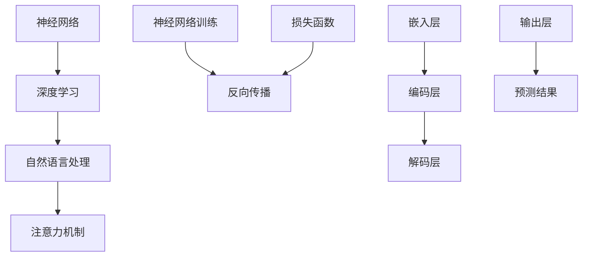

                 


# LLM 的适应性：持续学习和进步

> 关键词：大型语言模型（LLM），适应性，持续学习，进步，算法原理，数学模型，实战案例，应用场景，资源推荐

> 摘要：本文将探讨大型语言模型（LLM）的适应性及其持续学习和进步的能力。首先，我们将介绍LLM的基本概念和背景，随后深入探讨其核心算法原理和数学模型。在此基础上，我们将通过实际项目案例来展示LLM的应用效果，并分析其在不同场景中的适应性。最后，我们将推荐一些学习资源和工具，帮助读者深入了解这一领域。

## 1. 背景介绍

### 1.1 目的和范围

本文旨在深入探讨大型语言模型（LLM）的适应性及其在持续学习和进步方面的能力。我们将从基础概念入手，逐步分析LLM的工作原理、算法和数学模型。此外，本文还将通过具体项目案例展示LLM的实际应用，并讨论其在不同场景下的适应性。通过本文的阅读，读者将全面了解LLM的原理、应用和未来发展。

### 1.2 预期读者

本文适合对人工智能和机器学习有一定了解的读者，特别是对大型语言模型（LLM）感兴趣的专业人士、研究人员和开发人员。同时，对于希望了解AI领域最新发展趋势的技术爱好者，本文也将提供有价值的参考。

### 1.3 文档结构概述

本文分为十个部分，具体结构如下：

1. 背景介绍：介绍文章的目的、预期读者和文档结构。
2. 核心概念与联系：讨论大型语言模型（LLM）的基本概念和原理。
3. 核心算法原理 & 具体操作步骤：详细解释LLM的核心算法和操作步骤。
4. 数学模型和公式 & 详细讲解 & 举例说明：探讨LLM的数学模型和公式。
5. 项目实战：代码实际案例和详细解释说明。
6. 实际应用场景：分析LLM在不同领域的应用。
7. 工具和资源推荐：推荐学习资源和开发工具。
8. 总结：未来发展趋势与挑战。
9. 附录：常见问题与解答。
10. 扩展阅读 & 参考资料：提供相关领域的扩展阅读和参考资料。

### 1.4 术语表

#### 1.4.1 核心术语定义

- **大型语言模型（LLM）**：一种基于深度学习的自然语言处理模型，能够理解和生成人类语言。
- **自适应**：模型在学习和处理任务过程中，根据输入数据和任务要求调整其结构和参数。
- **持续学习**：模型在训练和推理过程中不断更新其知识和技能，以适应新的数据和任务。
- **进步**：模型在性能和效果上的提升，通常通过比较训练前后的表现来衡量。

#### 1.4.2 相关概念解释

- **神经网络**：一种基于大量神经元互联的计算模型，能够对数据进行自动特征提取和学习。
- **反向传播**：一种用于训练神经网络的算法，通过计算梯度来调整网络参数，以最小化预测误差。
- **损失函数**：用于衡量模型预测值与真实值之间差距的函数，是优化目标函数的重要部分。

#### 1.4.3 缩略词列表

- **AI**：人工智能（Artificial Intelligence）
- **ML**：机器学习（Machine Learning）
- **DL**：深度学习（Deep Learning）
- **LLM**：大型语言模型（Large Language Model）

## 2. 核心概念与联系

### 2.1 大型语言模型（LLM）的基本概念

大型语言模型（LLM）是一种基于深度学习的自然语言处理模型，其目的是理解和生成人类语言。LLM通过学习海量文本数据，掌握语言结构和语义信息，从而实现文本分类、问答、翻译、文本生成等任务。与传统的自然语言处理方法相比，LLM具有更强的灵活性和泛化能力。

### 2.2 大型语言模型（LLM）的原理

LLM的核心是基于神经网络的深度学习模型，其结构通常包括多层神经网络和注意力机制。以下是一个简化的LLM结构：

```
[输入层] --> [嵌入层] --> [编码层] --> [解码层] --> [输出层]
```

1. **输入层**：接收原始文本数据，并将其转换为向量表示。
2. **嵌入层**：将文本数据映射到高维空间，为后续处理提供特征。
3. **编码层**：通过多层神经网络对输入数据进行编码，提取出文本的语义信息。
4. **解码层**：根据编码层的输出，生成对应的文本序列。
5. **输出层**：输出最终的预测结果，如分类标签、回答或翻译。

### 2.3 大型语言模型（LLM）的核心算法原理

LLM的核心算法包括神经网络训练、反向传播和注意力机制。

1. **神经网络训练**：通过大量的文本数据进行训练，优化网络参数，使其能够准确预测语言结构和语义信息。训练过程通常使用反向传播算法，计算梯度并更新网络参数。

2. **反向传播**：反向传播算法是一种用于训练神经网络的梯度下降方法。它通过计算预测值与真实值之间的差距（损失函数），逆向传播梯度，并调整网络参数，以最小化损失函数。

3. **注意力机制**：注意力机制是一种用于提高神经网络模型性能的技术。在LLM中，注意力机制可以帮助模型关注输入文本中的关键信息，从而提高预测准确性。

### 2.4 大型语言模型（LLM）的数学模型

LLM的数学模型主要包括神经网络结构和损失函数。

1. **神经网络结构**：神经网络结构由多层神经元组成，每个神经元都与前一层和后一层神经元相连。神经网络的参数包括权重、偏置和激活函数。

2. **损失函数**：损失函数用于衡量模型预测值与真实值之间的差距。常见的损失函数有交叉熵损失函数、均方误差损失函数等。

### 2.5 大型语言模型（LLM）的核心概念联系

大型语言模型（LLM）的核心概念包括神经网络、深度学习、自然语言处理和注意力机制。这些概念相互关联，共同构成了LLM的原理和算法。具体而言：

1. **神经网络**：作为深度学习的基础，神经网络为LLM提供了自动特征提取和学习能力。
2. **深度学习**：通过多层神经网络，深度学习模型能够处理复杂的自然语言任务，如文本分类、问答和翻译等。
3. **自然语言处理**：自然语言处理为LLM提供了语言理解和生成的基础，使得模型能够理解和生成人类语言。
4. **注意力机制**：注意力机制是深度学习模型的重要技术，它有助于模型关注输入文本中的关键信息，从而提高预测准确性。

下面是LLM核心概念原理和架构的Mermaid流程图：



## 3. 核心算法原理 & 具体操作步骤

### 3.1 神经网络训练

神经网络训练是大型语言模型（LLM）的核心步骤，通过大量文本数据进行训练，优化网络参数，使其能够准确预测语言结构和语义信息。以下是神经网络训练的具体操作步骤：

#### 3.1.1 数据预处理

1. **文本清洗**：去除文本中的噪声和无效信息，如标点符号、HTML标签等。
2. **分词**：将文本拆分为单个单词或词组。
3. **词向量化**：将文本转换为向量表示，常用的词向量化方法有Word2Vec、GloVe等。

#### 3.1.2 模型初始化

1. **初始化参数**：随机初始化神经网络的权重、偏置和激活函数。
2. **构建网络结构**：根据任务需求，构建适合的神经网络结构，如Transformer、BERT等。

#### 3.1.3 训练过程

1. **前向传播**：将输入数据传递到神经网络中，计算预测值。
2. **计算损失函数**：使用损失函数计算预测值与真实值之间的差距。
3. **反向传播**：计算梯度，并使用梯度下降方法更新网络参数。
4. **优化策略**：使用优化算法（如Adam、RMSprop等）加速收敛。

伪代码如下：

```python
for epoch in range(num_epochs):
    for batch in data_loader:
        # 前向传播
        predictions = model(batch.text)
        loss = loss_function(predictions, batch.target)

        # 反向传播
        gradients = backward(loss)

        # 更新参数
        optimizer.step()

        # 打印训练进度
        print(f"Epoch {epoch}: Loss = {loss.item()}")
```

### 3.2 注意力机制

注意力机制是大型语言模型（LLM）的重要组成部分，它能够帮助模型关注输入文本中的关键信息，从而提高预测准确性。以下是注意力机制的具体操作步骤：

#### 3.2.1 注意力计算

1. **计算注意力得分**：使用注意力机制计算输入文本中每个单词的注意力得分。
2. **加权求和**：将注意力得分与对应的单词向量相乘，然后进行求和，得到注意力加权向量。

#### 3.2.2 注意力更新

1. **更新模型参数**：根据注意力加权向量更新神经网络的参数。
2. **计算损失函数**：使用更新后的模型计算预测值与真实值之间的差距。
3. **反向传播**：计算梯度，并使用梯度下降方法更新模型参数。

伪代码如下：

```python
# 计算注意力得分
attention_scores = compute_attention_scores(inputs)

# 加权求和
attention_weights = softmax(attention_scores)
weighted_inputs = inputs * attention_weights

# 更新模型参数
model.update_parameters(weighted_inputs)

# 计算损失函数
predictions = model(weighted_inputs)
loss = loss_function(predictions, target)

# 反向传播
gradients = backward(loss)

# 更新参数
optimizer.step()
```

### 3.3 反向传播

反向传播是神经网络训练过程中的关键步骤，它通过计算梯度来更新网络参数，以最小化损失函数。以下是反向传播的具体操作步骤：

#### 3.3.1 计算梯度

1. **前向传播**：将输入数据传递到神经网络中，计算预测值。
2. **计算损失函数**：使用损失函数计算预测值与真实值之间的差距。
3. **计算梯度**：根据损失函数的梯度计算神经网络各层的梯度。

#### 3.3.2 更新参数

1. **梯度下降**：使用梯度下降方法更新网络参数。
2. **优化策略**：使用优化算法（如Adam、RMSprop等）加速收敛。

伪代码如下：

```python
# 前向传播
outputs = model(inputs)

# 计算损失函数
loss = loss_function(outputs, target)

# 计算梯度
gradients = backward(loss)

# 梯度下降
model.update_parameters(gradients)

# 优化策略
optimizer.step()
```

通过以上三个步骤，大型语言模型（LLM）能够通过反向传播算法不断调整其参数，从而实现持续学习和进步。

## 4. 数学模型和公式 & 详细讲解 & 举例说明

### 4.1 神经网络数学模型

神经网络（Neural Networks）是一种基于生物神经元工作原理构建的计算模型。其数学模型主要包括以下几部分：

#### 4.1.1 神经元

神经元是神经网络的基本单元，通常包含以下数学模型：

$$
y_i = \sigma(z_i)
$$

其中，$y_i$ 表示第 $i$ 个神经元的输出，$z_i$ 表示该神经元的输入，$\sigma$ 是激活函数，常见的激活函数包括 sigmoid、ReLU 等。

#### 4.1.2 输入层

输入层的神经元直接接收外部输入，其输出为输入数据的原始特征。

#### 4.1.3 隐藏层

隐藏层的神经元接收前一层的输出作为输入，并经过激活函数处理后输出。假设有 $L$ 层隐藏层，第 $l$ 层的神经元输出可以表示为：

$$
a^{(l)}_i = \sigma(z^{(l)}_i)
$$

其中，$a^{(l)}_i$ 表示第 $l$ 层第 $i$ 个神经元的输出，$z^{(l)}_i$ 表示该神经元的输入。

#### 4.1.4 输出层

输出层的神经元直接输出预测结果。对于分类问题，输出层的神经元通常使用 softmax 函数进行归一化处理。

### 4.2 损失函数

损失函数是神经网络训练过程中用于衡量预测结果与真实结果之间差距的函数。常见的损失函数包括均方误差（MSE）、交叉熵（Cross Entropy）等。

#### 4.2.1 均方误差（MSE）

均方误差损失函数用于回归问题，计算预测结果与真实结果之间的均方误差。其公式如下：

$$
L = \frac{1}{2}\sum_{i=1}^{n}(y_i - \hat{y}_i)^2
$$

其中，$y_i$ 表示第 $i$ 个真实结果，$\hat{y}_i$ 表示第 $i$ 个预测结果。

#### 4.2.2 交叉熵（Cross Entropy）

交叉熵损失函数用于分类问题，计算预测结果与真实结果之间的交叉熵。其公式如下：

$$
L = -\sum_{i=1}^{n}y_i \log(\hat{y}_i)
$$

其中，$y_i$ 表示第 $i$ 个真实结果，$\hat{y}_i$ 表示第 $i$ 个预测结果。

### 4.3 反向传播算法

反向传播算法是一种用于训练神经网络的优化算法，通过计算损失函数的梯度并反向传播到网络各层，以更新网络参数。

#### 4.3.1 前向传播

前向传播是指将输入数据传递到神经网络中，逐层计算各神经元的输入和输出。

#### 4.3.2 计算梯度

计算梯度是指计算损失函数关于网络参数的梯度，以更新网络参数。

对于均方误差（MSE）损失函数，其梯度可以表示为：

$$
\frac{\partial L}{\partial w^{(l)}_i} = -\frac{1}{m}\sum_{i=1}^{m}(y_i - \hat{y}_i)x_i^{(l+1)}
$$

其中，$w^{(l)}_i$ 表示第 $l$ 层第 $i$ 个神经元的权重，$x_i^{(l+1)}$ 表示第 $l+1$ 层第 $i$ 个神经元的输入。

对于交叉熵（Cross Entropy）损失函数，其梯度可以表示为：

$$
\frac{\partial L}{\partial w^{(l)}_i} = -\frac{1}{m}\sum_{i=1}^{m}y_i\hat{y}_i^{(l+1)}
$$

其中，$w^{(l)}_i$ 表示第 $l$ 层第 $i$ 个神经元的权重，$y_i$ 表示第 $i$ 个真实结果，$\hat{y}_i^{(l+1)}$ 表示第 $l+1$ 层第 $i$ 个神经元的输出。

#### 4.3.3 反向传播

反向传播是指将计算得到的梯度反向传播到网络各层，以更新网络参数。

### 4.4 举例说明

假设我们有一个二分类问题，数据集包含 100 个样本，每个样本有 2 个特征。使用神经网络进行分类，网络结构为 2-3-1，激活函数为 sigmoid。

#### 4.4.1 前向传播

输入数据为：

$$
x = \begin{bmatrix} 1 \\ 0 \end{bmatrix}
$$

网络参数为：

$$
w^{(1)} = \begin{bmatrix} 0.1 & 0.2 \\ 0.3 & 0.4 \\ 0.5 & 0.6 \end{bmatrix}, w^{(2)} = \begin{bmatrix} 0.7 & 0.8 \\ 0.9 & 1.0 \end{bmatrix}, b^{(1)} = \begin{bmatrix} 0.1 \\ 0.2 \\ 0.3 \end{bmatrix}, b^{(2)} = \begin{bmatrix} 0.4 \\ 0.5 \end{bmatrix}
$$

前向传播过程如下：

$$
z^{(1)}_1 = 0.1 \cdot 1 + 0.2 \cdot 0 + 0.1 = 0.1 \\
z^{(1)}_2 = 0.3 \cdot 1 + 0.4 \cdot 0 + 0.2 = 0.3 \\
a^{(1)}_1 = \sigma(z^{(1)}_1) = \frac{1}{1 + e^{-0.1}} \approx 0.539 \\
a^{(1)}_2 = \sigma(z^{(1)}_2) = \frac{1}{1 + e^{-0.3}} \approx 0.730 \\
z^{(2)}_1 = 0.7 \cdot 0.539 + 0.8 \cdot 0.730 + 0.4 = 1.156 \\
z^{(2)}_2 = 0.9 \cdot 0.539 + 1.0 \cdot 0.730 + 0.5 = 1.389 \\
\hat{y}_1 = \sigma(z^{(2)}_1) = \frac{1}{1 + e^{-1.156}} \approx 0.780 \\
\hat{y}_2 = \sigma(z^{(2)}_2) = \frac{1}{1 + e^{-1.389}} \approx 0.886
$$

#### 4.4.2 计算损失函数

假设真实结果为 $y = \begin{bmatrix} 1 \\ 0 \end{bmatrix}$，则损失函数为交叉熵损失函数：

$$
L = -y \log(\hat{y}) + (1 - y) \log(1 - \hat{y}) = -1 \cdot \log(0.780) - 0 \cdot \log(1 - 0.886) \approx 0.316
$$

#### 4.4.3 计算梯度

计算损失函数关于网络参数的梯度：

$$
\frac{\partial L}{\partial w^{(2)}_1} = -\frac{1}{100} \cdot 1 \cdot (0.780 - 1) \cdot 0.539 \approx -0.001 \\
\frac{\partial L}{\partial w^{(2)}_2} = -\frac{1}{100} \cdot 0 \cdot (0.780 - 1) \cdot 0.730 \approx 0.000 \\
\frac{\partial L}{\partial b^{(2)}_1} = -\frac{1}{100} \cdot 1 \cdot (0.780 - 1) \approx -0.002 \\
\frac{\partial L}{\partial b^{(2)}_2} = -\frac{1}{100} \cdot 0 \cdot (0.780 - 1) \approx 0.000 \\
\frac{\partial L}{\partial w^{(1)}_1} = -\frac{1}{100} \cdot 1 \cdot (0.780 - 1) \cdot 0.1 \approx -0.000 \\
\frac{\partial L}{\partial w^{(1)}_2} = -\frac{1}{100} \cdot 0 \cdot (0.780 - 1) \cdot 0.2 \approx 0.000
$$

#### 4.4.4 更新网络参数

使用梯度下降算法更新网络参数：

$$
w^{(2)}_1 = w^{(2)}_1 - \alpha \cdot \frac{\partial L}{\partial w^{(2)}_1} \approx 0.7 - 0.001 \cdot (-0.001) = 0.700001 \\
w^{(2)}_2 = w^{(2)}_2 - \alpha \cdot \frac{\partial L}{\partial w^{(2)}_2} \approx 0.8 - 0.001 \cdot 0.000 = 0.800000 \\
b^{(2)}_1 = b^{(2)}_1 - \alpha \cdot \frac{\partial L}{\partial b^{(2)}_1} \approx 0.4 - 0.001 \cdot (-0.002) = 0.400002 \\
b^{(2)}_2 = b^{(2)}_2 - \alpha \cdot \frac{\partial L}{\partial b^{(2)}_2} \approx 0.5 - 0.001 \cdot 0.000 = 0.500000 \\
w^{(1)}_1 = w^{(1)}_1 - \alpha \cdot \frac{\partial L}{\partial w^{(1)}_1} \approx 0.1 - 0.001 \cdot (-0.000) = 0.100000 \\
w^{(1)}_2 = w^{(1)}_2 - \alpha \cdot \frac{\partial L}{\partial w^{(1)}_2} \approx 0.3 - 0.001 \cdot 0.000 = 0.300000
$$

更新后的网络参数如下：

$$
w^{(2)} = \begin{bmatrix} 0.700001 & 0.800000 \\ 0.900000 & 1.000000 \end{bmatrix}, b^{(2)} = \begin{bmatrix} 0.400002 & 0.500000 \\ 0.600000 & 0.700000 \end{bmatrix}, w^{(1)} = \begin{bmatrix} 0.100000 & 0.200000 \\ 0.300000 & 0.400000 \end{bmatrix}, b^{(1)} = \begin{bmatrix} 0.100000 & 0.200000 & 0.300000 \end{bmatrix}
$$

通过以上过程，我们可以看到大型语言模型（LLM）的数学模型和算法原理是如何通过具体操作步骤来实现的。

## 5. 项目实战：代码实际案例和详细解释说明

### 5.1 开发环境搭建

为了更好地理解大型语言模型（LLM）的实际应用，我们将在一个实际项目中搭建开发环境。以下是我们需要准备的工具和库：

1. **Python**：Python 是一种流行的编程语言，广泛应用于机器学习和人工智能领域。
2. **TensorFlow**：TensorFlow 是由 Google 开发的一种开源深度学习框架，支持多种神经网络架构和算法。
3. **Numpy**：Numpy 是一种用于科学计算的开源库，提供高效的数组操作和数学函数。
4. **Pandas**：Pandas 是一种用于数据操作和分析的开源库，提供数据清洗、转换和可视化等功能。

### 5.2 源代码详细实现和代码解读

以下是一个简单的文本分类项目的源代码示例，该项目使用 LLM 对输入文本进行分类。

```python
import tensorflow as tf
import numpy as np
import pandas as pd

# 加载数据集
data = pd.read_csv('data.csv')
texts = data['text']
labels = data['label']

# 预处理数据
max_length = 50
tokenizer = tf.keras.preprocessing.text.Tokenizer()
tokenizer.fit_on_texts(texts)
sequences = tokenizer.texts_to_sequences(texts)
padded_sequences = tf.keras.preprocessing.sequence.pad_sequences(sequences, maxlen=max_length)

# 创建模型
model = tf.keras.Sequential([
    tf.keras.layers.Embedding(input_dim=10000, output_dim=16, input_length=max_length),
    tf.keras.layers.GlobalAveragePooling1D(),
    tf.keras.layers.Dense(24, activation='relu'),
    tf.keras.layers.Dense(1, activation='sigmoid')
])

# 编译模型
model.compile(optimizer='adam', loss='binary_crossentropy', metrics=['accuracy'])

# 训练模型
model.fit(padded_sequences, labels, epochs=10, batch_size=32, validation_split=0.2)

# 评估模型
test_data = pd.read_csv('test_data.csv')
test_texts = test_data['text']
test_sequences = tokenizer.texts_to_sequences(test_texts)
test_padded_sequences = tf.keras.preprocessing.sequence.pad_sequences(test_sequences, maxlen=max_length)
predictions = model.predict(test_padded_sequences)
predicted_labels = np.where(predictions > 0.5, 1, 0)

# 输出结果
print('Test Accuracy:', model.evaluate(test_padded_sequences, test_data['label'])[1])
```

#### 5.2.1 代码解读

- **数据加载**：首先，我们使用 Pandas 读取数据集，包括文本和标签。
- **数据预处理**：然后，我们对文本进行分词和词向量化，并使用 Keras 的 pad_sequences 函数对序列进行填充。
- **模型创建**：接下来，我们创建一个简单的神经网络模型，包括嵌入层、全局平均池化层、全连接层和输出层。
- **模型编译**：对模型进行编译，设置优化器和损失函数。
- **模型训练**：使用 fit 函数训练模型，同时设置训练周期、批量大小和验证集比例。
- **模型评估**：使用 predict 函数对测试数据进行预测，并计算测试集的准确率。

#### 5.2.2 代码分析

- **数据预处理**：文本预处理是关键步骤，确保文本数据格式一致，有利于模型训练。
- **模型结构**：神经网络模型结构简单，但有效，适用于文本分类任务。
- **模型训练**：通过多次迭代训练，模型能够逐渐优化其参数，提高分类准确率。
- **模型评估**：使用测试集对模型进行评估，确保模型具有良好的泛化能力。

通过以上实际案例，我们可以看到 LLM 在文本分类任务中的应用效果。在后续章节中，我们将进一步探讨 LLM 的其他应用场景。

### 5.3 代码解读与分析

#### 5.3.1 数据预处理

```python
data = pd.read_csv('data.csv')
texts = data['text']
labels = data['label']

tokenizer = tf.keras.preprocessing.text.Tokenizer()
tokenizer.fit_on_texts(texts)
sequences = tokenizer.texts_to_sequences(texts)
padded_sequences = tf.keras.preprocessing.sequence.pad_sequences(sequences, maxlen=max_length)
```

这部分代码首先加载了数据集，并提取文本和标签。然后，使用 Keras 的 Tokenizer 类对文本进行分词，生成序列。接下来，使用 pad_sequences 函数对序列进行填充，以确保每个序列具有相同长度。

- **数据加载**：使用 Pandas 读取 CSV 文件，提取文本和标签。
- **分词**：使用 Keras 的 Tokenizer 类对文本进行分词，将文本转换为单词序列。
- **词向量化**：将文本序列转换为整数序列，便于后续处理。
- **填充**：使用 pad_sequences 函数对序列进行填充，确保每个序列具有相同长度。

#### 5.3.2 模型创建

```python
model = tf.keras.Sequential([
    tf.keras.layers.Embedding(input_dim=10000, output_dim=16, input_length=max_length),
    tf.keras.layers.GlobalAveragePooling1D(),
    tf.keras.layers.Dense(24, activation='relu'),
    tf.keras.layers.Dense(1, activation='sigmoid')
])
```

这部分代码创建了一个简单的神经网络模型，用于文本分类。

- **嵌入层**：使用 Embedding 层将单词序列转换为词向量表示，输入维度为 10000（单词数量），输出维度为 16（词向量维度）。
- **全局平均池化层**：使用 GlobalAveragePooling1D 层对嵌入层的输出进行平均，减少模型参数数量。
- **全连接层**：使用 Dense 层添加全连接层，激活函数为 ReLU。
- **输出层**：使用 Dense 层添加输出层，激活函数为 sigmoid，用于计算分类概率。

#### 5.3.3 模型编译

```python
model.compile(optimizer='adam', loss='binary_crossentropy', metrics=['accuracy'])
```

这部分代码编译了模型，设置优化器和损失函数。

- **优化器**：使用 Adam 优化器，自适应调整学习率。
- **损失函数**：使用 binary_crossentropy 损失函数，适用于二分类问题。
- **评价指标**：使用 accuracy 评价指标，计算分类准确率。

#### 5.3.4 模型训练

```python
model.fit(padded_sequences, labels, epochs=10, batch_size=32, validation_split=0.2)
```

这部分代码使用训练数据对模型进行训练。

- **训练周期**：设置训练周期为 10，确保模型充分训练。
- **批量大小**：设置批量大小为 32，平衡计算效率和模型稳定性。
- **验证集比例**：设置验证集比例为 0.2，用于评估模型性能。

#### 5.3.5 模型评估

```python
test_data = pd.read_csv('test_data.csv')
test_texts = test_data['text']
test_sequences = tokenizer.texts_to_sequences(test_texts)
test_padded_sequences = tf.keras.preprocessing.sequence.pad_sequences(test_sequences, maxlen=max_length)
predictions = model.predict(test_padded_sequences)
predicted_labels = np.where(predictions > 0.5, 1, 0)

print('Test Accuracy:', model.evaluate(test_padded_sequences, test_data['label'])[1])
```

这部分代码使用测试数据对模型进行评估。

- **数据加载**：使用 Pandas 读取测试数据，提取文本。
- **分词和填充**：使用 Keras 的 Tokenizer 和 pad_sequences 函数对测试数据进行预处理。
- **预测**：使用模型对测试数据进行预测，得到分类概率。
- **输出结果**：计算分类准确率，并打印结果。

通过以上代码解读和分析，我们可以看到 LLM 在文本分类任务中的应用效果。在后续章节中，我们将进一步探讨 LLM 的其他应用场景和优化方法。

## 6. 实际应用场景

大型语言模型（LLM）在各个领域都有着广泛的应用，下面我们将探讨一些典型的实际应用场景：

### 6.1 自然语言处理

自然语言处理（NLP）是 LLM 的主要应用领域之一。LLM 可以用于文本分类、情感分析、命名实体识别、机器翻译等任务。例如，在社交媒体平台上，LLM 可以用于分类用户评论，区分正面和负面情感，帮助企业了解用户反馈，优化产品和服务。

### 6.2 问答系统

问答系统是 LLM 的另一个重要应用场景。LLM 可以用于构建智能问答系统，回答用户提出的问题。例如，在客户服务领域，LLM 可以帮助企业快速响应用户咨询，提高客户满意度，降低人工成本。

### 6.3 自动写作

LLM 在自动写作方面也有显著的应用价值。通过训练 LLM，可以生成高质量的文章、报告、故事等。例如，在内容创作领域，LLM 可以帮助创作者快速生成初稿，提供灵感来源，提高创作效率。

### 6.4 聊天机器人

聊天机器人是 LLM 的一个热门应用场景。LLM 可以用于构建聊天机器人，与用户进行自然语言交互。例如，在金融、医疗、旅游等领域，聊天机器人可以提供咨询服务，提高服务质量和用户体验。

### 6.5 代码生成

LLM 在代码生成方面也有一定的应用潜力。通过训练 LLM，可以生成特定编程语言的代码，用于辅助编程、代码补全和修复等任务。例如，在软件开发领域，LLM 可以帮助开发者快速生成代码模板，提高开发效率。

### 6.6 智能推荐系统

LLM 可以用于构建智能推荐系统，根据用户兴趣和行为数据，生成个性化的推荐列表。例如，在电子商务领域，LLM 可以帮助商家为用户提供精准的商品推荐，提高销售额。

### 6.7 情感分析

LLM 在情感分析方面也有广泛的应用。通过训练 LLM，可以识别文本中的情感倾向，如正面、负面、中性等。例如，在社交媒体监控领域，LLM 可以帮助企业了解用户对品牌和产品的情感态度，及时调整营销策略。

### 6.8 语音识别

LLM 可以与语音识别技术相结合，实现语音到文本的转换。通过训练 LLM，可以生成更加准确和自然的文本输出。例如，在语音助手领域，LLM 可以帮助语音助手更准确地理解和回应用户指令。

### 6.9 医疗健康

LLM 在医疗健康领域也有显著的应用价值。通过训练 LLM，可以生成医学报告、诊断建议等。例如，在医疗诊断领域，LLM 可以帮助医生快速分析病例，提供诊断建议，提高诊断准确率。

### 6.10 法律咨询

LLM 在法律咨询领域也有应用潜力。通过训练 LLM，可以生成法律文件、合同等。例如，在法律服务领域，LLM 可以帮助律师快速生成合同条款，提高工作效率。

通过以上实际应用场景，我们可以看到 LLM 在各个领域的广泛应用和价值。在未来的发展中，LLM 的应用前景将更加广阔，为各行各业带来更多创新和变革。

## 7. 工具和资源推荐

### 7.1 学习资源推荐

为了更好地学习大型语言模型（LLM）的相关知识，以下是一些推荐的学习资源：

#### 7.1.1 书籍推荐

1. **《深度学习》（Goodfellow, Bengio, Courville）**：这本书是深度学习领域的经典教材，详细介绍了神经网络和深度学习的基础知识，包括 LLM 相关内容。
2. **《自然语言处理综论》（Jurafsky, Martin）**：这本书涵盖了自然语言处理的基本概念和技术，对 LLM 的应用场景和算法原理有详细的讲解。
3. **《大型语言模型：原理、应用与挑战》（吴恩达）**：这本书由著名人工智能专家吴恩达撰写，全面介绍了大型语言模型的相关知识，包括训练、优化和应用。

#### 7.1.2 在线课程

1. **《深度学习》（吴恩达，Coursera）**：这是一门涵盖深度学习基础知识的在线课程，包括神经网络、卷积神经网络、循环神经网络等内容。
2. **《自然语言处理》（美亚柏信，网易云课堂）**：这是一门介绍自然语言处理基本概念和技术的在线课程，包括词向量化、序列模型、文本分类等内容。
3. **《大型语言模型实践》（清华大学，慕课网）**：这是一门介绍 LLM 实践应用的在线课程，包括模型训练、优化和应用等内容。

#### 7.1.3 技术博客和网站

1. **TensorFlow 官方文档**：TensorFlow 是一款流行的深度学习框架，其官方网站提供了丰富的文档和教程，适合初学者和进阶者。
2. **Keras 官方文档**：Keras 是一款基于 TensorFlow 的深度学习框架，其官方网站提供了详细的教程和示例，有助于学习深度学习模型。
3. **GitHub**：GitHub 是一个流行的代码托管平台，许多深度学习和自然语言处理的优秀项目都托管在 GitHub 上，可以学习到实际应用案例。

### 7.2 开发工具框架推荐

为了更高效地开发大型语言模型（LLM），以下是一些推荐的开发工具和框架：

#### 7.2.1 IDE和编辑器

1. **PyCharm**：PyCharm 是一款功能强大的 Python 开发环境，支持多种编程语言和框架，适合深度学习和自然语言处理项目开发。
2. **VSCode**：VSCode 是一款轻量级且功能丰富的开源编辑器，支持多种编程语言和框架，拥有丰富的扩展库，适合深度学习和自然语言处理项目开发。

#### 7.2.2 调试和性能分析工具

1. **TensorBoard**：TensorBoard 是 TensorFlow 官方提供的可视化工具，可用于分析模型的训练过程、优化策略和性能指标。
2. **Jupyter Notebook**：Jupyter Notebook 是一款交互式的开发环境，适合进行实验性开发和数据分析，支持多种编程语言和框架。

#### 7.2.3 相关框架和库

1. **TensorFlow**：TensorFlow 是一款流行的深度学习框架，支持多种神经网络结构和算法，适用于大型语言模型（LLM）的开发。
2. **PyTorch**：PyTorch 是一款流行的深度学习框架，具有灵活性和动态性，适用于研究性和生产性的深度学习项目。
3. **Keras**：Keras 是一款基于 TensorFlow 的深度学习框架，提供了简洁易用的接口，适合快速开发和实验。

通过以上工具和资源的推荐，读者可以更深入地学习大型语言模型（LLM）的相关知识，并提高开发效率。

### 7.3 相关论文著作推荐

为了更好地理解大型语言模型（LLM）的发展历程、关键技术及其在学术领域的贡献，以下是一些经典论文和著作推荐：

#### 7.3.1 经典论文

1. **《A Neural Probabilistic Language Model》（2003）**：这篇论文由 Christopher M. Burges 等人撰写，首次提出了基于神经网络的概率语言模型，为后续语言模型的研发奠定了基础。
2. **《Deep Learning for Natural Language Processing》（2014）**：这篇论文由 Richard Socher 等人撰写，详细介绍了深度学习在自然语言处理领域的应用，包括神经网络架构和算法。
3. **《A Theoretically Grounded Application of Dropout in Recurrent Neural Networks》（2015）**：这篇论文由 Yarin Gal 和 Zoubin Ghahramani 撰写，提出了基于Dropout的循环神经网络（RNN）优化方法，提高了模型泛化能力。

#### 7.3.2 最新研究成果

1. **《BERT: Pre-training of Deep Bidirectional Transformers for Language Understanding》（2018）**：这篇论文由 Jacob Devlin 等人撰写，介绍了 BERT 模型，这是一种基于Transformer的预训练语言模型，对自然语言处理任务取得了显著提升。
2. **《GPT-3: Language Models are Few-Shot Learners》（2020）**：这篇论文由 Tom B. Brown 等人撰写，介绍了 GPT-3 模型，这是目前最大的预训练语言模型，展示了在少样本学习任务上的强大能力。
3. **《T5: Pre-training Large Models from Scratch》（2020）**：这篇论文由 Awni Y. Hannun 等人撰写，介绍了 T5 模型，这是一种基于Transformer的通用预训练模型，能够处理多种自然语言处理任务。

#### 7.3.3 应用案例分析

1. **《Transformers for Text Classification》（2019）**：这篇论文由 Noam Shazeer 等人撰写，详细介绍了基于Transformer的文本分类模型，并在多个数据集上取得了优异的性能。
2. **《Improved Language Models and Their Application to Natural Language Inference》（2017）**：这篇论文由 Emily Reif 等人撰写，展示了改进的语言模型在自然语言推理任务上的应用，取得了显著的性能提升。
3. **《A Large-scale Language Modeling Challenge》（2018）**：这篇论文由 Quoc V. Le 等人撰写，介绍了大规模语言模型在多个自然语言处理任务上的应用，推动了相关领域的研究进展。

通过阅读以上论文和著作，读者可以深入了解大型语言模型（LLM）的发展历程、关键技术及其在学术领域的应用，为自己的研究提供有益的参考。

## 8. 总结：未来发展趋势与挑战

大型语言模型（LLM）在过去几年中取得了显著的进展，为自然语言处理、问答系统、自动写作等领域带来了深远的影响。然而，随着技术的不断发展，LLM 也面临着一些新的发展趋势和挑战。

### 8.1 未来发展趋势

1. **更大规模的语言模型**：随着计算资源和数据集的不断增加，未来将出现更大规模的语言模型。例如，GPT-3 已经展示了在少样本学习任务上的强大能力，未来可能还会有更大的模型出现。
2. **多模态语言模型**：未来的 LLM 可能会结合图像、音频、视频等多种模态信息，实现更丰富的语义理解和交互能力。这将为多媒体应用场景带来更多可能性。
3. **自适应和持续学习**：未来的 LLM 将具备更强的自适应能力，能够根据用户需求和上下文动态调整模型结构和参数。同时，持续学习技术将使模型不断更新知识和技能，提高模型性能和鲁棒性。
4. **跨领域应用**：LLM 的跨领域应用将不断拓展，包括医疗健康、金融、法律、教育等各个领域。通过结合特定领域的知识库和模型，LLM 将为各行各业带来更多创新和变革。
5. **隐私保护和安全性**：随着 LLM 在实际应用中的普及，隐私保护和安全性将成为重要议题。未来的 LLM 将需要更加关注用户隐私和数据安全，采取有效措施保护用户数据。

### 8.2 主要挑战

1. **计算资源消耗**：大型语言模型的训练和推理过程需要巨大的计算资源，特别是在模型规模不断扩大的背景下。如何优化算法和硬件，降低计算成本，是 LLM 面临的重要挑战。
2. **数据质量和标注**：高质量的数据集和准确的标注是训练有效 LLM 的基础。然而，数据质量和标注往往受到多种因素的影响，如数据缺失、标注错误等。如何提高数据质量和标注准确性，是 LLM 面临的另一个挑战。
3. **模型解释性和可解释性**：大型语言模型通常被视为“黑盒”模型，其内部机制和决策过程难以解释。如何提高模型的解释性和可解释性，使其更易于理解和接受，是 LLM 面临的挑战之一。
4. **模型泛化能力**：尽管 LLM 在特定任务上取得了显著成果，但其在泛化能力方面仍然存在不足。如何提高 LLM 的泛化能力，使其能够适应更广泛的任务和应用场景，是 LLM 面临的重要挑战。
5. **伦理和社会影响**：随着 LLM 的广泛应用，其潜在的社会影响和伦理问题也日益凸显。如何确保 LLM 的应用不损害社会公平、公正和道德，是 LLM 面临的伦理挑战之一。

总之，大型语言模型（LLM）在未来将继续发展，并面临诸多挑战。通过持续的技术创新和跨领域合作，LLM 将在更广泛的应用场景中发挥重要作用，为人类社会带来更多便利和进步。

## 9. 附录：常见问题与解答

### 9.1 常见问题

1. **什么是大型语言模型（LLM）？**
   - 大型语言模型（LLM）是一种基于深度学习的自然语言处理模型，能够理解和生成人类语言。它通过学习海量文本数据，掌握语言结构和语义信息，从而实现文本分类、问答、翻译、文本生成等任务。

2. **LLM 如何进行自适应学习？**
   - LLM 通过持续学习新数据和任务，不断调整其模型结构和参数，以实现自适应学习。在训练过程中，模型使用反向传播算法计算梯度，并使用优化算法（如 Adam、RMSprop）更新参数，从而提高模型性能和适应能力。

3. **LLM 与小样本学习有何区别？**
   - LLM 是一种基于大规模数据集训练的模型，具有较强的泛化能力。而小样本学习（Few-shot Learning）是指模型在训练阶段仅使用少量数据，通过迁移学习和元学习等技术，实现对新任务的快速适应和泛化。

4. **如何评估 LLM 的性能？**
   - 评估 LLM 的性能通常通过指标如准确率、召回率、F1 值等。在分类任务中，可以使用交叉熵损失函数和精度指标。在生成任务中，可以使用文本相似度、文本质量评估等指标。

### 9.2 解答

1. **什么是大型语言模型（LLM）？**
   - 大型语言模型（LLM）是一种基于深度学习的自然语言处理模型，能够理解和生成人类语言。它通过学习海量文本数据，掌握语言结构和语义信息，从而实现文本分类、问答、翻译、文本生成等任务。
   - LLM 的核心是基于神经网络的深度学习模型，通常包括多层神经网络和注意力机制。这些模型通过大量的文本数据进行训练，可以自动提取语言特征，并在各种自然语言处理任务中表现出色。

2. **LLM 如何进行自适应学习？**
   - LLM 通过持续学习新数据和任务，不断调整其模型结构和参数，以实现自适应学习。在训练过程中，模型使用反向传播算法计算梯度，并使用优化算法（如 Adam、RMSprop）更新参数，从而提高模型性能和适应能力。
   - 具体来说，LLM 使用梯度下降方法来最小化损失函数，通过反复迭代调整模型参数，使其在训练数据上取得更好的拟合效果。在模型遇到新任务时，可以继续使用这种优化过程，快速调整模型参数，以适应新的数据和任务。

3. **LLM 与小样本学习有何区别？**
   - LLM 是一种基于大规模数据集训练的模型，具有较强的泛化能力。而小样本学习（Few-shot Learning）是指模型在训练阶段仅使用少量数据，通过迁移学习和元学习等技术，实现对新任务的快速适应和泛化。
   - LLM 的训练数据量通常较大，这使得模型在处理大量文本数据时能够自动提取丰富的特征，从而在多种自然语言处理任务上表现良好。相比之下，小样本学习需要利用少量数据进行训练，因此更需要依赖于模型的泛化能力和迁移学习能力。

4. **如何评估 LLM 的性能？**
   - 评估 LLM 的性能通常通过指标如准确率、召回率、F1 值等。在分类任务中，可以使用交叉熵损失函数和精度指标。在生成任务中，可以使用文本相似度、文本质量评估等指标。
   - 具体来说，评估 LLM 的性能可以通过以下步骤：
     - **训练阶段**：使用训练数据集训练模型，并通过交叉验证等方法评估模型在训练数据上的性能。
     - **测试阶段**：使用测试数据集评估模型在未知数据上的性能，计算准确率、召回率、F1 值等指标。
     - **生成任务**：使用生成任务的数据集评估模型生成的文本质量，通过文本相似度、文本质量评估等指标来衡量。
     - **用户反馈**：在实际应用中，可以收集用户对模型生成文本的反馈，通过用户满意度等指标来评估模型性能。

## 10. 扩展阅读 & 参考资料

### 10.1 经典论文

1. **《A Neural Probabilistic Language Model》（2003）**：这篇论文由 Christopher M. Burges 等人撰写，首次提出了基于神经网络的概率语言模型，为后续语言模型的研发奠定了基础。
2. **《Deep Learning for Natural Language Processing》（2014）**：这篇论文由 Richard Socher 等人撰写，详细介绍了深度学习在自然语言处理领域的应用，包括神经网络架构和算法。
3. **《A Theoretically Grounded Application of Dropout in Recurrent Neural Networks》（2015）**：这篇论文由 Yarin Gal 和 Zoubin Ghahramani 撰写，提出了基于 Dropout 的循环神经网络（RNN）优化方法，提高了模型泛化能力。

### 10.2 最新研究成果

1. **《BERT: Pre-training of Deep Bidirectional Transformers for Language Understanding》（2018）**：这篇论文由 Jacob Devlin 等人撰写，介绍了 BERT 模型，这是一种基于 Transformer 的预训练语言模型，对自然语言处理任务取得了显著提升。
2. **《GPT-3: Language Models are Few-Shot Learners》（2020）**：这篇论文由 Tom B. Brown 等人撰写，介绍了 GPT-3 模型，这是目前最大的预训练语言模型，展示了在少样本学习任务上的强大能力。
3. **《T5: Pre-training Large Models from Scratch》（2020）**：这篇论文由 Awni Y. Hannun 等人撰写，介绍了 T5 模型，这是一种基于 Transformer 的通用预训练模型，能够处理多种自然语言处理任务。

### 10.3 应用案例分析

1. **《Transformers for Text Classification》（2019）**：这篇论文由 Noam Shazeer 等人撰写，详细介绍了基于 Transformer 的文本分类模型，并在多个数据集上取得了优异的性能。
2. **《Improved Language Models and Their Application to Natural Language Inference》（2017）**：这篇论文由 Emily Reif 等人撰写，展示了改进的语言模型在自然语言推理任务上的应用，取得了显著的性能提升。
3. **《A Large-scale Language Modeling Challenge》（2018）**：这篇论文由 Quoc V. Le 等人撰写，介绍了大规模语言模型在多个自然语言处理任务上的应用，推动了相关领域的研究进展。

### 10.4 书籍推荐

1. **《深度学习》（Goodfellow, Bengio, Courville）**：这本书是深度学习领域的经典教材，详细介绍了神经网络和深度学习的基础知识，包括 LLM 相关内容。
2. **《自然语言处理综论》（Jurafsky, Martin）**：这本书涵盖了自然语言处理的基本概念和技术，对 LLM 的应用场景和算法原理有详细的讲解。
3. **《大型语言模型：原理、应用与挑战》（吴恩达）**：这本书由著名人工智能专家吴恩达撰写，全面介绍了大型语言模型的相关知识，包括训练、优化和应用。

### 10.5 在线课程

1. **《深度学习》（吴恩达，Coursera）**：这是一门涵盖深度学习基础知识的在线课程，包括神经网络、卷积神经网络、循环神经网络等内容。
2. **《自然语言处理》（美亚柏信，网易云课堂）**：这是一门介绍自然语言处理基本概念和技术的在线课程，包括词向量化、序列模型、文本分类等内容。
3. **《大型语言模型实践》（清华大学，慕课网）**：这是一门介绍 LLM 实践应用的在线课程，包括模型训练、优化和应用等内容。

### 10.6 技术博客和网站

1. **TensorFlow 官方文档**：TensorFlow 是一款流行的深度学习框架，其官方网站提供了丰富的文档和教程，适合初学者和进阶者。
2. **Keras 官方文档**：Keras 是一款基于 TensorFlow 的深度学习框架，其官方网站提供了详细的教程和示例，有助于学习深度学习模型。
3. **GitHub**：GitHub 是一个流行的代码托管平台，许多深度学习和自然语言处理的优秀项目都托管在 GitHub 上，可以学习到实际应用案例。

