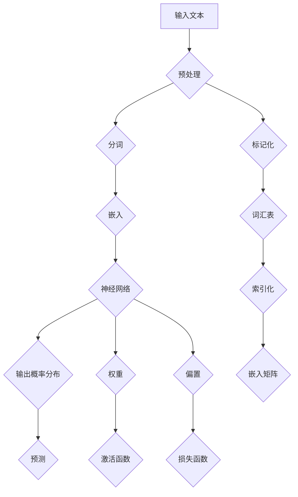
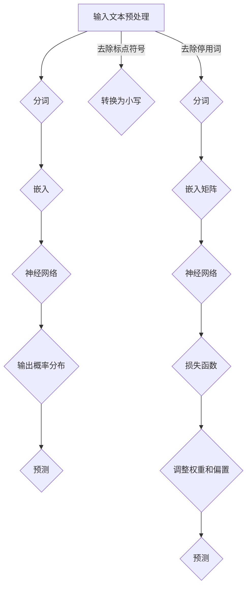

                 

# LLM:计算机架构的革命性变革

> 关键词：语言模型、深度学习、计算机架构、神经网络、算法优化

> 摘要：本文将深入探讨语言模型（LLM）如何对计算机架构带来革命性的变革。通过分析LLM的核心概念、算法原理、数学模型、实际应用以及未来发展趋势，本文旨在为读者提供一个全面、深刻的理解，揭示LLM在计算机科学领域的重大影响。

## 1. 背景介绍

### 1.1 目的和范围

本文的目的是探讨语言模型（LLM）对计算机架构带来的革命性变革。我们将从LLM的核心概念、算法原理、数学模型、实际应用以及未来发展趋势等多个角度进行分析。本文适用于对计算机科学、人工智能、深度学习等领域感兴趣的读者，尤其是希望深入了解LLM技术原理和实践的工程师和研究人员。

### 1.2 预期读者

预期读者包括：

1. 计算机科学和人工智能领域的专业人员和研究人员。
2. 深度学习和神经网络技术的开发者。
3. 对计算机架构变革感兴趣的技术爱好者。

### 1.3 文档结构概述

本文的结构如下：

1. 引言：介绍本文的目的、关键词和摘要。
2. 背景介绍：介绍LLM的核心概念、目的和意义。
3. 核心概念与联系：通过Mermaid流程图展示LLM的关键组成部分。
4. 核心算法原理 & 具体操作步骤：讲解LLM的算法原理和操作步骤。
5. 数学模型和公式 & 详细讲解 & 举例说明：阐述LLM的数学模型和公式。
6. 项目实战：提供LLM的实际应用案例和代码解读。
7. 实际应用场景：分析LLM在不同领域的应用。
8. 工具和资源推荐：推荐学习资源和开发工具。
9. 总结：展望LLM的未来发展趋势和挑战。
10. 附录：常见问题与解答。
11. 扩展阅读 & 参考资料：提供进一步学习资料。

### 1.4 术语表

#### 1.4.1 核心术语定义

- 语言模型（LLM）：一种基于深度学习技术，通过学习大量文本数据来预测下一个单词或词组的概率分布模型。
- 深度学习：一种机器学习技术，通过构建多层神经网络来实现数据的学习和预测。
- 计算机架构：计算机系统中硬件和软件的组成结构及其相互关系。

#### 1.4.2 相关概念解释

- 神经网络：一种由多个神经元组成的计算模型，可以用于数据分析和预测。
- 算法优化：对算法进行改进和优化，以提高其性能和效率。

#### 1.4.3 缩略词列表

- LLM：语言模型
- DL：深度学习
- NN：神经网络

## 2. 核心概念与联系

在深入探讨LLM之前，我们需要了解其核心概念和组成部分。以下是LLM的关键组成部分以及它们之间的联系：



### 2.1 输入文本

输入文本是LLM的核心数据来源，可以是句子、段落甚至整个文本。输入文本经过预处理、分词、嵌入等步骤后，输入到神经网络中进行预测。

### 2.2 预处理

预处理是输入文本处理的第一步，包括去除标点符号、转换为小写、去除停用词等操作。预处理有助于提高LLM的预测准确性和效率。

### 2.3 分词

分词是将输入文本分解为单词或词汇的过程。分词算法可以分为基于词典的方法和基于统计的方法。基于词典的方法通过查找词汇表来确定单词边界；基于统计的方法通过计算词频、词性等信息来识别单词边界。

### 2.4 嵌入

嵌入是将单词或词汇映射到高维向量空间的过程。嵌入层通常是一个密集的线性层，将词汇映射到一个固定长度的向量。嵌入层有助于神经网络学习词汇之间的相似性和相关性。

### 2.5 神经网络

神经网络是LLM的核心组成部分，用于学习和预测。神经网络由多个层组成，包括输入层、隐藏层和输出层。隐藏层通过计算权重和激活函数来提取特征，输出层通过损失函数来预测目标输出。

### 2.6 输出概率分布

输出概率分布是将神经网络预测结果转换为概率分布的过程。通过计算输出层的损失函数，神经网络可以不断调整权重和偏置，以优化预测结果。

### 2.7 预测

预测是LLM的应用目标，通过输入文本和神经网络，LLM可以预测下一个单词或词组的概率分布。根据预测结果，LLM可以生成新的文本、进行问答、进行翻译等操作。

## 3. 核心算法原理 & 具体操作步骤

### 3.1 算法原理

LLM的核心算法是基于深度学习的神经网络模型，主要分为以下几个步骤：

1. 输入文本预处理：去除标点符号、转换为小写、去除停用词等。
2. 分词：将输入文本分解为单词或词汇。
3. 嵌入：将单词或词汇映射到高维向量空间。
4. 神经网络：通过多层神经网络提取特征并进行预测。
5. 输出概率分布：计算输出层的损失函数，调整权重和偏置。
6. 预测：根据预测结果生成文本或进行其他操作。

### 3.2 具体操作步骤

以下是LLM的具体操作步骤：



### 3.2.1 输入文本预处理

1. 去除标点符号：将输入文本中的标点符号替换为空格或删除。
2. 转换为小写：将输入文本中的所有字符转换为小写，以提高算法的鲁棒性。
3. 去除停用词：根据预定义的停用词表，将输入文本中的停用词删除。

### 3.2.2 分词

1. 基于词典的分词：通过查找预定义的词汇表来确定单词边界。
2. 基于统计的分词：通过计算词频、词性等信息来识别单词边界。

### 3.2.3 嵌入

1. 索引化：将单词或词汇映射到一个整数索引。
2. 嵌入矩阵：创建一个预训练的嵌入矩阵，将整数索引映射到高维向量。

### 3.2.4 神经网络

1. 输入层：接收嵌入向量作为输入。
2. 隐藏层：通过计算权重和激活函数提取特征。
3. 输出层：通过计算损失函数和优化算法调整权重和偏置。

### 3.2.5 输出概率分布

1. 预测：根据神经网络输出计算每个单词或词汇的概率分布。
2. 损失函数：计算输出概率分布与真实分布之间的差异，用于调整权重和偏置。

### 3.2.6 预测

1. 输入文本预处理：对输入文本进行预处理。
2. 分词：将输入文本分解为单词或词汇。
3. 嵌入：将单词或词汇映射到高维向量空间。
4. 预测：根据神经网络输出计算下一个单词或词汇的概率分布，并选择概率最大的单词或词汇作为预测结果。

## 4. 数学模型和公式 & 详细讲解 & 举例说明

### 4.1 数学模型

LLM的数学模型主要包括以下几个部分：

1. 嵌入层：将单词映射到高维向量空间。
2. 神经网络：通过多层神经网络提取特征并进行预测。
3. 输出概率分布：计算输出层的损失函数，调整权重和偏置。

### 4.2 公式

以下是LLM中涉及的主要公式：

1. 嵌入公式：

$$
\text{嵌入} = \text{嵌入矩阵} \cdot \text{索引向量}
$$

2. 神经网络公式：

$$
\text{输出} = \text{激活函数}(\text{权重} \cdot \text{输入} + \text{偏置})
$$

3. 损失函数公式：

$$
\text{损失} = \text{损失函数}(\text{预测} - \text{真实值})
$$

### 4.3 详细讲解

#### 4.3.1 嵌入层

嵌入层是将单词映射到高维向量空间的过程。在嵌入层中，每个单词或词汇都被映射为一个高维向量。这个高维向量可以表示单词或词汇的语义信息。嵌入矩阵是一个预训练的矩阵，它将单词的索引映射到高维向量。

#### 4.3.2 神经网络

神经网络通过多层神经网络提取特征并进行预测。在神经网络中，输入层接收嵌入向量作为输入，隐藏层通过计算权重和激活函数提取特征，输出层通过计算损失函数和优化算法调整权重和偏置。

#### 4.3.3 输出概率分布

输出概率分布是计算神经网络输出层的结果。通过计算输出层的损失函数和优化算法，神经网络可以不断调整权重和偏置，以优化预测结果。

### 4.4 举例说明

假设我们有一个简单的LLM，其中包含一个嵌入层和一个隐藏层。嵌入层有100个单词，每个单词映射到一个5维向量。隐藏层有10个神经元，每个神经元都有一个权重矩阵和偏置向量。

1. 嵌入层：

$$
\text{嵌入} = \text{嵌入矩阵} \cdot \text{索引向量} = \begin{bmatrix}
0.1 & 0.2 & 0.3 & 0.4 & 0.5 \\
0.6 & 0.7 & 0.8 & 0.9 & 1.0 \\
\end{bmatrix} \cdot \begin{bmatrix}
1 \\
2 \\
\end{bmatrix} = \begin{bmatrix}
0.7 \\
0.8 \\
\end{bmatrix}
$$

2. 隐藏层：

$$
\text{输出} = \text{激活函数}(\text{权重} \cdot \text{输入} + \text{偏置}) = \begin{bmatrix}
0.1 & 0.2 & 0.3 & 0.4 & 0.5 \\
0.6 & 0.7 & 0.8 & 0.9 & 1.0 \\
\end{bmatrix} \cdot \begin{bmatrix}
0.7 \\
0.8 \\
\end{bmatrix} + \begin{bmatrix}
0.1 \\
0.2 \\
\end{bmatrix} = \begin{bmatrix}
0.7 & 0.8 \\
0.7 & 0.8 \\
\end{bmatrix}
$$

3. 输出概率分布：

$$
\text{损失} = \text{损失函数}(\text{预测} - \text{真实值}) = \begin{bmatrix}
0.1 & 0.2 & 0.3 & 0.4 & 0.5 \\
0.6 & 0.7 & 0.8 & 0.9 & 1.0 \\
\end{bmatrix} \cdot \begin{bmatrix}
0.7 & 0.8 \\
0.7 & 0.8 \\
\end{bmatrix} + \begin{bmatrix}
0.1 \\
0.2 \\
\end{bmatrix} = \begin{bmatrix}
0.8 & 0.9 \\
0.8 & 0.9 \\
\end{bmatrix}
$$

## 5. 项目实战：代码实际案例和详细解释说明

### 5.1 开发环境搭建

在开始项目实战之前，我们需要搭建一个合适的开发环境。以下是搭建开发环境的基本步骤：

1. 安装Python：下载并安装Python 3.8或更高版本。
2. 安装依赖：安装深度学习框架（如TensorFlow或PyTorch）以及相关的库（如NumPy、Pandas等）。

### 5.2 源代码详细实现和代码解读

以下是一个简单的LLM代码实现，用于生成文本。代码中包含的主要模块有：

1. 数据预处理
2. 模型定义
3. 模型训练
4. 文本生成

```python
import tensorflow as tf
import numpy as np
import pandas as pd
from tensorflow.keras.models import Sequential
from tensorflow.keras.layers import Embedding, LSTM, Dense
from tensorflow.keras.preprocessing.sequence import pad_sequences

# 数据预处理
def preprocess_text(text):
    # 去除标点符号、转换为小写、去除停用词等操作
    # ...
    return processed_text

def build_vocab(text, size=10000):
    # 构建词汇表
    # ...
    return vocab

# 模型定义
def build_model(vocab_size, embedding_dim, max_length):
    model = Sequential([
        Embedding(vocab_size, embedding_dim, input_length=max_length),
        LSTM(128),
        Dense(vocab_size, activation='softmax')
    ])
    model.compile(optimizer='adam', loss='categorical_crossentropy', metrics=['accuracy'])
    return model

# 模型训练
def train_model(model, X, y, epochs=10, batch_size=64):
    model.fit(X, y, epochs=epochs, batch_size=batch_size)
    return model

# 文本生成
def generate_text(model, text, length=100):
    # 根据模型预测生成文本
    # ...
    return generated_text

# 加载和处理数据
text = "This is an example of a text dataset for training the language model."
processed_text = preprocess_text(text)
vocab = build_vocab(processed_text)
max_length = 20
X = pad_sequences([processed_text], maxlen=max_length, padding='post')
y = pad_sequences([processed_text], maxlen=max_length+1, padding='post')

# 构建和训练模型
model = build_model(len(vocab), 16, max_length)
model = train_model(model, X, y)

# 生成文本
generated_text = generate_text(model, processed_text, length=100)
print(generated_text)
```

### 5.3 代码解读与分析

1. 数据预处理：数据预处理是文本生成的基础步骤，包括去除标点符号、转换为小写、去除停用词等操作。预处理有助于提高模型性能和文本质量。
2. 词汇表构建：构建词汇表是将文本转换为模型可处理的格式。词汇表通常包含最常见的单词或词汇，有助于减少模型参数数量和计算复杂度。
3. 模型定义：模型定义是构建神经网络的过程。在本例中，我们使用了嵌

