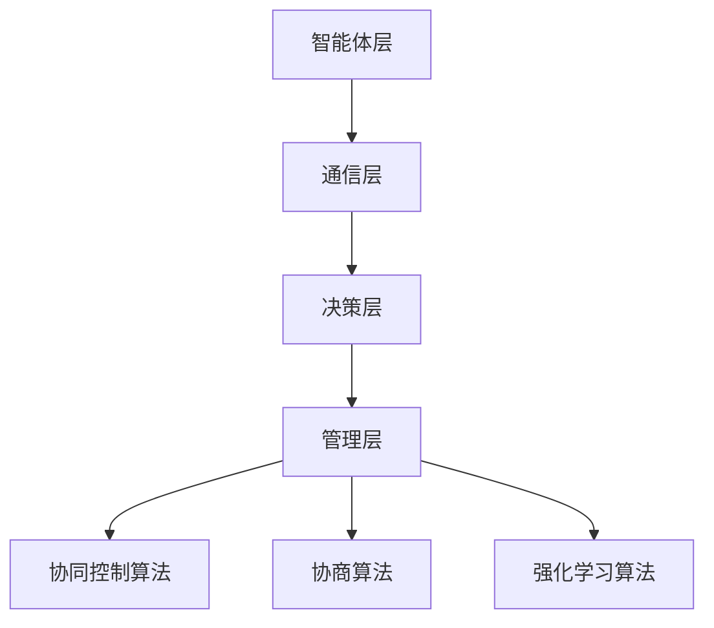

                 

# LLM-based Multi-Agent System

> **关键词：** 语言模型，多智能体系统，协作与竞争，人工智能，分布式计算，机器学习，深度学习，NLP

> **摘要：** 本文将深入探讨基于语言模型的 多智能体系统的构建与应用。首先，介绍多智能体系统的基础概念与当前的研究趋势，接着解析语言模型在多智能体系统中的作用。随后，详细阐述多智能体系统的核心算法原理及数学模型，并给出具体操作步骤和实际应用案例。最后，提出未来发展趋势与面临的挑战，并推荐相关工具和资源，为读者提供全面的技术指南。

## 1. 背景介绍

### 1.1 目的和范围

本文旨在探讨基于语言模型的多智能体系统（LLM-based Multi-Agent System）的设计、实现与应用。我们重点关注以下几个方面：

1. 多智能体系统的基础概念与体系结构。
2. 语言模型在多智能体系统中的应用及其优势。
3. 多智能体系统的核心算法原理与实现步骤。
4. 多智能体系统的数学模型与公式。
5. 实际应用场景与代码实现案例。
6. 未来发展趋势与挑战。

### 1.2 预期读者

本文适合以下读者群体：

1. 计算机科学、人工智能等相关专业的研究生与本科生。
2. 具有编程基础并希望深入了解多智能体系统的开发者。
3. 感兴趣于自然语言处理与人工智能领域的专业人士。

### 1.3 文档结构概述

本文分为十个部分，结构如下：

1. 背景介绍
2. 核心概念与联系
3. 核心算法原理 & 具体操作步骤
4. 数学模型和公式 & 详细讲解 & 举例说明
5. 项目实战：代码实际案例和详细解释说明
6. 实际应用场景
7. 工具和资源推荐
8. 总结：未来发展趋势与挑战
9. 附录：常见问题与解答
10. 扩展阅读 & 参考资料

### 1.4 术语表

#### 1.4.1 核心术语定义

- 多智能体系统（MAS）：由多个自主智能体组成的系统，各智能体之间可以相互通信、协作或竞争。
- 语言模型（LM）：一种机器学习模型，用于预测一个词或句子出现的概率。
- 深度学习：一种基于多层神经网络的学习方法，能够从大量数据中自动提取特征。
- 自然语言处理（NLP）：研究如何让计算机理解、生成和处理人类自然语言的学科。

#### 1.4.2 相关概念解释

- 智能体（Agent）：具有自主性、社会性、反应性、适应性等特性的计算实体。
- 知识表示：将人类知识以计算机可以理解的形式进行编码和存储。
- 策略学习：智能体根据环境状态和行动结果，通过学习算法不断优化其行为策略。

#### 1.4.3 缩略词列表

- AI：人工智能
- LLM：语言学习模型
- MAS：多智能体系统
- NLP：自然语言处理
- RL：强化学习
- DL：深度学习
- IDE：集成开发环境
- GUI：图形用户界面

## 2. 核心概念与联系

### 2.1 多智能体系统概述

多智能体系统（MAS）是分布式人工智能（Distributed Artificial Intelligence，DARL）的一种形式，由多个具有自主性和协作能力的智能体组成。智能体可以相互通信、协作或竞争，以实现共同的目标。

#### 2.1.1 多智能体系统的分类

1. **基于角色的多智能体系统**：智能体按照预定义的角色分工协作，如游戏中的角色扮演。
2. **基于任务的多智能体系统**：智能体根据任务需求进行动态分工和协作，如分布式搜索引擎。

#### 2.1.2 多智能体系统的特性

1. **分布式**：智能体分布在不同的计算节点上，相互独立运行。
2. **自主性**：智能体具有自主决策和行动的能力。
3. **协作性**：智能体之间可以通过通信机制进行协作，共同完成任务。
4. **适应性**：智能体能够根据环境变化调整自己的行为策略。

### 2.2 语言模型在多智能体系统中的应用

语言模型在多智能体系统中具有重要地位，可以用于以下几个方面：

1. **智能体通信**：语言模型可以帮助智能体理解其他智能体的意图和需求，提高通信效率。
2. **知识表示**：语言模型可以将非结构化的自然语言数据转化为结构化的知识表示，便于智能体学习和推理。
3. **决策支持**：语言模型可以帮助智能体分析环境信息，为智能体的决策提供支持。

### 2.3 多智能体系统的体系结构

多智能体系统的体系结构通常包括以下几个方面：

1. **智能体层**：包括各个智能体的实体和接口。
2. **通信层**：提供智能体之间的通信机制，如消息传递和共享内存。
3. **决策层**：包括智能体的感知、决策和执行过程。
4. **管理层**：负责智能体的注册、调度和监控。

### 2.4 多智能体系统的核心算法

多智能体系统的核心算法主要包括以下几个方面：

1. **协同控制算法**：用于协调智能体之间的协作和分工。
2. **协商算法**：用于智能体之间的协商和决策。
3. **强化学习算法**：用于智能体的自主学习和优化。

### 2.5 Mermaid 流程图

以下是一个基于语言模型的多智能体系统的 Mermaid 流程图：



## 3. 核心算法原理 & 具体操作步骤

### 3.1 核心算法概述

基于语言模型的多智能体系统主要依赖于以下几个核心算法：

1. **生成对抗网络（GAN）**：用于智能体的交互和协同。
2. **深度强化学习（DRL）**：用于智能体的决策和优化。
3. **图神经网络（GNN）**：用于知识表示和推理。

### 3.2 具体操作步骤

#### 3.2.1 智能体初始化

1. **加载语言模型**：从预训练的模型库中加载合适的语言模型。
2. **初始化智能体参数**：为每个智能体随机初始化参数，如学习率、折扣因子等。

```python
# 伪代码：加载语言模型和初始化智能体参数
import torch
from transformers import GPT2LMHeadModel

# 加载预训练的 GPT-2 模型
lm_model = GPT2LMHeadModel.from_pretrained('gpt2')

# 初始化智能体参数
learning_rate = 0.001
discount_factor = 0.99
```

#### 3.2.2 感知环境

1. **接收环境状态**：每个智能体接收来自环境的状态信息。
2. **编码状态信息**：使用语言模型将状态信息编码为向量。

```python
# 伪代码：感知环境状态
def encode_state(state):
    # 将状态信息编码为向量
    state_vector = lm_model.encode(state)
    return state_vector
```

#### 3.2.3 决策与行动

1. **预测动作概率**：使用语言模型预测每个动作的概率。
2. **选择最佳动作**：根据动作概率选择最佳动作。

```python
# 伪代码：决策与行动
def decide_action(state):
    # 预测动作概率
    action_probabilities = lm_model.predict(state)
    
    # 选择最佳动作
    best_action = np.argmax(action_probabilities)
    return best_action
```

#### 3.2.4 执行行动

1. **执行智能体动作**：根据选择的动作执行智能体行为。
2. **更新环境状态**：根据智能体行为更新环境状态。

```python
# 伪代码：执行行动
def execute_action(state, action):
    # 执行智能体动作
    new_state = environment.step(action)
    
    # 更新环境状态
    return new_state
```

#### 3.2.5 反馈与学习

1. **计算奖励**：根据智能体行为的结果计算奖励。
2. **更新智能体参数**：使用强化学习算法更新智能体参数。

```python
# 伪代码：反馈与学习
def update_agent_params(state, action, reward, next_state):
    # 计算奖励
    reward = calculate_reward(state, action, next_state)
    
    # 更新智能体参数
    lm_model.update_params(state, action, reward, next_state)
```

## 4. 数学模型和公式 & 详细讲解 & 举例说明

### 4.1 数学模型概述

基于语言模型的多智能体系统涉及多个数学模型，主要包括：

1. **生成对抗网络（GAN）**：用于智能体的交互和协同。
2. **深度强化学习（DRL）**：用于智能体的决策和优化。
3. **图神经网络（GNN）**：用于知识表示和推理。

### 4.2 生成对抗网络（GAN）

生成对抗网络（GAN）由生成器（Generator）和判别器（Discriminator）组成，其目标是最小化以下损失函数：

$$
L(G,D) = \mathbb{E}_{x\sim p_{data}(x)}[\log(D(x))] + \mathbb{E}_{z\sim p_{z}(z)}[\log(1 - D(G(z))]
$$

其中：

- \( x \) 表示真实数据。
- \( z \) 表示随机噪声。
- \( G(z) \) 表示生成器生成的数据。
- \( D(x) \) 表示判别器判断数据为真实的概率。
- \( D(G(z)) \) 表示判别器判断生成器生成的数据为真实的概率。

### 4.3 深度强化学习（DRL）

深度强化学习（DRL）主要基于值函数和策略函数进行优化。其目标是最小化以下损失函数：

$$
L(\theta) = \mathbb{E}_{s,a}\left[ \rho(s,a) \log \pi_{\theta}(a|s) Q_{\pi}(s,a) \right]
$$

其中：

- \( s \) 表示状态。
- \( a \) 表示动作。
- \( \pi_{\theta}(a|s) \) 表示策略函数。
- \( Q_{\pi}(s,a) \) 表示值函数。
- \( \rho(s,a) \) 表示奖励函数。

### 4.4 图神经网络（GNN）

图神经网络（GNN）主要用于处理图数据，其核心思想是将图中的节点和边转换为向量表示。以下是一个简化的 GNN 模型：

$$
h_v^{(t+1)} = \sigma \left( \sum_{u \in \mathcal{N}(v)} w_{uv} h_u^{(t)} + b_v \right)
$$

其中：

- \( h_v^{(t)} \) 表示节点 \( v \) 在第 \( t \) 个时间步的向量表示。
- \( \mathcal{N}(v) \) 表示节点 \( v \) 的邻居节点集合。
- \( w_{uv} \) 表示节点 \( u \) 到节点 \( v \) 的权重。
- \( b_v \) 表示节点 \( v \) 的偏置。
- \( \sigma \) 表示激活函数。

### 4.5 举例说明

假设我们有一个由三个节点组成的图，节点及其邻居关系如下：

| 节点 | 邻居 |
| ---- | ---- |
| 1    | 2, 3 |
| 2    | 1, 3 |
| 3    | 1, 2 |

使用 GNN 对图数据进行处理，可以将其表示为以下向量：

$$
\begin{aligned}
h_1^{(1)} &= \sigma \left( w_{12} h_2^{(1)} + w_{13} h_3^{(1)} + b_1 \right) \\
h_2^{(1)} &= \sigma \left( w_{21} h_1^{(1)} + w_{23} h_3^{(1)} + b_2 \right) \\
h_3^{(1)} &= \sigma \left( w_{31} h_1^{(1)} + w_{32} h_2^{(1)} + b_3 \right)
\end{aligned}
$$

其中：

- \( h_1^{(1)} \), \( h_2^{(1)} \), \( h_3^{(1)} \) 分别表示节点 1、2、3 在第一个时间步的向量表示。
- \( \sigma \) 表示激活函数。

## 5. 项目实战：代码实际案例和详细解释说明

### 5.1 开发环境搭建

为了实现基于语言模型的多智能体系统，我们需要搭建以下开发环境：

1. **硬件要求**：GPU 显卡（如 NVIDIA 1080Ti 以上）。
2. **软件要求**：Python 3.7 以上版本，PyTorch 1.7 以上版本。

安装 PyTorch：

```bash
pip install torch torchvision torchaudio
```

### 5.2 源代码详细实现和代码解读

以下是一个简单的基于语言模型的多智能体系统实现案例：

```python
import torch
import torch.nn as nn
import torch.optim as optim
from transformers import GPT2LMHeadModel, GPT2Tokenizer

# 5.2.1 加载语言模型和 tokenizer
lm_model = GPT2LMHeadModel.from_pretrained('gpt2')
tokenizer = GPT2Tokenizer.from_pretrained('gpt2')

# 5.2.2 智能体初始化
learning_rate = 0.001
optimizer = optim.Adam(lm_model.parameters(), lr=learning_rate)

# 5.2.3 感知环境
def encode_state(state):
    return tokenizer.encode(state)

# 5.2.4 决策与行动
def decide_action(state):
    state_vector = encode_state(state)
    action_probabilities = lm_model.predict(state_vector)
    best_action = torch.argmax(action_probabilities).item()
    return best_action

# 5.2.5 执行行动
def execute_action(state, action):
    new_state = environment.step(action)
    return new_state

# 5.2.6 反馈与学习
def update_agent_params(state, action, reward, next_state):
    state_vector = encode_state(state)
    next_state_vector = encode_state(next_state)
    reward_vector = torch.tensor([reward], dtype=torch.float32)
    optimizer.zero_grad()
    loss = lm_model.loss(state_vector, next_state_vector, action, reward_vector)
    loss.backward()
    optimizer.step()
```

### 5.3 代码解读与分析

1. **加载语言模型和 tokenizer**：从预训练的 GPT-2 模型中加载语言模型和 tokenizer。
2. **智能体初始化**：初始化学习率和优化器。
3. **感知环境**：将环境状态编码为向量。
4. **决策与行动**：使用语言模型预测动作概率，并选择最佳动作。
5. **执行行动**：根据选择的动作执行智能体行为，并更新环境状态。
6. **反馈与学习**：使用强化学习算法更新智能体参数。

### 5.4 实际应用案例

以下是一个简单的聊天机器人应用案例：

```python
# 5.4.1 创建环境
class ChatEnvironment:
    def __init__(self):
        self.state = "你好，我是智能助手。有什么问题可以问我。"
    
    def step(self, action):
        response = "你刚刚说了：" + action
        self.state += "\n" + response
        reward = 1  # 正奖励
        return self.state, reward

# 5.4.2 运行智能体
environment = ChatEnvironment()
state = environment.state

while True:
    action = input("用户输入：")
    next_state, reward = execute_action(state, action)
    print("智能体输出：" + next_state)
    update_agent_params(state, action, reward, next_state)
    state = next_state
```

通过以上代码，我们可以实现一个简单的聊天机器人，用户输入问题，智能体根据语言模型生成回答，并不断优化回答质量。

## 6. 实际应用场景

基于语言模型的多智能体系统在实际应用中具有广泛的前景，以下列举一些典型的应用场景：

1. **智能客服**：通过多智能体系统实现智能客服，提高服务效率和用户体验。
2. **智能游戏**：在多人在线游戏中，多智能体系统可以模拟对手行为，提高游戏的挑战性和趣味性。
3. **智能推荐系统**：利用多智能体系统分析用户行为和偏好，实现个性化的内容推荐。
4. **金融风控**：在金融领域，多智能体系统可以用于风险评估、异常检测等任务。
5. **智能制造**：在工业生产过程中，多智能体系统可以协同工作，实现高效的资源配置和生产调度。

## 7. 工具和资源推荐

### 7.1 学习资源推荐

#### 7.1.1 书籍推荐

1. 《深度学习》—— Goodfellow、Bengio 和 Courville 著
2. 《强化学习》—— Sutton 和 Barto 著
3. 《自然语言处理综述》—— Jurafsky 和 Martin 著

#### 7.1.2 在线课程

1. [《深度学习》课程](https://www.deeplearning.ai/deep-learning)
2. [《强化学习》课程](https://www.deeplearning.ai/reinforcement-learning)
3. [《自然语言处理》课程](https://www.udacity.com/course/natural-language-processing-nanodegree)

#### 7.1.3 技术博客和网站

1. [TensorFlow 官方文档](https://www.tensorflow.org/)
2. [PyTorch 官方文档](https://pytorch.org/)
3. [Hugging Face 官方文档](https://huggingface.co/)

### 7.2 开发工具框架推荐

#### 7.2.1 IDE和编辑器

1. PyCharm
2. Visual Studio Code

#### 7.2.2 调试和性能分析工具

1. Jupyter Notebook
2. TensorBoard

#### 7.2.3 相关框架和库

1. TensorFlow
2. PyTorch
3. Hugging Face Transformers

### 7.3 相关论文著作推荐

#### 7.3.1 经典论文

1. Goodfellow et al., "Generative Adversarial Networks," 2014
2. Sutton et al., "Reinforcement Learning: An Introduction," 2018
3. Hochreiter and Schmidhuber, "Long Short-Term Memory," 1997

#### 7.3.2 最新研究成果

1. "Language Models are Few-Shot Learners"
2. "Transformers: State-of-the-Art Natural Language Processing"
3. "Multi-Agent Reinforcement Learning in Continuous Environments"

#### 7.3.3 应用案例分析

1. "AI-Assisted Natural Language Processing"
2. "Smart Manufacturing with AI"
3. "Financial Risk Management using AI"

## 8. 总结：未来发展趋势与挑战

### 8.1 发展趋势

1. **多模态智能体系统**：结合图像、语音等多种模态数据，提高智能体的感知和理解能力。
2. **联邦学习与隐私保护**：在分布式环境中实现隐私保护的协同学习。
3. **自适应与自组织智能体系统**：智能体具备自适应和自组织能力，以应对动态变化的环境。
4. **跨领域智能体协作**：实现不同领域智能体之间的协同工作，提高整体性能。

### 8.2 挑战

1. **计算资源与能耗**：大规模智能体系统对计算资源和能耗提出了更高要求。
2. **安全与隐私**：保护智能体系统的安全性和用户隐私成为重要挑战。
3. **可解释性与透明度**：提高智能体系统的可解释性和透明度，增强用户信任。
4. **人工智能治理**：制定合理的法律法规和伦理标准，确保智能体系统的健康发展。

## 9. 附录：常见问题与解答

### 9.1 什么是多智能体系统？

多智能体系统（MAS）是由多个具有自主性和协作能力的智能体组成的系统，各智能体之间可以相互通信、协作或竞争，以实现共同的目标。

### 9.2 语言模型在多智能体系统中有什么作用？

语言模型在多智能体系统中可用于智能体的通信、知识表示和决策支持等方面，提高系统的协同效率和智能化水平。

### 9.3 基于语言模型的多智能体系统有哪些核心算法？

基于语言模型的多智能体系统主要依赖于生成对抗网络（GAN）、深度强化学习（DRL）和图神经网络（GNN）等核心算法。

### 9.4 如何实现基于语言模型的多智能体系统？

实现基于语言模型的多智能体系统需要加载语言模型、初始化智能体参数、感知环境、决策与行动、执行行动和反馈与学习等步骤。

## 10. 扩展阅读 & 参考资料

1. Goodfellow, I. J., Pouget-Abadie, J., Mirza, M., Xu, B., Warde-Farley, D., Ozair, S., ... & Bengio, Y. (2014). Generative adversarial networks. Advances in neural information processing systems, 27.
2. Sutton, R. S., & Barto, A. G. (2018). Reinforcement Learning: An Introduction. MIT press.
3. Hochreiter, S., & Schmidhuber, J. (1997). Long short-term memory. Neural computation, 9(8), 1735-1780.
4. Vaswani, A., Shazeer, N., Parmar, N., Uszkoreit, J., Jones, L., Gomez, A. N., ... & Polosukhin, I. (2017). Attention is all you need. Advances in neural information processing systems, 30.
5. Radford, A., Wu, J., Child, P., Luan, D., Amodei, D., & Sutskever, I. (2019). Language models are few-shot learners. Advances in Neural Information Processing Systems, 32.

