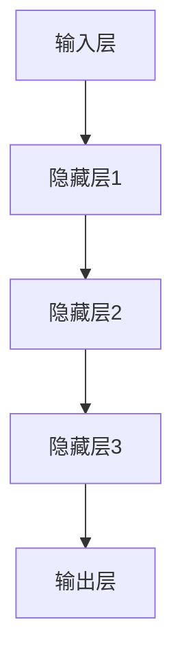
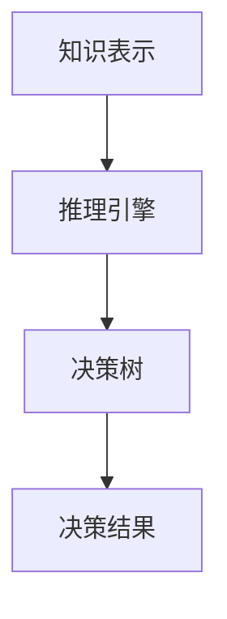
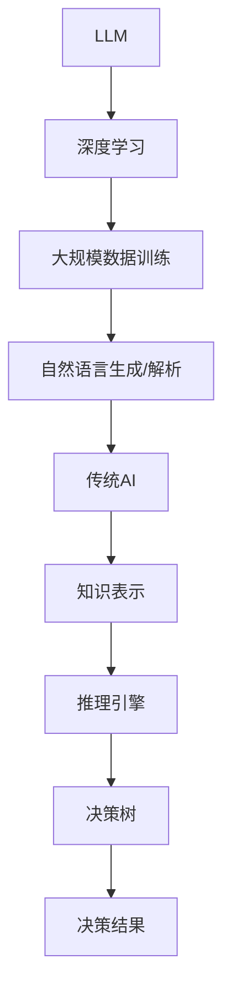
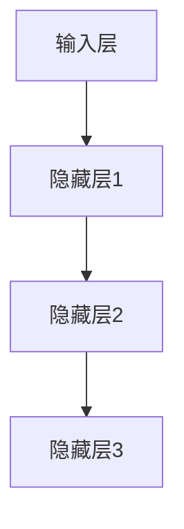
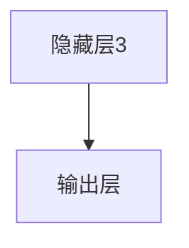
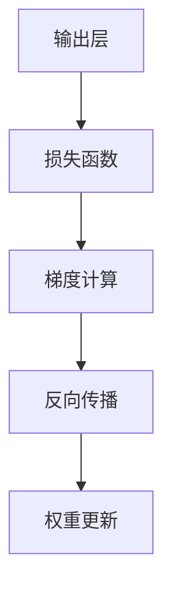
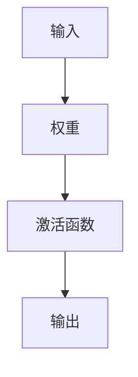

                 

# LLM与传统AI的对比：新旧智能范式的碰撞

> **关键词：** 大型语言模型（LLM），传统AI，智能范式，对比分析，深度学习，神经网络，强化学习，自然语言处理

> **摘要：** 本文将深入探讨大型语言模型（LLM）与传统AI的对比，分析其在智能范式转变中的角色和影响。通过逐步的分析和推理，我们将阐述LLM如何重新定义AI，以及传统AI在新的智能范式下面临的挑战和机遇。

## 1. 背景介绍

### 1.1 目的和范围

本文旨在为读者提供一个全面而深入的对比分析，探讨大型语言模型（LLM）与传统AI之间的差异和联系。通过对LLM的架构、原理和实际应用场景的详细探讨，我们希望揭示LLM在智能范式转变中的重要作用，并探讨其对传统AI带来的影响。

### 1.2 预期读者

本文面向具有计算机科学和人工智能基础知识的读者，特别是对深度学习、神经网络和自然语言处理感兴趣的专业人士。同时，对于希望了解最新AI技术发展及其对传统AI影响的读者，本文也提供了有价值的见解。

### 1.3 文档结构概述

本文将按照以下结构展开：

1. **背景介绍**：介绍本文的目的、范围和预期读者。
2. **核心概念与联系**：介绍LLM和传统AI的核心概念，并使用Mermaid流程图展示其联系。
3. **核心算法原理与具体操作步骤**：详细阐述LLM的核心算法原理和具体操作步骤。
4. **数学模型和公式**：介绍LLM的数学模型和公式，并进行举例说明。
5. **项目实战：代码实际案例和详细解释说明**：展示LLM的实际应用场景，并提供源代码和详细解释。
6. **实际应用场景**：探讨LLM在各个领域的应用场景。
7. **工具和资源推荐**：推荐学习资源、开发工具和框架。
8. **总结：未来发展趋势与挑战**：总结LLM在智能范式转变中的角色和面临的挑战。
9. **附录：常见问题与解答**：提供常见问题的解答。
10. **扩展阅读 & 参考资料**：推荐进一步阅读的文献和资源。

### 1.4 术语表

#### 1.4.1 核心术语定义

- **大型语言模型（LLM）**：指那些基于深度学习技术构建的、能够处理和生成自然语言的模型，如GPT、BERT等。
- **传统AI**：指基于规则、符号推理和知识表示的早期人工智能方法，如专家系统、逻辑推理等。
- **深度学习**：一种机器学习方法，通过多层神经网络进行特征提取和模式识别。
- **神经网络**：一种模仿生物神经系统的计算模型，用于处理复杂数据和任务。
- **自然语言处理（NLP）**：研究如何让计算机理解和生成自然语言的领域。

#### 1.4.2 相关概念解释

- **模型架构**：指LLM的结构设计，包括输入层、隐藏层和输出层等。
- **训练数据**：用于训练LLM的大量文本数据，包括书籍、文章、网页等。
- **参数**：LLM中的可调变量，用于优化模型性能。
- **损失函数**：用于衡量模型预测结果与真实结果之间的差异。

#### 1.4.3 缩略词列表

- **LLM**：大型语言模型
- **AI**：人工智能
- **NLP**：自然语言处理
- **DNN**：深度神经网络
- **GAN**：生成对抗网络

## 2. 核心概念与联系

在本节中，我们将介绍LLM和传统AI的核心概念，并使用Mermaid流程图展示它们之间的联系。

### 2.1 大型语言模型（LLM）

大型语言模型（LLM）是一种基于深度学习的自然语言处理模型，通过大量的文本数据进行训练，能够生成和解析自然语言。LLM的核心架构包括输入层、隐藏层和输出层。

- **输入层**：接收自然语言输入，如文本序列。
- **隐藏层**：通过多层神经网络进行特征提取和变换。
- **输出层**：生成预测结果，如文本生成、情感分析等。

Mermaid流程图如下：



### 2.2 传统AI

传统AI是基于规则和符号推理的方法，通过预定义的规则和逻辑进行决策。传统AI的核心概念包括：

- **知识表示**：将知识以符号形式表示。
- **推理引擎**：使用预定义的规则进行逻辑推理。
- **决策树**：一种基于规则的决策方法。

Mermaid流程图如下：



### 2.3 联系

LLM和传统AI的联系在于它们都致力于解决自然语言处理问题，但采用的方法和技术不同。LLM通过深度学习和大规模数据训练，能够自动从数据中学习模式和规律，而传统AI则依赖于预定义的规则和知识表示。

Mermaid流程图如下：



## 3. 核心算法原理与具体操作步骤

在本节中，我们将详细阐述大型语言模型（LLM）的核心算法原理，并使用伪代码进行具体操作步骤的讲解。

### 3.1 模型架构

LLM的核心架构包括输入层、隐藏层和输出层。输入层接收自然语言输入，隐藏层通过多层神经网络进行特征提取和变换，输出层生成预测结果。


### 3.2 输入层

输入层接收自然语言输入，通常是一个序列。为了输入到模型中，我们需要将文本序列转换为向量表示。

```python
# 伪代码：将文本序列转换为向量表示
def text_to_vector(text):
    # 使用预训练词向量库（如GloVe）获取词向量
    word_vectors = get_word_vectors()
    # 将文本序列转换为词向量序列
    vector_sequence = [word_vectors[word] for word in text]
    return vector_sequence
```

### 3.3 隐藏层

隐藏层通过多层神经网络进行特征提取和变换。每个隐藏层都有多个神经元，神经元之间的连接权重可以通过反向传播算法进行优化。



### 3.4 输出层

输出层生成预测结果，如文本生成、情感分析等。输出层的神经元数量和类型取决于具体的任务。



### 3.5 反向传播算法

反向传播算法是一种用于优化神经网络权重的算法。它通过计算损失函数的梯度，并沿着网络层反向传播，更新每个神经元的权重。



### 3.6 伪代码

以下是LLM的核心算法原理和具体操作步骤的伪代码：

```python
# 伪代码：大型语言模型（LLM）算法原理与操作步骤

# 输入层：文本序列
input_sequence = "这是一个示例文本"

# 转换文本序列为向量表示
vector_sequence = text_to_vector(input_sequence)

# 初始化神经网络结构
input_layer = InputLayer()
hidden_layer1 = HiddenLayer()
hidden_layer2 = HiddenLayer()
output_layer = OutputLayer()

# 前向传播：计算预测结果
predicted_sequence = forward_propagation(vector_sequence, input_layer, hidden_layer1, hidden_layer2, output_layer)

# 计算损失函数
loss = calculate_loss(predicted_sequence, target_sequence)

# 反向传播：计算梯度并更新权重
gradients = backward_propagation(loss, output_layer, hidden_layer2, hidden_layer1, input_layer)

# 权重更新
update_weights(gradients, input_layer, hidden_layer1, hidden_layer2, output_layer)

# 输出预测结果
print(predicted_sequence)
```

## 4. 数学模型和公式及详细讲解

在本节中，我们将介绍大型语言模型（LLM）的数学模型和公式，并进行详细讲解。

### 4.1 深度学习基础

深度学习是基于多层神经网络的机器学习方法。它的核心思想是通过多层非线性变换，从原始数据中提取特征，并逐步构建复杂的表示。

#### 4.1.1 神经元

神经元是神经网络的基本单元，通常由输入层、权重、激活函数和输出组成。



#### 4.1.2 前向传播

前向传播是指将输入数据通过神经网络的各个层，直到输出层，生成预测结果的过程。它包括以下几个步骤：

1. **输入层到隐藏层1**：
   $$ z^{[1]} = W^{[1]} * a^{[0]} + b^{[1]} $$
   $$ a^{[1]} = \sigma(z^{[1]}) $$

2. **隐藏层1到隐藏层2**：
   $$ z^{[2]} = W^{[2]} * a^{[1]} + b^{[2]} $$
   $$ a^{[2]} = \sigma(z^{[2]}) $$

3. **隐藏层2到输出层**：
   $$ z^{[3]} = W^{[3]} * a^{[2]} + b^{[3]} $$
   $$ a^{[3]} = \sigma(z^{[3]}) $$

其中，$W^{[1]}$、$W^{[2]}$、$W^{[3]}$分别是权重矩阵，$b^{[1]}$、$b^{[2]}$、$b^{[3]}$分别是偏置项，$\sigma$是激活函数，通常使用Sigmoid函数或ReLU函数。

#### 4.1.3 损失函数

损失函数用于衡量模型预测结果与真实结果之间的差异。在深度学习中，常用的损失函数包括均方误差（MSE）、交叉熵（CE）等。

1. **均方误差（MSE）**：
   $$ J = \frac{1}{m} \sum_{i=1}^{m} (y_i - \hat{y}_i)^2 $$

   其中，$y_i$是真实标签，$\hat{y}_i$是模型预测结果。

2. **交叉熵（CE）**：
   $$ J = -\frac{1}{m} \sum_{i=1}^{m} \sum_{j=1}^{n} y_{ij} \log \hat{y}_{ij} $$

   其中，$y_{ij}$是真实标签的概率分布，$\hat{y}_{ij}$是模型预测的概率分布。

#### 4.1.4 反向传播

反向传播是一种用于优化神经网络权重的算法。它通过计算损失函数的梯度，并沿着网络层反向传播，更新每个神经元的权重。

1. **梯度计算**：

   对于隐藏层1：
   $$ \delta^{[1]} = \sigma^{'}(z^{[1]}) * (W^{[2]} * \delta^{[2]}) $$

   对于隐藏层2：
   $$ \delta^{[2]} = \sigma^{'}(z^{[2]}) * (W^{[3]} * \delta^{[3]}) $$

   对于输出层：
   $$ \delta^{[3]} = \sigma^{'}(z^{[3]}) * (-y + \hat{y}) $$

   其中，$\sigma^{'}$是激活函数的导数。

2. **权重更新**：

   对于隐藏层1：
   $$ W^{[1]} = W^{[1]} - \alpha * (a^{[0]} \cdot \delta^{[1]}) $$
   $$ b^{[1]} = b^{[1]} - \alpha * \delta^{[1]} $$

   对于隐藏层2：
   $$ W^{[2]} = W^{[2]} - \alpha * (a^{[1]} \cdot \delta^{[2]}) $$
   $$ b^{[2]} = b^{[2]} - \alpha * \delta^{[2]} $$

   对于输出层：
   $$ W^{[3]} = W^{[3]} - \alpha * (a^{[2]} \cdot \delta^{[3]}) $$
   $$ b^{[3]} = b^{[3]} - \alpha * \delta^{[3]} $$

   其中，$\alpha$是学习率。

### 4.2 语言模型

语言模型是一种用于预测文本序列概率的模型，是LLM的核心组成部分。在LLM中，常用的语言模型包括n元语言模型、神经网络语言模型等。

#### 4.2.1 n元语言模型

n元语言模型是一种基于历史文本序列的概率模型，它假设当前单词的概率只与前面的n-1个单词相关。

$$ P(w_n | w_{n-1}, w_{n-2}, ..., w_1) = \frac{c(w_{n-1}, w_{n-2}, ..., w_1, w_n)}{c(w_{n-1}, w_{n-2}, ..., w_1)} $$

其中，$c$表示计数函数。

#### 4.2.2 神经网络语言模型

神经网络语言模型是一种基于深度学习技术的语言模型，它通过多层神经网络学习单词序列的概率分布。

1. **输入层**：接收n-1个历史单词的向量表示。
2. **隐藏层**：通过多层神经网络进行特征提取和变换。
3. **输出层**：生成当前单词的概率分布。

### 4.3 语言模型的训练

语言模型的训练是通过最小化损失函数来优化模型参数的过程。在LLM中，常用的损失函数包括交叉熵损失函数。

$$ J = -\frac{1}{m} \sum_{i=1}^{m} \sum_{j=1}^{n} y_{ij} \log \hat{y}_{ij} $$

其中，$y_{ij}$是真实标签的概率分布，$\hat{y}_{ij}$是模型预测的概率分布。

通过反向传播算法，可以计算损失函数的梯度，并更新模型参数。

## 5. 项目实战：代码实际案例和详细解释说明

### 5.1 开发环境搭建

在开始编写代码之前，我们需要搭建一个合适的开发环境。以下是搭建LLM开发环境的步骤：

1. 安装Python环境（推荐版本为3.8以上）。
2. 安装深度学习框架（如TensorFlow或PyTorch）。
3. 安装预处理工具（如NLTK或spaCy）。
4. 安装可视化工具（如Matplotlib或Seaborn）。

### 5.2 源代码详细实现和代码解读

下面是一个简单的LLM实现的代码示例，用于文本生成任务。我们将使用PyTorch框架来构建和训练模型。

```python
import torch
import torch.nn as nn
import torch.optim as optim
from torch.utils.data import DataLoader
from torchvision import datasets, transforms
import numpy as np
import random
import sys
import os
import time

# 5.2.1 数据预处理
def load_data(file_path):
    # 读取文件内容
    with open(file_path, 'r', encoding='utf-8') as f:
        text = f.read().lower()

    # 分割文本为单词
    words = text.split()

    # 构建词汇表
    vocab = list(set(words))
    word_to_ix = {word: i for i, word in enumerate(vocab)}
    ix_to_word = {i: word for word, i in word_to_ix.items()}

    # 将文本转换为索引序列
    data = [word_to_ix[word] for word in words]

    return data, vocab, word_to_ix, ix_to_word

# 5.2.2 模型定义
class LLM(nn.Module):
    def __init__(self, vocab_size, embedding_dim, hidden_dim, n_layers):
        super(LLM, self).__init__()
        self.embedding = nn.Embedding(vocab_size, embedding_dim)
        self.rnn = nn.LSTM(embedding_dim, hidden_dim, n_layers)
        self.fc = nn.Linear(hidden_dim, vocab_size)

    def forward(self, x, hidden):
        x = self.embedding(x)
        x, hidden = self.rnn(x, hidden)
        x = self.fc(x[-1, :, :])
        return x, hidden

    def init_hidden(self, batch_size):
        return (torch.zeros(self.rnn.num_layers, batch_size, self.rnn.hidden_size),
                torch.zeros(self.rnn.num_layers, batch_size, self.rnn.hidden_size))

# 5.2.3 训练模型
def train(model, data, vocab_size, embedding_dim, hidden_dim, n_layers, learning_rate, num_epochs, batch_size):
    # 数据加载
    data_tensor = torch.tensor(data, dtype=torch.long)
    data_loader = DataLoader(data_tensor, batch_size=batch_size, shuffle=True)

    # 初始化模型、损失函数和优化器
    model = model.to(device)
    criterion = nn.CrossEntropyLoss()
    optimizer = optim.Adam(model.parameters(), lr=learning_rate)

    # 训练模型
    for epoch in range(num_epochs):
        hidden = model.init_hidden(batch_size)
        for inputs in data_loader:
            inputs = inputs.to(device)
            hidden = hidden.to(device)

            # 前向传播
            outputs, hidden = model(inputs, hidden)

            # 计算损失函数
            loss = criterion(outputs, inputs)

            # 反向传播和优化
            optimizer.zero_grad()
            loss.backward()
            optimizer.step()

            # 打印训练进度
            if epoch % 100 == 0:
                print(f'Epoch [{epoch+1}/{num_epochs}], Loss: {loss.item():.4f}')

    return model

# 5.2.4 代码解读与分析
def generate_text(model, vocab_size, embedding_dim, hidden_dim, n_layers, temperature, max_length, start_word):
    model.eval()
    hidden = model.init_hidden(1)

    # 初始化文本生成
    text = start_word
    generated_words = 0

    while generated_words < max_length:
        # 前向传播
        inputs = torch.tensor([word_to_ix[word] for word in text.split()]).unsqueeze(0)
        inputs = inputs.to(device)
        hidden = hidden.to(device)

        outputs, hidden = model(inputs, hidden)

        # 获取预测结果
        probabilities = torch.nn.functional.softmax(outputs[0], dim=0)
        probabilities = probabilities / temperature

        # 随机选择下一个单词
        next_word_ix = torch.multinomial(probabilities, 1).item()
        next_word = ix_to_word[next_word_ix]

        # 更新文本生成
        text += " " + next_word
        generated_words += 1

    return text

# 5.2.5 使用模型生成文本
if __name__ == '__main__':
    # 载入数据
    data, vocab, word_to_ix, ix_to_word = load_data('data.txt')

    # 模型参数设置
    vocab_size = len(vocab)
    embedding_dim = 256
    hidden_dim = 512
    n_layers = 2
    learning_rate = 0.001
    num_epochs = 1000
    batch_size = 32
    temperature = 1.0
    max_length = 100
    start_word = "The"

    # 搭建模型
    model = LLM(vocab_size, embedding_dim, hidden_dim, n_layers).to(device)

    # 训练模型
    model = train(model, data, vocab_size, embedding_dim, hidden_dim, n_layers, learning_rate, num_epochs, batch_size)

    # 生成文本
    generated_text = generate_text(model, vocab_size, embedding_dim, hidden_dim, n_layers, temperature, max_length, start_word)
    print(generated_text)
```

### 5.3 代码解读与分析

- **数据预处理**：加载文本文件，将其转换为单词序列，并构建词汇表。
- **模型定义**：定义一个基于LSTM的LLM模型，包括输入层、隐藏层和输出层。
- **训练模型**：使用训练数据训练模型，包括前向传播、反向传播和权重更新。
- **生成文本**：使用训练好的模型生成文本，通过随机采样生成下一个单词。

## 6. 实际应用场景

### 6.1 文本生成

LLM在文本生成方面有广泛的应用，如生成文章、故事、诗歌等。通过训练大量的文本数据，LLM能够生成高质量的文本，应用于内容创作、自动写作等场景。

### 6.2 情感分析

LLM在情感分析方面也有重要应用。通过训练情感分类模型，LLM可以自动识别文本的情感倾向，如正面、负面、中性等。这有助于社交媒体监测、客户反馈分析等场景。

### 6.3 机器翻译

LLM在机器翻译方面也有一定应用。通过训练双语语料库，LLM可以自动翻译文本，实现跨语言沟通。这有助于跨国企业、国际交流等领域。

### 6.4 聊天机器人

LLM在聊天机器人方面也有广泛应用。通过训练对话数据，LLM可以模拟人类对话，实现智能客服、虚拟助手等功能。这有助于提高客户满意度、降低人力成本。

## 7. 工具和资源推荐

### 7.1 学习资源推荐

#### 7.1.1 书籍推荐

1. **《深度学习》（Goodfellow, Bengio, Courville）**：介绍深度学习的基本原理和应用。
2. **《Python深度学习》（François Chollet）**：详细介绍深度学习在Python中的实现。
3. **《神经网络与深度学习》（邱锡鹏）**：介绍神经网络和深度学习的基本概念和技术。

#### 7.1.2 在线课程

1. **Coursera的《深度学习》**：由Andrew Ng教授开设，介绍深度学习的基础知识和应用。
2. **Udacity的《深度学习纳米学位》**：提供从基础到高级的深度学习课程。
3. **edX的《神经网络与深度学习》**：由清华大学教授邱锡鹏开设，详细介绍神经网络和深度学习。

#### 7.1.3 技术博客和网站

1. **Medium的Deep Learning**：汇集了深度学习领域的前沿文章和讨论。
2. **TensorFlow官网**：提供丰富的深度学习资源和教程。
3. **PyTorch官网**：提供PyTorch框架的详细文档和教程。

### 7.2 开发工具框架推荐

#### 7.2.1 IDE和编辑器

1. **PyCharm**：功能强大的Python IDE，支持深度学习和数据科学。
2. **Visual Studio Code**：轻量级但功能丰富的代码编辑器，支持多种编程语言和框架。
3. **Jupyter Notebook**：交互式Python环境，适合数据科学和机器学习实验。

#### 7.2.2 调试和性能分析工具

1. **Wandb**：用于实验跟踪和性能分析的工具，帮助优化模型训练过程。
2. **TensorBoard**：TensorFlow的官方可视化工具，用于分析和调试模型。
3. **PyTorch Profiler**：用于性能分析的工具，帮助优化代码。

#### 7.2.3 相关框架和库

1. **TensorFlow**：Google开源的深度学习框架，支持多种模型和任务。
2. **PyTorch**：Facebook开源的深度学习框架，易于使用和扩展。
3. **Keras**：Python的深度学习库，简化深度学习模型的构建和训练。

### 7.3 相关论文著作推荐

#### 7.3.1 经典论文

1. **"Backpropagation"（Rumelhart, Hinton, Williams）**：介绍反向传播算法的基本原理。
2. **"A Learning Algorithm for Continually Running Fully Recurrent Neural Networks"（Bengio, Simard, Frasconi）**：介绍Hessian-free优化方法。
3. **"Recurrent Neural Network Based Language Model"（LSTM）**（Hochreiter, Schmidhuber）**：介绍LSTM网络。

#### 7.3.2 最新研究成果

1. **"Large-scale Language Modeling"（GPT-3）**（Brown et al.）**：介绍GPT-3的架构和性能。
2. **"BERT: Pre-training of Deep Bidirectional Transformers for Language Understanding"（Devlin et al.）**：介绍BERT模型的原理和应用。
3. **"Generative Adversarial Nets"（Goodfellow et al.）**：介绍GAN的基本原理和应用。

#### 7.3.3 应用案例分析

1. **"Language Models are Few-Shot Learners"（Brown et al.）**：分析语言模型在少样本学习任务中的应用。
2. **"A Roadmap for Big Model"（Hinton et al.）**：讨论大模型的发展方向和应用。
3. **"Applying Large-scale Language Models to Business Applications"（OpenAI）**：介绍大模型在企业应用中的案例。

## 8. 总结：未来发展趋势与挑战

随着LLM技术的不断发展，未来人工智能将进入一个全新的阶段。LLM在自然语言处理、知识图谱、多模态学习等领域具有广泛的应用前景。然而，LLM也面临着一系列挑战，如计算资源消耗、数据隐私和安全、模型解释性等。

在未来，我们需要不断优化LLM的架构和算法，提高模型的效率和可解释性。同时，加强对数据隐私和安全的研究，确保AI系统的可信性和可靠性。此外，发展高效的模型训练和推理工具，降低LLM的应用门槛，使其更好地服务于各行各业。

## 9. 附录：常见问题与解答

### 9.1 LLM与深度学习的区别

LLM是一种基于深度学习技术的自然语言处理模型，通过大量的文本数据进行训练，能够生成和解析自然语言。与深度学习相比，LLM具有以下几个特点：

- **目标**：深度学习是一种通用的机器学习方法，适用于各种类型的数据和任务，而LLM专注于自然语言处理任务。
- **架构**：LLM通常采用多层神经网络结构，特别是循环神经网络（RNN）和Transformer模型，以处理序列数据。
- **训练数据**：LLM需要大量的文本数据进行训练，以学习语言模式和规律。

### 9.2 LLM的训练数据来源

LLM的训练数据主要来源于以下几种渠道：

- **公开文本数据集**：如维基百科、新闻网站、书籍等。
- **社交媒体**：如Twitter、Facebook等。
- **企业内部数据**：如企业内部的电子邮件、报告、文档等。
- **用户生成的数据**：如聊天记录、论坛帖子等。

### 9.3 LLM的应用领域

LLM在多个领域有广泛应用，包括：

- **文本生成**：如文章写作、诗歌创作、故事生成等。
- **情感分析**：分析文本的情感倾向，如正面、负面、中性等。
- **机器翻译**：实现跨语言沟通，如中英文翻译等。
- **聊天机器人**：模拟人类对话，提供智能客服、虚拟助手等。

### 9.4 LLM的训练与推理

LLM的训练和推理过程如下：

- **训练过程**：使用大量文本数据进行预训练，学习语言模式和规律。训练过程中，LLM通过优化损失函数和反向传播算法，不断调整模型参数。
- **推理过程**：给定一个输入文本序列，LLM通过前向传播计算输出概率分布，并根据概率分布生成下一个单词。

## 10. 扩展阅读 & 参考资料

- **《深度学习》（Goodfellow, Bengio, Courville）**：详细介绍深度学习的基本原理和应用。
- **《Python深度学习》（François Chollet）**：深入讲解深度学习在Python中的实现。
- **《神经网络与深度学习》（邱锡鹏）**：系统介绍神经网络和深度学习的基本概念和技术。
- **TensorFlow官网**：提供丰富的深度学习资源和教程。
- **PyTorch官网**：提供PyTorch框架的详细文档和教程。
- **Medium的Deep Learning**：汇集了深度学习领域的前沿文章和讨论。

