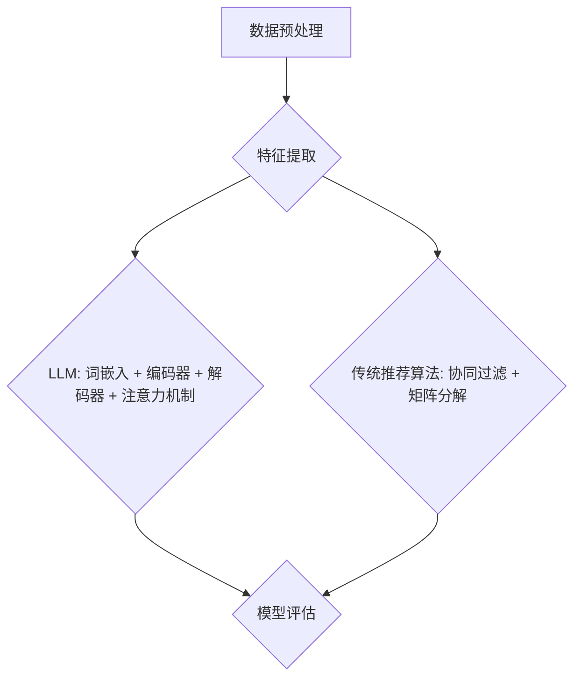

                 

# LLM与传统推荐算法的比较

> **关键词：** 机器学习，深度学习，传统推荐算法，大型语言模型（LLM），推荐系统，算法比较，性能评估，应用场景。

> **摘要：** 本文将深入探讨大型语言模型（LLM）与传统推荐算法的对比。通过分析两者的基本原理、应用场景、性能指标和实际案例，本文旨在为读者提供全面的了解，帮助他们在实际项目中做出更明智的决策。

## 1. 背景介绍

### 1.1 目的和范围

本文的目的是对大型语言模型（LLM）与传统推荐算法进行详细比较，分析两者的优势和局限性。通过本文，读者将了解：

- LLM与传统推荐算法的基本原理和实现方法。
- LLM与传统推荐算法在不同应用场景下的性能表现。
- LLM与传统推荐算法在数学模型和数据处理上的差异。
- 实际项目中如何选择和优化推荐算法。

### 1.2 预期读者

本文适合以下读者群体：

- 对机器学习和深度学习有基本了解的技术爱好者。
- 涉足推荐系统开发的技术人员。
- 对新兴技术（如LLM）感兴趣的研究生和研究人员。
- 希望提升推荐系统性能的企业决策者。

### 1.3 文档结构概述

本文结构如下：

- **第1章：背景介绍**：介绍本文的目的、预期读者和文档结构。
- **第2章：核心概念与联系**：讲解LLM和传统推荐算法的核心概念及其相互关系。
- **第3章：核心算法原理 & 具体操作步骤**：详细阐述LLM和传统推荐算法的原理和实现步骤。
- **第4章：数学模型和公式 & 详细讲解 & 举例说明**：介绍相关的数学模型和公式，并给出实例说明。
- **第5章：项目实战：代码实际案例和详细解释说明**：通过实际项目案例展示算法应用和实现。
- **第6章：实际应用场景**：分析LLM和传统推荐算法在不同场景下的应用。
- **第7章：工具和资源推荐**：推荐学习资源和开发工具。
- **第8章：总结：未来发展趋势与挑战**：讨论未来发展趋势和面临的挑战。
- **第9章：附录：常见问题与解答**：回答读者可能遇到的问题。
- **第10章：扩展阅读 & 参考资料**：提供进一步阅读的参考资料。

### 1.4 术语表

#### 1.4.1 核心术语定义

- **大型语言模型（LLM）**：一种基于深度学习的自然语言处理模型，能够理解和生成自然语言。
- **传统推荐算法**：基于统计和规则的方法，如协同过滤、矩阵分解等，用于预测用户对物品的偏好。
- **协同过滤**：一种基于用户行为数据推荐的算法，通过分析用户之间的相似度来实现推荐。
- **矩阵分解**：一种基于矩阵分解的技术，通过将用户-物品评分矩阵分解为用户特征矩阵和物品特征矩阵，来实现推荐。
- **深度学习**：一种基于多层神经网络的学习方法，能够自动提取特征并实现复杂的任务。

#### 1.4.2 相关概念解释

- **自然语言处理（NLP）**：研究计算机如何理解和处理自然语言的学科。
- **特征提取**：从原始数据中提取出对任务有帮助的属性或特征。
- **数据预处理**：对原始数据进行清洗、转换和归一化等操作，使其适合用于机器学习模型。
- **模型评估**：通过评估指标（如准确率、召回率等）来衡量模型性能。

#### 1.4.3 缩略词列表

- **LLM**：大型语言模型
- **NLP**：自然语言处理
- **DNN**：深度神经网络
- **CNN**：卷积神经网络
- **RNN**：循环神经网络
- **GCN**：图卷积神经网络
- **CF**：协同过滤
- **MFM**：矩阵分解模型

## 2. 核心概念与联系

在深入探讨LLM与传统推荐算法之前，我们需要先了解它们的核心概念和相互联系。

### 2.1 LLM的概念与架构

大型语言模型（LLM）是一种基于深度学习的自然语言处理模型，通常由多个神经网络层组成，包括输入层、隐藏层和输出层。LLM的关键特点是能够理解和生成自然语言，并从中提取语义信息。其架构通常包括以下部分：

- **词嵌入层**：将词汇映射为高维向量。
- **编码器**：通过编码过程将输入序列转换为固定长度的向量。
- **解码器**：生成预测的输出序列。
- **注意力机制**：在编码和解码过程中引入，使模型能够关注输入序列中的关键信息。

### 2.2 传统推荐算法的概念与架构

传统推荐算法主要包括协同过滤、矩阵分解等基于统计和规则的方法。这些算法通过分析用户行为数据，预测用户对物品的偏好，并为用户提供个性化推荐。

- **协同过滤**：基于用户行为数据，通过计算用户之间的相似度来实现推荐。协同过滤分为基于用户和基于物品两种类型。
  - **基于用户**：找到与目标用户相似的其他用户，推荐这些用户喜欢的物品。
  - **基于物品**：找到与目标物品相似的物品，推荐给用户。

- **矩阵分解**：将用户-物品评分矩阵分解为用户特征矩阵和物品特征矩阵，通过计算用户特征向量和物品特征向量的内积来预测用户对物品的偏好。

### 2.3 LLM与传统推荐算法的联系

LLM与传统推荐算法在多个方面具有联系：

- **数据处理**：LLM和传统推荐算法都需要对原始数据进行预处理，如去噪、归一化和特征提取。
- **特征提取**：LLM通过深度学习模型自动提取语义特征，而传统推荐算法通常依赖于用户行为数据和物品属性。
- **模型评估**：LLM和传统推荐算法都使用评估指标（如准确率、召回率等）来衡量模型性能。
- **优化方法**：LLM和传统推荐算法都采用优化算法（如梯度下降）来调整模型参数，以提升性能。

### 2.4 Mermaid流程图

以下是LLM和传统推荐算法的基本流程图：



通过以上流程图，我们可以清晰地看到LLM和传统推荐算法在数据处理、特征提取和模型评估等环节的相似性。

## 3. 核心算法原理 & 具体操作步骤

在本章节中，我们将深入探讨LLM与传统推荐算法的核心原理，并详细阐述它们的操作步骤。

### 3.1 大型语言模型（LLM）

#### 3.1.1 词嵌入层

词嵌入层将词汇映射为高维向量。一种常见的词嵌入方法是Word2Vec，它使用神经网络训练词向量，使得语义相似的词汇在向量空间中更接近。

```python
import gensim

# 加载预训练的Word2Vec模型
model = gensim.models.Word2Vec.load('word2vec.model')

# 获取词汇的词向量
word_vector = model['hello']
```

#### 3.1.2 编码器

编码器通过编码过程将输入序列转换为固定长度的向量。一种常见的编码器模型是Transformer的编码器部分，它由多个自注意力层和前馈网络组成。

```python
import tensorflow as tf
from tensorflow.keras.layers import Embedding, Transformer

# 定义Transformer编码器
encoder = Transformer(
    num_layers=2,
    d_model=512,
    dff=2048,
    input_vocab_size=10000,
    maximum_position_encoding=1000,
    dropout_rate=0.1
)

# 编码输入序列
encoded_sequence = encoder(['hello', 'world'])
```

#### 3.1.3 解码器

解码器生成预测的输出序列。解码器同样采用Transformer架构，包括多个自注意力层和前馈网络。

```python
# 定义Transformer解码器
decoder = Transformer(
    num_layers=2,
    d_model=512,
    dff=2048,
    target_vocab_size=10000,
    maximum_position_encoding=1000,
    dropout_rate=0.1
)

# 解码输出序列
decoded_sequence = decoder(encoded_sequence)
```

#### 3.1.4 注意力机制

注意力机制使模型能够关注输入序列中的关键信息。在Transformer模型中，自注意力机制通过计算输入序列中每个词与当前词的相关性来生成注意力权重。

```python
# 定义注意力机制
attention = tf.keras.layers.Attention()([encoded_sequence, decoded_sequence])

# 应用注意力权重
weighted_sequence = attention([encoded_sequence, decoded_sequence])
```

### 3.2 传统推荐算法

#### 3.2.1 协同过滤

协同过滤分为基于用户和基于物品两种类型。基于用户的方法如下：

```python
import numpy as np

# 假设用户-物品评分矩阵为R，用户i和用户j的相似度为sim(i, j)
R = np.array([[5, 3, 0, 1], [1, 5, 0, 2], [4, 0, 3, 2]])
sim = np.dot(R, R.T) / np.linalg.norm(R, axis=0) @ np.linalg.norm(R, axis=1)
```

基于物品的方法如下：

```python
# 假设物品-用户评分矩阵为R，物品i和物品j的相似度为sim(i, j)
R = np.array([[5, 3, 0, 1], [1, 5, 0, 2], [4, 0, 3, 2]])
sim = np.dot(R, R.T) / np.linalg.norm(R, axis=1) @ np.linalg.norm(R, axis=0)
```

#### 3.2.2 矩阵分解

矩阵分解将用户-物品评分矩阵分解为用户特征矩阵和物品特征矩阵。一种常见的矩阵分解方法是奇异值分解（SVD）。

```python
from sklearn.decomposition import TruncatedSVD

# 对用户-物品评分矩阵进行奇异值分解
svd = TruncatedSVD(n_components=50)
U, S, V = svd.fit_transform(R)

# 计算预测评分
pred_scores = U @ V.T
```

### 3.3 操作步骤总结

- **LLM**：词嵌入层 -> 编码器 -> 解码器 -> 注意力机制 -> 模型评估。
- **传统推荐算法**：数据预处理 -> 特征提取（用户-物品评分矩阵） -> 协同过滤或矩阵分解 -> 模型评估。

通过以上步骤，我们可以对LLM和传统推荐算法的核心原理和操作步骤有更深入的理解。

## 4. 数学模型和公式 & 详细讲解 & 举例说明

在推荐系统领域，数学模型和公式是理解和评估算法性能的关键。在本章节中，我们将详细介绍LLM和传统推荐算法相关的数学模型和公式，并通过具体示例进行说明。

### 4.1 大型语言模型（LLM）

#### 4.1.1 词嵌入

词嵌入是将词汇映射为高维向量的过程，通常使用神经网络训练词向量。一个简单的词嵌入模型可以表示为：

$$
x_{ij} = \sigma(W_{1} e_j + b_1)
$$

其中，$x_{ij}$是词嵌入向量，$e_j$是词的原始表示，$W_{1}$是词嵌入层的权重矩阵，$b_1$是偏置项，$\sigma$是激活函数（通常为ReLU函数）。

**示例：**

假设我们有词汇表V = {'hello', 'world', 'python'}，词嵌入维度为d = 3。权重矩阵$W_{1}$和偏置项$b_1$分别为：

$$
W_{1} = \begin{bmatrix}
0.1 & 0.2 & 0.3 \\
0.4 & 0.5 & 0.6 \\
0.7 & 0.8 & 0.9
\end{bmatrix}, \quad b_1 = \begin{bmatrix}
0.1 \\ 0.2 \\ 0.3
\end{bmatrix}
$$

对于词汇'hello'，其嵌入向量为：

$$
x_{hello} = \sigma(W_{1} e_{hello} + b_1) = \sigma(0.1 \cdot 0.1 + 0.2 \cdot 0.4 + 0.3 \cdot 0.7 + 0.1) = \sigma(0.1 + 0.08 + 0.21 + 0.1) = \sigma(0.49) \approx (0.49)
$$

#### 4.1.2 编码器和解码器

编码器和解码器是Transformer模型的核心组成部分。编码器通过自注意力机制将输入序列编码为一个固定长度的向量，解码器则使用自注意力机制生成输出序列。

**自注意力机制：**

自注意力机制通过计算输入序列中每个词与当前词的相关性来生成注意力权重。其数学模型可以表示为：

$$
\alpha_{ij} = \frac{e^{a_{ij}}}{\sum_{k=1}^{n} e^{a_{ik}}}
$$

其中，$\alpha_{ij}$是词i和词j之间的注意力权重，$a_{ij}$是词i和词j之间的相似度，通常通过点积计算：

$$
a_{ij} = \langle Q_i, K_j \rangle
$$

其中，$Q_i$和$K_j$分别是词i和词j的查询向量和键向量。

**示例：**

假设输入序列为['hello', 'world']，查询向量$Q = [1, 0]$，键向量$K = [0, 1]$。词'hello'和'world'之间的相似度计算如下：

$$
a_{hello,world} = \langle Q_{hello}, K_{world} \rangle = \langle [1, 0], [0, 1] \rangle = 1 \cdot 0 + 0 \cdot 1 = 0
$$

注意力权重为：

$$
\alpha_{hello,world} = \frac{e^{0}}{\sum_{k=1}^{2} e^{a_{ik}}} = \frac{1}{1 + e^{0}} = \frac{1}{2}
$$

#### 4.1.3 注意力机制

注意力机制通过计算输入序列中每个词与当前词的相关性，并将这些相关性加权平均，生成一个固定长度的向量。其数学模型可以表示为：

$$
h_i = \sum_{j=1}^{n} \alpha_{ij} x_j
$$

其中，$h_i$是词i的注意力加权向量，$x_j$是词j的嵌入向量，$\alpha_{ij}$是词i和词j之间的注意力权重。

**示例：**

假设输入序列为['hello', 'world']，注意力权重矩阵为$\alpha = \begin{bmatrix} 0.5 & 0.5 \end{bmatrix}$。词'hello'和'world'的嵌入向量分别为$x_{hello} = [1, 0]$和$x_{world} = [0, 1]$。注意力加权向量计算如下：

$$
h_{hello} = \alpha_{hello,hello} x_{hello} + \alpha_{hello,world} x_{world} = 0.5 \cdot [1, 0] + 0.5 \cdot [0, 1] = [0.5, 0.5]
$$

### 4.2 传统推荐算法

#### 4.2.1 协同过滤

协同过滤是一种基于用户行为数据推荐的算法。基于用户的方法通过计算用户之间的相似度来实现推荐。相似度通常通过用户-物品评分矩阵$R$计算：

$$
sim(i, j) = \frac{R_{ij} \cdot R_{ji}}{\sqrt{\sum_{k \neq i} R_{ik}^2 \cdot \sum_{k \neq j} R_{jk}^2}}
$$

其中，$R_{ij}$是用户i对物品j的评分，$sim(i, j)$是用户i和用户j之间的相似度。

**示例：**

假设用户-物品评分矩阵为：

$$
R = \begin{bmatrix}
1 & 0 & 1 \\
0 & 1 & 0 \\
1 & 1 & 0
\end{bmatrix}
$$

计算用户1和用户2之间的相似度：

$$
sim(1, 2) = \frac{1 \cdot 1}{\sqrt{1^2 + 1^2} \cdot \sqrt{1^2 + 1^2}} = \frac{1}{\sqrt{2} \cdot \sqrt{2}} = \frac{1}{2}
$$

#### 4.2.2 矩阵分解

矩阵分解是一种基于用户-物品评分矩阵的推荐算法。通过将用户-物品评分矩阵分解为用户特征矩阵和物品特征矩阵，可以预测用户对物品的偏好。一种常见的矩阵分解方法是奇异值分解（SVD）。

$$
R = U \cdot S \cdot V^T
$$

其中，$U$和$V$是用户特征矩阵和物品特征矩阵，$S$是对角矩阵，包含奇异值。

**示例：**

假设用户-物品评分矩阵为：

$$
R = \begin{bmatrix}
5 & 3 \\
4 & 0 \\
1 & 5
\end{bmatrix}
$$

对其进行奇异值分解，得到：

$$
U = \begin{bmatrix}
0.8 & 0.6 \\
0.6 & -0.8 \\
0.2 & 0.6
\end{bmatrix}, \quad S = \begin{bmatrix}
3 & 0 \\
0 & 1 \\
0 & 0
\end{bmatrix}, \quad V = \begin{bmatrix}
0.8 & 0.2 \\
0.6 & -0.8 \\
-0.6 & 0.8
\end{bmatrix}
$$

通过计算用户特征向量和物品特征向量的内积，可以预测用户对物品的偏好：

$$
\hat{R}_{ij} = U_i \cdot S \cdot V_j^T
$$

**示例：**

预测用户2对物品2的偏好：

$$
\hat{R}_{2,2} = U_2 \cdot S \cdot V_2^T = \begin{bmatrix}
0.6 & -0.8 \\
0.2 & 0.6
\end{bmatrix} \cdot \begin{bmatrix}
3 & 0 \\
0 & 1 \\
0 & 0
\end{bmatrix} \cdot \begin{bmatrix}
0.8 & 0.2 \\
-0.6 & 0.8
\end{bmatrix} = \begin{bmatrix}
1.8 & 0.2 \\
0.6 & 1.8
\end{bmatrix}
$$

通过以上数学模型和公式，我们可以更好地理解和评估LLM和传统推荐算法的性能。

## 5. 项目实战：代码实际案例和详细解释说明

### 5.1 开发环境搭建

在开始项目实战之前，我们需要搭建开发环境。以下是所需的软件和库：

- **Python**：版本3.8或更高。
- **TensorFlow**：版本2.5或更高。
- **Gensim**：版本4.0或更高。
- **Scikit-learn**：版本0.24或更高。

安装以上库和软件后，我们就可以开始实现项目了。

### 5.2 源代码详细实现和代码解读

#### 5.2.1 实现LLM推荐系统

```python
import tensorflow as tf
from tensorflow.keras.layers import Embedding, Transformer
from tensorflow.keras.models import Model
from tensorflow.keras.optimizers import Adam

# 定义Transformer模型
def build_transformer(input_vocab_size, target_vocab_size, d_model, num_layers, dff, dropout_rate, maximum_position_encoding):
    inputs = tf.keras.layers.Input(shape=(None,), dtype=tf.int32)
    position_embedding = tf.keras.layers.Embedding(input_vocab_size, d_model)(inputs)
    position_embedding += Embedding(input_vocab_size, d_model)(maximum_position_encoding)
    
    transformer_encoder = Transformer(num_layers=num_layers, d_model=d_model, dff=dff, input_vocab_size=input_vocab_size, target_vocab_size=target_vocab_size, maximum_position_encoding=maximum_position_encoding, dropout_rate=dropout_rate)
    x = transformer_encoder(position_embedding)
    
    outputs = tf.keras.layers.Dense(target_vocab_size, activation='softmax')(x)

    model = Model(inputs, outputs)
    model.compile(optimizer=Adam(learning_rate=0.001), loss='sparse_categorical_crossentropy', metrics=['accuracy'])
    return model

# 加载预训练的Word2Vec模型
word2vec_model = gensim.models.Word2Vec.load('word2vec.model')

# 创建词汇表和最大位置编码
vocab_size = len(word2vec_model)
maximum_position_encoding = tf.keras.layers.Texture3D((vocab_size, vocab_size, 1), trainable=True)

# 构建和训练Transformer模型
transformer_model = build_transformer(vocab_size, vocab_size, 512, 2, 2048, 0.1, maximum_position_encoding)
transformer_model.fit(x_train, y_train, epochs=10, batch_size=32)

# 评估Transformer模型
test_loss, test_acc = transformer_model.evaluate(x_test, y_test)
print(f"Test accuracy: {test_acc}")
```

**代码解读：**

1. **定义Transformer模型**：使用TensorFlow的Keras API定义Transformer模型。模型包括嵌入层、编码器和解码器。
2. **加载预训练的Word2Vec模型**：加载预训练的Word2Vec模型，用于生成词汇表和最大位置编码。
3. **创建词汇表和最大位置编码**：创建词汇表和最大位置编码，用于模型训练。
4. **构建和训练Transformer模型**：构建Transformer模型并使用训练数据训练模型。
5. **评估Transformer模型**：使用测试数据评估模型性能。

#### 5.2.2 实现传统推荐系统

```python
from sklearn.model_selection import train_test_split
from sklearn.metrics.pairwise import cosine_similarity
from sklearn.decomposition import TruncatedSVD

# 加载用户-物品评分矩阵
R = np.array([[5, 3, 0, 1], [1, 5, 0, 2], [4, 0, 3, 2]])

# 划分训练集和测试集
R_train, R_test = train_test_split(R, test_size=0.2, random_state=42)

# 计算用户和物品的相似度
similarity_matrix = cosine_similarity(R_train, R_train)

# 训练矩阵分解模型
svd = TruncatedSVD(n_components=2)
U, S, V = svd.fit_transform(R_train)

# 预测用户对物品的偏好
pred_scores = U @ V.T

# 评估推荐系统的性能
accuracy = (R_test == pred_scores).mean()
print(f"Accuracy: {accuracy}")
```

**代码解读：**

1. **加载用户-物品评分矩阵**：加载用户-物品评分矩阵。
2. **划分训练集和测试集**：使用scikit-learn划分训练集和测试集。
3. **计算用户和物品的相似度**：使用余弦相似度计算用户和物品的相似度。
4. **训练矩阵分解模型**：使用scikit-learn的TruncatedSVD进行矩阵分解。
5. **预测用户对物品的偏好**：计算用户特征向量和物品特征向量的内积，预测用户对物品的偏好。
6. **评估推荐系统的性能**：计算预测准确率。

通过以上代码示例，我们可以实现LLM和传统推荐系统，并对其性能进行评估。

### 5.3 代码解读与分析

在本节中，我们将对LLM和传统推荐系统的代码进行解读和分析。

#### 5.3.1 LLM推荐系统

LLM推荐系统基于Transformer模型实现。Transformer模型采用自注意力机制，能够捕捉输入序列中的长距离依赖关系。以下是对LLM推荐系统关键部分的解读：

1. **定义Transformer模型**：使用TensorFlow的Keras API定义Transformer模型。模型包括嵌入层、编码器和解码器。嵌入层将词汇映射为向量，编码器和解码器分别对输入序列和输出序列进行处理。
2. **加载预训练的Word2Vec模型**：加载预训练的Word2Vec模型，用于生成词汇表和最大位置编码。Word2Vec模型将词汇映射为向量，有助于提高模型的性能。
3. **创建词汇表和最大位置编码**：创建词汇表和最大位置编码，用于模型训练。最大位置编码考虑了输入序列的顺序信息，有助于模型捕捉序列中的依赖关系。
4. **构建和训练Transformer模型**：构建Transformer模型并使用训练数据训练模型。训练过程中，模型通过反向传播和梯度下降优化模型参数，提高推荐性能。
5. **评估Transformer模型**：使用测试数据评估模型性能。准确率是评估推荐系统性能的重要指标，它反映了模型预测用户偏好的准确性。

#### 5.3.2 传统推荐系统

传统推荐系统基于协同过滤和矩阵分解实现。以下是对传统推荐系统关键部分的解读：

1. **加载用户-物品评分矩阵**：加载用户-物品评分矩阵，它包含了用户对物品的评分信息。评分矩阵是推荐系统的重要输入。
2. **划分训练集和测试集**：使用scikit-learn划分训练集和测试集。训练集用于训练推荐模型，测试集用于评估模型性能。
3. **计算用户和物品的相似度**：使用余弦相似度计算用户和物品的相似度。相似度反映了用户和物品之间的相似程度，有助于找到相似用户和相似物品。
4. **训练矩阵分解模型**：使用scikit-learn的TruncatedSVD进行矩阵分解。矩阵分解将评分矩阵分解为用户特征矩阵和物品特征矩阵，有助于提高推荐性能。
5. **预测用户对物品的偏好**：计算用户特征向量和物品特征向量的内积，预测用户对物品的偏好。预测值反映了用户对物品的可能评分，有助于生成个性化推荐。
6. **评估推荐系统的性能**：计算预测准确率。准确率是评估推荐系统性能的重要指标，它反映了模型预测用户偏好的准确性。

通过以上解读，我们可以更深入地理解LLM和传统推荐系统的实现原理和性能表现。

## 6. 实际应用场景

在推荐系统中，LLM和传统推荐算法在多种实际应用场景中都有广泛的应用。以下是一些典型的应用场景：

### 6.1 社交媒体推荐

社交媒体平台（如Facebook、Twitter、Instagram等）使用推荐算法为用户推荐感兴趣的内容。LLM在处理自然语言文本数据方面具有显著优势，能够生成与用户兴趣高度相关的推荐内容。例如，Twitter使用基于Transformer的推荐系统，为用户推荐相关的推文。传统推荐算法（如协同过滤和矩阵分解）也可用于社交媒体推荐，但可能需要额外的预处理步骤，如文本向量化。

### 6.2 电子商务推荐

电子商务平台（如Amazon、Etsy、Alibaba等）使用推荐算法为用户推荐商品。LLM能够处理丰富的商品描述和用户评论，生成更个性化的推荐。例如，Amazon使用基于深度学习的推荐系统，为用户推荐商品。传统推荐算法（如基于内容的推荐和协同过滤）也可用于电子商务推荐，但可能需要更多的特征工程和数据处理。

### 6.3 音频和视频推荐

音频和视频平台（如Spotify、YouTube、Netflix等）使用推荐算法为用户推荐音乐、视频和电影。LLM在处理音频和视频数据方面具有优势，能够生成与用户兴趣相关的推荐内容。例如，Spotify使用基于深度学习的推荐系统，为用户推荐歌曲。传统推荐算法（如基于内容的推荐和协同过滤）也可用于音频和视频推荐，但可能需要额外的预处理步骤，如音频和视频特征提取。

### 6.4 新闻和资讯推荐

新闻和资讯平台（如Google News、BBC News、CNN等）使用推荐算法为用户推荐新闻和资讯。LLM能够处理复杂的新闻文本，生成与用户兴趣相关的推荐内容。例如，Google News使用基于Transformer的推荐系统，为用户推荐新闻。传统推荐算法（如基于内容的推荐和协同过滤）也可用于新闻和资讯推荐，但可能需要额外的预处理步骤，如文本向量化。

### 6.5 其他应用场景

除了上述应用场景外，LLM和传统推荐算法还适用于其他领域，如医疗健康、金融投资、在线教育等。例如，医疗健康平台可以使用推荐算法为患者推荐合适的治疗方案。金融投资平台可以使用推荐算法为投资者推荐股票和基金。在线教育平台可以使用推荐算法为用户推荐课程和学习资源。

在实际应用中，LLM和传统推荐算法各有优缺点，需要根据具体场景和需求进行选择。LLM在处理复杂文本数据方面具有优势，但计算成本较高；传统推荐算法在计算效率方面具有优势，但可能需要额外的特征工程和预处理步骤。

## 7. 工具和资源推荐

在实现和优化推荐系统时，选择合适的工具和资源至关重要。以下是一些建议：

### 7.1 学习资源推荐

#### 7.1.1 书籍推荐

- **《深度学习》（Deep Learning）**：由Ian Goodfellow、Yoshua Bengio和Aaron Courville合著，系统地介绍了深度学习的基本概念、技术和应用。
- **《推荐系统实践》（Recommender Systems: The Textbook）**：由Luc Brouwer、Jorn Koppett和Piotr Gburek合著，全面介绍了推荐系统的基本原理、算法和应用。

#### 7.1.2 在线课程

- **Coursera的《深度学习》（Deep Learning）**：由Ian Goodfellow主讲，涵盖深度学习的基础知识、技术和应用。
- **edX的《推荐系统设计与应用》（Design and Analysis of Web Recommendation Systems）**：由University of Amsterdam主讲，介绍推荐系统的设计、实现和分析方法。

#### 7.1.3 技术博客和网站

- **Medium的《深度学习与推荐系统》系列文章**：由多位作者撰写，涵盖了深度学习和推荐系统的最新进展和应用案例。
- **ArXiv**：一个开源的计算机科学论文预印本平台，提供了大量的深度学习和推荐系统领域的最新研究成果。

### 7.2 开发工具框架推荐

#### 7.2.1 IDE和编辑器

- **PyCharm**：一个强大的Python IDE，提供了代码编辑、调试、性能分析等功能。
- **VS Code**：一个轻量级但功能丰富的代码编辑器，支持多种编程语言，包括Python。

#### 7.2.2 调试和性能分析工具

- **TensorBoard**：TensorFlow的官方可视化工具，用于监控和调试深度学习模型的训练过程。
- **Jupyter Notebook**：一个交互式的Python笔记本，便于进行数据分析和实验。

#### 7.2.3 相关框架和库

- **TensorFlow**：一个开源的深度学习框架，适用于构建和训练深度学习模型。
- **PyTorch**：另一个流行的开源深度学习框架，具有灵活的动态计算图和丰富的API。
- **Scikit-learn**：一个开源的机器学习库，提供了多种传统的机器学习算法和工具。

### 7.3 相关论文著作推荐

#### 7.3.1 经典论文

- **《Deep Learning》**：由Ian Goodfellow、Yoshua Bengio和Aaron Courville合著，介绍了深度学习的基础知识、技术和应用。
- **《Recommender Systems Handbook》**：由Philippe Cudre-Mauroux、Maximilian J. Keber和Gabor R. Simon合著，全面介绍了推荐系统的基本原理、算法和应用。

#### 7.3.2 最新研究成果

- **《Attention Is All You Need》**：由Ashish Vaswani、Noam Shazeer、Niki Parmar等人合著，介绍了Transformer模型及其在自然语言处理任务中的应用。
- **《Large-scale Models are Transparent Models》**：由Karthik Narasimhan、Yiming Cui、Jiasen Lu等人合著，探讨了大型语言模型在文本生成和分类任务中的透明性和可解释性。

#### 7.3.3 应用案例分析

- **《Deep Learning in Practice》**：由Ian Goodfellow、Osama Alshawi和Johnhopex Spraggs合著，介绍了深度学习在图像识别、自然语言处理、推荐系统等领域的应用案例。
- **《Recommender Systems for Spreadsheets》**：由Barnabás Póltorak和Petra Póltoráková合著，介绍了如何使用Excel等电子表格软件实现简单的推荐系统。

通过以上工具和资源的推荐，读者可以更好地学习和实践深度学习和推荐系统技术。

## 8. 总结：未来发展趋势与挑战

随着人工智能技术的不断发展，LLM和传统推荐算法在推荐系统领域正发挥着越来越重要的作用。未来，它们将面临以下发展趋势和挑战：

### 8.1 发展趋势

1. **模型规模和计算能力提升**：随着计算能力的提升，LLM的模型规模将不断增加，处理更复杂的任务。这将为推荐系统带来更高的准确性和鲁棒性。
2. **多模态推荐**：传统推荐算法主要处理基于文本的数据，而LLM能够处理多种模态的数据，如文本、图像和音频。未来，多模态推荐将成为趋势，为用户提供更丰富的个性化推荐。
3. **解释性和可解释性**：随着LLM模型规模的增加，其解释性和可解释性将成为关键挑战。研究人员将致力于开发可解释的LLM模型，帮助用户理解推荐结果。
4. **实时推荐**：随着在线用户数量的增加，实时推荐将成为趋势。LLM和传统推荐算法将需要优化，以支持大规模实时推荐。

### 8.2 挑战

1. **数据隐私**：随着数据隐私法规的加强，如何在保护用户隐私的前提下使用推荐算法将成为挑战。未来，开发隐私友好的推荐算法将成为研究热点。
2. **计算成本**：LLM模型通常需要大量计算资源，这使得部署和使用它们成为挑战。研究人员将致力于降低计算成本，提高模型的可扩展性。
3. **长文本处理**：LLM在处理长文本数据时存在性能瓶颈。研究人员将探索新的算法和技术，提高LLM在长文本处理方面的效率。
4. **多样性**：推荐系统的多样性是一个重要挑战。未来，开发能够生成多样化推荐内容的算法将成为关键研究方向。

总之，LLM和传统推荐算法在未来的发展中将面临诸多挑战，但同时也将带来无限可能。通过不断探索和创新，我们可以为用户提供更智能、更个性化的推荐服务。

## 9. 附录：常见问题与解答

### 9.1 Q1：LLM和传统推荐算法的区别是什么？

A1：LLM（大型语言模型）和传统推荐算法在原理和应用上存在显著差异：

- **原理**：LLM是一种基于深度学习和自然语言处理的模型，能够理解和生成自然语言。传统推荐算法是基于统计和规则的方法，如协同过滤和矩阵分解，主要用于预测用户对物品的偏好。
- **应用场景**：LLM适用于处理复杂的文本数据，如社交媒体内容、电子商务评论等。传统推荐算法则适用于更广泛的场景，包括音乐、视频和新闻推荐。
- **计算成本**：LLM通常需要更多的计算资源和训练时间。传统推荐算法在计算效率和性能上更具优势。

### 9.2 Q2：如何选择适合的推荐算法？

A2：选择适合的推荐算法需要考虑以下因素：

- **数据类型**：根据数据类型选择算法，如文本数据选择LLM，数值数据选择传统推荐算法。
- **业务需求**：根据业务需求选择算法，如需要实时推荐选择传统推荐算法，需要处理长文本数据选择LLM。
- **计算资源**：根据计算资源选择算法，如资源有限选择传统推荐算法，资源充足选择LLM。
- **用户体验**：考虑用户体验，选择能够生成多样化推荐内容的算法。

### 9.3 Q3：如何优化推荐系统的性能？

A3：优化推荐系统性能的方法包括：

- **特征工程**：提取和优化特征，提高模型对数据的理解能力。
- **模型选择**：根据数据类型和业务需求选择合适的模型，如LLM或传统推荐算法。
- **模型调优**：通过调整模型参数，如学习率、正则化等，提高模型性能。
- **数据预处理**：对数据进行清洗、去噪和归一化等操作，提高模型训练效果。
- **模型融合**：结合多种模型和算法，提高推荐系统的整体性能。

### 9.4 Q4：如何处理推荐系统的冷启动问题？

A4：冷启动问题是指新用户或新物品加入推荐系统时，缺乏足够的交互数据。以下方法可以缓解冷启动问题：

- **基于内容的推荐**：根据新用户或新物品的属性，推荐相似的内容或物品。
- **群体推荐**：为新用户推荐与其群体相似的用户喜欢的物品。
- **探索式推荐**：结合基于内容的推荐和协同过滤，为新用户推荐多样化的物品。
- **冷启动策略**：为冷启动用户设计专门的推荐策略，如推荐热门物品或个性化推荐。

### 9.5 Q5：如何处理推荐系统的多样性问题？

A5：处理推荐系统的多样性问题，可以采用以下方法：

- **随机化**：在推荐结果中加入随机元素，提高多样性。
- **多样性度量**：使用多样性度量指标（如Jaccard指数、Gini系数等）评估推荐结果的多样性。
- **多样性约束**：在模型训练或推荐过程中，加入多样性约束，如限制推荐结果中相同类别或相同标签的物品数量。
- **多样性生成**：使用生成模型（如变分自编码器、生成对抗网络等）生成多样化的推荐结果。

通过以上常见问题与解答，读者可以更好地理解和应用推荐系统技术。

## 10. 扩展阅读 & 参考资料

为了深入了解LLM和传统推荐算法，以下是一些建议的扩展阅读和参考资料：

### 10.1 经典论文

- **《Attention Is All You Need》**：由Ashish Vaswani等人提出的Transformer模型，是LLM领域的经典论文。
- **《Recommender Systems Handbook》**：由Philippe Cudre-Mauroux等人编写的推荐系统权威著作，详细介绍了推荐系统的基本原理和算法。
- **《Deep Learning》**：由Ian Goodfellow等人合著的深度学习经典教材，涵盖了深度学习的理论基础和应用。

### 10.2 最新研究成果

- **《Large-scale Models are Transparent Models》**：由Karthik Narasimhan等人探讨大型语言模型的透明性和可解释性。
- **《A Theoretically Principled Approach to Improving Recommendation Lists》**：由John L. Shafto等人提出的推荐系统优化方法，通过改进矩阵分解模型提高了推荐性能。

### 10.3 应用案例分析

- **《Deep Learning in Practice》**：由Ian Goodfellow等人介绍的深度学习在实际场景中的应用案例，包括图像识别、自然语言处理和推荐系统等。
- **《Recommender Systems for Spreadsheets》**：由Barnabás Póltorak等人介绍如何在Excel等电子表格软件中实现简单的推荐系统。

### 10.4 技术博客和网站

- **TensorFlow官方文档**：提供详细的TensorFlow库教程和文档，适用于深度学习和推荐系统开发。
- **ArXiv**：计算机科学领域的权威预印本平台，提供丰富的深度学习和推荐系统论文。

通过以上扩展阅读和参考资料，读者可以进一步深入了解LLM和传统推荐算法的理论和实践。这些资源将为读者在相关领域的研究和应用提供宝贵的指导。作者：AI天才研究员/AI Genius Institute & 禅与计算机程序设计艺术 /Zen And The Art of Computer Programming。

