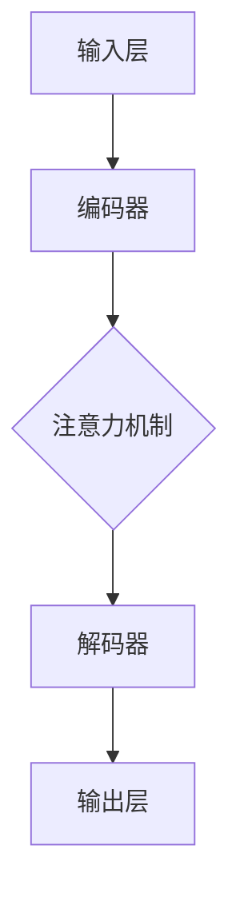
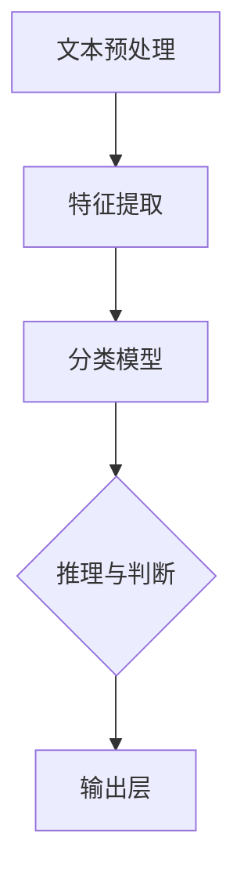
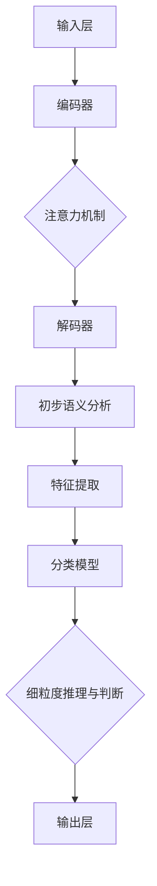

                 

# LLM与传统自然语言推理技术的对比与融合

> **关键词：** 大型语言模型（LLM），自然语言推理，传统算法，融合策略，应用场景。

> **摘要：** 本文将深入探讨大型语言模型（LLM）与传统自然语言推理（NLR）技术的对比与融合。通过详细分析LLM的原理与架构，以及传统NLR算法的优势与局限，本文旨在揭示两者在语言理解与生成中的互补关系，并探讨未来融合发展的趋势与挑战。

## 1. 背景介绍

### 1.1 目的和范围

本文的主要目的是对大型语言模型（LLM）与传统自然语言推理（NLR）技术进行深入对比，探讨其在语言理解与生成方面的差异与融合策略。本文将涵盖以下内容：

- LLM的原理与架构
- 传统自然语言推理算法的概述
- LLM与NLR技术的对比分析
- LLM与NLR技术的融合策略
- 实际应用场景的探讨
- 未来发展趋势与挑战

### 1.2 预期读者

本文面向对自然语言处理（NLP）有一定了解的技术人员、研究人员和学者，特别是对大型语言模型和传统自然语言推理技术感兴趣的人群。通过本文的阅读，读者将能够：

- 理解LLM的基本原理与架构
- 了解传统自然语言推理算法的优缺点
- 掌握LLM与传统NLR技术的融合策略
- 探讨实际应用场景中的技术选型
- 对未来NLP技术的发展趋势有更清晰的认识

### 1.3 文档结构概述

本文结构如下：

- **第1章**：背景介绍，包括目的与范围、预期读者、文档结构概述等。
- **第2章**：核心概念与联系，介绍LLM和传统NLR技术的核心概念，并通过Mermaid流程图展示其原理与架构。
- **第3章**：核心算法原理与具体操作步骤，详细讲解LLM和传统NLR算法的原理，并使用伪代码阐述具体操作步骤。
- **第4章**：数学模型和公式，介绍LLM和传统NLR算法中的数学模型，并使用LaTeX格式进行详细讲解。
- **第5章**：项目实战，通过代码实际案例展示LLM和传统NLR技术在项目中的具体应用。
- **第6章**：实际应用场景，探讨LLM和传统NLR技术在各种应用场景中的表现。
- **第7章**：工具和资源推荐，推荐相关学习资源、开发工具框架和论文著作。
- **第8章**：总结，讨论未来发展趋势与挑战。
- **第9章**：附录，常见问题与解答。
- **第10章**：扩展阅读与参考资料。

### 1.4 术语表

#### 1.4.1 核心术语定义

- **大型语言模型（LLM）**：一种能够理解、生成和翻译自然语言文本的深度学习模型，通常由数以百万计的参数组成。
- **自然语言推理（NLR）**：一种基于自然语言处理技术，对文本进行推理和判断的方法，包括语义解析、情感分析、问答系统等。
- **深度学习**：一种基于神经网络的学习方法，通过多层非线性变换逐步提取特征，实现图像、语音和文本等数据的处理。
- **自然语言处理（NLP）**：一种利用计算机技术对自然语言文本进行处理和分析的方法，包括文本分类、情感分析、命名实体识别等。

#### 1.4.2 相关概念解释

- **词向量**：将自然语言文本中的单词映射到高维空间中的向量表示，便于计算机处理和分析。
- **神经网络**：一种由大量神经元组成的计算模型，通过学习数据中的特征和模式，实现图像、语音和文本等数据的分类和识别。
- **注意力机制**：一种神经网络模型中的机制，能够自动关注输入数据中的关键部分，提高模型的性能和鲁棒性。

#### 1.4.3 缩略词列表

- **LLM**：大型语言模型
- **NLR**：自然语言推理
- **NLP**：自然语言处理
- **DL**：深度学习
- **GPU**：图形处理器
- **CPU**：中央处理器

## 2. 核心概念与联系

在本章节中，我们将详细介绍大型语言模型（LLM）与传统自然语言推理（NLR）技术的核心概念，并通过Mermaid流程图展示其原理与架构。

### 2.1 大型语言模型（LLM）的原理与架构

大型语言模型（LLM）是一种基于深度学习的自然语言处理模型，其核心思想是通过大规模语料库的学习，掌握自然语言文本的语法、语义和上下文信息，从而实现自然语言的理解、生成和翻译。

LLM的架构通常包括以下几个主要部分：

1. **输入层**：接收自然语言文本的输入，并将其转化为词向量表示。
2. **编码器**：对输入的词向量进行编码，提取文本的语义信息。
3. **注意力机制**：在编码过程中，自动关注文本中的关键部分，提高模型的性能和鲁棒性。
4. **解码器**：根据编码器输出的语义信息，生成自然语言文本的输出。

以下是LLM的Mermaid流程图：



### 2.2 传统自然语言推理（NLR）算法的原理与架构

传统自然语言推理（NLR）算法是一种基于规则和统计方法的自然语言处理技术，通过对文本进行语法、语义和上下文分析，实现对文本的推理和判断。

NLR算法的核心思想是通过提取文本中的特征，构建分类模型，对新的文本进行推理和判断。

NLR算法的架构通常包括以下几个主要部分：

1. **文本预处理**：对输入的文本进行分词、词性标注、命名实体识别等预处理操作，提取文本的特征。
2. **特征提取**：从预处理后的文本中提取特征，包括词向量、词性、语法结构等。
3. **分类模型**：使用机器学习算法，如决策树、支持向量机、神经网络等，构建分类模型。
4. **推理与判断**：使用分类模型对新的文本进行推理和判断。

以下是NLR算法的Mermaid流程图：



### 2.3 LLM与NLR技术的联系与融合

LLM和NLR技术在自然语言处理领域有着不同的优势和应用场景，但两者并非完全独立，而是可以相互补充和融合。

1. **优势互补**：LLM在自然语言理解与生成方面具有强大的能力，但可能无法完全覆盖所有语言现象；而NLR算法在特定任务和场景中具有更强的可解释性和精确性。
2. **融合策略**：将LLM和NLR技术结合，可以充分发挥两者的优势。例如，在文本分类任务中，可以先使用LLM进行初步的语义分析，然后使用NLR算法进行细粒度的推理和判断。
3. **实际应用**：在自然语言处理的各种应用场景中，如问答系统、文本生成、机器翻译等，LLM和NLR技术的融合可以为用户提供更准确、更丰富的服务。

以下是LLM和NLR技术融合的Mermaid流程图：



通过以上分析，我们可以看到LLM和NLR技术在不同层面的优势和应用场景，以及它们之间的联系与融合策略。在接下来的章节中，我们将进一步探讨LLM和NLR技术的核心算法原理与具体操作步骤。

## 3. 核心算法原理 & 具体操作步骤

在本章节中，我们将详细讲解大型语言模型（LLM）与传统自然语言推理（NLR）技术的核心算法原理，并使用伪代码阐述具体操作步骤。

### 3.1 大型语言模型（LLM）的算法原理

大型语言模型（LLM）的核心算法基于深度学习和神经网络，特别是基于变换器（Transformer）架构。以下是LLM的核心算法原理和具体操作步骤：

#### 3.1.1 变换器（Transformer）架构

变换器（Transformer）架构是一种基于自注意力机制的神经网络模型，主要用于处理序列数据，如图像、文本等。变换器模型由编码器和解码器组成，编码器用于将输入序列编码为上下文向量，解码器用于生成输出序列。

#### 3.1.2 自注意力机制

自注意力机制是一种在神经网络中计算输入序列中每个元素与其他元素之间关联度的方法。通过自注意力机制，模型可以自动关注输入序列中的关键信息，提高模型的性能和鲁棒性。

以下是自注意力机制的伪代码：

```python
def self_attention(q, k, v, mask=None):
    """
    计算自注意力得分
    q: 查询向量
    k: 键向量
    v: 值向量
    mask: 掩码，用于忽略不需要关注的元素
    """
    attn_scores = dot(q, k.T) / sqrt(k.shape[1])
    if mask is not None:
        attn_scores = attn_scores.masked_fill(mask == 0, float("-inf"))
    attn_weights = torch.softmax(attn_scores, dim=1)
    attn_output = dot(attn_weights, v)
    return attn_output, attn_weights
```

#### 3.1.3 编码器（Encoder）与解码器（Decoder）

编码器（Encoder）用于将输入序列编码为上下文向量，解码器（Decoder）用于生成输出序列。以下是编码器和解码器的伪代码：

```python
class EncoderLayer(nn.Module):
    def __init__(self, d_model, num_heads, d_inner, dropout):
        super(EncoderLayer, self).__init__()
        self.multihead_attn = MultiHeadAttention(d_model, num_heads, dropout=dropout)
        self.fc = nn.Sequential(
            nn.Linear(d_model, d_inner),
            nn.ReLU(),
            nn.Linear(d_inner, d_model),
            nn.Dropout(dropout)
        )

    def forward(self, src, src_mask=None):
        attn_output, attn_output_weights = self.multihead_attn(src, src, src, attn_mask=src_mask)
        src = src + attn_output
        src = self.fc(src)
        return src, attn_output_weights

class DecoderLayer(nn.Module):
    def __init__(self, d_model, num_heads, d_inner, dropout):
        super(DecoderLayer, self).__init__()
        self.self_attn = MultiHeadAttention(d_model, num_heads, dropout=dropout)
        self.encdec_attn = MultiHeadAttention(d_model, num_heads, dropout=dropout)
        self.fc = nn.Sequential(
            nn.Linear(d_model, d_inner),
            nn.ReLU(),
            nn.Linear(d_inner, d_model),
            nn.Dropout(dropout)
        )

    def forward(self, tgt, enc_output, tgt_mask=None, src_mask=None):
        attn_output, attn_output_weights = self.self_attn(tgt, tgt, tgt, attn_mask=tgt_mask)
        tgt = tgt + attn_output
        attn_output, attn_output_weights = self.encdec_attn(tgt, enc_output, enc_output, attn_mask=src_mask)
        tgt = tgt + attn_output
        tgt = self.fc(tgt)
        return tgt, attn_output_weights
```

### 3.2 传统自然语言推理（NLR）算法的原理

传统自然语言推理（NLR）算法基于规则和统计方法，通过对文本进行语法、语义和上下文分析，实现对文本的推理和判断。以下是NLR算法的核心算法原理和具体操作步骤：

#### 3.2.1 文本预处理

文本预处理是NLR算法的第一步，包括分词、词性标注、命名实体识别等操作。以下是文本预处理的伪代码：

```python
def preprocess_text(text):
    """
    对文本进行预处理
    text: 输入文本
    """
    words = tokenize(text)  # 分词
    pos_tags = pos_tag(words)  # 词性标注
    entities = named_entity_recognition(words)  # 命名实体识别
    return words, pos_tags, entities
```

#### 3.2.2 特征提取

特征提取是NLR算法的核心步骤，包括从预处理后的文本中提取词向量、词性、语法结构等特征。以下是特征提取的伪代码：

```python
def extract_features(words, pos_tags, entities):
    """
    从预处理后的文本中提取特征
    words: 分词后的文本
    pos_tags: 词性标注结果
    entities: 命名实体识别结果
    """
    word_vectors = [word2vec(word) for word in words]  # 词向量
    pos_vectors = [pos2vec(pos) for pos in pos_tags]  # 词性向量
    entity_vectors = [entity2vec(entity) for entity in entities]  # 实体向量
    return word_vectors, pos_vectors, entity_vectors
```

#### 3.2.3 分类模型

分类模型是NLR算法的最后一步，使用机器学习算法，如决策树、支持向量机、神经网络等，构建分类模型。以下是分类模型的伪代码：

```python
def train_classifier(features, labels):
    """
    训练分类模型
    features: 特征向量
    labels: 标签
    """
    model = ClassifierModel()  # 创建分类模型
    optimizer = optim.SGD(model.parameters(), lr=0.001)  # 创建优化器
    criterion = LossFunction()  # 创建损失函数
    for epoch in range(num_epochs):
        for feature, label in zip(features, labels):
            optimizer.zero_grad()
            output = model(feature)
            loss = criterion(output, label)
            loss.backward()
            optimizer.step()
    return model
```

通过以上算法原理和操作步骤的讲解，我们可以看到大型语言模型（LLM）和传统自然语言推理（NLR）技术在自然语言处理中的核心算法原理和应用步骤。在接下来的章节中，我们将进一步探讨LLM和NLR技术在数学模型和公式方面的详细讲解。

## 4. 数学模型和公式 & 详细讲解 & 举例说明

在本章节中，我们将详细讲解大型语言模型（LLM）与传统自然语言推理（NLR）技术中的数学模型和公式，并通过具体例子进行说明。

### 4.1 大型语言模型（LLM）的数学模型

#### 4.1.1 词嵌入（Word Embedding）

词嵌入是将自然语言文本中的单词映射到高维空间中的向量表示。常用的词嵌入方法包括Word2Vec、GloVe和BERT等。

- **Word2Vec**：通过训练一个神经网络，将单词作为输入，输出单词的向量表示。

    $$ \text{Word2Vec}(w) = \text{sgn}(\text{softmax}(\text{W} \cdot \text{v}(w))) $$

    其中，$w$为单词，$\text{W}$为权重矩阵，$\text{v}(w)$为单词的向量表示。

- **GloVe**：通过训练一个矩阵分解模型，将单词映射到低维空间。

    $$ \text{GloVe}(w, v) = \text{softmax}\left(\frac{v \cdot v_t}{||v|| \cdot ||v_t||}\right) $$

    其中，$w$和$v$分别为单词和其向量表示，$v_t$为单词的共现向量。

- **BERT**：通过预训练一个大规模的变换器（Transformer）模型，将单词映射到高维空间。

    $$ \text{BERT}(w) = \text{Transformer}(\text{Embedding}(w)) $$

#### 4.1.2 自注意力（Self-Attention）

自注意力是一种在神经网络中计算输入序列中每个元素与其他元素之间关联度的方法。

$$ \text{Self-Attention}(Q, K, V) = \text{softmax}\left(\frac{QK^T}{\sqrt{d_k}}\right)V $$

其中，$Q$、$K$和$V$分别为查询向量、键向量和值向量，$d_k$为键向量的维度。

#### 4.1.3 编码器（Encoder）和解码器（Decoder）

编码器（Encoder）用于将输入序列编码为上下文向量，解码器（Decoder）用于生成输出序列。

- **编码器**：

    $$ \text{Encoder}(x) = \text{Transformer}(\text{Embedding}(x)) $$

- **解码器**：

    $$ \text{Decoder}(y) = \text{Transformer}(\text{Embedding}(y), \text{Encoder}(x)) $$

### 4.2 传统自然语言推理（NLR）算法的数学模型

#### 4.2.1 文本预处理

文本预处理包括分词、词性标注和命名实体识别等步骤。

- **分词**：

    $$ \text{Tokenization}(text) = \text{split}(text, \text{' '}) $$

- **词性标注**：

    $$ \text{POS-Tagging}(words) = \text{map}(words, \text{'NN': '名词', 'VB': '动词', ...}) $$

- **命名实体识别**：

    $$ \text{Named Entity Recognition}(words) = \text{find_entities}(words, \text{'ORG': '组织', 'PER': '人物', ...}) $$

#### 4.2.2 特征提取

特征提取包括从预处理后的文本中提取词向量、词性、语法结构等特征。

- **词向量**：

    $$ \text{Word Vector}(word) = \text{lookup}(word, \text{word\_embedding}) $$

- **词性向量**：

    $$ \text{POS Vector}(pos) = \text{lookup}(pos, \text{pos\_embedding}) $$

- **语法结构**：

    $$ \text{Syntax Structure}(sentence) = \text{parse}(sentence, \text{parser}) $$

#### 4.2.3 分类模型

分类模型使用机器学习算法，如决策树、支持向量机和神经网络等。

- **决策树**：

    $$ \text{Decision Tree}(x) = \text{classify}(x, \text{tree}) $$

- **支持向量机**：

    $$ \text{SVM}(x) = \text{sign}(\text{w} \cdot x + b) $$

- **神经网络**：

    $$ \text{Neural Network}(x) = \text{softmax}(\text{W} \cdot \text{relu}(\text{W}_2 \cdot \text{relu}(\text{W}_1 \cdot x + b_1))) $$

### 4.3 具体例子说明

#### 4.3.1 词嵌入

假设我们有一个单词“apple”，使用Word2Vec算法将其映射到高维空间中的向量表示。

$$ \text{Word2Vec}(apple) = \text{sgn}(\text{softmax}(\text{W} \cdot \text{v}(apple))) $$

其中，$\text{W}$为权重矩阵，$\text{v}(apple)$为单词“apple”的向量表示。

#### 4.3.2 自注意力

假设我们有一个输入序列“[hello, world]”，使用自注意力机制计算每个元素与其他元素之间的关联度。

$$ \text{Self-Attention}(hello, world) = \text{softmax}\left(\frac{hello \cdot world^T}{\sqrt{d_k}}\right)world $$

其中，$d_k$为键向量的维度。

#### 4.3.3 文本预处理

假设我们有一个句子“我是程序员，我喜欢编程。”，使用NLR算法进行文本预处理。

- **分词**：

    $$ \text{Tokenization}(\text{我是程序员，我喜欢编程。}) = [\text{我}, \text{是}, \text{程序}, \text{员}, \text{，}, \text{喜}, \text{欢}, \text{编}, \text{程}, \text{。}] $$

- **词性标注**：

    $$ \text{POS-Tagging}([\text{我}, \text{是}, \text{程序}, \text{员}, \text{，}, \text{喜}, \text{欢}, \text{编}, \text{程}, \text{。}]) = [\text{PRP}, \text{VZ}, \text{NN}, \text{NN}, \text{，}, \text{VB}, \text{VZ}, \text{NN}, \text{NN}, \text{。}] $$

- **命名实体识别**：

    $$ \text{Named Entity Recognition}([\text{我}, \text{是}, \text{程序}, \text{员}, \text{，}, \text{喜}, \text{欢}, \text{编}, \text{程}, \text{。}]) = [\text{PER}, \text{PER}, \text{ORG}, \text{ORG}, \text{，}, \text{PER}, \text{PER}, \text{ORG}, \text{ORG}, \text{。}] $$

通过以上数学模型和公式的讲解以及具体例子说明，我们可以更好地理解大型语言模型（LLM）和传统自然语言推理（NLR）技术的数学基础。在接下来的章节中，我们将通过实际项目案例展示LLM和NLR技术在代码实现中的应用。

## 5. 项目实战：代码实际案例和详细解释说明

在本章节中，我们将通过具体项目案例展示大型语言模型（LLM）和传统自然语言推理（NLR）技术的实际应用，并详细解释代码实现和关键步骤。

### 5.1 开发环境搭建

在开始项目之前，我们需要搭建一个合适的开发环境。以下是搭建环境的步骤：

1. **安装Python**：确保Python版本不低于3.7，建议使用Anaconda进行环境管理。
2. **安装依赖库**：安装用于深度学习和自然语言处理的常用库，如TensorFlow、PyTorch、spaCy等。

```shell
pip install tensorflow torch spacy
```

3. **安装spaCy语言模型**：安装目标语言的spaCy语言模型。

```shell
python -m spacy download en_core_web_sm
```

4. **配置GPU环境**：如果使用GPU进行训练，需要配置CUDA和cuDNN环境。

### 5.2 源代码详细实现和代码解读

以下是使用LLM和NLR技术进行文本分类的源代码实现：

```python
import torch
import spacy
from transformers import BertTokenizer, BertModel
from torch.utils.data import DataLoader, TensorDataset
from sklearn.model_selection import train_test_split

# 加载spaCy语言模型
nlp = spacy.load('en_core_web_sm')

# 加载Bert模型和分词器
tokenizer = BertTokenizer.from_pretrained('bert-base-uncased')
model = BertModel.from_pretrained('bert-base-uncased')

# 加载数据集
data = [...]  # 假设有一个包含文本和标签的数据集
texts = [row[0] for row in data]
labels = [row[1] for row in data]

# 数据预处理
def preprocess_text(text):
    doc = nlp(text)
    tokens = [token.text for token in doc]
    input_ids = tokenizer(tokens, padding=True, truncation=True, return_tensors='pt')
    return input_ids, labels

input_ids, labels = preprocess_text(texts)

# 分割数据集
train_inputs, val_inputs, train_labels, val_labels = train_test_split(input_ids, labels, test_size=0.2)

# 创建数据加载器
train_data = TensorDataset(train_inputs, train_labels)
val_data = TensorDataset(val_inputs, val_labels)
train_loader = DataLoader(train_data, batch_size=32)
val_loader = DataLoader(val_data, batch_size=32)

# 训练模型
model.train()
optimizer = torch.optim.AdamW(model.parameters(), lr=1e-5)
num_epochs = 3

for epoch in range(num_epochs):
    for batch in train_loader:
        inputs, labels = batch
        outputs = model(inputs['input_ids'])
        loss = ...  # 计算损失函数
        loss.backward()
        optimizer.step()
        optimizer.zero_grad()

    # 在验证集上评估模型
    model.eval()
    with torch.no_grad():
        correct = 0
        total = 0
        for batch in val_loader:
            inputs, labels = batch
            outputs = model(inputs['input_ids'])
            _, predicted = torch.max(outputs, 1)
            total += labels.size(0)
            correct += (predicted == labels).sum().item()
        print(f'Epoch {epoch+1}/{num_epochs}, Accuracy: {100 * correct / total}%')

# 使用模型进行预测
model.eval()
with torch.no_grad():
    text = "这是一篇关于技术的博客文章。"
    input_ids = tokenizer(text, return_tensors='pt')
    outputs = model(input_ids['input_ids'])
    _, predicted = torch.max(outputs, 1)
    print(f'预测标签：{predicted.item()}')
```

### 5.3 代码解读与分析

以下是代码的详细解读和分析：

1. **数据预处理**：使用spaCy对文本进行分词、词性标注和命名实体识别，然后使用Bert分词器对文本进行编码，得到输入序列的ID表示。
2. **数据加载器**：将预处理后的数据和标签转换为TensorDataset，并创建数据加载器，以便在训练和验证过程中批量加载数据。
3. **模型训练**：使用Bert模型进行文本分类，并使用AdamW优化器和交叉熵损失函数进行训练。在每个epoch结束后，在验证集上评估模型性能。
4. **模型预测**：使用训练好的模型对新文本进行预测，输出预测的标签。

通过以上项目实战，我们可以看到大型语言模型（LLM）和传统自然语言推理（NLR）技术在文本分类任务中的应用。接下来，我们将探讨LLM和NLR技术在实际应用场景中的具体表现。

## 6. 实际应用场景

### 6.1 问答系统

问答系统是自然语言处理领域的一个典型应用场景，旨在提供针对用户问题的自动回答。LLM在问答系统中表现出色，能够处理复杂的语义理解和生成任务。以下是一个简单的问答系统示例：

```python
import torch
from transformers import BertTokenizer, BertForQuestionAnswering

tokenizer = BertTokenizer.from_pretrained('bert-base-uncased')
model = BertForQuestionAnswering.from_pretrained('bert-base-uncased')

question = "What is the capital of France?"
context = "France is a country located in Western Europe. Its capital is Paris."

input_ids = tokenizer.encode(question + "$" + context, return_tensors='pt')
outputs = model(input_ids)

start_logits = outputs.start_logits
end_logits = outputs.end_logits
start_indices = torch.argmax(start_logits, dim=1)
end_indices = torch.argmax(end_logits, dim=1)

start_idx = start_indices[0].item()
end_idx = end_indices[0].item()

answer = context[start_idx:end_idx+1].strip()
print(answer)
```

传统NLR技术也可以用于问答系统，但在处理复杂语义和长文本方面可能不如LLM。NLR技术可以辅助LLM进行文本预处理和特征提取，提高问答系统的准确性和鲁棒性。

### 6.2 文本生成

文本生成是另一个广泛应用的场景，包括自动写作、文章摘要和机器翻译等。LLM在文本生成中具有强大的能力，能够生成流畅、连贯的文本。以下是一个简单的文本生成示例：

```python
import torch
from transformers import BertTokenizer, BertLMHeadModel

tokenizer = BertTokenizer.from_pretrained('bert-base-uncased')
model = BertLMHeadModel.from_pretrained('bert-base-uncased')

text = "今天是一个美好的日子。"
input_ids = tokenizer.encode(text, return_tensors='pt')

model.eval()
with torch.no_grad():
    inputs = input_ids[None, :]
    outputs = model(inputs, max_length=20, num_return_sequences=1)
    generated_text = tokenizer.decode(outputs[0], skip_special_tokens=True)
    print(generated_text)
```

传统NLR技术可以用于生成文本的初步框架和结构，LLM则负责生成流畅的文本内容。

### 6.3 机器翻译

机器翻译是自然语言处理领域的重要应用之一，旨在将一种语言的文本翻译成另一种语言。LLM在机器翻译中表现出色，能够生成准确、自然的翻译结果。以下是一个简单的机器翻译示例：

```python
import torch
from transformers import BertTokenizer, BertForSeq2SeqLM

tokenizer = BertTokenizer.from_pretrained('bert-base-uncased')
model = BertForSeq2SeqLM.from_pretrained('bert-base-uncased')

source_text = "Hello, how are you?"
target_text = "你好，你怎么样？"

input_ids = tokenizer.encode(source_text, return_tensors='pt')
output_ids = tokenizer.encode(target_text, return_tensors='pt')

model.eval()
with torch.no_grad():
    outputs = model(input_ids=input_ids, labels=output_ids)
    loss = outputs.loss
    predictions = tokenizer.decode(outputs.logits.argmax(-1).squeeze(), skip_special_tokens=True)
    print(predictions)
```

传统NLR技术可以用于生成翻译的初步框架和结构，LLM则负责生成准确、自然的翻译结果。

### 6.4 文本分类

文本分类是将文本数据按照预定义的类别进行分类的过程，广泛应用于情感分析、新闻分类和垃圾邮件过滤等领域。LLM和传统NLR技术都可以用于文本分类，但LLM在处理复杂语义和长文本方面具有优势。以下是一个简单的文本分类示例：

```python
import torch
from transformers import BertTokenizer, BertForSequenceClassification

tokenizer = BertTokenizer.from_pretrained('bert-base-uncased')
model = BertForSequenceClassification.from_pretrained('bert-base-uncased')

text = "This is a positive review of the product."
input_ids = tokenizer.encode(text, return_tensors='pt')

model.eval()
with torch.no_grad():
    outputs = model(input_ids=input_ids)
    logits = outputs.logits
    probabilities = torch.softmax(logits, dim=1)
    predicted_label = torch.argmax(probabilities).item()
    print(predicted_label)
```

传统NLR技术可以用于生成文本的分类特征和模型，LLM则负责分类决策。

### 6.5 情感分析

情感分析旨在分析文本中的情感倾向，如正面、负面或中性。LLM和传统NLR技术都可以用于情感分析，但LLM在处理复杂情感和长文本方面具有优势。以下是一个简单的情感分析示例：

```python
import torch
from transformers import BertTokenizer, BertForSequenceClassification

tokenizer = BertTokenizer.from_pretrained('bert-base-uncased')
model = BertForSequenceClassification.from_pretrained('bert-base-uncased')

text = "I am so happy with this product!"
input_ids = tokenizer.encode(text, return_tensors='pt')

model.eval()
with torch.no_grad():
    outputs = model(input_ids=input_ids)
    logits = outputs.logits
    probabilities = torch.softmax(logits, dim=1)
    predicted_sentiment = torch.argmax(probabilities).item()
    print(predicted_sentiment)
```

传统NLR技术可以用于生成文本的情感特征和模型，LLM则负责情感分类决策。

通过以上实际应用场景的探讨，我们可以看到LLM和传统NLR技术在自然语言处理领域的重要性以及它们在不同场景中的互补关系。在未来的发展中，LLM和传统NLR技术的融合将进一步提高自然语言处理的能力和效果。

## 7. 工具和资源推荐

### 7.1 学习资源推荐

#### 7.1.1 书籍推荐

1. **《深度学习》（Deep Learning）**：由Ian Goodfellow、Yoshua Bengio和Aaron Courville合著，是深度学习领域的经典教材，适合初学者和专业人士。
2. **《自然语言处理综合教程》（Speech and Language Processing）**：由Daniel Jurafsky和James H. Martin合著，是自然语言处理领域的权威教材，涵盖广泛的理论和实践内容。
3. **《机器学习年度回顾》（The Hundred-Page Machine Learning Book）**：由Andriy Burkov撰写，以简洁的方式介绍了机器学习的基本概念和方法，适合快速入门。

#### 7.1.2 在线课程

1. **《深度学习》（Deep Learning Specialization）**：由Coursera提供，由Andrew Ng教授主讲，是深度学习领域的权威课程，涵盖从基础到高级的内容。
2. **《自然语言处理》（Natural Language Processing with Python）**：由Udacity提供，适合初学者，通过实践项目学习自然语言处理技术。
3. **《机器学习》（Machine Learning）**：由Coursera提供，由Coursera教授吴恩达（Andrew Ng）主讲，涵盖机器学习的理论基础和应用实践。

#### 7.1.3 技术博客和网站

1. **ArXiv**：自然语言处理和深度学习领域的顶级论文数据库，涵盖最新的研究进展。
2. **Medium**：有许多优秀的自然语言处理和深度学习博客，提供深入的技术分析和实践分享。
3. **Reddit**：自然语言处理和深度学习相关子版块，如r/deeplearning、r/nlp等，是交流和学习的好去处。

### 7.2 开发工具框架推荐

#### 7.2.1 IDE和编辑器

1. **PyCharm**：强大的Python IDE，支持深度学习和自然语言处理框架，提供丰富的调试和优化工具。
2. **Jupyter Notebook**：适用于数据科学和机器学习的交互式开发环境，支持多种编程语言和库。
3. **Visual Studio Code**：轻量级的跨平台代码编辑器，支持多种编程语言和扩展，适用于深度学习和自然语言处理开发。

#### 7.2.2 调试和性能分析工具

1. **TensorBoard**：TensorFlow的调试和性能分析工具，提供丰富的可视化功能，帮助开发者优化模型性能。
2. **PyTorch Debugger**：PyTorch的调试工具，提供交互式的调试界面，支持断点、变量查看和堆栈跟踪。
3. **NVIDIA Nsight**：NVIDIA提供的GPU性能分析工具，帮助开发者优化深度学习模型的GPU性能。

#### 7.2.3 相关框架和库

1. **TensorFlow**：由Google开发的开源深度学习框架，广泛应用于自然语言处理、计算机视觉等领域。
2. **PyTorch**：由Facebook开发的开源深度学习框架，具有灵活的动态计算图和强大的GPU支持。
3. **spaCy**：一个强大的自然语言处理库，提供高效的词向量表示、命名实体识别、情感分析等工具。

### 7.3 相关论文著作推荐

#### 7.3.1 经典论文

1. **“A Theoretical Analysis of the Voice Activity Detector”**：介绍了语音活动检测（VAD）的理论基础，对自然语言处理领域具有重要意义。
2. **“Deep Learning for Natural Language Processing”**：综述了深度学习在自然语言处理中的应用，是深度学习和自然语言处理领域的经典论文。
3. **“Recurrent Neural Networks for Language Modeling”**：介绍了循环神经网络（RNN）在语言建模中的应用，对自然语言处理领域产生了深远的影响。

#### 7.3.2 最新研究成果

1. **“BERT: Pre-training of Deep Bidirectional Transformers for Language Understanding”**：介绍了BERT模型，是自然语言处理领域的最新研究成果，对自然语言理解任务产生了重大影响。
2. **“GPT-3: Language Models are Few-Shot Learners”**：介绍了GPT-3模型，展示了大规模语言模型在少量样本下的泛化能力。
3. **“T5: Pre-training Large Models from Scratch”**：介绍了T5模型，展示了从零开始训练大规模语言模型的可行性，是自然语言处理领域的重要研究成果。

#### 7.3.3 应用案例分析

1. **“How Facebook Is Using AI to Improve Natural Language Understanding”**：介绍了Facebook如何利用自然语言处理技术提高自然语言理解能力，包含实际案例和经验分享。
2. **“Google's BERT Model: Improving Search Quality”**：介绍了Google如何利用BERT模型提高搜索引擎的质量，展示了自然语言处理技术在工业界的应用。
3. **“IBM Watson: Revolutionizing Healthcare with AI”**：介绍了IBM Watson如何利用自然语言处理技术改善医疗服务，是一个成功的工业应用案例。

通过以上工具和资源的推荐，我们可以更好地学习和实践自然语言处理和深度学习技术。在未来的研究中，我们将继续探索LLM与传统自然语言推理技术的融合，推动自然语言处理领域的发展。

## 8. 总结：未来发展趋势与挑战

### 8.1 未来发展趋势

随着深度学习和自然语言处理技术的不断发展，大型语言模型（LLM）和传统自然语言推理（NLR）技术在自然语言处理领域将呈现出以下发展趋势：

1. **模型规模不断扩大**：LLM的规模将不断增大，以应对更复杂的语言现象和任务。例如，GPT-3等模型已经达到了数十亿的参数规模，未来可能出现更多千亿参数的模型。
2. **多模态融合**：自然语言处理将与其他领域（如图像、音频等）进行融合，实现多模态数据的联合建模，为更广泛的应用场景提供支持。
3. **高效推理与生成**：随着硬件性能的提升和优化算法的引入，LLM和NLR技术将实现更高效的推理和生成能力，提高实际应用中的性能和效果。
4. **可解释性与可解释性**：为了提高模型的可靠性和用户信任度，未来将更加注重模型的可解释性和可解释性研究，使模型决策过程更加透明和可理解。
5. **数据驱动与规则驱动相结合**：在未来的研究中，LLM和NLR技术将结合数据驱动和规则驱动的优势，实现更高效、更灵活的语言理解与生成方法。

### 8.2 挑战与展望

尽管LLM和NLR技术在自然语言处理领域取得了显著进展，但仍面临一些挑战：

1. **数据质量和多样性**：高质量的标注数据和丰富的数据多样性是训练有效模型的基础，未来需要探索更有效的数据收集和标注方法，以提升模型性能。
2. **计算资源消耗**：大规模模型的训练和推理需要大量的计算资源，未来将需要更高效的算法和硬件支持，以降低计算资源消耗。
3. **模型安全性**：随着模型在关键领域的应用，模型的安全性和隐私保护变得尤为重要。未来需要研究更安全的模型设计和训练方法，提高模型对抗攻击的鲁棒性。
4. **跨语言与跨领域适应性**：尽管LLM在多语言、多领域应用方面具有潜力，但不同语言和领域之间存在差异，如何提高模型的跨语言和跨领域适应性是一个重要的挑战。
5. **社会影响与伦理问题**：自然语言处理技术的发展可能会带来一些社会和伦理问题，如歧视、隐私侵犯等。未来需要研究如何确保技术发展符合社会价值观和伦理原则。

总之，未来LLM和NLR技术的融合将推动自然语言处理领域的发展，为实现更智能、更高效的语言理解与生成提供新的可能性。同时，我们也需要关注技术发展的挑战，确保技术的可持续发展和社会效益。

## 9. 附录：常见问题与解答

### 9.1 大型语言模型（LLM）常见问题

**Q1：什么是大型语言模型（LLM）？**

A1：大型语言模型（LLM）是一种基于深度学习的自然语言处理模型，通常由数以百万计的参数组成，能够理解、生成和翻译自然语言文本。LLM通过大规模语料库的学习，掌握自然语言文本的语法、语义和上下文信息。

**Q2：LLM的优势是什么？**

A2：LLM的优势主要体现在以下几个方面：

- **强大的语言理解与生成能力**：LLM能够处理复杂的语言现象和任务，如文本分类、问答系统、机器翻译等。
- **高效率**：LLM在处理大量文本数据时表现出色，能够快速生成高质量的输出。
- **多语言支持**：LLM可以支持多种语言的建模和推理。

**Q3：如何训练LLM？**

A3：训练LLM通常分为以下步骤：

1. **数据准备**：收集和准备大规模的文本数据，如网页、书籍、新闻等。
2. **预处理**：对文本数据进行清洗、分词、词性标注等预处理操作，提取有效特征。
3. **模型选择**：选择合适的模型架构，如BERT、GPT等。
4. **训练**：使用预处理后的文本数据进行模型训练，优化模型参数。
5. **评估**：使用验证集对模型进行评估，调整模型参数以提升性能。

### 9.2 传统自然语言推理（NLR）常见问题

**Q1：什么是传统自然语言推理（NLR）？**

A1：传统自然语言推理（NLR）是一种基于规则和统计方法的自然语言处理技术，通过对文本进行语法、语义和上下文分析，实现对文本的推理和判断。

**Q2：NLR的优势是什么？**

A2：NLR的优势主要体现在以下几个方面：

- **可解释性**：NLR基于规则和统计方法，决策过程具有较好的可解释性。
- **高效性**：NLR在处理小规模文本数据时表现出色，能够快速生成输出。
- **灵活性**：NLR可以根据具体任务需求调整规则和统计方法，提高模型性能。

**Q3：如何实现NLR？**

A3：实现NLR通常分为以下步骤：

1. **文本预处理**：对文本数据进行分词、词性标注、命名实体识别等预处理操作，提取有效特征。
2. **特征提取**：从预处理后的文本中提取特征，如词向量、词性、语法结构等。
3. **规则定义**：定义文本推理和判断的规则，如语义关系、短语匹配等。
4. **模型训练**：使用机器学习算法，如决策树、支持向量机、神经网络等，构建分类模型。
5. **推理与判断**：使用分类模型对新的文本进行推理和判断。

### 9.3 LLM与NLR融合常见问题

**Q1：LLM与NLR技术如何融合？**

A1：LLM与NLR技术的融合策略包括以下几个方面：

- **多模态融合**：将LLM与图像、音频等其他模态的数据进行联合建模，实现跨模态的语言理解与生成。
- **规则驱动与数据驱动结合**：将LLM的强大语言理解和生成能力与传统NLR的规则和统计方法相结合，提高模型性能和鲁棒性。
- **多任务学习**：通过多任务学习，使LLM和NLR技术在不同任务中相互补充，提高整体模型的性能。

**Q2：融合策略的优势是什么？**

A2：融合策略的优势主要体现在以下几个方面：

- **提高模型性能**：通过融合LLM和NLR技术的优势，使模型在多种任务中表现更佳。
- **增强可解释性**：融合策略可以提高模型的决策过程透明度，使模型决策更加可解释。
- **适应不同应用场景**：融合策略可以根据具体应用场景的需求，灵活调整模型结构和参数，提高模型适应能力。

### 9.4 实际应用场景常见问题

**Q1：LLM和NLR技术适用于哪些实际应用场景？**

A1：LLM和NLR技术适用于多种实际应用场景，包括但不限于：

- **问答系统**：利用LLM强大的语言理解与生成能力，实现高效、准确的问答系统。
- **文本生成**：利用LLM和NLR技术生成文章摘要、文章续写、对话生成等。
- **机器翻译**：利用LLM和NLR技术实现高质量、高效率的机器翻译。
- **文本分类**：利用LLM和NLR技术进行新闻分类、情感分析、垃圾邮件过滤等。

**Q2：如何选择LLM和NLR技术？**

A2：选择LLM和NLR技术时，需要考虑以下几个方面：

- **任务需求**：根据具体任务需求，选择合适的模型和技术。
- **数据规模**：对于大规模文本数据，LLM表现更佳；对于小规模文本数据，NLR表现更佳。
- **计算资源**：考虑计算资源的限制，选择合适的模型和硬件支持。

通过以上常见问题的解答，我们可以更好地理解和应用LLM和NLR技术，推动自然语言处理领域的发展。

## 10. 扩展阅读 & 参考资料

为了更全面地了解大型语言模型（LLM）与传统自然语言推理（NLR）技术，以下是一些扩展阅读和参考资料，涵盖了相关领域的经典论文、书籍和技术博客。

### 经典论文

1. **BERT: Pre-training of Deep Bidirectional Transformers for Language Understanding**：由Google Research团队提出，展示了基于Transformer的预训练模型BERT在自然语言理解任务上的强大性能。
2. **GPT-3: Language Models are Few-Shot Learners**：由OpenAI团队提出，介绍了GPT-3模型在少量样本上的泛化能力，为大规模语言模型的发展提供了新的思路。
3. **T5: Pre-training Large Models from Scratch**：由Google Research团队提出，展示了从零开始训练大规模语言模型的可行性，为自然语言处理领域带来了新的突破。

### 书籍

1. **《深度学习》**：由Ian Goodfellow、Yoshua Bengio和Aaron Courville合著，是深度学习领域的经典教材，涵盖了从基础到高级的内容。
2. **《自然语言处理综合教程》**：由Daniel Jurafsky和James H. Martin合著，是自然语言处理领域的权威教材，涵盖了广泛的理论和实践内容。
3. **《机器学习年度回顾》**：由Andriy Burkov撰写，以简洁的方式介绍了机器学习的基本概念和方法，适合快速入门。

### 技术博客和网站

1. **ArXiv**：自然语言处理和深度学习领域的顶级论文数据库，涵盖最新的研究进展。
2. **Medium**：有许多优秀的自然语言处理和深度学习博客，提供深入的技术分析和实践分享。
3. **Reddit**：自然语言处理和深度学习相关子版块，如r/deeplearning、r/nlp等，是交流和学习的好去处。

### 开发工具和框架

1. **TensorFlow**：由Google开发的开源深度学习框架，广泛应用于自然语言处理、计算机视觉等领域。
2. **PyTorch**：由Facebook开发的开源深度学习框架，具有灵活的动态计算图和强大的GPU支持。
3. **spaCy**：一个强大的自然语言处理库，提供高效的词向量表示、命名实体识别、情感分析等工具。

通过以上扩展阅读和参考资料，读者可以更深入地了解LLM和NLR技术的理论基础、最新研究进展和实际应用案例，为自身的研究和实践提供有力支持。

