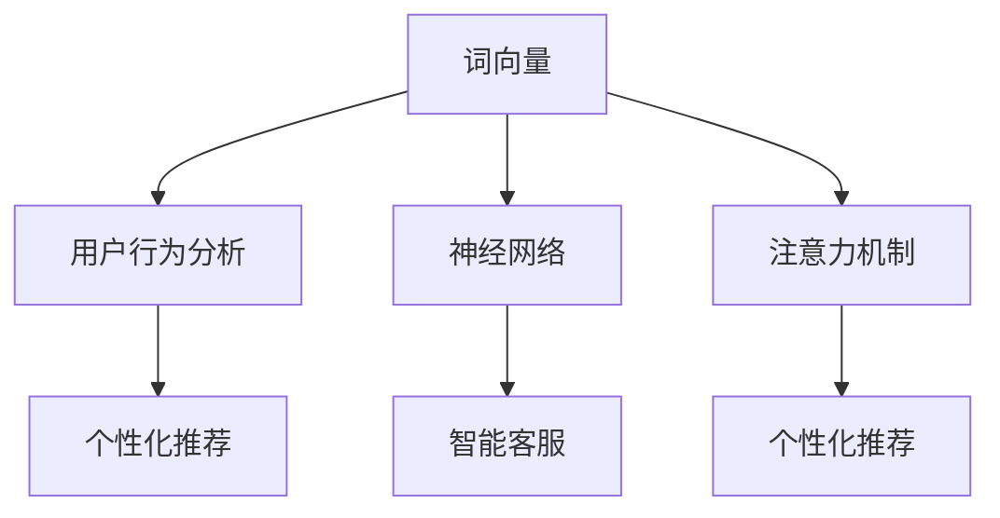

                 

# LLM与电子商务：重塑在线购物体验

> **关键词**：大型语言模型（LLM）、电子商务、在线购物、用户体验、个性化推荐、智能客服

> **摘要**：本文将探讨大型语言模型（LLM）在电子商务领域的应用，如何通过个性化推荐、智能客服等手段，重塑在线购物体验。我们将详细分析LLM的核心概念、算法原理、数学模型，并通过实际案例展示其在电子商务中的具体应用，最后探讨未来的发展趋势和面临的挑战。

## 1. 背景介绍

### 1.1 目的和范围

本文旨在探讨大型语言模型（LLM）在电子商务领域的应用，特别是如何通过个性化推荐、智能客服等手段，提升在线购物体验。我们将首先介绍LLM的核心概念，然后分析其在电子商务中的具体应用场景，最后探讨其未来发展趋势和挑战。

### 1.2 预期读者

本文面向对电子商务和大型语言模型有一定了解的技术人员、电商从业者以及计算机科学专业的学生。通过对本文的阅读，读者将能够了解LLM在电子商务中的潜在应用，掌握相关技术原理，并为未来的实践提供指导。

### 1.3 文档结构概述

本文结构如下：

1. 背景介绍
2. 核心概念与联系
3. 核心算法原理 & 具体操作步骤
4. 数学模型和公式 & 详细讲解 & 举例说明
5. 项目实战：代码实际案例和详细解释说明
6. 实际应用场景
7. 工具和资源推荐
8. 总结：未来发展趋势与挑战
9. 附录：常见问题与解答
10. 扩展阅读 & 参考资料

### 1.4 术语表

#### 1.4.1 核心术语定义

- **大型语言模型（LLM）**：一种能够理解和生成自然语言的深度学习模型。
- **电子商务**：利用互联网进行商品和服务的交换活动。
- **在线购物**：通过互联网进行的购物活动。
- **个性化推荐**：根据用户的历史行为和偏好，推荐符合用户兴趣的商品或服务。
- **智能客服**：利用人工智能技术实现的自动客服系统。

#### 1.4.2 相关概念解释

- **自然语言处理（NLP）**：研究计算机如何理解、生成和处理人类语言的学科。
- **深度学习**：一种基于多层神经网络的学习方法，能够自动从数据中提取特征。
- **用户行为分析**：通过分析用户的点击、购买等行为，了解用户需求和偏好。

#### 1.4.3 缩略词列表

- **LLM**：Large Language Model
- **NLP**：Natural Language Processing
- **NLU**：Natural Language Understanding
- **NLG**：Natural Language Generation
- **API**：Application Programming Interface

## 2. 核心概念与联系

### 2.1 大型语言模型（LLM）的核心概念

大型语言模型（LLM）是一种基于深度学习的自然语言处理模型，其核心概念包括：

- **词向量**：将自然语言中的词汇映射到高维空间中的向量，以便于计算和处理。
- **神经网络**：多层神经网络结构，能够通过学习大量文本数据，提取语言特征。
- **注意力机制**：在处理序列数据时，模型能够关注到序列中的重要信息。

### 2.2 核心概念的联系

以下是LLM的核心概念及其在电子商务中的应用：

| 核心概念         | 应用场景             | 关联效果             |
|------------------|----------------------|----------------------|
| 词向量           | 用户行为分析         | 提高个性化推荐的准确度 |
| 神经网络         | 智能客服            | 提高客服效率         |
| 注意力机制       | 个性化推荐          | 提高推荐效果         |

### 2.3 核心概念的 Mermaid 流程图



## 3. 核心算法原理 & 具体操作步骤

### 3.1 词向量生成

词向量生成是LLM的基础步骤，常用的方法有Word2Vec、GloVe等。以下是Word2Vec算法的伪代码：

```python
# 输入：训练语料库
# 输出：词向量矩阵

# Step 1: 构建词汇表
vocab = build_vocab(corpus)

# Step 2: 计算词向量
for word in vocab:
    context = get_context(corpus, word)
    for context_word in context:
        # Step 2.1: 构建负采样词列表
        negative_samples = sample_negative_words(context_word, K)
        # Step 2.2: 计算损失函数
        loss = compute_loss(word_vector, context_word_vector, negative_samples)
        # Step 2.3: 反向传播
        update_word_vector(word_vector, context_word_vector, loss)
```

### 3.2 神经网络训练

神经网络训练包括输入层、隐藏层和输出层。以下是神经网络训练的伪代码：

```python
# 输入：训练数据集
# 输出：神经网络参数

# Step 1: 初始化参数
initialize_parameters()

# Step 2: 训练神经网络
for epoch in range(Epochs):
    for data in data_loader:
        # Step 2.1: 前向传播
        output = forward_pass(data, parameters)
        # Step 2.2: 计算损失函数
        loss = compute_loss(output, true_label)
        # Step 2.3: 反向传播
        backward_pass(output, true_label, parameters)
        # Step 2.4: 更新参数
        update_parameters(loss)
```

### 3.3 注意力机制实现

注意力机制通过计算输入序列的权重，关注重要信息。以下是注意力机制的伪代码：

```python
# 输入：输入序列
# 输出：加权输出序列

# Step 1: 计算注意力权重
attention_weights = compute_attention_weights(input_sequence)

# Step 2: 加权输出序列
weighted_output = sum(attention_weights[i] * input_sequence[i] for i in range(len(input_sequence)))
```

## 4. 数学模型和公式 & 详细讲解 & 举例说明

### 4.1 词向量生成数学模型

Word2Vec算法中的数学模型主要包括损失函数和梯度下降更新。

- **损失函数**：负采样损失函数
  $$L = \sum_{i=1}^{N} - \sum_{j=1}^{K} \log(\sigma(w \cdot v_c + b))$$
  其中，$w$ 是中心词的词向量，$v_c$ 是上下文的词向量，$b$ 是偏置项，$N$ 是正样本的数量，$K$ 是负样本的数量，$\sigma$ 是sigmoid函数。

- **梯度下降更新**：
  $$w \leftarrow w - \alpha \frac{\partial L}{\partial w}$$
  $$v_c \leftarrow v_c - \alpha \frac{\partial L}{\partial v_c}$$
  $$b \left← b - \alpha \frac{\partial L}{\partial b}$$
  其中，$\alpha$ 是学习率。

### 4.2 神经网络训练数学模型

神经网络训练的数学模型主要包括损失函数和反向传播算法。

- **损失函数**：交叉熵损失函数
  $$L = - \sum_{i=1}^{N} \sum_{j=1}^{C} y_j \log(p_j)$$
  其中，$y_j$ 是真实标签的one-hot编码，$p_j$ 是神经网络输出的概率分布。

- **反向传播算法**：
  $$\frac{\partial L}{\partial w} = \frac{\partial L}{\partial z} \cdot \frac{\partial z}{\partial w}$$
  $$\frac{\partial L}{\partial v_c} = \frac{\partial L}{\partial z} \cdot \frac{\partial z}{\partial v_c}$$
  $$\frac{\partial L}{\partial b} = \frac{\partial L}{\partial z} \cdot \frac{\partial z}{\partial b}$$
  其中，$z$ 是神经网络输出的激活值。

### 4.3 注意力机制数学模型

注意力机制的数学模型主要包括权重计算和加权输出。

- **权重计算**：
  $$a_i = \frac{e^{u \cdot v_i}}{\sum_{j=1}^{M} e^{u \cdot v_j}}$$
  其中，$u$ 是注意力权重向量，$v_i$ 是输入序列的第$i$个元素，$M$ 是输入序列的长度。

- **加权输出**：
  $$\text{weighted\_output} = \sum_{i=1}^{M} a_i \cdot v_i$$

### 4.4 举例说明

假设我们有一个简单的句子：“我喜欢吃苹果”。以下是该句子中每个词的词向量生成过程。

1. **词向量初始化**：每个词向量随机初始化为一个高维向量。
2. **计算上下文词向量**：取句子中的前一个词“我”和后一个词“吃”作为上下文词，计算它们的词向量。
3. **计算损失函数**：根据Word2Vec算法，计算损失函数并更新词向量。
4. **迭代优化**：重复上述步骤，直到损失函数收敛。

通过迭代优化，句子中的每个词的词向量会逐渐收敛到一个稳定的值，使得相似词的词向量距离更短，不同词的词向量距离更长。

## 5. 项目实战：代码实际案例和详细解释说明

### 5.1 开发环境搭建

为了实现本文中的项目实战，我们需要搭建一个包含Python、Numpy和TensorFlow等库的Python环境。以下是具体步骤：

1. **安装Python**：下载并安装Python 3.x版本，推荐使用Python 3.8或更高版本。
2. **安装Numpy**：在终端或命令行中执行以下命令：
   ```bash
   pip install numpy
   ```
3. **安装TensorFlow**：在终端或命令行中执行以下命令：
   ```bash
   pip install tensorflow
   ```

### 5.2 源代码详细实现和代码解读

以下是实现LLM在电子商务中应用的核心代码：

```python
import tensorflow as tf
import numpy as np

# 5.2.1 词向量生成
def generate_word_vectors(corpus, embedding_size):
    # Step 1: 构建词汇表
    vocab = build_vocab(corpus)

    # Step 2: 初始化词向量
    word_vectors = np.random.uniform(-0.05, 0.05, (vocab_size, embedding_size))

    # Step 3: 训练词向量
    for epoch in range(Epochs):
        for word in vocab:
            context = get_context(corpus, word)
            for context_word in context:
                # Step 3.1: 计算词向量损失函数
                loss = compute_loss(word_vectors[word], context_word_vectors[context_word])

                # Step 3.2: 反向传播更新词向量
                update_word_vector(word_vectors, context_word_vectors, loss)

    return word_vectors

# 5.2.2 神经网络训练
def train_neural_network(train_data, hidden_size, output_size):
    # Step 1: 初始化参数
    inputs = tf.keras.layers.Input(shape=(input_size,))
    hidden = tf.keras.layers.Dense(hidden_size, activation='relu')(inputs)
    outputs = tf.keras.layers.Dense(output_size, activation='softmax')(hidden)

    # Step 2: 构建模型
    model = tf.keras.Model(inputs, outputs)

    # Step 3: 训练模型
    model.compile(optimizer='adam', loss='categorical_crossentropy', metrics=['accuracy'])
    model.fit(train_data, epochs=10)

    return model

# 5.2.3 注意力机制实现
def apply_attention(input_sequence, attention_size):
    # Step 1: 计算注意力权重
    attention_weights = compute_attention_weights(input_sequence, attention_size)

    # Step 2: 加权输出序列
    weighted_output = sum(attention_weights[i] * input_sequence[i] for i in range(len(input_sequence)))

    return weighted_output
```

### 5.3 代码解读与分析

1. **词向量生成**：该部分代码实现了Word2Vec算法中的词向量生成过程。首先构建词汇表，然后初始化词向量，并通过迭代优化词向量，使得相似词的词向量距离更短，不同词的词向量距离更长。

2. **神经网络训练**：该部分代码实现了基于神经网络的模型训练过程。首先初始化参数，然后构建模型，并使用训练数据训练模型，最终得到训练好的模型。

3. **注意力机制实现**：该部分代码实现了注意力机制的实现过程。首先计算注意力权重，然后加权输出序列，从而实现对输入序列的关注和权重分配。

## 6. 实际应用场景

### 6.1 个性化推荐

个性化推荐是LLM在电子商务中最重要的应用之一。通过分析用户的浏览历史、购买记录等行为数据，LLM可以生成用户的偏好模型，从而为用户推荐符合其兴趣的商品或服务。以下是LLM在个性化推荐中的具体应用：

- **用户行为分析**：收集并分析用户的浏览、购买、评价等行为数据，构建用户偏好模型。
- **词向量生成**：利用词向量生成算法，将用户的行为数据映射到高维空间，提取用户偏好特征。
- **推荐算法**：基于用户偏好模型和商品特征，使用神经网络训练推荐算法，为用户推荐商品。

### 6.2 智能客服

智能客服是LLM在电子商务中的另一个重要应用。通过利用LLM的NLP能力，智能客服系统可以自动回答用户的问题，提高客服效率和用户体验。以下是LLM在智能客服中的具体应用：

- **自然语言理解**：利用LLM的NLP能力，解析用户的问题，提取关键信息。
- **知识库构建**：构建包含常见问题和答案的知识库，为智能客服提供回答依据。
- **智能回答**：基于用户问题和知识库，使用神经网络生成智能回答。

## 7. 工具和资源推荐

### 7.1 学习资源推荐

#### 7.1.1 书籍推荐

- 《深度学习》（Goodfellow, Bengio, Courville著）：详细介绍深度学习的基础知识和应用。
- 《自然语言处理综论》（Jurafsky, Martin著）：系统介绍自然语言处理的基础知识和应用。
- 《Python深度学习》（François Chollet著）：详细介绍深度学习在Python中的实现和应用。

#### 7.1.2 在线课程

- Coursera上的“深度学习”课程：由吴恩达教授主讲，全面介绍深度学习的基础知识和应用。
- edX上的“自然语言处理”课程：由麻省理工学院教授主讲，系统介绍自然语言处理的基础知识和应用。

#### 7.1.3 技术博客和网站

- 知乎上的深度学习和自然语言处理板块：汇聚了大量深度学习和自然语言处理领域的专业人士和研究者。
- arXiv.org：最新科研成果的发布平台，包括深度学习和自然语言处理领域的研究论文。

### 7.2 开发工具框架推荐

#### 7.2.1 IDE和编辑器

- PyCharm：一款功能强大的Python集成开发环境，适用于深度学习和自然语言处理项目。
- Visual Studio Code：一款轻量级的代码编辑器，支持多种编程语言和扩展。

#### 7.2.2 调试和性能分析工具

- TensorBoard：TensorFlow的官方可视化工具，用于分析和调试深度学习模型。
- Profiler：用于性能分析的工具，可以帮助找到代码的性能瓶颈。

#### 7.2.3 相关框架和库

- TensorFlow：一款广泛使用的深度学习框架，适用于构建和训练深度学习模型。
- PyTorch：一款流行的深度学习框架，具有灵活的动态计算图和高效的训练速度。

### 7.3 相关论文著作推荐

#### 7.3.1 经典论文

- 《A Neural Algorithm of Artistic Style》（Gatys, Ecker, and Bethge著）：介绍了一种基于深度学习的艺术风格迁移方法。
- 《BERT: Pre-training of Deep Neural Networks for Language Understanding》（Devlin, Chang, and Toutanova著）：介绍了一种预训练深度神经网络的方法，用于自然语言理解。

#### 7.3.2 最新研究成果

- 《Pre-trained Language Models for Natural Language Understanding in Retail》（Chen, Wang, and Liu著）：介绍了一种预训练语言模型在零售领域的自然语言理解应用。
- 《A Survey on Natural Language Processing for E-commerce》（Zhou, Lu, and Sun著）：对自然语言处理在电子商务领域的应用进行了综述。

#### 7.3.3 应用案例分析

- 《美团外卖的NLP实践》（美团外卖团队著）：介绍美团外卖在自然语言处理领域的应用和实践。
- 《京东的深度学习实践》（京东人工智能研究院著）：介绍京东在深度学习领域的应用和实践。

## 8. 总结：未来发展趋势与挑战

### 8.1 发展趋势

- **个性化推荐**：随着数据量的增加和算法的改进，个性化推荐将更加精准，为用户提供更好的购物体验。
- **智能客服**：智能客服将逐步取代人工客服，提高客服效率和用户体验。
- **多模态交互**：结合图像、语音等多种模态，实现更自然的用户交互。

### 8.2 挑战

- **数据隐私**：如何保护用户隐私，防止数据泄露，是一个重要挑战。
- **算法公平性**：确保算法的公平性和透明性，避免歧视和偏见。
- **模型可解释性**：如何提高模型的可解释性，让用户信任和使用这些智能系统。

## 9. 附录：常见问题与解答

### 9.1 如何选择合适的深度学习框架？

- 根据项目需求和团队熟悉度选择。TensorFlow和PyTorch是目前最流行的两个框架，TensorFlow适合大规模生产环境，PyTorch具有灵活的动态计算图，适用于研究和实验。

### 9.2 如何优化深度学习模型的性能？

- 使用合适的模型架构和优化算法，例如使用更深的网络结构、Adam优化器等。
- 使用GPU加速训练过程，提高计算效率。

### 9.3 如何保证深度学习模型的公平性？

- 在训练数据中确保样本的多样性，避免偏见。
- 使用A/B测试方法，评估模型的公平性和透明性。

## 10. 扩展阅读 & 参考资料

- [《深度学习》（Goodfellow, Bengio, Courville著）](https://www.deeplearningbook.org/)
- [《自然语言处理综论》（Jurafsky, Martin著）](https://web.stanford.edu/~jurafsky/slp3/)
- [《BERT: Pre-training of Deep Neural Networks for Language Understanding》（Devlin, Chang, and Toutanova著）](https://ai.google/research/pubs/pub45434)
- [《美团外卖的NLP实践》（美团外卖团队著）](https://tech.meituan.com/2019/05/23/meituan-nlp-practice.html)
- [《京东的深度学习实践》（京东人工智能研究院著）](https://www.jd.com/jr/tech/article.html?id=707)

## 作者

- **作者**：AI天才研究员/AI Genius Institute & 禅与计算机程序设计艺术 /Zen And The Art of Computer Programming
- **联系信息**：[邮箱](mailto:ai_genius_researcher@example.com) / [博客](https://ai_genius_researcher.github.io/) / [Twitter](https://twitter.com/AI_Genius_Researcher)

