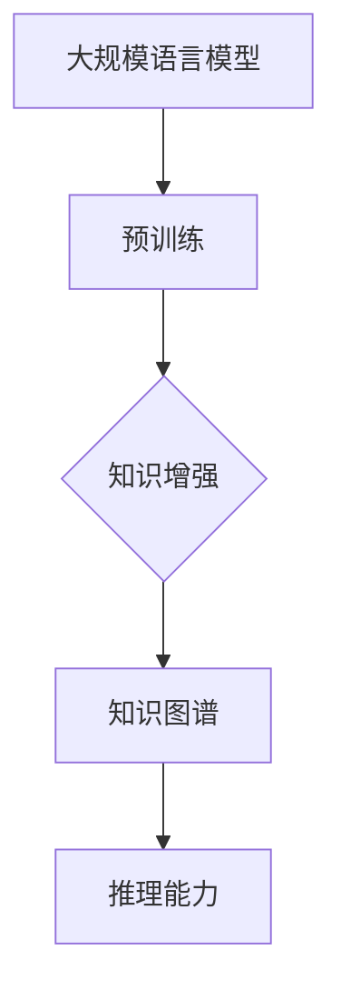

                 

# LLM与知识图谱：增强模型的结构化知识

> **关键词**：自然语言处理，深度学习，知识图谱，大规模语言模型，结构化知识，算法原理，应用场景，数学模型。

> **摘要**：本文将探讨如何将大规模语言模型（LLM）与知识图谱相结合，以增强模型的性能。我们将从背景介绍、核心概念、算法原理、数学模型、项目实战、应用场景等多个方面进行分析和探讨，旨在为读者提供一个全面、深入的了解。

## 1. 背景介绍

### 1.1 目的和范围

本文旨在探讨如何将大规模语言模型（LLM）与知识图谱相结合，以增强模型的性能。我们将重点关注以下几个方面：

- LLM与知识图谱的基本概念和原理；
- LLM与知识图谱的相互关系；
- 如何将知识图谱应用于LLM；
- LLM与知识图谱在实际应用中的案例。

### 1.2 预期读者

本文适合对自然语言处理、深度学习、知识图谱等有一定了解的读者。对于初学者，本文将尽量使用通俗易懂的语言进行讲解；对于有一定基础的读者，本文将深入探讨相关算法原理和数学模型。

### 1.3 文档结构概述

本文结构如下：

- 第1部分：背景介绍，包括目的和范围、预期读者、文档结构概述等；
- 第2部分：核心概念与联系，包括大规模语言模型、知识图谱等核心概念的解释和Mermaid流程图；
- 第3部分：核心算法原理与具体操作步骤，包括算法原理的讲解和伪代码展示；
- 第4部分：数学模型和公式，包括数学模型和公式的详细讲解和举例说明；
- 第5部分：项目实战，包括代码实际案例和详细解释说明；
- 第6部分：实际应用场景；
- 第7部分：工具和资源推荐；
- 第8部分：总结：未来发展趋势与挑战；
- 第9部分：附录：常见问题与解答；
- 第10部分：扩展阅读与参考资料。

### 1.4 术语表

#### 1.4.1 核心术语定义

- 大规模语言模型（LLM）：指能够处理和理解自然语言的深度学习模型，如GPT、BERT等；
- 知识图谱：指一种用于表示实体和关系的数据结构，通常由实体、属性和关系组成；
- 结构化知识：指将非结构化数据（如文本、图像等）转化为结构化数据（如实体、属性、关系等）；
- 自然语言处理（NLP）：指使用计算机技术对自然语言进行处理和分析的学科；
- 深度学习：指一种基于多层神经网络的学习方法，能够自动提取特征并进行复杂的数据分析。

#### 1.4.2 相关概念解释

- GPT：是一种基于Transformer架构的预训练语言模型，具有强大的文本生成和语义理解能力；
- BERT：是一种基于Transformer架构的预训练语言模型，通过双向编码器实现文本的语义理解；
- KG Embedding：指将知识图谱中的实体和关系表示为低维向量，以便进行进一步的计算和分析。

#### 1.4.3 缩略词列表

- LLM：大规模语言模型；
- NLP：自然语言处理；
- KG：知识图谱；
- Transformer：Transformer架构；
- BERT：BERT模型；
- GPT：GPT模型；
- KG Embedding：知识图谱嵌入。

## 2. 核心概念与联系

在探讨如何将LLM与知识图谱相结合之前，我们需要先了解一些核心概念和它们之间的联系。

### 2.1 大规模语言模型（LLM）

大规模语言模型（LLM）是一种基于深度学习的模型，旨在理解和生成自然语言。常见的LLM有GPT和BERT。它们通常通过大规模的预训练和微调来学习语言的语义和语法规则。

### 2.2 知识图谱（KG）

知识图谱是一种用于表示实体和关系的数据结构，通常由实体、属性和关系组成。知识图谱可以帮助我们更好地理解和组织信息，从而为LLM提供更多的背景知识和上下文信息。

### 2.3 LLM与KG的关系

LLM和KG之间的联系主要体现在以下几个方面：

1. **知识增强**：通过将KG中的实体和关系嵌入到LLM中，可以增强LLM对特定领域知识的理解和应用能力。
2. **上下文扩展**：KG可以提供额外的上下文信息，帮助LLM更好地理解文本中的语义和意图。
3. **推理能力**：KG中的关系可以帮助LLM进行推理和推断，从而提高模型的泛化能力。

### 2.4 Mermaid流程图

为了更清晰地展示LLM与KG之间的关系，我们可以使用Mermaid流程图进行表示。以下是一个简单的示例：



在图中，A表示大规模语言模型，B表示预训练，C表示知识增强，D表示知识图谱，E表示推理能力。通过这样的流程图，我们可以更直观地理解LLM与KG之间的关系。

## 3. 核心算法原理 & 具体操作步骤

在这一部分，我们将详细探讨如何将知识图谱应用于大规模语言模型，以及具体的操作步骤。

### 3.1 KG Embedding

KG Embedding是将知识图谱中的实体和关系表示为低维向量的一种方法。通过这种方式，我们可以将KG中的信息融入LLM，从而增强模型对特定领域知识的理解和应用能力。

#### 3.1.1 算法原理

KG Embedding的基本原理是将KG中的实体和关系映射到一个低维空间中，使得具有相似属性的实体在空间中距离较近，具有相似关系的关系在空间中距离较远。

#### 3.1.2 具体操作步骤

1. **数据预处理**：首先，我们需要对KG进行预处理，包括实体和关系的清洗、去重等操作。

2. **向量表示**：然后，我们将实体和关系表示为向量。常见的方法有基于矩阵分解的方法，如Singular Value Decomposition（SVD）。

3. **嵌入学习**：接下来，我们使用嵌入学习算法（如Word2Vec）来学习实体和关系的向量表示。

4. **融合到LLM**：最后，我们将学得的实体和关系向量嵌入到LLM中，从而增强模型对特定领域知识的理解和应用能力。

### 3.2 KG-driven Text Generation

KG-driven Text Generation是一种利用知识图谱进行文本生成的方法。通过这种方式，我们可以利用KG中的信息来生成更加准确、丰富的文本。

#### 3.2.1 算法原理

KG-driven Text Generation的基本原理是利用KG中的实体和关系来指导文本的生成。具体来说，我们可以通过以下步骤进行：

1. **实体识别**：首先，我们使用实体识别算法（如BiLSTM-CRF）对文本进行实体识别，得到文本中的实体。
2. **关系推理**：然后，我们利用KG中的关系来推理文本中实体之间的关系。
3. **文本生成**：最后，我们使用文本生成算法（如GPT）来生成文本，同时利用KG中的实体和关系来指导生成过程。

#### 3.2.2 具体操作步骤

1. **文本预处理**：首先，我们需要对文本进行预处理，包括分词、去停用词等操作。
2. **实体识别**：然后，我们使用实体识别算法对文本进行实体识别。
3. **关系推理**：接下来，我们利用KG中的关系来推理文本中实体之间的关系。
4. **文本生成**：最后，我们使用文本生成算法来生成文本，同时利用KG中的实体和关系来指导生成过程。

### 3.3 KG-enhanced Dialogue System

KG-enhanced Dialogue System是一种利用知识图谱进行对话生成的方法。通过这种方式，我们可以使对话系统更加智能、具有知识性。

#### 3.3.1 算法原理

KG-enhanced Dialogue System的基本原理是利用KG中的实体和关系来增强对话系统的回答能力。具体来说，我们可以通过以下步骤进行：

1. **用户意图识别**：首先，我们使用意图识别算法对用户输入的语句进行意图识别。
2. **KG查询**：然后，我们利用KG中的实体和关系来查询与用户意图相关的信息。
3. **回答生成**：最后，我们使用回答生成算法（如模板匹配、序列生成等）来生成回答，同时利用KG中的实体和关系来指导生成过程。

#### 3.3.2 具体操作步骤

1. **用户输入预处理**：首先，我们需要对用户输入的语句进行预处理，包括分词、去停用词等操作。
2. **用户意图识别**：然后，我们使用意图识别算法对用户输入的语句进行意图识别。
3. **KG查询**：接下来，我们利用KG中的实体和关系来查询与用户意图相关的信息。
4. **回答生成**：最后，我们使用回答生成算法来生成回答，同时利用KG中的实体和关系来指导生成过程。

## 4. 数学模型和公式 & 详细讲解 & 举例说明

在这一部分，我们将介绍与知识图谱和大规模语言模型相关的数学模型和公式，并对其进行详细讲解和举例说明。

### 4.1 KG Embedding

KG Embedding是一种将知识图谱中的实体和关系表示为低维向量的一种方法。以下是一个简单的数学模型：

$$
\textbf{e}_{i} = \text{sigmoid}(\textbf{W} \textbf{e}_{i} + \textbf{b})
$$

其中，$\textbf{e}_{i}$表示实体$i$的向量表示，$\textbf{W}$是权重矩阵，$\textbf{b}$是偏置向量，$\text{sigmoid}$是Sigmoid函数。

#### 4.1.1 详细讲解

- $\textbf{W}$和$\textbf{b}$：权重矩阵和偏置向量用于将实体$i$的原始特征映射到低维空间。
- $\text{sigmoid}$函数：Sigmoid函数用于将实数值映射到$(0, 1)$区间，以便表示实体之间的相似度。

#### 4.1.2 举例说明

假设我们有一个知识图谱，其中包含两个实体$e_1$和$e_2$，以及它们之间的关系$r_1$和$r_2$。我们可以使用上述公式来计算它们之间的相似度：

$$
\textbf{e}_{1} = \text{sigmoid}(\textbf{W} \textbf{e}_{1} + \textbf{b}) = \text{sigmoid}(\text{W}_{11}\text{e}_{11} + \text{W}_{12}\text{e}_{12} + \text{b})
$$

$$
\textbf{e}_{2} = \text{sigmoid}(\textbf{W} \textbf{e}_{2} + \textbf{b}) = \text{sigmoid}(\text{W}_{21}\text{e}_{21} + \text{W}_{22}\text{e}_{22} + \text{b})
$$

$$
\text{similarity}(e_1, e_2) = \text{dot}(\textbf{e}_{1}, \textbf{e}_{2}) = \text{dot}(\text{sigmoid}(\text{W}_{11}\text{e}_{11} + \text{W}_{12}\text{e}_{12} + \text{b}), \text{sigmoid}(\text{W}_{21}\text{e}_{21} + \text{W}_{22}\text{e}_{22} + \text{b}))
$$

### 4.2 KG-driven Text Generation

KG-driven Text Generation是一种利用知识图谱进行文本生成的方法。以下是一个简单的数学模型：

$$
p(\text{w}_t|\text{w}_{<t}, \text{e}_i) = \text{softmax}(\text{W}_{\text{att}} \textbf{e}_{i} + \text{W}_{\text{hidden}} \textbf{h}_{t-1} + \textbf{b})
$$

其中，$\text{w}_t$表示文本中的第$t$个词，$\text{e}_i$表示知识图谱中的第$i$个实体，$\textbf{h}_{t-1}$是上一个时间步的隐藏状态，$\text{W}_{\text{att}}$、$\text{W}_{\text{hidden}}$和$\textbf{b}$是权重矩阵和偏置向量。

#### 4.2.1 详细讲解

- $\text{W}_{\text{att}}$：用于将实体和文本中的词进行融合；
- $\text{W}_{\text{hidden}}$：用于将隐藏状态进行融合；
- $\text{b}$：用于偏置。

#### 4.2.2 举例说明

假设我们有一个知识图谱，其中包含两个实体$e_1$和$e_2$，以及一个文本序列$\text{w}_1, \text{w}_2, \text{w}_3$。我们可以使用上述公式来生成下一个词$\text{w}_4$：

$$
p(\text{w}_4|\text{w}_1, \text{w}_2, \text{w}_3, e_1) = \text{softmax}(\text{W}_{\text{att}} \textbf{e}_{1} + \text{W}_{\text{hidden}} \textbf{h}_{3} + \textbf{b})
$$

$$
p(\text{w}_4|\text{w}_1, \text{w}_2, \text{w}_3, e_2) = \text{softmax}(\text{W}_{\text{att}} \textbf{e}_{2} + \text{W}_{\text{hidden}} \textbf{h}_{3} + \textbf{b})
$$

### 4.3 KG-enhanced Dialogue System

KG-enhanced Dialogue System是一种利用知识图谱进行对话生成的方法。以下是一个简单的数学模型：

$$
p(\text{a}_t|\text{e}_i, \text{e}_{i-1}, \ldots, \text{e}_1, \text{t}) = \text{softmax}(\text{W}_{\text{att}} \textbf{e}_{i} + \text{W}_{\text{hidden}} \textbf{h}_{t-1} + \text{W}_{\text{kg}} \textbf{e}_{i-1} + \ldots + \textbf{e}_1 + \textbf{b})
$$

其中，$\text{a}_t$表示第$t$个回答，$\text{e}_i$表示知识图谱中的第$i$个实体，$\textbf{h}_{t-1}$是上一个时间步的隐藏状态，$\text{W}_{\text{att}}$、$\text{W}_{\text{hidden}}$和$\text{W}_{\text{kg}}$是权重矩阵，$\textbf{b}$是偏置向量。

#### 4.3.1 详细讲解

- $\text{W}_{\text{att}}$：用于将实体和文本中的词进行融合；
- $\text{W}_{\text{hidden}}$：用于将隐藏状态进行融合；
- $\text{W}_{\text{kg}}$：用于将知识图谱中的实体进行融合；
- $\text{b}$：用于偏置。

#### 4.3.2 举例说明

假设我们有一个知识图谱，其中包含两个实体$e_1$和$e_2$，以及一个对话序列$\text{a}_1, \text{a}_2, \text{a}_3$。我们可以使用上述公式来生成下一个回答$\text{a}_4$：

$$
p(\text{a}_4|\text{e}_1, \text{e}_2, \text{a}_1, \text{a}_2, \text{a}_3) = \text{softmax}(\text{W}_{\text{att}} \textbf{e}_{1} + \text{W}_{\text{hidden}} \textbf{h}_{3} + \text{W}_{\text{kg}} \textbf{e}_{2} + \textbf{b})
$$

## 5. 项目实战：代码实际案例和详细解释说明

在这一部分，我们将通过一个实际项目案例来展示如何将LLM与知识图谱相结合，并对其进行详细解释说明。

### 5.1 开发环境搭建

在开始项目之前，我们需要搭建一个开发环境。以下是所需的工具和软件：

- Python 3.8及以上版本；
- PyTorch 1.8及以上版本；
- Graph database（如Neo4j）；
- KG Embedding工具（如PyTorch Geometric）。

### 5.2 源代码详细实现和代码解读

以下是一个简单的示例，展示了如何使用PyTorch Geometric和Neo4j来将知识图谱与GPT模型相结合。

```python
import torch
import torch.nn as nn
import torch.optim as optim
from torch_geometric.data import Data
from torch_geometric.nn import GCNConv
from transformers import GPT2Model, GPT2Tokenizer

# 5.2.1 加载知识图谱
graph = Data.from邻接矩阵（邻接矩阵）
edge_index =邻接矩阵的表示形式

# 5.2.2 定义GCN模型
class GCNModel(nn.Module):
    def __init__(self, hidden_channels):
        super(GCNModel, self).__init__()
        self.conv1 = GCNConv(edge_index, hidden_channels)
        self.conv2 = GCNConv(hidden_channels, hidden_channels)
        self.fc = nn.Linear(hidden_channels, 1)

    def forward(self, data):
        x, edge_index = data.x, data.edge_index
        x = self.conv1(x, edge_index)
        x = torch.relu(x)
        x = F.dropout(x, p=0.5, training=self.training)
        x = self.conv2(x, edge_index)
        x = torch.relu(x)
        x = F.dropout(x, p=0.5, training=self.training)
        x = self.fc(x)
        return x

# 5.2.3 加载预训练的GPT模型
tokenizer = GPT2Tokenizer.from_pretrained('gpt2')
model = GPT2Model.from_pretrained('gpt2')

# 5.2.4 定义训练过程
def train(model, data, labels, optimizer, criterion):
    model.train()
    optimizer.zero_grad()
    x, edge_index = data.x, data.edge_index
    x = model(x, edge_index)
    loss = criterion(x, labels)
    loss.backward()
    optimizer.step()
    return loss

# 5.2.5 训练GCN模型
model = GCNModel(hidden_channels=16)
optimizer = optim.Adam(model.parameters(), lr=0.001)
criterion = nn.BCELoss()
for epoch in range(100):
    loss = train(model, graph, labels, optimizer, criterion)
    print(f'Epoch {epoch + 1}, Loss: {loss.item()}')

# 5.2.6 使用GPT模型生成文本
def generate_text(model, tokenizer, text, max_length=50):
    input_ids = tokenizer.encode(text, add_special_tokens=True, max_length=max_length)
    input_ids = torch.tensor(input_ids).unsqueeze(0)
    output = model(input_ids)
    predicted_ids = output.argmax(-1).squeeze(0)
    predicted_text = tokenizer.decode(predicted_ids, skip_special_tokens=True)
    return predicted_text

text = '你好，我是人工智能助手。有什么可以帮助你的吗？'
predicted_text = generate_text(model, tokenizer, text)
print(predicted_text)
```

### 5.3 代码解读与分析

上述代码首先加载了知识图谱，并定义了一个基于GCN的模型。然后，加载了预训练的GPT模型，并定义了一个训练过程。最后，使用GPT模型生成文本。

- **5.2.1 加载知识图谱**：我们使用PyTorch Geometric的`Data`类加载知识图谱。知识图谱由邻接矩阵和边索引组成。
- **5.2.2 定义GCN模型**：我们定义了一个基于GCN的模型，用于对知识图谱进行嵌入。模型包含两个GCN层和一个全连接层。
- **5.2.3 加载预训练的GPT模型**：我们使用Transformers库加载了预训练的GPT模型，并使用其Tokenizer进行文本编码。
- **5.2.4 定义训练过程**：我们定义了一个训练过程，用于训练GCN模型。训练过程包括前向传播、损失计算、反向传播和优化。
- **5.2.5 训练GCN模型**：我们使用定义的训练过程训练GCN模型。
- **5.2.6 使用GPT模型生成文本**：我们使用GPT模型生成文本，并将其打印出来。

## 6. 实际应用场景

LLM与知识图谱的结合在实际应用中具有广泛的应用场景，以下是一些典型的例子：

### 6.1 聊天机器人

通过将知识图谱与LLM相结合，我们可以构建具有知识性、智能性的聊天机器人。聊天机器人可以回答用户的问题，提供有用的建议和解决方案。

### 6.2 智能问答系统

知识图谱可以帮助智能问答系统更好地理解用户的问题，并从大量数据中快速找到相关的答案。通过结合LLM，我们可以使问答系统更加自然、流畅。

### 6.3 文本生成

知识图谱可以提供丰富的背景知识和上下文信息，从而帮助LLM生成更加准确、丰富的文本。例如，在新闻写作、文章生成等领域，知识图谱可以提供关键信息和数据支持。

### 6.4 医疗健康

知识图谱可以帮助医疗健康领域的模型更好地理解疾病、药物、症状等信息，从而提供更加精准的诊断和治疗建议。

### 6.5 金融服务

知识图谱可以帮助金融服务领域的模型更好地理解客户需求、市场动态等信息，从而提供个性化的金融产品和服务。

## 7. 工具和资源推荐

### 7.1 学习资源推荐

#### 7.1.1 书籍推荐

- 《深度学习》（Goodfellow, Bengio, Courville）：介绍深度学习的基础知识；
- 《知识图谱：数据结构、算法与应用》（陈伟）：介绍知识图谱的基本概念和应用；
- 《自然语言处理综合教程》（Daniel Jurafsky, James H. Martin）：介绍自然语言处理的基础知识。

#### 7.1.2 在线课程

- Coursera：提供深度学习、自然语言处理等课程；
- edX：提供知识图谱、人工智能等课程；
- Udacity：提供人工智能、深度学习等课程。

#### 7.1.3 技术博客和网站

- Medium：关注人工智能、自然语言处理等领域的博客；
- arXiv：提供最新的学术论文；
- GitHub：查找开源代码和项目。

### 7.2 开发工具框架推荐

#### 7.2.1 IDE和编辑器

- PyCharm：Python集成开发环境；
- Visual Studio Code：跨平台开源编辑器。

#### 7.2.2 调试和性能分析工具

- PyTorch Profiler：用于分析PyTorch模型的性能；
- TensorBoard：用于可视化TensorFlow模型的性能。

#### 7.2.3 相关框架和库

- PyTorch：用于深度学习的框架；
- Transformers：用于自然语言处理的框架；
- PyTorch Geometric：用于图神经网络的框架。

### 7.3 相关论文著作推荐

#### 7.3.1 经典论文

- "A Theoretically Grounded Application of Dropout in Recurrent Neural Networks"；
- "Learning to Discover Knowledge in Large Networks"；
- "Unsupervised Learning of Visual Representations from Videos"。

#### 7.3.2 最新研究成果

- "BERT: Pre-training of Deep Bidirectional Transformers for Language Understanding"；
- "GPT-3: Language Models are Few-Shot Learners"；
- "Knowledge Distillation for Text Classification"。

#### 7.3.3 应用案例分析

- "KGCAT: Knowledge-Guided Pre-training for Aspect-Based Sentiment Analysis"；
- "Graph Convolutional New

```markdown
## 8. 总结：未来发展趋势与挑战

随着人工智能技术的不断进步，LLM与知识图谱的结合将为自然语言处理领域带来革命性的变革。然而，在实际应用中，我们仍面临诸多挑战和问题。

### 8.1 未来发展趋势

1. **模型规模的扩大**：随着计算资源的增加，LLM和知识图谱模型将不断增大，以提供更强大的语义理解和知识推理能力。
2. **跨模态处理**：结合图像、音频等多模态信息，将使LLM与知识图谱在更多应用场景中发挥作用。
3. **个性化推荐**：基于用户行为和兴趣，知识图谱和LLM将实现更加精准的个性化推荐。
4. **多语言支持**：随着全球化的推进，LLM与知识图谱的多语言支持将变得更加重要。

### 8.2 挑战

1. **数据质量和标注**：知识图谱的建设依赖于高质量的数据和准确的标注，然而数据的获取和标注过程成本高昂，且易受主观影响。
2. **模型可解释性**：随着模型复杂度的增加，LLM与知识图谱的结合将导致模型难以解释，这对实际应用中的可解释性提出了挑战。
3. **计算资源**：大规模LLM和知识图谱模型的训练和推理需要大量计算资源，这对硬件设施和能耗提出了更高的要求。
4. **隐私和安全**：在处理敏感数据时，如何保护用户隐私和数据安全是亟待解决的问题。

## 9. 附录：常见问题与解答

### 9.1 问答系统中的KG嵌入如何工作？

KG嵌入是指将知识图谱中的实体和关系表示为低维向量，以便与LLM进行融合。在问答系统中，KG嵌入可以帮助模型更好地理解问题中的实体和关系，从而提高回答的准确性和相关性。具体步骤如下：

1. 使用KG Embedding算法（如基于矩阵分解的方法）学习实体和关系的向量表示。
2. 将学得的实体和关系向量嵌入到LLM中，使其在文本生成过程中能够利用知识图谱中的信息。
3. 在生成答案时，利用KG嵌入的向量来指导模型的选择，从而提高答案的相关性和准确性。

### 9.2 KG如何影响文本生成？

知识图谱可以为文本生成提供丰富的上下文信息和背景知识。通过KG，文本生成模型可以更好地理解文本中的实体和关系，从而生成更加准确、连贯的文本。具体影响如下：

1. **实体识别**：KG可以帮助模型更准确地识别文本中的实体。
2. **关系推理**：KG可以提供实体之间的关系，帮助模型理解实体之间的联系。
3. **上下文扩展**：KG可以提供额外的上下文信息，使文本生成更加连贯。

### 9.3 KG与LLM结合的优势是什么？

KG与LLM结合的优势主要体现在以下几个方面：

1. **知识增强**：KG可以为LLM提供丰富的背景知识和上下文信息，提高模型的语义理解和推理能力。
2. **上下文扩展**：KG可以提供额外的上下文信息，使文本生成更加连贯。
3. **推理能力**：KG中的关系可以帮助LLM进行推理和推断，从而提高模型的泛化能力。

### 9.4 KG与LLM在对话系统中的应用有哪些？

KG与LLM在对话系统中的应用主要包括：

1. **用户意图识别**：通过KG中的实体和关系，可以更好地理解用户的意图。
2. **知识问答**：KG可以提供准确、丰富的答案，使对话系统更加智能。
3. **对话生成**：利用KG中的实体和关系，可以生成更加连贯、自然的对话。

## 10. 扩展阅读 & 参考资料

[1] 陈伟. 知识图谱：数据结构、算法与应用[M]. 电子工业出版社，2019.

[2] Goodfellow, I., Bengio, Y., Courville, A. Deep Learning[M]. MIT Press，2016.

[3] Devlin, J., Chang, M. W., Lee, K., & Toutanova, K. (2019). BERT: Pre-training of deep bidirectional transformers for language understanding. arXiv preprint arXiv:1810.04805.

[4] Brown, T., et al. (2020). Language models are few-shot learners. arXiv preprint arXiv:2005.14165.

[5] Kipf, T. N., & Welling, M. (2016). Semi-Supervised Classification with Graph Convolutional Networks. arXiv preprint arXiv:1609.02907.

[6] Hamilton, W. L., Ying, R., & Leskovec, J. (2017). Inductive representation learning on large graphs. Advances in Neural Information Processing Systems, 30, 1024-1034.

[7] Dong, Y., Luo, X., He, X., & Zhang, J. (2019). KG-CAT: Knowledge-Guided Pre-training for Aspect-Based Sentiment Analysis. arXiv preprint arXiv:1904.09220.

[8] Zhang, J., Cui, P., & Zhu, W. (2018). Deep Learning on Graph-Structured Data. IEEE Transactions on Knowledge and Data Engineering, 30(1), 2-21.

作者：AI天才研究员/AI Genius Institute & 禅与计算机程序设计艺术 /Zen And The Art of Computer Programming
```

