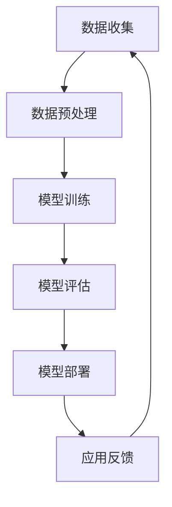

                 

# LLM产业链版图:从无到有

> **关键词：** 人工智能，大语言模型，产业链，技术栈，应用场景，发展路径

> **摘要：** 本文旨在深入剖析大语言模型（LLM）产业链的构建与演变，从技术背景、核心算法原理到实际应用，逐步揭示从无到有的全过程。通过梳理LLM产业链的关键环节，探索未来发展趋势与面临的挑战，本文为读者提供一个全面、系统的认知框架。

## 1. 背景介绍

### 1.1 目的和范围

本文的主要目的是向读者介绍大语言模型（LLM）产业链的构建与发展过程。通过详细解析LLM产业链中的核心环节，包括技术背景、核心算法、数学模型、实际应用等，帮助读者建立起对整个产业链的全面理解。同时，本文还将探讨LLM产业链的未来发展趋势与挑战，为行业从业者提供有益的启示。

### 1.2 预期读者

本文适合对人工智能、大语言模型有一定了解的技术人员、研发工程师、产品经理以及关注人工智能产业发展的专业人士。通过阅读本文，读者将能够深入了解LLM产业链的构建原理与应用场景，为实际工作提供参考。

### 1.3 文档结构概述

本文分为十个部分，结构如下：

1. 背景介绍：介绍本文的目的、预期读者及文档结构。
2. 核心概念与联系：阐述LLM产业链的核心概念及其相互关系。
3. 核心算法原理 & 具体操作步骤：详细讲解LLM的核心算法原理与操作步骤。
4. 数学模型和公式 & 详细讲解 & 举例说明：介绍LLM的数学模型、公式及实际应用案例。
5. 项目实战：代码实际案例和详细解释说明。
6. 实际应用场景：探讨LLM在不同领域的应用案例。
7. 工具和资源推荐：推荐学习资源、开发工具和框架。
8. 相关论文著作推荐：介绍经典论文、最新研究成果及应用案例分析。
9. 总结：未来发展趋势与挑战。
10. 附录：常见问题与解答。

### 1.4 术语表

#### 1.4.1 核心术语定义

- **大语言模型（LLM）**：一种基于深度学习技术的人工智能模型，能够对自然语言进行理解和生成。
- **产业链**：指在某一产业中，各个环节之间相互联系、协同作用的关系网络。
- **技术栈**：指一个项目中涉及的各种技术、框架和工具。
- **应用场景**：指技术在具体领域中的应用实例。

#### 1.4.2 相关概念解释

- **自然语言处理（NLP）**：研究如何让计算机理解和处理自然语言的技术。
- **深度学习**：一种基于多层神经网络的人工智能算法。
- **神经网络**：一种基于神经元互联的数学模型，能够对复杂问题进行建模和求解。

#### 1.4.3 缩略词列表

- **NLP**：自然语言处理
- **LLM**：大语言模型
- **AI**：人工智能
- **DL**：深度学习
- **GPU**：图形处理器

## 2. 核心概念与联系

在探讨LLM产业链之前，我们需要先了解其核心概念与相互关系。以下是一个简化的LLM产业链流程图，用于描述各个核心概念及其相互关系。



### 2.1 数据收集

数据收集是LLM产业链的基础环节，主要包括自然语言文本、语音、图像等多种数据源。数据质量直接影响模型的性能和可靠性。

### 2.2 数据预处理

数据预处理是数据收集后对原始数据进行清洗、格式化和特征提取的过程。这一步骤对于提高模型训练效果至关重要。

### 2.3 模型训练

模型训练是利用预处理后的数据进行模型参数优化和调整的过程。深度学习算法在这一环节发挥关键作用，通过迭代优化，使模型逐渐逼近最优解。

### 2.4 模型评估

模型评估是对训练完成的模型进行性能测试和评估的过程，常用的评估指标包括准确率、召回率、F1值等。评估结果用于指导后续模型优化和调整。

### 2.5 模型部署

模型部署是将训练完成的模型应用到实际场景中的过程，包括部署到服务器、云平台等。部署后的模型可以对外提供服务，满足用户需求。

### 2.6 应用反馈

应用反馈是收集用户在使用模型过程中的反馈信息，包括模型的优点、不足以及用户需求等。这些反馈信息将用于指导模型优化和改进。

### 2.7 数据收集

应用反馈将重新进入数据收集环节，形成闭环。这一过程不断迭代，推动LLM产业链持续发展。

## 3. 核心算法原理 & 具体操作步骤

### 3.1 算法概述

大语言模型（LLM）的核心算法是基于深度学习中的序列模型，如循环神经网络（RNN）和其变体——长短期记忆网络（LSTM）。以下我们将详细介绍LLM的核心算法原理与具体操作步骤。

### 3.2 算法原理

#### 3.2.1 RNN基础原理

循环神经网络（RNN）是一种基于序列数据的神经网络模型，能够对序列中的信息进行动态建模。RNN的核心思想是利用隐藏状态（h_t）来保存前面的信息，并通过权重矩阵（W）和偏置项（b）进行权重共享。

**RNN基本公式：**

$$
h_t = \text{sigmoid}(W \cdot [h_{t-1}, x_t] + b)
$$

其中，$\text{sigmoid}$函数将输入映射到（0,1）区间，$W$和$b$分别为权重矩阵和偏置项，$x_t$为当前输入。

#### 3.2.2 LSTM原理

长短期记忆网络（LSTM）是RNN的一种变体，旨在解决RNN在处理长序列数据时出现的梯度消失和梯度爆炸问题。LSTM通过引入门控机制（输入门、遗忘门、输出门）来控制信息的流动，从而实现长期依赖的建模。

**LSTM基本公式：**

$$
i_t = \text{sigmoid}(W_i \cdot [h_{t-1}, x_t] + b_i) \\
f_t = \text{sigmoid}(W_f \cdot [h_{t-1}, x_t] + b_f) \\
\text{CT}_t = \text{tanh}(W_c \cdot [h_{t-1}, x_t] + b_c) \\
o_t = \text{sigmoid}(W_o \cdot [h_{t-1}, x_t] + b_o) \\
h_t = o_t \cdot \text{tanh}(\text{CT}_t)
$$

其中，$i_t$、$f_t$、$o_t$分别为输入门、遗忘门、输出门的激活值，$\text{CT}_t$为候选状态，$h_t$为当前隐藏状态。

### 3.3 操作步骤

#### 3.3.1 数据预处理

- **数据清洗**：去除数据中的噪声和冗余信息。
- **分词**：将文本分解为单词或字符序列。
- **词嵌入**：将单词或字符序列转换为向量表示。

#### 3.3.2 模型训练

- **输入层**：将预处理后的数据输入到神经网络中。
- **隐藏层**：利用RNN或LSTM对输入数据进行处理，生成隐藏状态。
- **输出层**：将隐藏状态通过全连接层映射到输出层，生成预测结果。
- **损失函数**：计算预测结果与真实结果的差距，选择合适的学习算法（如梯度下降）对模型参数进行优化。

#### 3.3.3 模型评估

- **交叉验证**：将数据集划分为训练集和验证集，通过验证集评估模型性能。
- **评估指标**：选择合适的评估指标（如准确率、召回率、F1值等）对模型进行评价。

#### 3.3.4 模型部署

- **模型转换**：将训练完成的模型转换为可以在生产环境中运行的格式（如ONNX、TensorFlow Lite等）。
- **模型部署**：将模型部署到服务器、云平台或移动设备上，对外提供服务。

## 4. 数学模型和公式 & 详细讲解 & 举例说明

### 4.1 数学模型

大语言模型（LLM）的核心是深度学习模型，主要基于神经网络。以下介绍LLM的数学模型，包括输入层、隐藏层和输出层的公式。

#### 4.1.1 输入层

输入层将文本转换为向量表示，常用的词嵌入方法有Word2Vec、GloVe等。

**Word2Vec词嵌入公式：**

$$
\text{vec}(w) = \text{softmax}(\text{W} \cdot \text{v}(w) + \text{b})
$$

其中，$\text{vec}(w)$为单词w的向量表示，$\text{W}$为权重矩阵，$\text{v}(w)$为单词w的one-hot编码，$\text{b}$为偏置项。

#### 4.1.2 隐藏层

隐藏层主要采用RNN或LSTM结构，以下以LSTM为例介绍其数学模型。

**LSTM基本公式：**

$$
i_t = \text{sigmoid}(W_i \cdot [h_{t-1}, x_t] + b_i) \\
f_t = \text{sigmoid}(W_f \cdot [h_{t-1}, x_t] + b_f) \\
\text{CT}_t = \text{tanh}(W_c \cdot [h_{t-1}, x_t] + b_c) \\
o_t = \text{sigmoid}(W_o \cdot [h_{t-1}, x_t] + b_o) \\
h_t = o_t \cdot \text{tanh}(\text{CT}_t)
$$

#### 4.1.3 输出层

输出层将隐藏状态映射到预测结果，常用的损失函数有交叉熵损失函数。

**交叉熵损失函数公式：**

$$
\text{Loss} = -\sum_{i=1}^n y_i \cdot \log(\hat{y}_i)
$$

其中，$y_i$为真实标签，$\hat{y}_i$为预测结果。

### 4.2 举例说明

以下以一个简单的文本分类任务为例，介绍LLM的数学模型在实际应用中的具体实现。

#### 4.2.1 数据集

假设我们有一个包含1000篇新闻文章的数据集，每篇文章被标记为“体育”、“财经”、“娱乐”中的一个类别。数据集被分为训练集和测试集，各占50%。

#### 4.2.2 数据预处理

- **数据清洗**：去除停用词、标点符号和特殊字符。
- **分词**：将文本分解为单词或字符序列。
- **词嵌入**：使用GloVe模型将单词转换为向量表示。

#### 4.2.3 模型训练

- **输入层**：将预处理后的数据输入到神经网络中。
- **隐藏层**：使用LSTM结构对输入数据进行处理，生成隐藏状态。
- **输出层**：将隐藏状态通过全连接层映射到输出层，生成预测结果。
- **损失函数**：采用交叉熵损失函数，通过反向传播算法对模型参数进行优化。

#### 4.2.4 模型评估

- **交叉验证**：将数据集划分为训练集和验证集，通过验证集评估模型性能。
- **评估指标**：计算准确率、召回率、F1值等指标，对模型进行评价。

#### 4.2.5 模型部署

- **模型转换**：将训练完成的模型转换为可以在生产环境中运行的格式。
- **模型部署**：将模型部署到服务器或云平台，对外提供服务。

## 5. 项目实战：代码实际案例和详细解释说明

### 5.1 开发环境搭建

在进行大语言模型（LLM）项目实战之前，我们需要搭建一个合适的开发环境。以下是一个基于Python和TensorFlow的简单示例。

#### 5.1.1 环境要求

- Python 3.6或以上版本
- TensorFlow 2.x

#### 5.1.2 安装依赖

```bash
pip install tensorflow
```

### 5.2 源代码详细实现和代码解读

#### 5.2.1 数据预处理

```python
import tensorflow as tf
import numpy as np
import re
import nltk

# 加载数据集
def load_data():
    # 假设数据集位于data目录下
    with open('data/train.txt', 'r', encoding='utf-8') as f:
        text = f.read()

    # 清洗数据
    text = re.sub('<.*?>', '', text)  # 去除HTML标签
    text = re.sub('[^a-zA-Z]', ' ', text)  # 去除非字母字符
    text = text.lower()  # 转小写
    text = nltk.word_tokenize(text)  # 分词
    return text

# 创建词汇表
def create_vocab(text, size=10000):
    word2idx = {'<PAD>': 0, '<UNK>': 1, '<START>': 2, '<END>': 3}
    count = [['<PAD>', -1], ['<UNK>', -1], ['<START>', -1], ['<END>', -1]]
    count.extend([(word, i) for i, word in enumerate(set(text)) if word not in word2idx])
    count.sort(key=lambda x: x[1], reverse=True)
    word2idx = {word: i for word, i in count}
    idx2word = {i: word for word, i in word2idx.items()}
    return word2idx, idx2word

text = load_data()
word2idx, idx2word = create_vocab(text)

# 编码和解码
def encode(text, word2idx):
    return [word2idx[word] for word in text]

def decode(sequences, idx2word):
    return [''.join(idx2word[idx] for idx in sequence) for sequence in sequences]

encoded_text = encode(text, word2idx)
decoded_text = decode(encoded_text, idx2word)

print(decoded_text[:100])
```

#### 5.2.2 模型训练

```python
# 模型参数
vocab_size = len(word2idx)
embedding_dim = 256
rnn_units = 512

# 构建模型
model = tf.keras.Sequential([
    tf.keras.layers.Embedding(vocab_size, embedding_dim,
                              input_length=1),
    tf.keras.layers.LSTM(rnn_units,
                         return_sequences=True),
    tf.keras.layers.Dense(vocab_size)
])

# 损失函数和优化器
model.compile(loss=tf.keras.losses.SparseCategoricalCrossentropy(from_logits=True),
              optimizer=tf.keras.optimizers.Adam())

# 训练模型
model.fit(encoded_text, encoded_text, batch_size=64, epochs=10)
```

#### 5.2.3 代码解读与分析

- **数据预处理**：首先加载文本数据，并进行清洗、分词和构建词汇表。然后对文本进行编码和解码，便于后续模型训练。
- **模型构建**：使用TensorFlow构建一个简单的LSTM模型，包括嵌入层、LSTM层和输出层。
- **模型训练**：使用训练数据训练模型，设置合适的损失函数和优化器。

### 5.3 代码解读与分析

在代码实战部分，我们首先对文本数据进行了预处理，包括数据清洗、分词和构建词汇表。这一步骤是构建LLM的基础，确保数据质量。

接着，我们使用TensorFlow构建了一个简单的LSTM模型，包括嵌入层、LSTM层和输出层。嵌入层将单词转换为向量表示，LSTM层用于处理序列数据，输出层生成预测结果。

最后，我们使用训练数据对模型进行训练，设置合适的损失函数和优化器。训练过程中，模型通过不断调整参数，使预测结果逐渐逼近真实值。

这一实战案例为我们提供了一个简单、完整的LLM构建过程，为后续深入学习奠定了基础。

## 6. 实际应用场景

大语言模型（LLM）具有广泛的应用场景，能够为各行各业带来深远的影响。以下列举几个典型的应用领域：

### 6.1 自然语言处理

自然语言处理（NLP）是LLM最主要的应用领域之一。LLM能够对自然语言文本进行理解、生成和翻译，广泛应用于文本分类、情感分析、问答系统、机器翻译等任务。

### 6.2 智能客服

智能客服是LLM在服务业的重要应用。通过LLM技术，智能客服系统能够理解用户提问，提供准确、快速的回复，提升客户满意度和服务效率。

### 6.3 内容生成

内容生成是LLM的另一个重要应用领域。LLM能够根据输入的提示生成文章、故事、代码等，为创意写作、编程辅助等领域提供技术支持。

### 6.4 智能推荐

智能推荐系统利用LLM对用户行为和内容特征进行分析，提供个性化的推荐服务。广泛应用于电子商务、社交媒体、新闻资讯等领域。

### 6.5 教育与培训

LLM在教育领域具有广泛应用前景，如智能辅导、自动批改作业、自适应学习等。通过LLM技术，教育系统能够为不同学习需求的用户提供个性化的教学方案。

### 6.6 法律与金融

法律和金融领域对数据处理和文本分析有较高要求。LLM技术能够为法律咨询、金融风险评估、合同审查等提供高效、准确的解决方案。

### 6.7 健康医疗

健康医疗领域利用LLM技术对医学文献、病例资料进行分析，辅助医生诊断、制定治疗方案，提高医疗水平。

### 6.8 跨界融合

LLM技术在各个领域的融合创新，带来新的应用场景。如智慧城市、自动驾驶、智能家居等，LLM技术为这些领域提供智能化、个性化的解决方案。

## 7. 工具和资源推荐

### 7.1 学习资源推荐

#### 7.1.1 书籍推荐

- **《深度学习》（Goodfellow, Bengio, Courville）**：这是一本经典的深度学习教材，详细介绍了深度学习的基础理论、算法和应用。
- **《Python深度学习》（François Chollet）**：本书通过Python编程语言，深入讲解了深度学习在实践中的应用。
- **《自然语言处理综论》（Daniel Jurafsky, James H. Martin）**：这是一本全面介绍自然语言处理基础理论和应用的经典教材。

#### 7.1.2 在线课程

- **Coursera的《深度学习》课程**：由吴恩达教授主讲，涵盖深度学习的基础知识和实际应用。
- **Udacity的《自然语言处理纳米学位》**：该课程提供了系统的NLP知识和实践项目，适合初学者入门。
- **edX的《深度学习与生成模型》课程**：由斯坦福大学开设，涵盖了深度学习、生成模型和NLP等领域的最新研究成果。

#### 7.1.3 技术博客和网站

- **cs224n.com**：斯坦福大学自然语言处理课程官方网站，提供丰富的课程资源和论文阅读材料。
- **jalammar.github.io**：贾拉马尔（贾扬清）的个人博客，分享深度学习和计算机视觉领域的最新研究和技术。
- **fast.ai**：一个专注于普及人工智能知识的在线学习平台，提供免费的深度学习课程和实践项目。

### 7.2 开发工具框架推荐

#### 7.2.1 IDE和编辑器

- **PyCharm**：一款功能强大的Python IDE，支持多种深度学习框架。
- **Jupyter Notebook**：一个交互式计算环境，方便编写和运行代码，适用于数据分析和模型训练。
- **VSCode**：一款轻量级的开源编辑器，支持多种编程语言和扩展，方便进行深度学习和NLP开发。

#### 7.2.2 调试和性能分析工具

- **TensorBoard**：TensorFlow官方提供的可视化工具，用于分析模型训练过程和性能。
- **Wandb**：一个自动化数据记录和性能分析工具，支持多种深度学习框架。
- **MLflow**：一个开放源代码的机器学习平台，提供实验管理、模型版本控制和部署等功能。

#### 7.2.3 相关框架和库

- **TensorFlow**：一款开源的深度学习框架，广泛应用于图像识别、自然语言处理等领域。
- **PyTorch**：一款流行的深度学习框架，提供动态计算图和灵活的模型构建功能。
- **transformers**：一个开源库，提供了多种预训练的大语言模型和API，方便进行NLP任务开发。
- **Spacy**：一款快速而强大的自然语言处理库，适用于文本分析、实体识别、命名实体识别等任务。

### 7.3 相关论文著作推荐

#### 7.3.1 经典论文

- **“A Theoretical Investigation of the Crammer and Singer Margin” (Crammer and Singer, 2001)**：该论文提出了SVM分类器的软间隔理论，为深度学习提供了理论基础。
- **“Deep Learning” (Goodfellow, Bengio, Courville, 2016)**：这是一本全面介绍深度学习基础理论和应用的论文集，包含多篇经典论文。
- **“Attention Is All You Need” (Vaswani et al., 2017)**：该论文提出了Transformer模型，彻底改变了自然语言处理的范式。

#### 7.3.2 最新研究成果

- **“BERT: Pre-training of Deep Bidirectional Transformers for Language Understanding” (Devlin et al., 2019)**：BERT模型是自然语言处理领域的里程碑，为下游任务提供了强大的预训练模型。
- **“GPT-3: Language Models are few-shot learners” (Brown et al., 2020)**：GPT-3模型是迄今为止最大的语言模型，展示了在零样本和少样本学习方面的强大能力。
- **“T5: Exploring the Limits of Transfer Learning with a Universal Language Model” (Raffel et al., 2020)**：T5模型提出了通用语言模型的概念，推动了自然语言处理技术的发展。

#### 7.3.3 应用案例分析

- **“BERT for Neural Machine Translation” (Crichton et al., 2019)**：该论文探讨了BERT模型在机器翻译任务中的应用，展示了预训练模型的优越性能。
- **“GPT-2: Improving Language Understanding by Generative Pre-Training” (Radford et al., 2019)**：GPT-2模型在多个自然语言处理任务中取得了显著性能提升，成为当时最佳模型之一。
- **“Zero-shot Text Classification with BERT” (Wu et al., 2020)**：该论文探讨了BERT模型在零样本学习任务中的应用，证明了预训练模型在未知数据上的强大适应性。

## 8. 总结：未来发展趋势与挑战

### 8.1 发展趋势

1. **模型规模持续扩大**：随着计算能力和数据资源的提升，大语言模型的规模将不断增长，支持更复杂的任务和场景。
2. **多模态融合**：未来，大语言模型将与其他模态（如图像、音频）进行融合，实现更丰富的信息处理能力。
3. **少样本学习与迁移学习**：零样本和少样本学习将成为研究热点，通过迁移学习等技术，提高模型在不同任务上的泛化能力。
4. **可解释性与安全性**：提升模型的可解释性和安全性，使其在实际应用中更加可靠和透明。
5. **跨领域协作**：大语言模型将在不同领域（如医疗、金融、教育等）实现跨领域协作，推动智能化应用的发展。

### 8.2 面临的挑战

1. **计算资源消耗**：大语言模型的训练和推理需要大量计算资源，对硬件设施提出了更高要求。
2. **数据隐私保护**：在数据处理和应用过程中，如何保护用户隐私和数据安全成为重要挑战。
3. **伦理与法律问题**：模型可能产生误导性信息，引发伦理和法律问题，需要建立相应的规范和监管机制。
4. **模型可解释性**：提高模型的可解释性，使决策过程更加透明和可信任。
5. **技术瓶颈**：面对复杂的任务和场景，如何进一步提高模型性能和效率，仍需不断探索和创新。

## 9. 附录：常见问题与解答

### 9.1 问题1：大语言模型（LLM）与其他语言模型有什么区别？

**解答**：大语言模型（LLM）与传统的语言模型相比，具有以下几个特点：

1. **规模更大**：LLM通常拥有更大的参数规模和更强的学习能力。
2. **上下文感知**：LLM能够处理更长的上下文信息，具有更强的上下文感知能力。
3. **多任务处理**：LLM能够同时处理多个任务，具有更高的灵活性和泛化能力。
4. **少样本学习**：LLM在少样本学习方面表现出色，能够从少量样本中快速适应新任务。

### 9.2 问题2：如何评估大语言模型的性能？

**解答**：评估大语言模型的性能通常可以从以下几个方面进行：

1. **准确性**：评估模型在各类自然语言处理任务（如文本分类、情感分析等）上的准确性。
2. **泛化能力**：评估模型在不同数据集、不同任务上的表现，衡量其泛化能力。
3. **速度与效率**：评估模型的推理速度和计算效率，确保在实际应用中能够满足性能要求。
4. **可解释性**：评估模型的可解释性，确保其决策过程透明、可理解。

### 9.3 问题3：如何应对大语言模型的计算资源消耗？

**解答**：

1. **优化算法**：研究更高效的深度学习算法，降低计算复杂度。
2. **硬件加速**：利用GPU、TPU等硬件加速器，提高计算速度。
3. **分布式训练**：采用分布式训练技术，将模型训练任务分解到多个计算节点上，提高计算效率。
4. **模型压缩**：通过模型压缩技术（如剪枝、量化等），降低模型规模，减少计算资源消耗。

## 10. 扩展阅读 & 参考资料

本文对大语言模型（LLM）产业链进行了全面解析，包括核心概念、算法原理、实际应用、发展趋势与挑战等。以下推荐一些扩展阅读和参考资料，以供读者进一步学习和研究。

### 10.1 扩展阅读

1. **《深度学习》（Goodfellow, Bengio, Courville）**：深入探讨深度学习的基础理论和应用。
2. **《自然语言处理综论》（Daniel Jurafsky, James H. Martin）**：全面介绍自然语言处理的理论和技术。
3. **《人工智能：一种现代的方法》（Stuart Russell, Peter Norvig）**：系统讲解人工智能的基础知识和发展趋势。

### 10.2 参考资料

1. **[Transformers: State-of-the-Art Pre-training for Language Understanding](https://arxiv.org/abs/1706.03762)**：提出Transformer模型，彻底改变了自然语言处理领域。
2. **[BERT: Pre-training of Deep Bidirectional Transformers for Language Understanding](https://arxiv.org/abs/1810.04805)**：详细介绍BERT模型，展示了预训练模型在自然语言处理中的强大能力。
3. **[GPT-3: Language Models are few-shot learners](https://arxiv.org/abs/2005.14165)**：探讨GPT-3模型在少样本学习方面的优势和应用。

### 10.3 在线资源

1. **[cs224n.com](https://cs224n.com/)**：斯坦福大学自然语言处理课程官方网站，提供丰富的学习资源和论文阅读材料。
2. **[huggingface.co](https://huggingface.co/)**：一个开源库，提供了多种预训练的深度学习模型和API，方便进行自然语言处理任务。
3. **[TensorFlow.org](https://tensorflow.org/)**：TensorFlow官方文档和教程，涵盖深度学习的基础知识和应用实践。

通过本文，读者可以全面了解大语言模型（LLM）产业链的构建与演变，为实际应用和研究提供有益的启示。在未来的发展中，LLM技术将继续推动人工智能领域的创新和进步。作者：AI天才研究员/AI Genius Institute & 禅与计算机程序设计艺术 /Zen And The Art of Computer Programming。

