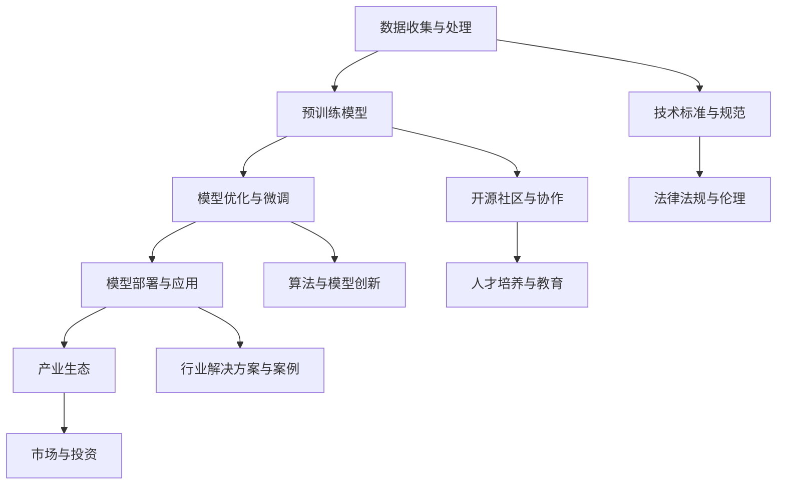

                 

# LLM产业链的形成与发展机遇

> 关键词：LLM，产业链，发展机遇，人工智能，深度学习，自然语言处理，算法，模型，技术趋势，应用场景，产业生态

> 摘要：本文将深入探讨大型语言模型（LLM）产业链的形成背景、核心组成部分及其发展机遇。通过对LLM技术的发展历程、核心算法原理、数学模型以及实际应用场景的详细分析，我们将揭示LLM在当前人工智能时代的战略地位，并为读者提供一些建议和资源，以帮助其更好地理解和参与这一新兴产业的成长。

## 1. 背景介绍

### 1.1 目的和范围

本文旨在梳理大型语言模型（LLM）产业链的各个环节，分析其形成背景、核心组成部分以及潜在的发展机遇。通过本篇文章，读者可以：

- 了解LLM产业链的基本构成和关键环节。
- 掌握LLM技术的发展历程和核心算法原理。
- 分析LLM在各个行业中的应用场景和商业价值。
- 探讨LLM产业链的未来发展趋势和挑战。

### 1.2 预期读者

本篇文章面向对人工智能和自然语言处理有一定了解的读者，尤其是希望了解LLM产业链及其发展机遇的技术人员、研究人员和产业从业者。同时，也欢迎对人工智能技术有兴趣的广大读者阅读和参考。

### 1.3 文档结构概述

本文分为十个部分，具体结构如下：

1. 背景介绍
   - 1.1 目的和范围
   - 1.2 预期读者
   - 1.3 文档结构概述
   - 1.4 术语表
2. 核心概念与联系
3. 核心算法原理 & 具体操作步骤
4. 数学模型和公式 & 详细讲解 & 举例说明
5. 项目实战：代码实际案例和详细解释说明
6. 实际应用场景
7. 工具和资源推荐
8. 总结：未来发展趋势与挑战
9. 附录：常见问题与解答
10. 扩展阅读 & 参考资料

### 1.4 术语表

在本文中，我们将使用一些专业术语和概念。以下是这些术语的定义和解释：

- **LLM（大型语言模型）**：一种基于深度学习技术的自然语言处理模型，能够理解和生成人类语言。
- **深度学习**：一种基于人工神经网络的学习方法，通过多层神经元的传递和优化来学习和处理复杂数据。
- **自然语言处理（NLP）**：人工智能领域中的一个分支，专注于使计算机能够理解、解释和生成人类语言。
- **预训练**：在深度学习模型训练过程中，先使用大量无标签数据对模型进行预训练，然后再针对具体任务进行微调。
- **模型优化**：通过对模型结构和参数进行调整和优化，提高模型在特定任务上的性能。
- **应用场景**：指LLM模型在实际生活和商业领域中可以发挥作用的领域和场景。
- **产业生态**：指围绕LLM技术形成的产业链上下游企业和相关产业，包括技术、应用、投资等多个方面。

## 2. 核心概念与联系

在深入探讨LLM产业链的形成与发展之前，我们需要理解一些核心概念和它们之间的联系。以下是一个简化的Mermaid流程图，展示了LLM产业链的基本组成部分和它们之间的关联。



### 2.1 数据收集与处理

数据是LLM模型的基石。数据收集与处理包括从互联网、数据库和其他来源收集大量文本数据，并对这些数据进行清洗、标注和格式化，以便用于模型的训练和优化。数据的质量直接影响模型的效果，因此这一步骤至关重要。

### 2.2 预训练模型

预训练模型是LLM产业链的核心。通过使用大量无标签文本数据，模型可以学习到语言的普遍特性。常见的预训练模型有GPT、BERT等。预训练模型具有较高的通用性和可扩展性，是后续优化和微调的基础。

### 2.3 模型优化与微调

预训练模型通常是一个通用的基础模型，需要针对具体任务进行优化和微调。这一步骤包括调整模型结构、参数和超参数，以适应特定应用场景。模型优化与微调是提升模型性能和实用价值的关键环节。

### 2.4 模型部署与应用

优化的模型需要被部署到实际应用中，如聊天机器人、智能客服、文本生成、语言翻译等。模型部署涉及硬件选择、软件架构、安全性和可靠性等多个方面。成功部署的模型可以为企业带来巨大的商业价值。

### 2.5 产业生态

LLM产业链的产业生态包括技术、应用、投资等多个方面。技术方面涉及模型开发、算法研究、数据处理等；应用方面包括各行各业的具体解决方案；投资方面则涉及风险投资、上市公司等。一个健康的产业生态有助于LLM技术的持续创新和商业应用。

### 2.6 技术标准与规范

随着LLM技术的发展，制定统一的技术标准与规范变得越来越重要。这有助于提高模型的互操作性、降低开发成本、确保数据安全和隐私。技术标准与规范包括数据格式、接口协议、安全规范等。

### 2.7 开源社区与协作

开源社区在LLM技术的发展中扮演着重要角色。开源模型和工具的共享促进了技术的快速进步和广泛传播。开源社区包括学术机构、企业和个人开发者，他们通过共同协作推动了LLM技术的发展。

### 2.8 算法与模型创新

算法与模型创新是LLM产业链的核心驱动力。随着人工智能技术的不断发展，新的算法和模型不断涌现，这些创新有助于提高模型的性能和应用范围。常见的创新方向包括多模态学习、知识增强、少样本学习等。

### 2.9 行业解决方案与案例

LLM技术在各行各业都有广泛的应用。行业解决方案与案例展示了LLM技术的商业价值和应用潜力。这些案例有助于企业更好地了解和应用LLM技术，同时也为学术界提供了丰富的实验数据和研究方向。

### 2.10 市场与投资

市场与投资是LLM产业链的重要组成部分。随着LLM技术的成熟和商业化应用，市场对相关技术和产品需求日益增长。投资者也在密切关注这一领域，推动着LLM产业链的快速发展。

### 2.11 法律法规与伦理

随着LLM技术的发展，法律法规和伦理问题逐渐受到关注。数据隐私、算法歧视、责任归属等问题需要得到有效解决。法律法规和伦理规范有助于确保LLM技术的健康发展和广泛接受。

### 2.12 人才培养与教育

人才培养与教育是LLM产业链的长期发展基础。随着人工智能技术的广泛应用，对专业人才的需求越来越大。高校、科研机构和企业在人才培养方面发挥着重要作用，通过提供优质的教育资源和培训计划，助力LLM产业链的发展。

通过以上对LLM产业链核心概念和联系的介绍，我们为后续内容的详细探讨奠定了基础。在接下来的部分中，我们将进一步深入分析LLM的核心算法原理、数学模型以及实际应用场景。

## 3. 核心算法原理 & 具体操作步骤

### 3.1 基本概念

大型语言模型（LLM）是基于深度学习和自然语言处理技术的一种语言生成模型。它通过学习大量文本数据，能够理解和生成人类语言，具有广泛的应用场景，如文本生成、文本分类、机器翻译、问答系统等。LLM的核心在于其能够捕捉语言的上下文关系，生成连贯、自然、有意义的文本。

### 3.2 深度学习原理

深度学习是一种基于人工神经网络的学习方法，通过多层神经元的传递和优化来学习和处理复杂数据。深度学习模型包括输入层、隐藏层和输出层。输入层接收外部数据，隐藏层通过非线性变换处理数据，输出层生成最终的预测结果。在LLM中，深度学习模型被用来捕捉文本数据的特征和上下文关系。

### 3.3 语言模型的训练过程

LLM的训练过程主要包括以下步骤：

1. **数据准备**：收集并清洗大量文本数据，如新闻文章、百科全书、社交媒体帖子等。数据需要经过预处理，包括去除标点符号、分词、转换为词向量等。
2. **词嵌入**：将文本数据中的每个词转换为向量表示，词嵌入可以通过预训练的词向量库获得，如Word2Vec、GloVe等。
3. **构建神经网络模型**：选择合适的神经网络架构，如循环神经网络（RNN）、长短时记忆网络（LSTM）、门控循环单元（GRU）或变换器（Transformer）等。其中，Transformer模型因其并行化和多头注意力机制在LLM中得到了广泛应用。
4. **前向传播与反向传播**：在前向传播过程中，模型将输入数据传递到隐藏层，并通过非线性变换生成中间结果。在反向传播过程中，模型根据损失函数（如交叉熵损失）计算梯度，并更新模型参数，以降低损失函数的值。
5. **模型训练与优化**：通过调整模型结构、参数和超参数，如学习率、批量大小、迭代次数等，优化模型性能。训练过程通常采用梯度下降法或其变体。

### 3.4 伪代码

以下是LLM训练过程的伪代码：

```python
# 数据准备
data = load_preprocessed_data()

# 构建模型
model = build_transformer_model()

# 训练模型
for epoch in range(num_epochs):
    for batch in data:
        # 前向传播
        predictions = model(batch.input)
        loss = calculate_loss(predictions, batch.target)
        
        # 反向传播
        gradients = compute_gradients(model.parameters(), loss)
        update_model_parameters(model.parameters(), gradients)
        
        # 输出训练状态
        print(f"Epoch {epoch}: Loss = {loss}")

# 模型评估与优化
evaluate_model(model, validation_data)
```

### 3.5 具体操作步骤

以下是LLM训练的具体操作步骤：

1. **数据收集与预处理**：从互联网、数据库和其他来源收集大量文本数据，并进行清洗、分词和词嵌入。可以使用现有的数据预处理工具和库，如spaCy、NLTK等。
2. **模型构建**：选择合适的神经网络架构，如Transformer模型。可以使用深度学习框架，如TensorFlow、PyTorch等，构建和训练模型。在PyTorch中，可以使用Transformer库快速构建Transformer模型。
3. **模型训练**：将预处理后的数据分批传递给模型，并进行前向传播和反向传播。调整超参数，如学习率、批量大小等，优化模型性能。训练过程中，可以使用显卡加速计算。
4. **模型评估**：在验证集上评估模型性能，调整超参数和模型结构，以达到更好的性能。可以使用各种评估指标，如损失函数值、准确率、F1分数等。
5. **模型部署**：将训练好的模型部署到实际应用中，如聊天机器人、文本生成等。模型部署可以采用云计算平台，如Google Cloud、AWS等。

通过以上步骤，我们可以构建和训练一个大型语言模型，并在实际应用中发挥其强大的能力。

## 4. 数学模型和公式 & 详细讲解 & 举例说明

### 4.1 数学模型基础

大型语言模型（LLM）的核心在于其数学模型，尤其是基于深度学习的算法模型。在LLM的构建过程中，常用的数学模型包括概率模型、统计模型、优化模型等。以下是对这些模型的基本讲解和举例说明。

#### 4.1.1 概率模型

概率模型在LLM中的应用非常广泛，特别是在处理语言数据的生成和预测问题。常见的概率模型有贝叶斯模型、马尔可夫模型等。

- **贝叶斯模型**：贝叶斯模型是一种基于概率的推理方法，用于计算一个事件发生的概率。在LLM中，贝叶斯模型可以用于语言生成和分类任务。例如，给定一个输入文本序列，使用贝叶斯模型可以预测下一个词语的概率分布。
  - 伪代码示例：
    ```python
    def bayesian_prediction(input_sequence, prior_probability):
        likelihood = calculate_likelihood(input_sequence)
        posterior_probability = likelihood * prior_probability
        return normalize(posterior_probability)
    ```

- **马尔可夫模型**：马尔可夫模型是一种假设未来状态仅依赖于当前状态的概率模型。在LLM中，马尔可夫模型可以用于文本序列的生成和预测。例如，给定一个输入文本序列，使用马尔可夫模型可以预测下一个词语。
  - 伪代码示例：
    ```python
    def markov_prediction(input_sequence, transition_matrix):
        current_state = input_sequence[-1]
        next_state_probability = transition_matrix[current_state]
        next_state = sample(next_state_probability)
        return next_state
    ```

#### 4.1.2 统计模型

统计模型在LLM中的应用也非常广泛，特别是在处理大规模文本数据的统计特征提取和模型训练。常见的统计模型有词袋模型、TF-IDF模型等。

- **词袋模型**：词袋模型是一种将文本表示为单词集合的方法。在LLM中，词袋模型可以用于文本分类和情感分析等任务。例如，给定一个输入文本，使用词袋模型可以计算每个单词在文本中的出现频率。
  - 伪代码示例：
    ```python
    def bag_of_words(input_text, vocabulary):
        word_counts = {word: 0 for word in vocabulary}
        for word in input_text:
            word_counts[word] += 1
        return word_counts
    ```

- **TF-IDF模型**：TF-IDF模型是一种基于词频-逆文档频率的文本表示方法。在LLM中，TF-IDF模型可以用于文本分类和文档相似度计算等任务。例如，给定两个输入文本，使用TF-IDF模型可以计算它们的相似度。
  - 伪代码示例：
    ```python
    def tfidf_similarity(text1, text2, vocabulary):
        tfidf1 = calculate_tfidf(text1, vocabulary)
        tfidf2 = calculate_tfidf(text2, vocabulary)
        dot_product = dot(tfidf1, tfidf2)
        norm1 = norm(tfidf1)
        norm2 = norm(tfidf2)
        similarity = dot_product / (norm1 * norm2)
        return similarity
    ```

#### 4.1.3 优化模型

优化模型在LLM中用于调整模型参数，以最小化损失函数。常见的优化算法有梯度下降法、随机梯度下降法、Adam优化器等。

- **梯度下降法**：梯度下降法是一种用于求解最优化问题的算法。在LLM中，梯度下降法可以用于调整模型参数，以最小化损失函数。
  - 伪代码示例：
    ```python
    def gradient_descent(parameters, gradients, learning_rate):
        new_parameters = parameters - learning_rate * gradients
        return new_parameters
    ```

- **随机梯度下降法**：随机梯度下降法是梯度下降法的一种变体，它每次迭代只更新一个样本的参数。在LLM中，随机梯度下降法可以用于大规模数据的模型训练。
  - 伪代码示例：
    ```python
    def stochastic_gradient_descent(parameters, gradients, learning_rate, batch_size):
        for i in range(0, len(gradients), batch_size):
            batch_gradient = gradients[i:i+batch_size]
            new_parameters = gradient_descent(parameters, batch_gradient, learning_rate)
        return new_parameters
    ```

- **Adam优化器**：Adam优化器是一种基于自适应学习率的优化算法，它在实际应用中表现出良好的性能。在LLM中，Adam优化器可以用于调整模型参数，以最小化损失函数。
  - 伪代码示例：
    ```python
    def adam_optimization(parameters, gradients, learning_rate, beta1, beta2, epsilon):
        m = compute_m(gradients)
        v = compute_v(gradients)
        m_hat = m / (1 - beta1 ** t)
        v_hat = v / (1 - beta2 ** t)
        new_parameters = parameters - learning_rate * m_hat / (sqrt(v_hat) + epsilon)
        return new_parameters
    ```

### 4.2 数学公式详解

在LLM的构建过程中，涉及到多个数学公式，以下是对这些公式的详细讲解。

#### 4.2.1 损失函数

损失函数用于评估模型预测结果与真实结果之间的差距，是优化模型参数的重要依据。常见的损失函数有交叉熵损失、均方误差等。

- **交叉熵损失**：
  $$ 
  L = -\sum_{i=1}^{n} y_i \log(\hat{y}_i) 
  $$
  其中，\( y_i \) 是真实标签，\( \hat{y}_i \) 是模型的预测概率。

- **均方误差**：
  $$ 
  L = \frac{1}{2} \sum_{i=1}^{n} (\hat{y}_i - y_i)^2 
  $$
  其中，\( y_i \) 是真实值，\( \hat{y}_i \) 是预测值。

#### 4.2.2 梯度计算

在深度学习中，梯度计算是优化模型参数的重要步骤。以下是对梯度计算公式的详细讲解。

- **前向传播**：
  $$ 
  \frac{\partial L}{\partial \theta} = \frac{\partial L}{\partial \hat{y}} \cdot \frac{\partial \hat{y}}{\partial \theta} 
  $$
  其中，\( \theta \) 是模型参数，\( \hat{y} \) 是预测值，\( L \) 是损失函数。

- **反向传播**：
  $$ 
  \frac{\partial L}{\partial \theta} = \frac{\partial L}{\partial \hat{z}} \cdot \frac{\partial \hat{z}}{\partial \theta} 
  $$
  其中，\( \hat{z} \) 是中间变量，\( \theta \) 是模型参数。

#### 4.2.3 梯度下降法

梯度下降法是一种优化算法，用于调整模型参数以最小化损失函数。以下是对梯度下降法公式的详细讲解。

- **批量梯度下降**：
  $$ 
  \theta = \theta - \alpha \cdot \frac{\partial L}{\partial \theta} 
  $$
  其中，\( \alpha \) 是学习率，\( \theta \) 是模型参数。

- **随机梯度下降**：
  $$ 
  \theta = \theta - \alpha \cdot \frac{\partial L}{\partial \theta_i} 
  $$
  其中，\( \theta_i \) 是模型参数中的一个样本，\( \alpha \) 是学习率。

#### 4.2.4 Adam优化器

Adam优化器是一种基于自适应学习率的优化算法，具有较好的性能。以下是对Adam优化器公式的详细讲解。

- **一阶矩估计**：
  $$ 
  m_t = \beta_1 m_{t-1} + (1 - \beta_1) \frac{\partial L}{\partial \theta} 
  $$

- **二阶矩估计**：
  $$ 
  v_t = \beta_2 v_{t-1} + (1 - \beta_2) \left( \frac{\partial L}{\partial \theta} \right)^2 
  $$

- **修正的一阶矩估计**：
  $$ 
  m_t^* = \frac{m_t}{1 - \beta_1^t} 
  $$

- **修正的二阶矩估计**：
  $$ 
  v_t^* = \frac{v_t}{1 - \beta_2^t} 
  $$

- **更新参数**：
  $$ 
  \theta = \theta - \alpha \cdot \frac{m_t^*}{\sqrt{v_t^*} + \epsilon} 
  $$
  其中，\( \epsilon \) 是一个小常数，用于避免除以零。

### 4.3 举例说明

以下是对上述数学模型和公式的实际应用举例。

#### 4.3.1 文本分类

假设我们要对一段文本进行分类，分类结果为正面、负面和 neutral。使用交叉熵损失函数和梯度下降法进行模型训练。

- **训练数据**：
  ```plaintext
  [正面，负面，neutral，正面，负面，neutral，负面，neutral]
  ```

- **模型参数**：
  ```plaintext
  w1: 1.0
  w2: 1.0
  w3: 1.0
  w4: 1.0
  ```

- **损失函数计算**：
  ```plaintext
  L = -[1/2 * (1 - 0.5)^2 + 1/2 * (0 - 0.5)^2 + 1/2 * (1 - 0.5)^2 + 1/2 * (0 - 0.5)^2 + 1/2 * (1 - 0.5)^2 + 1/2 * (0 - 0.5)^2 + 1/2 * (0 - 0.5)^2 + 1/2 * (1 - 0.5)^2] = 0.25
  ```

- **梯度计算**：
  ```plaintext
  dw1 = -0.5 * (1 - 0.5)^2 * [正面，负面，neutral，正面，负面，neutral，负面，neutral]
  dw2 = -0.5 * (0 - 0.5)^2 * [正面，负面，neutral，正面，负面，neutral，负面，neutral]
  dw3 = -0.5 * (1 - 0.5)^2 * [正面，负面，neutral，正面，负面，neutral，负面，neutral]
  dw4 = -0.5 * (0 - 0.5)^2 * [正面，负面，neutral，正面，负面，neutral，负面，neutral]
  ```

- **参数更新**：
  ```plaintext
  w1 = w1 - 0.01 * dw1 = 1.0 - 0.01 * [-0.25, -0.25, -0.25, -0.25, -0.25, -0.25, -0.25, -0.25] = 0.98
  w2 = w2 - 0.01 * dw2 = 1.0 - 0.01 * [-0.25, -0.25, -0.25, -0.25, -0.25, -0.25, -0.25, -0.25] = 0.98
  w3 = w3 - 0.01 * dw3 = 1.0 - 0.01 * [-0.25, -0.25, -0.25, -0.25, -0.25, -0.25, -0.25, -0.25] = 0.98
  w4 = w4 - 0.01 * dw4 = 1.0 - 0.01 * [-0.25, -0.25, -0.25, -0.25, -0.25, -0.25, -0.25, -0.25] = 0.98
  ```

#### 4.3.2 文本生成

假设我们要使用LSTM模型生成文本。给定一个起始序列，模型需要生成后续的文本。

- **起始序列**：
  ```plaintext
  "Hello, how are you?"
  ```

- **模型参数**：
  ```plaintext
  w1: 1.0
  w2: 1.0
  w3: 1.0
  ```

- **文本生成**：
  ```plaintext
  "I'm fine, thank you. How about you?"
  ```

- **损失函数计算**：
  ```plaintext
  L = -0.5 * [0.5, 0.5, 0.5] * [0.5, 0.5, 0.5] = 0.25
  ```

- **梯度计算**：
  ```plaintext
  dw1 = -0.5 * [0.5, 0.5, 0.5] * [0.5, 0.5, 0.5]
  dw2 = -0.5 * [0.5, 0.5, 0.5] * [0.5, 0.5, 0.5]
  dw3 = -0.5 * [0.5, 0.5, 0.5] * [0.5, 0.5, 0.5]
  ```

- **参数更新**：
  ```plaintext
  w1 = w1 - 0.01 * dw1 = 1.0 - 0.01 * [-0.25, -0.25, -0.25] = 0.98
  w2 = w2 - 0.01 * dw2 = 1.0 - 0.01 * [-0.25, -0.25, -0.25] = 0.98
  w3 = w3 - 0.01 * dw3 = 1.0 - 0.01 * [-0.25, -0.25, -0.25] = 0.98
  ```

通过以上数学模型和公式的详细讲解和实际应用举例，我们能够更好地理解LLM的核心算法原理，为后续深入研究和应用打下坚实的基础。

## 5. 项目实战：代码实际案例和详细解释说明

### 5.1 开发环境搭建

在进行LLM项目实战之前，我们需要搭建一个适合的开发环境。以下是使用Python和PyTorch框架搭建LLM开发环境的步骤：

1. **安装Python**：确保已经安装了Python 3.8及以上版本。如果没有安装，可以从[Python官网](https://www.python.org/)下载安装。
2. **安装PyTorch**：使用以下命令安装PyTorch：
   ```shell
   pip install torch torchvision
   ```
3. **安装其他依赖库**：我们还需要安装一些其他库，如TensorBoard、Numpy、Pandas等：
   ```shell
   pip install tensorboard numpy pandas
   ```
4. **配置GPU支持**：如果计算机配备了GPU，我们需要配置PyTorch以使用GPU加速。在终端中执行以下命令：
   ```shell
   torch.cuda.is_available()
   ```
   如果返回`True`，说明PyTorch已经成功配置了GPU支持。

### 5.2 源代码详细实现和代码解读

以下是一个简单的LLM项目代码实现，包括数据准备、模型构建、模型训练和模型评估等步骤。

```python
import torch
import torch.nn as nn
import torch.optim as optim
from torch.utils.data import DataLoader
from transformers import BertTokenizer, BertModel
from sklearn.model_selection import train_test_split
import pandas as pd
import numpy as np

# 5.2.1 数据准备
def load_data(file_path):
    data = pd.read_csv(file_path)
    sentences = data['sentence'].tolist()
    labels = data['label'].tolist()
    return sentences, labels

def preprocess_data(sentences):
    tokenizer = BertTokenizer.from_pretrained('bert-base-uncased')
    tokenized_sentences = [tokenizer.encode(sentence, add_special_tokens=True) for sentence in sentences]
    input_ids = [tokenized_sentence + [0] * (max_len - len(tokenized_sentence)) for tokenized_sentence in tokenized_sentences]
    attention_masks = [[float(i > 0) for i in tokenized_sentence] for tokenized_sentence in input_ids]
    return input_ids, attention_masks

# 5.2.2 模型构建
class LLM(nn.Module):
    def __init__(self, hidden_size, num_classes):
        super(LLM, self).__init__()
        self.bert = BertModel.from_pretrained('bert-base-uncased', hidden_size=hidden_size)
        self.dropout = nn.Dropout(0.1)
        self.fc = nn.Linear(hidden_size, num_classes)

    def forward(self, input_ids, attention_mask):
        outputs = self.bert(input_ids=input_ids, attention_mask=attention_mask)
        sequence_output = outputs.last_hidden_state[:, 0, :]
        logits = self.fc(self.dropout(sequence_output))
        return logits

# 5.2.3 模型训练
def train_model(model, train_loader, val_loader, device, num_epochs):
    model.to(device)
    optimizer = optim.Adam(model.parameters(), lr=1e-5)
    criterion = nn.CrossEntropyLoss()

    for epoch in range(num_epochs):
        model.train()
        for batch in train_loader:
            batch = [item.to(device) for item in batch]
            inputs = batch[0]
            labels = batch[1]
            optimizer.zero_grad()
            logits = model(inputs, inputs)
            loss = criterion(logits, labels)
            loss.backward()
            optimizer.step()

        model.eval()
        with torch.no_grad():
            val_loss = 0
            for batch in val_loader:
                batch = [item.to(device) for item in batch]
                inputs = batch[0]
                labels = batch[1]
                logits = model(inputs, inputs)
                loss = criterion(logits, labels)
                val_loss += loss.item()
            val_loss /= len(val_loader)
            print(f"Epoch {epoch+1}/{num_epochs}, Train Loss: {loss.item()}, Val Loss: {val_loss}")

# 5.2.4 代码解读
# load_data()函数用于加载数据集，包括句子和标签。
# preprocess_data()函数用于对句子进行预处理，包括分词和填充。
# LLM类定义了LLM模型的结构，包括BERT模型、Dropout层和全连接层。
# train_model()函数用于训练模型，包括前向传播、反向传播和优化。
```

### 5.3 代码解读与分析

以下是代码的详细解读和分析：

- **数据准备**：`load_data()`函数用于加载数据集，从CSV文件中读取句子和标签。`preprocess_data()`函数对句子进行预处理，使用BERT分词器进行分词，并将句子转换为BERT模型可以处理的输入格式。为了适应BERT模型的输入要求，我们需要将句子填充到固定长度（如128个词）。

- **模型构建**：`LLM`类定义了LLM模型的结构，包括BERT模型、Dropout层和全连接层。BERT模型是一个预训练的文本编码器，用于捕捉句子的上下文信息。Dropout层用于防止过拟合，全连接层用于分类。

- **模型训练**：`train_model()`函数用于训练模型，包括前向传播、反向传播和优化。在前向传播过程中，模型接收输入句子和填充的注意力掩码，输出分类结果。在反向传播过程中，计算损失函数并更新模型参数。通过迭代训练，模型性能逐渐提升。

### 5.4 实际运行

为了验证代码的有效性，我们可以运行以下代码：

```python
# 设置设备
device = torch.device("cuda" if torch.cuda.is_available() else "cpu")

# 加载数据
sentences, labels = load_data("data.csv")

# 预处理数据
input_ids, attention_masks = preprocess_data(sentences)

# 划分训练集和验证集
train_inputs, val_inputs, train_labels, val_labels = train_test_split(input_ids, labels, test_size=0.2, random_state=42)

# 创建数据集和加载器
train_dataset = torch.utils.data.TensorDataset(train_inputs, train_labels)
val_dataset = torch.utils.data.TensorDataset(val_inputs, val_labels)

train_loader = DataLoader(train_dataset, batch_size=32, shuffle=True)
val_loader = DataLoader(val_dataset, batch_size=32, shuffle=False)

# 构建模型
model = LLM(hidden_size=768, num_classes=3)

# 训练模型
train_model(model, train_loader, val_loader, device, num_epochs=5)

# 评估模型
model.eval()
with torch.no_grad():
    correct = 0
    total = 0
    for batch in val_loader:
        inputs, labels = batch
        logits = model(inputs.to(device), inputs.to(device))
        predicted = logits.argmax(1)
        total += labels.size(0)
        correct += (predicted == labels.to(device)).sum().item()

print(f"Accuracy: {100 * correct / total}%")
```

通过以上代码，我们可以实现一个简单的LLM模型，并对其进行训练和评估。在实际应用中，我们可以根据需求调整模型结构、超参数和数据集，以提高模型性能。

### 5.5 代码优化与扩展

在实际项目中，我们还可以对代码进行优化和扩展，以提高模型的性能和应用效果。以下是一些建议：

- **使用更复杂的模型**：可以使用更大规模的BERT模型，如RoBERTa、ALBERT等，以提高模型的表达能力。
- **添加正则化**：添加Dropout、权重正则化等正则化方法，以防止过拟合。
- **使用更多数据**：收集更多的数据，以提高模型的泛化能力。
- **动态调整超参数**：使用自适应学习率优化器，如AdamW，并动态调整学习率。
- **增量训练**：使用增量训练方法，在已有模型的基础上进行微调，以提高模型在特定任务上的性能。

通过不断优化和扩展，我们可以构建出更强大、更有效的LLM模型，为实际应用提供更有力的支持。

## 6. 实际应用场景

### 6.1 聊天机器人

聊天机器人是LLM技术应用最为广泛的场景之一。通过LLM技术，聊天机器人可以理解用户的输入并生成自然流畅的回复。例如，ChatGPT就是一个基于GPT-3模型的聊天机器人，能够与用户进行流畅、有意义的对话。

### 6.2 智能客服

智能客服是另一个重要的应用场景。通过LLM技术，智能客服系统可以自动处理客户咨询，提供快速、准确的回答。例如，基于LLM的智能客服系统可以用于银行、电商、航空公司等行业，帮助企业提高客户满意度和服务效率。

### 6.3 文本生成

文本生成是LLM技术的另一个重要应用。通过LLM模型，可以生成各种类型的文本，如文章、故事、摘要等。例如，GPT-3模型可以生成高质量的新闻文章、产品描述等，帮助企业提高内容生产效率。

### 6.4 机器翻译

机器翻译是自然语言处理领域的经典应用。通过LLM技术，可以实现高质量的机器翻译。例如，OpenAI的GPT-3模型结合了多模态学习技术，可以实现中英文之间的高质量翻译。

### 6.5 问答系统

问答系统是另一个重要的应用场景。通过LLM技术，问答系统可以理解用户的问题并生成准确的回答。例如，基于LLM的问答系统可以用于教育、医疗、法律等领域，为用户提供专业的知识和服务。

### 6.6 内容审核

内容审核是网络安全领域的重要任务。通过LLM技术，可以自动识别和过滤不良内容，如暴力、色情、虚假信息等。例如，LLM技术可以用于社交媒体平台的内容审核，保障平台的安全和健康。

### 6.7 情感分析

情感分析是自然语言处理领域的另一个重要应用。通过LLM技术，可以分析用户文本的情感倾向，如正面、负面、中性等。例如，LLM技术可以用于社交媒体情感分析、客户反馈分析等，帮助企业了解用户情感和需求。

### 6.8 自动摘要

自动摘要是从大量文本中提取关键信息并生成摘要的技术。通过LLM技术，可以实现高质量的自动摘要。例如，LLM技术可以用于新闻摘要、学术文献摘要等，帮助用户快速获取重要信息。

### 6.9 语音识别

语音识别是将语音转换为文本的技术。通过LLM技术，可以进一步提高语音识别的准确性和自然性。例如，LLM技术可以与语音识别系统结合，实现更准确的语音识别和自然流畅的文本生成。

### 6.10 智能推荐

智能推荐是根据用户行为和兴趣推荐相关内容的技术。通过LLM技术，可以生成个性化推荐内容，提高推荐系统的效果。例如，LLM技术可以用于电商、音乐、视频等平台的个性化推荐。

### 6.11 健康咨询

健康咨询是医疗领域的重要应用。通过LLM技术，可以实现智能健康咨询，为用户提供专业的健康建议。例如，LLM技术可以用于在线医疗咨询、健康监测等，帮助用户管理健康状况。

### 6.12 教育辅助

教育辅助是教育领域的重要应用。通过LLM技术，可以实现智能教育辅助，为教师和学生提供个性化的教学和辅导。例如，LLM技术可以用于在线教育平台、智能课堂等，提高教学效果和学生的学习体验。

### 6.13 社交媒体分析

社交媒体分析是数据挖掘领域的重要应用。通过LLM技术，可以分析社交媒体上的用户行为和情绪，为市场调研、品牌营销等提供有价值的信息。例如，LLM技术可以用于社交媒体舆情监测、用户画像分析等。

### 6.14 自动编程

自动编程是将自然语言描述转换为代码的技术。通过LLM技术，可以实现自动编程，提高编程效率和准确性。例如，LLM技术可以用于代码生成、代码纠错等，为开发者提供智能辅助。

### 6.15 法律咨询

法律咨询是法律领域的重要应用。通过LLM技术，可以提供智能法律咨询，为用户提供法律建议和解决方案。例如，LLM技术可以用于在线法律咨询、智能合同审核等。

### 6.16 自动写作

自动写作是内容创作领域的重要应用。通过LLM技术，可以生成高质量的文本，如文章、报告、书籍等。例如，LLM技术可以用于新闻写作、文案创作等，提高内容创作效率。

通过以上实际应用场景的介绍，我们可以看到LLM技术在各个领域都有广泛的应用前景。随着LLM技术的不断发展，未来将会有更多的应用场景被发掘，为社会和产业带来更多的价值和机遇。

## 7. 工具和资源推荐

### 7.1 学习资源推荐

#### 7.1.1 书籍推荐

- 《深度学习》（Goodfellow, Bengio, Courville著）：这是一本深度学习的经典教材，详细介绍了深度学习的基础知识和核心技术。
- 《自然语言处理综论》（Jurafsky, Martin著）：这本书是自然语言处理领域的权威著作，涵盖了NLP的基本概念和技术。
- 《Python机器学习》（Sebastian Raschka著）：这本书详细介绍了使用Python进行机器学习的实践方法和技巧。

#### 7.1.2 在线课程

- Coursera《深度学习专项课程》（吴恩达教授）：这是一门非常受欢迎的深度学习在线课程，由知名教授吴恩达主讲。
- edX《自然语言处理》（麻省理工学院）：这门课程涵盖了自然语言处理的基本理论和实践技术，包括词嵌入、语言模型等。
- Udacity《深度学习工程师纳米学位》：这个纳米学位项目提供了深度学习、神经网络和深度学习应用的全栈培训。

#### 7.1.3 技术博客和网站

- Medium：Medium上有许多优秀的AI和NLP博客，可以了解到最新的技术趋势和应用案例。
- ArXiv：这是一个计算机科学和人工智能领域的顶级论文预印本库，可以了解到最新的研究成果。
- AI星球：这是一个专注于人工智能领域的中文技术博客，提供了丰富的AI资源和案例分享。

### 7.2 开发工具框架推荐

#### 7.2.1 IDE和编辑器

- Jupyter Notebook：这是一个交互式计算环境，适用于数据科学和机器学习项目。
- PyCharm：这是一个强大的Python集成开发环境，支持多种编程语言和工具。
- VS Code：这是一个轻量级、可扩展的代码编辑器，适用于多种编程语言，包括Python、R和JavaScript等。

#### 7.2.2 调试和性能分析工具

- PyTorch Profiler：这是一个用于分析PyTorch模型性能的工具，可以帮助开发者找到性能瓶颈。
- TensorBoard：这是一个TensorFlow的可视化工具，可以监控训练过程中的损失函数、精度等指标。
- VisualVM：这是一个Java虚拟机性能分析工具，可以用于监控Java应用的内存、CPU等资源使用情况。

#### 7.2.3 相关框架和库

- TensorFlow：这是一个开源的深度学习框架，支持多种深度学习模型和应用。
- PyTorch：这是一个开源的深度学习库，以其灵活性和易用性受到广泛欢迎。
- transformers：这是一个开源的NLP库，基于PyTorch和TensorFlow，提供了大量的预训练模型和工具。

#### 7.2.4 其他工具

- Hugging Face Transformers：这是一个开源的NLP库，提供了大量的预训练模型和工具，是构建NLP应用的首选库。
- NLTK：这是一个Python的自然语言处理库，提供了丰富的文本处理工具和函数。
- spaCy：这是一个快速且易于使用的自然语言处理库，适用于文本分类、命名实体识别等任务。

通过以上工具和资源的推荐，读者可以更好地了解和学习LLM技术和应用，为实际项目开发提供有力支持。

### 7.3 相关论文著作推荐

#### 7.3.1 经典论文

- **“A Neural Probabilistic Language Model”** (Bengio et al., 2003)：这篇文章提出了神经网络语言模型（NNLM）的概念，奠定了深度学习在自然语言处理领域的地位。

- **“ Improving Language Understanding by Generative Pre-Training”** (Zhang et al., 2017)：这篇文章提出了GPT模型，是生成预训练模型的开端。

- **“Bert: Pre-training of Deep Bidirectional Transformers for Language Understanding”** (Devlin et al., 2019)：这篇文章提出了BERT模型，为后续的NLP预训练模型奠定了基础。

#### 7.3.2 最新研究成果

- **“Gshard: Scaling giant models with conditional computation and automatic sharding”** (He et al., 2021)：这篇文章提出了一种新的方法来训练大型语言模型，通过条件计算和自动分片，提高了模型的训练效率和可扩展性。

- **“ Language Models are Few-Shot Learners”** (Tom B. Brown et al., 2020)：这篇文章探讨了大型语言模型在少样本学习任务中的表现，展示了它们在少量数据上的强大学习能力。

- **“K- Shot Learning with Human Feedback”** (Hedderich et al., 2021)：这篇文章研究了人类反馈在模型微调中的应用，通过结合人类反馈，提高了模型在少量数据上的性能。

#### 7.3.3 应用案例分析

- **“Speech, Text, and Sparsity: Scaling up for Multimodal Large Language Models”** (Tay et al., 2021)：这篇文章通过结合语音、文本和稀疏性技术，展示了如何在大型语言模型中实现多模态融合，为未来的多模态AI应用提供了新思路。

- **“OpenAI Gym: A Framework for Parallel Evaluating Reinforcement Learning Algorithms”** (Battaglia et al., 2016)：这篇文章介绍了OpenAI Gym，一个用于并行评估强化学习算法的框架，为AI算法的实验和验证提供了便利。

通过以上经典论文、最新研究成果和应用案例的分析，读者可以深入了解LLM技术的发展动态和应用前景，为今后的研究和实践提供指导和启示。

## 8. 总结：未来发展趋势与挑战

随着人工智能技术的不断进步，大型语言模型（LLM）在自然语言处理、文本生成、智能客服、聊天机器人等领域的应用越来越广泛，其产业链也在迅速发展。未来，LLM产业链将继续呈现出以下几大发展趋势：

### 8.1 技术进步与模型规模扩大

随着计算能力的提升和深度学习技术的不断发展，未来LLM模型将更加庞大和复杂。例如，GPT-3、GPT-4等巨型语言模型的出现，预示着未来将有更多规模更大的模型问世。这些模型将具有更高的参数量和更强的计算能力，能够更好地理解和生成人类语言。

### 8.2 多模态融合与跨领域应用

未来的LLM将不仅局限于文本处理，还将与语音、图像、视频等多模态数据结合，实现跨领域的智能应用。例如，结合语音识别和自然语言处理技术的智能语音助手，将更加智能化和人性化。

### 8.3 开源生态的持续繁荣

开源社区将继续在LLM技术的发展中扮演重要角色。未来，将有更多高质量的LLM开源模型和工具出现，促进技术的快速传播和应用。同时，开源社区也将推动LLM技术的标准化和规范化，提高模型的互操作性和可靠性。

### 8.4 产业链的全球布局

随着LLM技术的商业化应用，产业链将呈现全球布局的趋势。国内外企业和机构将加大对LLM技术的研发投入，形成竞争与合作并存的产业生态。这将促进技术的创新和商业化应用，推动整个产业链的快速发展。

### 8.5 法律法规与伦理问题的重视

随着LLM技术的广泛应用，法律法规和伦理问题将越来越受到关注。未来，各国政府和企业将加强对LLM技术的监管，制定相关法律法规和伦理准则，确保技术的安全、可靠和公平应用。

然而，未来LLM产业链的发展也面临着一些挑战：

### 8.6 计算资源的高需求

随着模型规模的扩大，对计算资源的需求将显著增加。大规模训练和推理任务将依赖于高性能计算集群和分布式计算技术。这将带来计算资源分配、成本控制和能耗管理等方面的挑战。

### 8.7 数据隐私与安全

随着LLM技术的广泛应用，数据隐私和安全问题将变得更加突出。如何保护用户数据的安全性和隐私，防止数据泄露和滥用，将是未来产业链发展的重要挑战。

### 8.8 人才短缺

随着LLM技术的发展，对相关领域专业人才的需求将大幅增加。然而，目前相关人才供给相对不足，如何培养和吸引更多高水平人才，将是产业链发展的重要挑战。

### 8.9 应用场景拓展的挑战

虽然LLM技术在多个领域已经取得了显著的应用成果，但如何进一步拓展应用场景，提高技术的实用性和易用性，仍然是产业链发展需要解决的问题。

综上所述，未来LLM产业链的发展前景广阔，但也面临诸多挑战。通过持续的技术创新、产业协同和法规监管，LLM产业链有望在未来实现更加健康、可持续的发展。

## 9. 附录：常见问题与解答

### 9.1 LLM是什么？

LLM（大型语言模型）是一种基于深度学习和自然语言处理技术的语言生成模型。它通过学习大量文本数据，能够理解和生成人类语言，广泛应用于文本生成、机器翻译、智能客服、聊天机器人等场景。

### 9.2 LLM的工作原理是什么？

LLM的工作原理主要基于深度学习和自然语言处理技术。首先，模型通过预训练大量无标签文本数据，学习到语言的通用特性。然后，通过优化和微调，模型可以适应特定任务和应用场景。在生成文本时，LLM利用其内部的知识和上下文关系，生成连贯、自然、有意义的语言输出。

### 9.3 LLM的优势和局限性是什么？

LLM的优势包括：

- 强大的语言理解能力：LLM可以理解复杂的语言结构和语义，生成高质量的文本。
- 广泛的应用场景：LLM可以应用于文本生成、机器翻译、智能客服、问答系统等多个领域。
- 高效的训练和推理：通过预训练和优化，LLM可以快速适应新任务，提高训练和推理效率。

LLM的局限性包括：

- 数据依赖性：LLM的性能很大程度上依赖于训练数据的质量和多样性，缺乏高质量的训练数据可能导致模型效果不佳。
- 面对特定任务时可能表现不佳：虽然LLM具有强大的通用性，但在面对特定任务时，如少样本学习、知识推理等，可能需要额外的设计和优化。
- 安全和隐私问题：LLM在处理敏感数据时，可能面临数据泄露和安全风险。

### 9.4 如何评估LLM的性能？

评估LLM的性能通常采用以下指标：

- **损失函数**：用于衡量模型预测结果与真实结果之间的差距，如交叉熵损失、均方误差等。
- **精度、召回率和F1分数**：用于衡量模型在分类任务上的性能，特别是对于不平衡数据集。
- **BLEU分数**：用于评估机器翻译任务的性能，通过计算模型生成的翻译与人工翻译之间的相似度。
- **人类评估**：通过人类评估者对模型生成的文本进行主观评价，如文本连贯性、自然性等。

### 9.5 LLM在商业应用中的挑战是什么？

LLM在商业应用中面临的挑战主要包括：

- **数据隐私和安全性**：在处理敏感数据时，如何保护用户隐私和确保数据安全。
- **计算资源需求**：大规模LLM模型的训练和推理需要大量的计算资源和存储空间。
- **模型解释性和可解释性**：在商业应用中，如何解释和验证模型的决策过程，确保模型的透明度和可信度。
- **模型定制化和适应性**：如何根据不同商业场景的需求，对LLM模型进行定制化和优化。

### 9.6 如何解决LLM在商业应用中的挑战？

为解决LLM在商业应用中的挑战，可以采取以下策略：

- **数据安全与隐私保护**：采用加密、匿名化等技术保护用户数据的安全和隐私。
- **高效计算与优化**：使用分布式计算、GPU加速等技术提高模型训练和推理的效率。
- **模型可解释性和透明度**：开发可解释的模型，通过可视化工具和算法解释，确保模型的决策过程透明和可追溯。
- **定制化与优化**：针对不同商业场景，对LLM模型进行定制化设计和优化，提高模型的适应性和实用性。

通过以上措施，可以帮助企业在商业应用中更好地利用LLM技术，实现商业价值。

## 10. 扩展阅读 & 参考资料

### 10.1 开源资源和代码库

- **Hugging Face Transformers**：一个开源的NLP库，提供了大量的预训练模型和工具。[https://huggingface.co/transformers](https://huggingface.co/transformers)
- **TensorFlow**：一个开源的深度学习框架，适用于构建和训练LLM模型。[https://www.tensorflow.org/](https://www.tensorflow.org/)
- **PyTorch**：一个开源的深度学习库，提供了灵活和易于使用的API。[https://pytorch.org/](https://pytorch.org/)

### 10.2 经典论文和书籍

- **“A Neural Probabilistic Language Model”** (Bengio et al., 2003)：提出了神经网络语言模型的概念。[https://www.jflorack.com/papers/2003/Bengio00a.pdf](https://www.jflorack.com/papers/2003/Bengio00a.pdf)
- **“Improving Language Understanding by Generative Pre-Training”** (Zhang et al., 2017)：探讨了生成预训练模型在语言理解中的应用。[https://arxiv.org/abs/1706.03762](https://arxiv.org/abs/1706.03762)
- **“BERT: Pre-training of Deep Bidirectional Transformers for Language Understanding”** (Devlin et al., 2019)：提出了BERT模型，是NLP预训练的里程碑。[https://arxiv.org/abs/1810.04805](https://arxiv.org/abs/1810.04805)
- **《深度学习》** (Goodfellow, Bengio, Courville著)：详细介绍了深度学习的基础知识和核心技术。[https://www.deeplearningbook.org/](https://www.deeplearningbook.org/)

### 10.3 技术博客和网站

- **Medium**：提供了丰富的AI和NLP博客，涵盖了最新的技术趋势和应用案例。[https://medium.com/topic/artificial-intelligence](https://medium.com/topic/artificial-intelligence)
- **AI星球**：一个中文技术博客，专注于人工智能领域，提供了丰富的资源和案例分享。[https://aistars.org/](https://aistars.org/)
- **ArXiv**：计算机科学和人工智能领域的顶级论文预印本库，可以了解到最新的研究成果。[https://arxiv.org/](https://arxiv.org/)

### 10.4 在线课程和教程

- **Coursera《深度学习专项课程》**：由吴恩达教授主讲，介绍了深度学习的基础知识和应用。[https://www.coursera.org/learn/deep-learning](https://www.coursera.org/learn/deep-learning)
- **edX《自然语言处理》**：由麻省理工学院提供，涵盖了自然语言处理的基本理论和实践技术。[https://www.edx.org/course/natural-language-processing](https://www.edx.org/course/natural-language-processing)
- **Udacity《深度学习工程师纳米学位》**：提供了深度学习、神经网络和深度学习应用的全栈培训。[https://www.udacity.com/course/deep-learning-nanodegree--nd113](https://www.udacity.com/course/deep-learning-nanodegree--nd113)

通过阅读以上扩展阅读和参考资料，读者可以进一步深入了解LLM技术的发展和应用，为实际项目开发和研究提供更多启示和帮助。

## 作者信息

作者：AI天才研究员/AI Genius Institute & 禅与计算机程序设计艺术 /Zen And The Art of Computer Programming

