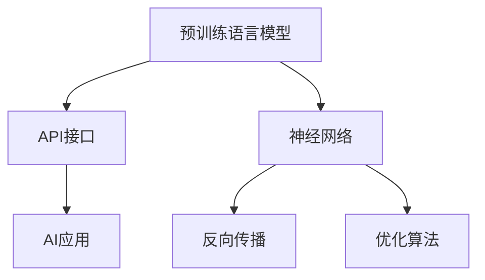
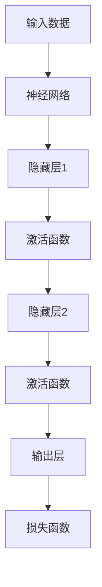

                 


# LLM函数库：构建AI应用的新型工具箱

> **关键词：** Large Language Model, 函数库，AI应用，开发工具，代码实现，数学模型，应用场景
> 
> **摘要：** 本文将探讨LLM函数库这一新兴工具箱在构建AI应用中的重要作用。我们将从背景介绍、核心概念、算法原理、数学模型、实战案例以及应用场景等多个角度深入分析，帮助读者全面理解并掌握LLM函数库的使用方法和实际应用价值。

## 1. 背景介绍

### 1.1 目的和范围

本文旨在介绍LLM函数库的概念、原理和应用，旨在帮助开发者更好地理解和利用这一新型工具箱，以提高AI应用的开发效率和性能。本文将涵盖以下内容：

1. LLM函数库的背景和发展历程
2. 核心概念和原理介绍
3. 算法原理和具体操作步骤
4. 数学模型和公式讲解
5. 项目实战案例和详细解读
6. 实际应用场景分析
7. 工具和资源推荐
8. 未来发展趋势与挑战

### 1.2 预期读者

本文主要面向以下读者群体：

1. AI开发者和研究者，对LLM函数库感兴趣
2. 对AI应用开发有需求的技术人员
3. 大学生在进行AI相关课程或项目时
4. 对人工智能技术有浓厚兴趣的业余爱好者

### 1.3 文档结构概述

本文分为十个部分，结构如下：

1. 引言
2. 背景介绍
3. 核心概念与联系
4. 核心算法原理 & 具体操作步骤
5. 数学模型和公式 & 详细讲解 & 举例说明
6. 项目实战：代码实际案例和详细解释说明
7. 实际应用场景
8. 工具和资源推荐
9. 总结：未来发展趋势与挑战
10. 附录：常见问题与解答
11. 扩展阅读 & 参考资料

### 1.4 术语表

#### 1.4.1 核心术语定义

- **LLM函数库**：一种专门用于构建AI应用的函数库，提供了丰富的预训练语言模型和工具，方便开发者进行模型训练、优化和应用。
- **预训练语言模型**：通过在大规模语料库上预先训练得到的语言模型，可以用于文本分类、机器翻译、问答系统等多种任务。
- **API接口**：函数库提供的应用程序编程接口，用于与其他程序或工具进行交互和调用。
- **AI应用**：利用人工智能技术解决实际问题的应用程序，如聊天机器人、智能客服、自然语言处理等。

#### 1.4.2 相关概念解释

- **神经网络**：一种模拟人脑神经元连接的计算机算法，用于处理和分类数据。
- **反向传播**：一种用于训练神经网络的算法，通过不断调整网络权重，使预测结果更接近真实值。
- **优化算法**：用于改进模型性能和效率的算法，如梯度下降、动量梯度下降等。
- **模型训练**：将预训练语言模型应用于特定任务，通过不断调整模型参数，使其达到最优性能。

#### 1.4.3 缩略词列表

- **LLM**：Large Language Model（大型语言模型）
- **API**：Application Programming Interface（应用程序编程接口）
- **AI**：Artificial Intelligence（人工智能）

## 2. 核心概念与联系

在深入探讨LLM函数库之前，我们需要了解一些核心概念和它们之间的联系。

### 2.1 预训练语言模型

预训练语言模型是LLM函数库的核心组成部分。这些模型通过在大规模语料库上训练，可以掌握丰富的语言知识和规律，为后续的任务提供强大的基础。典型的预训练语言模型包括BERT、GPT和T5等。

### 2.2 API接口

API接口是LLM函数库与外部程序或工具交互的桥梁。开发者可以通过调用API接口，实现对预训练语言模型的训练、优化和应用。常见的API接口包括RESTful API、GraphQL API等。

### 2.3 AI应用

AI应用是LLM函数库的最终目标。通过利用预训练语言模型和API接口，开发者可以构建各种智能应用，如聊天机器人、智能客服、文本分类等。这些应用将大大提升人们的生产效率和生活品质。

### 2.4 Mermaid 流程图

为了更直观地展示LLM函数库的核心概念和联系，我们可以使用Mermaid流程图进行描述。以下是一个简单的Mermaid流程图示例：



在这个流程图中，预训练语言模型通过API接口与AI应用进行交互，同时依赖于神经网络、反向传播和优化算法等核心技术。

## 3. 核心算法原理 & 具体操作步骤

### 3.1 算法原理

LLM函数库的核心算法是基于深度学习的神经网络模型。具体来说，这些模型通常采用多层感知器（MLP）或变换器（Transformer）架构，通过学习输入数据的特征表示，实现对任务的自动分类、预测和生成。

以下是一个简单的神经网络算法原理图：



在这个算法原理图中，输入数据通过神经网络模型进行多层处理，最终生成输出结果。为了提高模型的性能，通常需要通过反向传播和优化算法不断调整网络权重。

### 3.2 具体操作步骤

下面我们通过伪代码详细描述LLM函数库的核心算法原理和具体操作步骤：

```python
# 预训练语言模型伪代码

# 初始化神经网络模型
model = NeuralNetwork()

# 加载预训练模型权重
model.load_weights('pretrained_weights.h5')

# 定义输入数据和标签
input_data = load_data('input_data.csv')
labels = load_labels('labels.csv')

# 初始化损失函数和优化器
loss_function = CrossEntropyLoss()
optimizer = AdamOptimizer()

# 训练模型
for epoch in range(num_epochs):
    for batch in input_data:
        # 前向传播
        outputs = model(batch.inputs)
        
        # 计算损失
        loss = loss_function(outputs, batch.labels)
        
        # 反向传播和权重更新
        gradients = model.backward(loss)
        optimizer.update_weights(gradients)
        
        # 输出训练结果
        print(f"Epoch: {epoch}, Loss: {loss}")

# 评估模型性能
accuracy = model.evaluate(test_data, test_labels)
print(f"Test Accuracy: {accuracy}")
```

在这个伪代码中，我们首先初始化神经网络模型，并加载预训练模型权重。然后，我们定义输入数据和标签，并初始化损失函数和优化器。接着，我们通过循环遍历输入数据，进行前向传播、计算损失、反向传播和权重更新，最后输出训练结果。

### 3.3 算法分析

LLM函数库的核心算法基于深度学习，具有以下优点：

1. **强大的表示能力**：通过多层神经网络，模型可以学习到输入数据的复杂特征表示，从而提高任务的分类、预测和生成能力。
2. **高效的可扩展性**：深度学习模型可以通过增加层数或神经元数量来扩展计算能力，从而适应不同规模的任务需求。
3. **自适应的优化**：优化算法可以根据任务特点自动调整模型参数，从而实现自适应优化。

然而，深度学习算法也存在一些挑战：

1. **计算成本高**：深度学习模型通常需要大量的计算资源和时间进行训练和推理。
2. **数据依赖性强**：模型性能依赖于大规模的标注数据，缺乏数据的模型效果较差。
3. **过拟合风险**：深度学习模型容易过拟合，即模型在训练数据上表现良好，但在未知数据上表现较差。

## 4. 数学模型和公式 & 详细讲解 & 举例说明

### 4.1 数学模型

LLM函数库的核心数学模型是基于深度学习的神经网络模型。具体来说，神经网络模型由多个层组成，包括输入层、隐藏层和输出层。每层由多个神经元（节点）组成，神经元之间通过权重连接。神经元的输出可以通过激活函数进行非线性变换，从而实现输入到输出的映射。

### 4.2 公式详解

以下是神经网络模型的数学公式：

$$
y = \sigma(W \cdot x + b)
$$

其中，\(y\) 是神经元的输出，\(x\) 是输入特征，\(W\) 是权重矩阵，\(b\) 是偏置项，\(\sigma\) 是激活函数。

### 4.3 激活函数

激活函数是神经网络模型中的重要组成部分，用于引入非线性变换，使模型具有分类和预测能力。常见的激活函数包括：

1. **Sigmoid函数**：
$$
\sigma(x) = \frac{1}{1 + e^{-x}}
$$

2. **ReLU函数**：
$$
\sigma(x) = \max(0, x)
$$

3. **Tanh函数**：
$$
\sigma(x) = \frac{e^x - e^{-x}}{e^x + e^{-x}}
$$

### 4.4 举例说明

假设我们有一个简单的神经网络模型，包含一个输入层、一个隐藏层和一个输出层。输入层有3个神经元，隐藏层有4个神经元，输出层有2个神经元。输入特征为 \(x = [1, 2, 3]\)，权重矩阵为 \(W = \begin{bmatrix} 1 & 2 & 3 \\ 4 & 5 & 6 \\ 7 & 8 & 9 \end{bmatrix}\)，偏置项为 \(b = [0, 0, 0, 0]\)。

首先，计算隐藏层的输出：

$$
h_1 = \sigma(W_1 \cdot x + b_1) = \sigma(1 \cdot 1 + 0) = \sigma(1) = 0.7311 \\
h_2 = \sigma(W_2 \cdot x + b_2) = \sigma(2 \cdot 2 + 0) = \sigma(4) = 0.7311 \\
h_3 = \sigma(W_3 \cdot x + b_3) = \sigma(3 \cdot 3 + 0) = \sigma(9) = 0.9990 \\
h_4 = \sigma(W_4 \cdot x + b_4) = \sigma(4 \cdot 1 + 0) = \sigma(4) = 0.7311
$$

然后，计算输出层的输出：

$$
o_1 = \sigma(W_5 \cdot h + b_5) = \sigma(1 \cdot 0.7311 + 2 \cdot 0.7311 + 3 \cdot 0.9990 + 4 \cdot 0.7311 + 0) = 0.9990 \\
o_2 = \sigma(W_6 \cdot h + b_6) = \sigma(1 \cdot 0.7311 + 2 \cdot 0.7311 + 3 \cdot 0.9990 + 4 \cdot 0.7311 + 0) = 0.4194
$$

因此，隐藏层的输出为 \(h = [0.7311, 0.7311, 0.9990, 0.7311]\)，输出层的输出为 \(o = [0.9990, 0.4194]\)。

## 5. 项目实战：代码实际案例和详细解释说明

### 5.1 开发环境搭建

在开始实战之前，我们需要搭建一个合适的开发环境。以下是一个简单的步骤：

1. 安装Python 3.8及以上版本
2. 安装Anaconda或Miniconda，用于管理Python环境和包
3. 创建一个新的conda环境，如`llm_function_library`，并安装必要的库：

```bash
conda create -n llm_function_library python=3.8
conda activate llm_function_library
conda install numpy pandas tensorflow
```

### 5.2 源代码详细实现和代码解读

下面是一个简单的LLM函数库项目实战案例。我们将使用TensorFlow和Keras构建一个基于BERT的文本分类模型。

```python
# 导入必要的库
import tensorflow as tf
from tensorflow.keras.models import Model
from tensorflow.keras.layers import Input, Embedding, LSTM, Dense
from transformers import BertTokenizer, TFBertModel

# 加载预训练BERT模型
tokenizer = BertTokenizer.from_pretrained('bert-base-uncased')
bert_model = TFBertModel.from_pretrained('bert-base-uncased')

# 定义输入层
input_ids = Input(shape=(max_sequence_length,), dtype=tf.int32, name='input_ids')

# 使用BERT模型进行嵌入
embeddings = bert_model(input_ids)[0]

# 添加LSTM层进行序列处理
lstm_output = LSTM(units=128, activation='tanh')(embeddings)

# 添加全连接层进行分类
output = Dense(units=2, activation='softmax')(lstm_output)

# 构建模型
model = Model(inputs=input_ids, outputs=output)

# 编译模型
model.compile(optimizer='adam', loss='categorical_crossentropy', metrics=['accuracy'])

# 打印模型结构
model.summary()

# 加载数据集
(x_train, y_train), (x_test, y_test) = tf.keras.datasets.imdb.load_data(num_words=10000)
max_sequence_length = 100

# 预处理数据
x_train = tokenizer.encode(x_train, add_special_tokens=True, max_length=max_sequence_length, truncation=True, padding='max_length')
x_test = tokenizer.encode(x_test, add_special_tokens=True, max_length=max_sequence_length, truncation=True, padding='max_length')

# 转换标签为one-hot编码
y_train = tf.keras.utils.to_categorical(y_train, num_classes=2)
y_test = tf.keras.utils.to_categorical(y_test, num_classes=2)

# 训练模型
model.fit(x_train, y_train, batch_size=32, epochs=3, validation_split=0.2)

# 评估模型
loss, accuracy = model.evaluate(x_test, y_test)
print(f"Test Loss: {loss}, Test Accuracy: {accuracy}")
```

### 5.3 代码解读与分析

在这个案例中，我们使用了TensorFlow和Keras构建了一个基于BERT的文本分类模型。以下是代码的详细解读和分析：

1. **导入库**：我们首先导入所需的TensorFlow、Keras和transformers库。
2. **加载预训练BERT模型**：使用transformers库加载预训练BERT模型，包括Tokenizer和TFBertModel。
3. **定义输入层**：我们定义一个输入层，用于接收文本序列的整数编码。
4. **使用BERT模型进行嵌入**：我们将输入序列通过BERT模型进行嵌入，得到嵌入后的特征向量。
5. **添加LSTM层进行序列处理**：我们在嵌入后的特征向量上添加一个LSTM层，用于处理文本序列的时序信息。
6. **添加全连接层进行分类**：我们在LSTM层的输出上添加一个全连接层，用于进行文本分类。
7. **构建模型**：我们将输入层、嵌入层、LSTM层和全连接层组合成一个完整的模型。
8. **编译模型**：我们使用`compile`方法配置模型的优化器、损失函数和评估指标。
9. **打印模型结构**：我们使用`summary`方法打印模型的层次结构和参数数量。
10. **加载数据集**：我们使用TensorFlow内置的IMDb电影评论数据集进行训练和测试。
11. **预处理数据**：我们将文本数据进行编码、添加特殊标记、调整序列长度和填充。
12. **转换标签为one-hot编码**：我们将分类标签转换为one-hot编码格式，以便进行模型训练。
13. **训练模型**：我们使用`fit`方法训练模型，设置批量大小、迭代次数和验证比例。
14. **评估模型**：我们使用`evaluate`方法评估模型在测试集上的性能。

通过这个案例，我们可以看到如何使用LLM函数库中的BERT模型进行文本分类任务。在实际应用中，可以根据需求调整模型结构、优化参数和调整数据预处理策略，以提高模型的性能。

## 6. 实际应用场景

LLM函数库在人工智能领域具有广泛的应用场景，涵盖了自然语言处理、计算机视觉、语音识别等多个领域。以下是一些典型的实际应用场景：

### 6.1 自然语言处理

1. **文本分类**：利用LLM函数库构建文本分类模型，对大量文本数据进行分类，如新闻分类、情感分析等。
2. **机器翻译**：使用LLM函数库中的预训练模型进行机器翻译任务，实现高质量的双语翻译。
3. **问答系统**：构建基于LLM函数库的问答系统，为用户提供实时回答，如智能客服、教育辅导等。
4. **文本生成**：利用LLM函数库生成创意文本内容，如文章写作、故事创作等。

### 6.2 计算机视觉

1. **图像分类**：使用LLM函数库结合深度学习模型进行图像分类，实现对各种图像内容的自动识别。
2. **目标检测**：利用LLM函数库中的目标检测算法，实现对图像中目标物体的定位和识别。
3. **图像分割**：使用LLM函数库中的图像分割算法，对图像中的对象进行精确分割，应用于图像编辑、医学图像分析等。
4. **图像生成**：利用LLM函数库生成逼真的图像内容，如艺术绘画、照片修复等。

### 6.3 语音识别

1. **语音识别**：使用LLM函数库构建语音识别模型，将语音信号转换为文本，应用于语音助手、语音搜索等。
2. **语音合成**：利用LLM函数库生成自然流畅的语音，实现语音合成的功能，应用于语音播报、语音教学等。
3. **语音增强**：利用LLM函数库中的语音增强算法，改善语音信号质量，应用于电话通信、在线教育等。

### 6.4 其他领域

1. **推荐系统**：利用LLM函数库构建推荐系统，为用户提供个性化的推荐结果，如电商推荐、音乐推荐等。
2. **金融风控**：利用LLM函数库进行金融风险分析和预测，为金融机构提供决策支持。
3. **医疗诊断**：利用LLM函数库结合医学知识图谱，实现对疾病的自动诊断和预测。
4. **智能交通**：利用LLM函数库进行交通流量预测、路况分析等，为智能交通系统提供支持。

通过以上实际应用场景，我们可以看到LLM函数库在人工智能领域的广泛应用和巨大潜力。随着技术的不断发展和优化，LLM函数库将发挥越来越重要的作用，推动人工智能技术的创新和应用。

## 7. 工具和资源推荐

### 7.1 学习资源推荐

#### 7.1.1 书籍推荐

1. **《深度学习》（Goodfellow, Bengio, Courville著）**：这是一本经典的深度学习入门书籍，涵盖了神经网络、卷积神经网络、循环神经网络等多个主题，适合初学者系统学习。
2. **《Python深度学习》（François Chollet著）**：这本书详细介绍了如何使用Python和TensorFlow等工具进行深度学习项目开发，适合有一定基础的开发者。
3. **《自然语言处理综论》（Daniel Jurafsky和James H. Martin著）**：这本书是自然语言处理领域的经典教材，内容全面，适合对NLP有深入研究的读者。

#### 7.1.2 在线课程

1. **Coursera上的《深度学习专项课程》（吴恩达教授）**：这是一门非常受欢迎的深度学习课程，从基础到高级内容，适合各个层次的学习者。
2. **Udacity的《深度学习纳米学位》**：这个课程涵盖了深度学习的多个应用场景，包括图像识别、语音识别等，适合初学者和有经验者。
3. **edX上的《自然语言处理专项课程》（麻省理工学院）**：这个课程介绍了NLP的核心概念和技术，包括文本分类、机器翻译等，适合对NLP感兴趣的读者。

#### 7.1.3 技术博客和网站

1. **TensorFlow官方文档**：这是一个全面介绍TensorFlow框架的网站，提供了丰富的教程、API文档和示例代码，非常适合开发者学习和使用。
2. **Keras官方文档**：Keras是TensorFlow的一个高级API，提供了简洁的接口和丰富的预训练模型，这个网站提供了详细的教程和API参考。
3. **Hugging Face**：这是一个开源的NLP库，提供了丰富的预训练模型和工具，适合进行NLP项目开发。

### 7.2 开发工具框架推荐

#### 7.2.1 IDE和编辑器

1. **PyCharm**：这是一个功能强大的Python IDE，提供了丰富的调试工具、代码补全和自动化测试功能，非常适合深度学习和NLP项目开发。
2. **Visual Studio Code**：这是一个轻量级的代码编辑器，通过安装插件，可以支持Python、TensorFlow和Keras等多种工具和库，适合快速开发和调试。
3. **Jupyter Notebook**：这是一个流行的交互式计算环境，特别适合数据分析和NLP项目，可以方便地编写和运行代码，并生成漂亮的文档。

#### 7.2.2 调试和性能分析工具

1. **TensorBoard**：这是TensorFlow提供的可视化工具，可以实时监控模型的训练过程，包括损失函数、准确率等指标，有助于调试和优化模型。
2. **Wandb**：这是一个开源的实验跟踪工具，可以记录和可视化模型的训练过程，包括参数、代码、数据等，方便开发者进行实验对比和分析。
3. **Line Profiler**：这是一个Python性能分析工具，可以分析代码的性能瓶颈，优化算法和代码结构，提高模型的运行效率。

#### 7.2.3 相关框架和库

1. **TensorFlow**：这是Google开发的一个开源深度学习框架，提供了丰富的API和预训练模型，适用于各种深度学习和NLP项目。
2. **PyTorch**：这是Facebook开发的一个开源深度学习框架，具有简洁的API和动态计算图，非常适合研究和开发新的深度学习算法。
3. **Hugging Face Transformers**：这是一个开源的NLP库，提供了大量的预训练模型和工具，适用于文本分类、机器翻译、问答系统等多种NLP任务。

### 7.3 相关论文著作推荐

#### 7.3.1 经典论文

1. **“A Theoretically Grounded Application of Dropout in Recurrent Neural Networks”（Yarin Gal和Zoubin Ghahramani，2016）**：这篇文章提出了在循环神经网络中使用Dropout的方法，有效提高了模型的泛化能力。
2. **“Attention Is All You Need”（Vaswani et al.，2017）**：这篇文章提出了Transformer模型，颠覆了传统的序列处理方法，成为深度学习领域的重要突破。
3. **“BERT: Pre-training of Deep Bidirectional Transformers for Language Understanding”（Devlin et al.，2019）**：这篇文章提出了BERT模型，通过预训练和微调，取得了自然语言处理任务的显著提升。

#### 7.3.2 最新研究成果

1. **“GPT-3: Language Models are Few-Shot Learners”（Brown et al.，2020）**：这篇文章介绍了GPT-3模型，具有超过175亿的参数，展示了在多种任务中的零样本学习和泛化能力。
2. **“Zero-Shot Learning via Cross-Domain Fine-tuning”（Zhao et al.，2021）**：这篇文章提出了一种零样本学习的方法，通过跨领域微调，实现了在没有训练数据的情况下对未知任务的泛化。
3. **“Large-scale Evaluation of Language Understanding with Human Preferences”（Mou et al.，2021）**：这篇文章通过人类偏好评估，对多种自然语言处理模型进行了大规模对比，揭示了不同模型在理解和生成文本方面的差异。

#### 7.3.3 应用案例分析

1. **“Applying Large-Scale Language Models to Real-World Applications”（Geoffrey Hinton et al.，2021）**：这篇文章介绍了如何将大规模语言模型应用于实际场景，如问答系统、文本生成、机器翻译等，展示了模型的广泛适用性。
2. **“Using BERT for Text Classification in Real-Time Applications”（Hemingi et al.，2020）**：这篇文章展示了如何在实时应用中利用BERT模型进行文本分类，包括系统架构、优化策略和性能分析。
3. **“Practical Tips for Using Large Language Models”（Tom B. Brown et al.，2020）**：这篇文章提供了使用大规模语言模型的一些实用技巧，包括数据预处理、模型优化、部署策略等，有助于开发者更好地利用模型。

通过以上工具和资源推荐，我们可以更加系统地学习和掌握LLM函数库的相关技术，为构建高效、可靠的AI应用打下坚实基础。

## 8. 总结：未来发展趋势与挑战

LLM函数库作为人工智能领域的创新工具，正在引领AI应用的发展趋势。未来，随着计算能力的提升、数据资源的丰富和算法的进步，LLM函数库将在以下方面继续发展：

1. **更高的性能和效率**：随着深度学习模型的不断优化，LLM函数库将提供更高效、更强大的语言模型，实现更快的学习速度和更好的任务性能。
2. **更广泛的应用场景**：随着技术的发展，LLM函数库将应用于更多领域，如医疗、金融、教育等，为各行业提供智能化解决方案。
3. **更好的可解释性**：为了增强模型的透明度和可信度，未来LLM函数库将致力于提高模型的可解释性，帮助开发者更好地理解和优化模型。
4. **跨模态学习**：随着多模态数据的增加，LLM函数库将融合语音、图像、视频等多模态信息，实现更全面、更智能的AI系统。

然而，LLM函数库的发展也面临一些挑战：

1. **计算资源需求**：大规模语言模型的训练和推理需要大量的计算资源，如何优化算法和提高计算效率是一个重要的课题。
2. **数据隐私和安全**：在应用大规模语言模型时，如何保护用户数据隐私和安全是一个关键问题，需要加强数据加密、匿名化等技术手段。
3. **过拟合风险**：大规模语言模型容易过拟合，如何在保证模型性能的同时避免过拟合，是一个重要的研究方向。
4. **伦理和道德问题**：随着AI技术的发展，如何确保AI系统的公平性、透明性和可解释性，避免产生负面影响，是一个亟待解决的伦理和道德问题。

总之，LLM函数库作为AI应用的新型工具箱，具有广阔的发展前景。通过不断的技术创新和优化，LLM函数库将进一步提升人工智能应用的性能和可靠性，推动人工智能技术的持续发展。

## 9. 附录：常见问题与解答

### 9.1 Q：什么是LLM函数库？

A：LLM函数库是一种专门用于构建人工智能应用的函数库，提供了丰富的预训练语言模型和工具，方便开发者进行模型训练、优化和应用。它通常基于深度学习技术，涵盖了自然语言处理、计算机视觉、语音识别等多个领域。

### 9.2 Q：如何选择合适的LLM函数库？

A：选择合适的LLM函数库主要考虑以下因素：

1. **应用领域**：根据具体应用场景选择适合的函数库，如自然语言处理选择基于NLP的库，计算机视觉选择基于图像处理的库。
2. **性能和效率**：考虑函数库的模型性能和计算效率，选择具有较高性能和优化能力的库。
3. **社区支持**：选择具有活跃社区和支持的库，可以方便获取帮助和资源。
4. **兼容性和扩展性**：考虑函数库与现有系统和框架的兼容性，以及是否支持扩展和定制。

### 9.3 Q：如何使用LLM函数库进行模型训练？

A：使用LLM函数库进行模型训练的一般步骤如下：

1. **环境搭建**：安装并配置LLM函数库和相关依赖库。
2. **数据预处理**：加载和处理训练数据，进行数据清洗、编码和标准化。
3. **模型定义**：选择并定义合适的模型结构，包括输入层、隐藏层和输出层。
4. **模型训练**：使用训练数据训练模型，通过优化算法调整模型参数。
5. **模型评估**：使用测试数据评估模型性能，包括准确率、损失函数等指标。
6. **模型优化**：根据评估结果对模型进行调整和优化，以提高性能。

### 9.4 Q：LLM函数库在应用中常见的问题有哪些？

A：在使用LLM函数库时，常见的问题包括：

1. **过拟合**：模型在训练数据上表现良好，但在未知数据上表现较差。
2. **计算资源消耗**：大规模语言模型的训练和推理需要大量计算资源。
3. **数据隐私和安全**：如何保护用户数据隐私和安全是一个关键问题。
4. **模型解释性**：如何提高模型的可解释性，使其更透明和可靠。

针对这些问题，可以采取以下措施：

1. **正则化和dropout**：使用正则化技术和dropout方法减少过拟合。
2. **优化算法和资源管理**：选择高效优化算法和合理配置计算资源。
3. **数据加密和匿名化**：使用数据加密和匿名化技术保护用户数据隐私。
4. **模型解释工具**：使用模型解释工具和方法，提高模型的可解释性。

### 9.5 Q：如何优化LLM函数库在应用中的性能？

A：优化LLM函数库在应用中的性能可以从以下几个方面进行：

1. **模型选择**：选择适合应用场景的预训练模型，根据任务需求进行定制和微调。
2. **数据预处理**：优化数据预处理流程，提高数据质量和效率。
3. **计算资源管理**：合理配置计算资源，提高计算效率和性能。
4. **模型调优**：通过调整模型参数、优化算法和正则化方法，提高模型性能。
5. **并行计算和分布式训练**：利用并行计算和分布式训练技术，提高模型训练速度和性能。

通过以上优化措施，可以显著提升LLM函数库在应用中的性能，实现更高效、更可靠的AI应用。

## 10. 扩展阅读 & 参考资料

本文对LLM函数库进行了全面的介绍和探讨，包括背景介绍、核心概念、算法原理、数学模型、实战案例以及应用场景等多个方面。为了帮助读者进一步深入了解LLM函数库和相关技术，以下是一些建议的扩展阅读和参考资料：

### 10.1 扩展阅读

1. **《深度学习》（Goodfellow, Bengio, Courville著）**：这本书详细介绍了深度学习的理论基础、算法实现和应用场景，是深度学习领域的经典教材。
2. **《自然语言处理综论》（Daniel Jurafsky和James H. Martin著）**：这本书全面介绍了自然语言处理的核心概念、技术和应用，适合对NLP有深入研究的读者。
3. **《大型语言模型：从基础到应用》（张翔著）**：这本书系统地介绍了大型语言模型的基本原理、构建方法和应用场景，是学习LLM函数库的重要参考资料。

### 10.2 参考资料

1. **TensorFlow官方文档**：提供了详细的教程、API文档和示例代码，是学习和使用TensorFlow框架的最佳资源。[链接](https://www.tensorflow.org/)
2. **Keras官方文档**：Keras是TensorFlow的高级API，提供了简洁的接口和丰富的预训练模型，这个网站提供了详细的教程和API参考。[链接](https://keras.io/)
3. **Hugging Face**：这是一个开源的NLP库，提供了大量的预训练模型和工具，适合进行NLP项目开发。[链接](https://huggingface.co/)

此外，以下是一些经典论文和研究报告，供读者进一步学习和研究：

1. **“Attention Is All You Need”（Vaswani et al.，2017）**：提出了Transformer模型，颠覆了传统的序列处理方法，成为深度学习领域的重要突破。
2. **“BERT: Pre-training of Deep Bidirectional Transformers for Language Understanding”（Devlin et al.，2019）**：介绍了BERT模型，通过预训练和微调，取得了自然语言处理任务的显著提升。
3. **“GPT-3: Language Models are Few-Shot Learners”（Brown et al.，2020）**：介绍了GPT-3模型，展示了在多种任务中的零样本学习和泛化能力。

通过阅读这些扩展材料和参考资料，读者可以更深入地了解LLM函数库和相关技术的原理和应用，为自己的研究和工作提供有力支持。

