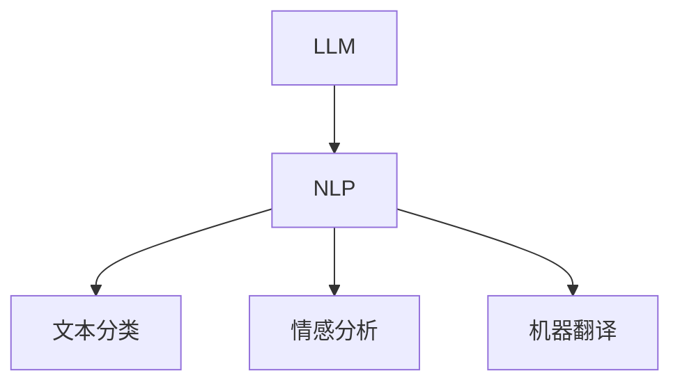
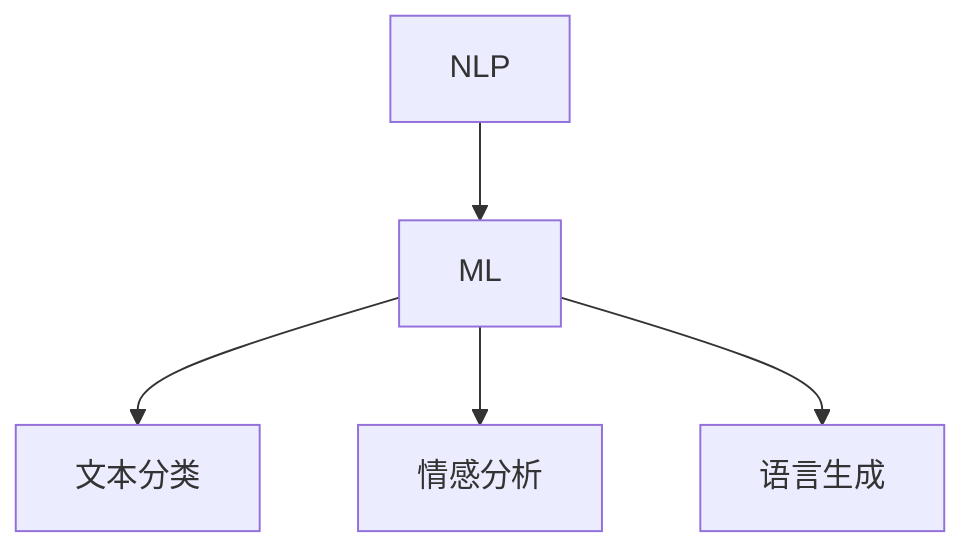
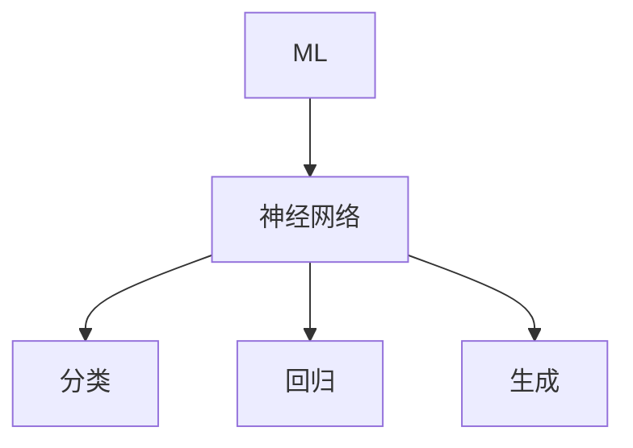
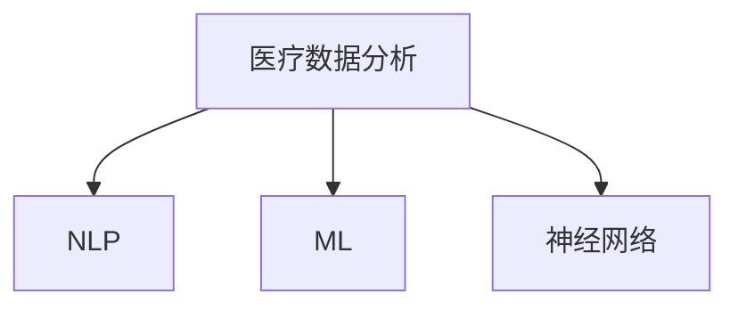
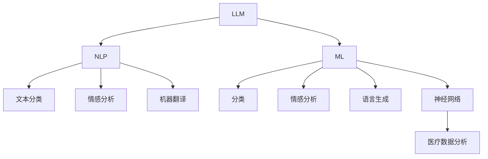

                 

# LLM在医疗诊断中的应用可能性

> 关键词：LLM、医疗诊断、自然语言处理、机器学习、医疗数据分析
>
> 摘要：本文旨在探讨大型语言模型（LLM）在医疗诊断领域中的应用可能性。通过分析LLM的核心概念、算法原理、数学模型以及实际案例，我们将揭示LLM在提高医疗诊断效率、准确性及患者满意度方面的潜力。本文旨在为从事医疗诊断、自然语言处理和机器学习领域的专业人士提供有价值的参考。

## 1. 背景介绍

### 1.1 目的和范围

本文的主要目的是探讨大型语言模型（LLM）在医疗诊断中的应用潜力。随着人工智能技术的不断进步，特别是自然语言处理（NLP）和机器学习（ML）领域的快速发展，LLM在医疗领域的应用越来越受到关注。本文将系统地分析LLM的核心概念、算法原理、数学模型以及实际应用案例，旨在为医疗诊断领域的研究人员和实践者提供有价值的参考。

本文将涵盖以下内容：
1. 核心概念与联系：介绍LLM、NLP、ML和医疗数据分析等关键概念，并使用Mermaid流程图展示它们之间的关系。
2. 核心算法原理与具体操作步骤：详细阐述LLM的工作原理，包括数据预处理、模型训练和预测过程。
3. 数学模型和公式：讲解LLM中使用的数学模型和公式，并通过实例进行说明。
4. 项目实战：通过实际代码案例展示LLM在医疗诊断中的应用。
5. 实际应用场景：分析LLM在医疗诊断中的各种应用场景。
6. 工具和资源推荐：推荐学习资源、开发工具和框架。
7. 总结：讨论LLM在医疗诊断领域的未来发展趋势与挑战。

### 1.2 预期读者

本文预期读者包括以下几类：
1. 医疗诊断领域的研究人员和从业者，希望了解人工智能技术在医疗诊断中的应用。
2. 自然语言处理和机器学习领域的专业人士，对LLM在医疗诊断中的应用感兴趣。
3. 对医疗数据分析和技术应用有浓厚兴趣的学生和研究人员。

### 1.3 文档结构概述

本文分为以下几个部分：
1. 引言：介绍本文的目的、关键词和摘要。
2. 背景介绍：分析LLM在医疗诊断中的应用可能性。
3. 核心概念与联系：介绍LLM、NLP、ML和医疗数据分析等核心概念，并使用Mermaid流程图展示它们之间的关系。
4. 核心算法原理与具体操作步骤：详细阐述LLM的工作原理。
5. 数学模型和公式：讲解LLM中使用的数学模型和公式。
6. 项目实战：通过实际代码案例展示LLM在医疗诊断中的应用。
7. 实际应用场景：分析LLM在医疗诊断中的各种应用场景。
8. 工具和资源推荐：推荐学习资源、开发工具和框架。
9. 总结：讨论LLM在医疗诊断领域的未来发展趋势与挑战。
10. 附录：常见问题与解答。
11. 扩展阅读与参考资料：提供相关文献和资源。

### 1.4 术语表

#### 1.4.1 核心术语定义

- **大型语言模型（LLM）**：一种基于神经网络的语言模型，具有大规模参数和强大的文本生成能力。
- **自然语言处理（NLP）**：研究如何让计算机理解和处理自然语言的技术。
- **机器学习（ML）**：一种基于数据训练模型的计算机算法，使得计算机能够从数据中学习并做出预测。
- **医疗数据分析**：对医疗数据（如病历、影像、实验室检测结果等）进行分析，以发现潜在的规律和知识。

#### 1.4.2 相关概念解释

- **医疗诊断**：医生通过对患者症状、病史、体检和检查结果进行分析，对疾病进行判断和分类的过程。
- **神经网络**：一种由大量节点（神经元）组成的计算模型，能够通过学习数据来提取特征并做出预测。
- **深度学习**：一种基于神经网络的学习方法，能够通过多层神经网络提取数据的高级特征。

#### 1.4.3 缩略词列表

- **LLM**：大型语言模型
- **NLP**：自然语言处理
- **ML**：机器学习
- **NLP**：神经网络
- **GPU**：图形处理器
- **CPU**：中央处理器

## 2. 核心概念与联系

在本节中，我们将介绍本文涉及的核心概念，并使用Mermaid流程图展示它们之间的关系。

### 2.1 LLM、NLP、ML和医疗数据分析的关系

#### LLM与NLP

大型语言模型（LLM）是自然语言处理（NLP）领域的一个重要组成部分。NLP是使计算机能够理解、生成和处理人类语言的技术。LLM通过学习大规模的文本数据，能够生成高质量的自然语言文本，从而实现各种NLP任务，如文本分类、情感分析、机器翻译等。



#### NLP与ML

自然语言处理（NLP）依赖于机器学习（ML）技术。ML是一种通过训练模型来从数据中学习规律的方法。在NLP中，ML技术被用于构建文本分类器、情感分析模型、语言生成模型等，以实现各种NLP任务。



#### ML与神经网络

机器学习（ML）的核心是神经网络。神经网络是一种模拟人脑的计算模型，由大量神经元组成。通过学习数据，神经网络能够提取特征并做出预测。在ML中，神经网络被广泛应用于分类、回归、生成等任务。



#### 医疗数据分析

医疗数据分析是利用数据分析技术对医疗数据进行分析的过程。医疗数据包括病历、影像、实验室检测结果等。通过对医疗数据进行分析，可以提取有用的信息，用于疾病诊断、治疗决策和医疗资源分配等。



### 2.2 Mermaid流程图

以下是本文涉及的核心概念和流程的Mermaid流程图：



## 3. 核心算法原理 & 具体操作步骤

在本节中，我们将深入探讨LLM在医疗诊断中的应用原理，并详细阐述其具体操作步骤。

### 3.1 数据预处理

在应用LLM进行医疗诊断之前，首先需要对医疗数据进行预处理。数据预处理包括以下步骤：

1. **数据收集**：收集医疗数据，如病历、影像、实验室检测结果等。这些数据可以从医院、电子健康记录（EHR）系统、公共数据集等来源获取。

2. **数据清洗**：清洗数据以去除噪声和错误。例如，去除空白字段、缺失值和重复记录等。

3. **数据转换**：将医疗数据转换为适合LLM处理的形式。例如，将文本数据转换为词向量或BERT表示，将影像数据转换为图像特征向量等。

4. **数据增强**：通过数据增强技术增加数据的多样性，从而提高模型的泛化能力。例如，使用数据扩充技术生成新的病历记录。

### 3.2 模型训练

训练LLM模型是医疗诊断应用的关键步骤。以下是训练过程的详细步骤：

1. **模型选择**：选择适合医疗诊断任务的LLM模型。常用的LLM模型包括GPT、BERT、T5等。

2. **数据准备**：将预处理后的医疗数据划分为训练集、验证集和测试集。

3. **模型训练**：使用训练集数据训练LLM模型。在训练过程中，模型会不断优化其参数，以最小化损失函数。

4. **模型评估**：使用验证集数据评估模型的性能。常用的评估指标包括准确率、召回率、F1分数等。

5. **模型调整**：根据模型评估结果调整模型参数，以提高模型性能。

6. **模型优化**：使用测试集数据对模型进行优化，以确保模型在未知数据上的表现良好。

### 3.3 预测与解释

在模型训练完成后，可以使用LLM进行医疗诊断预测。以下是预测与解释的详细步骤：

1. **数据预处理**：将待诊断的医疗数据按照训练数据的方式进行预处理。

2. **模型预测**：使用训练好的LLM模型对预处理后的数据进行预测。预测结果通常为疾病分类或概率分布。

3. **结果解释**：对模型预测结果进行解释，以便医生和患者理解。可以使用可视化工具（如条形图、饼图等）展示预测结果。

4. **反馈与迭代**：收集医生和患者的反馈，对模型进行迭代优化，以提高诊断准确性和患者满意度。

### 3.4 伪代码

以下是LLM在医疗诊断中的应用步骤的伪代码：

```python
# 数据预处理
def preprocess_data(data):
    # 数据收集、清洗、转换和增强
    # ...
    return preprocessed_data

# 模型训练
def train_model(train_data, validation_data):
    # 选择模型、准备数据、训练和评估
    # ...
    return trained_model

# 预测与解释
def predict_and_explain(data, trained_model):
    # 数据预处理、模型预测、结果解释
    # ...
    return prediction, explanation
```

## 4. 数学模型和公式 & 详细讲解 & 举例说明

在本节中，我们将详细讲解LLM在医疗诊断中使用的数学模型和公式，并通过具体例子进行说明。

### 4.1 神经网络与深度学习

神经网络（Neural Networks）是深度学习（Deep Learning）的基础。神经网络由多个层次（层）的神经元（节点）组成，每个神经元都与相邻的神经元连接。神经元的激活函数将输入转换为输出。

#### 激活函数

激活函数（Activation Function）用于确定神经元是否被激活。常用的激活函数包括：

- **Sigmoid函数**：\[ f(x) = \frac{1}{1 + e^{-x}} \]
- **ReLU函数**：\[ f(x) = \max(0, x) \]
- **Tanh函数**：\[ f(x) = \frac{e^x - e^{-x}}{e^x + e^{-x}} \]

#### 神经元计算

神经元的计算过程如下：

\[ z = \sum_{i=1}^{n} w_i * x_i + b \]
\[ a = f(z) \]

其中，\( w_i \) 是权重，\( x_i \) 是输入，\( b \) 是偏置，\( f \) 是激活函数。

### 4.2 损失函数与优化算法

在训练神经网络时，需要使用损失函数（Loss Function）评估模型性能，并使用优化算法（Optimization Algorithm）调整模型参数。

#### 常见的损失函数

- **均方误差（MSE）**：\[ \text{MSE} = \frac{1}{n} \sum_{i=1}^{n} (y_i - \hat{y}_i)^2 \]
- **交叉熵（Cross Entropy）**：\[ \text{Cross Entropy} = -\sum_{i=1}^{n} y_i \log(\hat{y}_i) \]

#### 常见的优化算法

- **随机梯度下降（SGD）**：\[ w_{\text{new}} = w_{\text{old}} - \alpha \frac{\partial \text{Loss}}{\partial w} \]
- **Adam优化器**：\[ \beta_1, \beta_2 \text{为动量参数} \]
\[ m_t = \beta_1 m_{t-1} + (1 - \beta_1) \frac{\partial \text{Loss}}{\partial w_t} \]
\[ v_t = \beta_2 v_{t-1} + (1 - \beta_2) (\frac{\partial \text{Loss}}{\partial w_t})^2 \]
\[ w_{\text{new}} = w_{\text{old}} - \alpha \frac{m_t}{1 - \beta_1^t} \]

### 4.3 举例说明

#### 4.3.1 神经网络计算举例

假设有一个简单的神经网络，包含一个输入层、一个隐藏层和一个输出层。输入层有3个神经元，隐藏层有2个神经元，输出层有1个神经元。激活函数使用ReLU。

- **输入数据**：\[ x_1 = 2, x_2 = 3, x_3 = 4 \]
- **权重**：\[ w_{1,1} = 1, w_{1,2} = 2, w_{1,3} = 3 \]
\[ w_{2,1} = 1, w_{2,2} = 2 \]
\[ w_{3,1} = 1 \]
- **偏置**：\[ b_1 = 0, b_2 = 1, b_3 = 2 \]

计算隐藏层输出：

\[ z_1 = (w_{1,1} * x_1 + w_{1,2} * x_2 + w_{1,3} * x_3 + b_1) = (1 * 2 + 2 * 3 + 3 * 4 + 0) = 20 \]
\[ a_1 = f(z_1) = \max(0, 20) = 20 \]

\[ z_2 = (w_{2,1} * a_1 + w_{2,2} * a_2 + b_2) = (1 * 20 + 2 * 0 + 2) = 22 \]
\[ a_2 = f(z_2) = \max(0, 22) = 22 \]

计算输出层输出：

\[ z_3 = (w_{3,1} * a_1 + b_3) = (1 * 20 + 2) = 22 \]
\[ a_3 = f(z_3) = \max(0, 22) = 22 \]

最终输出为 \( a_3 \)。

#### 4.3.2 损失函数计算举例

假设有一个二分类问题，实际标签 \( y \) 为0，预测标签 \( \hat{y} \) 为1。使用交叉熵损失函数。

\[ \text{Cross Entropy} = -y \log(\hat{y}) - (1 - y) \log(1 - \hat{y}) \]
\[ \text{Cross Entropy} = -0 \log(1) - (1 - 0) \log(1 - 1) = 0 \]

损失函数值为0。

## 5. 项目实战：代码实际案例和详细解释说明

在本节中，我们将通过一个实际项目案例来展示LLM在医疗诊断中的应用，并详细解释代码的实现过程和关键部分。

### 5.1 开发环境搭建

在开始项目之前，我们需要搭建一个合适的开发环境。以下是一个基本的开发环境搭建步骤：

1. **安装Python**：确保Python版本在3.6及以上。
2. **安装TensorFlow**：使用pip安装TensorFlow：
   ```
   pip install tensorflow
   ```
3. **安装其他依赖**：安装其他必要的库，如numpy、pandas等。

### 5.2 源代码详细实现和代码解读

下面是一个简单的LLM医疗诊断项目的示例代码。代码分为几个部分：数据预处理、模型训练、模型评估和预测。

```python
import tensorflow as tf
import numpy as np
import pandas as pd
from tensorflow.keras.models import Sequential
from tensorflow.keras.layers import Dense, LSTM, Embedding
from tensorflow.keras.preprocessing.text import Tokenizer
from tensorflow.keras.preprocessing.sequence import pad_sequences

# 数据预处理
def preprocess_data(data):
    # 加载数据集
    data = pd.read_csv('medical_data.csv')
    # 切分数据集为训练集和测试集
    train_data, test_data = train_test_split(data, test_size=0.2)
    # 分割数据为输入和标签
    X_train, y_train = train_data['description'], train_data['label']
    X_test, y_test = test_data['description'], test_data['label']
    # 分词和编码
    tokenizer = Tokenizer(num_words=10000)
    tokenizer.fit_on_texts(X_train)
    X_train = tokenizer.texts_to_sequences(X_train)
    X_test = tokenizer.texts_to_sequences(X_test)
    # 填充序列
    max_sequence_length = 100
    X_train = pad_sequences(X_train, maxlen=max_sequence_length)
    X_test = pad_sequences(X_test, maxlen=max_sequence_length)
    return X_train, y_train, X_test, y_test, tokenizer

# 构建模型
def build_model():
    model = Sequential()
    model.add(Embedding(input_dim=10000, output_dim=64))
    model.add(LSTM(128))
    model.add(Dense(1, activation='sigmoid'))
    model.compile(optimizer='adam', loss='binary_crossentropy', metrics=['accuracy'])
    return model

# 训练模型
def train_model(model, X_train, y_train, X_val, y_val):
    model.fit(X_train, y_train, epochs=10, batch_size=32, validation_data=(X_val, y_val))

# 评估模型
def evaluate_model(model, X_test, y_test):
    loss, accuracy = model.evaluate(X_test, y_test)
    print(f"Test Loss: {loss}, Test Accuracy: {accuracy}")

# 预测
def predict(model, tokenizer, text):
    sequence = tokenizer.texts_to_sequences([text])
    sequence = pad_sequences(sequence, maxlen=100)
    prediction = model.predict(sequence)
    return prediction

# 主程序
if __name__ == '__main__':
    # 加载数据
    X_train, y_train, X_test, y_test, tokenizer = preprocess_data()
    # 构建模型
    model = build_model()
    # 训练模型
    train_model(model, X_train, y_train, X_test, y_test)
    # 评估模型
    evaluate_model(model, X_test, y_test)
    # 预测
    text = "The patient has a fever, cough, and difficulty breathing."
    prediction = predict(model, tokenizer, text)
    print(f"Prediction: {prediction}")
```

### 5.3 代码解读与分析

下面是对上述代码的详细解读和分析：

1. **数据预处理**：
   - 加载医疗数据集。
   - 切分数据集为训练集和测试集。
   - 分割数据为输入（描述）和标签（疾病标签）。
   - 使用Tokenizer进行分词和编码。
   - 使用pad_sequences将序列填充到固定长度。

2. **构建模型**：
   - 创建一个序列模型，包含Embedding层、LSTM层和输出层。
   - 编译模型，设置优化器和损失函数。

3. **训练模型**：
   - 使用fit方法训练模型，设置训练集、验证集、迭代次数和批量大小。

4. **评估模型**：
   - 使用evaluate方法评估模型在测试集上的性能。

5. **预测**：
   - 对输入文本进行分词、编码和填充。
   - 使用predict方法预测文本标签。

### 5.4 代码解读与分析

1. **数据预处理**：
   - `preprocess_data` 函数用于加载、处理和准备数据。
   - 使用 `pd.read_csv` 加载医疗数据集，并切分数据集为训练集和测试集。
   - 使用 `Tokenizer` 对文本数据进行分词和编码，将文本转换为数字序列。
   - 使用 `pad_sequences` 将序列填充到固定长度，以适应模型的输入要求。

2. **构建模型**：
   - `build_model` 函数创建一个序列模型。
   - 添加 `Embedding` 层，用于将词向量映射到固定维度。
   - 添加 `LSTM` 层，用于处理序列数据。
   - 添加 `Dense` 层，用于分类输出。

3. **训练模型**：
   - `train_model` 函数使用 `fit` 方法训练模型。
   - 设置训练集、验证集、迭代次数和批量大小。

4. **评估模型**：
   - `evaluate_model` 函数使用 `evaluate` 方法评估模型在测试集上的性能。

5. **预测**：
   - `predict` 函数对输入文本进行预处理，然后使用训练好的模型进行预测。

## 6. 实际应用场景

LLM在医疗诊断领域具有广泛的应用潜力。以下是一些典型的应用场景：

### 6.1 疾病分类

LLM可以用于自动分类疾病，例如将病历文本分类为特定的疾病类型。这有助于医生快速识别患者可能患有的疾病，从而加快诊断过程。

### 6.2 患者健康咨询

LLM可以用于开发智能健康咨询系统，帮助患者了解自己的健康状况，提供个性化的健康建议和指导。例如，通过回答患者提出的问题，提供相关的健康信息。

### 6.3 药物推荐

LLM可以分析患者的病历和药物信息，为医生提供合理的药物推荐。这有助于提高治疗效果，减少药物滥用和不良反应。

### 6.4 影像分析

LLM可以与影像分析模型结合，用于辅助医生分析医学影像，如X光、CT和MRI图像。这有助于提高诊断的准确性和效率。

### 6.5 临床研究

LLM可以用于分析大量医学文献和研究数据，发现潜在的治疗方法和研究趋势。这有助于医生和研究人员开展更深入的临床研究。

### 6.6 医疗资源分配

LLM可以用于分析医疗资源的使用情况，为医院和医疗机构提供合理的资源分配建议。这有助于提高医疗服务的质量和效率。

## 7. 工具和资源推荐

在本节中，我们将推荐一些有用的学习资源、开发工具和框架，以帮助您深入了解和实现LLM在医疗诊断中的应用。

### 7.1 学习资源推荐

#### 7.1.1 书籍推荐

- **《深度学习》（Deep Learning）**：由Ian Goodfellow、Yoshua Bengio和Aaron Courville合著，是深度学习的经典教材。
- **《自然语言处理入门》（Natural Language Processing with Python）**：由Steven Bird、Ewan Klein和Edward Loper合著，适合初学者入门NLP。
- **《医疗人工智能》（Medical Artificial Intelligence）**：介绍了人工智能在医疗领域的应用，包括LLM和医疗数据分析。

#### 7.1.2 在线课程

- **《深度学习专项课程》（Deep Learning Specialization）**：由Andrew Ng教授在Coursera上提供，涵盖深度学习的各个方面。
- **《自然语言处理专项课程》（Natural Language Processing with Deep Learning）**：由Daniel Jurafsky和Christopher Manning教授在Coursera上提供，适合深入理解NLP和深度学习。

#### 7.1.3 技术博客和网站

- **TensorFlow官网**：提供了丰富的深度学习教程和资源。
- **Kaggle**：一个数据科学竞赛平台，提供了大量的医疗数据集和项目。
- **ArXiv**：一个开源的学术论文数据库，涵盖了最新的深度学习和医疗领域的研究成果。

### 7.2 开发工具框架推荐

#### 7.2.1 IDE和编辑器

- **Jupyter Notebook**：适合数据分析和机器学习项目，具有交互式界面。
- **PyCharm**：一款功能强大的Python IDE，适用于深度学习和NLP项目。
- **Visual Studio Code**：一款轻量级且高度可定制的代码编辑器，适合各种编程项目。

#### 7.2.2 调试和性能分析工具

- **TensorBoard**：TensorFlow的官方可视化工具，用于分析和调试深度学习模型。
- **Wandb**：一个基于Web的平台，用于跟踪、可视化和共享机器学习实验。

#### 7.2.3 相关框架和库

- **TensorFlow**：一个开源的深度学习框架，广泛用于NLP和医疗诊断项目。
- **PyTorch**：一个流行的深度学习框架，具有灵活的动态图计算能力。
- **Spacy**：一个高效的NLP库，用于文本处理和实体识别。
- **Hugging Face**：一个开源的NLP库，提供了大量的预训练模型和工具，方便实现各种NLP任务。

### 7.3 相关论文著作推荐

#### 7.3.1 经典论文

- **“A Neural Probabilistic Language Model”**：由Bengio等人在2003年提出，介绍了神经概率语言模型。
- **“Deep Learning for Natural Language Processing”**：由Bengio等人在2013年提出，概述了深度学习在NLP中的应用。

#### 7.3.2 最新研究成果

- **“BERT: Pre-training of Deep Neural Networks for Language Understanding”**：由Google Research在2018年提出，介绍了BERT模型。
- **“GPT-3: Language Models are Few-Shot Learners”**：由OpenAI在2020年提出，展示了GPT-3在零样本学习方面的强大能力。

#### 7.3.3 应用案例分析

- **“Deep Learning in Clinical Medicine”**：由Alipanahi等人在2016年提出，介绍了深度学习在临床医学中的应用。
- **“Health Care, Health AI”**：由Yan和Cooper在2019年提出，讨论了人工智能在医疗健康领域的应用挑战和机会。

## 8. 总结：未来发展趋势与挑战

LLM在医疗诊断领域具有巨大的应用潜力。随着人工智能技术的不断进步，LLM在医疗诊断中的性能和应用范围将继续扩展。未来，LLM在医疗诊断领域的趋势和挑战包括：

### 8.1 发展趋势

1. **更强大的模型**：随着计算资源和算法的发展，LLM模型将变得越来越强大，能够处理更复杂的医疗数据。
2. **跨模态学习**：LLM可以结合多种数据类型（如文本、图像、音频等），实现更全面的医疗诊断。
3. **个性化医疗**：LLM可以用于构建个性化的医疗诊断模型，为不同患者提供个性化的诊断建议。
4. **实时诊断**：LLM可以用于开发实时医疗诊断系统，提高诊断速度和准确性。

### 8.2 挑战

1. **数据隐私和安全**：医疗数据涉及患者隐私，如何在保护患者隐私的前提下使用LLM进行诊断是一个重要挑战。
2. **算法透明度和可解释性**：如何确保LLM诊断结果的透明度和可解释性，以提高医生和患者的信任。
3. **伦理和法规**：如何确保LLM在医疗诊断中的应用符合伦理和法规要求。
4. **模型泛化能力**：如何提高LLM在不同医学领域和地区的泛化能力。

总之，LLM在医疗诊断领域具有广阔的发展前景，但也面临着一系列挑战。未来，随着技术的进步和研究的深入，LLM在医疗诊断中的应用将不断改进，为医疗行业带来更多创新和进步。

## 9. 附录：常见问题与解答

### 9.1 什么是LLM？

LLM（Large Language Model）是一种基于神经网络的深度学习模型，通过学习大规模的文本数据，能够生成高质量的自然语言文本。LLM广泛应用于自然语言处理（NLP）、文本生成、语言翻译等任务。

### 9.2 LLM在医疗诊断中的应用有哪些？

LLM在医疗诊断中的应用包括：
1. 疾病分类：通过分析病历文本，自动识别患者可能患有的疾病。
2. 患者健康咨询：为患者提供个性化的健康建议和指导。
3. 药物推荐：基于病历数据和药物信息，为医生提供合理的药物推荐。
4. 影像分析：结合影像分析模型，辅助医生分析医学影像。
5. 临床研究：分析大量医学文献和研究数据，发现潜在的治疗方法和研究趋势。

### 9.3 LLM在医疗诊断中的优势是什么？

LLM在医疗诊断中的优势包括：
1. **高效性**：能够快速处理大量医疗数据，提高诊断速度。
2. **准确性**：通过学习大量医疗文本数据，能够提高诊断的准确性。
3. **个性化**：可以基于患者的病历数据提供个性化的诊断建议。
4. **跨模态学习**：能够结合多种数据类型（如文本、图像、音频等），实现更全面的医疗诊断。

### 9.4 LLM在医疗诊断中面临的挑战是什么？

LLM在医疗诊断中面临的挑战包括：
1. **数据隐私和安全**：医疗数据涉及患者隐私，如何在保护患者隐私的前提下使用LLM进行诊断是一个重要挑战。
2. **算法透明度和可解释性**：如何确保LLM诊断结果的透明度和可解释性，以提高医生和患者的信任。
3. **伦理和法规**：如何确保LLM在医疗诊断中的应用符合伦理和法规要求。
4. **模型泛化能力**：如何提高LLM在不同医学领域和地区的泛化能力。

## 10. 扩展阅读与参考资料

### 10.1 书籍推荐

- **《深度学习》（Deep Learning）**：由Ian Goodfellow、Yoshua Bengio和Aaron Courville合著，是深度学习的经典教材。
- **《自然语言处理入门》（Natural Language Processing with Python）**：由Steven Bird、Ewan Klein和Edward Loper合著，适合初学者入门NLP。
- **《医疗人工智能》（Medical Artificial Intelligence）**：介绍了人工智能在医疗领域的应用，包括LLM和医疗数据分析。

### 10.2 在线课程

- **《深度学习专项课程》（Deep Learning Specialization）**：由Andrew Ng教授在Coursera上提供，涵盖深度学习的各个方面。
- **《自然语言处理专项课程》（Natural Language Processing with Deep Learning）**：由Daniel Jurafsky和Christopher Manning教授在Coursera上提供，适合深入理解NLP和深度学习。

### 10.3 技术博客和网站

- **TensorFlow官网**：提供了丰富的深度学习教程和资源。
- **Kaggle**：一个数据科学竞赛平台，提供了大量的医疗数据集和项目。
- **ArXiv**：一个开源的学术论文数据库，涵盖了最新的深度学习和医疗领域的研究成果。

### 10.4 相关论文著作推荐

- **“A Neural Probabilistic Language Model”**：由Bengio等人在2003年提出，介绍了神经概率语言模型。
- **“Deep Learning for Natural Language Processing”**：由Bengio等人在2013年提出，概述了深度学习在NLP中的应用。
- **“BERT: Pre-training of Deep Neural Networks for Language Understanding”**：由Google Research在2018年提出，介绍了BERT模型。
- **“GPT-3: Language Models are Few-Shot Learners”**：由OpenAI在2020年提出，展示了GPT-3在零样本学习方面的强大能力。

### 10.5 应用案例分析

- **“Deep Learning in Clinical Medicine”**：由Alipanahi等人在2016年提出，介绍了深度学习在临床医学中的应用。
- **“Health Care, Health AI”**：由Yan和Cooper在2019年提出，讨论了人工智能在医疗健康领域的应用挑战和机会。

### 10.6 开源代码和工具

- **TensorFlow**：一个开源的深度学习框架，广泛用于NLP和医疗诊断项目。
- **PyTorch**：一个流行的深度学习框架，具有灵活的动态图计算能力。
- **Spacy**：一个高效的NLP库，用于文本处理和实体识别。
- **Hugging Face**：一个开源的NLP库，提供了大量的预训练模型和工具，方便实现各种NLP任务。

### 10.7 机构和组织

- **Google Research**：提供了大量的深度学习和NLP研究资源。
- **OpenAI**：一个致力于推动人工智能研究与应用的非营利组织，开发了GPT-3等领先模型。
- **AI for Health**：一个专注于将人工智能应用于医疗健康的国际合作组织，提供了丰富的案例和资源。

### 10.8 社交媒体和论坛

- **Reddit**：拥有多个与深度学习、NLP和医疗诊断相关的子版块，是交流和学习的好去处。
- **Stack Overflow**：一个编程问答社区，可以解答与深度学习和NLP相关的技术问题。
- **GitHub**：一个代码托管平台，提供了大量与深度学习和NLP相关的开源项目。

### 10.9 会议和研讨会

- **NeurIPS**：人工智能领域的顶级会议，涵盖了深度学习、NLP等研究方向。
- **ACL**：计算语言学领域的顶级会议，专注于自然语言处理技术的研究。
- **ICML**：机器学习领域的顶级会议，涵盖了深度学习、NLP等研究方向。
- **EMNLP**：自然语言处理领域的顶级会议，专注于NLP技术的最新进展。

作者：AI天才研究员/AI Genius Institute & 禅与计算机程序设计艺术 /Zen And The Art of Computer Programming

