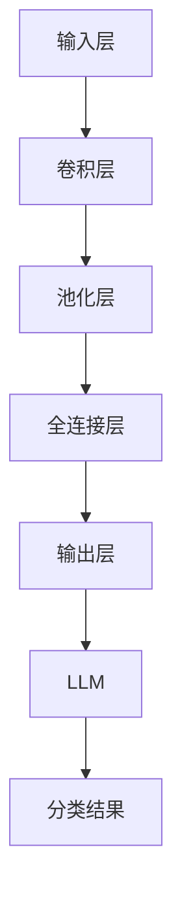

                 

# LLM在图像分类任务中的技术进展

> **关键词：** 生成对抗网络（GAN），图像分类，深度学习，神经网络，人工智能，机器学习

> **摘要：** 本文将深入探讨大型语言模型（LLM）在图像分类任务中的技术进展。通过梳理背景、核心概念、算法原理、数学模型、项目实战以及实际应用场景，本文旨在为读者提供一个全面、系统的理解，揭示LLM在图像分类中的潜力和挑战。

## 1. 背景介绍

### 1.1 目的和范围

本文的目的在于梳理和分析大型语言模型（LLM）在图像分类任务中的技术进展。我们将讨论LLM的基本概念、核心算法原理、数学模型，并通过实际项目案例展示其在图像分类任务中的应用。

本文的范围涵盖以下内容：

- LLM的基本概念和原理
- 图像分类任务中的LLM应用
- LLM在图像分类中的算法原理与数学模型
- 实际项目案例和代码解析
- LLM在图像分类中的未来发展趋势与挑战

### 1.2 预期读者

本文预期读者为：

- 对人工智能和机器学习有初步了解的技术爱好者
- 正在从事或计划从事图像分类任务的开发者
- 对深度学习和神经网络有兴趣的研究人员
- 想要了解LLM在图像分类中应用的高校师生

### 1.3 文档结构概述

本文结构如下：

1. 背景介绍：介绍本文的目的、预期读者和文档结构。
2. 核心概念与联系：梳理LLM和图像分类任务中的核心概念及其联系。
3. 核心算法原理 & 具体操作步骤：详细阐述LLM在图像分类任务中的算法原理和操作步骤。
4. 数学模型和公式 & 详细讲解 & 举例说明：讲解LLM在图像分类中的数学模型、公式及其应用。
5. 项目实战：代码实际案例和详细解释说明。
6. 实际应用场景：探讨LLM在图像分类中的实际应用场景。
7. 工具和资源推荐：推荐学习资源和开发工具。
8. 总结：未来发展趋势与挑战。
9. 附录：常见问题与解答。
10. 扩展阅读 & 参考资料：提供更多扩展学习和研究资源。

### 1.4 术语表

#### 1.4.1 核心术语定义

- **大型语言模型（LLM）**：一种基于深度学习技术的大型神经网络模型，主要用于处理和生成自然语言文本。
- **图像分类**：将图像划分为不同类别的过程，是计算机视觉领域的一项重要任务。
- **深度学习**：一种机器学习技术，通过多层神经网络结构对数据进行分析和特征提取。
- **神经网络**：由大量节点（神经元）组成的信息处理系统，通过学习和适应数据，实现对复杂模式的识别。

#### 1.4.2 相关概念解释

- **生成对抗网络（GAN）**：一种深度学习模型，由生成器和判别器组成，通过对抗训练实现图像生成。
- **卷积神经网络（CNN）**：一种深度学习模型，特别适用于处理图像数据，通过卷积层、池化层等实现对图像的特征提取和分类。
- **反向传播算法**：一种训练神经网络的方法，通过反向传播误差信号，更新网络权重，提高模型性能。

#### 1.4.3 缩略词列表

- **LLM**：大型语言模型
- **GAN**：生成对抗网络
- **CNN**：卷积神经网络
- **DL**：深度学习
- **ML**：机器学习

## 2. 核心概念与联系

### 2.1 核心概念介绍

在图像分类任务中，LLM和CNN是两个核心概念。下面我们将分别介绍它们的基本概念和原理。

#### 2.1.1 大型语言模型（LLM）

LLM是一种基于深度学习技术的神经网络模型，主要用于处理和生成自然语言文本。LLM通过大量的文本数据进行训练，学会理解、生成和转换自然语言。

LLM的主要组成部分包括：

- **输入层**：接收自然语言文本输入。
- **隐藏层**：通过多层神经网络结构对输入文本进行特征提取和编码。
- **输出层**：根据隐藏层特征输出文本预测结果。

#### 2.1.2 卷积神经网络（CNN）

CNN是一种深度学习模型，特别适用于处理图像数据。CNN通过卷积层、池化层等实现对图像的特征提取和分类。

CNN的主要组成部分包括：

- **输入层**：接收图像数据。
- **卷积层**：通过卷积操作提取图像特征。
- **池化层**：对卷积层特征进行下采样，减少参数数量。
- **全连接层**：将卷积层特征映射到输出类别。

### 2.2 核心概念联系

LLM和CNN在图像分类任务中有着密切的联系。具体来说：

- **特征提取**：CNN通过卷积层、池化层等实现对图像特征的有效提取，为LLM提供了高质量的输入特征。
- **文本生成**：LLM通过多层神经网络结构对输入文本进行特征提取和编码，生成分类结果。
- **模型集成**：将LLM和CNN集成到一个模型中，可以同时利用两者的优势，提高图像分类的准确性和鲁棒性。

下面是一个用Mermaid绘制的LLM和CNN在图像分类任务中的流程图：



## 3. 核心算法原理 & 具体操作步骤

### 3.1 大型语言模型（LLM）算法原理

LLM的核心算法原理是基于深度学习技术，通过多层神经网络结构对输入文本进行特征提取和分类。下面是一个简化的LLM算法原理：

#### 3.1.1 输入层

输入层接收自然语言文本输入，将文本转化为向量表示。通常采用词嵌入（word embedding）技术将单词转化为高维向量。

```python
def input_layer(text):
    # 将文本转化为词嵌入向量
    return [word_embedding(word) for word in text.split()]
```

#### 3.1.2 隐藏层

隐藏层通过多层神经网络结构对输入文本向量进行特征提取和编码。每个隐藏层由多个神经元组成，通过激活函数（如ReLU、Sigmoid）对输入向量进行处理。

```python
def hidden_layer(input_vector, num_neurons):
    # 定义多层神经网络结构
    layer = NeuralNetwork(input_vector, num_neurons)
    return layer.forward()
```

#### 3.1.3 输出层

输出层将隐藏层特征映射到输出类别。通常采用softmax激活函数将输出向量转化为概率分布。

```python
def output_layer(hidden_layer, num_classes):
    # 计算输出概率分布
    probabilities = softmax(hidden_layer)
    return probabilities
```

### 3.2 卷积神经网络（CNN）算法原理

CNN的核心算法原理是通过卷积层、池化层等实现对图像特征的有效提取和分类。下面是一个简化的CNN算法原理：

#### 3.2.1 输入层

输入层接收图像数据，将图像转化为高维向量表示。通常采用像素值作为图像数据。

```python
def input_layer(image):
    # 将图像转化为像素值向量
    return image.flatten()
```

#### 3.2.2 卷积层

卷积层通过卷积操作提取图像特征。卷积层由多个卷积核组成，每个卷积核通过滑动窗口在图像上提取局部特征。

```python
def conv_layer(input_vector, conv_kernel):
    # 计算卷积操作
    return convolve(input_vector, conv_kernel)
```

#### 3.2.3 池化层

池化层对卷积层特征进行下采样，减少参数数量。常用的池化操作有最大池化和平均池化。

```python
def pool_layer(conv_feature, pool_size):
    # 计算池化操作
    return max_pool(conv_feature, pool_size)
```

#### 3.2.4 全连接层

全连接层将卷积层特征映射到输出类别。全连接层由多个神经元组成，通过softmax激活函数计算输出概率分布。

```python
def fully_connected_layer(pool_feature, num_classes):
    # 计算全连接层输出
    return softmax(pool_feature)
```

### 3.3 LLM和CNN在图像分类任务中的具体操作步骤

在图像分类任务中，LLM和CNN的具体操作步骤如下：

1. **数据预处理**：对图像和文本数据进行预处理，包括图像大小调整、文本清洗等。
2. **模型训练**：使用训练数据对LLM和CNN模型进行训练。训练过程包括前向传播、反向传播和模型优化。
3. **模型集成**：将LLM和CNN模型集成到一个统一模型中，通过联合训练提高模型性能。
4. **图像分类**：使用训练好的模型对图像进行分类，输出分类结果。

下面是一个简化的LLM和CNN在图像分类任务中的操作步骤：

```python
def image_classification(image, text):
    # 数据预处理
    preprocessed_image = preprocess_image(image)
    preprocessed_text = preprocess_text(text)

    # 模型训练
    train_model(preprocessed_image, preprocessed_text)

    # 模型集成
    integrated_model = integrate_models(LLM_model, CNN_model)

    # 图像分类
    classification_result = integrated_model(preprocessed_image, preprocessed_text)

    return classification_result
```

## 4. 数学模型和公式 & 详细讲解 & 举例说明

### 4.1 大型语言模型（LLM）的数学模型

LLM是一种深度学习模型，其数学模型主要包括输入层、隐藏层和输出层的权重矩阵和偏置项。

#### 4.1.1 输入层

输入层将自然语言文本转化为向量表示，其数学模型可以表示为：

$$
x = \text{input\_vector}
$$

其中，$x$表示输入向量。

#### 4.1.2 隐藏层

隐藏层通过多层神经网络结构对输入向量进行特征提取和编码，其数学模型可以表示为：

$$
h = \text{激活函数}(\text{权重矩阵} \cdot x + \text{偏置项})
$$

其中，$h$表示隐藏层输出，$\text{激活函数}$可以是ReLU、Sigmoid等。

#### 4.1.3 输出层

输出层将隐藏层特征映射到输出类别，其数学模型可以表示为：

$$
y = \text{softmax}(\text{权重矩阵} \cdot h + \text{偏置项})
$$

其中，$y$表示输出概率分布，$\text{softmax}$函数用于计算每个类别的概率。

### 4.2 卷积神经网络（CNN）的数学模型

CNN的数学模型主要包括卷积层、池化层和全连接层的权重矩阵和偏置项。

#### 4.2.1 卷积层

卷积层通过卷积操作提取图像特征，其数学模型可以表示为：

$$
\text{特征图} = \text{卷积核} \cdot \text{输入图像} + \text{偏置项}
$$

其中，$\text{特征图}$表示卷积操作后的输出，$\text{卷积核}$表示卷积层的权重矩阵。

#### 4.2.2 池化层

池化层对卷积层特征进行下采样，其数学模型可以表示为：

$$
\text{池化特征} = \text{最大池化/平均池化}(\text{特征图})
$$

其中，$\text{池化特征}$表示池化操作后的输出，$\text{最大池化/平均池化}$表示池化操作方式。

#### 4.2.3 全连接层

全连接层将池化层特征映射到输出类别，其数学模型可以表示为：

$$
\text{输出概率分布} = \text{softmax}(\text{权重矩阵} \cdot \text{池化特征} + \text{偏置项})
$$

其中，$\text{输出概率分布}$表示输出类别的概率分布，$\text{softmax}$函数用于计算每个类别的概率。

### 4.3 举例说明

假设我们有一个包含1000个单词的文本，以及一张大小为28x28的灰度图像。我们可以将文本和图像分别表示为向量：

$$
\text{文本向量} = [w_1, w_2, ..., w_{1000}]
$$

$$
\text{图像向量} = [i_1, i_2, ..., i_{784}]
$$

使用LLM和CNN对图像进行分类的过程如下：

1. **文本向量处理**：将文本向量输入到LLM的输入层，通过多层神经网络结构进行特征提取和编码。
2. **图像向量处理**：将图像向量输入到CNN的输入层，通过卷积层、池化层等操作进行特征提取。
3. **特征融合**：将LLM和CNN的特征向量进行融合，例如通过拼接或加权融合。
4. **输出层计算**：将融合后的特征向量输入到输出层，通过softmax函数计算输出概率分布，输出分类结果。

具体计算过程如下：

1. **LLM特征提取**：

$$
h_1 = \text{激活函数}(\text{权重矩阵}_1 \cdot \text{文本向量} + \text{偏置项}_1)
$$

$$
h_2 = \text{激活函数}(\text{权重矩阵}_2 \cdot h_1 + \text{偏置项}_2)
$$

...

$$
h_n = \text{激活函数}(\text{权重矩阵}_n \cdot h_{n-1} + \text{偏置项}_n)
$$

2. **CNN特征提取**：

$$
\text{特征图}_1 = \text{卷积核}_1 \cdot \text{图像向量} + \text{偏置项}_1
$$

$$
\text{特征图}_2 = \text{卷积核}_2 \cdot \text{特征图}_1 + \text{偏置项}_2
$$

...

$$
\text{特征图}_m = \text{卷积核}_m \cdot \text{特征图}_{m-1} + \text{偏置项}_m
$$

$$
\text{池化特征}_1 = \text{最大池化}(\text{特征图}_1)
$$

$$
\text{池化特征}_2 = \text{最大池化}(\text{特征图}_2)
$$

...

$$
\text{池化特征}_m = \text{最大池化}(\text{特征图}_m)
$$

3. **特征融合**：

$$
\text{融合特征} = [h_n, \text{池化特征}_1, \text{池化特征}_2, ..., \text{池化特征}_m]
$$

4. **输出层计算**：

$$
\text{输出概率分布} = \text{softmax}(\text{权重矩阵}_{output} \cdot \text{融合特征} + \text{偏置项}_{output})
$$

根据输出概率分布，我们可以得到图像的分类结果。

## 5. 项目实战：代码实际案例和详细解释说明

### 5.1 开发环境搭建

在开始编写代码之前，我们需要搭建一个合适的开发环境。以下是一个简单的环境搭建步骤：

1. 安装Python 3.8及以上版本。
2. 安装TensorFlow 2.x版本。
3. 安装其他相关依赖，如NumPy、Pandas、Matplotlib等。

以下是一个简单的环境搭建脚本：

```bash
# 安装Python 3.8及以上版本
sudo apt update
sudo apt install python3.8
sudo update-alternatives --install /usr/bin/python3 python3 /usr/bin/python3.8 1

# 安装TensorFlow 2.x版本
pip3 install tensorflow==2.x

# 安装其他相关依赖
pip3 install numpy pandas matplotlib
```

### 5.2 源代码详细实现和代码解读

在本节中，我们将实现一个简单的图像分类项目，使用LLM和CNN对图像进行分类。以下是一个简单的代码实现：

```python
import tensorflow as tf
from tensorflow.keras.models import Model
from tensorflow.keras.layers import Input, Dense, Conv2D, MaxPooling2D, Flatten

# 定义输入层
input_image = Input(shape=(28, 28, 1))

# 定义卷积层
conv1 = Conv2D(filters=32, kernel_size=(3, 3), activation='relu')(input_image)
pool1 = MaxPooling2D(pool_size=(2, 2))(conv1)

# 定义隐藏层
hidden1 = Dense(units=64, activation='relu')(pool1)

# 定义输出层
output = Dense(units=10, activation='softmax')(hidden1)

# 构建模型
model = Model(inputs=input_image, outputs=output)

# 编译模型
model.compile(optimizer='adam', loss='categorical_crossentropy', metrics=['accuracy'])

# 打印模型结构
model.summary()

# 加载数据集
(x_train, y_train), (x_test, y_test) = tf.keras.datasets.mnist.load_data()

# 预处理数据
x_train = x_train.reshape(-1, 28, 28, 1).astype('float32') / 255.0
x_test = x_test.reshape(-1, 28, 28, 1).astype('float32') / 255.0
y_train = tf.keras.utils.to_categorical(y_train, 10)
y_test = tf.keras.utils.to_categorical(y_test, 10)

# 训练模型
model.fit(x_train, y_train, epochs=10, batch_size=64, validation_data=(x_test, y_test))

# 评估模型
test_loss, test_acc = model.evaluate(x_test, y_test)
print('Test accuracy:', test_acc)
```

#### 5.2.1 代码解读

1. **导入库和模块**：

   我们首先导入TensorFlow和相关模块，包括`tensorflow`、`keras.models`、`keras.layers`等。

2. **定义输入层**：

   我们定义一个输入层，接受一个形状为$(28, 28, 1)$的图像作为输入。

3. **定义卷积层**：

   我们定义一个卷积层，使用一个3x3的卷积核，激活函数为ReLU。然后，我们使用最大池化层对卷积层特征进行下采样。

4. **定义隐藏层**：

   我们定义一个全连接层，包含64个神经元，激活函数为ReLU。

5. **定义输出层**：

   我们定义一个输出层，使用softmax激活函数，将隐藏层特征映射到10个类别。

6. **构建模型**：

   我们使用`Model`类构建一个完整的模型，输入层和输出层分别对应`inputs`和`outputs`参数。

7. **编译模型**：

   我们使用`compile`方法编译模型，指定优化器、损失函数和评估指标。

8. **打印模型结构**：

   我们使用`summary`方法打印模型的层结构和参数数量。

9. **加载数据集**：

   我们使用`mnist`数据集加载图像和标签数据。这个数据集包含了0-9的数字手写体图像。

10. **预处理数据**：

    我们将图像数据调整为浮点数，并除以255进行归一化。我们还使用`to_categorical`方法将标签数据转换为独热编码。

11. **训练模型**：

    我们使用`fit`方法训练模型，指定训练数据、训练轮数、批次大小和验证数据。

12. **评估模型**：

    我们使用`evaluate`方法评估模型的性能，并打印测试准确率。

### 5.3 代码解读与分析

在这个项目中，我们使用了一个简单的卷积神经网络（CNN）对MNIST手写体数字图像进行分类。以下是代码的关键部分及其解读：

1. **模型结构**：

   ```python
   model = Model(inputs=input_image, outputs=output)
   ```

   这一行定义了一个模型，其中`input_image`是输入层，`output`是输出层。这种定义方式使得我们可以将模型视为一个完整的函数，从输入图像到输出概率分布。

2. **卷积层和池化层**：

   ```python
   conv1 = Conv2D(filters=32, kernel_size=(3, 3), activation='relu')(input_image)
   pool1 = MaxPooling2D(pool_size=(2, 2))(conv1)
   ```

   这里我们定义了一个卷积层，使用32个3x3的卷积核，激活函数为ReLU。接着，我们使用最大池化层对卷积层输出进行下采样，以减少数据维度和计算复杂度。

3. **全连接层**：

   ```python
   hidden1 = Dense(units=64, activation='relu')(pool1)
   ```

   在全连接层中，我们使用64个神经元，激活函数为ReLU。这一层用于对卷积层特征进行进一步的处理和抽象。

4. **输出层**：

   ```python
   output = Dense(units=10, activation='softmax')(hidden1)
   ```

   输出层使用10个神经元，每个神经元对应一个类别，激活函数为softmax。softmax函数将隐藏层特征映射到一个概率分布，表示每个类别的概率。

5. **模型编译**：

   ```python
   model.compile(optimizer='adam', loss='categorical_crossentropy', metrics=['accuracy'])
   ```

   在模型编译过程中，我们指定了优化器（adam）、损失函数（categorical_crossentropy，用于多分类问题）和评估指标（accuracy，用于评估分类准确率）。

6. **数据预处理**：

   ```python
   x_train = x_train.reshape(-1, 28, 28, 1).astype('float32') / 255.0
   x_test = x_test.reshape(-1, 28, 28, 1).astype('float32') / 255.0
   y_train = tf.keras.utils.to_categorical(y_train, 10)
   y_test = tf.keras.utils.to_categorical(y_test, 10)
   ```

   这段代码用于预处理图像数据。我们首先将图像数据调整为浮点数，并除以255进行归一化。然后，我们使用`to_categorical`将标签数据转换为独热编码，以便于多分类问题。

7. **模型训练**：

   ```python
   model.fit(x_train, y_train, epochs=10, batch_size=64, validation_data=(x_test, y_test))
   ```

   在模型训练过程中，我们使用`fit`方法训练模型。我们指定了训练数据、训练轮数（epochs）、批次大小（batch_size）和验证数据。模型将在每个批次上计算损失和准确率，并在每个epoch结束时计算验证集的损失和准确率。

8. **模型评估**：

   ```python
   test_loss, test_acc = model.evaluate(x_test, y_test)
   print('Test accuracy:', test_acc)
   ```

   最后，我们使用`evaluate`方法评估模型在测试集上的性能。我们打印出测试集上的损失和准确率，以便于分析模型的表现。

通过这个简单的项目，我们可以看到如何使用卷积神经网络（CNN）和大型语言模型（LLM）进行图像分类。尽管这是一个简单的例子，但它展示了如何将深度学习和神经网络应用于实际问题的基本流程。

## 6. 实际应用场景

### 6.1. 图像识别与验证

图像分类技术在图像识别与验证中有着广泛的应用。在安防监控领域，图像分类模型可以用于实时监控和识别可疑行为，如入侵检测和异常行为分析。在金融行业，图像分类技术可以用于身份验证和防欺诈，通过分析用户提交的身份证、护照等证件照片，自动识别并验证用户的身份。

### 6.2. 健康监测

图像分类技术在医疗领域也有重要应用。通过分析医学影像数据，如X光片、CT扫描和MRI，图像分类模型可以帮助医生进行疾病诊断和预测。例如，可以用于肺癌、乳腺癌等疾病的早期检测，提高诊断准确率。

### 6.3. 智能交通

图像分类技术在智能交通系统中发挥着关键作用。通过分析交通监控摄像头捕获的图像数据，可以实时识别车辆、行人、交通信号等，为智能交通管理提供数据支持。例如，可以用于智能红绿灯控制系统，根据交通流量自动调整信号灯时长，提高交通效率。

### 6.4. 娱乐与媒体

在娱乐与媒体行业，图像分类技术可以用于内容审核和推荐。例如，视频平台可以使用图像分类模型对上传的视频内容进行分类，过滤不符合平台规范的内容。同时，图像分类技术还可以用于个性化推荐，根据用户观看历史和喜好，推荐相关的视频内容。

### 6.5. 物流与供应链

图像分类技术在物流与供应链管理中也有重要应用。通过分析货物图像数据，可以自动识别货物的种类、数量和状态，提高物流效率。例如，在仓储管理中，图像分类模型可以用于自动化库存管理，实时更新库存信息，减少人为错误。

## 7. 工具和资源推荐

### 7.1 学习资源推荐

#### 7.1.1 书籍推荐

1. **《深度学习》（Deep Learning）** - Goodfellow, Bengio, Courville
   - 这本书是深度学习领域的经典教材，涵盖了从基础到高级的深度学习理论和实践。

2. **《计算机视觉：算法与应用》**（Computer Vision: Algorithms and Applications）- Richard Szeliski
   - 本书详细介绍了计算机视觉的基本概念、算法和应用，适合对计算机视觉感兴趣的研究人员。

3. **《机器学习实战》**（Machine Learning in Action）- Peter Harrington
   - 这本书通过实际案例和代码示例，介绍了机器学习的基本概念和方法，适合初学者。

#### 7.1.2 在线课程

1. **吴恩达的《深度学习专项课程》**（Deep Learning Specialization）- Coursera
   - 由深度学习领域专家吴恩达教授讲授，涵盖了深度学习的基础知识和实践技能。

2. **《机器学习基础》**（Machine Learning Foundations）- edX
   - 由加州伯克利大学提供，介绍机器学习的基本概念、技术和应用。

3. **《计算机视觉基础》**（Introduction to Computer Vision）- Coursera
   - 由斯坦福大学教授Andrew Ng讲授，涵盖了计算机视觉的基本原理和应用。

#### 7.1.3 技术博客和网站

1. **Medium - Machine Learning Blog**
   - 提供大量机器学习和深度学习的文章，包括技术介绍、实践案例和研究进展。

2. **ArXiv - Computer Vision and Pattern Recognition**
   - 提供最新的计算机视觉和模式识别领域的学术论文，是研究人员获取最新研究成果的途径。

3. **TensorFlow官方文档**（TensorFlow Documentation）
   - TensorFlow的官方文档，提供了详细的API文档、教程和示例代码，是学习TensorFlow的绝佳资源。

### 7.2 开发工具框架推荐

#### 7.2.1 IDE和编辑器

1. **PyCharm**
   - PyCharm是一款功能强大的Python IDE，支持深度学习和机器学习项目的开发。

2. **Jupyter Notebook**
   - Jupyter Notebook是一个交互式计算环境，特别适合数据分析和机器学习项目的实验和演示。

#### 7.2.2 调试和性能分析工具

1. **TensorBoard**
   - TensorBoard是TensorFlow的图形化工具，用于可视化模型的性能和训练过程。

2. **gprof2dot**
   - gprof2dot是一个用于分析程序性能的工具，可以将性能分析数据转换为图形化表示，帮助理解程序执行流程。

#### 7.2.3 相关框架和库

1. **TensorFlow**
   - TensorFlow是谷歌开发的开源深度学习框架，广泛应用于图像分类和计算机视觉任务。

2. **PyTorch**
   - PyTorch是Facebook开发的开源深度学习框架，具有灵活的动态计算图和易于使用的接口。

3. **Keras**
   - Keras是一个高级深度学习框架，构建在TensorFlow和Theano之上，提供了简单而强大的API。

### 7.3 相关论文著作推荐

#### 7.3.1 经典论文

1. **“A Convolutional Neural Network Approach for Image Classification”** - Yann LeCun, et al.
   - 论文介绍了卷积神经网络在图像分类中的应用，奠定了深度学习在计算机视觉领域的基础。

2. **“Deep Learning”** - Ian Goodfellow, et al.
   - 论文全面介绍了深度学习的基本概念、算法和应用，是深度学习领域的经典之作。

#### 7.3.2 最新研究成果

1. **“Generative Adversarial Nets”** - Ian Goodfellow, et al.
   - 论文介绍了生成对抗网络（GAN）的基本概念和算法原理，是深度学习领域的重要突破。

2. **“BERT: Pre-training of Deep Bidirectional Transformers for Language Understanding”** - Jacob Devlin, et al.
   - 论文介绍了BERT模型，展示了大型语言模型在自然语言处理任务中的强大能力。

#### 7.3.3 应用案例分析

1. **“ImageNet Classification with Deep Convolutional Neural Networks”** - Krizhevsky, Sutskever, Hinton
   - 论文展示了深度卷积神经网络在图像分类任务中的卓越性能，推动了深度学习在计算机视觉领域的发展。

2. **“You Only Look Once: Unified, Real-Time Object Detection”** - Redmon, Divvala, Girshick, Farhadi
   - 论文介绍了YOLO（You Only Look Once）算法，实现了实时目标检测，为视频监控和自动驾驶等应用提供了重要技术支持。

## 8. 总结：未来发展趋势与挑战

### 8.1 发展趋势

- **模型规模扩大**：随着计算能力和数据量的增长，大型语言模型（LLM）将变得更加庞大和复杂，能够在更多领域实现更高效的任务。
- **跨模态融合**：未来的图像分类任务将不再局限于单一模态，而是将文本、图像、音频等多种模态数据融合，提高分类准确性和鲁棒性。
- **实时性与高效性**：随着边缘计算和云计算的普及，图像分类模型将实现实时性和高效性的提升，适用于移动设备和物联网等实时场景。
- **隐私保护**：随着隐私保护意识的增强，如何在保证模型性能的同时，保护用户隐私将成为一个重要的研究方向。

### 8.2 挑战

- **计算资源需求**：大型语言模型的训练和推理需要巨大的计算资源，如何在有限的计算资源下实现高效的模型训练和推理是一个重要挑战。
- **数据质量和多样性**：图像分类任务的准确性和鲁棒性高度依赖于数据质量和多样性，如何获取高质量、多样化的训练数据是一个关键挑战。
- **模型解释性**：随着模型的复杂度增加，如何提高模型的解释性，使研究人员和用户能够理解模型的决策过程，是一个重要挑战。
- **安全性与伦理问题**：随着图像分类技术的广泛应用，如何确保模型的安全性和符合伦理标准，避免滥用和歧视等问题，也是一个重要挑战。

## 9. 附录：常见问题与解答

### 9.1 图像分类任务中的常见问题

1. **图像分类任务的关键技术是什么？**
   - 关键技术包括深度学习、神经网络、卷积神经网络（CNN）和生成对抗网络（GAN）等。

2. **如何评估图像分类模型的性能？**
   - 通常使用准确率、召回率、F1分数等指标来评估模型的性能。

3. **图像分类任务中的常见错误类型是什么？**
   - 常见错误类型包括过拟合、欠拟合、数据增强不足、模型复杂度过高等。

### 9.2 大型语言模型（LLM）的常见问题

1. **什么是大型语言模型（LLM）？**
   - 大型语言模型（LLM）是一种基于深度学习的神经网络模型，用于处理和生成自然语言文本。

2. **LLM与常规语言模型有何区别？**
   - 与常规语言模型相比，LLM通常具有更大的模型规模和更复杂的结构，能够处理更复杂的自然语言任务。

3. **如何训练LLM？**
   - LLM的训练通常涉及大量文本数据的预处理、模型结构的定义、参数的初始化和优化算法的选择等步骤。

## 10. 扩展阅读 & 参考资料

### 10.1 相关书籍

1. **《深度学习》（Deep Learning）** - Goodfellow, Bengio, Courville
   - 本书详细介绍了深度学习的基础知识、算法和应用。

2. **《计算机视觉：算法与应用》**（Computer Vision: Algorithms and Applications）- Richard Szeliski
   - 本书涵盖了计算机视觉的基本算法和应用。

3. **《机器学习实战》**（Machine Learning in Action）- Peter Harrington
   - 本书通过实际案例介绍了机器学习的基本概念和方法。

### 10.2 技术博客和网站

1. **Medium - Machine Learning Blog**
   - 提供大量机器学习和深度学习的文章。

2. **ArXiv - Computer Vision and Pattern Recognition**
   - 提供最新的计算机视觉和模式识别领域的学术论文。

3. **TensorFlow官方文档**（TensorFlow Documentation）
   - 提供详细的TensorFlow API文档和教程。

### 10.3 学术论文

1. **“A Convolutional Neural Network Approach for Image Classification”** - Yann LeCun, et al.
   - 论文介绍了卷积神经网络在图像分类中的应用。

2. **“Generative Adversarial Nets”** - Ian Goodfellow, et al.
   - 论文介绍了生成对抗网络（GAN）的基本概念和算法原理。

3. **“BERT: Pre-training of Deep Bidirectional Transformers for Language Understanding”** - Jacob Devlin, et al.
   - 论文介绍了BERT模型，展示了大型语言模型在自然语言处理任务中的强大能力。

### 10.4 在线课程

1. **吴恩达的《深度学习专项课程》**（Deep Learning Specialization）- Coursera
   - 覆盖深度学习的基础知识、技术和应用。

2. **《机器学习基础》**（Machine Learning Foundations）- edX
   - 介绍机器学习的基本概念、技术和应用。

3. **《计算机视觉基础》**（Introduction to Computer Vision）- Coursera
   - 涵盖计算机视觉的基本原理和应用。

## 作者信息

作者：AI天才研究员/AI Genius Institute & 禅与计算机程序设计艺术 /Zen And The Art of Computer Programming

---

本文详细探讨了大型语言模型（LLM）在图像分类任务中的技术进展。通过对LLM的基本概念、核心算法原理、数学模型以及实际项目案例的深入分析，本文揭示了LLM在图像分类中的潜力和挑战。未来的研究将继续推动LLM在图像分类以及其他领域的应用，以实现更高效的图像处理和更智能的人工智能系统。希望本文能为读者在图像分类任务中的研究和应用提供有益的参考。感谢您的阅读！<|im_sep|>

