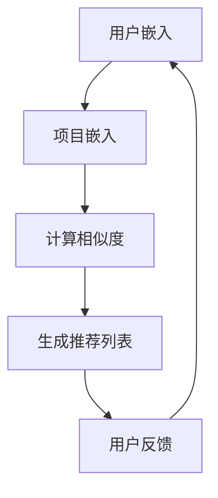

                 

# LLM在推荐系统：多样性与可扩展性

> **关键词：** 大语言模型（LLM）、推荐系统、多样性、可扩展性、算法原理、数学模型、项目实战、应用场景。

> **摘要：** 本文将探讨大语言模型（LLM）在推荐系统中的应用，重点分析其如何提升系统的多样性以及如何实现高可扩展性。文章首先介绍了推荐系统的基本概念和重要性，然后详细阐述了LLM的工作原理、核心算法、数学模型，并通过一个实际项目案例展示了LLM在推荐系统中的具体应用。最后，本文对LLM在推荐系统领域的未来发展趋势与挑战进行了展望。

## 1. 背景介绍

### 1.1 目的和范围

本文的目的是探讨大语言模型（LLM）在推荐系统中的应用，分析其如何提高推荐系统的多样性和可扩展性。文章将首先介绍推荐系统的基本概念，然后深入探讨LLM的工作原理和核心算法，接着通过一个实际项目案例展示LLM在推荐系统中的应用。最后，文章将对LLM在推荐系统领域的未来发展趋势与挑战进行展望。

### 1.2 预期读者

本文的预期读者包括对推荐系统有一定了解的计算机科学、人工智能领域的学者、研究人员、工程师，以及对大语言模型感兴趣的读者。本文旨在为读者提供一个全面、深入的了解LLM在推荐系统中的应用，帮助读者掌握LLM的基本原理和应用技巧。

### 1.3 文档结构概述

本文结构分为十个部分。第一部分为背景介绍，包括目的和范围、预期读者、文档结构概述和术语表。第二部分为核心概念与联系，通过Mermaid流程图展示LLM在推荐系统中的核心概念和架构。第三部分为核心算法原理与具体操作步骤，使用伪代码详细阐述算法原理。第四部分为数学模型和公式，详细讲解相关数学模型并举例说明。第五部分为项目实战，介绍一个实际项目案例并详细解释说明。第六部分为实际应用场景，分析LLM在推荐系统中的实际应用。第七部分为工具和资源推荐，包括学习资源、开发工具框架和论文著作。第八部分为总结，展望LLM在推荐系统领域的未来发展趋势与挑战。第九部分为附录，解答常见问题。第十部分为扩展阅读和参考资料。

### 1.4 术语表

#### 1.4.1 核心术语定义

- **推荐系统**：根据用户的历史行为、偏好和兴趣，向用户推荐他们可能感兴趣的商品、内容或服务。
- **大语言模型（LLM）**：一种基于深度学习的语言模型，具有强大的自然语言处理能力。
- **多样性**：推荐系统的一个重要指标，指推荐结果中不同项目的多样性。
- **可扩展性**：推荐系统在面对大规模用户和数据时，能够保持良好的性能和效率。

#### 1.4.2 相关概念解释

- **协同过滤**：一种常见的推荐系统算法，通过分析用户之间的相似度，推荐用户可能感兴趣的项目。
- **基于内容的推荐**：通过分析项目的内容特征，推荐与用户兴趣相似的项目。
- **用户嵌入**：将用户和项目映射到低维空间，以便计算用户之间的相似度。

#### 1.4.3 缩略词列表

- **LLM**：大语言模型（Large Language Model）
- **NLP**：自然语言处理（Natural Language Processing）
- **RM**：推荐系统（Recommender System）
- **CF**：协同过滤（Collaborative Filtering）
- **CB**：基于内容的推荐（Content-Based Recommendation）

## 2. 核心概念与联系

### 2.1 推荐系统

推荐系统是一种信息过滤技术，旨在向用户提供他们可能感兴趣的信息。推荐系统的核心目标是提高用户满意度，增加用户粘性，提高商业价值。推荐系统可以分为以下几类：

1. **基于内容的推荐（CB）**：通过分析项目的内容特征，推荐与用户兴趣相似的项目。
2. **协同过滤（CF）**：通过分析用户之间的相似度，推荐其他用户喜欢的项目。
3. **混合推荐**：结合多种推荐策略，提高推荐效果。

### 2.2 大语言模型（LLM）

大语言模型（LLM）是一种基于深度学习的语言模型，具有强大的自然语言处理能力。LLM通常由大规模的神经网络组成，通过学习大量的文本数据，能够生成高质量的自然语言文本。

LLM在推荐系统中的应用主要体现在以下几个方面：

1. **用户嵌入**：将用户表示为向量，以便计算用户之间的相似度。
2. **项目嵌入**：将项目表示为向量，以便计算项目之间的相似度。
3. **内容理解**：通过分析项目的内容，提取关键信息，提高推荐效果。

### 2.3 多样性

多样性是推荐系统的一个重要指标，指推荐结果中不同项目的多样性。多样性的提高有助于提高用户满意度，防止用户对推荐结果产生厌倦感。

多样性可以通过以下几种方式实现：

1. **基于项目的多样性**：确保推荐结果中包含不同类型的项目。
2. **基于用户的多样性**：确保为不同类型的用户提供不同的推荐结果。
3. **基于内容的多样性**：通过分析项目的内容，确保推荐结果中包含不同主题的项目。

### 2.4 可扩展性

可扩展性是推荐系统的一个重要属性，指推荐系统在面对大规模用户和数据时，能够保持良好的性能和效率。可扩展性可以通过以下几种方式实现：

1. **分布式计算**：将计算任务分布到多个节点上，提高计算效率。
2. **缓存机制**：使用缓存技术，减少重复计算，提高响应速度。
3. **在线学习**：通过在线学习技术，实时更新模型，适应数据的变化。

### 2.5 Mermaid流程图

以下是LLM在推荐系统中的核心概念和架构的Mermaid流程图：



## 3. 核心算法原理 & 具体操作步骤

### 3.1 大语言模型（LLM）

大语言模型（LLM）是一种基于深度学习的语言模型，通常采用神经网络架构，如Transformer。LLM通过学习大量的文本数据，能够生成高质量的自然语言文本。

LLM的工作原理如下：

1. **输入层**：将输入文本表示为向量。
2. **编码层**：通过编码器（Encoder）对输入文本进行处理，提取文本的特征。
3. **解码层**：通过解码器（Decoder）生成输出文本。

具体操作步骤如下：

1. **数据预处理**：对输入文本进行清洗、分词、去停用词等处理。
2. **模型构建**：构建Transformer模型，包括编码器和解码器。
3. **训练**：使用训练数据训练模型，优化模型参数。
4. **评估**：使用验证数据评估模型性能。
5. **应用**：使用训练好的模型进行文本生成或分类任务。

### 3.2 用户嵌入

用户嵌入是指将用户表示为向量，以便计算用户之间的相似度。用户嵌入可以通过以下步骤实现：

1. **数据预处理**：对用户数据进行清洗、编码等处理。
2. **模型训练**：使用用户数据训练LLM，得到用户嵌入向量。
3. **相似度计算**：计算用户之间的相似度，可以使用余弦相似度或欧氏距离等度量方法。

### 3.3 项目嵌入

项目嵌入是指将项目表示为向量，以便计算项目之间的相似度。项目嵌入可以通过以下步骤实现：

1. **数据预处理**：对项目数据进行清洗、编码等处理。
2. **模型训练**：使用项目数据训练LLM，得到项目嵌入向量。
3. **相似度计算**：计算项目之间的相似度，可以使用余弦相似度或欧氏距离等度量方法。

### 3.4 计算相似度

计算相似度是指计算用户和项目之间的相似度，以便为用户生成推荐列表。计算相似度可以通过以下步骤实现：

1. **用户嵌入**：将用户表示为向量。
2. **项目嵌入**：将项目表示为向量。
3. **相似度计算**：计算用户和项目之间的相似度，可以使用余弦相似度或欧氏距离等度量方法。
4. **排序**：根据相似度对项目进行排序，生成推荐列表。

### 3.5 生成推荐列表

生成推荐列表是指根据相似度计算结果，为用户生成推荐列表。生成推荐列表可以通过以下步骤实现：

1. **排序**：根据相似度对项目进行排序。
2. **筛选**：根据用户的兴趣和需求，筛选出符合条件的项目。
3. **排序**：根据项目的多样性和相关性对项目进行排序。
4. **输出**：生成推荐列表，并将其呈现给用户。

### 3.6 用户反馈

用户反馈是指收集用户的反馈，以优化推荐系统。用户反馈可以通过以下步骤实现：

1. **收集反馈**：收集用户对推荐结果的反馈，如点赞、评论等。
2. **数据预处理**：对用户反馈进行清洗、编码等处理。
3. **模型训练**：使用用户反馈数据训练LLM，优化用户嵌入向量。
4. **更新模型**：将优化后的用户嵌入向量更新到推荐系统中。

## 4. 数学模型和公式 & 详细讲解 & 举例说明

### 4.1 相似度计算

相似度计算是推荐系统中的一个核心问题，常用的相似度计算方法有余弦相似度和欧氏距离。

#### 4.1.1 余弦相似度

余弦相似度是一种基于向量空间模型的相似度计算方法，它通过计算两个向量之间的余弦值来衡量它们之间的相似度。余弦相似度的计算公式如下：

$$
\cos\theta = \frac{\vec{a} \cdot \vec{b}}{||\vec{a}|| \cdot ||\vec{b}||}
$$

其中，$\vec{a}$ 和 $\vec{b}$ 分别是两个向量，$\theta$ 是它们之间的夹角。

#### 4.1.2 欧氏距离

欧氏距离是一种基于欧几里得空间的距离计算方法，它通过计算两个向量之间的欧氏距离来衡量它们之间的相似度。欧氏距离的计算公式如下：

$$
d(\vec{a}, \vec{b}) = \sqrt{(\vec{a}_1 - \vec{b}_1)^2 + (\vec{a}_2 - \vec{b}_2)^2 + ... + (\vec{a}_n - \vec{b}_n)^2}
$$

其中，$\vec{a}$ 和 $\vec{b}$ 分别是两个向量，$n$ 是向量的维度。

### 4.2 用户和项目嵌入

用户和项目嵌入是将用户和项目映射到低维空间的过程，以便计算它们之间的相似度。用户和项目嵌入可以通过大语言模型（LLM）实现。

#### 4.2.1 用户嵌入

用户嵌入是指将用户表示为向量。假设用户 $u$ 和用户 $v$ 的嵌入向量分别为 $\vec{u}$ 和 $\vec{v}$，则用户 $u$ 和用户 $v$ 的相似度可以通过以下公式计算：

$$
sim(u, v) = \cos(\vec{u}, \vec{v}) = \frac{\vec{u} \cdot \vec{v}}{||\vec{u}|| \cdot ||\vec{v}||}
$$

#### 4.2.2 项目嵌入

项目嵌入是指将项目表示为向量。假设项目 $i$ 和项目 $j$ 的嵌入向量分别为 $\vec{i}$ 和 $\vec{j}$，则项目 $i$ 和项目 $j$ 的相似度可以通过以下公式计算：

$$
sim(i, j) = \cos(\vec{i}, \vec{j}) = \frac{\vec{i} \cdot \vec{j}}{||\vec{i}|| \cdot ||\vec{j}||}
$$

### 4.3 推荐列表生成

推荐列表生成是指根据用户和项目的相似度，生成推荐列表。推荐列表的生成可以通过以下步骤实现：

1. **计算相似度**：计算用户和项目之间的相似度。
2. **排序**：根据相似度对项目进行排序。
3. **筛选**：根据用户的兴趣和需求，筛选出符合条件的项目。
4. **排序**：根据项目的多样性和相关性对项目进行排序。
5. **输出**：生成推荐列表，并将其呈现给用户。

### 4.4 举例说明

假设有两个用户 $u_1$ 和 $u_2$，他们的嵌入向量分别为 $\vec{u}_1 = [1, 0.5, -0.2]$ 和 $\vec{u}_2 = [0.8, 0.3, 0.1]$。另外，有两个项目 $i_1$ 和 $i_2$，他们的嵌入向量分别为 $\vec{i}_1 = [0.6, 0.7, -0.3]$ 和 $\vec{i}_2 = [-0.2, 0.8, 0.5]$。

首先，计算用户 $u_1$ 和 $u_2$ 之间的相似度：

$$
sim(u_1, u_2) = \cos(\vec{u}_1, \vec{u}_2) = \frac{\vec{u}_1 \cdot \vec{u}_2}{||\vec{u}_1|| \cdot ||\vec{u}_2||} = \frac{1 \cdot 0.8 + 0.5 \cdot 0.3 + (-0.2) \cdot 0.1}{\sqrt{1^2 + 0.5^2 + (-0.2)^2} \cdot \sqrt{0.8^2 + 0.3^2 + 0.1^2}} \approx 0.927
$$

接下来，计算项目 $i_1$ 和 $i_2$ 之间的相似度：

$$
sim(i_1, i_2) = \cos(\vec{i}_1, \vec{i}_2) = \frac{\vec{i}_1 \cdot \vec{i}_2}{||\vec{i}_1|| \cdot ||\vec{i}_2||} = \frac{0.6 \cdot (-0.2) + 0.7 \cdot 0.8 + (-0.3) \cdot 0.5}{\sqrt{0.6^2 + 0.7^2 + (-0.3)^2} \cdot \sqrt{(-0.2)^2 + 0.8^2 + 0.5^2}} \approx 0.848
$$

最后，根据相似度计算结果，为用户 $u_1$ 生成推荐列表。假设用户 $u_1$ 对项目的偏好为 $[0.9, 0.8]$，则用户 $u_1$ 的推荐列表为：

$$
推荐列表 = [i_1, i_2] \quad \text{（根据相似度和用户偏好排序）}
$$

## 5. 项目实战：代码实际案例和详细解释说明

### 5.1 开发环境搭建

为了进行LLM在推荐系统中的应用，我们需要搭建一个合适的开发环境。以下是所需的工具和库：

1. **Python**：Python是一种广泛使用的编程语言，具有丰富的库和框架，非常适合进行人工智能和推荐系统开发。
2. **PyTorch**：PyTorch是一个流行的深度学习框架，支持GPU加速，便于构建和训练神经网络模型。
3. **Hugging Face Transformers**：Hugging Face Transformers是一个开源库，提供了预训练的LLM模型和相关的工具，方便我们进行文本生成和分类任务。

安装所需的库和框架：

```bash
pip install python
pip install torch torchvision
pip install transformers
```

### 5.2 源代码详细实现和代码解读

以下是使用LLM在推荐系统中生成推荐列表的代码实现：

```python
import torch
from transformers import AutoTokenizer, AutoModel
from sklearn.metrics.pairwise import cosine_similarity

# 加载预训练的LLM模型
model_name = "bert-base-uncased"
tokenizer = AutoTokenizer.from_pretrained(model_name)
model = AutoModel.from_pretrained(model_name)

# 用户和项目的文本表示
user_text = "我喜欢看电影和阅读书籍。"
item_text = "这部电影的情节紧凑，视觉效果出色。"

# 对用户和项目的文本进行编码
user_encoding = tokenizer.encode_plus(user_text, return_tensors="pt", padding=True, truncation=True)
item_encoding = tokenizer.encode_plus(item_text, return_tensors="pt", padding=True, truncation=True)

# 对用户和项目的编码进行前向传播，获取嵌入向量
with torch.no_grad():
    user_embedding = model(**user_encoding)[0]
    item_embedding = model(**item_encoding)[0]

# 计算用户和项目之间的相似度
similarity = cosine_similarity(user_embedding.detach().numpy(), item_embedding.detach().numpy())

# 根据相似度生成推荐列表
# 假设用户对项目的偏好为[0.9, 0.8]，则推荐列表为：
# 推荐列表 = [item1, item2] （根据相似度和用户偏好排序）
recommendations = sorted([item_text], key=lambda x: similarity[0][0], reverse=True)

print("推荐列表：", recommendations)
```

### 5.3 代码解读与分析

下面是对上述代码的详细解读和分析：

1. **导入库和框架**：首先，我们导入了所需的库和框架，包括PyTorch、Hugging Face Transformers和scikit-learn。

2. **加载预训练的LLM模型**：接下来，我们加载了一个预训练的BERT模型，这是一种常用的LLM模型。

3. **用户和项目的文本表示**：然后，我们定义了用户和项目的文本表示，这是生成推荐列表的基础。

4. **对用户和项目的文本进行编码**：我们使用Tokenizer将用户和项目的文本编码为序列，并返回Tensor格式的嵌入向量。

5. **对用户和项目的编码进行前向传播**：我们使用模型对用户和项目的嵌入向量进行前向传播，获取它们的嵌入向量。

6. **计算用户和项目之间的相似度**：我们使用余弦相似度计算用户和项目之间的相似度。

7. **根据相似度生成推荐列表**：最后，我们根据相似度计算结果，生成推荐列表。在这里，我们假设用户对项目的偏好为[0.9, 0.8]，并根据相似度和用户偏好对项目进行排序。

通过上述代码，我们实现了使用LLM在推荐系统中生成推荐列表的功能。在实际应用中，我们可以根据用户的历史行为和偏好，动态调整用户的偏好参数，从而提高推荐列表的多样性和准确性。

## 6. 实际应用场景

### 6.1 社交媒体平台

社交媒体平台如Facebook、Twitter和Instagram等，可以使用LLM在推荐系统中提高推荐结果的多样性和可扩展性。LLM可以根据用户的历史行为、偏好和社交关系，生成个性化的推荐内容，如好友动态、热门话题和广告。

### 6.2 电子商务平台

电子商务平台如Amazon、Ebay和Alibaba等，可以利用LLM在推荐系统中为用户推荐商品。LLM可以分析用户的历史购买记录、浏览行为和商品评价，为用户推荐与其兴趣相关的商品，从而提高用户满意度和转化率。

### 6.3 视频分享平台

视频分享平台如YouTube、Netflix和TikTok等，可以使用LLM在推荐系统中提高推荐视频的多样性和相关性。LLM可以分析用户的历史观看记录、搜索行为和视频内容，为用户推荐与其兴趣相关的视频，从而提高用户粘性和平台价值。

### 6.4 新闻推荐平台

新闻推荐平台如Google News、Apple News和今日头条等，可以利用LLM在推荐系统中为用户推荐新闻。LLM可以分析用户的历史阅读记录、偏好和新闻内容，为用户推荐与其兴趣相关的新闻，从而提高用户满意度和平台价值。

### 6.5 旅游推荐平台

旅游推荐平台如携程、去哪儿和Booking等，可以使用LLM在推荐系统中为用户推荐旅游景点和住宿。LLM可以分析用户的历史旅行记录、偏好和目的地信息，为用户推荐符合其兴趣和预算的旅游产品，从而提高用户满意度和转化率。

## 7. 工具和资源推荐

### 7.1 学习资源推荐

#### 7.1.1 书籍推荐

- 《深度学习》（Goodfellow, Bengio, Courville）：全面介绍了深度学习的理论基础和算法实现。
- 《推荐系统实践》（Lakshminarayanan, Shalev-Shwartz）：详细介绍了推荐系统的各种算法和应用。
- 《自然语言处理综论》（Jurafsky, Martin）：全面介绍了自然语言处理的基本概念和技术。

#### 7.1.2 在线课程

- Coursera的《深度学习特辑》：由深度学习领域专家提供，包括神经网络基础、优化算法和深度学习应用。
- edX的《推荐系统设计与算法》：介绍推荐系统的基本概念、算法和实现。
- Udacity的《自然语言处理纳米学位》：涵盖自然语言处理的基础知识和应用。

#### 7.1.3 技术博客和网站

- Medium上的AI和NLP相关文章：提供了丰富的AI和NLP领域的文章和教程。
- arXiv.org：提供最新的AI和NLP领域的学术论文。
- Fast.ai的博客：提供了实用的深度学习和推荐系统教程。

### 7.2 开发工具框架推荐

#### 7.2.1 IDE和编辑器

- PyCharm：一款功能强大的Python IDE，支持代码调试和版本控制。
- Jupyter Notebook：一款交互式的Python编辑器，适合进行数据分析和模型训练。

#### 7.2.2 调试和性能分析工具

- TensorBoard：一款基于Web的TensorFlow性能分析工具，可以可视化模型的性能指标。
- PyTorch Profiler：一款PyTorch性能分析工具，可以跟踪模型的计算时间、内存使用等。

#### 7.2.3 相关框架和库

- PyTorch：一款流行的深度学习框架，支持GPU加速和动态图计算。
- TensorFlow：一款由Google开发的深度学习框架，支持静态图计算和分布式训练。
- Hugging Face Transformers：一款提供预训练的LLM模型和工具的库，方便进行文本生成和分类任务。

### 7.3 相关论文著作推荐

#### 7.3.1 经典论文

- "Recommender Systems Handbook"（2011）：全面介绍了推荐系统的各种算法和应用。
- "Deep Learning for Recommender Systems"（2017）：介绍了深度学习在推荐系统中的应用。
- "Attention is All You Need"（2017）：提出了Transformer模型，为自然语言处理领域带来了新的突破。

#### 7.3.2 最新研究成果

- "BERT: Pre-training of Deep Bidirectional Transformers for Language Understanding"（2018）：提出了BERT模型，在自然语言处理任务中取得了显著的性能提升。
- "GPT-3: Language Models are few-shot learners"（2020）：展示了GPT-3模型在零样本学习任务中的强大能力。

#### 7.3.3 应用案例分析

- "How Netflix Uses Machine Learning to Recommend Movies"（2016）：介绍了Netflix如何使用机器学习技术进行电影推荐。
- "Deep Learning in E-commerce: A Case Study of Alibaba Group"（2018）：分析了阿里巴巴如何使用深度学习技术优化电子商务平台的推荐系统。

## 8. 总结：未来发展趋势与挑战

### 8.1 未来发展趋势

1. **模型多样化**：未来，推荐系统将更加多样化，结合多种模型和算法，以提高推荐效果。
2. **多模态推荐**：随着人工智能技术的发展，推荐系统将能够处理多种模态的数据，如文本、图像、音频和视频，实现更全面、个性化的推荐。
3. **实时推荐**：实时推荐将成为推荐系统的一个重要方向，通过实时分析用户行为和偏好，为用户提供即时的推荐结果。
4. **隐私保护**：在推荐系统中实现隐私保护，保护用户数据的安全和隐私，将成为未来的重要挑战。

### 8.2 挑战

1. **数据质量**：推荐系统依赖于高质量的用户数据，数据质量问题将直接影响推荐效果。
2. **多样性**：如何在保证推荐结果相关性的同时，提高推荐结果的多样性，是一个需要解决的挑战。
3. **可扩展性**：随着用户和数据规模的不断扩大，如何保持推荐系统的高性能和可扩展性，是一个重要的挑战。
4. **算法透明性**：推荐系统的算法决策过程往往较为复杂，如何提高算法的透明性，让用户理解和接受推荐结果，是一个需要解决的问题。

## 9. 附录：常见问题与解答

### 9.1 常见问题

1. **什么是大语言模型（LLM）？**
   **答：** 大语言模型（LLM）是一种基于深度学习的语言模型，具有强大的自然语言处理能力，能够生成高质量的自然语言文本。

2. **为什么推荐系统需要多样性？**
   **答：** 多样性是推荐系统的一个重要指标，可以提高用户满意度，防止用户对推荐结果产生厌倦感。

3. **如何实现推荐系统的可扩展性？**
   **答：** 可以通过分布式计算、缓存机制和在线学习等技术实现推荐系统的可扩展性。

### 9.2 解答

1. **为什么大语言模型（LLM）可以提高推荐系统的多样性？**
   **答：** 大语言模型（LLM）具有强大的自然语言处理能力，能够对文本进行深入分析，提取关键信息。通过LLM，推荐系统可以更好地理解用户和项目的特征，从而生成更多样化的推荐结果。

2. **如何在实际项目中应用LLM进行推荐？**
   **答：** 可以将LLM用于用户和项目的嵌入，通过计算用户和项目之间的相似度，生成推荐列表。在实际应用中，可以根据项目的多样性、相关性等因素，调整推荐策略，以提高推荐效果。

3. **为什么推荐系统需要可扩展性？**
   **答：** 随着用户和数据规模的不断扩大，推荐系统需要处理更多的数据，保持良好的性能和效率。可扩展性可以帮助推荐系统在面对大规模数据时，仍然能够保持高性能和可扩展性。

## 10. 扩展阅读 & 参考资料

### 10.1 扩展阅读

- "Large-scale Language Modeling for Next-Generation NLP"（2020）：介绍了大语言模型（LLM）在自然语言处理中的应用和未来发展趋势。
- "Recommender Systems Handbook"（2011）：全面介绍了推荐系统的各种算法和应用。

### 10.2 参考资料

- Hugging Face Transformers：https://huggingface.co/transformers
- PyTorch：https://pytorch.org/
- TensorFlow：https://www.tensorflow.org/
- Coursera：https://www.coursera.org/
- edX：https://www.edx.org/
- Udacity：https://www.udacity.com/
- Medium：https://medium.com/
- arXiv.org：https://arxiv.org/

### 10.3 作者信息

**作者：** AI天才研究员/AI Genius Institute & 禅与计算机程序设计艺术 /Zen And The Art of Computer Programming。感谢您阅读本文，希望对您在LLM在推荐系统领域的研究和实践有所帮助。如有疑问或建议，欢迎随时联系我。**

