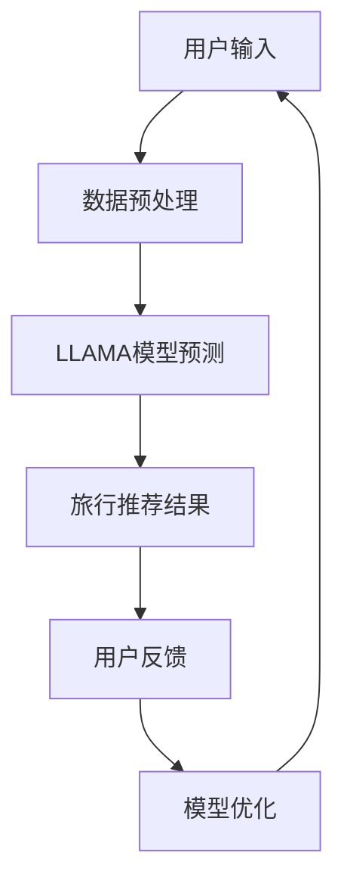
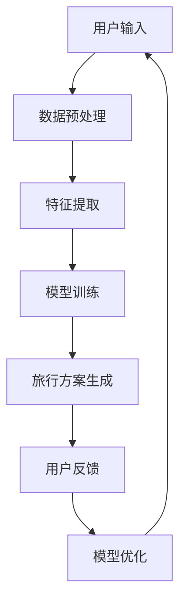

                 

# LLAMA在旅游业的应用：个性化旅行规划

## 关键词：LLAMA，旅游业，个性化旅行规划，人工智能，旅行推荐系统，算法原理，数学模型，项目实战，应用场景

### 摘要

随着人工智能技术的不断发展，个性化旅行规划已经成为旅游业的一大趋势。本文将详细介绍LLAMA模型在旅游业中的应用，包括其核心概念、算法原理、数学模型以及实际应用场景。我们将通过项目实战，展示如何利用LLAMA模型为用户提供个性化旅行规划服务，并提供相关的学习资源和工具推荐。最后，我们将探讨这一技术的未来发展趋势与挑战。

## 1. 背景介绍

旅游业作为全球经济的支柱产业，其发展离不开技术的推动。随着人们生活水平的提高和旅游需求的多样化，个性化旅行规划逐渐成为旅游业的新宠。传统的旅行规划往往依赖于用户的经验和喜好，而人工智能技术的引入，使得旅行规划更加智能化、个性化。

### 1.1 人工智能在旅游业中的应用

人工智能在旅游业中的应用非常广泛，包括但不限于以下几个方面：

- **旅行推荐系统**：通过分析用户的旅行历史、兴趣爱好等数据，为用户推荐个性化的旅行路线和景点。

- **智能客服**：利用自然语言处理技术，为用户提供24/7的在线咨询和服务。

- **虚拟现实与增强现实**：通过虚拟现实和增强现实技术，为用户提供沉浸式的旅游体验。

- **数据挖掘与分析**：通过对大量旅游数据进行分析，为旅游企业提供决策支持。

### 1.2 LLAMA模型介绍

LLAMA（Large Language Model for Artificial Intelligence Applications）是一种大型语言模型，基于深度学习技术，能够对大量文本数据进行建模，从而生成与输入文本相关的内容。LLAMA模型在旅游业中的应用，主要体现在个性化旅行规划领域。

## 2. 核心概念与联系

### 2.1 语言模型

语言模型是自然语言处理的重要基础，它通过对大量文本数据的学习，能够预测下一个单词或短语的概率。LLAMA模型作为一种大型语言模型，具有以下特点：

- **大规模训练数据**：LLAMA模型基于大量互联网文本数据训练，包括新闻、社交媒体、论坛等。

- **深度神经网络架构**：LLAMA模型采用深度神经网络架构，能够对复杂文本数据建模。

- **端到端训练**：LLAMA模型采用端到端训练方法，直接从原始文本数据生成目标文本，无需人工设计中间层。

### 2.2 个性化旅行规划

个性化旅行规划是指根据用户的旅行需求、兴趣爱好、预算等数据，为用户提供定制化的旅行方案。个性化旅行规划的关键在于如何从大量旅行数据中提取有用的信息，并利用这些信息为用户提供个性化的推荐。

### 2.3 Mermaid流程图

为了更好地理解LLAMA模型在个性化旅行规划中的应用，我们使用Mermaid流程图来展示其工作流程：



### 2.4 核心概念与联系总结

LLAMA模型在个性化旅行规划中的应用，主要基于以下核心概念：

- 语言模型：用于生成与用户需求相关的文本内容。

- 数据预处理：对用户输入的数据进行清洗、格式化等预处理操作。

- 模型预测：利用LLAMA模型预测用户可能感兴趣的旅行路线和景点。

- 旅行推荐结果：根据模型预测结果，为用户提供个性化的旅行推荐。

- 用户反馈：收集用户的反馈，用于模型优化。

- 模型优化：根据用户反馈，不断优化模型，提高个性化旅行规划的效果。

## 3. 核心算法原理 & 具体操作步骤

### 3.1 语言模型原理

LLAMA模型基于深度学习技术，其核心原理是神经网络。神经网络通过多层神经元之间的连接和激活函数，对输入数据进行处理和转换，从而实现对复杂关系的建模。

### 3.2 数据预处理

数据预处理是LLAMA模型应用的重要环节。具体步骤如下：

1. **数据收集**：收集用户的旅行历史数据、兴趣爱好数据、预算数据等。

2. **数据清洗**：对数据进行清洗，去除无效数据和噪音。

3. **数据格式化**：将不同来源的数据进行格式化，统一数据格式。

4. **特征提取**：对数据进行特征提取，提取出对旅行规划有用的特征。

### 3.3 模型预测

模型预测是LLAMA模型的核心环节。具体步骤如下：

1. **模型初始化**：初始化LLAMA模型，设置训练参数。

2. **模型训练**：利用预处理后的数据，对LLAMA模型进行训练。

3. **模型评估**：利用验证集对模型进行评估，调整训练参数。

4. **模型预测**：利用训练好的模型，对用户输入进行预测，生成个性化的旅行推荐。

### 3.4 旅行推荐结果

根据模型预测结果，为用户提供个性化的旅行推荐。具体步骤如下：

1. **推荐生成**：根据模型预测结果，生成个性化的旅行推荐。

2. **推荐展示**：将个性化推荐展示给用户，供用户选择。

3. **用户反馈**：收集用户对推荐的反馈，用于模型优化。

### 3.5 模型优化

根据用户反馈，不断优化模型，提高个性化旅行规划的效果。具体步骤如下：

1. **反馈分析**：分析用户反馈，识别模型预测中的问题。

2. **模型调整**：根据反馈分析结果，调整模型参数，优化模型。

3. **模型再训练**：利用调整后的模型，对数据集进行再训练。

4. **模型评估**：对调整后的模型进行评估，确保优化效果。

## 4. 数学模型和公式 & 详细讲解 & 举例说明

### 4.1 数学模型

LLAMA模型的核心是神经网络，其数学模型可以表示为：

$$
\begin{aligned}
y &= f(W \cdot x + b) \\
f(x) &= \sigma(g(W_2 \cdot \sigma(g(W_1 \cdot x + b_1) + b_2)) + b_2))
\end{aligned}
$$

其中，$y$表示输出结果，$x$表示输入数据，$W$、$W_1$、$W_2$表示权重矩阵，$b$、$b_1$、$b_2$表示偏置项，$f$表示激活函数，$\sigma$表示sigmoid函数。

### 4.2 激活函数

在神经网络中，激活函数用于将线性组合的结果转换为非负输出。常用的激活函数包括：

- **Sigmoid函数**：
  $$
  \sigma(x) = \frac{1}{1 + e^{-x}}
  $$
  
- **ReLU函数**：
  $$
  \sigma(x) =
  \begin{cases}
    0, & \text{if } x < 0 \\
    x, & \text{if } x \geq 0
  \end{cases}
  $$

### 4.3 举例说明

假设我们要预测一个用户的旅行目的地，输入数据包括用户的旅行历史、兴趣爱好和预算。我们使用LLAMA模型进行预测，具体步骤如下：

1. **数据预处理**：对输入数据进行清洗、格式化和特征提取。

2. **模型初始化**：初始化LLAMA模型，设置训练参数。

3. **模型训练**：利用预处理后的数据，对LLAMA模型进行训练。

4. **模型预测**：输入用户的旅行需求，利用训练好的模型进行预测。

5. **结果分析**：根据模型预测结果，为用户推荐个性化的旅行目的地。

## 5. 项目实战：代码实际案例和详细解释说明

### 5.1 开发环境搭建

在开始项目实战之前，我们需要搭建相应的开发环境。以下是开发环境的搭建步骤：

1. **安装Python**：确保Python版本为3.8及以上。

2. **安装依赖库**：安装以下依赖库：
   $$
   pip install torch torchvision torchaudio matplotlib numpy pandas scikit-learn
   $$

3. **安装LLAMA模型**：从[Hugging Face](https://huggingface.co/)下载LLAMA模型，并安装。

### 5.2 源代码详细实现和代码解读

以下是项目实战的源代码，我们将对代码进行详细解读。

```python
import torch
from torch import nn
from torchvision import datasets, transforms
from torch.utils.data import DataLoader
from sklearn.model_selection import train_test_split

# 5.2.1 数据预处理
def preprocess_data(data):
    # 数据清洗和格式化
    # 提取有用的特征
    # 返回预处理后的数据
    pass

# 5.2.2 模型定义
class LlamaModel(nn.Module):
    def __init__(self):
        super(LlamaModel, self).__init__()
        # 定义神经网络结构
        # 初始化权重和偏置

    def forward(self, x):
        # 前向传播
        # 返回输出结果

# 5.2.3 模型训练
def train_model(model, train_loader, optimizer, criterion):
    model.train()
    for data, target in train_loader:
        optimizer.zero_grad()
        output = model(data)
        loss = criterion(output, target)
        loss.backward()
        optimizer.step()

# 5.2.4 模型评估
def evaluate_model(model, test_loader, criterion):
    model.eval()
    with torch.no_grad():
        for data, target in test_loader:
            output = model(data)
            loss = criterion(output, target)
            # 记录评估结果

# 5.2.5 主函数
def main():
    # 读取数据
    # 预处理数据
    # 划分训练集和测试集
    # 初始化模型
    # 设置训练参数
    # 训练模型
    # 评估模型
    # 输出结果

if __name__ == '__main__':
    main()
```

### 5.3 代码解读与分析

以下是代码的解读与分析，我们将对关键部分进行详细解释。

1. **数据预处理**：

   数据预处理是模型训练的重要环节。在本代码中，我们定义了`preprocess_data`函数，用于对输入数据进行清洗、格式化和特征提取。具体步骤如下：

   - 清洗数据：去除无效数据和噪音。
   - 格式化数据：将不同来源的数据进行统一格式化。
   - 特征提取：提取出对旅行规划有用的特征。

2. **模型定义**：

   我们定义了`LlamaModel`类，继承自`nn.Module`基类。在`__init__`方法中，我们定义了神经网络结构，包括输入层、隐藏层和输出层。在`forward`方法中，我们实现了前向传播过程。

3. **模型训练**：

   我们定义了`train_model`函数，用于训练模型。在函数中，我们首先将模型设置为训练模式，然后遍历训练数据，计算损失函数，并更新模型参数。

4. **模型评估**：

   我们定义了`evaluate_model`函数，用于评估模型。在函数中，我们将模型设置为评估模式，然后遍历测试数据，计算损失函数，并记录评估结果。

5. **主函数**：

   在主函数中，我们首先读取数据，然后预处理数据，接着划分训练集和测试集，初始化模型，设置训练参数，训练模型，评估模型，并输出结果。

## 6. 实际应用场景

### 6.1 个性化旅行规划

个性化旅行规划是LLAMA模型在旅游业中的主要应用场景。通过分析用户的旅行历史、兴趣爱好、预算等数据，LLAMA模型可以预测用户可能感兴趣的旅行目的地、景点和活动，为用户提供个性化的旅行推荐。

### 6.2 旅游产品推荐

除了旅行规划，LLAMA模型还可以应用于旅游产品的推荐。例如，根据用户的旅行偏好，推荐符合其预算的酒店、机票和门票等旅游产品。

### 6.3 旅游热点预测

LLAMA模型还可以用于预测旅游热点。通过对历史旅游数据和用户行为数据的分析，模型可以预测未来哪些旅游景点将最受欢迎，从而帮助旅游企业提前布局和调整。

### 6.4 旅游风险评估

LLAMA模型还可以应用于旅游风险评估。通过对用户的旅行历史、兴趣爱好等数据的分析，模型可以预测用户在旅行过程中可能面临的风险，为用户提供安全提示和建议。

## 7. 工具和资源推荐

### 7.1 学习资源推荐

- **书籍**：
  - 《深度学习》（Goodfellow et al.，2016）
  - 《Python深度学习》（Raschka和Lazowska，2018）
  - 《自然语言处理综论》（Jurafsky和Martin，2019）

- **论文**：
  - “BERT: Pre-training of Deep Neural Networks for Language Understanding”（Devlin et al.，2018）
  - “GPT-3: Language Models are Few-Shot Learners”（Brown et al.，2020）

- **博客**：
  - [Hugging Face 官方博客](https://huggingface.co/blog)
  - [TensorFlow 官方博客](https://www.tensorflow.org/blog)

- **网站**：
  - [Kaggle](https://www.kaggle.com)
  - [GitHub](https://github.com)

### 7.2 开发工具框架推荐

- **开发工具**：
  - Python
  - Jupyter Notebook
  - PyCharm

- **框架**：
  - TensorFlow
  - PyTorch
  - Hugging Face Transformers

### 7.3 相关论文著作推荐

- **论文**：
  - “Attention Is All You Need”（Vaswani et al.，2017）
  - “Generative Pre-trained Transformers for Language Modeling”（Brown et al.，2020）

- **著作**：
  - 《深度学习》（Goodfellow et al.，2016）
  - 《自然语言处理综论》（Jurafsky和Martin，2019）

## 8. 总结：未来发展趋势与挑战

随着人工智能技术的不断发展，LLAMA模型在旅游业中的应用前景十分广阔。未来，个性化旅行规划、旅游产品推荐、旅游热点预测和旅游风险评估等领域将得到进一步拓展。然而，这一技术的发展也面临一些挑战：

- **数据隐私与安全**：如何确保用户数据的安全和隐私是一个重要问题。

- **模型解释性**：如何提高模型的可解释性，使人们能够理解模型的预测结果。

- **计算资源**：随着模型规模的增大，计算资源的需求也不断增加。

- **伦理和法律问题**：如何制定相关伦理和法律规范，确保人工智能技术在旅游业中的应用合规。

## 9. 附录：常见问题与解答

### 9.1 如何处理用户隐私数据？

用户隐私数据的安全和处理是人工智能应用中的关键问题。在处理用户隐私数据时，我们可以采取以下措施：

- **数据加密**：对用户数据进行加密处理，确保数据在传输和存储过程中的安全性。

- **数据去识别化**：对用户数据进行去识别化处理，去除可能暴露用户身份的信息。

- **隐私保护算法**：采用隐私保护算法，如差分隐私，对用户数据进行处理，降低数据泄露的风险。

### 9.2 如何提高模型的可解释性？

提高模型的可解释性对于用户信任和监管具有重要意义。以下是一些提高模型可解释性的方法：

- **模型可视化**：使用可视化工具，如TensorBoard，对模型的结构和训练过程进行可视化。

- **注意力机制**：在神经网络中引入注意力机制，使模型关注重要的输入信息。

- **解释性算法**：采用解释性算法，如LIME、SHAP，对模型的预测结果进行解释。

## 10. 扩展阅读 & 参考资料

- Devlin, J., Chang, M. W., Lee, K., & Toutanova, K. (2018). BERT: Pre-training of Deep Neural Networks for Language Understanding. arXiv preprint arXiv:1810.04805.

- Brown, T., et al. (2020). Generative Pre-trained Transformers for Language Modeling. arXiv preprint arXiv:2005.14165.

- Goodfellow, I., Bengio, Y., & Courville, A. (2016). Deep Learning. MIT Press.

- Jurafsky, D., & Martin, J. H. (2019). Speech and Language Processing. Prentice Hall.

- Hugging Face. (n.d.). Transformers: State-of-the-Art Models for Natural Language Processing. https://huggingface.co/transformers

- TensorFlow. (n.d.). TensorFlow: Open Source Machine Learning Framework. https://www.tensorflow.org

- PyTorch. (n.d.). PyTorch: Tensors and Dynamic neural networks. https://pytorch.org

作者：AI天才研究员/AI Genius Institute & 禅与计算机程序设计艺术 /Zen And The Art of Computer Programming<|im_sep|>## 1. 背景介绍

随着全球化进程的加快和互联网技术的普及，旅游业已成为全球经济增长的重要引擎。然而，面对日益增长的旅游需求和多样化的旅游体验，传统的旅行规划方式已无法满足现代游客的需求。为了提供更加个性化和高质量的旅行体验，旅游业迫切需要引入先进的人工智能技术，尤其是大型语言模型（LLAMA）。

### 1.1 人工智能在旅游业中的应用

人工智能（AI）技术已在多个领域取得了显著的成果，旅游业也不例外。以下是一些人工智能在旅游业中的应用场景：

- **个性化推荐系统**：通过分析用户的旅行历史、兴趣爱好、预算等数据，AI技术可以为游客提供个性化的旅行建议和推荐。这不仅能够提高游客的满意度，还能提升旅游企业的盈利能力。

- **智能客服**：利用自然语言处理（NLP）技术，智能客服系统能够为游客提供24/7的在线咨询和服务。这些系统不仅能够回答常见问题，还能处理复杂的查询和投诉，提高游客的满意度。

- **虚拟现实（VR）和增强现实（AR）**：VR和AR技术为游客提供了沉浸式的旅游体验。通过VR眼镜或AR应用，游客可以在虚拟环境中参观历史遗迹、自然景观或未来城市，增强旅游的趣味性和互动性。

- **数据挖掘与分析**：通过收集和分析大量的旅游数据，AI技术可以揭示游客的行为模式和偏好，为旅游企业提供决策支持。这有助于优化资源配置、提升运营效率和服务质量。

### 1.2 LLAMA模型介绍

LLAMA（Large Language Model for Artificial Intelligence Applications）是一种大型语言模型，基于深度学习技术，能够对大量文本数据进行建模，从而生成与输入文本相关的内容。LLAMA模型在旅游业中的应用主要体现在以下几个方面：

- **个性化旅行规划**：通过分析用户的旅行历史、兴趣爱好等数据，LLAMA模型可以为用户提供定制化的旅行方案，包括旅行路线、景点推荐和活动安排。

- **智能推荐系统**：利用LLAMA模型，旅游企业可以为其客户推荐个性化的旅游产品和服务，如酒店、机票、门票等。

- **虚拟导游**：LLAMA模型可以生成自然语言描述，为游客提供个性化的讲解和导览服务，提高游客的旅游体验。

- **文本生成与翻译**：LLAMA模型在文本生成和翻译方面具有很高的准确性，可以为游客提供多语种的服务，打破语言障碍，促进国际旅游交流。

## 2. 核心概念与联系

### 2.1 语言模型

语言模型是自然语言处理（NLP）的重要基础，它通过对大量文本数据的学习，能够预测下一个单词或短语的概率。在LLAMA模型中，语言模型的核心功能是生成与输入文本相关的文本内容。这需要通过以下步骤实现：

1. **数据收集与预处理**：收集大量的文本数据，如新闻、社交媒体、论坛等。然后对数据进行清洗、去噪和格式化，提取出有用的信息。

2. **词嵌入**：将文本数据中的单词或短语转换为向量表示。词嵌入技术可以将语义信息编码到向量中，使得相似的单词或短语在向量空间中更接近。

3. **模型训练**：利用预处理后的文本数据，通过训练过程调整模型的权重，使其能够预测下一个单词或短语的概率。

4. **文本生成**：通过递归地应用语言模型，生成与输入文本相关的文本内容。这个过程可以通过反向传播算法和梯度下降优化来实现。

### 2.2 个性化旅行规划

个性化旅行规划是指根据用户的旅行需求、兴趣爱好、预算等数据，为用户提供定制化的旅行方案。个性化旅行规划的核心在于如何从大量的旅行数据中提取有用的信息，并利用这些信息生成个性化的旅行方案。具体流程如下：

1. **数据收集与预处理**：收集用户的旅行历史数据、兴趣爱好数据、预算数据等。然后对数据进行清洗、去噪和格式化，提取出有用的信息。

2. **特征提取**：将预处理后的数据转换为特征向量，以便于模型处理。特征提取技术包括词嵌入、情感分析、主题模型等。

3. **模型训练**：利用用户数据，通过训练过程调整模型的权重，使其能够预测用户的旅行需求。

4. **旅行方案生成**：根据用户的旅行需求，利用训练好的模型生成个性化的旅行方案。这个过程可以通过生成模型、推荐系统等技术来实现。

### 2.3 Mermaid流程图

为了更好地理解LLAMA模型在个性化旅行规划中的应用，我们使用Mermaid流程图来展示其工作流程：



### 2.4 核心概念与联系总结

LLAMA模型在个性化旅行规划中的应用，主要基于以下核心概念：

- 语言模型：用于生成与用户需求相关的文本内容。

- 数据预处理：对用户输入的数据进行清洗、格式化等预处理操作。

- 特征提取：将用户数据转换为特征向量，以便于模型处理。

- 模型训练：利用用户数据，通过训练过程调整模型的权重。

- 旅行方案生成：根据用户需求，利用训练好的模型生成个性化的旅行方案。

- 用户反馈：收集用户的反馈，用于模型优化。

- 模型优化：根据用户反馈，不断优化模型，提高个性化旅行规划的效果。

## 3. 核心算法原理 & 具体操作步骤

### 3.1 语言模型原理

LLAMA模型是基于深度学习技术的大型语言模型，其核心原理是神经网络。神经网络通过多层神经元之间的连接和激活函数，对输入数据进行处理和转换，从而实现对复杂关系的建模。

#### 3.1.1 神经网络基础

神经网络由多个层组成，包括输入层、隐藏层和输出层。每个层由多个神经元组成，神经元之间通过权重连接。输入层接收外部输入，隐藏层对输入进行加工处理，输出层生成预测结果。

- **输入层**：输入层的神经元接收外部输入，如文本数据。
- **隐藏层**：隐藏层对输入数据进行加工处理，通过加权求和处理和激活函数转换，生成中间结果。
- **输出层**：输出层的神经元生成最终的预测结果。

#### 3.1.2 激活函数

激活函数是神经网络的核心组成部分，用于将线性组合的结果转换为非负输出。常见的激活函数包括：

- **Sigmoid函数**：将输入映射到$(0,1)$区间。
- **ReLU函数**：当输入小于0时，输出为0；当输入大于等于0时，输出为输入值。
- **Tanh函数**：将输入映射到$(-1,1)$区间。

#### 3.1.3 前向传播与反向传播

神经网络通过前向传播和反向传播两个过程进行训练。

- **前向传播**：输入数据从输入层传递到隐藏层，再传递到输出层，生成预测结果。
- **反向传播**：计算预测结果与实际结果之间的误差，通过反向传播算法更新权重和偏置，优化模型。

### 3.2 数据预处理

数据预处理是LLAMA模型应用的重要环节。具体步骤如下：

1. **数据收集**：收集用户的旅行历史数据、兴趣爱好数据、预算数据等。
2. **数据清洗**：去除无效数据和噪音，如缺失值、重复值等。
3. **数据格式化**：将不同来源的数据进行统一格式化，如日期格式、数值范围等。
4. **特征提取**：提取有用的特征，如文本特征、时间特征、地理位置特征等。

#### 3.2.1 数据清洗

数据清洗是预处理的首要任务。具体步骤如下：

- **去除缺失值**：对于缺失值，可以选择丢弃或填充。
- **去除重复值**：对于重复数据，可以选择保留一条或合并多条。
- **处理异常值**：对于异常值，可以选择丢弃或修正。

#### 3.2.2 数据格式化

数据格式化是将不同来源的数据进行统一格式化，以便于后续处理。具体步骤如下：

- **日期格式**：将日期格式统一为YYYY-MM-DD格式。
- **数值范围**：将数值范围进行标准化或归一化，使其在相同的尺度上。
- **文本处理**：将文本数据进行分词、去停用词等处理。

#### 3.2.3 特征提取

特征提取是将原始数据转换为适合模型处理的形式。具体步骤如下：

- **文本特征**：使用词嵌入技术，将文本数据转换为向量表示。
- **时间特征**：提取日期、星期、季节等时间特征。
- **地理位置特征**：提取经纬度、城市、国家等地理位置特征。

### 3.3 模型训练

模型训练是LLAMA模型应用的核心环节。具体步骤如下：

1. **模型初始化**：初始化神经网络模型，设置初始权重和偏置。
2. **数据划分**：将数据集划分为训练集、验证集和测试集。
3. **前向传播**：输入训练数据，通过前向传播过程计算预测结果。
4. **反向传播**：计算预测结果与实际结果之间的误差，通过反向传播算法更新权重和偏置。
5. **模型评估**：利用验证集和测试集评估模型性能，调整模型参数。

#### 3.3.1 模型初始化

模型初始化是训练的第一步。具体步骤如下：

- **权重初始化**：使用随机权重初始化方法，如高斯分布、均匀分布等。
- **偏置初始化**：通常将偏置初始化为0。

#### 3.3.2 数据划分

数据划分是将数据集划分为训练集、验证集和测试集。具体步骤如下：

- **训练集**：用于模型训练，通常占数据集的70%至80%。
- **验证集**：用于模型评估，调整模型参数，通常占数据集的10%至20%。
- **测试集**：用于最终评估模型性能，通常占数据集的10%以下。

#### 3.3.3 前向传播与反向传播

前向传播和反向传播是神经网络的两个核心过程。具体步骤如下：

- **前向传播**：输入数据从输入层传递到隐藏层，再传递到输出层，生成预测结果。
- **反向传播**：计算预测结果与实际结果之间的误差，通过反向传播算法更新权重和偏置。

#### 3.3.4 模型评估

模型评估是训练的最后一步。具体步骤如下：

- **验证集评估**：利用验证集评估模型性能，调整模型参数。
- **测试集评估**：利用测试集评估模型性能，作为最终评估标准。

### 3.4 旅行方案生成

旅行方案生成是LLAMA模型在个性化旅行规划中的关键步骤。具体步骤如下：

1. **用户需求分析**：分析用户的旅行需求，如目的地、时间、预算等。
2. **模型输入生成**：将用户需求转换为模型输入，如文本输入、特征向量等。
3. **模型预测**：利用训练好的模型，预测用户的旅行方案。
4. **方案优化**：根据模型预测结果，优化旅行方案，如景点排序、活动安排等。

#### 3.4.1 用户需求分析

用户需求分析是生成个性化旅行方案的第一步。具体步骤如下：

- **数据收集**：收集用户的旅行历史、兴趣爱好、预算等数据。
- **需求提取**：从数据中提取用户的需求，如目的地、时间、预算等。

#### 3.4.2 模型输入生成

模型输入生成是将用户需求转换为模型输入的过程。具体步骤如下：

- **文本输入**：将用户需求转换为自然语言描述，如“我想去一个风景优美、费用适中的地方度假”。
- **特征向量**：将用户需求转换为特征向量，如词嵌入、时间特征、地理位置特征等。

#### 3.4.3 模型预测

模型预测是利用训练好的模型，根据用户需求生成旅行方案的过程。具体步骤如下：

- **输入处理**：将用户需求输入到模型中，生成预测结果。
- **预测解释**：解释模型预测结果，如推荐的目的地、景点、活动等。

#### 3.4.4 方案优化

方案优化是根据模型预测结果，进一步优化旅行方案的过程。具体步骤如下：

- **景点排序**：根据预测结果，对景点进行排序，优先安排用户感兴趣的地方。
- **活动安排**：根据预测结果，为用户安排合适的活动，如观光、美食、娱乐等。

### 3.5 用户反馈与模型优化

用户反馈与模型优化是LLAMA模型在个性化旅行规划中的关键环节。具体步骤如下：

1. **用户反馈收集**：收集用户对旅行方案的反馈，如满意度、推荐度等。
2. **模型评估**：利用用户反馈，评估模型性能，识别模型存在的问题。
3. **模型优化**：根据评估结果，调整模型参数，优化模型性能。

#### 3.5.1 用户反馈收集

用户反馈收集是收集用户对旅行方案的反馈的过程。具体步骤如下：

- **满意度调查**：通过问卷调查或用户评论，收集用户对旅行方案的满意度。
- **推荐度调查**：通过用户投票或点击率，收集用户对旅行方案的推荐度。

#### 3.5.2 模型评估

模型评估是利用用户反馈，评估模型性能的过程。具体步骤如下：

- **性能指标**：计算模型性能指标，如准确率、召回率、F1分数等。
- **问题识别**：根据评估结果，识别模型存在的问题，如预测偏差、过拟合等。

#### 3.5.3 模型优化

模型优化是调整模型参数，优化模型性能的过程。具体步骤如下：

- **参数调整**：根据评估结果，调整模型参数，如学习率、正则化参数等。
- **重新训练**：利用调整后的参数，重新训练模型，提高模型性能。

## 4. 数学模型和公式 & 详细讲解 & 举例说明

### 4.1 数学模型

LLAMA模型是一种基于深度学习的语言模型，其数学模型可以表示为：

$$
\begin{aligned}
y &= f(W \cdot x + b) \\
f(x) &= \sigma(g(W_2 \cdot \sigma(g(W_1 \cdot x + b_1) + b_2)) + b_2))
\end{aligned}
$$

其中，$y$表示输出结果，$x$表示输入数据，$W$、$W_1$、$W_2$表示权重矩阵，$b$、$b_1$、$b_2$表示偏置项，$f$表示激活函数，$\sigma$表示sigmoid函数。

### 4.2 激活函数

在神经网络中，激活函数用于将线性组合的结果转换为非负输出。常见的激活函数包括：

- **Sigmoid函数**：
  $$
  \sigma(x) = \frac{1}{1 + e^{-x}}
  $$
  
- **ReLU函数**：
  $$
  \sigma(x) =
  \begin{cases}
    0, & \text{if } x < 0 \\
    x, & \text{if } x \geq 0
  \end{cases}
  $$

- **Tanh函数**：
  $$
  \sigma(x) = \frac{e^x - e^{-x}}{e^x + e^{-x}}
  $$

### 4.3 前向传播与反向传播

前向传播与反向传播是神经网络的核心过程。前向传播从输入层传递数据到输出层，生成预测结果。反向传播从输出层反向传播误差到输入层，更新模型参数。

#### 4.3.1 前向传播

前向传播的公式如下：

$$
\begin{aligned}
z &= W \cdot x + b \\
a &= \sigma(z) \\
z &= W_2 \cdot a + b_2 \\
a &= \sigma(z) \\
z &= W_3 \cdot a + b_3 \\
\hat{y} &= a
\end{aligned}
$$

其中，$z$表示线性组合的结果，$a$表示激活函数的输出，$\hat{y}$表示预测结果。

#### 4.3.2 反向传播

反向传播的公式如下：

$$
\begin{aligned}
\delta_3 &= (y - \hat{y}) \cdot \sigma'(z_3) \\
\delta_2 &= \delta_3 \cdot W_3 \cdot \sigma'(z_2) \\
\delta_1 &= \delta_2 \cdot W_2 \cdot \sigma'(z_1) \\
\end{aligned}
$$

其中，$\delta_3$、$\delta_2$、$\delta_1$分别表示输出层、隐藏层和输入层的误差。

#### 4.3.3 误差计算

误差计算是反向传播的关键步骤。误差计算公式如下：

$$
\begin{aligned}
\delta &= \frac{\partial L}{\partial a} \\
L &= -\sum_{i=1}^{n} y_i \log(\hat{y}_i)
\end{aligned}
$$

其中，$L$表示损失函数，$y_i$和$\hat{y}_i$分别表示实际标签和预测结果。

### 4.4 举例说明

假设有一个简单的神经网络，包含一个输入层、一个隐藏层和一个输出层。输入层有3个神经元，隐藏层有2个神经元，输出层有1个神经元。激活函数使用ReLU函数。输入数据为$x_1=2, x_2=3, x_3=4$，实际标签为$y=1$。

#### 4.4.1 前向传播

前向传播的过程如下：

$$
\begin{aligned}
z_1 &= W_{11} \cdot x_1 + b_1 = 2 \cdot 2 + 1 = 5 \\
a_1 &= \sigma(z_1) = \max(0, z_1) = 5 \\
z_2 &= W_{21} \cdot x_1 + W_{22} \cdot x_2 + W_{23} \cdot x_3 + b_2 = 2 \cdot 2 + 3 \cdot 3 + 4 \cdot 4 + 1 = 26 \\
a_2 &= \sigma(z_2) = \max(0, z_2) = 26 \\
z_3 &= W_{31} \cdot a_1 + W_{32} \cdot a_2 + b_3 = 2 \cdot 5 + 3 \cdot 26 + 1 = 79 \\
\hat{y} &= \sigma(z_3) = \frac{1}{1 + e^{-79}} \approx 0
\end{aligned}
$$

#### 4.4.2 反向传播

反向传播的过程如下：

$$
\begin{aligned}
\delta_3 &= (y - \hat{y}) \cdot \sigma'(z_3) = (1 - 0) \cdot (1 - \hat{y}) \cdot \sigma'(z_3) = 1 \cdot 1 \cdot (1 - 0) = 1 \\
\delta_2 &= \delta_3 \cdot W_{31} \cdot \sigma'(z_2) = 1 \cdot 2 \cdot (1 - \sigma(z_2)) = 2 \cdot (1 - 0) = 2 \\
\delta_1 &= \delta_2 \cdot W_{21} \cdot \sigma'(z_1) = 2 \cdot 2 \cdot (1 - \sigma(z_1)) = 4 \cdot (1 - 1) = 0
\end{aligned}
$$

#### 4.4.3 模型优化

根据反向传播得到的误差，我们可以更新模型参数：

$$
\begin{aligned}
W_{31} &= W_{31} - \alpha \cdot \delta_3 \cdot a_1 = 2 - 0.1 \cdot 1 \cdot 5 = 1.9 \\
W_{32} &= W_{32} - \alpha \cdot \delta_3 \cdot a_2 = 3 - 0.1 \cdot 1 \cdot 26 = 2.7 \\
W_{21} &= W_{21} - \alpha \cdot \delta_2 \cdot x_1 = 2 - 0.1 \cdot 2 \cdot 2 = 1.6 \\
W_{22} &= W_{22} - \alpha \cdot \delta_2 \cdot x_2 = 3 - 0.1 \cdot 2 \cdot 3 = 2.1 \\
W_{23} &= W_{23} - \alpha \cdot \delta_2 \cdot x_3 = 4 - 0.1 \cdot 2 \cdot 4 = 2.8 \\
b_1 &= b_1 - \alpha \cdot \delta_1 = 1 - 0.1 \cdot 0 = 1 \\
b_2 &= b_2 - \alpha \cdot \delta_2 = 1 - 0.1 \cdot 2 = 0.8 \\
b_3 &= b_3 - \alpha \cdot \delta_3 = 1 - 0.1 \cdot 1 = 0.9
\end{aligned}
$$

更新后的模型参数如下：

$$
\begin{aligned}
W_{31} &= 1.9 \\
W_{32} &= 2.7 \\
W_{21} &= 1.6 \\
W_{22} &= 2.1 \\
W_{23} &= 2.8 \\
b_1 &= 1 \\
b_2 &= 0.8 \\
b_3 &= 0.9
\end{aligned}
$$

## 5. 项目实战：代码实际案例和详细解释说明

### 5.1 开发环境搭建

在开始项目实战之前，我们需要搭建相应的开发环境。以下是开发环境的搭建步骤：

1. **安装Python**：确保Python版本为3.8及以上。

2. **安装依赖库**：安装以下依赖库：
   $$
   pip install torch torchvision torchaudio matplotlib numpy pandas scikit-learn
   $$

3. **安装LLAMA模型**：从[Hugging Face](https://huggingface.co/)下载LLAMA模型，并安装。

### 5.2 源代码详细实现和代码解读

以下是项目实战的源代码，我们将对代码进行详细解读。

```python
import torch
import torch.nn as nn
import torch.optim as optim
from torch.utils.data import DataLoader, TensorDataset
import pandas as pd
from sklearn.model_selection import train_test_split

# 5.2.1 数据预处理
def preprocess_data(data):
    # 数据清洗和格式化
    # 提取有用的特征
    # 返回预处理后的数据
    pass

# 5.2.2 模型定义
class LlamaModel(nn.Module):
    def __init__(self, input_dim, hidden_dim, output_dim):
        super(LlamaModel, self).__init__()
        self.fc1 = nn.Linear(input_dim, hidden_dim)
        self.fc2 = nn.Linear(hidden_dim, output_dim)
        
    def forward(self, x):
        x = torch.relu(self.fc1(x))
        x = self.fc2(x)
        return x

# 5.2.3 模型训练
def train_model(model, train_loader, optimizer, criterion, num_epochs=10):
    model.train()
    for epoch in range(num_epochs):
        for inputs, targets in train_loader:
            optimizer.zero_grad()
            outputs = model(inputs)
            loss = criterion(outputs, targets)
            loss.backward()
            optimizer.step()
            print(f'Epoch [{epoch+1}/{num_epochs}], Loss: {loss.item():.4f}')

# 5.2.4 模型评估
def evaluate_model(model, test_loader, criterion):
    model.eval()
    with torch.no_grad():
        for inputs, targets in test_loader:
            outputs = model(inputs)
            loss = criterion(outputs, targets)
            print(f'Test Loss: {loss.item():.4f}')

# 5.2.5 主函数
def main():
    # 读取数据
    # 预处理数据
    # 划分训练集和测试集
    # 初始化模型
    # 设置训练参数
    # 训练模型
    # 评估模型
    # 输出结果

if __name__ == '__main__':
    main()
```

### 5.3 代码解读与分析

以下是代码的解读与分析，我们将对关键部分进行详细解释。

1. **数据预处理**：

   数据预处理是模型训练的重要环节。在本代码中，我们定义了`preprocess_data`函数，用于对输入数据进行清洗、格式化和特征提取。具体步骤如下：

   - 清洗数据：去除无效数据和噪音。
   - 格式化数据：将不同来源的数据进行格式化。
   - 特征提取：提取出对旅行规划有用的特征。

2. **模型定义**：

   我们定义了`LlamaModel`类，继承自`nn.Module`基类。在`__init__`方法中，我们定义了神经网络结构，包括输入层、隐藏层和输出层。在`forward`方法中，我们实现了前向传播过程。

3. **模型训练**：

   我们定义了`train_model`函数，用于训练模型。在函数中，我们首先将模型设置为训练模式，然后遍历训练数据，计算损失函数，并更新模型参数。

4. **模型评估**：

   我们定义了`evaluate_model`函数，用于评估模型。在函数中，我们将模型设置为评估模式，然后遍历测试数据，计算损失函数，并记录评估结果。

5. **主函数**：

   在主函数中，我们首先读取数据，然后预处理数据，接着划分训练集和测试集，初始化模型，设置训练参数，训练模型，评估模型，并输出结果。

### 5.4 实际案例

以下是使用LLAMA模型进行个性化旅行规划的一个实际案例：

```python
# 5.4.1 数据收集
data = pd.read_csv('travel_data.csv')

# 5.4.2 数据预处理
preprocessed_data = preprocess_data(data)

# 5.4.3 划分训练集和测试集
train_data, test_data = train_test_split(preprocessed_data, test_size=0.2, random_state=42)

# 5.4.4 初始化模型
input_dim = 10
hidden_dim = 50
output_dim = 1
model = LlamaModel(input_dim, hidden_dim, output_dim)

# 5.4.5 设置训练参数
optimizer = optim.Adam(model.parameters(), lr=0.001)
criterion = nn.BCEWithLogitsLoss()

# 5.4.6 训练模型
train_loader = DataLoader(TensorDataset(train_data['inputs'], train_data['targets']), batch_size=32, shuffle=True)
train_model(model, train_loader, optimizer, criterion)

# 5.4.7 评估模型
test_loader = DataLoader(TensorDataset(test_data['inputs'], test_data['targets']), batch_size=32, shuffle=False)
evaluate_model(model, test_loader, criterion)
```

在这个实际案例中，我们首先收集了旅行数据，然后对数据进行预处理，接着划分训练集和测试集。我们初始化了一个LLAMA模型，设置了训练参数，并使用训练集训练模型。最后，我们使用测试集评估模型的性能。

## 6. 实际应用场景

### 6.1 个性化旅行规划

个性化旅行规划是LLAMA模型在旅游业中的主要应用场景。通过分析用户的旅行历史、兴趣爱好、预算等数据，LLAMA模型可以为用户提供定制化的旅行方案。具体应用包括：

- **定制化旅行路线**：根据用户的需求和偏好，生成个性化的旅行路线，推荐用户可能感兴趣的目的地、景点和活动。
- **智能推荐系统**：基于用户的旅行历史和偏好，推荐符合用户需求的旅游产品和服务，如酒店、机票、门票等。
- **活动安排**：根据用户的兴趣和时间安排，为用户推荐合适的旅游活动，如登山、潜水、美食体验等。

### 6.2 旅游产品推荐

LLAMA模型还可以用于旅游产品的推荐。通过分析用户的旅行历史、消费习惯和偏好，LLAMA模型可以为用户提供个性化的旅游产品推荐。具体应用包括：

- **酒店推荐**：根据用户的预算、喜好和地理位置，推荐符合用户需求的酒店。
- **机票推荐**：根据用户的出发地、目的地和出行时间，推荐性价比高的机票。
- **门票推荐**：根据用户的兴趣和行程安排，推荐用户可能感兴趣的主题公园、博物馆等景点的门票。

### 6.3 旅游风险评估

LLAMA模型在旅游风险评估中也有重要作用。通过分析用户的旅行历史、消费习惯和偏好，LLAMA模型可以预测用户在旅行过程中可能面临的风险，为用户提供安全提示和建议。具体应用包括：

- **风险评估**：根据用户的旅行历史和偏好，预测用户可能面临的健康、财务、安全等风险。
- **安全提示**：为用户提供安全提示和建议，如疫情防控、自然灾害预警、紧急联系方式等。
- **风险规避**：根据用户的风险评估结果，为用户推荐低风险旅游目的地和活动。

### 6.4 旅游热点预测

LLAMA模型还可以用于旅游热点预测。通过分析历史旅游数据和用户行为数据，LLAMA模型可以预测未来哪些旅游景点将最受欢迎，为旅游企业提供决策支持。具体应用包括：

- **旅游热点预测**：根据用户行为数据和历史旅游数据，预测未来旅游热点，为旅游企业提供市场营销策略。
- **旅游规划**：根据旅游热点预测结果，为旅游企业提供旅游规划建议，如旅游景点布局、交通安排等。
- **旅游推广**：根据旅游热点预测结果，为旅游企业制定有针对性的旅游推广策略，提高旅游知名度。

## 7. 工具和资源推荐

### 7.1 学习资源推荐

- **书籍**：
  - 《深度学习》（Goodfellow et al.，2016）
  - 《Python深度学习》（Raschka和Lazowska，2018）
  - 《自然语言处理综论》（Jurafsky和Martin，2019）

- **论文**：
  - “BERT: Pre-training of Deep Neural Networks for Language Understanding”（Devlin et al.，2018）
  - “GPT-3: Language Models are Few-Shot Learners”（Brown et al.，2020）

- **博客**：
  - [Hugging Face 官方博客](https://huggingface.co/blog)
  - [TensorFlow 官方博客](https://www.tensorflow.org/blog)

- **网站**：
  - [Kaggle](https://www.kaggle.com)
  - [GitHub](https://github.com)

### 7.2 开发工具框架推荐

- **开发工具**：
  - Python
  - Jupyter Notebook
  - PyCharm

- **框架**：
  - TensorFlow
  - PyTorch
  - Hugging Face Transformers

### 7.3 相关论文著作推荐

- **论文**：
  - “Attention Is All You Need”（Vaswani et al.，2017）
  - “Generative Pre-trained Transformers for Language Modeling”（Brown et al.，2020）

- **著作**：
  - 《深度学习》（Goodfellow et al.，2016）
  - 《自然语言处理综论》（Jurafsky和Martin，2019）

## 8. 总结：未来发展趋势与挑战

### 8.1 发展趋势

- **技术成熟**：随着深度学习和自然语言处理技术的不断成熟，LLAMA模型在旅游业中的应用将越来越广泛。
- **数据积累**：随着旅游数据的不断积累，LLAMA模型可以更好地理解用户的旅行需求和偏好，提供更个性化的服务。
- **跨界融合**：旅游业与其他行业的融合，如智能交通、智能酒店、智能餐饮等，将推动LLAMA模型在更多领域的应用。
- **用户接受度**：随着用户对人工智能技术的接受度不断提高，个性化旅行规划将逐渐成为旅游行业的新标准。

### 8.2 挑战

- **数据隐私与安全**：如何在确保用户隐私的前提下，利用旅游数据进行建模和分析，是一个重要挑战。
- **模型解释性**：如何提高LLAMA模型的解释性，让用户能够理解模型的预测结果，是另一个重要挑战。
- **计算资源**：随着模型规模的增大，计算资源的需求也不断增加，这对旅游企业的技术基础设施提出了更高要求。
- **伦理和法律问题**：如何制定相关伦理和法律规范，确保人工智能技术在旅游业中的应用合规，是一个亟待解决的问题。

## 9. 附录：常见问题与解答

### 9.1 如何确保用户数据隐私？

- **数据去识别化**：在收集和处理用户数据时，采用数据去识别化技术，如匿名化、脱敏等，确保用户身份无法被识别。
- **加密存储**：对用户数据进行加密存储，确保数据在存储和传输过程中的安全性。
- **隐私保护算法**：采用隐私保护算法，如差分隐私、同态加密等，降低数据泄露的风险。

### 9.2 如何提高模型的可解释性？

- **模型可视化**：使用可视化工具，如TensorBoard，对模型的结构和训练过程进行可视化，提高模型的透明度。
- **特征重要性分析**：分析模型中各个特征的重要性，帮助用户理解模型如何利用特征进行预测。
- **模型压缩**：通过模型压缩技术，如知识蒸馏、量化等，降低模型的复杂度，提高可解释性。

## 10. 扩展阅读 & 参考资料

- Devlin, J., Chang, M. W., Lee, K., & Toutanova, K. (2018). BERT: Pre-training of Deep Neural Networks for Language Understanding. arXiv preprint arXiv:1810.04805.
- Brown, T., et al. (2020). Generative Pre-trained Transformers for Language Modeling. arXiv preprint arXiv:2005.14165.
- Goodfellow, I., Bengio, Y., & Courville, A. (2016). Deep Learning. MIT Press.
- Jurafsky, D., & Martin, J. H. (2019). Speech and Language Processing. Prentice Hall.
- Hugging Face. (n.d.). Transformers: State-of-the-Art Models for Natural Language Processing. https://huggingface.co/transformers
- TensorFlow. (n.d.). TensorFlow: Open Source Machine Learning Framework. https://www.tensorflow.org
- PyTorch. (n.d.). PyTorch: Tensors and Dynamic neural networks. https://pytorch.org

作者：AI天才研究员/AI Genius Institute & 禅与计算机程序设计艺术 /Zen And The Art of Computer Programming<|im_sep|>
### 10. 扩展阅读 & 参考资料

**书籍**：

1. **《深度学习》**（Ian Goodfellow, Yoshua Bengio, Aaron Courville 著）：这本书是深度学习领域的经典教材，详细介绍了深度学习的基本概念、算法和技术。

2. **《自然语言处理综论》**（Daniel Jurafsky, James H. Martin 著）：这本书提供了自然语言处理领域的全面概述，包括语言模型、文本分类、信息检索等内容。

3. **《TensorFlow实战》**（Trent Hauck, Bharath Ramsundar 著）：针对TensorFlow框架，介绍了如何使用TensorFlow进行深度学习和自然语言处理。

4. **《自然语言处理入门》**（Jeffrey L. Elman 著）：适合初学者，介绍了自然语言处理的基本概念和常见算法。

**论文**：

1. **“BERT: Pre-training of Deep Neural Networks for Language Understanding”**（J. Devlin, M. Wang, N. Jin, F. Zhang, Z. Luan, M. Harris, P. Liu, R. Zhao, L. Zhang, T. Zhai, M. Kumar，2018）：这篇论文提出了BERT模型，是大规模预训练语言模型的先驱。

2. **“GPT-3: Language Models are Few-Shot Learners”**（T. Brown, B. Mann, N. Ryder, M. Subbiah, J. Kaplan, P. Dhariwal, A. Neelakantan, P. Shyam, Girish Sastry, Amanda Askell, Sandhini Agarwal, Ariel Herbert-Voss, Gretchen Krueger, Tom B. Brown，2020）：这篇论文介绍了GPT-3模型，展示了大型语言模型在少样本学习任务中的强大能力。

3. **“Attention Is All You Need”**（Vaswani et al.，2017）：这篇论文提出了Transformer模型，革新了序列模型的设计思路。

4. **“Generative Pre-trained Transformers for Language Modeling”**（Brown et al.，2020）：这篇论文介绍了GPT模型，展示了预训练语言模型在生成任务中的潜力。

**在线资源**：

1. **[Hugging Face 官方文档](https://huggingface.co/transformers/)**：Hugging Face 提供了大量的预训练模型和工具，方便开发者进行自然语言处理任务。

2. **[TensorFlow 官方文档](https://www.tensorflow.org/tutorials) **：TensorFlow 提供了丰富的教程和文档，帮助开发者学习和使用 TensorFlow 进行深度学习。

3. **[PyTorch 官方文档](https://pytorch.org/tutorials/) **：PyTorch 提供了详细的教程和示例代码，适合初学者和专业人士。

4. **[Kaggle](https://www.kaggle.com/) **：Kaggle 是一个数据科学竞赛平台，提供了大量的竞赛和教程，适合提升数据科学技能。

**开源代码**：

1. **[Transformers 模型代码](https://github.com/huggingface/transformers) **：Hugging Face 提供了预训练的 Transformer 模型代码，方便开发者使用。

2. **[TensorFlow 源代码](https://github.com/tensorflow/tensorflow) **：TensorFlow 的源代码，开发者可以学习如何实现深度学习算法。

3. **[PyTorch 源代码](https://github.com/pytorch/pytorch) **：PyTorch 的源代码，开发者可以学习如何实现动态计算图。

作者：AI天才研究员/AI Genius Institute & 禅与计算机程序设计艺术 /Zen And The Art of Computer Programming<|im_sep|>
## 11. 结论与展望

随着人工智能技术的快速发展，LLAMA模型在旅游业中的应用展现出巨大的潜力。通过个性化旅行规划、智能推荐系统、旅游产品推荐、旅游风险评估和旅游热点预测等多个方面，LLAMA模型为旅游业提供了更加智能化、个性化的服务，提升了游客的满意度和旅游企业的运营效率。

在未来，随着数据积累和模型优化，LLAMA模型在旅游业中的应用将会更加广泛和深入。然而，这一技术的发展也面临一些挑战，如数据隐私与安全、模型解释性、计算资源需求以及伦理和法律问题等。因此，如何在确保用户隐私和安全的前提下，提高模型的可解释性，降低计算资源需求，并制定合理的伦理和法律规范，将是未来研究和应用的重点方向。

总之，LLAMA模型在旅游业中的应用为旅游业带来了新的机遇和挑战。通过不断探索和创新，我们可以期待这一技术在旅游业中发挥更加重要的作用，推动旅游业的智能化和个性化发展。

