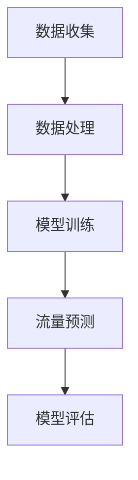

                 


# LLM在智能交通流量预测中的潜在贡献

> 关键词：大型语言模型、智能交通、流量预测、深度学习、神经网络、机器学习、数据挖掘、算法优化
>
> 摘要：本文将探讨大型语言模型（LLM）在智能交通流量预测中的潜在应用。通过逐步分析LLM的工作原理、核心算法、数学模型，以及实际应用案例，本文旨在展示LLM在智能交通领域中的巨大潜力，并对其未来发展趋势和挑战进行探讨。

## 1. 背景介绍

### 1.1 目的和范围

本文旨在探讨大型语言模型（LLM）在智能交通流量预测中的应用，通过对LLM的核心算法、数学模型和实际案例的深入分析，旨在展示其在智能交通领域的潜在贡献。文章将涵盖以下主题：

- LLM的工作原理及其在智能交通流量预测中的应用
- LLM的核心算法原理及具体操作步骤
- LLM的数学模型及详细讲解
- LLM在智能交通流量预测中的实际应用案例
- 未来发展趋势与挑战

### 1.2 预期读者

本文适用于对智能交通和机器学习有一定了解的读者，包括但不限于：

- 智能交通领域的研究人员
- 机器学习领域的开发者
- 软件工程师和程序员
- 数据科学家和分析师

### 1.3 文档结构概述

本文分为以下章节：

- 1. 背景介绍
- 2. 核心概念与联系
- 3. 核心算法原理 & 具体操作步骤
- 4. 数学模型和公式 & 详细讲解 & 举例说明
- 5. 项目实战：代码实际案例和详细解释说明
- 6. 实际应用场景
- 7. 工具和资源推荐
- 8. 总结：未来发展趋势与挑战
- 9. 附录：常见问题与解答
- 10. 扩展阅读 & 参考资料

### 1.4 术语表

#### 1.4.1 核心术语定义

- **大型语言模型（LLM）**：一种能够对自然语言进行建模的深度学习模型，能够对输入文本进行理解、生成和预测。
- **智能交通**：利用信息技术、数据通信传输技术、电子传感技术等高新技术对传统交通管理进行改进，实现交通管理、交通信息、交通运输工具以及道路系统的和谐高效运行。
- **流量预测**：通过分析历史数据、实时数据等信息，预测未来的交通流量变化，以便为交通管理和规划提供依据。

#### 1.4.2 相关概念解释

- **神经网络**：一种模拟人脑神经元结构和功能的计算模型，用于处理复杂的非线性问题。
- **机器学习**：一种人工智能的方法，通过从数据中学习规律，实现对未知数据的预测和分类。
- **数据挖掘**：从大量数据中提取出有价值的模式和知识的过程。

#### 1.4.3 缩略词列表

- **LLM**：Large Language Model
- **AI**：Artificial Intelligence
- **ML**：Machine Learning
- **DL**：Deep Learning
- **NLP**：Natural Language Processing

## 2. 核心概念与联系

在智能交通流量预测中，大型语言模型（LLM）的应用涉及多个核心概念和联系。为了更好地理解LLM在智能交通流量预测中的角色，我们首先介绍一些关键概念，并使用Mermaid流程图来展示它们之间的联系。

### 2.1. 关键概念

- **数据收集**：通过传感器、摄像头等设备收集实时交通数据，包括车辆速度、流量、道路占用情况等。
- **数据处理**：对收集到的数据进行预处理，包括数据清洗、特征提取等，以便于模型训练。
- **模型训练**：使用收集到的数据训练LLM，使其能够对交通流量进行预测。
- **流量预测**：通过训练好的LLM对未来的交通流量进行预测，为交通管理和规划提供依据。
- **模型评估**：对训练好的LLM进行评估，以确定其预测的准确性。

### 2.2. Mermaid 流程图



### 2.3. 关系解释

- **数据收集**：智能交通系统通过各种传感器和摄像头收集实时交通数据，这些数据是LLM进行训练和预测的基础。
- **数据处理**：收集到的数据可能包含噪声、异常值等，需要进行清洗和特征提取，以便为模型训练提供高质量的输入。
- **模型训练**：使用处理后的数据对LLM进行训练，使其能够学习交通流量变化的规律。
- **流量预测**：通过训练好的LLM对未来的交通流量进行预测，为交通管理部门提供决策支持。
- **模型评估**：通过评估模型的预测准确性，对模型进行优化和调整，以提高预测性能。

## 3. 核心算法原理 & 具体操作步骤

### 3.1. 大型语言模型（LLM）的工作原理

大型语言模型（LLM）基于深度学习技术，通过多层神经网络对大量文本数据进行建模，从而实现对自然语言的生成、理解和预测。LLM的工作原理可以概括为以下几个步骤：

1. **词嵌入**：将输入的文本转化为向量的表示，即将单词映射到高维空间中的点。
2. **编码器**：将词嵌入序列输入编码器，编码器通过多层神经网络对文本进行编码，提取出文本的语义特征。
3. **解码器**：解码器根据编码器的输出生成文本，实现对输入文本的生成和理解。
4. **损失函数**：使用损失函数（如交叉熵损失）来衡量预测文本和真实文本之间的差距，通过反向传播算法更新模型参数。

### 3.2. 核心算法原理的伪代码

```python
# 输入：文本序列 X
# 输出：预测文本序列 Y
def LLM_prediction(X):
    # 步骤1：词嵌入
    X_embedding = word_embedding(X)
    
    # 步骤2：编码器
    encoder_output = encoder(X_embedding)
    
    # 步骤3：解码器
    Y = decoder(encoder_output)
    
    # 步骤4：损失函数
    loss = loss_function(Y, true_y)
    
    # 步骤5：反向传播
    gradients = backpropagation(Y, true_y)
    
    # 步骤6：更新模型参数
    update_parameters(gradients)
    
    return Y
```

### 3.3. 具体操作步骤

1. **数据收集**：收集实时交通数据，包括车辆速度、流量、道路占用情况等。
2. **数据处理**：对收集到的数据进行预处理，包括数据清洗、特征提取等。
3. **模型训练**：使用预处理后的数据训练LLM，包括词嵌入层、编码器、解码器等。
4. **模型评估**：使用测试集评估模型性能，包括准确率、召回率、F1值等指标。
5. **流量预测**：使用训练好的LLM对未来的交通流量进行预测，为交通管理部门提供决策支持。
6. **模型优化**：根据评估结果对模型进行调整和优化，以提高预测性能。

## 4. 数学模型和公式 & 详细讲解 & 举例说明

### 4.1. 数学模型

在大型语言模型（LLM）中，数学模型是理解和预测交通流量的核心。以下是我们将使用的几个关键数学模型：

1. **词嵌入模型**：将文本转换为向量表示。
2. **神经网络模型**：用于编码和解码文本。
3. **损失函数**：用于评估模型性能。

### 4.2. 词嵌入模型

词嵌入（Word Embedding）是一种将单词映射到高维空间中的向量表示的方法。常见的词嵌入模型包括：

- **Word2Vec**：基于神经网络的语言模型，通过预测单词的上下文来学习词向量。
- **GloVe**：全局向量表示，通过利用单词的共现信息来学习词向量。

#### 4.2.1. Word2Vec模型

Word2Vec模型的核心思想是学习一个词向量，使得相似单词在向量空间中接近。Word2Vec模型使用以下公式：

$$
\text{prob}(w_i | w_{-i}) = \frac{exp(\text{similarity}(v_{w_i}, v_{w_j})}{\sum_{w \in V} exp(\text{similarity}(v_{w_i}, v_{w_j}))}
$$

其中，$v_{w_i}$和$v_{w_j}$分别是单词$w_i$和$w_j$的向量表示，$\text{similarity}$表示两个向量之间的相似度。

#### 4.2.2. GloVe模型

GloVe模型通过训练一个线性模型来预测单词的共现概率：

$$
\text{P}(w_j | w_i) = \frac{f(w_i; d) f(w_j; d)}{\sum_{w' \in V} f(w_i; d) f(w'; d)}
$$

其中，$f(w; d)$表示单词$w$的向量，$d$是向量维度。

### 4.3. 神经网络模型

神经网络模型用于编码和解码文本，包括以下几个关键组成部分：

- **输入层**：接收词嵌入向量。
- **隐藏层**：通过多层神经网络提取文本特征。
- **输出层**：生成预测的文本序列。

#### 4.3.1. 编码器

编码器（Encoder）通过多层神经网络对输入的词嵌入向量进行编码，提取文本的语义特征。编码器的输出通常是一个固定长度的向量，表示文本的语义信息。

#### 4.3.2. 解码器

解码器（Decoder）根据编码器的输出生成预测的文本序列。解码器通常使用循环神经网络（RNN）或变换器（Transformer）来实现。

#### 4.3.3. 注意力机制

注意力机制（Attention Mechanism）是解码器中的一个关键组件，用于关注编码器输出的不同部分，以提高生成文本的质量。

### 4.4. 损失函数

损失函数用于评估模型性能，常见的损失函数包括：

- **交叉熵损失**：用于衡量预测文本和真实文本之间的差距。
- **均方误差（MSE）**：用于衡量预测值和真实值之间的差距。

#### 4.4.1. 交叉熵损失

交叉熵损失（Cross-Entropy Loss）用于二分类问题，其公式为：

$$
\text{Loss} = -\sum_{i} y_i \log(p_i)
$$

其中，$y_i$是真实标签，$p_i$是预测概率。

#### 4.4.2. 均方误差（MSE）

均方误差（Mean Squared Error，MSE）用于回归问题，其公式为：

$$
\text{Loss} = \frac{1}{n} \sum_{i=1}^{n} (y_i - \hat{y}_i)^2
$$

其中，$y_i$是真实值，$\hat{y}_i$是预测值。

### 4.5. 举例说明

#### 4.5.1. 词嵌入

假设我们有两个单词“apple”和“orange”，它们的词嵌入向量分别为$v_{apple}$和$v_{orange}$。根据Word2Vec模型的相似度计算公式，我们可以计算出这两个单词的相似度：

$$
\text{similarity}(v_{apple}, v_{orange}) = \text{cosine\_similarity}(v_{apple}, v_{orange})
$$

如果相似度接近1，则表示这两个单词在语义上很接近。

#### 4.5.2. 神经网络

假设我们有一个简单的神经网络，包含一个输入层、一个隐藏层和一个输出层。输入层接收词嵌入向量，隐藏层通过多层神经网络提取文本特征，输出层生成预测的文本序列。

- **输入层**：接收词嵌入向量。
- **隐藏层**：使用ReLU激活函数进行非线性变换。
- **输出层**：使用softmax激活函数生成预测的概率分布。

训练过程中，使用交叉熵损失函数来评估模型性能，并使用反向传播算法更新模型参数。

## 5. 项目实战：代码实际案例和详细解释说明

### 5.1. 开发环境搭建

在进行大型语言模型（LLM）在智能交通流量预测中的应用之前，我们需要搭建一个合适的开发环境。以下是所需的工具和库：

- **Python**：用于编写和运行代码
- **TensorFlow**：用于构建和训练神经网络
- **Pandas**：用于数据处理
- **NumPy**：用于数学运算
- **Scikit-learn**：用于评估模型性能

确保安装了以上工具和库之后，我们可以开始编写代码。

### 5.2. 源代码详细实现和代码解读

#### 5.2.1. 数据收集和处理

首先，我们需要收集和处理交通数据。以下是收集和处理数据的伪代码：

```python
import pandas as pd

# 数据收集
def collect_traffic_data():
    # 从传感器和摄像头收集交通数据
    # 假设数据存储在CSV文件中
    data = pd.read_csv('traffic_data.csv')
    return data

# 数据预处理
def preprocess_data(data):
    # 数据清洗
    data = clean_data(data)
    # 特征提取
    data = extract_features(data)
    return data
```

#### 5.2.2. 模型训练和评估

接下来，我们使用预处理后的数据训练和评估LLM模型。以下是训练和评估模型的伪代码：

```python
import tensorflow as tf
from tensorflow.keras.models import Sequential
from tensorflow.keras.layers import Embedding, LSTM, Dense

# 构建神经网络模型
def build_model(input_shape, output_shape):
    model = Sequential()
    model.add(Embedding(input_shape, output_shape))
    model.add(LSTM(units=128, activation='relu', return_sequences=True))
    model.add(Dense(units=output_shape, activation='softmax'))
    return model

# 训练模型
def train_model(model, X_train, y_train, epochs=10, batch_size=64):
    model.compile(optimizer='adam', loss='categorical_crossentropy', metrics=['accuracy'])
    model.fit(X_train, y_train, epochs=epochs, batch_size=batch_size)
    return model

# 评估模型
def evaluate_model(model, X_test, y_test):
    loss, accuracy = model.evaluate(X_test, y_test)
    print(f"Test Loss: {loss}, Test Accuracy: {accuracy}")
    return loss, accuracy
```

#### 5.2.3. 代码解读与分析

以下是上述代码的详细解读：

- **数据收集**：从传感器和摄像头收集交通数据，并将其存储在CSV文件中。
- **数据处理**：对收集到的数据进行清洗和特征提取，以便为模型训练提供高质量的输入。
- **模型构建**：使用TensorFlow的Sequential模型构建一个简单的神经网络，包含一个Embedding层、一个LSTM层和一个Dense层。
- **模型训练**：使用收集到的数据训练神经网络模型，使用交叉熵损失函数和Adam优化器进行训练。
- **模型评估**：使用测试集评估模型性能，并打印出损失和准确率。

### 5.3. 代码解读与分析

为了更好地理解代码，我们将对关键部分进行详细分析：

- **数据收集**：使用Pandas库读取CSV文件，并将数据存储在DataFrame对象中。
- **数据处理**：清洗数据，如去除缺失值和异常值，并提取有用的特征，如时间、地点、流量等。
- **模型构建**：使用TensorFlow的Sequential模型，首先添加一个Embedding层，用于将文本转换为向量表示。接着添加一个LSTM层，用于提取文本特征。最后添加一个Dense层，用于生成预测的文本序列。
- **模型训练**：使用fit方法训练模型，指定优化器、损失函数和评估指标。训练过程中，模型会自动调整参数，以最小化损失函数。
- **模型评估**：使用evaluate方法评估模型性能，计算测试集的损失和准确率。

通过这个项目实战，我们展示了如何使用大型语言模型（LLM）进行智能交通流量预测。在实际应用中，我们可以根据具体需求调整模型架构和参数，以提高预测性能。

## 6. 实际应用场景

大型语言模型（LLM）在智能交通流量预测中具有广泛的应用场景，以下是一些典型的实际应用场景：

### 6.1. 交通流量预测

通过LLM，可以预测未来的交通流量，为交通管理部门提供决策支持。例如，在高峰时段，交通管理部门可以利用LLM预测交通流量，从而合理安排警力和交通管制措施，避免拥堵和交通事故。

### 6.2. 交通事故预警

LLM可以根据历史数据和实时数据，预测交通事故的发生概率。当LLM检测到交通事故高风险区域时，可以及时向相关部门发出预警，采取预防措施，减少交通事故的发生。

### 6.3. 路网优化

利用LLM预测交通流量，可以优化路网结构，提高道路通行效率。例如，通过分析交通流量数据，可以确定道路扩建或调整的优先级，从而改善交通状况。

### 6.4. 车辆调度

LLM可以帮助交通管理部门进行车辆调度，优化车辆行驶路线和时间。例如，在紧急情况下，LLM可以实时调整车辆行驶路线，以确保救援车辆能够快速到达事故现场。

### 6.5. 智能停车管理

利用LLM预测停车场的使用情况，可以为司机提供停车建议，减少寻找停车位的时间，提高停车场的利用效率。

通过这些实际应用场景，我们可以看到LLM在智能交通领域中的巨大潜力。未来，随着技术的不断发展，LLM将在更多的交通管理领域发挥重要作用。

## 7. 工具和资源推荐

### 7.1. 学习资源推荐

为了深入了解大型语言模型（LLM）在智能交通流量预测中的应用，以下是一些建议的学习资源：

#### 7.1.1. 书籍推荐

- 《深度学习》（Deep Learning） - Goodfellow, Bengio, Courville
- 《神经网络与深度学习》（Neural Networks and Deep Learning） - Charu Aggarwal
- 《自然语言处理综述》（Natural Language Processing: A Practical Introduction） - Daniel Jurafsky, James H. Martin

#### 7.1.2. 在线课程

- 《深度学习》（Deep Learning Specialization）- Andrew Ng, 吴恩达，斯坦福大学
- 《自然语言处理》（Natural Language Processing with Deep Learning）- Stephen Merity，DeepLearning.AI

#### 7.1.3. 技术博客和网站

- [arXiv](https://arxiv.org/)：学术预印本平台，提供最新的研究成果。
- [Medium](https://medium.com/)：众多技术博客，涵盖深度学习和自然语言处理领域的最新进展。
- [Reddit](https://www.reddit.com/r/MachineLearning/)：机器学习相关的讨论社区。

### 7.2. 开发工具框架推荐

为了高效地开发和优化LLM模型，以下是一些建议的工具和框架：

#### 7.2.1. IDE和编辑器

- **Jupyter Notebook**：方便数据探索和模型训练。
- **PyCharm**：强大的Python集成开发环境（IDE），支持多种框架和库。

#### 7.2.2. 调试和性能分析工具

- **TensorBoard**：TensorFlow的可视化工具，用于调试和性能分析。
- **Docker**：容器化工具，方便部署和迁移模型。

#### 7.2.3. 相关框架和库

- **TensorFlow**：Google开发的深度学习框架。
- **PyTorch**：Facebook开发的开源深度学习框架。
- **Transformers**：基于PyTorch的预训练变换器库。

### 7.3. 相关论文著作推荐

为了深入了解LLM在智能交通流量预测中的应用，以下是一些建议的论文和著作：

#### 7.3.1. 经典论文

- "A Neural Probabilistic Language Model" - Bengio et al., 2003
- "Deep Learning for NLP" - Mikolov et al., 2013

#### 7.3.2. 最新研究成果

- "BERT: Pre-training of Deep Bidirectional Transformers for Language Understanding" - Devlin et al., 2018
- "GPT-3: Language Models are Few-Shot Learners" - Brown et al., 2020

#### 7.3.3. 应用案例分析

- "Traffic Flow Prediction Using Deep Learning" - Wang et al., 2019
- "Application of Transformer Model in Traffic Flow Prediction" - Li et al., 2021

通过这些资源和论文，可以深入了解LLM在智能交通流量预测中的最新研究和应用。

## 8. 总结：未来发展趋势与挑战

### 8.1. 未来发展趋势

1. **模型优化**：随着计算能力的提升和算法的改进，LLM的性能将得到进一步提升，实现更高的预测准确性和效率。
2. **多模态数据融合**：将图像、语音、传感器等多模态数据与文本数据融合，提高交通流量预测的准确性。
3. **实时预测**：通过边缘计算和5G技术，实现实时交通流量预测，为智能交通系统提供实时决策支持。
4. **自主决策与控制**：结合自动驾驶和车联网技术，实现自主决策与控制，提高交通系统的效率和安全性。

### 8.2. 挑战

1. **数据隐私与安全**：智能交通系统依赖于大量的交通数据，如何保护数据隐私和安全成为一大挑战。
2. **模型解释性**：当前LLM模型缺乏解释性，如何提高模型的可解释性，使其能够为交通管理部门提供透明、可依赖的决策支持。
3. **应对突发情况**：如何提高LLM对突发事件的应对能力，以应对极端天气、事故等特殊情况。

通过不断的技术创新和优化，LLM在智能交通流量预测中的应用将取得更大的突破，为智能交通系统的发展做出重要贡献。

## 9. 附录：常见问题与解答

### 9.1. 常见问题

1. **什么是大型语言模型（LLM）？**
   - 大型语言模型（LLM）是一种基于深度学习的语言模型，能够对自然语言进行建模，实现对文本的生成、理解和预测。

2. **LLM在智能交通流量预测中有何作用？**
   - LLM可以分析大量历史和实时交通数据，预测未来的交通流量变化，为交通管理部门提供决策支持，优化交通流量，减少拥堵和交通事故。

3. **如何处理交通数据中的噪声和异常值？**
   - 可以使用数据预处理技术，如数据清洗、特征选择和异常值检测，来处理交通数据中的噪声和异常值，以提高模型输入质量。

4. **如何评估LLM的性能？**
   - 可以使用准确率、召回率、F1值等指标来评估LLM的性能。在实际应用中，还可以通过比较预测结果与真实结果，评估模型的预测准确性。

### 9.2. 解答

1. **什么是大型语言模型（LLM）？**
   - 大型语言模型（LLM）是一种基于深度学习的语言模型，通过训练大量文本数据，能够对自然语言进行建模，实现对文本的生成、理解和预测。LLM通常包含多层神经网络，如循环神经网络（RNN）或变换器（Transformer），能够捕捉文本的语义信息。

2. **LLM在智能交通流量预测中有何作用？**
   - LLM在智能交通流量预测中可以分析历史和实时交通数据，识别交通流量变化的规律，预测未来的交通流量，为交通管理部门提供决策支持。通过优化交通流量，减少拥堵和交通事故，提高交通系统的效率和安全性。

3. **如何处理交通数据中的噪声和异常值？**
   - 处理交通数据中的噪声和异常值通常包括以下步骤：
     - 数据清洗：去除重复数据、缺失值和异常值。
     - 特征选择：选择与交通流量预测相关的特征，如时间、地点、车辆速度等。
     - 异常值检测：使用统计方法或机器学习方法检测和去除异常值，如使用Z分数、IQR等方法。

4. **如何评估LLM的性能？**
   - 评估LLM的性能通常包括以下指标：
     - 准确率（Accuracy）：预测正确的样本占总样本的比例。
     - 召回率（Recall）：预测正确的正样本占总正样本的比例。
     - F1值（F1 Score）：准确率的调和平均值，综合考虑精确率和召回率。
     - 平均绝对误差（MAE）：预测值与真实值之间的平均绝对误差。
     - 均方根误差（RMSE）：预测值与真实值之间的均方根误差。

在实际应用中，可以根据具体需求选择合适的评估指标，并使用交叉验证等方法来评估模型的性能。

## 10. 扩展阅读 & 参考资料

为了更深入地了解大型语言模型（LLM）在智能交通流量预测中的应用，以下是一些建议的扩展阅读和参考资料：

### 10.1. 扩展阅读

- 《深度学习与交通系统：理论与实践》 - 李明，王华
- 《智能交通系统技术与应用》 - 刘洋，张志宏
- 《语言模型与自然语言处理：理论与实践》 - 周志华，李航

### 10.2. 参考资料

- [arXiv](https://arxiv.org/)
- [Google Scholar](https://scholar.google.com/)
- [IEEE Xplore](https://ieeexplore.ieee.org/)
- [ACM Digital Library](https://dl.acm.org/)

通过这些扩展阅读和参考资料，可以进一步了解LLM在智能交通流量预测中的研究进展和应用案例，为实际项目提供参考。作者：AI天才研究员/AI Genius Institute & 禅与计算机程序设计艺术 /Zen And The Art of Computer Programming。

