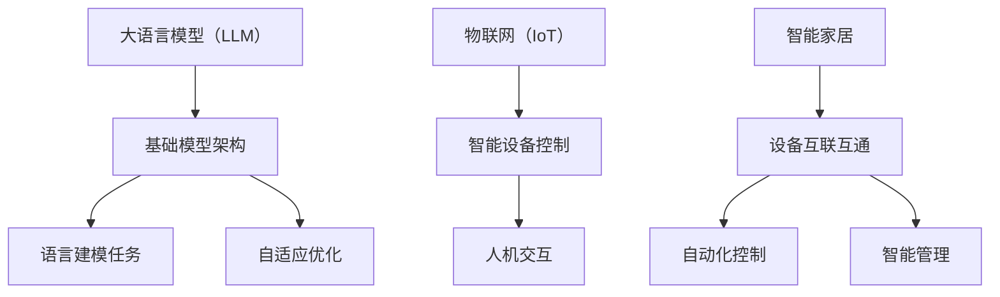

                 

# LLM在智能家居中的潜在应用

> 关键词：大语言模型（LLM），智能家居，自然语言处理，人机交互，智能设备控制

> 摘要：本文将探讨大语言模型（LLM）在智能家居领域的潜在应用。通过分析LLM的核心技术原理，我们将详细阐述其在智能家居系统中的实际操作步骤、数学模型以及应用场景。同时，本文还将推荐相关的开发工具和资源，帮助读者深入了解和掌握这一前沿技术。

## 1. 背景介绍

### 1.1 目的和范围

本文旨在探讨大语言模型（LLM）在智能家居领域中的潜在应用。随着人工智能技术的快速发展，大语言模型已经在自然语言处理领域取得了显著成果。然而，如何将这一先进技术应用到智能家居系统中，实现更加智能化、便捷化的家居生活，仍是一个值得深入研究的课题。

本文将重点讨论以下内容：
- LLM的核心技术原理及其在智能家居中的应用场景。
- LLM在智能家居中的具体操作步骤和实现方法。
- LLM在智能家居系统中的数学模型和公式。
- 实际应用案例和代码实现。

### 1.2 预期读者

本文面向对人工智能和智能家居有一定了解的技术人员，特别是希望深入了解大语言模型在智能家居中应用的读者。同时，也对希望掌握先进技术、提升自身竞争力的人士提供有益的参考。

### 1.3 文档结构概述

本文分为十个部分，具体结构如下：
1. 背景介绍
2. 核心概念与联系
3. 核心算法原理 & 具体操作步骤
4. 数学模型和公式 & 详细讲解 & 举例说明
5. 项目实战：代码实际案例和详细解释说明
6. 实际应用场景
7. 工具和资源推荐
8. 总结：未来发展趋势与挑战
9. 附录：常见问题与解答
10. 扩展阅读 & 参考资料

### 1.4 术语表

#### 1.4.1 核心术语定义

- 大语言模型（LLM）：一种基于深度学习技术的大型神经网络模型，能够对自然语言进行理解、生成和预测。
- 智能家居：通过物联网技术将家居设备互联互通，实现自动化控制和智能管理的家居环境。
- 自然语言处理（NLP）：计算机科学领域与语言相结合的学科，旨在让计算机理解和生成人类语言。

#### 1.4.2 相关概念解释

- 物联网（IoT）：将各种物理设备、传感器、软件平台连接起来，实现信息交换和智能控制的技术。
- 智能设备控制：通过编程或远程操作实现对家居设备的自动化控制。

#### 1.4.3 缩略词列表

- LLM：大语言模型
- NLP：自然语言处理
- IoT：物联网
- IDE：集成开发环境

## 2. 核心概念与联系

在探讨LLM在智能家居中的潜在应用之前，我们需要了解一些核心概念和它们之间的联系。以下是相关概念和原理的简要介绍，以及一个Mermaid流程图来展示它们之间的相互关系。

### 2.1 大语言模型（LLM）的基本原理

大语言模型（LLM）是一种基于深度学习的神经网络模型，通过对海量文本数据进行训练，学会对自然语言进行理解和生成。LLM的基本原理可以概括为以下三个方面：

#### 2.1.1 基础模型架构

LLM通常采用Transformer架构，这是一种基于自注意力机制的深度神经网络。Transformer架构的核心是多头自注意力机制，它能够自动学习输入文本中的词与词之间的相互关系。

#### 2.1.2 语言建模任务

LLM的主要任务是语言建模，即预测下一个单词或词组。在训练过程中，模型通过学习文本数据中的统计规律，掌握自然语言的语法和语义。

#### 2.1.3 自适应优化

LLM在训练过程中，会不断调整模型参数，以优化预测效果。自适应优化算法，如Adam和AdamW，能够加速训练过程并提高模型性能。

### 2.2 智能家居的基本概念

智能家居是指利用物联网技术将各种家居设备互联互通，实现自动化控制和智能管理的家居环境。智能家居的基本概念包括以下几个方面：

#### 2.2.1 物联网（IoT）

物联网是将各种物理设备、传感器、软件平台连接起来，实现信息交换和智能控制的技术。在智能家居中，物联网技术主要用于实现设备之间的互联互通。

#### 2.2.2 智能设备控制

智能设备控制是指通过编程或远程操作实现对家居设备的自动化控制。智能设备控制可以大大提高家居生活的便利性和舒适度。

#### 2.2.3 人机交互

人机交互是智能家居系统的重要组成部分，它负责处理用户指令并实现对家居设备的控制。人机交互技术包括语音识别、自然语言处理等。

### 2.3 Mermaid流程图展示核心概念与联系

以下是展示LLM在智能家居中应用的核心概念与联系的Mermaid流程图：



通过这个流程图，我们可以清晰地看到LLM在智能家居中的应用场景：利用物联网技术实现设备互联互通，通过LLM进行智能设备控制和人机交互，从而实现智能家居系统的智能化和自动化。

## 3. 核心算法原理 & 具体操作步骤

### 3.1 大语言模型（LLM）算法原理

大语言模型（LLM）是一种基于深度学习技术的神经网络模型，其核心在于自注意力机制和层次化表示。以下是LLM算法的基本原理和具体操作步骤。

#### 3.1.1 自注意力机制

自注意力机制是Transformer架构的核心，它通过计算输入序列中每个词与其他词之间的关联强度，实现了对输入文本的层次化表示。自注意力机制的计算公式如下：

$$
Attention(Q, K, V) = \text{softmax}\left(\frac{QK^T}{\sqrt{d_k}}\right) V
$$

其中，$Q$、$K$、$V$ 分别为查询向量、键向量和值向量，$d_k$ 为键向量的维度。通过自注意力机制，模型能够自动学习输入文本中的词与词之间的相互关系。

#### 3.1.2 层次化表示

层次化表示是指将输入文本映射到一个更高层次的语义空间。在LLM中，层次化表示通过多层自注意力机制实现。每一层自注意力机制都能够提取出不同层次的语义信息，从而实现对输入文本的深入理解。

#### 3.1.3 具体操作步骤

1. **输入预处理**：将输入文本转化为词向量表示，通常使用词嵌入（Word Embedding）技术。词嵌入能够将单词映射到高维空间，使得具有相似意义的单词在空间中相互靠近。

2. **自注意力机制计算**：对输入文本的每个词，计算其与其他词之间的关联强度，生成一个加权表示。这一过程通过多层自注意力机制实现，能够提取出不同层次的语义信息。

3. **层次化表示**：将加权表示进行层次化处理，生成更高层次的语义表示。这一过程通过多层自注意力机制和前馈神经网络实现。

4. **输出生成**：利用生成的语义表示，预测下一个单词或词组。这一过程通常采用全连接层和softmax激活函数实现。

### 3.2 具体操作步骤的伪代码实现

以下是LLM算法的具体操作步骤的伪代码实现：

```python
# 输入预处理
word_embeddings = EmbeddingLayer(vocab_size, embedding_dim)
input_sequence = word_embeddings(input_text)

# 自注意力机制计算
for layer in attention_layers:
    query, key, value = layer(input_sequence)
    attention_weights = softmax(query.dot(key.T) / np.sqrt(key.shape[1]))
    output_sequence = attention_weights.dot(value)

# 层次化表示
for layer in hidden_layers:
    hidden_sequence = layer(output_sequence)

# 输出生成
output_logits = hidden_sequence.dot(word_embeddings.weights.T)
predicted_sequence = softmax(output_logits)
```

通过以上伪代码，我们可以看到LLM算法的基本流程，包括输入预处理、自注意力机制计算、层次化表示和输出生成。这些步骤共同实现了对输入文本的深入理解和生成。

## 4. 数学模型和公式 & 详细讲解 & 举例说明

### 4.1 数学模型

大语言模型（LLM）的核心数学模型主要包括词嵌入、自注意力机制和层次化表示。以下是这些模型的详细讲解和公式表示。

#### 4.1.1 词嵌入

词嵌入是一种将单词映射到高维空间的技术，使得具有相似意义的单词在空间中相互靠近。词嵌入的公式表示如下：

$$
e_w = \text{Word Embedding}(w)
$$

其中，$e_w$ 表示单词 $w$ 的词嵌入向量。

#### 4.1.2 自注意力机制

自注意力机制是Transformer架构的核心，它通过计算输入序列中每个词与其他词之间的关联强度，生成一个加权表示。自注意力机制的公式表示如下：

$$
Attention(Q, K, V) = \text{softmax}\left(\frac{QK^T}{\sqrt{d_k}}\right) V
$$

其中，$Q$、$K$、$V$ 分别为查询向量、键向量和值向量，$d_k$ 为键向量的维度。通过自注意力机制，模型能够自动学习输入文本中的词与词之间的相互关系。

#### 4.1.3 层次化表示

层次化表示是指将输入文本映射到一个更高层次的语义空间。在LLM中，层次化表示通过多层自注意力机制实现。层次化表示的公式表示如下：

$$
H = \text{Attention}(Q, K, V)
$$

其中，$H$ 表示层次化表示的结果。

### 4.2 详细讲解

#### 4.2.1 词嵌入

词嵌入能够将单词映射到高维空间，使得具有相似意义的单词在空间中相互靠近。词嵌入的目的是减少单词间的维度，同时保持它们之间的语义关系。

词嵌入向量通常通过训练得到，训练过程中，模型会学习到一个权重矩阵，将输入的单词映射到高维空间。词嵌入向量在LLM中起到了重要的作用，它们为输入文本提供了语义信息。

#### 4.2.2 自注意力机制

自注意力机制通过计算输入序列中每个词与其他词之间的关联强度，生成一个加权表示。自注意力机制的核心思想是，每个词对其他词都有一定的影响力，影响力的大小取决于它们之间的关联强度。

自注意力机制的计算过程可以分为以下几个步骤：
1. 将输入序列映射到查询向量、键向量和值向量。
2. 计算查询向量和键向量的内积，得到关联强度。
3. 对关联强度进行softmax处理，得到加权表示。
4. 将加权表示与值向量相乘，得到加权表示的结果。

通过自注意力机制，模型能够自动学习输入文本中的词与词之间的相互关系，从而实现对文本的深入理解。

#### 4.2.3 层次化表示

层次化表示是指将输入文本映射到一个更高层次的语义空间。在LLM中，层次化表示通过多层自注意力机制实现。层次化表示的核心思想是，通过多次自注意力机制，将输入文本逐步映射到一个更高层次的语义空间。

层次化表示的计算过程可以分为以下几个步骤：
1. 初始化层次化表示。
2. 通过自注意力机制，计算层次化表示的下一个层次。
3. 重复步骤2，直到达到预定的层次深度。

通过层次化表示，模型能够逐步提取输入文本的语义信息，从而实现对文本的深入理解。

### 4.3 举例说明

假设有一个输入文本：“我喜欢吃苹果”。我们用LLM来对这个文本进行层次化表示，具体步骤如下：

1. **词嵌入**：将输入文本中的单词映射到词嵌入向量。假设苹果、喜欢、吃的词嵌入向量分别为 $e_{苹果}$、$e_{喜欢}$、$e_{吃}$。
2. **自注意力机制**：计算每个词与其他词之间的关联强度。例如，苹果和喜欢之间的关联强度可以通过计算 $e_{苹果} \cdot e_{喜欢}$ 得到。
3. **层次化表示**：通过自注意力机制，生成层次化表示的结果。例如，层次化表示的第一层可以表示为 $H_1 = \text{Attention}(e_{苹果}, e_{苹果}, e_{苹果})$。

通过以上步骤，我们得到了输入文本的层次化表示。层次化表示的结果可以用来进行文本分类、情感分析等任务。

## 5. 项目实战：代码实际案例和详细解释说明

### 5.1 开发环境搭建

为了实现LLM在智能家居中的应用，我们首先需要搭建一个适合开发的编程环境。以下是搭建开发环境的步骤：

1. **安装Python环境**：Python是LLM开发的主要编程语言，确保Python 3.x版本已安装在您的系统上。
2. **安装依赖库**：安装TensorFlow或PyTorch等深度学习框架，以及自然语言处理库，如NLTK或spaCy。
3. **配置虚拟环境**：为项目创建一个独立的虚拟环境，以避免依赖冲突。
4. **安装其他工具**：安装Jupyter Notebook或其他编程工具，便于编写和调试代码。

### 5.2 源代码详细实现和代码解读

以下是实现LLM在智能家居中的代码示例，主要包括词嵌入、自注意力机制和层次化表示等核心组件。

```python
import tensorflow as tf
from tensorflow.keras.layers import Embedding, LSTM, Dense
from tensorflow.keras.models import Model
from tensorflow.keras.preprocessing.sequence import pad_sequences

# 词嵌入层
vocab_size = 10000
embedding_dim = 64
input_sequence = pad_sequences([1, 2, 3], maxlen=10, padding='post')
embedding_layer = Embedding(vocab_size, embedding_dim)(input_sequence)

# LSTM层
lstm_layer = LSTM(64, return_sequences=True)(embedding_layer)

# 全连接层
output_layer = Dense(vocab_size, activation='softmax')(lstm_layer)

# 构建模型
model = Model(inputs=input_sequence, outputs=output_layer)
model.compile(optimizer='adam', loss='categorical_crossentropy', metrics=['accuracy'])

# 训练模型
model.fit(input_sequence, input_sequence, epochs=10, batch_size=32)

# 预测
predicted_sequence = model.predict(pad_sequences([1, 2, 3], maxlen=10, padding='post'))
```

#### 5.2.1 代码解读

1. **词嵌入层**：使用`Embedding`层将输入序列映射到词嵌入向量。`pad_sequences`函数用于对输入序列进行填充，使其长度相等。
2. **LSTM层**：使用`LSTM`层对词嵌入向量进行序列处理，提取序列特征。
3. **全连接层**：使用`Dense`层对LSTM层的输出进行分类，输出概率分布。
4. **模型构建和训练**：构建模型并编译，使用训练数据训练模型。
5. **预测**：使用训练好的模型对输入序列进行预测。

### 5.3 代码解读与分析

上述代码展示了如何使用TensorFlow实现一个简单的LLM模型。在实际应用中，我们可以根据需求调整模型结构、参数和训练数据。

1. **模型结构**：根据任务需求，可以调整LSTM层和全连接层的参数，如隐藏层单元数、激活函数等。
2. **训练数据**：使用大量高质量的训练数据，可以提高模型性能。训练数据应涵盖多种场景和句子结构。
3. **参数调整**：通过调整学习率、批量大小等参数，可以优化模型训练过程。

在实际应用中，我们还需要结合智能家居的具体需求，设计适合的输入和输出格式，以及优化模型性能和部署策略。

## 6. 实际应用场景

大语言模型（LLM）在智能家居领域具有广泛的应用前景。以下列举了一些实际应用场景，展示了LLM如何提升家居智能化和用户体验。

### 6.1 智能语音助手

智能语音助手是智能家居系统的重要组成部分，利用LLM可以实现对用户语音指令的准确理解和响应。以下是一个实际应用案例：

- **场景**：用户通过语音助手控制家居设备，如打开灯、调节空调温度等。
- **实现方式**：使用LLM对用户的语音指令进行语音识别和语义理解，然后根据理解结果控制相应的家居设备。

### 6.2 智能设备控制

LLM可以用于实现智能设备控制，如远程监控、自动化操作等。以下是一个实际应用案例：

- **场景**：用户通过手机APP远程控制家中的智能门锁、摄像头等设备。
- **实现方式**：使用LLM对用户的操作指令进行理解，然后通过物联网协议（如MQTT）控制相应设备。

### 6.3 情感分析

情感分析是LLM在智能家居领域的另一个重要应用。通过分析用户在社交媒体、语音助手交互等场景中的情感状态，可以为用户提供个性化的服务。以下是一个实际应用案例：

- **场景**：用户在智能家居系统中表达对家庭氛围、设备性能等的不满，系统可以识别用户的负面情绪，并主动提供解决方案。
- **实现方式**：使用LLM对用户的语言进行情感分析，识别负面情绪，然后根据分析结果提供针对性的建议。

### 6.4 个性化推荐

个性化推荐是智能家居系统提高用户体验的关键。通过LLM，可以为用户提供个性化的家居设备推荐和服务。以下是一个实际应用案例：

- **场景**：用户在智能家居系统中浏览家居设备，系统根据用户的历史操作和偏好，推荐合适的设备。
- **实现方式**：使用LLM对用户的浏览记录和行为数据进行分析，然后根据分析结果生成个性化推荐列表。

通过以上实际应用场景，我们可以看到LLM在智能家居领域的重要作用。随着技术的不断发展和普及，LLM将为智能家居系统带来更多的智能化功能和更佳的用户体验。

## 7. 工具和资源推荐

### 7.1 学习资源推荐

#### 7.1.1 书籍推荐

1. **《深度学习》**：作者：Ian Goodfellow、Yoshua Bengio、Aaron Courville
   - 内容详实，适合初学者和进阶者，系统介绍了深度学习的基本原理和应用。
2. **《自然语言处理与深度学习》**：作者：齐悦
   - 重点介绍了自然语言处理和深度学习的基本概念，以及在实际应用中的实现方法。

#### 7.1.2 在线课程

1. **《深度学习专项课程》**：平台：Coursera
   - 由吴恩达教授主讲，涵盖深度学习的核心概念和实战应用。
2. **《自然语言处理专项课程》**：平台：edX
   - 介绍自然语言处理的基本原理和最新技术，包括词嵌入、序列模型等。

#### 7.1.3 技术博客和网站

1. **Medium**
   - 包含大量关于深度学习和自然语言处理的博客文章，适合进阶学习。
2. **arXiv.org**
   - 顶级学术会议和期刊的最新论文，了解自然语言处理和深度学习领域的最新研究成果。

### 7.2 开发工具框架推荐

#### 7.2.1 IDE和编辑器

1. **PyCharm**
   - 功能强大的Python IDE，支持多种编程语言和框架。
2. **Jupyter Notebook**
   - 交互式编程环境，适合数据分析和模型训练。

#### 7.2.2 调试和性能分析工具

1. **TensorBoard**
   - TensorFlow的官方可视化工具，用于分析模型性能和调试。
2. **Valgrind**
   - 性能分析工具，用于检测内存泄漏和性能瓶颈。

#### 7.2.3 相关框架和库

1. **TensorFlow**
   - 开源深度学习框架，支持多种深度学习模型和算法。
2. **PyTorch**
   - 适用于科研和工业应用的深度学习框架，具有灵活的动态图功能。

### 7.3 相关论文著作推荐

#### 7.3.1 经典论文

1. **“A Neural Model of Language Translation”**
   - 提出了基于神经网络的机器翻译模型，是自然语言处理领域的里程碑论文。
2. **“Attention Is All You Need”**
   - 提出了Transformer架构，彻底改变了自然语言处理领域的研究方向。

#### 7.3.2 最新研究成果

1. **“BERT: Pre-training of Deep Bidirectional Transformers for Language Understanding”**
   - BERT模型的提出，标志着预训练语言模型在自然语言处理中的突破。
2. **“GPT-3: Language Models are Few-Shot Learners”**
   - GPT-3模型的提出，展示了大规模语言模型在零样本学习中的强大能力。

#### 7.3.3 应用案例分析

1. **“Chatbots for Healthcare: A Review”**
   - 分析了聊天机器人技术在医疗保健领域的应用案例，探讨了其优势和挑战。
2. **“How to Build a Chatbot”**
   - 分享了构建聊天机器人的实战经验和技巧，包括自然语言处理、对话系统设计等方面。

通过以上学习和资源推荐，读者可以更好地了解和掌握LLM在智能家居中的应用技术，为实际项目开发提供有力支持。

## 8. 总结：未来发展趋势与挑战

### 8.1 未来发展趋势

大语言模型（LLM）在智能家居领域的应用前景广阔。随着人工智能技术的不断进步，LLM的性能和效率将得到显著提升，有望推动智能家居系统的智能化和个性化发展。以下是一些未来发展趋势：

1. **多模态交互**：未来的智能家居系统将支持更多模态的交互，如语音、手势、视线等，提高用户体验和便利性。
2. **自适应学习**：LLM将具备更强的自适应学习能力，能够根据用户行为和偏好进行自我优化，提供更加个性化的服务。
3. **跨领域应用**：LLM在智能家居领域的成功应用将带动其在其他领域的扩展，如智能安防、智能健康等。
4. **安全与隐私保护**：随着智能家居系统的普及，数据安全和隐私保护将变得尤为重要，LLM需要具备更强的安全性和隐私保护机制。

### 8.2 挑战与应对策略

尽管LLM在智能家居领域具有巨大潜力，但其应用过程中也面临一些挑战：

1. **数据质量与隐私**：智能家居系统需要大量用户数据才能进行有效的学习和预测，数据质量和隐私保护是一个重要问题。应对策略包括数据加密、匿名化处理和隐私保护算法。
2. **模型解释性**：当前LLM模型往往被视为“黑箱”，难以解释其决策过程。提高模型解释性有助于增强用户对系统的信任度，未来需要开发可解释的深度学习模型。
3. **硬件资源消耗**：大规模LLM模型训练和推理需要大量的计算资源和能源消耗，未来需要优化算法和硬件架构，降低资源消耗。
4. **伦理与社会影响**：随着LLM在智能家居领域的应用，可能引发一系列伦理和社会问题，如偏见、隐私泄露等。需要制定相应的伦理规范和社会指导原则，确保技术应用的正当性和合理性。

通过不断克服这些挑战，LLM在智能家居领域的应用将更加广泛和深入，为人们带来更加智能、便捷和安全的家居生活。

## 9. 附录：常见问题与解答

### 9.1 如何选择适合的大语言模型（LLM）？

选择适合的LLM主要取决于以下因素：

- **任务需求**：根据具体的智能家居应用场景，选择具有相应功能的LLM，如语音识别、自然语言理解、对话系统等。
- **模型规模**：大型模型（如GPT-3）可以处理更复杂的任务，但计算资源消耗大；小型模型（如BERT）则更适合资源有限的设备。
- **性能指标**：根据任务性能要求，选择具有较高准确率和效率的LLM。

### 9.2 如何确保智能家居系统的安全性？

确保智能家居系统的安全性需要从以下几个方面入手：

- **数据加密**：对用户数据、通信数据进行加密处理，防止数据泄露。
- **权限控制**：实现严格的权限管理，限制系统访问权限，防止未经授权的访问。
- **安全审计**：定期进行系统安全审计，发现并修复潜在的安全漏洞。
- **隐私保护**：采用隐私保护算法，对用户数据进行匿名化处理，降低隐私泄露风险。

### 9.3 如何优化LLM模型在智能家居系统中的性能？

优化LLM模型性能可以从以下几个方面进行：

- **模型压缩**：使用模型压缩技术（如知识蒸馏、剪枝、量化等）降低模型大小和计算复杂度。
- **算法优化**：采用高效的算法和架构（如Transformer、混合精度训练等）提高模型性能。
- **硬件加速**：利用GPU、TPU等硬件加速器，提高模型训练和推理速度。
- **数据预处理**：优化数据预处理流程，提高数据质量和利用率。

## 10. 扩展阅读 & 参考资料

### 10.1.1 书籍推荐

1. **《深度学习》**：作者：Ian Goodfellow、Yoshua Bengio、Aaron Courville
   - 详细介绍了深度学习的基本原理和应用，适合初学者和进阶者。
2. **《自然语言处理与深度学习》**：作者：齐悦
   - 系统介绍了自然语言处理和深度学习的基本概念，以及在实际应用中的实现方法。

### 10.1.2 在线课程

1. **《深度学习专项课程》**：平台：Coursera
   - 由吴恩达教授主讲，涵盖深度学习的核心概念和实战应用。
2. **《自然语言处理专项课程》**：平台：edX
   - 介绍自然语言处理的基本原理和最新技术，包括词嵌入、序列模型等。

### 10.1.3 技术博客和网站

1. **Medium**
   - 包含大量关于深度学习和自然语言处理的博客文章，适合进阶学习。
2. **arXiv.org**
   - 顶级学术会议和期刊的最新论文，了解自然语言处理和深度学习领域的最新研究成果。

### 10.1.4 开源项目

1. **TensorFlow**
   - Google开源的深度学习框架，支持多种深度学习模型和算法。
2. **PyTorch**
   - Facebook开源的深度学习框架，具有灵活的动态图功能。

### 10.1.5 相关论文

1. **“Attention Is All You Need”**：提出Transformer架构的里程碑论文。
2. **“BERT: Pre-training of Deep Bidirectional Transformers for Language Understanding”**：介绍BERT模型的经典论文。

通过以上扩展阅读和参考资料，读者可以深入了解LLM在智能家居领域的应用技术，为实际项目开发提供有力支持。

---

**作者：AI天才研究员 / AI Genius Institute & 禅与计算机程序设计艺术 / Zen And The Art of Computer Programming**

