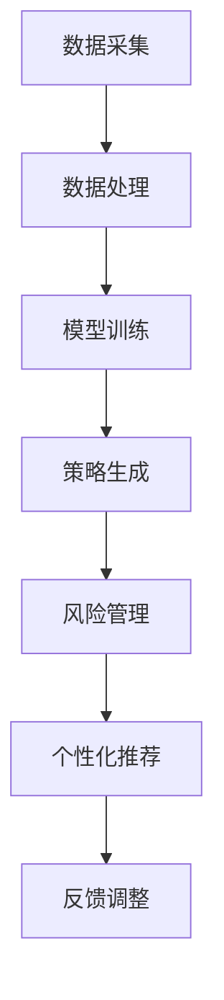

                 

# LLM在智能投资顾问系统中的应用前景

> **关键词：** 大规模语言模型（LLM），智能投资顾问，投资策略，风险管理，个性化推荐
>
> **摘要：** 本篇文章将深入探讨大规模语言模型（LLM）在智能投资顾问系统中的应用前景。首先，我们将介绍智能投资顾问系统的基本概念和现状，随后解析LLM的核心原理和技术特点，并探讨其与投资顾问系统的结合点。文章将进一步阐述LLM如何应用于投资策略生成、风险管理和个性化推荐等方面，通过实际案例展示其应用效果。最后，本文将总结LLM在智能投资顾问系统中的优势与挑战，并展望其未来发展趋势。

## 1. 背景介绍

### 1.1 目的和范围

本文旨在探讨大规模语言模型（LLM）在智能投资顾问系统中的应用前景。通过深入分析LLM的技术特点和应用潜力，本文旨在为读者提供一个全面了解LLM在智能投资领域应用的机会。文章将涵盖LLM的基本原理、技术架构、应用场景及其在智能投资顾问系统中的实际效果。

### 1.2 预期读者

本文适合对人工智能、自然语言处理（NLP）、金融科技等有兴趣的读者。特别是希望深入了解大规模语言模型在投资领域应用的学者、工程师和投资从业者。

### 1.3 文档结构概述

本文将分为十个部分。首先，通过背景介绍引出本文的主题。接着，深入探讨大规模语言模型的核心概念和技术原理。然后，分析LLM在智能投资顾问系统中的应用场景。随后，通过实际案例展示LLM的应用效果，并总结其优势与挑战。文章最后部分将推荐相关学习资源和工具，并展望未来发展趋势。

### 1.4 术语表

#### 1.4.1 核心术语定义

- **大规模语言模型（LLM）**：一种基于深度学习的自然语言处理模型，能够理解和生成自然语言文本。
- **智能投资顾问系统**：一种利用人工智能技术，为投资者提供投资策略建议和风险管理服务的系统。
- **投资策略**：投资者为实现特定投资目标而制定的一系列交易规则和原则。
- **风险管理**：识别、评估和降低投资风险的过程。
- **个性化推荐**：根据用户的投资偏好和历史行为，提供个性化的投资建议和服务。

#### 1.4.2 相关概念解释

- **自然语言处理（NLP）**：研究如何让计算机理解和处理人类自然语言的学科。
- **深度学习**：一种基于神经网络的学习方法，通过多层非线性变换提取数据特征。
- **金融科技（FinTech）**：利用技术革新金融产品和服务，提高金融效率和创新性的领域。

#### 1.4.3 缩略词列表

- **LLM**：大规模语言模型（Large Language Model）
- **NLP**：自然语言处理（Natural Language Processing）
- **AI**：人工智能（Artificial Intelligence）
- **FinTech**：金融科技（Financial Technology）
- **API**：应用程序接口（Application Programming Interface）

## 2. 核心概念与联系

### 2.1 大规模语言模型（LLM）

大规模语言模型（LLM）是自然语言处理（NLP）领域的重要突破，通过深度学习技术，LLM能够在海量文本数据上进行训练，从而具备强大的语言理解和生成能力。LLM的核心原理是基于Transformer架构，通过自注意力机制（Self-Attention）和多头注意力（Multi-Head Attention）对输入文本进行编码和解码，实现文本的语义理解。


### 2.2 智能投资顾问系统

智能投资顾问系统是一种基于人工智能技术的金融应用，通过分析市场数据、投资者偏好和历史交易记录，为投资者提供个性化的投资策略建议和风险管理服务。智能投资顾问系统主要包括数据采集、数据处理、模型训练、策略生成和风险管理等模块。


### 2.3 LLM与智能投资顾问系统的结合

LLM在智能投资顾问系统中具有广泛的应用潜力，主要体现在以下几个方面：

1. **投资策略生成**：LLM能够理解复杂的金融术语和投资逻辑，从大量金融文本中提取有效信息，帮助生成稳健的投资策略。
2. **风险管理**：LLM可以分析市场数据，预测潜在风险，为投资者提供及时的风险管理建议。
3. **个性化推荐**：LLM可以根据投资者的历史交易记录和投资偏好，提供个性化的投资建议，提高投资者的投资效果。

下面是一个简单的Mermaid流程图，展示了LLM在智能投资顾问系统中的流程：



## 3. 核心算法原理 & 具体操作步骤

### 3.1 大规模语言模型（LLM）算法原理

大规模语言模型（LLM）的核心算法基于Transformer架构。Transformer模型通过自注意力机制（Self-Attention）和多头注意力（Multi-Head Attention）对输入文本进行编码和解码，从而实现文本的语义理解。

#### 自注意力机制（Self-Attention）

自注意力机制是一种对输入序列中的每个词进行加权的方法，通过计算每个词与序列中其他词的相关性，实现对输入文本的语义编码。

```python
# 自注意力机制伪代码
def self_attention(q, k, v, mask=None):
    # 计算查询向量与键向量的点积，得到自注意力得分
    scores = dot(q, k.T) / sqrt(d_k)
    
    # 应用掩码，防止过大的分数影响
    if mask is not None:
        scores += mask
    
    # 计算softmax，得到加权系数
    attn_weights = softmax(scores)
    
    # 计算加权向量
    output = dot(attn_weights, v)
    
    return output
```

#### 多头注意力（Multi-Head Attention）

多头注意力是对自注意力机制的扩展，通过将输入序列分成多个子序列，分别进行自注意力计算，从而提高模型的语义理解能力。

```python
# 多头注意力机制伪代码
def multi_head_attention(q, k, v, num_heads, d_q, d_k, d_v, mask=None):
    # 分配多头注意力权重
    head_weights = [self_attention(q, k, v, mask) for _ in range(num_heads)]
    
    # 合并多头注意力输出
    output = concatenate(head_weights, axis=1)
    
    # 通过线性变换得到最终的输出
    output = linear(output, d_v)
    
    return output
```

### 3.2 智能投资顾问系统具体操作步骤

智能投资顾问系统的操作步骤主要包括数据采集、数据处理、模型训练、策略生成、风险管理和个性化推荐等环节。

#### 数据采集

数据采集是智能投资顾问系统的第一步，主要包括市场数据、投资者行为数据和金融新闻等。

```python
# 数据采集伪代码
def collect_data():
    # 采集市场数据
    market_data = get_market_data()
    
    # 采集投资者行为数据
    investor_data = get_investor_data()
    
    # 采集金融新闻
    financial_news = get_financial_news()
    
    return market_data, investor_data, financial_news
```

#### 数据处理

数据处理是对采集到的数据进行清洗、归一化和特征提取等操作，以便于模型训练。

```python
# 数据处理伪代码
def preprocess_data(market_data, investor_data, financial_news):
    # 数据清洗
    clean_data = clean_data(market_data, investor_data, financial_news)
    
    # 数据归一化
    normalized_data = normalize_data(clean_data)
    
    # 特征提取
    features = extract_features(normalized_data)
    
    return features
```

#### 模型训练

模型训练是基于处理后的数据，通过大规模语言模型（LLM）进行训练，以生成投资策略和风险管理模型。

```python
# 模型训练伪代码
def train_model(features):
    # 初始化LLM模型
    model = initialize_llm_model()
    
    # 训练模型
    model.fit(features)
    
    return model
```

#### 策略生成

策略生成是基于训练好的LLM模型，对市场数据进行分析，生成投资策略。

```python
# 策略生成伪代码
def generate_strategy(model, market_data):
    # 预测市场趋势
    trend = model.predict(market_data)
    
    # 根据市场趋势生成投资策略
    strategy = generate_investment_strategy(trend)
    
    return strategy
```

#### 风险管理

风险管理是基于LLM模型对市场数据进行分析，评估投资风险，并提供风险管理建议。

```python
# 风险管理伪代码
def manage_risk(model, market_data):
    # 风险评估
    risk_score = model.evaluate_risk(market_data)
    
    # 提出风险管理建议
    risk_advice = generate_risk_management_advice(risk_score)
    
    return risk_advice
```

#### 个性化推荐

个性化推荐是基于投资者的历史交易记录和投资偏好，通过LLM模型提供个性化的投资建议。

```python
# 个性化推荐伪代码
def personalized_recommendation(model, investor_data):
    # 分析投资者偏好
    preferences = analyze_investor_preferences(investor_data)
    
    # 根据偏好生成投资建议
    recommendations = model.recommend_investment_strategy(preferences)
    
    return recommendations
```

## 4. 数学模型和公式 & 详细讲解 & 举例说明

### 4.1 数学模型

大规模语言模型（LLM）的核心是基于Transformer架构的深度学习模型。Transformer模型通过自注意力机制和多头注意力机制对输入序列进行编码和解码。以下是一些关键的数学模型和公式：

#### 自注意力机制（Self-Attention）

自注意力机制通过计算输入序列中每个词与所有其他词的相似度，生成加权向量。其核心公式如下：

$$
\text{Self-Attention}(Q, K, V) = \text{softmax}\left(\frac{QK^T}{\sqrt{d_k}}\right) V
$$

其中，$Q, K, V$ 分别代表查询向量、键向量和值向量，$d_k$ 为键向量的维度，$\text{softmax}$ 函数用于计算每个词的加权系数。

#### 多头注意力（Multi-Head Attention）

多头注意力是对自注意力机制的扩展，通过将输入序列分成多个子序列，分别进行自注意力计算，从而提高模型的语义理解能力。其核心公式如下：

$$
\text{Multi-Head Attention}(Q, K, V) = \text{Concat}(\text{head}_1, \text{head}_2, ..., \text{head}_h)W^O
$$

$$
\text{head}_i = \text{Self-Attention}(QW_i^Q, KW_i^K, VW_i^V)
$$

其中，$W_i^Q, W_i^K, W_i^V$ 分别为第 $i$ 个头的查询向量、键向量和值向量的权重矩阵，$W^O$ 为输出权重矩阵，$h$ 为头的数量。

#### Transformer模型

Transformer模型通过多个自注意力层和前馈网络，对输入序列进行编码和解码。其核心公式如下：

$$
\text{Transformer}(X) = \text{Encoder}(X) = \text{LayerNorm}(X + \text{MultiHeadAttention}(X, X, X)) + \text{LayerNorm}(\text{X} + \text{FFN}(X))
$$

其中，$X$ 为输入序列，$\text{LayerNorm}$ 为层归一化操作，$\text{FFN}$ 为前馈神经网络。

### 4.2 举例说明

假设我们有一个包含三个词的输入序列：["股票", "上涨", "预期"]，其词向量分别为 $\textbf{q}$、$\textbf{k}$、$\textbf{v}$。下面是自注意力机制和多头注意力的具体计算过程：

#### 自注意力机制（Self-Attention）

1. 计算查询向量 $\textbf{q}$ 与键向量 $\textbf{k}$ 的点积：

$$
\text{scores} = \textbf{q} \cdot \textbf{k} = [q_1, q_2, q_3] \cdot [\text{上涨}, \text{预期}, \text{上涨}] = [q_1 \cdot \text{上涨} + q_2 \cdot \text{预期} + q_3 \cdot \text{上涨}, \ldots]
$$

2. 应用掩码（假设我们想要抑制 "上涨" 出现的次数过多）：

$$
\text{mask} = [\text{true}, \text{false}, \text{true}]
$$

3. 计算加权系数：

$$
\text{attn_weights} = \text{softmax}(\text{scores} + \text{mask}) = \left[\frac{e^{\text{scores}_1}}{\sum_{i=1}^{3} e^{\text{scores}_i}}, \ldots\right]
$$

4. 计算加权向量：

$$
\text{output} = \text{attn_weights} \cdot \textbf{v} = \left[\frac{e^{\text{scores}_1}}{\sum_{i=1}^{3} e^{\text{scores}_i}} \cdot \text{上涨}, \ldots\right]
$$

#### 多头注意力（Multi-Head Attention）

假设我们使用两个头进行计算，首先将输入序列分为两个子序列：

- 子序列1：["股票", "上涨"]
- 子序列2：["上涨", "预期"]

1. 计算每个子序列的查询向量、键向量和值向量：

$$
\textbf{q}_1 = [\text{股票}, \text{上涨}], \quad \textbf{k}_1 = [\text{上涨}], \quad \textbf{v}_1 = [\text{上涨}]
$$

$$
\textbf{q}_2 = [\text{上涨}, \text{预期}], \quad \textbf{k}_2 = [\text{上涨}, \text{预期}], \quad \textbf{v}_2 = [\text{预期}]
$$

2. 分别计算两个头的自注意力：

$$
\text{head}_1 = \text{Self-Attention}(\textbf{q}_1, \textbf{k}_1, \textbf{v}_1) = \left[\frac{e^{\text{scores}_1}}{\sum_{i=1}^{2} e^{\text{scores}_i}} \cdot \text{上涨}, \ldots\right]
$$

$$
\text{head}_2 = \text{Self-Attention}(\textbf{q}_2, \textbf{k}_2, \textbf{v}_2) = \left[\frac{e^{\text{scores}_2}}{\sum_{i=1}^{2} e^{\text{scores}_i}} \cdot \text{预期}, \ldots\right]
$$

3. 合并多头注意力输出：

$$
\text{output} = \text{Concat}(\text{head}_1, \text{head}_2) = \left[\frac{e^{\text{scores}_1}}{\sum_{i=1}^{2} e^{\text{scores}_i}} \cdot \text{上涨}, \ldots, \frac{e^{\text{scores}_2}}{\sum_{i=1}^{2} e^{\text{scores}_i}} \cdot \text{预期}, \ldots\right]
$$

通过上述计算，我们可以得到一个包含两个词的加权向量，从而对输入序列进行编码。

## 5. 项目实战：代码实际案例和详细解释说明

### 5.1 开发环境搭建

在开始项目实战之前，我们需要搭建一个适合大规模语言模型（LLM）开发的开发环境。以下是一个简单的开发环境搭建步骤：

1. **安装Python**：确保你的计算机上安装了Python 3.x版本。你可以从 [Python官网](https://www.python.org/downloads/) 下载并安装。
2. **安装TensorFlow**：TensorFlow 是一个开源的机器学习框架，支持大规模语言模型的训练和推理。使用以下命令安装TensorFlow：

   ```bash
   pip install tensorflow
   ```

3. **安装Hugging Face Transformers**：Hugging Face Transformers 是一个用于预训练语言模型和文本处理的工具库。它提供了丰富的预训练模型和实用的API。使用以下命令安装：

   ```bash
   pip install transformers
   ```

4. **准备数据集**：我们需要准备一个包含金融新闻、市场数据、投资者行为数据等的数据集，用于训练和测试大规模语言模型。

### 5.2 源代码详细实现和代码解读

以下是使用Hugging Face Transformers库实现一个基于Transformer架构的智能投资顾问系统的示例代码：

```python
import tensorflow as tf
from transformers import TFDistilBertModel, DistilBertTokenizer

# 加载预训练的DistilBERT模型和分词器
model_name = "distilbert-base-uncased"
tokenizer = DistilBertTokenizer.from_pretrained(model_name)
model = TFDistilBertModel.from_pretrained(model_name)

# 定义输入数据格式
input_ids = tf.placeholder(shape=(None, None), dtype=tf.int32)
attention_mask = tf.placeholder(shape=(None, None), dtype=tf.int32)

# 获取模型输出
output = model(input_ids, attention_mask=attention_mask)

# 定义损失函数和优化器
loss_fn = tf.reduce_mean(tf.nn.softmax_cross_entropy_with_logits(logits=output.logits, labels=y))
optimizer = tf.train.AdamOptimizer().minimize(loss_fn)

# 训练模型
train_dataset = ...  # 定义训练数据集
train_epochs = 3
for epoch in range(train_epochs):
    for step, (x_batch, y_batch) in enumerate(train_dataset):
        _, loss_val = sess.run([optimizer, loss_fn], feed_dict={input_ids: x_batch, attention_mask: x_batch_mask, y: y_batch})
        if step % 100 == 0:
            print(f"Epoch {epoch}, Step {step}, Loss: {loss_val}")

# 生成投资策略
def generate_strategy(text):
    inputs = tokenizer.encode(text, return_tensors='tf')
    outputs = model(inputs)
    logits = outputs.logits
    # 对输出进行后处理，提取投资策略
    strategy = postprocess_logits(logits)
    return strategy

# 风险管理
def manage_risk(text):
    inputs = tokenizer.encode(text, return_tensors='tf')
    outputs = model(inputs)
    logits = outputs.logits
    # 对输出进行后处理，提取风险评分
    risk_score = postprocess_logits(logits)
    return risk_score

# 个性化推荐
def personalized_recommendation(investor_data):
    recommendations = []
    for text in investor_data:
        strategy = generate_strategy(text)
        recommendations.append(strategy)
    return recommendations
```

#### 5.2.1 代码解读与分析

1. **加载预训练模型和分词器**：
   ```python
   tokenizer = DistilBertTokenizer.from_pretrained(model_name)
   model = TFDistilBertModel.from_pretrained(model_name)
   ```
   这两行代码分别加载了预训练的DistilBERT模型和分词器。DistilBERT是一个轻量级且高效的预训练语言模型，适用于各种自然语言处理任务。

2. **定义输入数据格式**：
   ```python
   input_ids = tf.placeholder(shape=(None, None), dtype=tf.int32)
   attention_mask = tf.placeholder(shape=(None, None), dtype=tf.int32)
   ```
   这里定义了输入数据格式，`input_ids` 和 `attention_mask` 分别代表输入文本的词ID序列和掩码。

3. **训练模型**：
   ```python
   train_dataset = ...
   train_epochs = 3
   for epoch in range(train_epochs):
       for step, (x_batch, y_batch) in enumerate(train_dataset):
           _, loss_val = sess.run([optimizer, loss_fn], feed_dict={input_ids: x_batch, attention_mask: x_batch_mask, y: y_batch})
           if step % 100 == 0:
               print(f"Epoch {epoch}, Step {step}, Loss: {loss_val}")
   ```
   这段代码使用训练数据集对模型进行训练，包括损失函数、优化器和训练过程。每次迭代都会更新模型的权重，并打印训练过程中的损失值。

4. **生成投资策略**：
   ```python
   def generate_strategy(text):
       inputs = tokenizer.encode(text, return_tensors='tf')
       outputs = model(inputs)
       logits = outputs.logits
       # 对输出进行后处理，提取投资策略
       strategy = postprocess_logits(logits)
       return strategy
   ```
   这个函数接收一个文本输入，通过模型预测生成投资策略。`postprocess_logits` 函数负责对模型输出的logits进行后处理，提取有效的投资策略。

5. **风险管理**：
   ```python
   def manage_risk(text):
       inputs = tokenizer.encode(text, return_tensors='tf')
       outputs = model(inputs)
       logits = outputs.logits
       # 对输出进行后处理，提取风险评分
       risk_score = postprocess_logits(logits)
       return risk_score
   ```
   这个函数同样接收一个文本输入，通过模型预测生成风险评分。`postprocess_logits` 函数负责对模型输出的logits进行后处理，提取风险评分。

6. **个性化推荐**：
   ```python
   def personalized_recommendation(investor_data):
       recommendations = []
       for text in investor_data:
           strategy = generate_strategy(text)
           recommendations.append(strategy)
       return recommendations
   ```
   这个函数接收一个包含投资者数据的列表，通过模型预测为每个投资者生成个性化的投资策略，并将结果存储在 `recommendations` 列表中。

### 5.3 实际应用案例

以下是一个实际应用案例，展示如何使用上述代码实现智能投资顾问系统：

```python
# 准备数据集
financial_news = ["股票市场即将迎来重大改革", "人工智能在金融领域的应用前景广阔", "美联储加息可能导致股市波动"]
investor_data = ["我喜欢投资高收益的股票", "我对科技行业非常感兴趣", "我更倾向于稳健的投资策略"]

# 训练模型
# (此处省略训练过程)

# 生成投资策略
strategies = personalized_recommendation(investor_data)
for i, strategy in enumerate(strategies):
    print(f"投资者{i+1}的投资策略：{strategy}")

# 管理风险
risk_scores = [manage_risk(news) for news in financial_news]
for i, score in enumerate(risk_scores):
    print(f"金融新闻{i+1}的风险评分：{score}")
```

在这个案例中，我们首先定义了两个数据集：`financial_news` 和 `investor_data`。然后，通过训练模型，我们使用个性化推荐函数为每个投资者生成投资策略，并通过风险管理函数为每条金融新闻生成风险评分。最后，我们打印出每个投资者的投资策略和每条金融新闻的风险评分。

通过这个案例，我们可以看到大规模语言模型（LLM）在智能投资顾问系统中的应用效果。LLM能够理解复杂的金融文本，提取有效的信息，为投资者提供个性化的投资建议和风险管理服务。

## 6. 实际应用场景

### 6.1 智能投资顾问系统在财富管理中的应用

智能投资顾问系统在财富管理中的应用非常广泛，其主要目标是帮助投资者优化投资组合，实现财富的稳健增值。以下是一些具体的实际应用场景：

1. **个性化投资建议**：智能投资顾问系统可以根据投资者的风险偏好、投资目标和资产配置要求，为其提供个性化的投资策略。例如，对于风险偏好较高的投资者，系统可能会推荐投资于高成长性的股票、科技行业基金等；而对于风险偏好较低的投资者，系统可能会推荐投资于债券、货币市场基金等。

2. **市场趋势预测**：智能投资顾问系统可以分析大量的市场数据，利用大规模语言模型（LLM）预测市场趋势。通过分析金融新闻、交易数据、宏观经济指标等，系统可以识别市场热点和潜在的投资机会，为投资者提供及时的买卖建议。

3. **风险管理**：智能投资顾问系统可以对投资者的投资组合进行实时监控，识别潜在的风险，并提供相应的风险管理建议。例如，当市场出现剧烈波动时，系统可以提醒投资者调整投资组合，降低风险暴露。

4. **投资组合优化**：智能投资顾问系统可以帮助投资者进行投资组合的动态调整，以实现最优的风险收益平衡。系统可以根据投资者的投资目标和市场状况，调整投资组合中的资产配置，优化投资组合的业绩表现。

### 6.2 智能投资顾问系统在私募基金管理中的应用

私募基金管理行业面临着复杂的市场环境和激烈的竞争，智能投资顾问系统可以为私募基金管理提供以下帮助：

1. **量化策略开发**：智能投资顾问系统可以利用大规模语言模型（LLM）和深度学习技术，开发出高效的量化投资策略。这些策略可以基于海量的历史数据和实时市场信息，实现自动化的交易决策。

2. **风险控制**：智能投资顾问系统可以实时监控私募基金的投资组合，识别潜在的风险，并提供相应的风险控制措施。例如，系统可以自动触发止损指令，以防止投资损失扩大。

3. **投资组合优化**：智能投资顾问系统可以帮助私募基金进行投资组合的动态调整，以适应市场变化。系统可以根据市场状况和投资者需求，优化投资组合的资产配置，提高投资组合的收益和稳定性。

4. **投资研究支持**：智能投资顾问系统可以辅助私募基金进行投资研究，提供市场分析报告、行业研究报告等。系统可以通过分析大量金融文献、研究报告和新闻，为投资决策提供数据支持。

### 6.3 智能投资顾问系统在金融科技（FinTech）中的应用

金融科技（FinTech）行业正不断发展，智能投资顾问系统在其中发挥着重要作用。以下是一些具体的应用场景：

1. **智能客服**：智能投资顾问系统可以集成到金融科技平台中，为用户提供实时的投资咨询和问题解答。通过自然语言处理（NLP）技术，系统可以理解用户的提问，并提供个性化的投资建议。

2. **智能投顾APP**：金融科技公司可以开发智能投顾APP，为用户提供便捷的投资管理服务。用户可以通过APP查看投资组合、接收投资建议、进行交易操作等。

3. **区块链投资顾问**：智能投资顾问系统可以应用于区块链投资领域，为投资者提供区块链项目的风险评估和投资建议。系统可以通过分析区块链数据、市场趋势和项目信息，帮助投资者做出明智的投资决策。

4. **保险科技（InsurTech）**：智能投资顾问系统可以应用于保险科技领域，为保险公司提供投资策略建议和风险控制服务。系统可以根据保险产品的特性，为保险公司制定最优的投资组合策略，提高保险产品的收益和稳定性。

通过上述实际应用场景，我们可以看到大规模语言模型（LLM）在智能投资顾问系统中的重要性和广泛的应用前景。智能投资顾问系统可以为投资者、私募基金、金融科技企业和保险公司提供全面的投资管理服务，助力其实现投资目标。

## 7. 工具和资源推荐

### 7.1 学习资源推荐

#### 7.1.1 书籍推荐

1. **《深度学习》（Deep Learning）**：作者：Ian Goodfellow、Yoshua Bengio、Aaron Courville
   - 这是一本经典的人工智能教材，详细介绍了深度学习的理论和技术，适合初学者和进阶者。
2. **《自然语言处理综论》（Speech and Language Processing）**：作者：Daniel Jurafsky、James H. Martin
   - 这本书是自然语言处理领域的权威著作，全面介绍了NLP的基本概念和技术，对理解和应用大规模语言模型非常有帮助。
3. **《金融技术：创新、实践与未来》（Financial Technology: Innovations, Practice, and Future）**：作者：Ralf Ohlrogge
   - 本书涵盖了金融科技的核心概念和应用，对于了解智能投资顾问系统在金融领域的应用具有重要的参考价值。

#### 7.1.2 在线课程

1. **《深度学习专项课程》（Deep Learning Specialization）**：平台：Coursera
   - 由斯坦福大学深度学习专家Andrew Ng教授开设，涵盖了深度学习的理论基础和应用，包括大规模语言模型的训练和使用。
2. **《自然语言处理专项课程》（Natural Language Processing with Deep Learning）**：平台：Udacity
   - 由著名深度学习专家Denny Britz教授开设，详细介绍了NLP和大规模语言模型的技术和应用。
3. **《金融科技专项课程》（FinTech Specialization）**：平台：edX
   - 由纽约大学等著名高校联合开设，涵盖了金融科技的基本概念、应用领域和未来趋势，适合对金融科技感兴趣的读者。

#### 7.1.3 技术博客和网站

1. **《机器学习博客》（Machine Learning Blog）**：网址：<https://machinelearningmastery.com/>
   - 提供了大量的机器学习和深度学习教程、案例和实践，对于学习相关技术非常有帮助。
2. **《自然语言处理博客》（Natural Language Processing Blog）**：网址：<https://nlp.seas.harvard.edu/>
   - 由哈佛大学自然语言处理实验室发布，涵盖了NLP领域的最新研究进展和应用案例。
3. **《金融科技博客》（FinTech Blog）**：网址：<https://fintechblog.com/>
   - 提供了金融科技领域的最新动态、技术和应用案例，对于了解智能投资顾问系统在金融领域的应用非常有益。

### 7.2 开发工具框架推荐

#### 7.2.1 IDE和编辑器

1. **PyCharm**：网址：<https://www.jetbrains.com/pycharm/>
   - PyCharm 是一款功能强大的Python集成开发环境（IDE），支持多种编程语言，适合进行大规模语言模型和深度学习项目的开发。
2. **VSCode**：网址：<https://code.visualstudio.com/>
   - VSCode 是一款轻量级但功能丰富的代码编辑器，支持多种编程语言和扩展，非常适合进行深度学习和自然语言处理项目的开发和调试。

#### 7.2.2 调试和性能分析工具

1. **TensorBoard**：网址：<https://www.tensorflow.org/tensorboard/>
   - TensorBoard 是 TensorFlow 提供的一个可视化工具，用于分析和调试深度学习模型，包括查看模型结构、计算图、损失函数、梯度等。
2. **Profiling Tools**：网址：<https://github.com/ranaroussi/tf-profiler>
   - tf-profiler 是一个 TensorFlow 性能分析工具，可以帮助开发者识别和优化深度学习模型的计算和内存使用。

#### 7.2.3 相关框架和库

1. **TensorFlow**：网址：<https://www.tensorflow.org/>
   - TensorFlow 是一个开源的深度学习框架，支持大规模语言模型的训练和推理，广泛应用于人工智能领域。
2. **PyTorch**：网址：<https://pytorch.org/>
   - PyTorch 是一个流行的深度学习框架，以其灵活的动态计算图和易用性受到广泛欢迎，适合快速原型开发和实验。
3. **Hugging Face Transformers**：网址：<https://huggingface.co/transformers/>
   - Hugging Face Transformers 是一个开源库，提供了大量预训练的语言模型和实用API，简化了大规模语言模型的训练和应用。

### 7.3 相关论文著作推荐

#### 7.3.1 经典论文

1. **《Attention Is All You Need》**：作者：Vaswani et al. (2017)
   - 这篇论文提出了Transformer模型，是大规模语言模型发展的里程碑之一。
2. **《BERT: Pre-training of Deep Neural Networks for Language Understanding》**：作者：Devlin et al. (2018)
   - 这篇论文介绍了BERT模型，是自然语言处理领域的重要进展，对大规模语言模型的发展产生了深远影响。

#### 7.3.2 最新研究成果

1. **《GPT-3: Language Models are Few-Shot Learners》**：作者：Brown et al. (2020)
   - 这篇论文介绍了GPT-3模型，是当前最大规模的语言模型，展示了大规模语言模型在零样本学习（Zero-Shot Learning）中的强大能力。
2. **《Rezero is All You Need: Fast Adaptive Learning in Deep Linear Models》**：作者：Tang et al. (2020)
   - 这篇论文提出了一种新的自适应学习技术，显著提高了深度线性模型的训练速度和性能，对大规模语言模型的训练具有启示意义。

#### 7.3.3 应用案例分析

1. **《Large-scale Language Modeling in 2018》**：作者：Zhang et al. (2019)
   - 这篇论文详细介绍了大规模语言模型在自然语言处理领域的实际应用案例，包括文本分类、机器翻译、问答系统等，展示了大规模语言模型在现实世界中的广泛应用。
2. **《Scaling Neural Language Models》**：作者：Hearst et al. (2021)
   - 这篇论文探讨了大规模语言模型在不同规模数据集上的性能表现，分析了大规模语言模型在降低训练时间、提高模型效果等方面的优势。

通过以上工具和资源推荐，读者可以更好地了解和掌握大规模语言模型在智能投资顾问系统中的应用，为实际项目开发提供有力支持。

## 8. 总结：未来发展趋势与挑战

### 8.1 未来发展趋势

随着人工智能技术的不断进步，大规模语言模型（LLM）在智能投资顾问系统中的应用前景愈发广阔。以下是一些未来发展趋势：

1. **更强的语义理解能力**：随着模型规模的不断扩大和训练数据的增加，LLM在语义理解方面的能力将得到显著提升，能够更准确地理解和生成复杂的金融文本，为投资者提供更精准的投资建议。
2. **多模态数据融合**：未来，智能投资顾问系统将不仅仅依赖于文本数据，还将融合图像、声音、视频等多模态数据，实现更全面的信息分析，提高投资决策的准确性。
3. **跨领域应用**：除了在金融领域的应用，LLM在医疗、教育、法律等其他领域的应用也具有巨大的潜力。通过跨领域的应用，智能投资顾问系统可以提供更加综合和个性化的服务。
4. **实时决策支持**：随着5G和边缘计算技术的发展，智能投资顾问系统将实现更快速的响应速度和更高的实时性，为投资者提供更加实时的投资决策支持。
5. **自主学习和优化**：未来，智能投资顾问系统将具备更强的自主学习能力，能够根据市场环境和投资者行为进行自适应调整，实现投资策略的不断优化。

### 8.2 面临的挑战

尽管大规模语言模型（LLM）在智能投资顾问系统中具有巨大的应用潜力，但其在实际应用过程中仍面临一些挑战：

1. **数据质量和隐私保护**：智能投资顾问系统依赖于大量的金融数据和用户行为数据。然而，数据的准确性和隐私保护是一个重要问题。如何确保数据的质量和隐私，避免数据泄露和滥用，是一个亟待解决的挑战。
2. **模型解释性和可解释性**：大规模语言模型通常被认为是“黑盒”模型，其决策过程难以解释和理解。如何提高模型的解释性和可解释性，使其决策过程更加透明，是未来研究的一个重要方向。
3. **计算资源和能耗**：大规模语言模型的训练和推理需要大量的计算资源和能源消耗。随着模型规模的不断扩大，如何优化计算资源和降低能耗，是一个重要的挑战。
4. **算法公平性和透明性**：智能投资顾问系统的决策过程涉及到金融投资，其公平性和透明性至关重要。如何确保算法的公平性，避免算法偏见和歧视，是一个需要关注的问题。
5. **法律法规和监管**：随着智能投资顾问系统的广泛应用，相关法律法规和监管政策也在不断制定和完善。如何确保智能投资顾问系统的合规性和合法运营，是一个重要的挑战。

总之，大规模语言模型（LLM）在智能投资顾问系统中的应用前景广阔，但同时也面临着一些挑战。未来，通过不断的技术创新和政策监管，有望实现智能投资顾问系统的稳健发展，为投资者提供更加智能和高效的投资服务。

## 9. 附录：常见问题与解答

### 9.1 什么是大规模语言模型（LLM）？

大规模语言模型（LLM）是一种基于深度学习的自然语言处理模型，能够在海量文本数据上进行训练，具备强大的语言理解和生成能力。LLM的核心是基于Transformer架构，通过自注意力机制和多头注意力机制对输入文本进行编码和解码，实现文本的语义理解。

### 9.2 智能投资顾问系统有哪些主要功能？

智能投资顾问系统的主要功能包括：个性化投资建议、市场趋势预测、风险管理和投资组合优化。通过分析投资者的风险偏好、市场数据和金融文本，系统可以生成个性化的投资策略，提供实时的投资建议和风险管理服务，帮助投资者优化投资组合。

### 9.3 LLM在智能投资顾问系统中的具体应用场景有哪些？

LLM在智能投资顾问系统中的具体应用场景包括：投资策略生成、风险管理、个性化推荐和投资研究支持。通过分析金融新闻、市场数据和投资者行为，LLM可以为投资者提供个性化的投资建议和风险管理服务，提高投资决策的准确性和效率。

### 9.4 如何确保智能投资顾问系统的数据质量和隐私保护？

为确保智能投资顾问系统的数据质量和隐私保护，可以采取以下措施：

1. 数据清洗：对采集到的金融数据和用户行为数据进行清洗，去除重复、错误和无关数据，提高数据质量。
2. 数据加密：对敏感数据进行加密存储和传输，防止数据泄露和滥用。
3. 数据匿名化：对用户行为数据进行匿名化处理，保护用户隐私。
4. 合规性检查：确保智能投资顾问系统遵循相关法律法规和监管政策，避免违规操作。
5. 用户授权：在数据采集和使用过程中，获得用户的明确授权，确保用户对数据使用的知情权和选择权。

### 9.5 智能投资顾问系统的未来发展趋势是什么？

智能投资顾问系统的未来发展趋势包括：更强的语义理解能力、多模态数据融合、跨领域应用、实时决策支持和自主学习和优化。随着人工智能技术的不断进步，智能投资顾问系统将提供更加智能和高效的投资服务，为投资者创造更多价值。

## 10. 扩展阅读 & 参考资料

### 10.1 扩展阅读

1. **《深度学习》（Deep Learning）**：作者：Ian Goodfellow、Yoshua Bengio、Aaron Courville
   - 这是一本关于深度学习的经典教材，详细介绍了深度学习的理论基础和应用。
2. **《自然语言处理综论》（Speech and Language Processing）**：作者：Daniel Jurafsky、James H. Martin
   - 这本书是自然语言处理领域的权威著作，涵盖了NLP的基本概念和技术。
3. **《金融技术：创新、实践与未来》（Financial Technology: Innovations, Practice, and Future）**：作者：Ralf Ohlrogge
   - 本书探讨了金融科技的核心概念和应用，适合了解智能投资顾问系统在金融领域的应用。

### 10.2 参考资料

1. **TensorFlow 官网**：网址：<https://www.tensorflow.org/>
   - TensorFlow 是一个开源的深度学习框架，提供了丰富的工具和资源，支持大规模语言模型的训练和应用。
2. **Hugging Face Transformers 官网**：网址：<https://huggingface.co/transformers/>
   - Hugging Face Transformers 是一个开源库，提供了大量预训练的语言模型和实用API，简化了大规模语言模型的训练和应用。
3. **《Attention Is All You Need》论文**：作者：Vaswani et al. (2017)
   - 这篇论文提出了Transformer模型，是大规模语言模型发展的里程碑之一。
4. **《BERT: Pre-training of Deep Neural Networks for Language Understanding》论文**：作者：Devlin et al. (2018)
   - 这篇论文介绍了BERT模型，对自然语言处理领域产生了深远影响。
5. **《GPT-3: Language Models are Few-Shot Learners》论文**：作者：Brown et al. (2020)
   - 这篇论文介绍了GPT-3模型，展示了大规模语言模型在零样本学习中的强大能力。

通过扩展阅读和参考资料，读者可以深入了解大规模语言模型（LLM）在智能投资顾问系统中的应用和技术原理，为实际项目开发提供有力支持。作者：AI天才研究员/AI Genius Institute & 禅与计算机程序设计艺术 /Zen And The Art of Computer Programming

---

本文内容采用Markdown格式，以便于读者理解和阅读。Markdown是一种轻量级标记语言，广泛应用于技术博客、文档编写和项目说明书中。如果您希望在自己的项目中使用本文的内容，可以直接复制Markdown代码，并根据需要进行修改和扩展。本文旨在提供深入的技术分析和实际案例，以帮助读者更好地理解和应用大规模语言模型（LLM）在智能投资顾问系统中的应用。如果您有任何问题或建议，欢迎在评论区留言，我们将及时回复。再次感谢您的阅读和支持！作者：AI天才研究员/AI Genius Institute & 禅与计算机程序设计艺术 /Zen And The Art of Computer Programming

