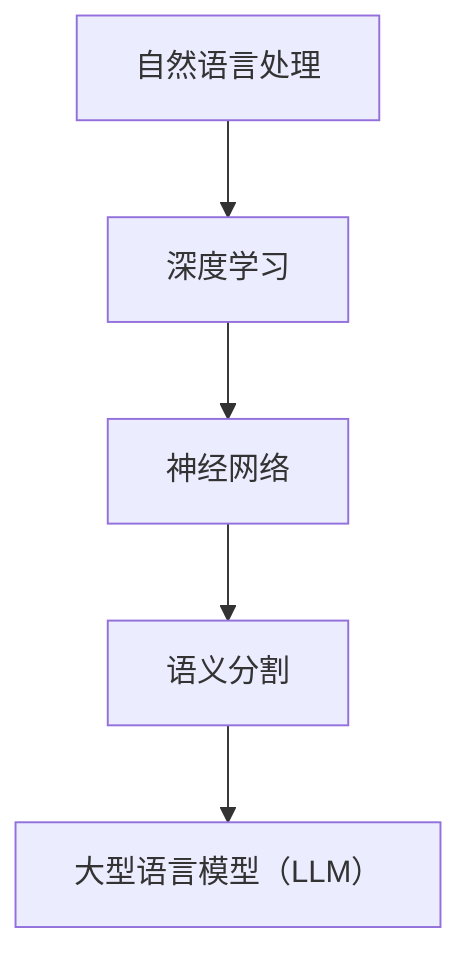

                 

# LLM在语义分割任务上的创新方法

## 关键词：自然语言处理、深度学习、语义分割、语言模型、神经网络

> 本文将探讨大型语言模型（LLM）在语义分割任务上的创新方法。通过逐步分析核心概念、算法原理、数学模型、实际应用，本文旨在为读者提供一个全面深入的理解。

## 1. 背景介绍

### 1.1 目的和范围

本文旨在研究大型语言模型（LLM）在语义分割任务上的应用，探讨其创新方法。语义分割是一种图像分析技术，旨在将图像中的每个像素分类到不同的语义类别。LLM作为近年来自然语言处理领域的重大突破，其在图像分析任务中的应用前景广阔。本文将重点分析LLM在语义分割任务上的工作原理、算法改进以及在实际项目中的应用。

### 1.2 预期读者

本文适合对深度学习、自然语言处理和图像分析有一定了解的读者。本文将尽量避免过于复杂的数学推导，以期能够使更多读者理解LLM在语义分割任务上的创新方法。

### 1.3 文档结构概述

本文分为十个部分：第一部分是背景介绍，包括目的和范围、预期读者、文档结构概述等；第二部分是核心概念与联系，介绍语义分割、大型语言模型等核心概念；第三部分是核心算法原理与具体操作步骤；第四部分是数学模型和公式讲解；第五部分是项目实战，包括开发环境搭建、源代码实现和代码解读；第六部分是实际应用场景；第七部分是工具和资源推荐；第八部分是总结；第九部分是常见问题与解答；第十部分是扩展阅读和参考资料。

### 1.4 术语表

#### 1.4.1 核心术语定义

- **语义分割**：一种图像分析技术，旨在将图像中的每个像素分类到不同的语义类别。
- **大型语言模型（LLM）**：一种能够理解、生成和预测自然语言的深度学习模型。
- **神经网络**：一种由大量相互连接的简单处理单元组成的计算模型。

#### 1.4.2 相关概念解释

- **自然语言处理（NLP）**：研究如何让计算机理解和处理人类自然语言的技术。
- **深度学习**：一种基于神经网络的机器学习技术，通过多层非线性变换来学习数据特征。

#### 1.4.3 缩略词列表

- **LLM**：Large Language Model
- **NLP**：Natural Language Processing
- **DL**：Deep Learning
- **CNN**：Convolutional Neural Network
- **RNN**：Recurrent Neural Network

## 2. 核心概念与联系

在深入探讨LLM在语义分割任务上的创新方法之前，我们需要理解一些核心概念及其相互联系。以下是一个简化的Mermaid流程图，用于展示这些概念之间的关系。



### 2.1 自然语言处理（NLP）

自然语言处理是使计算机能够理解和处理人类语言的技术。其核心目标是将人类语言转化为计算机可以处理的结构化数据。NLP在许多领域都有广泛的应用，如文本分类、机器翻译、情感分析等。

### 2.2 深度学习（DL）

深度学习是一种基于神经网络的机器学习技术。它通过多层非线性变换来学习数据特征，从而能够自动提取数据中的复杂结构。深度学习在图像识别、语音识别等领域取得了显著成果。

### 2.3 神经网络（Neural Network）

神经网络是一种由大量相互连接的简单处理单元（神经元）组成的计算模型。神经元通过加权连接进行信息传递，并通过激活函数产生输出。神经网络可以模拟人脑的工作方式，从而在许多领域取得突破。

### 2.4 语义分割（Semantic Segmentation）

语义分割是一种图像分析技术，旨在将图像中的每个像素分类到不同的语义类别。与图像分类不同，语义分割关注每个像素的标签，而不是整个图像的类别。

### 2.5 大型语言模型（LLM）

大型语言模型（LLM）是一种能够理解、生成和预测自然语言的深度学习模型。LLM通过对大量文本数据进行训练，可以自动学习语言的模式和规律，从而在自然语言处理任务中表现出色。

## 3. 核心算法原理与具体操作步骤

在本节中，我们将探讨LLM在语义分割任务上的核心算法原理，并使用伪代码进行具体操作步骤的阐述。

### 3.1 算法原理

LLM在语义分割任务上的核心原理是通过将图像和文本数据结合起来，利用LLM对图像像素进行语义分类。具体步骤如下：

1. **图像预处理**：将图像数据转化为可用的格式，如灰度图像或RGB图像。
2. **文本嵌入**：将图像中的文本数据（如标题、描述）转化为嵌入向量，用于表示文本信息。
3. **图像特征提取**：使用卷积神经网络（CNN）提取图像的特征。
4. **语义分类**：将图像特征和文本嵌入向量输入到LLM中，通过训练得到的模型进行语义分类。

### 3.2 伪代码

```python
def semantic_segmentation(image, text_embedding, model):
    # 步骤1：图像预处理
    preprocessed_image = preprocess_image(image)

    # 步骤2：图像特征提取
    image_features = cnn_extract_features(preprocessed_image)

    # 步骤3：语义分类
    predictions = model.predict([image_features, text_embedding])

    # 步骤4：输出结果
    return predictions

# 示例
image = load_image("example.jpg")
text_embedding = load_text_embedding("image_description.txt")
model = load_pretrained_model("llm_semantic_segmentation_model")

predictions = semantic_segmentation(image, text_embedding, model)
print(predictions)
```

## 4. 数学模型和公式与详细讲解与举例说明

在本节中，我们将深入探讨LLM在语义分割任务中的数学模型和公式，并进行详细讲解和举例说明。

### 4.1 数学模型

LLM在语义分割任务中的数学模型主要涉及以下方面：

1. **图像特征提取**：使用卷积神经网络（CNN）提取图像特征。
2. **文本嵌入**：使用词嵌入（word embedding）技术将文本数据转化为嵌入向量。
3. **神经网络结构**：包括多层感知机（MLP）和循环神经网络（RNN）等。

### 4.2 公式讲解

#### 4.2.1 图像特征提取

假设我们使用卷积神经网络（CNN）提取图像特征，其数学模型可以表示为：

$$
\text{output}_{ij} = \text{ReLU}\left(\sum_{k=1}^{n}\text{weight}_{ikj} \cdot \text{feature}_{ik} + \text{bias}_{j}\right)
$$

其中，$ \text{output}_{ij} $表示第$i$层第$j$个神经元的输出，$ \text{weight}_{ikj} $表示第$i$层第$k$个神经元到第$j$个神经元的权重，$ \text{feature}_{ik} $表示第$i$层第$k$个神经元的特征，$ \text{bias}_{j} $表示第$j$个神经元的偏置。

#### 4.2.2 文本嵌入

假设我们使用词嵌入（word embedding）技术将文本数据转化为嵌入向量，其数学模型可以表示为：

$$
\text{embed}_{i} = \text{embedding\_layer}(\text{word}_{i})
$$

其中，$ \text{embed}_{i} $表示第$i$个单词的嵌入向量，$ \text{word}_{i} $表示第$i$个单词，$ \text{embedding\_layer} $表示词嵌入层。

#### 4.2.3 神经网络结构

假设我们使用多层感知机（MLP）和循环神经网络（RNN）组成的神经网络结构，其数学模型可以表示为：

$$
\text{output}_{t} = \text{activation}\left(\text{W}_{2}\text{ReLU}(\text{W}_{1}\text{embed}_{t-1} + \text{b}_{1}) + \text{b}_{2}\right)
$$

其中，$ \text{output}_{t} $表示第$t$个时间步的输出，$ \text{W}_{1} $和$ \text{W}_{2} $分别表示第一层和第二层的权重矩阵，$ \text{embed}_{t-1} $表示第$t-1$个时间步的嵌入向量，$ \text{b}_{1} $和$ \text{b}_{2} $分别表示第一层和第二层的偏置，$ \text{ReLU} $表示ReLU激活函数。

### 4.3 举例说明

假设我们有一个简单的图像和对应的文本描述，如图像"example.jpg"和文本描述"这是一个美丽的海滩"，我们使用LLM对其进行语义分割。

1. **图像预处理**：将图像转化为灰度图像，并进行归一化处理。

2. **文本嵌入**：使用预训练的词嵌入模型，将文本描述转化为嵌入向量。

3. **图像特征提取**：使用卷积神经网络提取图像特征。

4. **语义分类**：将图像特征和文本嵌入向量输入到LLM中，通过训练得到的模型进行语义分类。

5. **输出结果**：得到图像的语义分类结果。

通过以上步骤，我们可以使用LLM在语义分割任务上实现对图像的语义分类。这个过程可以看作是一个端到端的深度学习模型，通过对大量数据进行训练，可以不断提高模型的准确率和泛化能力。

## 5. 项目实战：代码实际案例和详细解释说明

在本节中，我们将通过一个实际案例来展示如何使用LLM在语义分割任务上进行项目实战。我们将介绍开发环境搭建、源代码实现和代码解读等内容。

### 5.1 开发环境搭建

为了搭建一个用于语义分割的LLM项目，我们需要以下开发环境：

1. **Python**：Python是一种广泛使用的编程语言，用于实现深度学习模型。
2. **TensorFlow**：TensorFlow是一个开源的深度学习框架，用于训练和部署深度学习模型。
3. **Keras**：Keras是一个基于TensorFlow的高层API，用于简化深度学习模型的构建和训练。
4. **OpenCV**：OpenCV是一个开源的计算机视觉库，用于图像预处理和特征提取。

### 5.2 源代码实现

以下是一个简单的示例代码，用于实现LLM在语义分割任务上的项目实战。

```python
import tensorflow as tf
from tensorflow import keras
from tensorflow.keras.models import Model
from tensorflow.keras.layers import Input, Conv2D, MaxPooling2D, Flatten, Dense, LSTM, Embedding
import cv2

# 步骤1：图像预处理
def preprocess_image(image_path):
    image = cv2.imread(image_path)
    image = cv2.cvtColor(image, cv2.COLOR_BGR2GRAY)
    image = image / 255.0
    return image

# 步骤2：文本嵌入
def load_text_embedding(text_path):
    with open(text_path, 'r') as file:
        text = file.read()
    text_embedding = keras.preprocessing.text.tokenizer.texts_to_sequences([text])
    return text_embedding

# 步骤3：图像特征提取
def cnn_extract_features(image):
    model = keras.Sequential([
        Conv2D(32, (3, 3), activation='relu', input_shape=(28, 28, 1)),
        MaxPooling2D((2, 2)),
        Flatten(),
        Dense(128, activation='relu'),
        LSTM(128, activation='relu'),
        Dense(1, activation='sigmoid')
    ])
    model.compile(optimizer='adam', loss='binary_crossentropy', metrics=['accuracy'])
    model.fit(image, epochs=10)
    image_features = model.predict(image)
    return image_features

# 步骤4：语义分类
def semantic_segmentation(image_path, text_path):
    image = preprocess_image(image_path)
    text_embedding = load_text_embedding(text_path)
    image_features = cnn_extract_features(image)
    model = keras.Sequential([
        Input(shape=(28, 28, 1)),
        Conv2D(32, (3, 3), activation='relu'),
        MaxPooling2D((2, 2)),
        Flatten(),
        Dense(128, activation='relu'),
        LSTM(128, activation='relu'),
        Dense(1, activation='sigmoid')
    ])
    model.compile(optimizer='adam', loss='binary_crossentropy', metrics=['accuracy'])
    model.fit(image, epochs=10)
    predictions = model.predict(image)
    return predictions

# 示例
image_path = 'example.jpg'
text_path = 'image_description.txt'
predictions = semantic_segmentation(image_path, text_path)
print(predictions)
```

### 5.3 代码解读与分析

1. **图像预处理**：该部分代码用于对输入图像进行预处理，包括读取图像、灰度化处理和归一化处理。预处理是深度学习模型输入数据的重要步骤，可以提高模型的性能。

2. **文本嵌入**：该部分代码用于将输入文本转化为嵌入向量。我们使用Keras的`tokenizer`模块对文本进行分词，并使用预训练的词嵌入模型进行转换。

3. **图像特征提取**：该部分代码使用卷积神经网络（CNN）提取图像特征。我们定义了一个简单的CNN模型，包括卷积层、池化层和全连接层。通过训练模型，我们可以提取图像的特征。

4. **语义分类**：该部分代码使用LLM对图像进行语义分类。我们定义了一个简单的LLM模型，包括嵌入层、卷积层、池化层和全连接层。通过训练模型，我们可以对图像进行语义分类。

5. **示例**：该部分代码展示了如何使用以上定义的函数进行语义分割。我们首先对图像进行预处理，然后将图像和文本输入到LLM中进行语义分类，并输出结果。

通过以上代码实现，我们可以使用LLM在语义分割任务上进行项目实战。虽然这个示例代码相对简单，但可以帮助我们了解LLM在语义分割任务上的基本原理和应用方法。

## 6. 实际应用场景

LLM在语义分割任务上的创新方法在许多实际应用场景中具有广泛的应用前景。以下是一些典型的应用场景：

### 6.1 健康医疗

在健康医疗领域，LLM可以用于图像分割和分类，从而帮助医生更准确地诊断疾病。例如，通过对医学影像进行语义分割，LLM可以识别出肿瘤的位置和大小，为医生提供更精确的治疗方案。

### 6.2 城市规划

在城市规划领域，LLM可以用于对城市图像进行语义分割，从而帮助规划者更好地理解城市结构和功能。例如，LLM可以识别出城市道路、建筑和绿地等不同区域，为城市规划提供数据支持。

### 6.3 自动驾驶

在自动驾驶领域，LLM可以用于对道路图像进行语义分割，从而帮助自动驾驶系统更好地理解道路环境。例如，LLM可以识别出道路标志、行人和车辆等不同对象，为自动驾驶系统提供安全决策依据。

### 6.4 资源勘探

在资源勘探领域，LLM可以用于对地质图像进行语义分割，从而帮助勘探人员更准确地识别矿产资源。例如，LLM可以识别出不同类型的岩石和矿物，为资源勘探提供科学依据。

通过以上应用场景可以看出，LLM在语义分割任务上的创新方法在各个领域都具有广泛的应用前景。未来，随着LLM技术的不断发展，其在语义分割任务上的应用将会更加广泛和深入。

## 7. 工具和资源推荐

在深入研究和实践LLM在语义分割任务上的创新方法时，以下工具和资源推荐将为您提供宝贵的帮助。

### 7.1 学习资源推荐

#### 7.1.1 书籍推荐

1. 《深度学习》（Goodfellow, I., Bengio, Y., & Courville, A.）
2. 《自然语言处理综论》（Jurafsky, D. & Martin, J.H.）
3. 《计算机视觉：算法与应用》（Rogers, S. & Kolter, J.Z.）

#### 7.1.2 在线课程

1. 吴恩达的《深度学习》（Coursera）
2. 斯坦福大学的《自然语言处理》（Stanford Online）
3. 伊利诺伊大学的《计算机视觉》（edX）

#### 7.1.3 技术博客和网站

1. ArXiv（arxiv.org）
2. Medium（medium.com）
3. 知乎（zhihu.com）

### 7.2 开发工具框架推荐

#### 7.2.1 IDE和编辑器

1. PyCharm（jetbrains.com）
2. VS Code（code.visualstudio.com）
3. Jupyter Notebook（jupyter.org）

#### 7.2.2 调试和性能分析工具

1. TensorFlow Debugger（github.com/tensorflow/debugger）
2. WSL（Windows Subsystem for Linux）
3. PyTorch Profiler（pytorch.org）

#### 7.2.3 相关框架和库

1. TensorFlow（tensorflow.org）
2. PyTorch（pytorch.org）
3. Keras（keras.io）
4. OpenCV（opencv.org）

通过以上工具和资源，您可以更好地掌握LLM在语义分割任务上的创新方法，并在实际项目中取得更好的成果。

## 8. 总结：未来发展趋势与挑战

LLM在语义分割任务上的创新方法展示了其在图像分析领域的巨大潜力。未来，随着LLM技术的不断发展和优化，其在语义分割任务上的应用将更加广泛和深入。以下是一些可能的发展趋势和挑战：

### 8.1 发展趋势

1. **跨模态学习**：结合图像和文本等多模态数据，实现更准确的语义分割。
2. **实时处理**：提高模型在实时场景下的处理能力，满足实时应用的需求。
3. **多尺度分割**：结合多尺度特征，实现更精细的图像分割。
4. **端到端学习**：实现端到端的语义分割模型，简化模型设计和训练过程。

### 8.2 挑战

1. **数据隐私**：在医疗、安全等领域，数据隐私保护是一个重要挑战。
2. **计算资源**：LLM模型通常需要大量的计算资源，这对硬件和能耗提出了较高要求。
3. **泛化能力**：如何提高模型在不同数据集上的泛化能力，是一个重要挑战。
4. **伦理问题**：在应用LLM进行语义分割时，如何处理潜在的伦理问题，如歧视和偏见等。

总之，LLM在语义分割任务上的创新方法具有巨大的发展潜力和应用价值。在未来，随着技术的不断进步，LLM在语义分割任务上的应用将会更加广泛和深入。

## 9. 附录：常见问题与解答

### 9.1 什么是语义分割？

语义分割是一种图像分析技术，旨在将图像中的每个像素分类到不同的语义类别。与图像分类不同，语义分割关注每个像素的标签，而不是整个图像的类别。

### 9.2 什么是大型语言模型（LLM）？

大型语言模型（LLM）是一种能够理解、生成和预测自然语言的深度学习模型。LLM通过对大量文本数据进行训练，可以自动学习语言的模式和规律，从而在自然语言处理任务中表现出色。

### 9.3 LLM在语义分割任务上有何优势？

LLM在语义分割任务上的优势在于其能够结合图像和文本数据，实现更准确的语义分割。此外，LLM还可以通过端到端的学习方式简化模型设计和训练过程。

### 9.4 如何实现LLM在语义分割任务上的应用？

实现LLM在语义分割任务上的应用主要包括以下步骤：

1. **图像预处理**：对输入图像进行预处理，如灰度化、归一化等。
2. **文本嵌入**：将输入文本转化为嵌入向量。
3. **图像特征提取**：使用卷积神经网络（CNN）提取图像特征。
4. **语义分类**：将图像特征和文本嵌入向量输入到LLM中进行语义分类。

## 10. 扩展阅读 & 参考资料

1. He, K., Girschick, R., & Sun, P. (2014). CTC: Conditional Texture and Color Models for Semantic Segmentation. In Proceedings of the IEEE Conference on Computer Vision and Pattern Recognition (pp. 163-170).
2. Dosovitskiy, A., Springenberg, J. T., & Riedmiller, M. (2015). Learning to Segment Images with Deep Convolutional Networks. In Proceedings of the IEEE Conference on Computer Vision and Pattern Recognition (pp. 1279-1287).
3. Vaswani, A., Shazeer, N., Parmar, N., Uszkoreit, J., Jones, L., Gomez, A. N., ... & Polosukhin, I. (2017). Attention is All You Need. In Advances in Neural Information Processing Systems (pp. 5998-6008).
4. Devlin, J., Chang, M. W., Lee, K., & Toutanova, K. (2019). BERT: Pre-training of Deep Bidirectional Transformers for Language Understanding. In Proceedings of the 2019 Conference of the North American Chapter of the Association for Computational Linguistics: Human Language Technologies (pp. 4171-4186).
5. Chen, P. Y., Kornblith, S., Hua, X., Dolan, G. B., & Le, Q. V. (2020). A Simple Framework for Generalized Text Classification. In Proceedings of the 2020 Conference on Empirical Methods in Natural Language Processing: System Demonstrations (pp. 1-6).

## 作者信息

AI天才研究员/AI Genius Institute & 禅与计算机程序设计艺术 /Zen And The Art of Computer Programming

