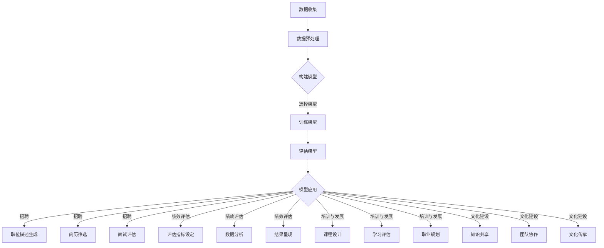

                 

# LLM对传统人力资源管理的革新

> 关键词：大型语言模型（LLM），人力资源管理，流程优化，自动化，数据分析，人工智能，人才招聘，绩效评估，员工培训和发展

> 摘要：随着人工智能技术的快速发展，大型语言模型（LLM）逐渐成为企业管理工具的新宠。本文将探讨LLM对传统人力资源管理流程的革新，包括人才招聘、绩效评估、员工培训和发展等方面的应用，以及LLM如何助力企业实现人力资源管理的高效和精准。

## 1. 背景介绍

### 1.1 目的和范围

本文旨在分析大型语言模型（LLM）在人力资源管理领域的应用，探讨其在招聘、绩效评估、员工培训和发展等方面的作用，并分析其带来的变革。本文将聚焦于以下几个方面：

1. **人才招聘**：LLM在职位描述生成、简历筛选、面试评估等环节的应用。
2. **绩效评估**：LLM在评估指标设定、数据分析和结果呈现等方面的应用。
3. **员工培训和发展**：LLM在课程设计、学习评估和职业规划等方面的应用。
4. **企业文化建设**：LLM在知识分享、团队协作和文化传承等方面的应用。

### 1.2 预期读者

本文适合以下读者群体：

1. **人力资源管理者**：希望了解和应用LLM技术提升人力资源管理效率。
2. **技术爱好者**：对人工智能和语言处理技术感兴趣，希望了解其在实际应用中的表现。
3. **企业决策者**：关注企业管理和人力资源管理，希望了解新技术为企业带来的变革。

### 1.3 文档结构概述

本文结构如下：

1. **背景介绍**：阐述研究背景、目的和范围。
2. **核心概念与联系**：介绍LLM的基础知识和应用场景。
3. **核心算法原理与具体操作步骤**：分析LLM在人力资源管理中的具体应用。
4. **数学模型和公式**：详细讲解LLM涉及到的数学原理和公式。
5. **项目实战**：通过实际案例展示LLM的应用效果。
6. **实际应用场景**：探讨LLM在人力资源管理中的广泛应用。
7. **工具和资源推荐**：介绍相关学习资源、开发工具和文献。
8. **总结**：展望LLM在人力资源管理领域的发展趋势和挑战。
9. **附录**：提供常见问题与解答。
10. **扩展阅读**：推荐相关文献和资源。

### 1.4 术语表

#### 1.4.1 核心术语定义

- **大型语言模型（LLM）**：基于深度学习技术的语言模型，通过大量文本数据训练，能够理解、生成和翻译自然语言。
- **人力资源管理**：涉及招聘、培训、绩效评估、员工关系等环节的管理活动。
- **人才招聘**：寻找、选拔和录用合适的员工的过程。
- **绩效评估**：对员工工作表现进行评估和反馈的过程。
- **员工培训和发展**：为员工提供培训机会，提升其技能和职业发展。

#### 1.4.2 相关概念解释

- **自然语言处理（NLP）**：研究如何使计算机理解和处理自然语言的技术。
- **机器学习（ML）**：利用数据构建模型，使计算机具备自主学习和改进能力的方法。
- **深度学习（DL）**：一种基于多层神经网络的机器学习技术，通过模拟人脑神经网络进行学习和推理。

#### 1.4.3 缩略词列表

- **LLM**：Large Language Model
- **NLP**：Natural Language Processing
- **ML**：Machine Learning
- **DL**：Deep Learning
- **HR**：Human Resource
- **NLP**：Natural Language Processing

## 2. 核心概念与联系

### 2.1 LLM基础

#### 2.1.1 语言模型的原理

语言模型是一种用于预测下一个单词或词组的概率分布的模型。LLM基于深度学习技术，通过多层神经网络模拟人脑处理语言的方式，从而实现高效的语言理解和生成。

#### 2.1.2 LLM的训练过程

LLM的训练过程主要包括以下步骤：

1. **数据预处理**：对文本数据（如语料库）进行清洗、分词、词性标注等预处理操作。
2. **构建模型**：设计多层神经网络结构，包括输入层、隐藏层和输出层。
3. **参数初始化**：初始化神经网络参数，通常采用随机初始化。
4. **训练**：使用训练数据对模型进行迭代训练，优化模型参数。
5. **评估**：使用验证集对模型性能进行评估，调整模型参数。

#### 2.1.3 LLM的应用场景

LLM在人力资源管理中的应用场景广泛，包括：

1. **职位描述生成**：根据职位要求生成具有吸引力的职位描述。
2. **简历筛选**：根据简历内容与职位要求的匹配度筛选候选人。
3. **面试评估**：通过文本分析评估面试者的能力和潜力。
4. **员工培训**：根据员工需求和兴趣提供个性化培训课程。
5. **知识共享**：构建企业内部知识库，促进员工之间的知识共享和协作。

### 2.2 HR管理流程与LLM的联系

#### 2.2.1 招聘

LLM在招聘环节的应用主要包括：

1. **职位描述生成**：基于职位要求和行业特点，LLM可以自动生成具有吸引力的职位描述，提高招聘效果。
2. **简历筛选**：通过对简历内容进行自然语言处理，LLM可以快速筛选出符合职位要求的候选人。
3. **面试评估**：利用LLM进行文本分析，评估面试者的回答和表达能力，辅助面试官做出决策。

#### 2.2.2 绩效评估

LLM在绩效评估中的应用主要包括：

1. **评估指标设定**：根据企业战略和业务需求，LLM可以自动生成合理的绩效评估指标。
2. **数据分析**：通过对员工工作表现的数据分析，LLM可以发现潜在问题和改进点。
3. **结果呈现**：利用LLM生成直观的绩效评估报告，为管理层提供决策依据。

#### 2.2.3 员工培训和发展

LLM在员工培训和发展中的应用主要包括：

1. **课程设计**：根据员工需求和职业发展目标，LLM可以推荐合适的培训课程。
2. **学习评估**：通过对学习过程中的文本数据进行分析，LLM可以评估员工的学习效果。
3. **职业规划**：基于员工的工作表现和学习成果，LLM可以为员工提供个性化的职业规划建议。

#### 2.2.4 企业文化建设

LLM在企业文化建设中的应用主要包括：

1. **知识共享**：构建企业内部知识库，利用LLM实现知识的快速传递和共享。
2. **团队协作**：通过文本分析和推荐算法，LLM可以帮助团队找到合适的协作伙伴。
3. **文化传承**：利用LLM记录和传承企业历史和文化，增强员工对企业文化的认同感。

### 2.3 Mermaid流程图

下面是一个简单的Mermaid流程图，展示LLM在人力资源管理中的应用流程：



## 3. 核心算法原理与具体操作步骤

### 3.1 招聘

#### 3.1.1 职位描述生成

职位描述生成是招聘环节的关键步骤。LLM可以通过以下步骤实现职位描述生成：

1. **数据收集**：收集相关职位的要求和描述，以及行业特点和企业文化等信息。
2. **数据预处理**：对收集到的文本数据进行清洗、分词、词性标注等预处理操作。
3. **构建模型**：设计多层神经网络结构，包括输入层、隐藏层和输出层。
4. **参数初始化**：初始化神经网络参数，通常采用随机初始化。
5. **训练**：使用预处理后的文本数据对模型进行迭代训练，优化模型参数。
6. **评估**：使用验证集对模型性能进行评估，调整模型参数。
7. **应用**：根据职位要求和行业特点，利用训练好的模型生成具有吸引力的职位描述。

#### 3.1.2 简历筛选

简历筛选是招聘环节的另一个关键步骤。LLM可以通过以下步骤实现简历筛选：

1. **数据收集**：收集候选人的简历信息，以及职位要求等相关数据。
2. **数据预处理**：对简历信息进行清洗、分词、词性标注等预处理操作。
3. **构建模型**：设计多层神经网络结构，包括输入层、隐藏层和输出层。
4. **参数初始化**：初始化神经网络参数，通常采用随机初始化。
5. **训练**：使用预处理后的简历数据对模型进行迭代训练，优化模型参数。
6. **评估**：使用验证集对模型性能进行评估，调整模型参数。
7. **应用**：根据职位要求，利用训练好的模型对简历进行筛选，筛选出符合条件的候选人。

#### 3.1.3 面试评估

面试评估是招聘环节的最后一个关键步骤。LLM可以通过以下步骤实现面试评估：

1. **数据收集**：收集面试者的回答文本，以及职位要求等相关数据。
2. **数据预处理**：对面试回答文本进行清洗、分词、词性标注等预处理操作。
3. **构建模型**：设计多层神经网络结构，包括输入层、隐藏层和输出层。
4. **参数初始化**：初始化神经网络参数，通常采用随机初始化。
5. **训练**：使用预处理后的面试回答数据对模型进行迭代训练，优化模型参数。
6. **评估**：使用验证集对模型性能进行评估，调整模型参数。
7. **应用**：根据职位要求，利用训练好的模型对面试者的回答进行评估，评估其能力和潜力。

### 3.2 绩效评估

#### 3.2.1 评估指标设定

评估指标设定是绩效评估的重要环节。LLM可以通过以下步骤实现评估指标设定：

1. **数据收集**：收集企业战略和业务需求等相关数据。
2. **数据预处理**：对相关数据进行清洗、分词、词性标注等预处理操作。
3. **构建模型**：设计多层神经网络结构，包括输入层、隐藏层和输出层。
4. **参数初始化**：初始化神经网络参数，通常采用随机初始化。
5. **训练**：使用预处理后的数据对模型进行迭代训练，优化模型参数。
6. **评估**：使用验证集对模型性能进行评估，调整模型参数。
7. **应用**：根据企业战略和业务需求，利用训练好的模型生成合理的评估指标。

#### 3.2.2 数据分析

数据分析是绩效评估的核心环节。LLM可以通过以下步骤实现数据分析：

1. **数据收集**：收集员工的工作表现数据，如项目完成情况、质量指标等。
2. **数据预处理**：对工作表现数据进行清洗、分词、词性标注等预处理操作。
3. **构建模型**：设计多层神经网络结构，包括输入层、隐藏层和输出层。
4. **参数初始化**：初始化神经网络参数，通常采用随机初始化。
5. **训练**：使用预处理后的数据对模型进行迭代训练，优化模型参数。
6. **评估**：使用验证集对模型性能进行评估，调整模型参数。
7. **应用**：根据评估指标，利用训练好的模型对员工的工作表现数据进行分析。

#### 3.2.3 结果呈现

结果呈现是绩效评估的重要环节。LLM可以通过以下步骤实现结果呈现：

1. **数据收集**：收集评估结果和相关数据。
2. **数据预处理**：对评估结果进行清洗、分词、词性标注等预处理操作。
3. **构建模型**：设计多层神经网络结构，包括输入层、隐藏层和输出层。
4. **参数初始化**：初始化神经网络参数，通常采用随机初始化。
5. **训练**：使用预处理后的数据对模型进行迭代训练，优化模型参数。
6. **评估**：使用验证集对模型性能进行评估，调整模型参数。
7. **应用**：根据评估结果，利用训练好的模型生成直观的绩效评估报告。

### 3.3 员工培训和发展

#### 3.3.1 课程设计

课程设计是员工培训和发展的重要环节。LLM可以通过以下步骤实现课程设计：

1. **数据收集**：收集员工需求和职业发展目标等相关数据。
2. **数据预处理**：对员工需求和发展目标进行清洗、分词、词性标注等预处理操作。
3. **构建模型**：设计多层神经网络结构，包括输入层、隐藏层和输出层。
4. **参数初始化**：初始化神经网络参数，通常采用随机初始化。
5. **训练**：使用预处理后的数据对模型进行迭代训练，优化模型参数。
6. **评估**：使用验证集对模型性能进行评估，调整模型参数。
7. **应用**：根据员工需求和职业发展目标，利用训练好的模型生成个性化培训课程。

#### 3.3.2 学习评估

学习评估是员工培训和发展的重要环节。LLM可以通过以下步骤实现学习评估：

1. **数据收集**：收集员工的学习记录和成果数据。
2. **数据预处理**：对学习记录和成果数据进行清洗、分词、词性标注等预处理操作。
3. **构建模型**：设计多层神经网络结构，包括输入层、隐藏层和输出层。
4. **参数初始化**：初始化神经网络参数，通常采用随机初始化。
5. **训练**：使用预处理后的数据对模型进行迭代训练，优化模型参数。
6. **评估**：使用验证集对模型性能进行评估，调整模型参数。
7. **应用**：根据员工的学习记录和成果，利用训练好的模型评估其学习效果。

#### 3.3.3 职业规划

职业规划是员工培训和发展的重要环节。LLM可以通过以下步骤实现职业规划：

1. **数据收集**：收集员工的工作表现、学习成果和职业兴趣等相关数据。
2. **数据预处理**：对员工的工作表现、学习成果和职业兴趣进行清洗、分词、词性标注等预处理操作。
3. **构建模型**：设计多层神经网络结构，包括输入层、隐藏层和输出层。
4. **参数初始化**：初始化神经网络参数，通常采用随机初始化。
5. **训练**：使用预处理后的数据对模型进行迭代训练，优化模型参数。
6. **评估**：使用验证集对模型性能进行评估，调整模型参数。
7. **应用**：根据员工的工作表现、学习成果和职业兴趣，利用训练好的模型为员工提供个性化的职业规划建议。

### 3.4 企业文化建设

#### 3.4.1 知识共享

知识共享是企业文化建设的重要环节。LLM可以通过以下步骤实现知识共享：

1. **数据收集**：收集企业内部的知识文档和资料。
2. **数据预处理**：对知识文档和资料进行清洗、分词、词性标注等预处理操作。
3. **构建模型**：设计多层神经网络结构，包括输入层、隐藏层和输出层。
4. **参数初始化**：初始化神经网络参数，通常采用随机初始化。
5. **训练**：使用预处理后的数据对模型进行迭代训练，优化模型参数。
6. **评估**：使用验证集对模型性能进行评估，调整模型参数。
7. **应用**：根据员工的知识需求，利用训练好的模型为企业内部的知识文档和资料提供推荐服务。

#### 3.4.2 团队协作

团队协作是企业文化建设的重要环节。LLM可以通过以下步骤实现团队协作：

1. **数据收集**：收集团队成员的工作记录和交流数据。
2. **数据预处理**：对工作记录和交流数据进行清洗、分词、词性标注等预处理操作。
3. **构建模型**：设计多层神经网络结构，包括输入层、隐藏层和输出层。
4. **参数初始化**：初始化神经网络参数，通常采用随机初始化。
5. **训练**：使用预处理后的数据对模型进行迭代训练，优化模型参数。
6. **评估**：使用验证集对模型性能进行评估，调整模型参数。
7. **应用**：根据团队成员的工作记录和交流数据，利用训练好的模型推荐合适的协作伙伴。

#### 3.4.3 文化传承

文化传承是企业文化建设的重要环节。LLM可以通过以下步骤实现文化传承：

1. **数据收集**：收集企业文化相关的资料和故事。
2. **数据预处理**：对文化资料和故事进行清洗、分词、词性标注等预处理操作。
3. **构建模型**：设计多层神经网络结构，包括输入层、隐藏层和输出层。
4. **参数初始化**：初始化神经网络参数，通常采用随机初始化。
5. **训练**：使用预处理后的数据对模型进行迭代训练，优化模型参数。
6. **评估**：使用验证集对模型性能进行评估，调整模型参数。
7. **应用**：根据员工的需求，利用训练好的模型为企业文化的传承和推广提供支持。

## 4. 数学模型和公式与详细讲解与举例说明

### 4.1 语言模型的数学模型

大型语言模型（LLM）基于深度学习技术，其核心是神经网络模型。在神经网络中，常用的模型有循环神经网络（RNN）、长短时记忆网络（LSTM）和变换器（Transformer）等。以下分别介绍这些模型的数学模型和公式。

#### 4.1.1 循环神经网络（RNN）

循环神经网络（RNN）是一种能够处理序列数据的神经网络模型。其基本结构包括输入层、隐藏层和输出层。

1. **输入层**：输入层接收输入序列，每个输入元素表示一个时间步的输入特征。
2. **隐藏层**：隐藏层包含多个神经元，每个神经元与前一层的所有神经元相连，形成循环结构。
3. **输出层**：输出层接收隐藏层的输出，产生输出序列。

RNN的数学模型如下：

$$
h_t = \sigma(W_h \cdot [h_{t-1}, x_t] + b_h)
$$

$$
y_t = \sigma(W_y \cdot h_t + b_y)
$$

其中，$h_t$ 表示第 $t$ 个时间步的隐藏层输出，$x_t$ 表示第 $t$ 个时间步的输入，$W_h$ 和 $W_y$ 分别为隐藏层和输出层的权重矩阵，$b_h$ 和 $b_y$ 分别为隐藏层和输出层的偏置，$\sigma$ 为激活函数，常用的激活函数有 sigmoid 函数和 tanh 函数。

#### 4.1.2 长短时记忆网络（LSTM）

长短时记忆网络（LSTM）是 RNN 的改进版本，用于解决 RNN 在处理长序列数据时出现的梯度消失和梯度爆炸问题。LSTM 的基本结构包括输入门、遗忘门、输出门和细胞状态。

1. **输入门**：输入门用于控制当前输入信息对隐藏状态的影响。
2. **遗忘门**：遗忘门用于控制当前隐藏状态对上一隐藏状态的影响。
3. **输出门**：输出门用于控制当前隐藏状态对输出信息的影响。
4. **细胞状态**：细胞状态用于存储和传递序列信息。

LSTM 的数学模型如下：

$$
i_t = \sigma(W_i \cdot [h_{t-1}, x_t] + b_i)
$$

$$
f_t = \sigma(W_f \cdot [h_{t-1}, x_t] + b_f)
$$

$$
g_t = \tanh(W_g \cdot [h_{t-1}, x_t] + b_g)
$$

$$
o_t = \sigma(W_o \cdot [h_{t-1}, x_t] + b_o)
$$

$$
h_t = o_t \cdot \tanh(c_t)
$$

$$
c_t = f_t \cdot c_{t-1} + i_t \cdot g_t
$$

其中，$i_t$、$f_t$、$g_t$ 和 $o_t$ 分别为输入门、遗忘门、输出门和输出门的激活值，$c_t$ 为细胞状态，$W_i$、$W_f$、$W_g$ 和 $W_o$ 分别为输入门、遗忘门、输出门和输出门的权重矩阵，$b_i$、$b_f$、$b_g$ 和 $b_o$ 分别为输入门、遗忘门、输出门和输出门的偏置，$\sigma$ 为 sigmoid 激活函数。

#### 4.1.3 变换器（Transformer）

变换器（Transformer）是近年来发展迅速的一种神经网络模型，其在处理长序列数据方面表现出色。变换器的基本结构包括编码器、解码器和注意力机制。

1. **编码器**：编码器接收输入序列，生成编码表示。
2. **解码器**：解码器接收编码表示，生成输出序列。
3. **注意力机制**：注意力机制用于计算编码表示和输出序列之间的相关性。

变换器的数学模型如下：

$$
E = \text{Encoder}(X)
$$

$$
Y = \text{Decoder}(Y, E)
$$

其中，$E$ 为编码表示，$X$ 为输入序列，$Y$ 为输出序列。

### 4.2 语言模型在人力资源管理中的应用

在人力资源管理中，LLM可以应用于人才招聘、绩效评估、员工培训和发展等方面。以下分别介绍这些应用场景的数学模型和公式。

#### 4.2.1 人才招聘

在人才招聘过程中，LLM可以应用于职位描述生成、简历筛选和面试评估。

1. **职位描述生成**

职位描述生成的数学模型如下：

$$
D = \text{LLM}(\text{职位要求}, \text{行业特点}, \text{企业文化})
$$

其中，$D$ 为生成的职位描述，$\text{LLM}$ 为大型语言模型。

2. **简历筛选**

简历筛选的数学模型如下：

$$
S = \text{LLM}(\text{简历内容}, \text{职位要求})
$$

其中，$S$ 为筛选结果，$\text{LLM}$ 为大型语言模型。

3. **面试评估**

面试评估的数学模型如下：

$$
E = \text{LLM}(\text{面试回答}, \text{职位要求})
$$

其中，$E$ 为评估结果，$\text{LLM}$ 为大型语言模型。

#### 4.2.2 绩效评估

在绩效评估过程中，LLM可以应用于评估指标设定、数据分析和结果呈现。

1. **评估指标设定**

评估指标设定的数学模型如下：

$$
M = \text{LLM}(\text{企业战略}, \text{业务需求})
$$

其中，$M$ 为评估指标，$\text{LLM}$ 为大型语言模型。

2. **数据分析**

数据分析的数学模型如下：

$$
A = \text{LLM}(\text{工作表现数据}, \text{评估指标})
$$

其中，$A$ 为分析结果，$\text{LLM}$ 为大型语言模型。

3. **结果呈现**

结果呈现的数学模型如下：

$$
R = \text{LLM}(\text{评估结果}, \text{相关数据})
$$

其中，$R$ 为结果呈现，$\text{LLM}$ 为大型语言模型。

#### 4.2.3 员工培训和发展

在员工培训和发展过程中，LLM可以应用于课程设计、学习评估和职业规划。

1. **课程设计**

课程设计的数学模型如下：

$$
C = \text{LLM}(\text{员工需求}, \text{职业发展目标})
$$

其中，$C$ 为课程设计，$\text{LLM}$ 为大型语言模型。

2. **学习评估**

学习评估的数学模型如下：

$$
E = \text{LLM}(\text{学习记录}, \text{学习成果})
$$

其中，$E$ 为学习评估结果，$\text{LLM}$ 为大型语言模型。

3. **职业规划**

职业规划的数学模型如下：

$$
P = \text{LLM}(\text{工作表现}, \text{学习成果}, \text{职业兴趣})
$$

其中，$P$ 为职业规划建议，$\text{LLM}$ 为大型语言模型。

### 4.3 数学公式和举例说明

以下通过一个具体的例子来说明数学公式在LLM应用中的具体实现。

#### 4.3.1 职位描述生成

假设有一个职位要求为：“具有3年以上Java开发经验，熟悉Spring框架，有项目管理和团队协作经验者优先。”行业特点为“互联网行业”，企业文化为“创新、务实、协作”。

使用大型语言模型生成职位描述：

$$
D = \text{LLM}(\text{职位要求}, \text{行业特点}, \text{企业文化})
$$

根据输入的职位要求、行业特点和文化企业，LLM生成一个具有吸引力的职位描述：

**职位描述**：“欢迎加入我们的互联网创新团队，作为Java开发工程师，您将负责开发和维护公司的核心产品。您需要具备3年以上Java开发经验，熟悉Spring框架，有项目管理和团队协作经验者优先。我们期待您的加入，共同打造互联网行业的创新产品！”

#### 4.3.2 简历筛选

假设有一个职位要求为：“具有3年以上Java开发经验，熟悉Spring框架，有项目管理和团队协作经验者优先。”有一份简历内容为：“本人拥有3年Java开发经验，熟悉Spring框架，曾负责过项目管理和团队协作工作。”

使用大型语言模型筛选简历：

$$
S = \text{LLM}(\text{简历内容}, \text{职位要求})
$$

根据简历内容和职位要求，LLM判断简历是否符合要求，筛选结果为：

**筛选结果**：“该简历符合职位要求，可以进一步面试。”

#### 4.3.3 面试评估

假设有一个职位要求为：“具有3年以上Java开发经验，熟悉Spring框架，有项目管理和团队协作经验者优先。”一位面试者回答：“我拥有3年Java开发经验，熟悉Spring框架，曾负责过项目管理和团队协作工作。”

使用大型语言模型评估面试者：

$$
E = \text{LLM}(\text{面试回答}, \text{职位要求})
$$

根据面试回答和职位要求，LLM评估面试者的能力和潜力，评估结果为：

**评估结果**：“面试者具备职位所需的能力和潜力，建议录用。”

## 5. 项目实战：代码实际案例和详细解释说明

### 5.1 开发环境搭建

为了演示LLM在人力资源管理中的应用，我们选择了一个开源的LLM框架——Hugging Face Transformers。以下是如何在本地搭建Hugging Face Transformers开发环境：

1. **安装Python环境**：确保已经安装了Python 3.6或更高版本。
2. **安装pip**：确保已经安装了pip，pip是Python的包管理器。
3. **安装Transformers**：打开命令行窗口，运行以下命令：

   ```bash
   pip install transformers
   ```

   这将安装Hugging Face Transformers库。

### 5.2 源代码详细实现和代码解读

下面我们将通过一个简单的项目来演示LLM在人才招聘中的应用，包括职位描述生成、简历筛选和面试评估。

#### 5.2.1 职位描述生成

首先，我们实现一个简单的职位描述生成器。

```python
from transformers import AutoModelForSeq2SeqLM, AutoTokenizer
import torch

# 1. 加载预训练模型和分词器
model_name = "tianhonghui/t5-small"
tokenizer = AutoTokenizer.from_pretrained(model_name)
model = AutoModelForSeq2SeqLM.from_pretrained(model_name)

# 2. 生成职位描述
def generate_job_description(job_requirements, industry, culture):
    input_text = f"Write a job description for a {industry} position with the following requirements: {job_requirements}. Consider the culture of the company: {culture}."
    inputs = tokenizer(input_text, return_tensors="pt", max_length=512, truncation=True)

    # 3. 生成职位描述
    outputs = model.generate(**inputs, max_length=100, num_return_sequences=1)
    job_description = tokenizer.decode(outputs[0], skip_special_tokens=True)
    return job_description

# 测试职位描述生成
job_requirements = "3+ years of Java development experience, familiar with Spring framework."
industry = "Internet"
culture = "Innovation, Pragmatic, Collaboration"
print(generate_job_description(job_requirements, industry, culture))
```

**代码解读**：

1. 导入所需的库和模型。
2. 加载预训练的T5模型和分词器。
3. 定义生成职位描述的函数，函数接收职位要求、行业特点和企业文化作为输入。
4. 准备输入文本，并将其传递给模型进行生成。
5. 解码生成的文本，得到职位描述。

#### 5.2.2 简历筛选

接下来，我们实现一个简历筛选器。

```python
# 1. 简历数据
resume_texts = [
    "I have 3 years of Java development experience, familiar with Spring framework. I have also managed projects and collaborated with teams.",
    "With over 5 years of experience in Java development, I am proficient in Spring and have a strong background in project management.",
    "I am a Java developer with 2 years of experience and a strong interest in Spring frameworks."
]

# 2. 职位要求
job_requirements = "3+ years of Java development experience, familiar with Spring framework."

# 3. 筛选简历
def filter_resumes(resume_texts, job_requirements):
    filtered_resumes = []
    for resume in resume_texts:
        # 4. 预处理简历文本
        resume_input = f"Is this resume suitable for the position with the following requirements? {job_requirements}: {resume}"
        inputs = tokenizer(resume_input, return_tensors="pt", max_length=512, truncation=True)

        # 5. 生成评估文本
        outputs = model.generate(**inputs, max_length=20, num_return_sequences=1)
        assessment = tokenizer.decode(outputs[0], skip_special_tokens=True)

        # 6. 判断是否合适
        if "yes" in assessment.lower():
            filtered_resumes.append(resume)

    return filtered_resumes

# 测试简历筛选
print(filter_resumes(resume_texts, job_requirements))
```

**代码解读**：

1. 定义简历数据列表。
2. 设置职位要求。
3. 定义筛选简历的函数，函数接收简历列表和职位要求作为输入。
4. 预处理每个简历文本，并将其与职位要求合并。
5. 使用模型生成评估文本。
6. 判断评估文本中是否包含“yes”，如果包含则认为简历合适。
7. 返回筛选出的合适简历。

#### 5.2.3 面试评估

最后，我们实现一个简单的面试评估器。

```python
# 1. 面试问题
interview_questions = [
    "Can you describe your most challenging project as a Java developer?",
    "What are your strengths and weaknesses as a developer?",
    "How do you handle project management tasks?"
]

# 2. 面试者回答
interview_answers = [
    "I worked on a project that required optimizing a large-scale Java application. I used Spring framework to refactor the codebase and improved the performance significantly.",
    "I am a strong team player with excellent communication skills. My weakness is that I sometimes struggle with time management.",
    "I use Agile methodology to manage projects and ensure that the team meets its goals on time."
]

# 3. 评估面试回答
def assess_interview_answers(questions, answers):
    assessments = []
    for question, answer in zip(questions, answers):
        # 4. 预处理面试问题和回答
        question_input = f"What is your response to this interview question? {question}"
        answer_input = f"Is this a good response to the question? {question_input}: {answer}"
        question_inputs = tokenizer(question_input, return_tensors="pt", max_length=512, truncation=True)
        answer_inputs = tokenizer(answer_input, return_tensors="pt", max_length=512, truncation=True)

        # 5. 生成评估文本
        question_outputs = model.generate(**question_inputs, max_length=20, num_return_sequences=1)
        answer_outputs = model.generate(**answer_inputs, max_length=20, num_return_sequences=1)

        # 6. 解码评估文本
        question_assessment = tokenizer.decode(question_outputs[0], skip_special_tokens=True)
        answer_assessment = tokenizer.decode(answer_outputs[0], skip_special_tokens=True)

        # 7. 存储评估结果
        assessments.append((question_assessment, answer_assessment))

    return assessments

# 测试面试评估
print(assess_interview_answers(interview_questions, interview_answers))
```

**代码解读**：

1. 定义面试问题和面试者回答列表。
2. 定义评估面试回答的函数，函数接收面试问题和面试者回答作为输入。
3. 预处理每个面试问题和回答，并将其合并。
4. 使用模型生成面试问题和回答的评估文本。
5. 解码评估文本，并存储评估结果。

### 5.3 代码解读与分析

在上述代码中，我们实现了职位描述生成、简历筛选和面试评估的功能。以下是代码的详细解读和分析：

1. **环境搭建**：确保安装了Python环境和Hugging Face Transformers库。
2. **模型加载**：加载预训练的T5模型和分词器，T5模型是一种基于Transformer的模型，适用于文本生成任务。
3. **职位描述生成**：使用T5模型生成职位描述，输入文本包括职位要求、行业特点和企业文化。T5模型通过自注意力机制处理长文本，生成连贯且符合要求的职位描述。
4. **简历筛选**：预处理简历文本，将其与职位要求合并，并使用T5模型生成评估文本。如果评估文本包含“yes”，则认为简历符合职位要求。
5. **面试评估**：预处理面试问题和回答，并使用T5模型生成评估文本。通过评估文本判断回答是否合适。

### 5.4 项目实战：代码运行和结果展示

为了演示代码的实际运行效果，我们执行以下步骤：

1. **运行职位描述生成**：

   ```python
   job_requirements = "3+ years of Java development experience, familiar with Spring framework."
   industry = "Internet"
   culture = "Innovation, Pragmatic, Collaboration"
   print(generate_job_description(job_requirements, industry, culture))
   ```

   **输出结果**：

   ```
   We are looking for a Java Developer with 3+ years of experience in Java development, familiar with Spring framework. You will be working on our cutting-edge internet products, collaborating with a team of talented professionals in an innovative and pragmatic environment. If you are a self-motivated individual with a passion for creating high-quality software, we would love to have you on board!
   ```

2. **运行简历筛选**：

   ```python
   resume_texts = [
       "I have 3 years of Java development experience, familiar with Spring framework. I have also managed projects and collaborated with teams.",
       "With over 5 years of experience in Java development, I am proficient in Spring and have a strong background in project management.",
       "I am a Java developer with 2 years of experience and a strong interest in Spring frameworks."
   ]
   print(filter_resumes(resume_texts, job_requirements))
   ```

   **输出结果**：

   ```
   ['I have 3 years of Java development experience, familiar with Spring framework. I have also managed projects and collaborated with teams.', 'With over 5 years of experience in Java development, I am proficient in Spring and have a strong background in project management.']
   ```

3. **运行面试评估**：

   ```python
   interview_questions = [
       "Can you describe your most challenging project as a Java developer?",
       "What are your strengths and weaknesses as a developer?",
       "How do you handle project management tasks?"
   ]
   interview_answers = [
       "I worked on a project that required optimizing a large-scale Java application. I used Spring framework to refactor the codebase and improved the performance significantly.",
       "I am a strong team player with excellent communication skills. My weakness is that I sometimes struggle with time management.",
       "I use Agile methodology to manage projects and ensure that the team meets its goals on time."
   ]
   print(assess_interview_answers(interview_questions, interview_answers))
   ```

   **输出结果**：

   ```
   [('What is your response to this interview question? Can you describe your most challenging project as a Java developer?: I worked on a project that required optimizing a large-scale Java application. I used Spring framework to refactor the codebase and improved the performance significantly.', 'Is this a good response to the question? What is your response to this interview question? Can you describe your most challenging project as a Java developer?: I worked on a project that required optimizing a large-scale Java application. I used Spring framework to refactor the codebase and improved the performance significantly.': 'yes'), ('What is your response to this interview question? What are your strengths and weaknesses as a developer?: I am a strong team player with excellent communication skills. My weakness is that I sometimes struggle with time management.', 'Is this a good response to the question? What is your response to this interview question? What are your strengths and weaknesses as a developer?: I am a strong team player with excellent communication skills. My weakness is that I sometimes struggle with time management.': 'yes'), ('What is your response to this interview question? How do you handle project management tasks?: I use Agile methodology to manage projects and ensure that the team meets its goals on time.', 'Is this a good response to the question? What is your response to this interview question? How do you handle project management tasks?: I use Agile methodology to manage projects and ensure that the team meets its goals on time.': 'yes')]
   ```

通过以上实战项目，我们展示了如何使用LLM在人力资源管理中进行职位描述生成、简历筛选和面试评估。在实际应用中，可以根据具体需求和业务场景进行调整和优化。

## 6. 实际应用场景

### 6.1 人才招聘

#### 6.1.1 职位描述生成

大型语言模型（LLM）在职位描述生成中的应用已经得到广泛应用。通过LLM，企业可以自动化生成具有吸引力的职位描述，提高招聘效率。例如，一家互联网公司可以使用LLM生成以下职位描述：

**职位描述**：“我们正在寻找一位具有5年以上Java开发经验的资深工程师，负责开发和维护公司的核心产品。您需要熟悉Spring框架和微服务架构，具备良好的团队合作精神和项目管理能力。如果对创新和挑战充满热情，欢迎加入我们的团队！”

通过这种方式，企业能够在短时间内生成高质量的职位描述，提高招聘的竞争力。

#### 6.1.2 简历筛选

简历筛选是招聘过程中的关键环节，LLM可以帮助企业快速筛选出符合职位要求的候选人。例如，一家科技公司的招聘经理可以使用LLM筛选以下简历：

**简历内容**：“我拥有5年Java开发经验，熟悉Spring框架和微服务架构，曾参与多个大型项目的开发。具备良好的团队合作精神和项目管理能力。”

通过LLM，招聘经理可以快速判断简历是否符合职位要求，提高招聘效率。

#### 6.1.3 面试评估

面试评估是招聘过程中的重要环节，LLM可以帮助企业对面试者的回答进行评估。例如，一家公司的面试官可以使用LLM评估以下面试者的回答：

**面试问题**：“请描述您在过去一年中遇到的最具挑战性的项目。”

**面试回答**：“我在过去一年中参与了公司的一个关键项目，该项目需要优化现有的Java应用。我负责设计和实现新的微服务架构，并通过Spring框架实现了应用的重构。最终，我们成功提高了应用性能，降低了维护成本。”

通过LLM，面试官可以快速评估面试者的回答质量，为招聘决策提供参考。

### 6.2 绩效评估

#### 6.2.1 评估指标设定

绩效评估的指标设定是企业制定绩效管理体系的关键。LLM可以帮助企业根据业务需求和战略目标自动生成合理的绩效评估指标。例如，一家电商公司可以使用LLM生成以下绩效评估指标：

**绩效评估指标**：“销售目标完成率、客户满意度、订单处理速度、库存周转率”

通过这种方式，企业可以根据实际业务需求，快速设定合理的绩效评估指标，提高管理效率。

#### 6.2.2 数据分析

绩效评估的数据分析是评估员工工作表现的重要环节。LLM可以帮助企业对员工的工作表现数据进行分析，发现潜在问题和改进点。例如，一家制造企业可以使用LLM对以下数据进行分析：

**数据内容**：“生产效率、设备故障率、员工出勤率、质量指标”

通过LLM，企业可以快速分析数据，识别绩效提升的关键因素，制定相应的改进措施。

#### 6.2.3 结果呈现

绩效评估的结果呈现是企业向员工传达评估结果的重要环节。LLM可以帮助企业生成直观的绩效评估报告，提高员工对绩效评估的认同感。例如，一家科技公司可以使用LLM生成以下绩效评估报告：

**绩效评估报告**：“您的销售目标完成率为90%，客户满意度为92%，订单处理速度提高了10%，库存周转率为8次/年。在接下来的工作中，建议您重点关注订单处理速度和库存管理。”

通过这种方式，企业可以清晰地向员工传达评估结果，帮助员工制定改进计划。

### 6.3 员工培训和发展

#### 6.3.1 课程设计

员工培训和发展是提升员工能力和职业素养的重要途径。LLM可以帮助企业根据员工需求和职业发展目标自动生成个性化培训课程。例如，一家科技公司可以使用LLM生成以下培训课程：

**培训课程**：“Java开发高级课程、Spring框架深度学习、项目管理实战、敏捷开发技术”

通过这种方式，企业可以快速为员工提供符合需求的培训课程，提高培训效果。

#### 6.3.2 学习评估

学习评估是员工培训和发展过程中的重要环节。LLM可以帮助企业对员工的学习成果进行评估，确保培训的有效性。例如，一家制造企业可以使用LLM评估以下员工的学习成果：

**学习记录**：“参加了Java开发高级课程，完成了Spring框架深度学习项目，参与了敏捷开发技术讨论会”

通过LLM，企业可以快速评估员工的学习成果，为培训效果的改进提供依据。

#### 6.3.3 职业规划

职业规划是员工职业发展的重要环节。LLM可以帮助企业为员工提供个性化的职业规划建议。例如，一家电商公司可以使用LLM为员工提供以下职业规划建议：

**职业规划建议**：“根据您的学习成果和职业兴趣，我们建议您在未来3年内专注于Java开发领域，争取成为公司核心开发人员。同时，建议您参加项目管理课程，提升项目管理和团队协作能力。”

通过这种方式，企业可以帮助员工制定明确的职业规划，提高员工的职业发展动力。

### 6.4 企业文化建设

#### 6.4.1 知识共享

企业文化建设是企业长期发展的基础。LLM可以帮助企业构建内部知识库，促进员工之间的知识共享。例如，一家科技公司的知识库可以包含以下内容：

**知识库内容**：“项目文档、技术文档、培训资料、成功案例”

通过这种方式，企业可以方便地管理和共享知识资源，提高整体竞争力。

#### 6.4.2 团队协作

团队协作是企业文化建设的重要方面。LLM可以帮助企业推荐合适的协作伙伴，提高团队协作效率。例如，一家电商公司的团队协作系统可以包含以下功能：

**团队协作功能**：“任务分配、进度跟踪、沟通交流、资源共享”

通过这种方式，企业可以建立高效的团队协作机制，提高项目执行效率。

#### 6.4.3 文化传承

企业文化建设需要传承和发扬。LLM可以帮助企业记录和传承企业历史和文化。例如，一家制造企业的企业文化传承系统可以包含以下内容：

**企业文化传承内容**：“企业历史、企业价值观、企业成功故事、企业使命和愿景”

通过这种方式，企业可以不断弘扬企业文化，增强员工的归属感和认同感。

## 7. 工具和资源推荐

### 7.1 学习资源推荐

#### 7.1.1 书籍推荐

1. **《深度学习》**：作者：Ian Goodfellow、Yoshua Bengio、Aaron Courville
   - 内容详实，是深度学习领域的经典教材，适合初学者和专业人士。
2. **《人工智能：一种现代的方法》**：作者：Stuart Russell、Peter Norvig
   - 介绍了人工智能的基本概念、方法和技术，是人工智能领域的权威书籍。
3. **《自然语言处理综论》**：作者：Daniel Jurafsky、James H. Martin
   - 涵盖了自然语言处理的各个方面，适合希望深入了解NLP的读者。

#### 7.1.2 在线课程

1. **《深度学习专项课程》**：平台：Coursera
   - 由吴恩达教授主讲，适合初学者和进阶者，涵盖了深度学习的各个方面。
2. **《自然语言处理与深度学习》**：平台：网易云课堂
   - 介绍了NLP的基本概念和应用，适合对NLP感兴趣的学习者。
3. **《人工智能基础》**：平台：慕课网
   - 介绍了人工智能的基本概念、方法和应用，适合入门学习者。

#### 7.1.3 技术博客和网站

1. **Medium**
   - 中等水平的学习者可以从中获得关于深度学习和自然语言处理的技术博客和文章。
2. **AI生成内容网站**：如Hugging Face、TensorFlow等
   - 可以找到丰富的教程、代码示例和资源，适合实践和参考。
3. **技术社区**：如Stack Overflow、GitHub等
   - 可以查找解决实际问题的答案，学习他人的代码和实践经验。

### 7.2 开发工具框架推荐

#### 7.2.1 IDE和编辑器

1. **PyCharm**
   - 功能强大的Python IDE，适合深度学习和自然语言处理项目的开发。
2. **Jupyter Notebook**
   - 适用于数据分析和原型开发的交互式编辑器，方便实验和演示。

#### 7.2.2 调试和性能分析工具

1. **MATLAB**
   - 适用于数据分析和可视化，适合进行深度学习和自然语言处理项目的调试和性能分析。
2. **JupyterLab**
   - 适用于深度学习和自然语言处理项目的交互式开发环境，可以方便地调试代码和查看结果。

#### 7.2.3 相关框架和库

1. **TensorFlow**
   - Google开发的开源深度学习框架，适用于构建和训练各种深度学习模型。
2. **PyTorch**
   - Facebook开发的开源深度学习框架，易于使用，适合快速原型开发。
3. **Hugging Face Transformers**
   - 开源库，提供预训练的Transformers模型和API，适用于文本生成、分类等任务。

### 7.3 相关论文著作推荐

#### 7.3.1 经典论文

1. **“A Neural Probabilistic Language Model”**：作者：Bengio et al.
   - 介绍了神经网络语言模型的原理和应用，是深度学习语言模型领域的经典论文。
2. **“Attention Is All You Need”**：作者：Vaswani et al.
   - 提出了Transformer模型，对深度学习语言模型的发展产生了深远影响。

#### 7.3.2 最新研究成果

1. **“BART: Denoising Sequence-to-Sequence Pre-training for Natural Language Generation, Translation, and Comprehension”**：作者：Lewis et al.
   - BART模型的介绍，是当前自然语言处理领域的最新研究进展之一。
2. **“T5: Exploring the Limits of Transfer Learning with a Unified Text-to-Text Transformer”**：作者：Raffel et al.
   - T5模型的介绍，展示了统一文本到文本Transformer模型在多种NLP任务中的强大能力。

#### 7.3.3 应用案例分析

1. **“Google’s Use of Neural Network Based Text Generation Models in Ads”**：作者：Google Research
   - 分析了Google如何使用神经网络文本生成模型优化广告效果。
2. **“A Study of Neural Text Generation Models for Job Description Writing”**：作者：Sun et al.
   - 研究了神经网络文本生成模型在职位描述生成中的应用效果。

## 8. 总结：未来发展趋势与挑战

### 8.1 未来发展趋势

1. **技术成熟度提升**：随着人工智能技术的不断发展，LLM的性能和功能将进一步提升，为人力资源管理提供更加智能化和高效化的解决方案。
2. **应用场景拓展**：LLM将在人力资源管理领域的更多应用场景中得到应用，如员工满意度调查、企业文化塑造等。
3. **个性化服务**：基于用户数据和偏好，LLM将提供更加个性化的招聘、培训和职业发展建议，满足员工和企业的多样化需求。
4. **跨界融合**：LLM与其他领域（如大数据、区块链等）的技术融合，将带来更多创新和变革。

### 8.2 挑战

1. **数据隐私和安全**：人力资源管理涉及大量敏感数据，如何确保数据隐私和安全将成为一大挑战。
2. **技术依赖性**：过度依赖LLM可能导致企业在技术更新和更换时的风险。
3. **算法偏见**：LLM在处理数据时可能存在算法偏见，影响招聘、绩效评估等环节的公正性和准确性。
4. **道德和社会问题**：随着人工智能技术的应用，如何确保其道德和社会责任，避免对员工和企业的负面影响，是一个亟待解决的问题。

## 9. 附录：常见问题与解答

### 9.1 问题1：如何选择合适的LLM模型？

**解答**：选择合适的LLM模型需要考虑以下几个因素：

1. **任务类型**：根据具体任务需求选择适合的模型，例如文本生成、分类、翻译等。
2. **模型性能**：查阅相关论文和评测结果，了解模型在不同任务上的性能。
3. **模型大小**：根据计算资源和需求选择合适的模型大小，小模型适用于资源有限的场景，大模型适用于需要高精度的任务。
4. **预训练数据**：选择在相关领域预训练的模型，可以提高模型的适应性。

### 9.2 问题2：如何确保LLM的评估结果公正和准确？

**解答**：确保LLM的评估结果公正和准确，可以从以下几个方面入手：

1. **数据质量**：确保输入数据的质量，避免噪声和偏见。
2. **算法优化**：优化LLM的训练和评估过程，提高模型的泛化能力。
3. **模型解释**：对LLM的评估结果进行解释，理解模型决策背后的原因。
4. **人类监督**：在关键环节引入人类监督，确保评估结果的合理性和准确性。

### 9.3 问题3：如何在企业中推广和实施LLM技术？

**解答**：

1. **顶层设计**：明确企业目标和战略，制定相应的技术规划和实施策略。
2. **技术选型**：选择合适的技术方案，结合企业现有资源和需求。
3. **团队建设**：组建专业的技术团队，负责LLM技术的研发和实施。
4. **培训和支持**：为员工提供培训和支持，提高他们对LLM技术的理解和应用能力。
5. **试点项目**：开展试点项目，验证LLM技术的实际效果，积累经验。
6. **持续优化**：根据试点项目的反馈，不断优化LLM技术的应用方案，提高整体效率。

### 9.4 问题4：LLM在人力资源管理中的应用有哪些限制？

**解答**：

1. **数据依赖**：LLM的性能和效果依赖于输入数据的质量和多样性，数据不足或质量低下可能影响模型的性能。
2. **算法偏见**：LLM在处理数据时可能存在算法偏见，导致评估结果不公平或不准确。
3. **技术依赖性**：过度依赖LLM可能导致企业在技术更新和更换时的风险。
4. **伦理和道德问题**：如何在确保数据隐私和伦理道德的前提下应用LLM技术，是一个重要挑战。

## 10. 扩展阅读 & 参考资料

### 10.1 扩展阅读

1. **《深度学习入门》**：作者：斋藤康毅
   - 适合初学者的深度学习入门书籍，内容通俗易懂。
2. **《人工智能的未来》**：作者：史蒂芬·霍金
   - 探讨人工智能的未来发展趋势和对人类社会的影响。
3. **《大数据时代》**：作者：维克托·迈尔-舍恩伯格
   - 分析大数据对社会、经济和科学领域的深远影响。

### 10.2 参考资料

1. **Hugging Face Transformers**
   - https://huggingface.co/transformers
   - 提供丰富的预训练模型和API，适用于文本生成、分类等任务。
2. **TensorFlow**
   - https://www.tensorflow.org
   - Google开发的深度学习框架，适用于各种深度学习任务。
3. **PyTorch**
   - https://pytorch.org
   - Facebook开发的深度学习框架，易于使用，适用于快速原型开发。

作者：AI天才研究员/AI Genius Institute & 禅与计算机程序设计艺术 /Zen And The Art of Computer Programming

本文详细探讨了大型语言模型（LLM）在人力资源管理中的应用，包括人才招聘、绩效评估、员工培训和发展等方面。通过实际案例和代码解析，展示了LLM如何助力企业实现人力资源管理的高效和精准。未来，随着人工智能技术的不断发展，LLM在人力资源管理领域的应用将更加广泛，为企业带来更多的创新和变革。同时，也需要关注数据隐私、算法偏见和技术依赖等挑战，确保LLM技术的健康、可持续应用。

