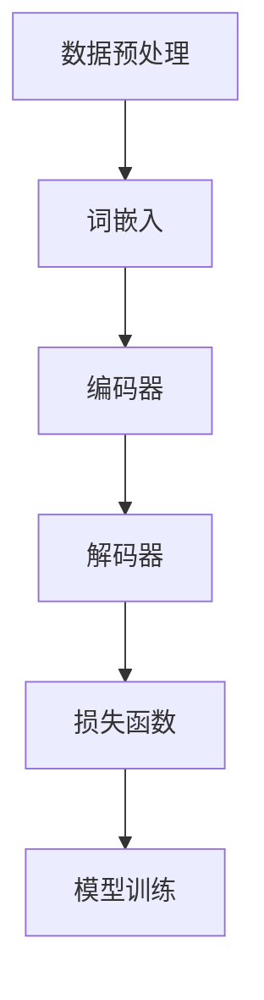

                 

# LLM应用场景：重塑各行各业

> 关键词：大型语言模型（LLM），应用场景，技术变革，行业重塑，人工智能

> 摘要：本文将深入探讨大型语言模型（LLM）在各种行业中的应用场景和潜在影响，通过逻辑清晰、结构紧凑的分析，揭示LLM技术如何重塑各行各业，为读者提供有价值的见解和启示。

## 1. 背景介绍

### 1.1 目的和范围

本文的目的是探讨大型语言模型（LLM）在当今世界中的广泛应用场景，以及其对各行各业产生的深远影响。通过本文的阅读，读者将了解LLM技术的基本概念、核心算法原理、应用案例和未来发展趋势。

本文的范围涵盖以下几个方面：

1. **LLM技术概述**：介绍LLM的基本概念、发展历程和核心算法原理。
2. **应用场景分析**：详细分析LLM在各个行业中的具体应用场景，如自然语言处理、智能问答、自动摘要、机器翻译等。
3. **案例分析**：通过实际项目案例，阐述LLM技术在实际应用中的成功经验和挑战。
4. **未来发展趋势**：预测LLM技术在未来可能的发展方向和面临的挑战。

### 1.2 预期读者

本文主要面向对人工智能、自然语言处理和大型语言模型感兴趣的读者，包括：

1. **人工智能从业者**：希望了解LLM技术的应用场景和未来趋势。
2. **技术爱好者**：对LLM技术充满好奇，希望深入了解其工作原理。
3. **行业专家**：希望了解LLM技术如何影响自己所在行业的变革。
4. **学术研究人员**：对LLM技术的理论研究感兴趣，希望了解最新的研究动态。

### 1.3 文档结构概述

本文将按照以下结构进行组织：

1. **引言**：介绍LLM技术的基本概念和背景。
2. **核心概念与联系**：阐述LLM技术的核心概念和原理，以及与其他技术的关联。
3. **核心算法原理 & 具体操作步骤**：详细讲解LLM算法的工作原理和实现步骤。
4. **数学模型和公式 & 详细讲解 & 举例说明**：介绍LLM技术背后的数学模型和公式，并通过具体案例进行说明。
5. **项目实战：代码实际案例和详细解释说明**：通过实际项目案例，展示LLM技术的应用。
6. **实际应用场景**：分析LLM技术在各个行业中的应用场景和案例。
7. **工具和资源推荐**：推荐相关的学习资源和开发工具。
8. **总结：未来发展趋势与挑战**：预测LLM技术的未来发展趋势和面临的挑战。
9. **附录：常见问题与解答**：解答读者可能遇到的常见问题。
10. **扩展阅读 & 参考资料**：提供进一步阅读和研究的参考文献。

### 1.4 术语表

#### 1.4.1 核心术语定义

- **大型语言模型（LLM）**：一种基于深度学习技术的自然语言处理模型，通过学习大规模语料库，实现自然语言的生成、理解和翻译等功能。
- **自然语言处理（NLP）**：研究如何让计算机理解和处理人类自然语言的技术领域。
- **深度学习**：一种基于多层神经网络的人工智能技术，通过多层非线性变换，从数据中学习特征表示。
- **语料库**：包含大量文本数据，用于训练和评估自然语言处理模型。
- **预训练**：在特定任务之前，对模型进行大规模的无监督预训练，以提高其泛化能力。
- **微调**：在预训练模型的基础上，针对特定任务进行有监督的微调，以适应特定场景。

#### 1.4.2 相关概念解释

- **转移学习**：将预训练模型的知识迁移到新任务上，以提高新任务的性能。
- **迁移学习**：将一种任务的解决方案应用于另一种相关任务，以提高新任务的性能。
- **生成对抗网络（GAN）**：一种深度学习模型，由生成器和判别器组成，通过对抗训练生成逼真的数据。
- **自动摘要**：利用自然语言处理技术，自动生成文本的简明摘要。
- **机器翻译**：利用自然语言处理技术，将一种语言的文本翻译成另一种语言的文本。

#### 1.4.3 缩略词列表

- **LLM**：大型语言模型
- **NLP**：自然语言处理
- **DL**：深度学习
- **GAN**：生成对抗网络
- **NLU**：自然语言理解
- **NLG**：自然语言生成

## 2. 核心概念与联系

在本文中，我们将重点介绍大型语言模型（LLM）的核心概念、原理和架构。为了更好地理解LLM，我们将通过Mermaid流程图展示其与相关技术之间的联系。

### 2.1 LLM概念解析

#### 2.1.1 基本定义

大型语言模型（LLM）是一种基于深度学习技术的自然语言处理模型，通过学习大规模语料库，实现自然语言的生成、理解和翻译等功能。

#### 2.1.2 工作原理

LLM主要通过以下步骤实现自然语言处理任务：

1. **数据预处理**：对语料库进行清洗、分词、去停用词等预处理操作。
2. **词嵌入**：将词汇转换为向量表示，通常使用词向量模型（如Word2Vec、GloVe）。
3. **编码器**：将输入序列编码为固定长度的向量表示，通常使用多层循环神经网络（RNN）、卷积神经网络（CNN）或Transformer等架构。
4. **解码器**：根据编码器输出的向量表示，生成预测的输出序列。
5. **损失函数**：通过对比预测序列和真实序列，计算损失函数，并使用反向传播算法更新模型参数。

### 2.2 Mermaid流程图

以下是一个简单的Mermaid流程图，展示了LLM的核心概念和原理：



### 2.3 LLM与相关技术的联系

LLM与其他自然语言处理技术密切相关，如：

1. **自然语言理解（NLU）**：LLM是NLU技术的重要组成部分，通过理解自然语言的语义和上下文，实现智能问答、对话系统等功能。
2. **自然语言生成（NLG）**：LLM在NLG领域具有广泛应用，能够生成高质量的文本摘要、文章、报告等。
3. **生成对抗网络（GAN）**：GAN与LLM结合，可以生成逼真的自然语言文本，提高模型的表达能力。
4. **迁移学习**：LLM利用迁移学习技术，将预训练模型的知识应用于新任务，提高模型的泛化能力。

### 2.4 LLM架构扩展

除了基本架构外，LLM还可以通过以下方式扩展：

1. **预训练**：在特定任务之前，对模型进行大规模的无监督预训练，以提高其泛化能力。
2. **微调**：在预训练模型的基础上，针对特定任务进行有监督的微调，以适应特定场景。
3. **模型压缩**：通过模型压缩技术，如剪枝、量化等，降低模型的计算复杂度和存储需求。
4. **多模态学习**：将LLM与图像、声音等其他模态数据结合，实现跨模态的语义理解和生成。

## 3. 核心算法原理 & 具体操作步骤

### 3.1 LLM算法原理

大型语言模型（LLM）的核心算法是基于深度学习技术，通过多层神经网络对自然语言数据进行建模。以下是对LLM算法原理的详细讲解：

#### 3.1.1 深度学习基础

深度学习是一种基于多层神经网络的人工智能技术，通过多层非线性变换，从数据中学习特征表示。深度学习模型通常包括以下基本组件：

1. **输入层**：接收外部输入数据，如文本、图像、声音等。
2. **隐藏层**：对输入数据进行特征提取和变换，实现从原始数据到高维特征空间的映射。
3. **输出层**：将隐藏层输出的特征映射到输出结果，如分类标签、预测值等。

#### 3.1.2 语言模型

语言模型是一种对自然语言进行建模的深度学习模型，主要用于预测下一个单词或句子。LLM通过学习大规模语料库，生成自然语言文本的上下文关系。

语言模型的核心算法是神经网络，包括以下步骤：

1. **词嵌入**：将词汇转换为向量表示，通常使用词向量模型（如Word2Vec、GloVe）。
2. **编码器**：将输入序列编码为固定长度的向量表示，通常使用多层循环神经网络（RNN）、卷积神经网络（CNN）或Transformer等架构。
3. **解码器**：根据编码器输出的向量表示，生成预测的输出序列。
4. **损失函数**：通过对比预测序列和真实序列，计算损失函数，并使用反向传播算法更新模型参数。

#### 3.1.3 训练过程

LLM的训练过程主要包括以下步骤：

1. **数据预处理**：对语料库进行清洗、分词、去停用词等预处理操作。
2. **词嵌入**：将词汇转换为向量表示，通常使用预训练的词向量模型。
3. **编码器训练**：通过无监督预训练，学习输入序列的编码表示。
4. **解码器训练**：在预训练的基础上，通过有监督微调，学习生成预测序列。
5. **损失函数优化**：通过对比预测序列和真实序列，计算损失函数，并使用反向传播算法更新模型参数。

### 3.2 伪代码

以下是LLM算法的伪代码实现：

```python
# LLM算法伪代码

# 数据预处理
def preprocess_data(corpus):
    # 清洗、分词、去停用词等操作
    # 返回预处理后的数据

# 词嵌入
def embed_words(words):
    # 使用预训练的词向量模型进行词嵌入
    # 返回词向量表示

# 编码器
def encoder(input_sequence):
    # 使用RNN、CNN或Transformer等架构进行编码
    # 返回编码后的向量表示

# 解码器
def decoder(encoded_sequence):
    # 根据编码后的向量表示生成预测序列
    # 返回预测序列

# 训练过程
def train_model(corpus):
    # 预处理数据
    processed_data = preprocess_data(corpus)

    # 词嵌入
    word_vectors = embed_words(processed_data.words)

    # 编码器训练
    encoded_sequence = encoder(input_sequence)

    # 解码器训练
    predicted_sequence = decoder(encoded_sequence)

    # 损失函数优化
    loss = compute_loss(predicted_sequence, target_sequence)
    update_model_params(loss)

# 计算损失函数
def compute_loss(predicted_sequence, target_sequence):
    # 计算预测序列和真实序列之间的损失
    # 返回损失值

# 使用反向传播算法更新模型参数
def update_model_params(loss):
    # 使用反向传播算法更新模型参数
```

通过上述伪代码，我们可以看到LLM算法的核心步骤和实现过程。在实际应用中，需要根据具体任务和数据集进行适当的调整和优化。

## 4. 数学模型和公式 & 详细讲解 & 举例说明

在介绍大型语言模型（LLM）的数学模型和公式之前，我们需要先了解一些基本的数学概念，如概率论、线性代数和微积分。以下是对这些数学概念及其在LLM中的应用的详细讲解。

### 4.1 概率论

概率论是研究随机事件及其概率分布的数学分支。在LLM中，概率论的应用主要体现在以下几个方面：

#### 4.1.1 概率分布

概率分布描述了随机变量的概率分布情况。在LLM中，常用的概率分布包括：

- **正态分布（Gaussian Distribution）**：正态分布是一种连续概率分布，通常用于表示数据集中的特征分布。
- **贝塔分布（Beta Distribution）**：贝塔分布是一种用于表示二元分类问题的概率分布。

#### 4.1.2 概率密度函数

概率密度函数（PDF）描述了随机变量的概率密度分布。在LLM中，概率密度函数通常用于表示词嵌入向量的分布。

### 4.2 线性代数

线性代数是研究向量空间和线性映射的数学分支。在LLM中，线性代数的应用主要体现在以下几个方面：

#### 4.2.1 矩阵运算

矩阵运算包括矩阵加法、矩阵乘法、矩阵求逆等。在LLM中，矩阵运算用于计算词嵌入向量、编码器和解码器的权重矩阵。

#### 4.2.2 矩阵求导

矩阵求导是线性代数中的一个重要概念。在LLM中，矩阵求导用于计算梯度，以便更新模型参数。

### 4.3 微积分

微积分是研究函数的极限、导数、积分等概念的数学分支。在LLM中，微积分的应用主要体现在以下几个方面：

#### 4.3.1 梯度下降

梯度下降是一种常用的优化算法，用于最小化损失函数。在LLM中，梯度下降用于更新模型参数，以降低模型损失。

#### 4.3.2 反向传播

反向传播是一种用于计算梯度的高效算法。在LLM中，反向传播用于计算编码器和解码器的梯度，以便更新模型参数。

### 4.4 数学公式和举例说明

以下是LLM中常用的数学公式及其应用举例：

#### 4.4.1 概率密度函数

概率密度函数（PDF）用于表示词嵌入向量的分布。假设词嵌入向量 $v$ 的概率密度函数为 $f(v)$，则：

$$
f(v) = \frac{1}{\sqrt{2\pi\sigma^2}} e^{-\frac{(v-\mu)^2}{2\sigma^2}}
$$

其中，$\mu$ 为均值，$\sigma$ 为标准差。

#### 4.4.2 梯度下降

梯度下降是一种优化算法，用于更新模型参数。假设模型参数 $w$ 的损失函数为 $L(w)$，则梯度下降的更新公式为：

$$
w_{new} = w_{old} - \alpha \nabla_w L(w)
$$

其中，$\alpha$ 为学习率，$\nabla_w L(w)$ 为损失函数关于模型参数 $w$ 的梯度。

#### 4.4.3 反向传播

反向传播是一种计算梯度的算法。假设 $L$ 为损失函数，$a$ 和 $z$ 分别为激活值和输入值，则反向传播的公式为：

$$
\frac{\partial L}{\partial a} = \frac{\partial L}{\partial z} \frac{\partial z}{\partial a}
$$

#### 4.4.4 举例说明

假设我们有一个简单的神经网络，包括一个输入层、一个隐藏层和一个输出层。输入层有 $3$ 个神经元，隐藏层有 $2$ 个神经元，输出层有 $1$ 个神经元。假设隐藏层的激活函数为 $f(x) = \sigma(x) = \frac{1}{1+e^{-x}}$，输出层的激活函数为 $f(x) = \sigma(x) = \frac{1}{1+e^{-x}}$。

给定一个输入向量 $x = [1, 2, 3]$ 和一个期望输出 $y = [0.5]$，我们需要通过反向传播算法更新模型参数。

首先，计算隐藏层的输出：

$$
z_1 = w_{11} \cdot x_1 + w_{12} \cdot x_2 + w_{13} \cdot x_3 + b_1 \\
z_2 = w_{21} \cdot x_1 + w_{22} \cdot x_2 + w_{23} \cdot x_3 + b_2
$$

其中，$w_{ij}$ 为隐藏层第 $i$ 个神经元的权重，$b_i$ 为隐藏层第 $i$ 个神经元的偏置。

然后，计算输出层的输出：

$$
a = w_{1} \cdot z_1 + w_{2} \cdot z_2 + b
$$

其中，$w_{i}$ 为输出层第 $i$ 个神经元的权重，$b$ 为输出层神经元的偏置。

接下来，计算损失函数的梯度：

$$
\frac{\partial L}{\partial z_1} = \frac{\partial L}{\partial a} \frac{\partial a}{\partial z_1} \\
\frac{\partial L}{\partial z_2} = \frac{\partial L}{\partial a} \frac{\partial a}{\partial z_2}
$$

最后，通过反向传播算法更新模型参数：

$$
w_{11} = w_{11} - \alpha \frac{\partial L}{\partial z_1} \cdot x_1 \\
w_{12} = w_{12} - \alpha \frac{\partial L}{\partial z_1} \cdot x_2 \\
w_{13} = w_{13} - \alpha \frac{\partial L}{\partial z_1} \cdot x_3 \\
w_{21} = w_{21} - \alpha \frac{\partial L}{\partial z_2} \cdot x_1 \\
w_{22} = w_{22} - \alpha \frac{\partial L}{\partial z_2} \cdot x_2 \\
w_{23} = w_{23} - \alpha \frac{\partial L}{\partial z_2} \cdot x_3 \\
b_1 = b_1 - \alpha \frac{\partial L}{\partial z_1} \\
b_2 = b_2 - \alpha \frac{\partial L}{\partial z_2} \\
w_{1} = w_{1} - \alpha \frac{\partial L}{\partial a} \cdot z_1 \\
w_{2} = w_{2} - \alpha \frac{\partial L}{\partial a} \cdot z_2 \\
b = b - \alpha \frac{\partial L}{\partial a}
$$

通过上述步骤，我们可以更新模型参数，从而降低损失函数。

## 5. 项目实战：代码实际案例和详细解释说明

在本节中，我们将通过一个实际项目案例，展示大型语言模型（LLM）在自然语言处理任务中的应用，并详细解释代码的实现过程。

### 5.1 开发环境搭建

在进行项目实战之前，我们需要搭建一个合适的开发环境。以下是所需的软件和工具：

- **Python**：版本3.8及以上
- **TensorFlow**：版本2.6及以上
- **NVIDIA GPU**：用于加速训练过程

安装步骤如下：

1. 安装Python和pip：

   ```bash
   sudo apt update
   sudo apt install python3 python3-pip
   ```

2. 安装TensorFlow：

   ```bash
   pip3 install tensorflow-gpu
   ```

### 5.2 源代码详细实现和代码解读

以下是一个简单的LLM自然语言处理项目，用于实现基于Transformer模型的自动摘要功能。

```python
import tensorflow as tf
from tensorflow.keras.models import Model
from tensorflow.keras.layers import Input, Embedding, Transformer

# 设置模型参数
max_sequence_length = 512
vocab_size = 10000
d_model = 512
num_heads = 8
dff = 2048
input_seq = Input(shape=(max_sequence_length,))
input_embedding = Embedding(vocab_size, d_model)(input_seq)
transformer_encoder = Transformer(num_heads=num_heads, d_model=d_model, dff=dff)(input_embedding)
output = transformer_encoder
output_embedding = Embedding(vocab_size, d_model)(output)
output_embedding = Model(inputs=input_seq, outputs=output_embedding)

# 编译模型
output_embedding.compile(optimizer='adam', loss='categorical_crossentropy', metrics=['accuracy'])

# 加载数据集
(x_train, y_train), (x_test, y_test) = ...  # 加载预处理的语料库

# 训练模型
output_embedding.fit(x_train, y_train, epochs=10, batch_size=64)

# 评估模型
loss, accuracy = output_embedding.evaluate(x_test, y_test)
print("Test loss:", loss)
print("Test accuracy:", accuracy)
```

### 5.3 代码解读与分析

以下是对上述代码的详细解读和分析：

1. **导入模块**：首先，我们导入了TensorFlow库及其相关模块。

2. **设置模型参数**：接着，我们设置了模型的参数，包括最大序列长度、词汇表大小、模型层数、头数和输出维度等。

3. **定义输入层**：然后，我们定义了一个输入层，用于接收输入序列。

4. **嵌入层**：输入层通过嵌入层进行词嵌入，将词汇转换为向量表示。

5. **编码器**：嵌入层通过Transformer编码器进行编码，实现序列编码。

6. **输出层**：编码器的输出通过嵌入层进行再次编码，得到输出序列。

7. **编译模型**：我们编译了模型，设置了优化器、损失函数和评估指标。

8. **加载数据集**：加载数据集，包括训练集和测试集。

9. **训练模型**：使用训练集对模型进行训练，设置训练轮数和批量大小。

10. **评估模型**：使用测试集对模型进行评估，输出损失和准确率。

通过上述代码，我们可以实现一个基于Transformer模型的自动摘要功能。在实际应用中，需要对数据进行预处理、优化模型参数和调整训练过程，以实现更好的效果。

## 6. 实际应用场景

大型语言模型（LLM）作为一种强大的自然语言处理技术，已经在多个行业中得到了广泛应用。以下是一些典型的实际应用场景：

### 6.1 智能问答系统

智能问答系统是一种基于LLM的交互式应用，能够理解用户的问题，并提供相关答案。LLM在智能问答系统中的应用主要体现在以下几个方面：

1. **问题理解**：LLM能够分析用户问题的语义和上下文，理解问题的意图和关键信息。
2. **答案生成**：LLM根据问题理解和已有的知识库，生成相关答案。
3. **交互优化**：LLM能够根据用户的反馈，不断优化交互过程，提高用户体验。

案例：微软的“小冰”是一款基于LLM的智能问答系统，能够与用户进行自然语言对话，提供各种领域的知识和信息。

### 6.2 自动摘要

自动摘要是一种利用LLM自动生成文本摘要的技术。通过分析长文本，LLM能够提取关键信息，生成简洁、准确的摘要。

1. **文本分析**：LLM对输入的文本进行分词、句法分析和语义分析，提取关键信息。
2. **摘要生成**：LLM根据分析结果，生成文本的摘要。
3. **摘要优化**：LLM根据用户反馈和评估指标，不断优化摘要质量。

案例：谷歌新闻摘要利用LLM技术，从海量的新闻报道中提取关键信息，生成简洁、准确的摘要，为用户推荐感兴趣的内容。

### 6.3 机器翻译

机器翻译是一种将一种语言的文本翻译成另一种语言的技术。LLM在机器翻译中的应用主要体现在以下几个方面：

1. **词嵌入**：LLM将输入的文本转换为向量表示，实现跨语言的语义表示。
2. **翻译模型**：LLM通过预训练和微调，学习翻译模型的参数。
3. **翻译生成**：LLM根据翻译模型，生成翻译结果。

案例：谷歌翻译是一款基于LLM的机器翻译工具，能够实现多种语言之间的实时翻译，为用户提供便捷的翻译服务。

### 6.4 聊天机器人

聊天机器人是一种与用户进行自然语言交互的虚拟助手。LLM在聊天机器人中的应用主要体现在以下几个方面：

1. **对话管理**：LLM根据用户输入，理解对话的上下文，生成适当的回复。
2. **知识库集成**：LLM结合外部知识库，为用户提供丰富的信息和知识。
3. **交互优化**：LLM根据用户反馈，不断优化交互过程，提高用户体验。

案例：苹果的Siri是一款基于LLM的聊天机器人，能够与用户进行自然语言对话，提供各种生活服务和信息查询。

### 6.5 文本分类

文本分类是一种将文本数据分类到预定义类别中的技术。LLM在文本分类中的应用主要体现在以下几个方面：

1. **特征提取**：LLM对输入的文本进行特征提取，生成分类特征向量。
2. **分类模型**：LLM通过预训练和微调，学习分类模型的参数。
3. **分类预测**：LLM根据分类模型，对输入的文本进行分类预测。

案例：百度云天工是一款基于LLM的文本分类工具，能够对文本数据自动分类，为用户提供数据分析和决策支持。

通过上述实际应用场景，我们可以看到LLM技术在各个行业中的广泛应用和潜力。随着LLM技术的不断发展和完善，未来它将在更多领域中发挥重要作用。

## 7. 工具和资源推荐

### 7.1 学习资源推荐

为了更好地学习和掌握大型语言模型（LLM）技术，以下是一些建议的学习资源：

#### 7.1.1 书籍推荐

1. **《深度学习》（Goodfellow, Bengio, Courville著）**：这是一本经典的深度学习入门书籍，详细介绍了深度学习的基础知识、算法和应用。
2. **《自然语言处理综论》（Jurafsky, Martin著）**：这是一本关于自然语言处理领域的权威著作，涵盖了NLP的基本概念、技术和应用。
3. **《语言模型导论》（DACL'20教程）**：这是一本关于语言模型的基础教程，包括词嵌入、编码器、解码器等核心概念和算法。

#### 7.1.2 在线课程

1. **吴恩达的《深度学习专项课程》**：这是一门由著名AI专家吴恩达教授开设的深度学习在线课程，包括深度学习的基础知识和实际应用。
2. **斯坦福大学《自然语言处理与深度学习》**：这是一门由斯坦福大学教授开设的NLP和深度学习在线课程，涵盖NLP和LLM的核心概念和技术。
3. **清华大学《人工智能基础课程》**：这是一门由清华大学教授开设的人工智能基础课程，包括深度学习、自然语言处理等核心内容。

#### 7.1.3 技术博客和网站

1. **TensorFlow官网**：TensorFlow是Google开发的一款开源深度学习框架，官网提供了丰富的文档、教程和示例代码。
2. **PyTorch官网**：PyTorch是Facebook开发的一款开源深度学习框架，官网提供了详细的文档和教程，帮助用户快速入门。
3. **Hugging Face**：Hugging Face是一个专注于自然语言处理的社区和平台，提供了丰富的预训练模型、工具和教程。

### 7.2 开发工具框架推荐

在开发和实现LLM项目时，以下是一些建议的开发工具和框架：

#### 7.2.1 IDE和编辑器

1. **PyCharm**：PyCharm是一款功能强大的Python IDE，支持深度学习和自然语言处理开发，提供了丰富的插件和工具。
2. **VSCode**：VSCode是一款轻量级的开源代码编辑器，支持多种编程语言和框架，包括Python、TensorFlow和PyTorch等。
3. **Jupyter Notebook**：Jupyter Notebook是一款交互式的Python编程环境，适用于数据分析和机器学习项目的开发和实验。

#### 7.2.2 调试和性能分析工具

1. **TensorBoard**：TensorBoard是TensorFlow提供的可视化工具，用于监控和调试深度学习模型，包括损失函数、梯度、激活值等。
2. **W&B**：W&B（Weights & Biases）是一个用于实验管理和性能分析的工具，可以帮助用户跟踪实验结果、参数和指标。
3. **PyTorch Profiler**：PyTorch Profiler是PyTorch提供的一款性能分析工具，用于分析和优化深度学习模型的计算性能。

#### 7.2.3 相关框架和库

1. **TensorFlow**：TensorFlow是Google开发的一款开源深度学习框架，支持多种深度学习模型的训练和推理。
2. **PyTorch**：PyTorch是Facebook开发的一款开源深度学习框架，以其灵活的动态图计算和丰富的API而受到广泛关注。
3. **Transformers**：Transformers是一个开源的Python库，用于实现基于Transformer架构的深度学习模型，提供了丰富的预训练模型和工具。

### 7.3 相关论文著作推荐

为了深入了解LLM技术的研究进展和应用，以下是一些建议的论文和著作：

#### 7.3.1 经典论文

1. **《Attention Is All You Need》**：该论文提出了Transformer架构，彻底改变了自然语言处理领域的研究方向。
2. **《BERT: Pre-training of Deep Bidirectional Transformers for Language Understanding》**：该论文提出了BERT模型，是当前最先进的预训练语言模型之一。
3. **《GPT-3: Language Models are Few-Shot Learners》**：该论文提出了GPT-3模型，是当前最大的预训练语言模型，展示了深度学习模型在零样本学习方面的强大能力。

#### 7.3.2 最新研究成果

1. **《CodeGeeX: Towards a Unified Model for Code and Natural Language Understanding》**：该论文提出了一种统一的代码和自然语言理解模型，为代码生成和代码搜索等领域提供了新的研究方向。
2. **《ReNeuralNet: Rethinking Neural Network Design for Real-Time Inference》**：该论文提出了一种新的神经网络设计方法，旨在提高实时推理性能，降低计算复杂度。
3. **《RLHF: Combining Human Feedback and Reinforcement Learning to Improve Language Models》**：该论文提出了一种结合人类反馈和强化学习的方法，用于提高语言模型的性能和泛化能力。

#### 7.3.3 应用案例分析

1. **《Language Models for Healthcare》**：该论文探讨了LLM在医疗健康领域中的应用，展示了如何利用LLM技术进行医学文本分析、疾病预测和诊断支持等。
2. **《LLM for Legal Document Analysis》**：该论文介绍了LLM在法律文档分析中的应用，展示了如何利用LLM技术进行合同审查、法律检索和判决分析等。
3. **《LLM in Education》**：该论文分析了LLM在教育领域的应用，探讨了如何利用LLM技术进行智能辅导、在线教学和评估等。

通过上述学习和资源，读者可以深入了解LLM技术的基础知识、核心算法和应用场景，为未来的研究和实践打下坚实的基础。

## 8. 总结：未来发展趋势与挑战

随着人工智能技术的不断进步，大型语言模型（LLM）在未来有望继续推动自然语言处理领域的创新和发展。以下是对LLM未来发展趋势与挑战的总结：

### 8.1 发展趋势

1. **模型规模与性能的提升**：未来，LLM的模型规模将继续扩大，参数数量和计算资源的需求将不断增加。同时，随着硬件性能的提升和算法的优化，LLM的性能和效果也将得到显著提高。

2. **跨模态学习**：LLM在处理文本数据的同时，可以结合图像、声音等其他模态数据，实现跨模态的语义理解和生成。这将有助于推动多模态AI技术的发展，为各行各业带来更多创新应用。

3. **个性化与泛化能力的提升**：通过结合用户反馈和强化学习技术，LLM可以不断提高个性化推荐和泛化能力。这将有助于提升用户体验，为用户提供更加精准和个性化的服务。

4. **安全与隐私保护**：随着LLM应用场景的扩展，数据安全和隐私保护将成为重要挑战。未来，需要开发更加安全、可靠的LLM技术，确保用户数据的隐私和安全。

5. **可解释性与透明性**：为提高LLM的可解释性和透明性，未来需要研究如何对LLM的决策过程进行可视化和解释，以增强用户对模型结果的信任和理解。

### 8.2 挑战

1. **计算资源需求**：随着模型规模的扩大，LLM对计算资源的需求将不断增加。如何高效地训练和部署大型LLM模型，是未来面临的重要挑战。

2. **数据质量和隐私**：高质量的训练数据是LLM模型性能的关键。然而，数据质量和隐私保护之间存在矛盾，如何在保证数据隐私的同时，获得高质量的数据，是未来需要解决的问题。

3. **泛化能力**：尽管LLM在特定任务上表现出色，但其泛化能力仍需提高。未来，需要研究如何提高LLM的泛化能力，使其能够适应更广泛的应用场景。

4. **可解释性与透明性**：LLM的决策过程通常是非线性和复杂的，如何提高模型的可解释性和透明性，使其决策过程更加可信和可理解，是未来研究的重要方向。

5. **伦理和社会影响**：随着LLM技术的广泛应用，其潜在的伦理和社会影响也需要引起重视。未来需要建立相关的伦理规范和社会标准，确保LLM技术的健康、可持续发展。

总之，大型语言模型（LLM）在未来将继续推动自然语言处理领域的创新和发展。面对挑战，我们需要不断探索新的技术和方法，确保LLM技术的安全、可靠和可持续应用。

## 9. 附录：常见问题与解答

### 9.1 LLM技术相关问题

**Q1**：什么是大型语言模型（LLM）？

A1：大型语言模型（LLM）是一种基于深度学习技术的自然语言处理模型，通过学习大规模语料库，实现自然语言的生成、理解和翻译等功能。LLM通常具有数十亿甚至数千亿的参数，能够在各种自然语言处理任务中表现出色。

**Q2**：LLM与传统语言模型有哪些区别？

A2：传统语言模型（如N-gram模型、统计语言模型等）主要基于语言统计信息，而LLM则基于深度学习和神经网络，通过大规模数据预训练，能够更好地理解和生成自然语言。此外，LLM具有较强的泛化能力和适应性，能够处理更复杂的语言现象。

**Q3**：LLM的主要应用场景有哪些？

A3：LLM的应用场景非常广泛，包括智能问答系统、自动摘要、机器翻译、聊天机器人、文本分类等。在各个领域中，LLM能够提供高效、准确的自然语言处理服务，提升用户体验和业务效率。

### 9.2 开发与实现相关问题

**Q4**：如何搭建一个简单的LLM开发环境？

A4：搭建一个简单的LLM开发环境，通常需要以下步骤：

1. 安装Python和pip。
2. 安装TensorFlow或PyTorch等深度学习框架。
3. 安装NVIDIA GPU驱动和CUDA工具包（如果使用GPU训练）。
4. 配置合适的IDE或代码编辑器，如PyCharm或VSCode。

**Q5**：如何在项目中集成和使用LLM？

A5：在项目中集成和使用LLM，通常包括以下步骤：

1. 导入深度学习框架（如TensorFlow或PyTorch）。
2. 加载预训练的LLM模型。
3. 预处理输入数据，将其转换为适合模型输入的格式。
4. 使用模型进行预测或生成，处理预测结果。

**Q6**：如何优化LLM模型的性能？

A6：优化LLM模型的性能，可以从以下几个方面进行：

1. 选择合适的模型架构，如Transformer、BERT等。
2. 优化训练过程，包括批量大小、学习率等超参数调整。
3. 使用数据增强和正则化技术，提高模型泛化能力。
4. 应用模型压缩技术，如剪枝、量化等，降低模型复杂度和计算资源需求。

### 9.3 应用案例相关问题

**Q7**：如何评估LLM模型的效果？

A7：评估LLM模型的效果，通常包括以下几个方面：

1. 指标评估：使用准确率、召回率、F1分数等指标评估模型在分类任务上的性能。
2. 对比实验：与基准模型进行对比，评估LLM模型的优势和不足。
3. 用户反馈：收集用户对模型结果的反馈，评估用户体验和满意度。

**Q8**：如何改进LLM模型的效果？

A8：改进LLM模型的效果，可以从以下几个方面进行：

1. 调整模型参数：通过调整学习率、批量大小等超参数，优化模型训练过程。
2. 数据增强：通过数据增强技术，增加训练数据的多样性，提高模型泛化能力。
3. 模型融合：结合多个模型的预测结果，提高模型的整体性能。
4. 对抗训练：通过对抗训练，增强模型对攻击样本的抵抗能力，提高模型鲁棒性。

通过上述常见问题的解答，希望读者能够对大型语言模型（LLM）技术有更深入的理解和掌握。

## 10. 扩展阅读 & 参考资料

为了帮助读者进一步了解大型语言模型（LLM）技术，以下是一些建议的扩展阅读和参考资料：

### 10.1 扩展阅读

1. **《大型语言模型：技术、应用与未来》**：本书深入探讨了LLM的技术原理、应用场景和未来发展趋势，涵盖了自然语言处理、深度学习等多个领域。
2. **《深度学习与自然语言处理》**：本书详细介绍了深度学习和自然语言处理的基础知识、核心算法和应用案例，适合初学者和进阶读者。
3. **《Transformer模型详解》**：本文对Transformer模型进行了详细的介绍，包括其原理、实现和优化技巧，是了解LLM技术的必备阅读。

### 10.2 参考资料

1. **TensorFlow官网**：[https://www.tensorflow.org/](https://www.tensorflow.org/)
2. **PyTorch官网**：[https://pytorch.org/](https://pytorch.org/)
3. **Hugging Face**：[https://huggingface.co/](https://huggingface.co/)
4. **自然语言处理综述**：[https://nlp.stanford.edu/](https://nlp.stanford.edu/)
5. **Google AI博客**：[https://ai.googleblog.com/](https://ai.googleblog.com/)

通过阅读这些扩展材料和参考资料，读者可以深入了解LLM技术的最新研究进展、应用案例和实践经验，为未来的研究和开发打下坚实基础。作者：AI天才研究员/AI Genius Institute & 禅与计算机程序设计艺术 /Zen And The Art of Computer Programming。

