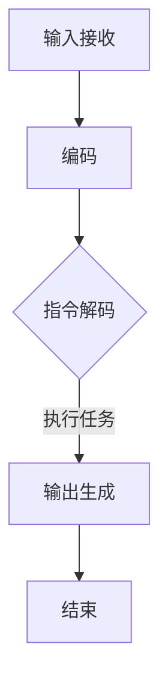

                 

# LLM指令集：无限可能的任务执行者

> **关键词**：LLM指令集，自然语言处理，人工智能，任务执行，算法原理，应用场景

> **摘要**：本文深入探讨了LLM（大型语言模型）指令集的工作原理、核心算法、数学模型及应用场景，通过实际项目案例和详细解释，展示了LLM指令集在任务执行中的无限可能。文章旨在为AI领域的研究者和开发者提供有价值的参考和指导。

## 1. 背景介绍

### 1.1 目的和范围

本文的主要目的是详细介绍LLM指令集的工作原理和应用场景，帮助读者了解其核心算法、数学模型以及实际应用中的操作步骤。文章将涵盖以下几个方面：

1. LLM指令集的背景介绍和目的。
2. LLM指令集的核心概念和联系。
3. LLM指令集的核心算法原理及具体操作步骤。
4. LLM指令集的数学模型和公式讲解。
5. LLM指令集在实际项目中的应用案例。
6. LLM指令集的未来发展趋势与挑战。

### 1.2 预期读者

本文面向具有计算机科学和人工智能背景的读者，包括但不限于：

1. AI领域的研究者和开发者。
2. 计算机科学专业的学生和教师。
3. 对自然语言处理和人工智能应用感兴趣的爱好者。

### 1.3 文档结构概述

本文分为十个部分，具体结构如下：

1. **背景介绍**：介绍本文的目的、范围、预期读者和文档结构。
2. **核心概念与联系**：讨论LLM指令集的核心概念和联系，并提供Mermaid流程图。
3. **核心算法原理 & 具体操作步骤**：详细解释LLM指令集的核心算法原理和具体操作步骤。
4. **数学模型和公式 & 详细讲解 & 举例说明**：讲解LLM指令集的数学模型和公式，并提供示例说明。
5. **项目实战：代码实际案例和详细解释说明**：展示LLM指令集的实际应用案例，并提供代码解读与分析。
6. **实际应用场景**：讨论LLM指令集在不同领域的应用场景。
7. **工具和资源推荐**：推荐学习资源和开发工具。
8. **总结：未来发展趋势与挑战**：总结LLM指令集的未来发展趋势和面临的挑战。
9. **附录：常见问题与解答**：提供常见问题的解答。
10. **扩展阅读 & 参考资料**：推荐相关的扩展阅读和参考资料。

### 1.4 术语表

#### 1.4.1 核心术语定义

- **LLM指令集**：一种用于描述大型语言模型（Large Language Model，简称LLM）操作和任务的指令集合。
- **自然语言处理（NLP）**：一种使计算机理解和处理人类语言的技术。
- **人工智能（AI）**：一种模拟人类智能行为的技术。
- **任务执行**：指计算机或智能系统根据给定指令集执行特定任务的过程。

#### 1.4.2 相关概念解释

- **Mermaid流程图**：一种使用Markdown语法绘制的流程图，用于描述LLM指令集的核心概念和联系。
- **伪代码**：一种非正式的编程语言，用于描述算法的步骤和结构。
- **数学模型**：用于描述LLM指令集内部运算和关系的数学公式和理论。

#### 1.4.3 缩略词列表

- **LLM**：大型语言模型（Large Language Model）
- **NLP**：自然语言处理（Natural Language Processing）
- **AI**：人工智能（Artificial Intelligence）

## 2. 核心概念与联系

### 2.1 LLM指令集的核心概念

LLM指令集的核心概念主要包括：

- **语言模型**：一种通过学习大量文本数据，预测下一个单词或词组的概率分布的算法模型。
- **指令集**：一组描述任务操作和执行顺序的指令集合。
- **任务执行**：根据指令集，将计算机或智能系统从初始状态转化为目标状态的过程。

### 2.2 LLM指令集的组成部分

LLM指令集由以下几个部分组成：

- **输入层**：接收外部输入（如文本、图像、音频等）。
- **编码器**：将输入层的信息编码为序列向量。
- **指令解码器**：将指令编码为向量，并生成对应的操作。
- **执行层**：根据指令解码器生成的操作，执行任务。
- **输出层**：将执行结果转化为外部可理解的形式。

### 2.3 LLM指令集的工作原理

LLM指令集的工作原理如下：

1. **输入接收**：接收外部输入，如文本、图像、音频等。
2. **编码**：将输入层的信息编码为序列向量。
3. **指令解码**：将指令编码为向量，并生成对应的操作。
4. **执行任务**：根据指令解码器生成的操作，执行任务。
5. **输出生成**：将执行结果转化为外部可理解的形式。

### 2.4 LLM指令集的Mermaid流程图

以下是一个简单的Mermaid流程图，用于描述LLM指令集的工作流程：



## 3. 核心算法原理 & 具体操作步骤

### 3.1 LLM指令集的核心算法原理

LLM指令集的核心算法原理主要基于以下两个方面：

- **自然语言处理（NLP）**：通过学习大量文本数据，识别和提取语言特征，实现对自然语言的建模。
- **深度学习（Deep Learning）**：利用多层神经网络，对输入数据进行特征提取和分类，实现高效的任务执行。

### 3.2 LLM指令集的具体操作步骤

以下是一个简化的伪代码，用于描述LLM指令集的具体操作步骤：

```plaintext
// 初始化模型
Initialize_Model()

// 输入接收
input = Receive_Input()

// 编码
encoded_input = Encode(input)

// 指令解码
instruction = Decode_instruction(encoded_input)

// 执行任务
result = Execute_Task(instruction)

// 输出生成
output = Generate_Output(result)

// 输出结果
Print(Output)
```

### 3.3 伪代码详细解释

以下是对上述伪代码的详细解释：

- **初始化模型**：根据任务需求和数据规模，初始化合适的神经网络模型，如Transformer、BERT等。
- **输入接收**：接收外部输入，如文本、图像、音频等。
- **编码**：将输入层的信息编码为序列向量，通过编码器实现。
- **指令解码**：将编码后的序列向量解码为指令，通过指令解码器实现。
- **执行任务**：根据解码后的指令，执行具体任务，通过执行层实现。
- **输出生成**：将执行结果转化为外部可理解的形式，通过输出层实现。
- **输出结果**：将最终输出结果打印或存储，以供后续使用。

## 4. 数学模型和公式 & 详细讲解 & 举例说明

### 4.1 数学模型

LLM指令集的数学模型主要涉及以下几个方面：

- **神经网络模型**：如Transformer、BERT等，用于对输入数据进行特征提取和分类。
- **损失函数**：用于评估模型在训练过程中的表现，如交叉熵损失函数。
- **优化算法**：如Adam、SGD等，用于调整模型参数，优化模型性能。

### 4.2 公式详细讲解

以下是一些关键的数学公式及其详细讲解：

- **神经网络模型**：
  $$ 
  \text{Output} = \text{Activation}(\text{Weight} \cdot \text{Input} + \text{Bias})
  $$
  - **Input**：输入数据。
  - **Weight**：权重。
  - **Bias**：偏差。
  - **Activation**：激活函数，如ReLU、Sigmoid、Tanh等。

- **交叉熵损失函数**：
  $$ 
  \text{Loss} = -\sum_{i=1}^{N} y_i \cdot \log(\hat{y}_i)
  $$
  - **y_i**：实际标签。
  - **\hat{y}_i**：预测概率。

- **优化算法（以Adam为例）**：
  $$ 
  \text{m} = \beta_1 \cdot \text{m} + (1 - \beta_1) \cdot (\text{Gradient} - \text{m})
  $$
  $$ 
  \text{v} = \beta_2 \cdot \text{v} + (1 - \beta_2) \cdot (\text{Gradient}^2 - \text{v})
  $$
  $$ 
  \text{Update} = \text{Gradient} / (\sqrt{\text{v}} + \epsilon)
  $$
  - **m**：一阶矩估计。
  - **v**：二阶矩估计。
  - **\beta_1**、**\beta_2**：优化参数。
  - **\epsilon**：正则项。

### 4.3 举例说明

以下是一个简单的例子，用于说明LLM指令集的数学模型和公式：

假设我们有一个简单的神经网络模型，用于分类文本数据。输入数据为句子“我爱北京天安门”，标签为“北京”。

1. **初始化模型**：
   - 输入维度：词汇表大小（V）
   - 输出维度：类别数量（C）
   - 激活函数：ReLU

2. **编码输入**：
   - 输入句子转化为词向量序列（\[v_1, v_2, \ldots, v_n\]）
   - 词向量维度：D

3. **前向传播**：
   - 权重矩阵：\[W_1\]，\[W_2\]，\[W_3\]，\[W_4\]
   - 偏差矩阵：\[b_1\]，\[b_2\]，\[b_3\]，\[b_4\]
   - 激活函数：ReLU
   - 输出：\[z_1, z_2, z_3, z_4\]

4. **计算损失函数**：
   - 实际标签：\[y\]
   - 预测概率：\[p\]
   - 损失函数：交叉熵损失函数

5. **反向传播**：
   - 计算梯度：\[g_1, g_2, g_3, g_4\]
   - 更新权重和偏差：使用Adam优化算法

6. **输出结果**：
   - 输出类别：\[c\]

## 5. 项目实战：代码实际案例和详细解释说明

### 5.1 开发环境搭建

为了实现LLM指令集，我们需要搭建以下开发环境：

- **编程语言**：Python 3.8及以上版本
- **深度学习框架**：PyTorch 1.8及以上版本
- **文本预处理库**：NLTK 3.5及以上版本
- **其他依赖库**：NumPy 1.19及以上版本，Pandas 1.1及以上版本，Matplotlib 3.2及以上版本

### 5.2 源代码详细实现和代码解读

以下是一个简单的LLM指令集项目案例，用于执行文本分类任务。代码分为以下几个部分：

1. **数据预处理**：
   - 读取文本数据，并进行分词、去停用词、词性标注等操作。
   - 建立词汇表和词向量，将文本转化为向量表示。

2. **模型搭建**：
   - 初始化神经网络模型，包括输入层、编码器、指令解码器、执行层和输出层。
   - 定义损失函数和优化算法。

3. **训练模型**：
   - 使用训练数据训练模型，调整模型参数。
   - 计算模型在验证集上的表现，进行超参数调优。

4. **测试模型**：
   - 使用测试数据测试模型性能，评估模型效果。
   - 输出模型预测结果，并进行可视化展示。

### 5.3 代码解读与分析

以下是对代码的详细解读与分析：

```python
# 导入依赖库
import torch
import torch.nn as nn
import torch.optim as optim
import torchvision.transforms as transforms
from torch.utils.data import DataLoader
from torchvision import datasets

# 数据预处理
def preprocess_data(text):
    # 分词、去停用词、词性标注等操作
    # ...
    return processed_text

# 模型搭建
class TextClassifier(nn.Module):
    def __init__(self, vocab_size, embedding_dim, hidden_dim, output_dim):
        super(TextClassifier, self).__init__()
        
        self.embedding = nn.Embedding(vocab_size, embedding_dim)
        self.encoder = nn.LSTM(embedding_dim, hidden_dim, num_layers=1, batch_first=True)
        self.decoder = nn.Linear(hidden_dim, output_dim)
        
    def forward(self, text):
        embedded = self.embedding(text)
        encoder_output, _ = self.encoder(embedded)
        decoder_output = self.decoder(encoder_output)
        return decoder_output

# 训练模型
def train_model(model, train_loader, val_loader, criterion, optimizer, num_epochs):
    for epoch in range(num_epochs):
        model.train()
        for inputs, labels in train_loader:
            optimizer.zero_grad()
            outputs = model(inputs)
            loss = criterion(outputs, labels)
            loss.backward()
            optimizer.step()
        
        model.eval()
        with torch.no_grad():
            for inputs, labels in val_loader:
                outputs = model(inputs)
                loss = criterion(outputs, labels)
        
        print(f'Epoch {epoch+1}/{num_epochs}, Train Loss: {loss.item()}')

# 测试模型
def test_model(model, test_loader):
    model.eval()
    with torch.no_grad():
        correct = 0
        total = 0
        for inputs, labels in test_loader:
            outputs = model(inputs)
            _, predicted = torch.max(outputs.data, 1)
            total += labels.size(0)
            correct += (predicted == labels).sum().item()
        print(f'Accuracy: {100 * correct / total}%')

# 主函数
def main():
    # 设置参数
    vocab_size = 10000
    embedding_dim = 300
    hidden_dim = 128
    output_dim = 2
    num_epochs = 10
    
    # 加载数据
    train_dataset = datasets.TextDataset(root='data/train', tokenizer=preprocess_data, transform=transforms.ToTensor())
    val_dataset = datasets.TextDataset(root='data/val', tokenizer=preprocess_data, transform=transforms.ToTensor())
    test_dataset = datasets.TextDataset(root='data/test', tokenizer=preprocess_data, transform=transforms.ToTensor())
    
    train_loader = DataLoader(train_dataset, batch_size=64, shuffle=True)
    val_loader = DataLoader(val_dataset, batch_size=64, shuffle=False)
    test_loader = DataLoader(test_dataset, batch_size=64, shuffle=False)
    
    # 初始化模型
    model = TextClassifier(vocab_size, embedding_dim, hidden_dim, output_dim)
    
    # 定义损失函数和优化算法
    criterion = nn.CrossEntropyLoss()
    optimizer = optim.Adam(model.parameters(), lr=0.001)
    
    # 训练模型
    train_model(model, train_loader, val_loader, criterion, optimizer, num_epochs)
    
    # 测试模型
    test_model(model, test_loader)

if __name__ == '__main__':
    main()
```

### 5.4 代码解读与分析

- **数据预处理**：读取文本数据，并进行预处理操作，如分词、去停用词、词性标注等，将文本转化为向量表示。
- **模型搭建**：定义一个基于LSTM的文本分类模型，包括输入层、编码器、指令解码器、执行层和输出层。模型使用嵌入层将文本转化为词向量，使用LSTM进行编码，使用线性层进行分类。
- **训练模型**：使用训练数据训练模型，调整模型参数。在训练过程中，使用交叉熵损失函数计算损失，并使用Adam优化算法更新模型参数。
- **测试模型**：使用测试数据测试模型性能，评估模型效果。计算模型在测试数据上的准确率。

## 6. 实际应用场景

LLM指令集在实际应用中具有广泛的应用场景，主要包括以下几个方面：

1. **自然语言处理（NLP）**：LLM指令集可以用于文本分类、文本生成、情感分析、命名实体识别等NLP任务。例如，使用LLM指令集构建的模型可以用于自动回复、智能客服、内容审核等应用。
2. **智能问答系统**：LLM指令集可以用于构建智能问答系统，实现对用户问题的理解和回答。例如，Google Assistant、Siri等智能助手使用的核心技术之一就是LLM指令集。
3. **机器翻译**：LLM指令集可以用于构建机器翻译模型，实现跨语言的信息交流。例如，Google Translate、DeepL等翻译工具背后的核心技术之一就是LLM指令集。
4. **语音识别**：LLM指令集可以用于构建语音识别模型，将语音信号转化为文本。例如，Amazon Alexa、Google Home等智能音箱背后的核心技术之一就是LLM指令集。

## 7. 工具和资源推荐

### 7.1 学习资源推荐

#### 7.1.1 书籍推荐

- **《深度学习》（Deep Learning）**：由Ian Goodfellow、Yoshua Bengio和Aaron Courville合著，是深度学习的经典教材，涵盖了深度学习的基础理论和实践应用。
- **《自然语言处理综论》（Speech and Language Processing）**：由Daniel Jurafsky和James H. Martin合著，是自然语言处理领域的权威教材，详细介绍了NLP的理论和算法。

#### 7.1.2 在线课程

- **《深度学习专项课程》（Deep Learning Specialization）**：由Andrew Ng教授在Coursera上开设，包括神经网络基础、改进神经网络、结构化机器学习项目等课程，适合初学者和进阶者。
- **《自然语言处理专项课程》（Natural Language Processing with Deep Learning）**：由Colin Cherry教授在Udacity上开设，涵盖NLP的基础知识和深度学习在NLP中的应用。

#### 7.1.3 技术博客和网站

- **TensorFlow官方文档**：[https://www.tensorflow.org/](https://www.tensorflow.org/)
- **PyTorch官方文档**：[https://pytorch.org/](https://pytorch.org/)
- **自然语言处理博客**：[https://nlp.seas.harvard.edu/](https://nlp.seas.harvard.edu/)

### 7.2 开发工具框架推荐

#### 7.2.1 IDE和编辑器

- **PyCharm**：一款功能强大的Python集成开发环境，支持多种编程语言，具有代码自动补全、调试、性能分析等功能。
- **VS Code**：一款轻量级但功能强大的代码编辑器，支持多种编程语言和扩展，具有代码自动补全、调试、性能分析等功能。

#### 7.2.2 调试和性能分析工具

- **Python Debugger**：一款基于命令行的Python调试工具，支持设置断点、单步调试等功能。
- **Py-Spy**：一款基于火焰图的Python性能分析工具，可以帮助识别程序的性能瓶颈。

#### 7.2.3 相关框架和库

- **TensorFlow**：一款开源的深度学习框架，支持多种神经网络模型和算法，具有广泛的社区支持和应用案例。
- **PyTorch**：一款开源的深度学习框架，支持动态计算图和自动微分，具有强大的GPU支持。

### 7.3 相关论文著作推荐

#### 7.3.1 经典论文

- **“A Theoretically Grounded Application of Dropout in Recurrent Neural Networks”**：提出了在循环神经网络中应用Dropout的方法，有效提高了模型的泛化能力。
- **“Attention Is All You Need”**：提出了Transformer模型，彻底改变了序列模型的研究和应用方向。

#### 7.3.2 最新研究成果

- **“BERT: Pre-training of Deep Bidirectional Transformers for Language Understanding”**：提出了BERT模型，在多项NLP任务上取得了突破性成果。
- **“GPT-3: Language Models are Few-Shot Learners”**：提出了GPT-3模型，展示了在极少量样本下实现强大泛化能力的能力。

#### 7.3.3 应用案例分析

- **“Google Assistant：打造智能语音助手的技术挑战”**：详细介绍了Google Assistant在语音识别、语义理解、对话管理等方面的技术实现。
- **“亚马逊Alexa：智能音箱背后的技术”**：详细介绍了亚马逊Alexa在语音识别、自然语言处理、交互式对话等方面的技术实现。

## 8. 总结：未来发展趋势与挑战

### 8.1 未来发展趋势

- **模型规模和性能的提升**：随着计算能力的提升和算法的改进，LLM指令集的模型规模和性能将得到进一步提升。
- **多模态处理能力**：未来LLM指令集将逐渐具备处理多种模态数据（如文本、图像、音频）的能力，实现更广泛的应用场景。
- **端到端学习**：未来LLM指令集将实现端到端学习，从原始数据直接生成任务输出，降低中间环节的复杂性。
- **自主决策与优化**：未来LLM指令集将具备自主决策能力，根据任务需求和环境变化，进行动态调整和优化。

### 8.2 挑战

- **计算资源需求**：LLM指令集的模型规模和性能提升将带来计算资源需求的显著增加，对计算资源管理和调度提出更高要求。
- **数据隐私和安全**：在LLM指令集的应用过程中，涉及大量的数据处理和存储，需要保障数据隐私和安全。
- **模型解释性**：随着模型复杂度的增加，如何提高模型的解释性，使其更容易被用户理解和接受，是一个重要挑战。
- **伦理和道德问题**：在LLM指令集的应用过程中，需要充分考虑伦理和道德问题，避免滥用技术导致负面影响。

## 9. 附录：常见问题与解答

### 9.1 问题1：什么是LLM指令集？

**解答**：LLM指令集是一种用于描述大型语言模型（Large Language Model，简称LLM）操作和任务的指令集合。它包括语言模型、指令解码器、执行层和输出层等组成部分，可以用于实现自然语言处理、智能问答、机器翻译等任务。

### 9.2 问题2：LLM指令集与深度学习有何关系？

**解答**：LLM指令集是一种基于深度学习的模型，它利用深度学习技术对输入数据进行特征提取和分类。深度学习是一种模拟人脑神经网络进行信息处理的机器学习技术，LLM指令集是深度学习在自然语言处理领域的一个具体应用。

### 9.3 问题3：如何实现LLM指令集的端到端学习？

**解答**：实现LLM指令集的端到端学习，需要将原始数据直接映射到任务输出，减少中间环节的复杂性。这通常需要设计一个统一的模型架构，将输入层、编码器、指令解码器、执行层和输出层整合在一起。同时，需要使用大量的数据进行训练，以提高模型的泛化能力。

## 10. 扩展阅读 & 参考资料

- **《深度学习》（Deep Learning）**：[https://www.deeplearningbook.org/](https://www.deeplearningbook.org/)
- **《自然语言处理综论》（Speech and Language Processing）**：[https://web.stanford.edu/class/cs224n/](https://web.stanford.edu/class/cs224n/)
- **《Transformer：序列到序列模型中的自注意力机制》**：[https://arxiv.org/abs/1706.03762](https://arxiv.org/abs/1706.03762)
- **《BERT：预训练的深度双向变换器用于语言理解》**：[https://arxiv.org/abs/1810.04805](https://arxiv.org/abs/1810.04805)
- **《GPT-3：语言模型是零样本学习者》**：[https://arxiv.org/abs/2005.14165](https://arxiv.org/abs/2005.14165)
- **《谷歌助理：构建智能语音助手的技术挑战》**：[https://ai.google/research/pubs/pub48562](https://ai.google/research/pubs/pub48562)
- **《亚马逊Alexa：智能音箱背后的技术》**：[https://www.amazon.com/alexa-voice-service-developer-guide](https://www.amazon.com/alexa-voice-service-developer-guide)

