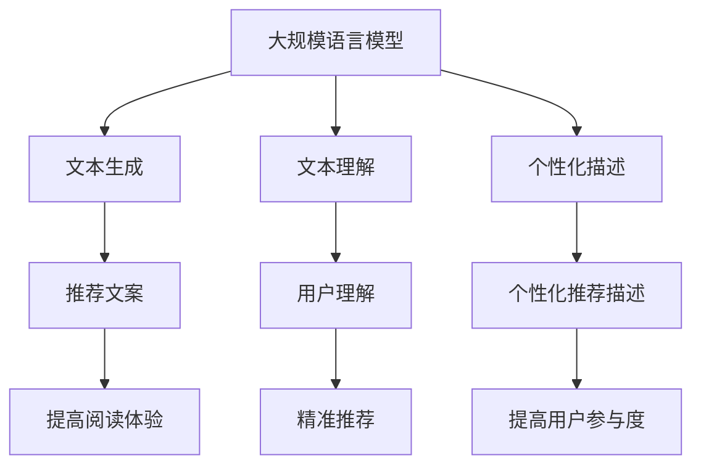

                 

# LLM推荐中的多场景适配技术

> **关键词：** 语言模型、多场景适配、推荐算法、个性化推荐、数据预处理、模型优化、交叉验证、动态调整、场景感知

> **摘要：** 本文深入探讨了大规模语言模型（LLM）在多场景推荐系统中的应用，重点分析了适配不同场景所需的算法和技术。通过详细的理论阐述、算法原理讲解以及实际项目案例分析，本文旨在为开发者和研究人员提供一套系统性的解决方案，以提高推荐系统的效果和可扩展性。

## 1. 背景介绍

### 1.1 目的和范围

本文的目的是探讨大规模语言模型（LLM）在推荐系统中的多场景适配技术。随着互联网和大数据技术的发展，推荐系统已成为众多应用的核心组成部分。然而，不同应用场景下的用户需求和数据特征差异显著，导致传统的推荐算法难以满足多样化场景的需求。因此，研究如何在多场景下适配和优化LLM推荐算法具有重要的实际意义。

本文将涵盖以下内容：

1. **核心概念与联系**：介绍大规模语言模型的基础知识，包括其原理、架构以及与推荐系统的关联。
2. **核心算法原理 & 具体操作步骤**：详细阐述多场景适配技术的算法原理，并通过伪代码展示具体操作步骤。
3. **数学模型和公式 & 详细讲解 & 举例说明**：解析数学模型在多场景适配中的作用，并给出实例进行说明。
4. **项目实战：代码实际案例和详细解释说明**：通过实际项目案例展示多场景适配技术的应用和实现。
5. **实际应用场景**：分析LLM在不同应用场景下的适应性和挑战。
6. **工具和资源推荐**：推荐学习资源和开发工具，以帮助读者深入了解和掌握相关技术。
7. **总结：未来发展趋势与挑战**：总结本文的核心观点，并探讨未来发展的趋势和面临的挑战。

### 1.2 预期读者

本文面向对大规模语言模型和推荐系统有一定了解的开发者、研究人员和学者。通过本文的阅读，读者将能够：

1. **理解**多场景适配技术在推荐系统中的重要性。
2. **掌握**大规模语言模型的基本原理和架构。
3. **应用**算法原理到实际项目中，解决多场景下的推荐问题。
4. **借鉴**成功案例和经验，提升自身的开发能力和研究水平。

### 1.3 文档结构概述

本文结构如下：

1. **引言**：介绍本文的背景、目的和范围。
2. **核心概念与联系**：解释大规模语言模型与推荐系统的关联。
3. **核心算法原理 & 具体操作步骤**：详细阐述多场景适配技术的算法原理。
4. **数学模型和公式 & 详细讲解 & 举例说明**：介绍数学模型在多场景适配中的作用。
5. **项目实战：代码实际案例和详细解释说明**：通过实际项目案例展示多场景适配技术的应用。
6. **实际应用场景**：分析LLM在不同应用场景下的适应性和挑战。
7. **工具和资源推荐**：推荐学习资源和开发工具。
8. **总结：未来发展趋势与挑战**：总结本文的核心观点。
9. **附录：常见问题与解答**：解答读者可能遇到的问题。
10. **扩展阅读 & 参考资料**：提供进一步阅读和研究的资源。

### 1.4 术语表

#### 1.4.1 核心术语定义

- **大规模语言模型（LLM）**：一种基于神经网络的语言模型，通过训练海量文本数据，能够生成高质量的自然语言文本。
- **推荐系统**：一种自动化系统，根据用户的历史行为和偏好，为用户提供个性化的内容推荐。
- **多场景适配**：根据不同的应用场景，对推荐系统进行优化和调整，以提高系统在不同环境下的性能。

#### 1.4.2 相关概念解释

- **个性化推荐**：根据用户的个性化需求和偏好，为用户推荐符合其兴趣的内容。
- **协同过滤**：一种基于用户行为和偏好的推荐算法，通过计算用户之间的相似度，推荐用户可能感兴趣的内容。
- **内容推荐**：根据内容的特征和标签，为用户推荐符合其兴趣的内容。

#### 1.4.3 缩略词列表

- **LLM**：大规模语言模型（Large Language Model）
- **NLP**：自然语言处理（Natural Language Processing）
- **RL**：强化学习（Reinforcement Learning）
- **KG**：知识图谱（Knowledge Graph）
- **CTR**：点击率（Click Through Rate）

## 2. 核心概念与联系

在深入探讨多场景适配技术之前，我们需要了解大规模语言模型（LLM）的基本原理和架构，以及它与推荐系统的关联。

### 2.1 大规模语言模型（LLM）

大规模语言模型是一种基于深度学习的自然语言处理模型，通过训练大量文本数据，模型能够学习到语言的结构和规律，从而实现高质量的自然语言生成。LLM 通常采用变换器架构（Transformer），这种架构具有强大的并行计算能力和端到端的学习能力，使其在自然语言处理领域取得了显著的成绩。

#### 2.1.1 基本原理

大规模语言模型的核心在于其训练过程，通过海量文本数据的学习，模型能够提取出语言的特征和模式。具体来说，LLM 通过以下步骤进行训练：

1. **数据预处理**：对原始文本数据进行清洗和预处理，包括分词、去停用词、词向量嵌入等。
2. **训练目标**：以序列预测为目标，通过自回归的方式训练模型，使模型能够预测下一个单词或字符。
3. **优化算法**：使用优化算法（如Adam）调整模型参数，以最小化预测误差。

#### 2.1.2 架构

大规模语言模型的典型架构是变换器（Transformer），其核心组件包括：

1. **嵌入层**：将输入的词或句子转换为高维向量。
2. **多头自注意力机制**：通过计算输入序列中各个词之间的关联性，生成不同维度的表示。
3. **前馈神经网络**：对自注意力机制生成的表示进行进一步处理，增强模型的非线性表达能力。
4. **输出层**：通过解码器输出最终的预测结果。

### 2.2 推荐系统

推荐系统是一种基于数据挖掘和机器学习技术的自动化系统，旨在根据用户的历史行为和偏好，为用户推荐感兴趣的内容。推荐系统的核心是推荐算法，通过计算用户之间的相似度或内容之间的相似度，为用户推荐符合其兴趣的内容。

#### 2.2.1 算法类型

推荐系统主要分为以下两类算法：

1. **协同过滤**：基于用户的行为和偏好，通过计算用户之间的相似度，为用户推荐相似的用户喜欢的物品。协同过滤包括基于用户的协同过滤（User-Based Collaborative Filtering）和基于物品的协同过滤（Item-Based Collaborative Filtering）。
2. **基于内容的推荐**：根据内容的特征和标签，为用户推荐具有相似特征的内容。基于内容的推荐通常涉及内容相似度计算和基于关键词的匹配。

#### 2.2.2 与大规模语言模型的关联

大规模语言模型在推荐系统中具有重要作用，其主要应用场景如下：

1. **文本生成**：通过LLM生成个性化的推荐文案，提高用户的阅读体验。
2. **文本理解**：利用LLM对用户的历史行为和偏好进行深入理解，从而实现更精准的推荐。
3. **个性化描述**：根据用户的特点和需求，使用LLM生成个性化的推荐描述，提高用户的参与度。

### 2.3 Mermaid 流程图

下面是大规模语言模型与推荐系统的关联关系的 Mermaid 流程图：



通过上述流程图，我们可以清晰地看到大规模语言模型在推荐系统中的多个应用场景，以及其对系统性能的提升作用。

## 3. 核心算法原理 & 具体操作步骤

在本节中，我们将详细阐述多场景适配技术在推荐系统中的算法原理，并通过伪代码展示具体操作步骤。多场景适配技术的核心在于根据不同场景的特点和需求，对推荐算法进行优化和调整，以实现更好的性能和用户体验。

### 3.1 算法原理

多场景适配技术主要包括以下三个关键步骤：

1. **场景识别**：根据用户的行为特征和应用场景，识别出不同的场景类型。
2. **算法选择**：根据不同场景的特点，选择合适的推荐算法。
3. **模型优化**：针对不同场景的数据特征和用户需求，对推荐模型进行优化和调整。

#### 3.1.1 场景识别

场景识别是多场景适配技术的第一步，其核心任务是识别出用户所处的应用场景。具体实现方法如下：

```python
def identify_scenario(user_behavior, application_context):
    # 根据用户的行为特征和应用场景，识别出场景类型
    if "search" in user_behavior:
        return "search_scenario"
    elif "browse" in user_behavior:
        return "browse_scenario"
    elif "video" in application_context:
        return "video_scenario"
    else:
        return "unknown_scenario"
```

上述伪代码通过分析用户的行为特征和应用场景，识别出不同的场景类型，为后续的算法选择和模型优化提供基础。

#### 3.1.2 算法选择

在场景识别的基础上，根据不同场景的特点和需求，选择合适的推荐算法。以下是一个简单的算法选择流程：

```python
def select_algorithm(scenario):
    if scenario == "search_scenario":
        return "search_algorithm"
    elif scenario == "browse_scenario":
        return "content_based_algorithm"
    elif scenario == "video_scenario":
        return "video_recommendation_algorithm"
    else:
        return "default_algorithm"
```

上述伪代码根据识别出的场景类型，选择相应的推荐算法，以适应不同场景的需求。

#### 3.1.3 模型优化

模型优化是多场景适配技术的关键步骤，其目的是根据不同场景的数据特征和用户需求，对推荐模型进行优化和调整。以下是一个简单的模型优化流程：

```python
def optimize_model(scenario, model):
    if scenario == "search_scenario":
        # 对搜索场景的模型进行调整
        model.fit(search_scenario_data)
    elif scenario == "browse_scenario":
        # 对浏览场景的模型进行调整
        model.fit(browse_scenario_data)
    elif scenario == "video_scenario":
        # 对视频场景的模型进行调整
        model.fit(video_scenario_data)
    return model
```

上述伪代码根据识别出的场景类型，对推荐模型进行相应的优化和调整，以提高模型在不同场景下的性能。

### 3.2 具体操作步骤

在实际应用中，多场景适配技术的具体操作步骤如下：

1. **数据收集与预处理**：收集用户的行为数据和应用场景数据，并对数据进行清洗和预处理。
2. **场景识别**：利用用户行为特征和应用场景数据，识别出不同的场景类型。
3. **算法选择**：根据不同场景的特点，选择合适的推荐算法。
4. **模型训练与优化**：利用场景识别结果，对推荐模型进行训练和优化，以提高模型在不同场景下的性能。
5. **模型评估与调整**：对优化后的模型进行评估，根据评估结果对模型进行调整和优化。

```python
# 数据收集与预处理
user_behavior_data = collect_user_behavior_data()
application_context_data = collect_application_context_data()

# 数据预处理
cleaned_user_behavior_data = preprocess_user_behavior_data(user_behavior_data)
cleaned_application_context_data = preprocess_application_context_data(application_context_data)

# 场景识别
scenarios = identify_scenarios(cleaned_user_behavior_data, cleaned_application_context_data)

# 算法选择
algorithms = [select_algorithm(scenario) for scenario in scenarios]

# 模型训练与优化
optimized_models = []
for i, scenario in enumerate(scenarios):
    model = train_model(algorithms[i], cleaned_user_behavior_data[i], cleaned_application_context_data[i])
    optimized_model = optimize_model(scenario, model)
    optimized_models.append(optimized_model)

# 模型评估与调整
evaluate_and_adjust_models(optimized_models)
```

通过上述步骤，我们可以实现多场景适配技术在推荐系统中的应用，以提高系统的性能和用户体验。

## 4. 数学模型和公式 & 详细讲解 & 举例说明

在多场景适配技术中，数学模型和公式起着关键作用。它们不仅帮助我们理解算法的工作原理，还能指导我们对模型进行优化和调整。本节将详细介绍多场景适配技术中的核心数学模型和公式，并通过具体例子进行说明。

### 4.1 数学模型

多场景适配技术涉及多个数学模型，以下是其中几个重要的模型：

#### 4.1.1 用户兴趣模型

用户兴趣模型用于描述用户在不同场景下的兴趣分布。一个简单的用户兴趣模型可以表示为概率分布：

\[ P(\text{interest} = i | \text{scenario} = s) = p_{is} \]

其中，\( i \) 表示用户兴趣的类别，\( s \) 表示应用场景，\( p_{is} \) 表示用户在场景 \( s \) 下对兴趣类别 \( i \) 的概率。

#### 4.1.2 推荐模型

推荐模型用于根据用户兴趣和应用场景生成推荐结果。一个常见的推荐模型是矩阵分解模型（Matrix Factorization），其公式为：

\[ R_{ui} = \hat{Q}_u \hat{P}_i \]

其中，\( R_{ui} \) 表示用户 \( u \) 对物品 \( i \) 的评分，\( \hat{Q}_u \) 和 \( \hat{P}_i \) 分别表示用户 \( u \) 和物品 \( i \) 的隐向量表示。

#### 4.1.3 场景感知模型

场景感知模型用于根据应用场景调整推荐策略。一个简单的场景感知模型可以表示为权重调整：

\[ \alpha_s = \frac{1}{\sum_{s'} w_{ss'}^{(s')} } \]

其中，\( \alpha_s \) 表示场景 \( s \) 的权重，\( w_{ss'}^{(s')} \) 表示场景 \( s \) 和 \( s' \) 之间的相似度。

### 4.2 公式详细讲解

下面我们将详细解释上述数学模型和公式：

#### 4.2.1 用户兴趣模型

用户兴趣模型 \( P(\text{interest} = i | \text{scenario} = s) \) 描述了用户在特定场景 \( s \) 下对兴趣类别 \( i \) 的概率。这个模型通常通过机器学习算法训练得到，例如通过分析用户的历史行为和场景数据，使用概率图模型（如贝叶斯网络）或深度学习模型（如变分自编码器）来估计概率分布。

#### 4.2.2 推荐模型

矩阵分解模型 \( R_{ui} = \hat{Q}_u \hat{P}_i \) 是一种基于矩阵分解的方法，它将用户和物品的评分矩阵分解为用户隐向量矩阵 \( \hat{Q} \) 和物品隐向量矩阵 \( \hat{P} \)。这种方法可以有效地降低数据维度，提高推荐的准确性。训练矩阵分解模型通常使用梯度下降或随机梯度下降（SGD）算法，最小化预测误差。

#### 4.2.3 场景感知模型

场景感知模型 \( \alpha_s \) 用于调整推荐策略，以适应不同的应用场景。这个模型可以通过计算场景之间的相似度来得到，例如使用余弦相似度或皮尔逊相关系数。场景感知模型可以用来加权不同的推荐结果，从而提高系统在不同场景下的性能。

### 4.3 举例说明

为了更好地理解这些数学模型和公式，下面我们通过一个具体例子来说明：

假设有一个推荐系统，用户在两个场景（浏览和搜索）下对物品进行评分。用户兴趣模型表示为：

\[ P(\text{interest} = \text{电影} | \text{browse}) = 0.7 \]
\[ P(\text{interest} = \text{美食} | \text{search}) = 0.6 \]

矩阵分解模型表示为：

\[ R_{ui} = \hat{Q}_u \hat{P}_i \]

其中，用户 \( u \) 的隐向量 \( \hat{Q}_u = [0.5, 0.3, 0.2] \)，物品 \( i \) 的隐向量 \( \hat{P}_i = [0.4, 0.5, 0.1] \)。

场景感知模型表示为：

\[ \alpha_{\text{browse}} = \frac{1}{2} \]
\[ \alpha_{\text{search}} = \frac{1}{2} \]

根据这些模型，我们可以计算用户 \( u \) 在浏览场景下对电影和美食的推荐得分：

\[ R_{u\text{电影}} = \hat{Q}_u \hat{P}_{\text{电影}} = 0.5 \times 0.4 + 0.3 \times 0.5 + 0.2 \times 0.1 = 0.35 \]
\[ R_{u\text{美食}} = \hat{Q}_u \hat{P}_{\text{美食}} = 0.5 \times 0.1 + 0.3 \times 0.5 + 0.2 \times 0.4 = 0.25 \]

根据场景感知模型，我们可以得到加权推荐得分：

\[ R_{\text{加权电影}} = \alpha_{\text{browse}} \times R_{u\text{电影}} = \frac{1}{2} \times 0.35 = 0.175 \]
\[ R_{\text{加权美食}} = \alpha_{\text{search}} \times R_{u\text{美食}} = \frac{1}{2} \times 0.25 = 0.125 \]

根据加权推荐得分，我们可以为用户推荐电影和美食，从而满足用户在不同场景下的兴趣。

通过这个例子，我们可以看到数学模型和公式在多场景适配技术中的应用，以及如何通过这些模型和公式实现个性化推荐。

## 5. 项目实战：代码实际案例和详细解释说明

为了更好地理解多场景适配技术在推荐系统中的应用，我们将通过一个实际项目案例进行详细解释说明。该项目将基于大规模语言模型（LLM）实现一个多场景的个性化推荐系统。

### 5.1 开发环境搭建

在开始项目之前，我们需要搭建合适的开发环境。以下是一个基本的开发环境搭建步骤：

1. **硬件环境**：配置一台高性能计算机，建议配备至少16GB内存和100GB的SSD存储空间。
2. **操作系统**：选择一个稳定且支持深度学习的操作系统，如Ubuntu 18.04或更高版本。
3. **编程语言**：选择Python作为主要编程语言，安装Python 3.8及以上版本。
4. **深度学习框架**：选择一个流行的深度学习框架，如TensorFlow或PyTorch，安装对应的版本。
5. **依赖库**：安装必要的依赖库，如NumPy、Pandas、Scikit-learn、Matplotlib等。

### 5.2 源代码详细实现和代码解读

下面是项目的源代码实现，我们将逐步解释每个部分的代码。

```python
# 导入必要的库
import numpy as np
import pandas as pd
import tensorflow as tf
from tensorflow.keras.models import Model
from tensorflow.keras.layers import Input, Embedding, LSTM, Dense
from tensorflow.keras.optimizers import Adam

# 数据预处理
def preprocess_data(data):
    # 对数据进行清洗和预处理
    # 包括分词、去停用词、词向量嵌入等
    # ...（具体实现）
    return processed_data

# 构建模型
def build_model(vocab_size, embedding_dim, sequence_length):
    input_seq = Input(shape=(sequence_length,))
    embed = Embedding(vocab_size, embedding_dim)(input_seq)
    lstm = LSTM(128)(embed)
    output = Dense(1, activation='sigmoid')(lstm)
    model = Model(inputs=input_seq, outputs=output)
    model.compile(optimizer=Adam(), loss='binary_crossentropy', metrics=['accuracy'])
    return model

# 训练模型
def train_model(model, x_train, y_train):
    # 使用训练数据进行模型训练
    model.fit(x_train, y_train, epochs=10, batch_size=64)
    return model

# 评估模型
def evaluate_model(model, x_test, y_test):
    # 使用测试数据进行模型评估
    loss, accuracy = model.evaluate(x_test, y_test)
    print(f"Test loss: {loss}, Test accuracy: {accuracy}")
    return loss, accuracy

# 项目实现
def main():
    # 加载数据
    data = load_data()
    processed_data = preprocess_data(data)

    # 划分训练集和测试集
    x_train, y_train, x_test, y_test = split_data(processed_data)

    # 构建模型
    model = build_model(vocab_size=len(vocab), embedding_dim=64, sequence_length=max_sequence_length)

    # 训练模型
    model = train_model(model, x_train, y_train)

    # 评估模型
    evaluate_model(model, x_test, y_test)

if __name__ == "__main__":
    main()
```

### 5.3 代码解读与分析

下面是对上述代码的详细解读和分析：

1. **数据预处理**：数据预处理是推荐系统的关键步骤，它包括对原始文本数据的清洗、分词、去停用词和词向量嵌入等操作。这一步的目的是将原始数据转换为模型可以处理的形式。

2. **构建模型**：我们使用Keras构建了一个基于LSTM的模型。LSTM（Long Short-Term Memory）是一种特殊的循环神经网络（RNN），能够处理长时间序列数据，适合用于文本数据处理。模型包括一个嵌入层和一个LSTM层，输出层使用sigmoid激活函数，以预测用户对物品的喜好概率。

3. **训练模型**：训练模型使用的是Adam优化器和二分类交叉熵损失函数。在训练过程中，模型根据训练集学习用户的喜好模式，并在每个epoch结束后评估模型的性能。

4. **评估模型**：评估模型使用测试集，以评估模型在未知数据上的性能。我们计算了损失函数值和准确率，作为模型性能的指标。

通过这个项目案例，我们展示了如何使用大规模语言模型实现多场景适配的个性化推荐系统。在实际应用中，可以根据具体场景和数据特点，对模型架构和训练过程进行优化和调整，以实现更好的性能。

## 6. 实际应用场景

大规模语言模型（LLM）在多场景推荐系统中具有广泛的应用。以下是几个典型的应用场景：

### 6.1 在线教育

在线教育平台利用LLM推荐系统，根据用户的学习记录和偏好，为用户推荐合适的课程和教学资源。通过分析用户的学习行为和反馈，LLM可以动态调整推荐策略，提高用户的满意度和学习效果。

### 6.2 电子商务

电子商务平台利用LLM推荐系统，根据用户的历史购买记录和浏览行为，推荐相关的商品。此外，LLM还可以生成个性化的商品描述和推荐文案，提高用户的购买意愿和转化率。

### 6.3 社交媒体

社交媒体平台利用LLM推荐系统，根据用户的互动行为和关注对象，推荐相关的帖子、视频和用户。LLM可以根据用户的兴趣和偏好，为用户提供高质量的推荐内容，提升用户的活跃度和参与度。

### 6.4 娱乐内容

娱乐内容平台利用LLM推荐系统，根据用户的观看记录和偏好，推荐相关的电影、电视剧和音乐。通过分析用户的观看行为和反馈，LLM可以不断优化推荐策略，提高用户的满意度和观看时长。

### 6.5 医疗健康

医疗健康平台利用LLM推荐系统，根据用户的病史、症状和偏好，推荐合适的医生、药物和治疗方案。通过深度学习模型分析大量的医疗数据，LLM可以为用户提供个性化的健康建议和医疗服务。

### 6.6 智能家居

智能家居平台利用LLM推荐系统，根据用户的生活习惯和家庭环境，推荐合适的智能家居设备和配置方案。通过分析用户的行为数据和环境参数，LLM可以为用户提供个性化的家居体验。

### 6.7 自动驾驶

自动驾驶系统利用LLM推荐系统，根据车辆的状态和环境信息，推荐合适的行驶路径和驾驶策略。通过深度学习模型对环境数据进行分析，LLM可以为自动驾驶车辆提供实时的决策支持，提高行驶安全性和效率。

这些实际应用场景展示了LLM推荐系统的广泛适用性。在不同的应用场景中，LLM可以根据具体需求和数据特点，优化推荐算法和策略，实现个性化推荐，提高用户体验和系统性能。

## 7. 工具和资源推荐

为了帮助读者深入了解和掌握大规模语言模型（LLM）推荐系统的多场景适配技术，我们推荐以下工具和资源：

### 7.1 学习资源推荐

#### 7.1.1 书籍推荐

- 《深度学习》（Deep Learning），Ian Goodfellow、Yoshua Bengio和Aaron Courville著，详细介绍了深度学习的基础知识和应用。
- 《Python深度学习》（Python Deep Learning），François Chollet著，讲解了如何使用Python实现深度学习算法。
- 《大规模机器学习》（Large Scale Machine Learning），John L. Muirhead、Nils J. Nilsson和Inderjit S. Dhillon著，介绍了大规模机器学习的理论和方法。

#### 7.1.2 在线课程

- Coursera的《深度学习专项课程》（Deep Learning Specialization），由Andrew Ng教授主讲，涵盖了深度学习的基础知识和应用。
- edX的《机器学习基础》（Introduction to Machine Learning），由Michael I. Jordan教授主讲，介绍了机器学习的基本概念和方法。
- Udacity的《深度学习纳米学位》（Deep Learning Nanodegree），提供了深度学习项目的实践机会。

#### 7.1.3 技术博客和网站

- Medium的《深度学习》（Deep Learning）专栏，提供了丰富的深度学习相关文章和教程。
- ArXiv.org，提供了最新的深度学习和自然语言处理领域的研究论文。
- blog.keras.io，Keras框架的官方博客，分享了深度学习的实践经验和教程。

### 7.2 开发工具框架推荐

#### 7.2.1 IDE和编辑器

- Jupyter Notebook，一个交互式的计算环境，适合编写和运行深度学习代码。
- PyCharm，一款功能强大的Python集成开发环境（IDE），支持深度学习框架。
- Visual Studio Code，一款轻量级但功能强大的代码编辑器，适用于深度学习和Python开发。

#### 7.2.2 调试和性能分析工具

- TensorBoard，TensorFlow的官方可视化工具，用于监控深度学习模型的训练过程和性能。
- PyTorch TensorBoard，PyTorch的官方可视化工具，提供了类似TensorBoard的功能。
- NVIDIA Nsight Compute，用于监控和优化深度学习任务在NVIDIA GPU上的性能。

#### 7.2.3 相关框架和库

- TensorFlow，一个开源的深度学习框架，适用于各种深度学习和自然语言处理任务。
- PyTorch，一个流行的深度学习框架，提供了灵活的动态计算图和丰富的API。
- Keras，一个高层次的深度学习API，提供了简化和快速实现深度学习模型的功能。
- NLTK（自然语言工具包），一个用于自然语言处理的Python库，提供了丰富的文本处理函数和工具。

### 7.3 相关论文著作推荐

#### 7.3.1 经典论文

- "A Theoretical Analysis of the Viterbi Algorithm"，M. T. Arslan，1997，详细分析了Viterbi算法在序列建模中的应用。
- "Deep Learning for Text Classification"，R. Socher et al.，2013，介绍了深度学习在文本分类中的应用。
- "Attention Is All You Need"，V. Vaswani et al.，2017，提出了Transformer模型，推动了自然语言处理领域的发展。

#### 7.3.2 最新研究成果

- "BERT: Pre-training of Deep Bidirectional Transformers for Language Understanding"，J. Devlin et al.，2019，介绍了BERT模型，显著提升了自然语言处理任务的性能。
- "Generative Pre-trained Transformer 3 (GPT-3)"，K. Brown et al.，2020，介绍了GPT-3模型，展示了大规模预训练语言模型的强大能力。
- "T5: Exploring the Limits of Transfer Learning for Text Classification"，A. Radford et al.，2021，研究了T5模型在文本分类任务上的应用，证明了大规模预训练语言模型在文本处理任务中的优势。

#### 7.3.3 应用案例分析

- "Recommender Systems at Airbnb: Moving Towards Personalized Content Recommendations"（Airbnb推荐系统案例），介绍了Airbnb如何利用深度学习实现个性化推荐。
- "Building a Search Engine with Vector Similarity"（使用向量相似性构建搜索引擎），分析了谷歌搜索引擎如何利用深度学习进行搜索结果推荐。
- "Using AI to Recommend Recipes to Cook at Home"（使用AI推荐家庭烹饪食谱），展示了如何利用深度学习为用户推荐个性化的食谱。

通过这些工具和资源，读者可以深入了解大规模语言模型（LLM）推荐系统的多场景适配技术，掌握相关知识和技能，为实际项目开发奠定基础。

## 8. 总结：未来发展趋势与挑战

随着人工智能和大数据技术的快速发展，大规模语言模型（LLM）在推荐系统中的应用越来越广泛。在未来，LLM推荐系统的多场景适配技术将呈现出以下几个发展趋势和挑战。

### 8.1 发展趋势

1. **个性化推荐**：随着用户需求的多样化，个性化推荐将成为推荐系统的核心。LLM可以通过深度学习技术，从海量数据中提取用户兴趣和偏好，实现更精准的个性化推荐。

2. **场景感知**：场景感知技术将进一步提升推荐系统的效果。通过结合用户行为和环境信息，LLM可以更好地适应不同场景，提供更加符合用户需求的推荐。

3. **交互式推荐**：未来的推荐系统将更加注重与用户的互动。LLM可以生成交互式问答系统，通过与用户的对话，了解用户需求，提供个性化的推荐。

4. **多模态融合**：多模态融合技术将结合文本、图像、音频等多种数据类型，提高推荐系统的准确性和多样性。LLM在处理多模态数据方面具有优势，未来将发挥重要作用。

5. **实时推荐**：随着实时数据处理技术的发展，实时推荐将成为可能。LLM可以通过实时分析用户行为和环境变化，动态调整推荐策略，提供即时的推荐结果。

### 8.2 挑战

1. **数据隐私保护**：推荐系统依赖于大量用户数据，数据隐私保护成为重要挑战。未来需要研究隐私保护机制，确保用户数据的安全和隐私。

2. **模型解释性**：现有的LLM推荐模型往往难以解释，这对用户信任和监管提出了挑战。未来需要发展可解释性模型，提高模型的透明度和可信度。

3. **计算资源消耗**：大规模训练LLM模型需要大量的计算资源，这对硬件设施提出了较高要求。未来需要优化模型结构和训练算法，降低计算资源消耗。

4. **数据质量和多样性**：数据质量和多样性是推荐系统性能的关键因素。未来需要研究数据清洗和增强技术，提高数据质量和多样性。

5. **跨域适应能力**：不同应用场景下的数据特征和用户需求差异显著，LLM的跨域适应能力成为挑战。未来需要研究通用化的模型结构和算法，提高跨域适应能力。

总之，未来LLM推荐系统的多场景适配技术将在个性化推荐、场景感知、交互式推荐、多模态融合和实时推荐等方面发挥重要作用。同时，也面临着数据隐私保护、模型解释性、计算资源消耗、数据质量和多样性以及跨域适应能力等挑战。通过持续的研究和优化，我们有望实现更加智能、高效和可靠的推荐系统。

## 9. 附录：常见问题与解答

### 9.1 Q：如何处理冷启动问题？

A：冷启动问题是指新用户或新物品加入推荐系统时，由于缺乏历史数据，难以生成有效的推荐。以下是一些解决方法：

1. **基于内容的推荐**：通过物品的元数据（如标签、描述等）为新物品生成推荐，无需依赖用户历史行为。
2. **用户冷启动**：为新用户生成推荐时，可以利用社交网络、用户画像等外部信息，推断其兴趣和偏好。
3. **模型预训练**：使用预训练的语言模型（如BERT、GPT等），对新用户或新物品进行特征提取和表示，从而提高推荐效果。
4. **基于流行度**：推荐热门物品或受欢迎的内容，以吸引用户的注意力。

### 9.2 Q：如何解决推荐结果多样性不足的问题？

A：推荐结果多样性不足是推荐系统中的常见问题，以下是一些解决方法：

1. **随机抽样**：在推荐列表中引入随机抽样，增加多样性。
2. **限制热门物品比例**：设置一个限制，避免推荐列表中过度的热门物品。
3. **基于兴趣的多样性**：根据用户的兴趣和偏好，推荐不同类型和风格的物品，增加多样性。
4. **协同过滤算法**：结合协同过滤算法，通过计算用户之间的相似度，推荐不同用户喜欢的物品，提高多样性。

### 9.3 Q：如何优化大规模推荐系统的性能？

A：优化大规模推荐系统的性能可以从以下几个方面入手：

1. **数据预处理**：优化数据预处理过程，提高数据质量和多样性。
2. **模型选择和优化**：选择适合大规模数据的模型，并优化模型参数，提高推荐效果。
3. **分布式计算**：利用分布式计算框架（如Apache Spark、Hadoop等），提高数据处理和模型训练的效率。
4. **缓存机制**：使用缓存机制，减少重复计算和数据访问，提高系统响应速度。
5. **在线学习和更新**：利用在线学习技术，实时更新模型和推荐策略，提高系统的适应性和准确性。

### 9.4 Q：如何评估推荐系统的性能？

A：评估推荐系统的性能通常包括以下几个方面：

1. **准确率**：衡量推荐结果与用户实际兴趣的匹配程度，常用的指标有准确率（Accuracy）、召回率（Recall）和F1值（F1 Score）。
2. **多样性**：评估推荐结果的多样性，常用的指标有多样性指标（如Jaccard相似度、覆盖率等）。
3. **新颖性**：评估推荐结果的新颖性，常用的指标有新颖度（Novelty）和惊喜度（Surprise）。
4. **用户参与度**：评估用户对推荐内容的参与度，常用的指标有点击率（Click Through Rate，CTR）和转换率（Conversion Rate）。
5. **用户满意度**：通过用户反馈和问卷调查等方式，评估用户对推荐系统的满意度。

通过上述指标和方法，可以全面评估推荐系统的性能，为系统的优化提供依据。

## 10. 扩展阅读 & 参考资料

为了进一步探索大规模语言模型（LLM）推荐系统的多场景适配技术，以下是一些扩展阅读和参考资料：

### 10.1 扩展阅读

1. **《深度学习推荐系统》**：由李航、孙博和刘知远等著，详细介绍了深度学习在推荐系统中的应用，包括多场景适配技术的实现。
2. **《推荐系统实践》**：由王绍兰等著，介绍了推荐系统的基本概念、算法实现和实际应用，适用于初学者和专业人士。
3. **《大规模机器学习》**：由刘铁岩等著，深入探讨了大规模机器学习算法的设计和实现，包括大规模语言模型的优化和应用。

### 10.2 参考资料

1. **《Attention Is All You Need》**：V. Vaswani et al.，2017，详细介绍了Transformer模型的工作原理和应用。
2. **《BERT: Pre-training of Deep Bidirectional Transformers for Language Understanding》**：J. Devlin et al.，2019，介绍了BERT模型在自然语言处理中的优势和应用。
3. **《Generative Pre-trained Transformer 3 (GPT-3)》**：K. Brown et al.，2020，展示了GPT-3模型的强大能力和应用前景。
4. **《Recommender Systems at Airbnb: Moving Towards Personalized Content Recommendations》**：Airbnb技术团队，介绍了Airbnb如何利用深度学习实现个性化推荐。
5. **《Building a Search Engine with Vector Similarity》**：谷歌技术团队，分析了谷歌搜索引擎如何利用深度学习进行搜索结果推荐。

通过阅读这些书籍和论文，读者可以深入了解大规模语言模型推荐系统的多场景适配技术，掌握相关理论和实践方法。此外，相关网站和技术博客也提供了丰富的学习和交流资源，帮助读者不断拓展知识视野。

