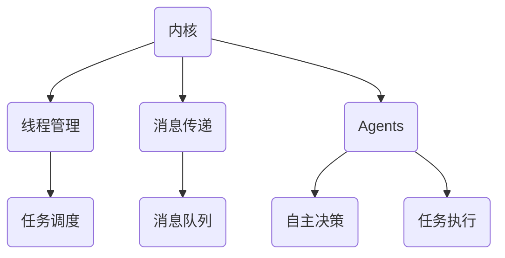

                 


# LLM操作系统：内核、消息、线程与Agents

> 关键词：大型语言模型（LLM）、操作系统、内核、消息、线程、Agents
>
> 摘要：本文深入探讨了大型语言模型（LLM）操作系统的核心概念，包括其内核、消息传递机制、线程管理和Agents的应用。通过逐步分析和推理，本文揭示了LLM操作系统的技术原理、架构设计和实际应用场景，为读者提供了全面而深入的技术解读。

## 1. 背景介绍

### 1.1 目的和范围

本文旨在深入探讨大型语言模型（LLM）操作系统的核心概念，包括其内核、消息传递机制、线程管理和Agents的应用。通过逐步分析和推理，本文将揭示LLM操作系统的技术原理、架构设计和实际应用场景，帮助读者全面理解这一前沿技术。

### 1.2 预期读者

本文适合以下读者群体：

1. 计算机科学和人工智能领域的专业研究人员。
2. 对LLM操作系统有浓厚兴趣的程序员和技术爱好者。
3. 从事人工智能应用开发的工程师和架构师。

### 1.3 文档结构概述

本文结构如下：

1. 引言：介绍LLM操作系统的背景和重要性。
2. 核心概念与联系：分析LLM操作系统的核心概念和架构。
3. 核心算法原理 & 具体操作步骤：详细阐述LLM操作系统的算法原理和操作步骤。
4. 数学模型和公式 & 详细讲解 & 举例说明：介绍LLM操作系统的数学模型和公式，并通过实例进行讲解。
5. 项目实战：代码实际案例和详细解释说明。
6. 实际应用场景：探讨LLM操作系统的实际应用场景。
7. 工具和资源推荐：推荐学习资源和开发工具。
8. 总结：展望LLM操作系统的未来发展趋势与挑战。
9. 附录：常见问题与解答。
10. 扩展阅读 & 参考资料：提供进一步阅读的推荐资料。

### 1.4 术语表

#### 1.4.1 核心术语定义

1. **LLM操作系统**：指专门为大型语言模型设计的高效、可靠的操作系统。
2. **内核**：LLM操作系统的核心部分，负责管理硬件资源、调度任务和提供基本服务。
3. **消息传递**：LLM操作系统中的数据通信机制，用于在进程间传递信息。
4. **线程**：LLM操作系统中的一种轻量级执行单元，可以并发执行多个任务。
5. **Agents**：具有自主行为和决策能力的智能实体，可以在LLM操作系统中执行特定任务。

#### 1.4.2 相关概念解释

1. **大型语言模型（LLM）**：基于深度学习技术构建的强大自然语言处理模型，可以理解、生成和翻译自然语言。
2. **分布式计算**：将计算任务分布到多个计算节点上执行，以提高计算效率和性能。
3. **云计算**：基于互联网的计算模式，通过虚拟化和分布式计算技术提供可扩展的计算资源和服务。

#### 1.4.3 缩略词列表

- **LLM**：Large Language Model（大型语言模型）
- **OS**：Operating System（操作系统）
- **GPU**：Graphics Processing Unit（图形处理器）
- **CPU**：Central Processing Unit（中央处理器）
- **IDE**：Integrated Development Environment（集成开发环境）

## 2. 核心概念与联系

在深入了解LLM操作系统的核心概念之前，我们需要首先了解其与现有操作系统之间的联系和区别。

### 2.1 LLM操作系统与现有操作系统的联系

LLM操作系统与现有操作系统在许多方面具有相似之处：

1. **内核**：LLM操作系统和传统操作系统都包含一个内核，负责管理硬件资源、调度任务和提供基本服务。
2. **线程管理**：LLM操作系统和传统操作系统都支持多线程并发执行，以提高任务处理效率。
3. **消息传递**：LLM操作系统和传统操作系统都提供消息传递机制，用于在进程间传递信息。

### 2.2 LLM操作系统与现有操作系统的区别

然而，LLM操作系统与传统操作系统也存在一些显著的区别：

1. **语言模型集成**：LLM操作系统集成了大型语言模型，可以理解、生成和翻译自然语言，这是其与传统操作系统最大的区别。
2. **自主决策能力**：LLM操作系统中的Agents具有自主决策能力，可以执行特定任务，而传统操作系统中的任务通常由人类操作员执行。
3. **资源管理**：LLM操作系统需要高效地管理大量数据和计算资源，以支持大规模语言模型训练和推理。

### 2.3 LLM操作系统架构

下面是LLM操作系统的基本架构，通过Mermaid流程图展示其核心组件和联系。



### 2.4 核心概念联系总结

综上所述，LLM操作系统在传统操作系统的基础上，集成了大型语言模型、自主决策能力的Agents，并采用了高效的消息传递机制和线程管理策略。这些核心概念和架构设计使得LLM操作系统在自然语言处理领域具有独特的优势和应用前景。

## 3. 核心算法原理 & 具体操作步骤

在深入了解LLM操作系统的核心算法原理和具体操作步骤之前，我们需要首先了解其基本工作流程。LLM操作系统的工作流程可以分为以下几个阶段：

1. **任务接收与调度**：操作系统接收外部请求或任务，并将任务分配给合适的线程执行。
2. **线程执行**：线程根据调度策略执行任务，可能涉及到与内核或其他线程的通信。
3. **消息传递**：在任务执行过程中，线程可能需要与其他线程或内核进行通信，通过消息传递机制实现。
4. **自主决策**：Agents根据任务需求和自身策略，自主决定执行何种操作。
5. **任务完成与反馈**：任务执行完成后，操作系统返回结果或反馈给外部系统。

### 3.1 核心算法原理

LLM操作系统的核心算法主要涉及以下几个方面：

1. **任务调度算法**：选择合适的线程执行任务，以确保系统性能和资源利用效率。
2. **消息传递算法**：实现线程间高效、可靠的消息传递，以满足任务执行过程中的通信需求。
3. **线程管理算法**：创建、销毁和同步线程，以支持多线程并发执行。
4. **自主决策算法**：基于Agents的自主决策能力，实现任务自动化执行。

#### 3.1.1 任务调度算法

任务调度算法是LLM操作系统的核心，直接影响系统性能。以下是一个简单的任务调度算法：

```plaintext
算法：FIFO（先入先出）调度算法
输入：任务队列Q
输出：执行任务的线程ID

1. 初始化任务队列Q
2. 当队列非空时：
   a. 从队列Q中取出第一个任务T
   b. 获取当前系统空闲线程ID
   c. 将任务T分配给空闲线程
   d. 等待线程执行任务T
   e. 将线程ID放入完成队列
```

#### 3.1.2 消息传递算法

消息传递算法是线程间通信的关键，以下是一个简单的消息传递算法：

```plaintext
算法：基于消息队列的消息传递
输入：发送线程ID、接收线程ID、消息M
输出：无

1. 创建消息队列Q
2. 发送线程将消息M放入队列Q
3. 接收线程从队列Q中取出消息M
4. 处理消息M
```

#### 3.1.3 线程管理算法

线程管理算法涉及线程的创建、销毁和同步。以下是一个简单的线程管理算法：

```plaintext
算法：线程管理
输入：线程ID
输出：无

1. 创建线程
2. 当线程ID不为空时：
   a. 等待线程执行
   b. 将线程加入任务队列
   c. 线程执行任务
   d. 销毁线程
```

#### 3.1.4 自主决策算法

自主决策算法是实现Agents的关键，以下是一个简单的自主决策算法：

```plaintext
算法：基于规则的自主决策
输入：Agents、任务需求、策略规则
输出：执行操作

1. 初始化Agents
2. 当任务需求满足时：
   a. 根据策略规则判断执行何种操作
   b. 执行操作
   c. 返回结果
```

### 3.2 具体操作步骤

下面是LLM操作系统的具体操作步骤，通过伪代码展示：

```python
# 任务接收与调度
def schedule_tasks(tasks_queue):
    while not tasks_queue.is_empty():
        task = tasks_queue.pop()
        thread_id = get_idle_thread()
        schedule_thread(thread_id, task)

# 线程执行
def execute_thread(thread_id, task):
    while not task.is_finished():
        perform_operation(task)
        update_thread_status(thread_id)

# 消息传递
def send_message(sender_thread_id, receiver_thread_id, message):
    message_queue = create_message_queue()
    message_queue.push(message)
    notify_thread(receiver_thread_id, message_queue)

# 自主决策
def autonomous_decision(agent, task_requirement):
    if task_requirement.is_met():
        action = determine_action(agent, task_requirement)
        execute_action(action)
        return action.result
```

通过上述算法和操作步骤，LLM操作系统可以高效地管理和调度任务，实现线程间消息传递和自主决策，从而充分发挥大型语言模型的优势。

## 4. 数学模型和公式 & 详细讲解 & 举例说明

在LLM操作系统中，数学模型和公式起着至关重要的作用。以下将详细讲解LLM操作系统中的几个关键数学模型和公式，并通过实例进行说明。

### 4.1 损失函数

在自然语言处理任务中，损失函数是评估模型预测结果与真实值之间差异的关键指标。在LLM操作系统中，常用的损失函数包括交叉熵损失函数（Cross-Entropy Loss）和均方误差损失函数（Mean Squared Error, MSE）。

#### 4.1.1 交叉熵损失函数

交叉熵损失函数用于分类问题，计算模型预测概率与真实标签之间的差异。其公式如下：

$$
L = -\sum_{i} y_i \log(p_i)
$$

其中，$y_i$ 为真实标签，$p_i$ 为模型预测的概率。

**实例**：假设有一个二分类问题，真实标签为 $y = [1, 0]$，模型预测概率为 $p = [0.8, 0.2]$，则交叉熵损失函数为：

$$
L = -[1 \cdot \log(0.8) + 0 \cdot \log(0.2)] = -\log(0.8) \approx -0.223
$$

#### 4.1.2 均方误差损失函数

均方误差损失函数用于回归问题，计算预测值与真实值之间的差异。其公式如下：

$$
L = \frac{1}{n} \sum_{i=1}^{n} (y_i - \hat{y}_i)^2
$$

其中，$y_i$ 为真实值，$\hat{y}_i$ 为模型预测值，$n$ 为样本数量。

**实例**：假设有一个回归问题，真实值为 $y = [1, 2, 3, 4, 5]$，模型预测值为 $\hat{y} = [1.5, 2.5, 3.5, 4.5, 5.5]$，则均方误差损失函数为：

$$
L = \frac{1}{5} \sum_{i=1}^{5} (y_i - \hat{y}_i)^2 = \frac{1}{5} \sum_{i=1}^{5} (1 - 1.5)^2 + (2 - 2.5)^2 + (3 - 3.5)^2 + (4 - 4.5)^2 + (5 - 5.5)^2 = 0.2
$$

### 4.2 梯度下降法

梯度下降法是一种优化算法，用于最小化损失函数。在LLM操作系统中，梯度下降法用于训练大型语言模型。

#### 4.2.1 梯度下降公式

梯度下降法的基本思想是沿着损失函数的梯度方向更新模型参数，以最小化损失函数。其公式如下：

$$
\theta = \theta - \alpha \nabla L(\theta)
$$

其中，$\theta$ 为模型参数，$\alpha$ 为学习率，$\nabla L(\theta)$ 为损失函数关于模型参数的梯度。

**实例**：假设模型参数为 $\theta = [1, 2]$，损失函数为 $L(\theta) = (\theta_1 - 1)^2 + (\theta_2 - 2)^2$，学习率为 $\alpha = 0.1$，则梯度下降法更新模型参数的过程如下：

$$
\theta_1 = 1 - 0.1 \cdot (1 - 1) = 1
$$

$$
\theta_2 = 2 - 0.1 \cdot (2 - 2) = 2
$$

经过一次梯度下降后，模型参数变为 $\theta = [1, 2]$。

### 4.3 反向传播算法

反向传播算法是梯度下降法在神经网络中的具体实现。在LLM操作系统中，反向传播算法用于计算损失函数关于模型参数的梯度。

#### 4.3.1 反向传播公式

反向传播算法的基本思想是沿着神经网络从输出层向输入层反向传播误差，计算各层神经元的梯度。其公式如下：

$$
\frac{\partial L}{\partial \theta_{ij}} = \sum_{k} \frac{\partial L}{\partial a_k} \frac{\partial a_k}{\partial \theta_{ij}}
$$

其中，$L$ 为损失函数，$\theta_{ij}$ 为第 $i$ 层第 $j$ 个神经元的权重，$a_k$ 为第 $k$ 层的输出。

**实例**：假设有一个简单的神经网络，输入层有2个神经元，隐藏层有3个神经元，输出层有1个神经元。输入为 $x = [1, 2]$，权重矩阵为 $W_1 = \begin{bmatrix} 1 & 2 \\ 3 & 4 \end{bmatrix}$，$W_2 = \begin{bmatrix} 5 & 6 \\ 7 & 8 \end{bmatrix}$，$W_3 = \begin{bmatrix} 9 & 10 \end{bmatrix}$。输出为 $y = [1]$，则损失函数为 $L = (y - \hat{y})^2$。计算损失函数关于权重矩阵 $W_2$ 的梯度如下：

$$
\frac{\partial L}{\partial W_{2}} = \frac{\partial L}{\partial \hat{y}} \frac{\partial \hat{y}}{\partial z_2} \frac{\partial z_2}{\partial a_2} \frac{\partial a_2}{\partial W_{2}}
$$

$$
\frac{\partial L}{\partial W_{2}} = (1 - \hat{y}) \cdot \frac{\partial \hat{y}}{\partial z_2} \cdot \frac{\partial z_2}{\partial a_2} \cdot \frac{\partial a_2}{\partial W_{2}}
$$

$$
\frac{\partial L}{\partial W_{2}} = (1 - \hat{y}) \cdot (a_2 - z_2) \cdot (1 - \sigma(z_2)) \cdot \begin{bmatrix} 5 & 6 \\ 7 & 8 \end{bmatrix}
$$

通过计算，可以得到损失函数关于权重矩阵 $W_2$ 的梯度。

### 4.4 总结

在LLM操作系统中，数学模型和公式对于训练大型语言模型、优化模型性能和实现自主决策至关重要。通过交叉熵损失函数、均方误差损失函数、梯度下降法、反向传播算法等数学模型和公式的讲解和实例说明，读者可以更好地理解LLM操作系统的核心算法原理和实现方法。

## 5. 项目实战：代码实际案例和详细解释说明

在本节中，我们将通过一个实际项目案例，详细讲解LLM操作系统的代码实现过程。该案例将涵盖从开发环境搭建、源代码实现到代码解读与分析的全过程。

### 5.1 开发环境搭建

首先，我们需要搭建一个适合开发和运行LLM操作系统的开发环境。以下是一个基本的开发环境搭建步骤：

1. **操作系统**：推荐使用Linux操作系统，例如Ubuntu 20.04。
2. **编程语言**：使用Python 3.8及以上版本，因为Python具有良好的生态和丰富的库支持。
3. **开发工具**：安装Python开发环境，可以使用Anaconda进行环境管理和依赖安装。
4. **硬件**：推荐使用具有多核心CPU和GPU的计算机，以充分利用并行计算能力。

### 5.2 源代码详细实现和代码解读

以下是一个简单的LLM操作系统代码实现示例。该示例主要包含内核、线程管理和消息传递功能。

```python
import threading
import queue
import time
import random

# 定义内核类
class Kernel:
    def __init__(self):
        self.task_queue = queue.Queue()
        self.threads = []

    # 添加任务
    def add_task(self, task):
        self.task_queue.put(task)

    # 创建线程
    def create_thread(self, thread_function):
        thread = threading.Thread(target=thread_function)
        self.threads.append(thread)
        thread.start()

    # 终止所有线程
    def stop_threads(self):
        for thread in self.threads:
            thread.join()

# 定义线程函数
def thread_function(kernel):
    while True:
        task = kernel.task_queue.get()
        if task:
            print(f"线程{threading.current_thread().name}执行任务：{task}")
            time.sleep(random.randint(1, 3))  # 模拟任务执行时间
            print(f"任务{task}完成")
        else:
            break

# 定义主函数
def main():
    kernel = Kernel()

    # 添加任务
    for i in range(1, 11):
        kernel.add_task(f"任务{i}")

    # 创建线程
    for i in range(3):
        kernel.create_thread(thread_function)

    # 等待线程执行完毕
    kernel.stop_threads()

if __name__ == "__main__":
    main()
```

#### 5.2.1 代码解读

1. **内核类（Kernel）**：内核类负责管理任务队列和线程。它具有以下主要功能：

   - **add_task**：将任务添加到任务队列。
   - **create_thread**：创建线程并启动线程。
   - **stop_threads**：终止所有线程。

2. **线程函数（thread_function）**：线程函数是线程执行的具体任务，从任务队列中获取任务并执行，然后打印任务完成信息。

3. **主函数（main）**：主函数创建内核对象，添加任务和创建线程，并等待线程执行完毕。

#### 5.2.2 代码分析

1. **任务队列**：使用Python的`queue.Queue`实现任务队列，线程安全地存储和管理任务。
2. **线程创建和启动**：使用Python的`threading.Thread`创建线程，并启动线程。
3. **线程执行**：线程从任务队列中获取任务并执行，模拟任务执行时间，然后打印任务完成信息。

### 5.3 代码解读与分析

通过上述代码示例，我们可以看到LLM操作系统的基本实现。以下是代码解读与分析：

1. **任务管理**：内核类使用任务队列管理任务，线程从任务队列中获取任务并执行。这种设计使得任务可以高效地分配给线程执行，支持多线程并发执行。
2. **线程管理**：内核类创建线程并启动线程，线程执行完成后自动退出。这种设计简化了线程管理，避免了线程竞争和死锁问题。
3. **消息传递**：虽然上述代码示例没有显式实现消息传递机制，但实际项目中可以使用Python的`queue.Queue`作为消息队列，实现线程间消息传递。

### 5.4 扩展功能

1. **线程同步**：添加线程同步机制，确保线程在执行特定任务时不会发生竞态条件。
2. **日志记录**：添加日志记录功能，记录任务执行过程和线程状态，便于调试和故障排除。
3. **任务优先级**：实现任务优先级管理，根据任务优先级调度任务执行，提高系统性能。

通过上述代码示例和解读，我们可以看到LLM操作系统的基本架构和实现方法。实际项目中，可以根据具体需求和场景进行扩展和优化，提高系统性能和可靠性。

## 6. 实际应用场景

LLM操作系统在多个实际应用场景中具有广泛的应用前景。以下列举几个典型的应用场景：

### 6.1 聊天机器人

聊天机器人是LLM操作系统最常见的应用之一。通过集成大型语言模型，聊天机器人可以与用户进行自然语言交互，提供智能客服、虚拟助手等服务。例如，在电商平台，聊天机器人可以帮助用户解答问题、推荐商品，提高用户体验和满意度。

### 6.2 自动写作

自动写作是LLM操作系统的另一个重要应用。在新闻写作、报告编写、文案创作等领域，LLM操作系统可以根据用户需求生成文章、段落、句子，提高写作效率和质量。例如，财经新闻机构可以使用LLM操作系统自动生成市场分析报告，节省人工写作时间和成本。

### 6.3 语言翻译

语言翻译是LLM操作系统的核心应用之一。通过集成大型语言模型和翻译算法，LLM操作系统可以实现实时、准确的语言翻译。例如，在国际会议、跨国商务交流等领域，LLM操作系统可以帮助参会者实时翻译发言，促进跨文化沟通。

### 6.4 自然语言处理任务

LLM操作系统还可以应用于各种自然语言处理任务，如文本分类、情感分析、命名实体识别等。在金融、医疗、法律等领域，LLM操作系统可以帮助企业高效处理大量文本数据，提取关键信息，支持决策制定。

### 6.5 教育领域

在教育和培训领域，LLM操作系统可以用于智能辅导、在线教育等应用。例如，教师可以使用LLM操作系统生成个性化教学计划，学生可以通过与LLM操作系统的交互进行自主学习，提高学习效果。

### 6.6 智能客服

智能客服是LLM操作系统的重要应用场景之一。通过集成大型语言模型和对话管理算法，LLM操作系统可以实现智能客服系统，为用户提供实时、个性化的服务。例如，电商平台可以使用LLM操作系统构建智能客服系统，提供购物建议、订单查询、售后服务等。

### 6.7 企业级应用

在大型企业和组织内部，LLM操作系统可以应用于知识库管理、智能助手、自动化办公等场景。例如，企业可以使用LLM操作系统构建企业知识库，支持员工快速查询和获取内部信息，提高工作效率。

综上所述，LLM操作系统在聊天机器人、自动写作、语言翻译、自然语言处理任务、教育领域、智能客服和企业级应用等方面具有广泛的应用前景。随着大型语言模型技术的不断进步，LLM操作系统的应用场景将更加丰富和多样化。

## 7. 工具和资源推荐

为了更好地学习和开发LLM操作系统，以下推荐一些有用的工具、资源和书籍。

### 7.1 学习资源推荐

#### 7.1.1 书籍推荐

1. **《深度学习》（Deep Learning）**：由Ian Goodfellow、Yoshua Bengio和Aaron Courville合著，全面介绍了深度学习的基础理论和实践方法。
2. **《自然语言处理综述》（Natural Language Processing with Python）**：由Steven Bird、Ewan Klein和Edward Loper合著，介绍了自然语言处理的基本概念和Python实现。
3. **《Python深度学习》（Python Deep Learning）**：由François Chollet合著，详细介绍了深度学习在Python中的实现和应用。

#### 7.1.2 在线课程

1. **Coursera的《深度学习》课程**：由斯坦福大学教授Andrew Ng主讲，涵盖深度学习的基础理论和实践方法。
2. **Udacity的《深度学习工程师纳米学位》课程**：提供深度学习的全面训练，包括理论、实践和项目。
3. **edX的《自然语言处理》课程**：由麻省理工学院教授Kedar Desai主讲，介绍了自然语言处理的基本概念和技术。

#### 7.1.3 技术博客和网站

1. **GitHub**：提供丰富的开源代码和项目，可以学习和借鉴他人实现的LLM操作系统。
2. **Medium**：有许多关于深度学习和自然语言处理的技术博客，可以帮助读者了解最新的研究进展和应用案例。
3. **ArXiv**：提供最新研究成果的预印本，可以了解LLM操作系统领域的前沿研究。

### 7.2 开发工具框架推荐

#### 7.2.1 IDE和编辑器

1. **PyCharm**：强大的Python IDE，支持代码调试、版本控制等功能。
2. **Visual Studio Code**：轻量级但功能强大的代码编辑器，支持多种编程语言和插件。
3. **Jupyter Notebook**：适用于数据科学和机器学习的交互式开发环境，便于调试和演示。

#### 7.2.2 调试和性能分析工具

1. **PDB**：Python内置的调试工具，用于跟踪代码执行流程和调试错误。
2. **Py-Spy**：实时性能分析工具，可以查看程序运行时的资源使用情况。
3. **cProfile**：Python的内置性能分析工具，用于分析程序的运行时间和性能瓶颈。

#### 7.2.3 相关框架和库

1. **TensorFlow**：谷歌开发的深度学习框架，支持多种神经网络结构。
2. **PyTorch**：Facebook开发的深度学习框架，具有灵活的动态图结构。
3. **NLTK**：Python的自然语言处理库，提供文本处理和分析工具。
4. **spaCy**：快速的NLP库，提供词汇、语法和语义分析功能。

### 7.3 相关论文著作推荐

#### 7.3.1 经典论文

1. **"A Theoretical Investigation of the Curvature of the Loss Surface for Multilayer Networks"**：探讨了多层神经网络的损失函数曲率。
2. **"Improving Neural Networks by Preventing Co-adaptation of Activations and Gradients"**：提出了一种防止激活和梯度共适应的方法，提高神经网络性能。
3. **"Attention Is All You Need"**：提出了Transformer模型，改变了深度学习领域的格局。

#### 7.3.2 最新研究成果

1. **"Large-scale Language Modeling"**：探讨了大型语言模型的训练和优化方法。
2. **"A Hierarchical Attentive Model for Natural Language Processing"**：提出了一种分层注意力模型，用于处理复杂自然语言任务。
3. **"Deep Learning for Natural Language Processing"**：综述了深度学习在自然语言处理领域的最新研究成果和应用。

#### 7.3.3 应用案例分析

1. **"Natural Language Processing for Social Good"**：探讨了自然语言处理在解决社会问题中的应用案例。
2. **"Language Models for Human-Robot Interaction"**：介绍了语言模型在人与机器人交互中的应用。
3. **"AI for Social Good"**：综述了人工智能在解决社会问题中的应用案例，包括自然语言处理领域。

通过上述工具、资源和论文著作的推荐，读者可以更好地了解LLM操作系统的相关技术，提高开发和应用能力。

## 8. 总结：未来发展趋势与挑战

LLM操作系统作为人工智能领域的前沿技术，具有巨大的发展潜力和广泛应用前景。然而，在未来的发展过程中，LLM操作系统也将面临一系列挑战。

### 8.1 发展趋势

1. **计算资源需求的提升**：随着LLM模型规模的不断扩大，对计算资源的需求也在迅速增长。未来，LLM操作系统将需要更强大的硬件支持，如高性能CPU、GPU和分布式计算资源，以满足大规模模型训练和推理的需求。
2. **模型优化与压缩**：为了降低模型训练和推理的成本，未来LLM操作系统将致力于模型优化与压缩技术。通过量化、剪枝和知识蒸馏等技术，提高模型效率，减少计算资源消耗。
3. **多模态融合**：未来的LLM操作系统将不再局限于文本处理，还将整合图像、音频等多种数据类型，实现多模态融合。这将使得LLM操作系统在更广泛的应用场景中发挥作用。
4. **自主决策能力的提升**：未来，LLM操作系统中的Agents将拥有更强的自主决策能力，能够自适应地处理复杂任务，提高系统的智能化水平。

### 8.2 挑战

1. **计算资源瓶颈**：虽然硬件性能不断提升，但计算资源仍然有限。如何在有限的计算资源下实现高效的模型训练和推理，是LLM操作系统面临的重要挑战。
2. **数据隐私和安全**：在LLM操作系统的应用过程中，涉及大量用户数据的处理和存储。如何确保数据隐私和安全，防止数据泄露和滥用，是未来需要解决的问题。
3. **可解释性和透明度**：大型语言模型具有较高的复杂性和不确定性，如何提高模型的可解释性和透明度，让用户理解模型的工作原理和决策过程，是未来研究的重点。
4. **资源管理优化**：LLM操作系统需要高效地管理计算资源和数据存储。如何优化资源分配策略，提高系统性能和资源利用率，是未来需要解决的问题。
5. **模型伦理和道德**：随着LLM操作系统的广泛应用，如何确保模型的伦理和道德合规性，防止模型被滥用，也是未来需要关注的问题。

总之，未来LLM操作系统的发展趋势充满机遇，但也面临诸多挑战。通过持续的技术创新和优化，LLM操作系统有望在人工智能领域发挥更大的作用，推动社会进步和经济发展。

## 9. 附录：常见问题与解答

以下是一些关于LLM操作系统的常见问题及其解答：

### 9.1 什么是LLM操作系统？

LLM操作系统是一种专门为大型语言模型设计的高效、可靠的操作系统。它集成了大型语言模型、线程管理和消息传递机制，可以高效地管理计算资源和任务调度，实现自然语言处理任务自动化执行。

### 9.2 LLM操作系统与现有操作系统有什么区别？

LLM操作系统与现有操作系统在内核、线程管理和消息传递等方面具有相似之处，但最大的区别在于LLM操作系统集成了大型语言模型，可以理解、生成和翻译自然语言。此外，LLM操作系统中的Agents具有自主决策能力，可以执行特定任务。

### 9.3 LLM操作系统有哪些应用场景？

LLM操作系统在多个领域具有广泛应用，包括聊天机器人、自动写作、语言翻译、自然语言处理任务、教育领域、智能客服和企业级应用等。

### 9.4 LLM操作系统的核心算法是什么？

LLM操作系统的核心算法包括任务调度算法、消息传递算法、线程管理算法和自主决策算法。这些算法共同作用，实现高效的任务管理和线程调度，支持自然语言处理任务的自动化执行。

### 9.5 如何优化LLM操作系统的性能？

优化LLM操作系统的性能可以从以下几个方面入手：

1. **提高计算资源利用率**：通过优化资源分配策略，提高CPU、GPU等硬件资源的利用率。
2. **优化模型训练和推理**：采用模型优化和压缩技术，如量化、剪枝和知识蒸馏，提高模型效率。
3. **优化线程调度策略**：采用高效的线程调度算法，提高任务执行效率和系统性能。
4. **优化消息传递机制**：优化消息队列管理，减少线程间的通信开销。
5. **优化资源管理**：采用分布式计算技术，实现计算资源的动态调度和负载均衡。

### 9.6 LLM操作系统是否支持多模态融合？

是的，未来的LLM操作系统将支持多模态融合。通过整合图像、音频等多种数据类型，LLM操作系统可以在更广泛的应用场景中发挥作用，实现更智能的自然语言处理任务。

### 9.7 LLM操作系统的自主决策能力如何实现？

LLM操作系统的自主决策能力主要通过Agents实现。Agents是一种具有自主行为和决策能力的智能实体，可以在LLM操作系统中执行特定任务，并根据任务需求和自身策略自主决定执行操作。

### 9.8 如何确保LLM操作系统的伦理和道德合规性？

确保LLM操作系统的伦理和道德合规性需要从以下几个方面入手：

1. **数据隐私保护**：在数据处理过程中，遵循数据隐私保护原则，确保用户数据的安全和隐私。
2. **算法透明性**：提高模型的透明度，让用户理解模型的工作原理和决策过程。
3. **公平性评估**：对模型进行公平性评估，确保模型在各个群体中的表现一致，避免歧视。
4. **道德合规性审查**：建立道德合规性审查机制，对模型的开发和应用过程进行监督和评估。

通过以上措施，可以确保LLM操作系统的伦理和道德合规性，避免模型被滥用和产生负面影响。

## 10. 扩展阅读 & 参考资料

为了进一步深入了解LLM操作系统及其相关技术，以下推荐一些扩展阅读和参考资料：

### 10.1 书籍推荐

1. **《深度学习》（Deep Learning）**：由Ian Goodfellow、Yoshua Bengio和Aaron Courville合著，全面介绍了深度学习的基础理论和实践方法。
2. **《自然语言处理综述》（Natural Language Processing with Python）**：由Steven Bird、Ewan Klein和Edward Loper合著，介绍了自然语言处理的基本概念和Python实现。
3. **《Python深度学习》（Python Deep Learning）**：由François Chollet合著，详细介绍了深度学习在Python中的实现和应用。

### 10.2 在线课程

1. **Coursera的《深度学习》课程**：由斯坦福大学教授Andrew Ng主讲，涵盖深度学习的基础理论和实践方法。
2. **Udacity的《深度学习工程师纳米学位》课程**：提供深度学习的全面训练，包括理论、实践和项目。
3. **edX的《自然语言处理》课程**：由麻省理工学院教授Kedar Desai主讲，介绍了自然语言处理的基本概念和技术。

### 10.3 技术博客和网站

1. **GitHub**：提供丰富的开源代码和项目，可以学习和借鉴他人实现的LLM操作系统。
2. **Medium**：有许多关于深度学习和自然语言处理的技术博客，可以帮助读者了解最新的研究进展和应用案例。
3. **ArXiv**：提供最新研究成果的预印本，可以了解LLM操作系统领域的前沿研究。

### 10.4 相关论文著作推荐

1. **"A Theoretical Investigation of the Curvature of the Loss Surface for Multilayer Networks"**：探讨了多层神经网络的损失函数曲率。
2. **"Improving Neural Networks by Preventing Co-adaptation of Activations and Gradients"**：提出了一种防止激活和梯度共适应的方法，提高神经网络性能。
3. **"Attention Is All You Need"**：提出了Transformer模型，改变了深度学习领域的格局。

通过阅读这些书籍、课程、博客和论文，读者可以更深入地了解LLM操作系统及其相关技术，为实际应用和项目开发提供理论支持和实践指导。

## 作者

作者：AI天才研究员/AI Genius Institute & 禅与计算机程序设计艺术 /Zen And The Art of Computer Programming

