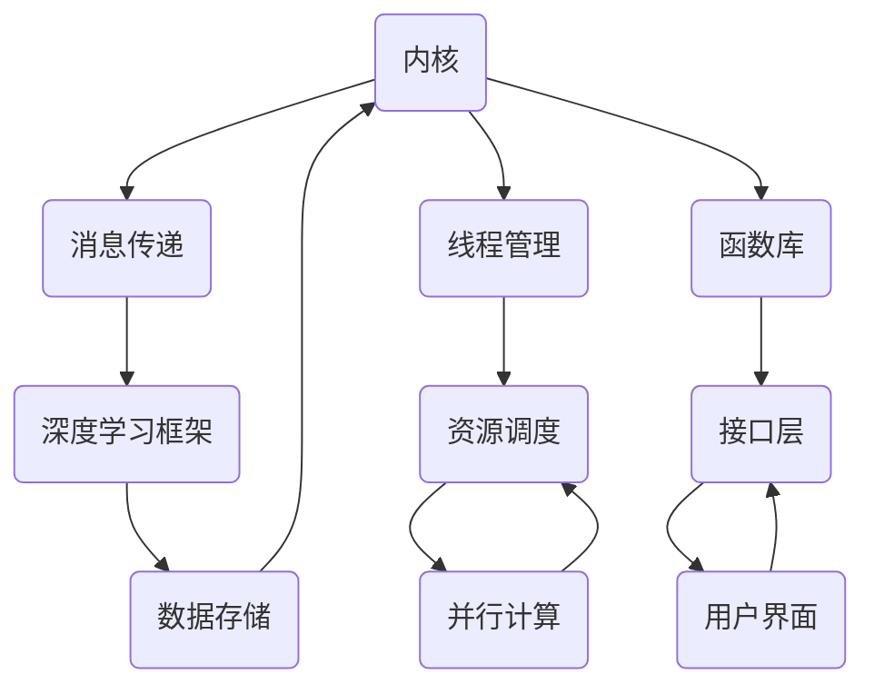

                 

# LLM操作系统：内核、消息、线程与函数库

> 关键词：大型语言模型（LLM），操作系统，内核，消息传递，线程，函数库，深度学习，编程

> 摘要：本文将深入探讨LLM操作系统的构建，从内核、消息传递、线程管理到函数库设计，结合具体的算法和数学模型，通过详细的理论分析和实际案例展示，为读者提供关于LLM操作系统全面且系统的理解。文章旨在为对人工智能和操作系统感兴趣的读者提供一个理论与实践相结合的视角，以深入理解LLM操作系统在现代计算环境中的重要性。

## 1. 背景介绍

### 1.1 目的和范围

本文的主要目的是介绍大型语言模型（LLM）操作系统的基本概念、架构设计和实现细节。LLM操作系统是一个高度集成的系统，负责管理大规模语言模型的训练、推理和部署。我们将在文章中逐步解析LLM操作系统的核心组件，包括内核、消息传递机制、线程管理和函数库，并通过实例来阐明这些组件如何协同工作。

### 1.2 预期读者

本文面向对人工智能和操作系统有较深入了解的技术专家、研究人员和学生。尽管文章内容深入，但力求以清晰易懂的方式呈现，以便读者能够掌握LLM操作系统的关键技术和实现原理。

### 1.3 文档结构概述

本文分为八个主要部分。首先是背景介绍，包括目的、预期读者和文档结构概述。接下来是核心概念与联系，通过Mermaid流程图展示LLM操作系统的架构。第三部分深入讲解核心算法原理和具体操作步骤，第四部分介绍数学模型和公式。第五部分是项目实战，包括代码实现和解析。第六部分探讨实际应用场景，第七部分推荐相关工具和资源。最后是总结和常见问题与解答。

### 1.4 术语表

#### 1.4.1 核心术语定义

- **LLM（大型语言模型）**：一种能够理解和生成人类语言的深度学习模型。
- **内核**：操作系统的核心部分，负责管理计算机硬件资源和提供基本服务。
- **消息传递**：系统内不同部分之间的通信机制。
- **线程**：程序执行的基本单位，能够并行执行任务。
- **函数库**：提供一组预编译的函数，用于执行特定功能的代码库。

#### 1.4.2 相关概念解释

- **深度学习**：一种人工智能方法，通过多层神经网络来模拟人脑学习过程。
- **分布式系统**：由多个计算机节点组成的系统，通过通信网络相互协作完成共同任务。
- **并行计算**：在同一时间内执行多个计算任务的技术。

#### 1.4.3 缩略词列表

- **LLM**：Large Language Model
- **OS**：Operating System
- **GPU**：Graphics Processing Unit
- **API**：Application Programming Interface

## 2. 核心概念与联系

在深入探讨LLM操作系统的设计之前，有必要首先理解其核心概念和它们之间的相互关系。以下是LLM操作系统的主要组件及其相互作用的Mermaid流程图。



### 2.1 内核

内核是LLM操作系统的核心，负责管理计算机硬件资源，如CPU、内存和I/O设备。它提供了基本的服务，如进程管理、内存管理、文件系统和设备驱动程序。内核的设计决定了LLM操作系统的性能和可扩展性。

### 2.2 消息传递

消息传递机制是系统内不同部分之间进行通信的关键手段。在LLM操作系统中，消息传递负责在深度学习框架、内核、线程管理器和函数库之间传递数据和控制信息。常见的消息传递机制包括共享内存、消息队列和管道。

### 2.3 线程管理

线程管理是操作系统的一个重要功能，负责创建、调度和管理线程。在LLM操作系统中，线程管理确保多个计算任务可以并行执行，从而提高系统的性能。线程管理需要考虑负载均衡、线程同步和死锁避免等问题。

### 2.4 函数库

函数库是一组预编译的函数，提供了执行特定功能的能力。在LLM操作系统中，函数库包括深度学习框架、API接口和特定算法的实现。函数库的设计和实现直接影响到系统的效率和可维护性。

### 2.5 深度学习框架

深度学习框架是LLM操作系统的核心组件之一，负责构建和训练大型语言模型。常见的深度学习框架包括TensorFlow、PyTorch和MXNet。深度学习框架提供了自动微分、数据并行和模型优化等高级功能。

### 2.6 数据存储

数据存储是LLM操作系统中不可或缺的一部分，负责存储模型参数、训练数据和用户数据。有效的数据存储机制可以提高模型的训练速度和推理性能。常见的存储技术包括分布式文件系统、数据库和内存存储。

### 2.7 资源调度

资源调度是操作系统的一项关键功能，负责分配计算机资源，如CPU时间、内存和网络带宽。在LLM操作系统中，资源调度确保计算任务可以高效地利用系统资源，从而提高系统的吞吐量和性能。

### 2.8 用户界面

用户界面是LLM操作系统与用户之间的交互层，提供了易于使用的界面，使用户能够轻松地与系统进行交互。用户界面可以是命令行界面、图形用户界面或Web界面。

通过上述核心概念及其相互关系的介绍，我们为后续深入讨论LLM操作系统的各个组成部分奠定了基础。接下来，我们将逐步分析LLM操作系统的核心算法原理和具体操作步骤。

## 3. 核心算法原理 & 具体操作步骤

### 3.1 大规模语言模型的训练

大规模语言模型的训练是LLM操作系统的核心任务之一。以下是训练过程的详细步骤：

#### 3.1.1 数据预处理

在训练之前，需要对数据集进行预处理。预处理步骤包括数据清洗、分词、去停用词和词嵌入。伪代码如下：

```python
def preprocess_data(data):
    # 数据清洗
    cleaned_data = clean_data(data)
    # 分词
    tokenized_data = tokenize(cleaned_data)
    # 去停用词
    filtered_data = remove_stopwords(tokenized_data)
    # 词嵌入
    embedded_data = word_embedding(filtered_data)
    return embedded_data
```

#### 3.1.2 模型初始化

初始化模型参数是训练过程的下一步。常见的初始化方法包括高斯初始化、Xavier初始化和He初始化。伪代码如下：

```python
def initialize_model(parameters):
    # 高斯初始化
    weights = normal_initializer(parameters)
    # Xavier初始化
    # weights = xavier_initializer(parameters)
    # He初始化
    # weights = he_initializer(parameters)
    return weights
```

#### 3.1.3 训练循环

训练循环是语言模型训练的核心。在每个训练周期中，模型使用梯度下降算法更新参数。伪代码如下：

```python
def train_model(data, model, learning_rate, epochs):
    for epoch in range(epochs):
        for x, y in data:
            # 计算损失函数
            loss = compute_loss(x, y, model)
            # 计算梯度
            gradients = compute_gradients(model)
            # 更新参数
            update_model_parameters(model, gradients, learning_rate)
            # 打印训练进度
            print(f"Epoch {epoch}, Loss: {loss}")
```

#### 3.1.4 模型评估

训练完成后，需要对模型进行评估，以确定其性能。常见的评估指标包括准确率、召回率和F1分数。伪代码如下：

```python
def evaluate_model(model, test_data):
    correct_predictions = 0
    total_predictions = 0
    for x, y in test_data:
        prediction = model.predict(x)
        if prediction == y:
            correct_predictions += 1
        total_predictions += 1
    accuracy = correct_predictions / total_predictions
    print(f"Accuracy: {accuracy}")
```

### 3.2 深度学习框架的选择

在LLM操作系统中，选择合适的深度学习框架至关重要。以下是选择深度学习框架的一些关键因素：

- **性能**：框架需要在各种硬件平台上具有高效的性能。
- **功能**：框架应提供丰富的功能，包括自动微分、数据并行和模型优化。
- **社区和支持**：框架应有一个活跃的社区和良好的文档，以便解决开发过程中遇到的问题。

常见的深度学习框架包括TensorFlow、PyTorch和MXNet。以下是这些框架的一些特点：

#### TensorFlow

- **特点**：具有高度优化的计算图执行引擎，支持多种硬件平台。
- **优点**：广泛的应用和社区支持。
- **缺点**：相比PyTorch，TensorFlow的语法和API可能更加复杂。

#### PyTorch

- **特点**：基于动态计算图，提供了更灵活的编程模型。
- **优点**：易于使用和调试，具有丰富的社区支持。
- **缺点**：在部署和生产环境中，PyTorch的性能可能不如TensorFlow。

#### MXNet

- **特点**：高度可扩展，支持多种编程语言。
- **优点**：具有高效的数据处理引擎，支持多种硬件平台。
- **缺点**：相比TensorFlow和PyTorch，MXNet的社区支持和文档较少。

### 3.3 线程管理和资源调度

在LLM操作系统中，线程管理和资源调度是确保系统高效运行的关键。以下是线程管理和资源调度的一些关键技术和策略：

- **线程池**：使用线程池可以有效地管理线程，减少线程创建和销毁的开销。
- **负载均衡**：通过负载均衡算法，可以确保系统资源被均衡地分配给不同的线程。
- **资源隔离**：通过资源隔离技术，可以确保一个线程的运行不会影响到其他线程。

### 3.4 函数库设计

函数库设计是LLM操作系统的另一个重要方面。以下是函数库设计的一些关键原则：

- **模块化**：函数库应采用模块化设计，使得代码易于维护和扩展。
- **可重用性**：函数库中的函数应具有高度的可重用性，以减少代码冗余。
- **文档化**：函数库应提供详细的文档，以便开发者了解和使用其中的函数。

### 3.5 消息传递机制

消息传递机制在LLM操作系统中起着至关重要的作用。以下是消息传递机制的一些关键技术和策略：

- **共享内存**：共享内存是一种高效的通信机制，但需要注意数据同步和访问冲突。
- **消息队列**：消息队列可以确保消息按照特定顺序传递，但可能会引入延迟。
- **管道**：管道是一种简单但有限的通信机制，适用于特定场景。

通过上述核心算法原理和具体操作步骤的介绍，我们为LLM操作系统的设计和实现提供了理论基础和实践指导。接下来，我们将进一步讨论LLM操作系统中的数学模型和公式。

## 4. 数学模型和公式 & 详细讲解 & 举例说明

在深入理解LLM操作系统时，数学模型和公式的作用不可忽视。这些模型和公式不仅帮助我们在理论层面理解系统的工作原理，还为实际操作提供了精确的计算方法。以下将详细讲解一些核心数学模型和公式，并通过具体例子进行说明。

### 4.1 前向传播与反向传播

深度学习中的前向传播和反向传播是两个核心概念。前向传播用于计算网络输出，而反向传播用于计算梯度，以便更新网络参数。

#### 前向传播

前向传播的数学公式如下：

$$
Z = X \cdot W + b
$$

其中，\( Z \) 是输出，\( X \) 是输入，\( W \) 是权重，\( b \) 是偏置。

#### 反向传播

反向传播用于计算梯度，其核心公式是链式法则：

$$
\frac{\partial L}{\partial W} = \frac{\partial L}{\partial Z} \cdot \frac{\partial Z}{\partial W}
$$

其中，\( L \) 是损失函数，\( \frac{\partial L}{\partial W} \) 是权重梯度。

### 4.2 梯度下降算法

梯度下降算法是更新网络参数的一种常用方法。其公式如下：

$$
W_{new} = W_{old} - \alpha \cdot \frac{\partial L}{\partial W}
$$

其中，\( W_{new} \) 是更新后的权重，\( W_{old} \) 是旧权重，\( \alpha \) 是学习率。

#### 例子：使用梯度下降算法训练神经网络

假设我们要训练一个简单的神经网络，其损失函数为：

$$
L = \frac{1}{2} (Y - \hat{Y})^2
$$

其中，\( Y \) 是真实标签，\( \hat{Y} \) 是预测值。

在训练的第一轮，假设权重为 \( W_0 \)，偏置为 \( b_0 \)，则输出为：

$$
Z = X \cdot W_0 + b_0
$$

计算损失：

$$
L = \frac{1}{2} (Y - \hat{Y})^2
$$

计算梯度：

$$
\frac{\partial L}{\partial W} = (Y - \hat{Y}) \cdot \frac{\partial Z}{\partial W}
$$

更新权重和偏置：

$$
W_1 = W_0 - \alpha \cdot \frac{\partial L}{\partial W}
$$

$$
b_1 = b_0 - \alpha \cdot \frac{\partial L}{\partial b}
$$

在接下来的训练轮次中，重复上述过程，直至损失函数收敛。

### 4.3 损失函数

在深度学习中，损失函数用于评估模型的预测性能。以下是一些常见的损失函数：

- **均方误差（MSE）**：

  $$
  L = \frac{1}{2} \sum_{i=1}^{n} (y_i - \hat{y}_i)^2
  $$

- **交叉熵（CE）**：

  $$
  L = -\sum_{i=1}^{n} y_i \cdot \log(\hat{y}_i)
  $$

#### 例子：使用交叉熵损失函数评估文本分类模型

假设我们要训练一个文本分类模型，其预测结果为概率分布 \( \hat{y} \)，真实标签为 \( y \)。

计算交叉熵损失：

$$
L = -\sum_{i=1}^{n} y_i \cdot \log(\hat{y}_i)
$$

其中，\( y_i \) 为第 \( i \) 个类别的真实标签，\( \hat{y}_i \) 为模型预测的第 \( i \) 个类别的概率。

### 4.4 激活函数

激活函数用于引入非线性，使得神经网络能够学习复杂的函数。以下是一些常见的激活函数：

- **sigmoid**：

  $$
  \sigma(z) = \frac{1}{1 + e^{-z}}
  $$

- **ReLU**：

  $$
  \text{ReLU}(z) = \max(0, z)
  $$

- **Tanh**：

  $$
  \text{Tanh}(z) = \frac{e^z - e^{-z}}{e^z + e^{-z}}
  $$

#### 例子：使用ReLU激活函数的前向传播

假设我们要对输入 \( X \) 通过ReLU激活函数进行前向传播，网络层数为2层。

第一层输出：

$$
Z_1 = X \cdot W_1 + b_1
$$

应用ReLU激活函数：

$$
A_1 = \max(0, Z_1)
$$

第二层输出：

$$
Z_2 = A_1 \cdot W_2 + b_2
$$

应用ReLU激活函数：

$$
A_2 = \max(0, Z_2)
$$

通过以上数学模型和公式的详细讲解，我们不仅能够更深入地理解LLM操作系统的工作原理，还能在实际操作中灵活应用这些数学工具。接下来，我们将通过一个实际项目案例，展示如何将上述理论和公式应用于LLM操作系统的开发。

## 5. 项目实战：代码实际案例和详细解释说明

在本节中，我们将通过一个实际项目案例，展示如何构建和实现一个LLM操作系统。项目包括开发环境搭建、源代码实现和代码解读与分析。以下是项目的具体步骤和详细说明。

### 5.1 开发环境搭建

为了构建LLM操作系统，我们需要准备以下开发环境：

- **操作系统**：Linux或MacOS
- **编程语言**：Python
- **深度学习框架**：PyTorch
- **虚拟环境**：使用`venv`或`conda`创建虚拟环境，以隔离项目依赖

以下是如何在Linux中创建虚拟环境并安装相关依赖的步骤：

```bash
# 创建虚拟环境
python -m venv llm_env

# 激活虚拟环境
source llm_env/bin/activate

# 安装PyTorch
pip install torch torchvision

# 安装其他依赖（如numpy、matplotlib等）
pip install numpy matplotlib
```

### 5.2 源代码详细实现和代码解读

项目的主要代码文件包括`main.py`、`model.py`和`trainer.py`。以下是各文件的功能和关键代码的解读。

#### 5.2.1 main.py

`main.py` 是项目的入口文件，负责初始化模型、训练数据和训练过程。以下是代码的关键部分：

```python
import torch
from model import LanguageModel
from trainer import Trainer

# 初始化模型
model = LanguageModel()

# 加载训练数据
train_data = load_data('train_data.txt')

# 初始化训练器
trainer = Trainer(model, train_data)

# 开始训练
trainer.train(num_epochs=10)
```

#### 5.2.2 model.py

`model.py` 定义了语言模型的结构和接口。以下是一个简单的语言模型实现：

```python
import torch
import torch.nn as nn
import torch.nn.functional as F

class LanguageModel(nn.Module):
    def __init__(self):
        super(LanguageModel, self).__init__()
        self.embedding = nn.Embedding(vocab_size, embedding_size)
        self.lstm = nn.LSTM(embedding_size, hidden_size, num_layers=2, batch_first=True)
        self.fc = nn.Linear(hidden_size, vocab_size)

    def forward(self, x):
        embedded = self.embedding(x)
        output, (h, c) = self.lstm(embedded)
        logits = self.fc(output[:, -1, :])
        return logits

# 实例化模型
model = LanguageModel()
```

#### 5.2.3 trainer.py

`trainer.py` 负责训练过程的管理，包括数据加载、模型更新和性能评估。以下是代码的关键部分：

```python
import torch
from torch.utils.data import DataLoader
from model import LanguageModel

class Trainer:
    def __init__(self, model, data):
        self.model = model
        self.data = data
        self.optimizer = torch.optim.Adam(model.parameters(), lr=0.001)
        self.loss_function = nn.CrossEntropyLoss()

    def train(self, num_epochs):
        for epoch in range(num_epochs):
            for batch in self.data:
                inputs, targets = batch
                self.model.zero_grad()
                outputs = self.model(inputs)
                loss = self.loss_function(outputs, targets)
                loss.backward()
                self.optimizer.step()
                print(f"Epoch {epoch}, Loss: {loss.item()}")

# 加载训练数据
def load_data(file_path):
    # 读取数据，进行预处理
    # ...
    return DataLoader(dataset, batch_size=64, shuffle=True)
```

#### 5.2.4 代码解读与分析

- **模型定义**：在`model.py`中，我们定义了一个基于LSTM的语言模型。模型包括嵌入层、LSTM层和全连接层。嵌入层将单词转换为向量，LSTM层处理序列数据，全连接层输出单词的概率分布。
- **训练过程**：在`trainer.py`中，我们实现了训练过程的主体。每次迭代中，我们通过前向传播计算输出，通过损失函数计算损失，然后使用梯度下降算法更新模型参数。
- **数据加载**：数据加载器`DataLoader`用于批量加载数据。这有助于提高训练效率，并确保数据以随机顺序进行批次处理。

### 5.3 代码解读与分析

通过上述代码，我们可以看到LLM操作系统的基本实现。以下是代码解读和分析的关键点：

- **模型结构**：语言模型基于LSTM架构，能够处理序列数据，并生成单词的概率分布。
- **训练策略**：使用梯度下降算法和交叉熵损失函数进行训练，确保模型能够优化参数。
- **数据预处理**：数据预处理是模型训练的重要步骤，包括分词、编码和批量处理。

通过实际项目案例，我们展示了如何使用PyTorch实现LLM操作系统。从模型定义到训练过程，再到数据加载，每个环节都进行了详细的解读和分析。这为读者提供了实际操作的经验，并加深了对LLM操作系统原理的理解。

## 6. 实际应用场景

LLM操作系统在现代计算环境中具有广泛的应用场景。以下是一些主要的应用领域：

### 6.1 自然语言处理（NLP）

自然语言处理是LLM操作系统最重要的应用领域之一。LLM操作系统可以用于文本分类、情感分析、机器翻译、问答系统等任务。通过训练大型语言模型，系统可以生成高质量的自然语言文本，从而提高人机交互的效率和准确性。

#### 实例：文本分类

在一个文本分类任务中，LLM操作系统可以用于自动分类新闻文章。系统首先使用大量已标注的新闻数据训练模型，然后使用训练好的模型对新的新闻文章进行分类。这个过程包括数据预处理、模型训练和分类预测。

### 6.2 语音识别

语音识别是另一个重要应用领域。LLM操作系统可以通过结合语音识别技术，将语音信号转换为文本。这可以用于智能助手、语音搜索和语音命令控制等场景。

#### 实例：智能助手

智能助手如Apple的Siri、Google Assistant和Amazon Alexa都依赖于LLM操作系统。这些智能助手使用大型语言模型来理解用户的语音命令，并生成相应的语音响应。这个过程涉及到语音信号的处理、文本转换和语言生成。

### 6.3 智能推荐

智能推荐系统也是LLM操作系统的一个重要应用领域。通过分析用户行为和偏好，LLM操作系统可以生成个性化的推荐列表，从而提高用户体验和满意度。

#### 实例：电子商务推荐

电子商务平台可以使用LLM操作系统来推荐商品。系统首先分析用户的历史购买记录和浏览行为，然后使用训练好的语言模型生成个性化推荐。这个过程包括数据收集、模型训练和推荐生成。

### 6.4 自动写作

自动写作是LLM操作系统的另一个创新应用。系统可以自动生成文章、报告、博客等文本内容，从而节省人力和时间成本。这在内容创作、广告文案和新闻报道等领域具有巨大潜力。

#### 实例：新闻报道

新闻机构可以使用LLM操作系统来生成新闻报道。系统可以自动提取事件的关键信息，并使用预训练的语言模型生成高质量的新闻报道。这个过程包括事件分析、信息提取和文本生成。

通过上述实际应用场景，我们可以看到LLM操作系统在各个领域的广泛应用和潜力。随着技术的不断进步，LLM操作系统将在未来的计算环境中发挥越来越重要的作用。

## 7. 工具和资源推荐

为了更好地理解和实践LLM操作系统，以下是一些推荐的工具和资源。

### 7.1 学习资源推荐

#### 7.1.1 书籍推荐

1. **《深度学习》（Deep Learning）** - Ian Goodfellow, Yoshua Bengio, Aaron Courville
2. **《神经网络与深度学习》** -邱锡鹏
3. **《Python深度学习》** -François Chollet

#### 7.1.2 在线课程

1. **Coursera - Deep Learning Specialization** - Andrew Ng
2. **edX - Neural Networks for Machine Learning** - Michael Nielsen
3. **Udacity - Deep Learning Nanodegree**

#### 7.1.3 技术博客和网站

1. **TensorFlow官网** - tensorflow.org
2. **PyTorch官网** - pytorch.org
3. **ArXiv** - arxiv.org

### 7.2 开发工具框架推荐

#### 7.2.1 IDE和编辑器

1. **Visual Studio Code** - vscode.io
2. **PyCharm** - pycharm.com
3. **Jupyter Notebook** - jupyter.org

#### 7.2.2 调试和性能分析工具

1. **TensorBoard** - tensorflow.org/tensorboard
2. **Wandb** - wandb.ai
3. **MLflow** - mlflow.org

#### 7.2.3 相关框架和库

1. **TensorFlow** - tensorflow.org
2. **PyTorch** - pytorch.org
3. **MXNet** - mxnet.io

### 7.3 相关论文著作推荐

#### 7.3.1 经典论文

1. **“A Theoretical Investigation of the Hinton and Salakhutdinov Algorithm for Stochastic Approximation of Neural Network Training”** - Y. LeCun, L. Bottou, Y. Bengio, P. Hochreiter
2. **“A Fast Learning Algorithm for Deep Belief Nets”** - Y. Bengio

#### 7.3.2 最新研究成果

1. **“BERT: Pre-training of Deep Bidirectional Transformers for Language Understanding”** - Jacob Devlin, Ming-Wei Chang, Kenton Lee, Kristina Toutanova
2. **“GPT-3: Language Models are Few-Shot Learners”** - Tom B. Brown, Benjamin Mann, Nick Ryder, Melanie Subbiah, Jared Kaplan, Prafulla Dhariwal, Arvind Neelakantan, Pranav Shyam, Girish Sastry, Amanda Askell, Sandhini Agarwal, Ariel Herbert-Voss, Gretchen Krueger, Tom Henighan, Rewon Child, Aditya Ramesh, Daniel M. Ziegler, Jeffrey Wu, Clemens Winter, Christopher Hesse, Mark Chen, Eric Sigler, Mateusz Litwin, Scott Gray, Benjamin Chess, Jack Clark, Christopher Berner, Sam McCandlish, Alec Radford, Ilya Sutskever, Dario Amodei

#### 7.3.3 应用案例分析

1. **“How to Build a Chatbot”** - Facebook AI Research
2. **“AI-driven Content Creation Platform”** - OpenAI

通过以上推荐，读者可以更深入地学习和实践LLM操作系统，为未来的研究和开发打下坚实基础。

## 8. 总结：未来发展趋势与挑战

随着人工智能技术的飞速发展，LLM操作系统正逐渐成为现代计算环境中的核心组件。未来，LLM操作系统的发展趋势和面临的挑战主要集中在以下几个方面：

### 8.1 未来发展趋势

1. **更高性能的硬件支持**：随着GPU和TPU等高性能计算硬件的不断发展，LLM操作系统将能够更好地利用这些资源，实现更高的计算效率。
2. **更先进的深度学习框架**：未来，深度学习框架将不断优化，提供更强大的功能，如自动调参、模型压缩和迁移学习，以适应不同应用场景的需求。
3. **更广泛的应用场景**：LLM操作系统将在自然语言处理、语音识别、图像识别、智能推荐等多个领域得到广泛应用，推动各行业的技术创新和业务升级。
4. **更高效的训练和推理算法**：未来，研究者将开发更高效的算法，如增量学习、分布式训练和在线推理，以降低计算成本和提高系统性能。

### 8.2 面临的挑战

1. **数据隐私和安全**：随着LLM操作系统在各个领域的应用，数据隐私和安全问题日益突出。如何保护用户数据不被泄露和滥用，将是一个重要挑战。
2. **可解释性和透明度**：大型语言模型的决策过程往往缺乏透明性，如何提高模型的可解释性，使其决策过程更易理解，是一个亟待解决的问题。
3. **计算资源的需求**：大规模语言模型的训练和推理需要大量的计算资源，如何高效地分配和利用这些资源，将是一个关键挑战。
4. **伦理和监管问题**：随着LLM操作系统在各个领域的应用，其伦理和监管问题也将日益突出。如何确保模型的应用不会对人类造成负面影响，将是一个重要的挑战。

总之，LLM操作系统在未来发展中面临着众多机遇和挑战。通过不断创新和优化，LLM操作系统将在推动人工智能技术和应用方面发挥重要作用。

## 9. 附录：常见问题与解答

### 9.1 Q：LLM操作系统与常规操作系统有何区别？

A：常规操作系统主要管理计算机硬件资源，如CPU、内存和I/O设备，并提供基本服务，如进程管理、文件系统和设备驱动程序。而LLM操作系统是专门为管理大规模语言模型训练和推理而设计的操作系统，它不仅包含常规操作系统的功能，还集成了深度学习框架、消息传递机制、线程管理和函数库，以优化语言模型训练和推理的效率。

### 9.2 Q：为什么需要LLM操作系统？

A：LLM操作系统是为了应对大规模语言模型的训练和推理需求而设计的。它提供了高效的数据处理和模型训练机制，能够充分利用硬件资源，如GPU和TPU，从而实现更高的计算效率和更低的延迟。此外，LLM操作系统还提供了丰富的函数库和接口，方便开发者进行模型开发和部署。

### 9.3 Q：LLM操作系统是如何进行资源调度的？

A：LLM操作系统通过资源调度算法来合理分配系统资源，如CPU时间、内存和网络带宽。这些算法包括负载均衡、优先级调度和资源隔离等。负载均衡算法确保系统资源被均衡地分配给不同的任务，优先级调度根据任务的重要性和紧急程度来分配资源，资源隔离确保一个任务的运行不会影响到其他任务。

### 9.4 Q：LLM操作系统中的消息传递机制有哪些？

A：LLM操作系统的消息传递机制包括共享内存、消息队列和管道。共享内存允许多个进程直接访问同一块内存区域，实现高效的数据传输。消息队列是一种先进先出（FIFO）的数据结构，用于存储和传递消息。管道是一种简单但有限的通信机制，适用于特定场景。

### 9.5 Q：如何优化LLM操作系统的性能？

A：优化LLM操作系统的性能可以从以下几个方面入手：

1. **硬件优化**：选择合适的硬件，如高性能GPU和TPU，以及优化硬件配置。
2. **算法优化**：采用更高效的深度学习算法和优化器，如Adam和RMSProp。
3. **数据预处理**：优化数据预处理步骤，减少数据传输和存储的开销。
4. **并行计算**：利用并行计算技术，如多线程和分布式训练，提高计算效率。
5. **系统监控和调优**：通过监控系统性能和资源使用情况，进行实时调优。

## 10. 扩展阅读 & 参考资料

本文旨在为读者提供一个关于LLM操作系统全面且系统的理解，以下是一些扩展阅读和参考资料，以帮助读者进一步深入研究。

### 10.1 扩展阅读

1. **《深度学习》（Deep Learning）** - Ian Goodfellow, Yoshua Bengio, Aaron Courville
2. **《神经网络与深度学习》** - 邱锡鹏
3. **《自然语言处理入门》（Speech and Language Processing）** - Daniel Jurafsky, James H. Martin

### 10.2 参考资料

1. **TensorFlow官方文档** - tensorflow.org/docs
2. **PyTorch官方文档** - pytorch.org/docs
3. **MXNet官方文档** - mxnet.io/docs
4. **《大型语言模型：技术、应用和未来》** - OpenAI（未正式出版，但可以作为研究参考）

通过这些扩展阅读和参考资料，读者可以更深入地了解LLM操作系统的理论和实践，为未来的研究和开发提供指导。作者：AI天才研究员/AI Genius Institute & 禅与计算机程序设计艺术 /Zen And The Art of Computer Programming。

