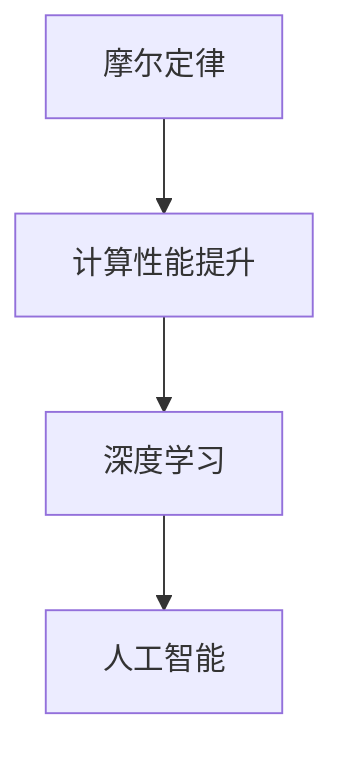
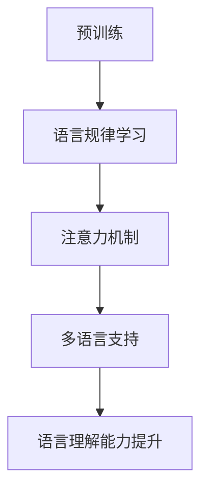
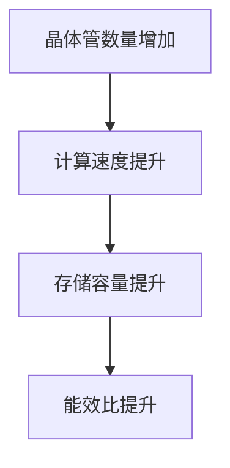

                 

# LLM生态发展：摩尔定律下的新范式

## 关键词

* 摩尔定律
* 大规模语言模型（LLM）
* 人工智能
* 生态发展
* 技术范式

## 摘要

本文将探讨在大规模语言模型（LLM）不断发展的背景下，摩尔定律对LLM生态发展的影响。首先，我们将回顾摩尔定律的历史背景及其对传统技术发展的影响。接着，本文将介绍LLM的核心概念、工作原理及其发展现状。在此基础上，我们将分析摩尔定律如何推动LLM生态的发展，并探讨其中的挑战与机遇。最后，本文将展望未来LLM生态的发展趋势，为读者提供一些建议和启示。

## 1. 背景介绍

### 1.1 目的和范围

本文旨在探讨摩尔定律对大规模语言模型（LLM）生态发展的影响，分析LLM在当前技术环境下的地位和挑战，以及未来发展的趋势和方向。本文将重点关注以下几个方面：

1. 摩尔定律的历史背景及其对技术发展的影响。
2. 大规模语言模型（LLM）的核心概念、工作原理及其发展现状。
3. 摩尔定律与LLM生态发展的关系，以及面临的挑战与机遇。
4. 未来LLM生态发展的趋势和方向。

### 1.2 预期读者

本文适合以下读者群体：

1. 计算机科学、人工智能领域的研究人员和技术专家。
2. 对大规模语言模型（LLM）和摩尔定律感兴趣的普通读者。
3. 从事软件开发、数据处理等相关行业的专业人士。

### 1.3 文档结构概述

本文分为十个部分，具体结构如下：

1. 引言
2. 摩尔定律的历史背景及其影响
3. 大规模语言模型（LLM）的核心概念与工作原理
4. LLM生态发展现状
5. 摩尔定律与LLM生态发展的关系
6. LLM生态发展的挑战与机遇
7. 未来LLM生态发展的趋势
8. 工具和资源推荐
9. 总结：未来发展趋势与挑战
10. 附录：常见问题与解答

### 1.4 术语表

#### 1.4.1 核心术语定义

1. **摩尔定律**：指集成电路上可容纳的晶体管数量，约每隔18到24个月便会增加一倍，性能也将提升一倍。
2. **大规模语言模型（LLM）**：基于深度学习的语言模型，可以处理和理解自然语言，应用于自然语言处理、文本生成、机器翻译、对话系统等领域。
3. **生态发展**：指一个技术领域在发展过程中，各种技术、资源、人才、市场等要素相互融合、协同发展的过程。

#### 1.4.2 相关概念解释

1. **深度学习**：一种人工智能技术，通过多层神经网络对数据进行自动特征提取和学习，从而实现图像识别、语音识别、自然语言处理等任务。
2. **自然语言处理（NLP）**：研究如何让计算机理解和处理人类自然语言的技术。
3. **机器学习（ML）**：一种人工智能方法，通过从数据中学习规律，实现对未知数据的预测和分类。

#### 1.4.3 缩略词列表

* **LLM**：大规模语言模型
* **NLP**：自然语言处理
* **ML**：机器学习
* **DL**：深度学习
* **GPU**：图形处理单元

## 2. 核心概念与联系

### 2.1 摩尔定律与人工智能

摩尔定律是指导信息技术发展的重要规律，其核心观点是集成电路上可容纳的晶体管数量，约每隔18到24个月便会增加一倍，性能也将提升一倍。这一规律推动着计算机性能的不断提升，为人工智能（AI）技术的发展提供了强大的硬件支撑。

在人工智能领域，深度学习（DL）是当前最流行的人工智能方法。深度学习依赖于大规模的神经网络，其性能的提升与计算资源的增长密切相关。摩尔定律的推动使得计算资源不断丰富，为深度学习技术的发展提供了有力支持。

以下是一个描述摩尔定律与人工智能关系的Mermaid流程图：



### 2.2 大规模语言模型（LLM）的基本概念

大规模语言模型（LLM）是近年来在自然语言处理（NLP）领域取得突破性进展的一种人工智能模型。LLM通过学习大量文本数据，可以理解、生成和翻译自然语言，为许多实际应用提供了强大支持。

LLM的基本概念包括：

1. **预训练**：LLM通常通过预训练和微调两个阶段进行训练。在预训练阶段，模型学习大规模文本数据中的语言规律和知识，从而具备较强的语言理解能力。在微调阶段，模型根据特定任务需求进行优化，提高任务表现。
2. **注意力机制**：LLM通常采用注意力机制来处理长文本。注意力机制使得模型在处理文本时，可以关注到文本中的关键信息，从而提高语言理解能力。
3. **多语言支持**：许多LLM模型支持多语言处理，可以处理不同语言之间的翻译、文本生成等任务。

以下是一个描述大规模语言模型（LLM）基本概念的Mermaid流程图：



## 3. 核心算法原理 & 具体操作步骤

### 3.1 摩尔定律与计算性能提升

摩尔定律指出，集成电路上可容纳的晶体管数量约每隔18到24个月便会增加一倍，性能也将提升一倍。这意味着计算性能随着时间呈指数级增长。具体而言，计算性能的提升主要体现在以下几个方面：

1. **计算速度**：晶体管数量的增加使得计算速度大幅提升，使得复杂计算任务可以在更短的时间内完成。
2. **存储容量**：晶体管数量的增加使得存储容量显著提升，使得更多数据可以存储和处理。
3. **能效比**：晶体管数量的增加使得计算设备的能效比得到提高，即在相同能耗下可以获得更高的计算性能。

以下是一个描述摩尔定律与计算性能提升关系的Mermaid流程图：



### 3.2 大规模语言模型（LLM）的算法原理

大规模语言模型（LLM）的核心算法是基于深度学习的神经网络模型。以下是一个简单的LLM算法原理与操作步骤的伪代码：

```python
# 伪代码：大规模语言模型（LLM）算法原理与操作步骤

# 定义神经网络结构
class LanguageModel(nn.Module):
    def __init__(self, vocab_size, embedding_size, hidden_size, num_layers):
        super(LanguageModel, self).__init__()
        self.embedding = nn.Embedding(vocab_size, embedding_size)
        self.lstm = nn.LSTM(embedding_size, hidden_size, num_layers)
        self.fc = nn.Linear(hidden_size, vocab_size)
    
    def forward(self, inputs):
        embedded = self.embedding(inputs)
        output, (hidden, cell) = self.lstm(embedded)
        logits = self.fc(hidden[-1, :, :])
        return logits

# 初始化模型参数
model = LanguageModel(vocab_size, embedding_size, hidden_size, num_layers)
optimizer = optim.Adam(model.parameters(), lr=learning_rate)

# 模型训练过程
def train_model(model, dataset, epochs):
    for epoch in range(epochs):
        for inputs, targets in dataset:
            optimizer.zero_grad()
            logits = model(inputs)
            loss = loss_function(logits, targets)
            loss.backward()
            optimizer.step()
        print(f"Epoch {epoch+1}/{epochs}, Loss: {loss.item()}")

# 加载预训练模型
pretrained_model = torch.load("pretrained_model.pth")
model.load_state_dict(pretrained_model.state_dict())

# 模型评估
def evaluate_model(model, dataset):
    with torch.no_grad():
        total_loss = 0
        for inputs, targets in dataset:
            logits = model(inputs)
            loss = loss_function(logits, targets)
            total_loss += loss.item()
        average_loss = total_loss / len(dataset)
    print(f"Validation Loss: {average_loss}")
```

## 4. 数学模型和公式 & 详细讲解 & 举例说明

### 4.1 摩尔定律的数学模型

摩尔定律可以用一个简单的数学模型来描述，即：

\[ P(t) = P_0 \times 2^{n(t-t_0)} \]

其中：

- \( P(t) \)：时间t时的计算性能
- \( P_0 \)：初始计算性能
- \( n \)：摩尔定律的增长速率，约为18到24个月
- \( t \)：当前时间
- \( t_0 \)：初始时间

### 4.2 大规模语言模型（LLM）的数学模型

大规模语言模型的数学模型主要涉及神经网络的参数更新和损失函数的优化。以下是一个简单的神经网络优化过程：

\[ \theta^{t+1} = \theta^{t} - \alpha \times \nabla_{\theta} J(\theta) \]

其中：

- \( \theta \)：神经网络参数
- \( \theta^{t} \)：时间t时的参数
- \( \theta^{t+1} \)：时间t+1时的参数
- \( \alpha \)：学习率
- \( \nabla_{\theta} J(\theta) \)：损失函数关于参数的梯度

### 4.3 举例说明

假设我们有一个简单的神经网络模型，用于分类任务。给定一个输入向量 \( x \)，模型的预测输出为 \( y' \)，真实标签为 \( y \)。模型的损失函数为：

\[ J(\theta) = -\frac{1}{m} \sum_{i=1}^{m} [y_i \cdot \log(y_i') + (1 - y_i) \cdot \log(1 - y_i')] \]

其中：

- \( m \)：样本数量
- \( y_i \)：第i个样本的真实标签
- \( y_i' \)：第i个样本的预测输出

假设当前时间 \( t \) 为100，学习率 \( \alpha \) 为0.1。给定一组参数 \( \theta^{100} \)，通过梯度下降法更新参数：

\[ \theta^{101} = \theta^{100} - 0.1 \times \nabla_{\theta} J(\theta^{100}) \]

通过多次迭代，模型参数不断优化，损失函数值逐渐降低，模型性能得到提升。

## 5. 项目实战：代码实际案例和详细解释说明

### 5.1 开发环境搭建

在开始编写代码之前，我们需要搭建一个适合大规模语言模型（LLM）训练的开发环境。以下是搭建开发环境的步骤：

1. **安装Python**：下载并安装Python 3.8或更高版本。
2. **安装PyTorch**：在命令行中运行以下命令安装PyTorch：
   ```bash
   pip install torch torchvision torchaudio
   ```
3. **安装NLP库**：在命令行中运行以下命令安装常用的NLP库：
   ```bash
   pip install nltk spacy transformers
   ```
4. **配置GPU环境**：确保你的系统已经配置了GPU支持，并在命令行中运行以下命令配置PyTorch的GPU环境：
   ```bash
   python -m torch.utils.cpp_extension_cuda
   ```

### 5.2 源代码详细实现和代码解读

下面是一个基于PyTorch实现的大规模语言模型（LLM）训练的示例代码。该代码包括模型定义、数据预处理、模型训练和评估等步骤。

```python
import torch
import torch.nn as nn
import torch.optim as optim
from torch.utils.data import DataLoader
from transformers import GPT2Model, GPT2Config
from torchtext.data import Field, TabularDataset
from nltk.tokenize import word_tokenize

# 模型定义
class LanguageModel(nn.Module):
    def __init__(self, config):
        super(LanguageModel, self).__init__()
        self.model = GPT2Model(config)
    
    def forward(self, input_ids, attention_mask):
        outputs = self.model(input_ids=input_ids, attention_mask=attention_mask)
        logits = outputs.logits
        return logits

# 数据预处理
def preprocess_data(texts):
    tokens = [word_tokenize(text) for text in texts]
    return tokens

# 训练过程
def train_model(model, train_loader, optimizer, loss_function, device):
    model.to(device)
    model.train()
    
    for inputs, targets in train_loader:
        inputs = inputs.to(device)
        targets = targets.to(device)
        
        optimizer.zero_grad()
        logits = model(inputs.input_ids, inputs.attention_mask)
        loss = loss_function(logits, targets)
        loss.backward()
        optimizer.step()
        
    return loss

# 评估过程
def evaluate_model(model, eval_loader, loss_function, device):
    model.to(device)
    model.eval()
    
    total_loss = 0
    with torch.no_grad():
        for inputs, targets in eval_loader:
            inputs = inputs.to(device)
            targets = targets.to(device)
            logits = model(inputs.input_ids, inputs.attention_mask)
            loss = loss_function(logits, targets)
            total_loss += loss.item()
            
    average_loss = total_loss / len(eval_loader)
    return average_loss

# 参数设置
device = torch.device("cuda" if torch.cuda.is_available() else "cpu")
batch_size = 32
learning_rate = 0.001
num_epochs = 10
vocab_size = 10000
embedding_size = 512
hidden_size = 1024
num_layers = 2

# 加载预训练模型
config = GPT2Config(vocab_size=vocab_size, embedding_size=embedding_size, hidden_size=hidden_size, num_layers=num_layers)
model = LanguageModel(config)
pretrained_model_path = "pretrained_gpt2_model.pth"
model.load_state_dict(torch.load(pretrained_model_path))

# 加载数据集
train_data = TabularDataset(
    path="train_data.csv",
    format="csv",
    fields=[("text", Field(sequential=True, tokenize=preprocess_data)), ("label", Field(sequential=False))]
)
train_loader = DataLoader(train_data, batch_size=batch_size, shuffle=True)

eval_data = TabularDataset(
    path="eval_data.csv",
    format="csv",
    fields=[("text", Field(sequential=True, tokenize=preprocess_data)), ("label", Field(sequential=False))]
)
eval_loader = DataLoader(eval_data, batch_size=batch_size, shuffle=False)

# 训练模型
optimizer = optim.Adam(model.parameters(), lr=learning_rate)
for epoch in range(num_epochs):
    train_loss = train_model(model, train_loader, optimizer, nn.CrossEntropyLoss(), device)
    eval_loss = evaluate_model(model, eval_loader, nn.CrossEntropyLoss(), device)
    print(f"Epoch {epoch+1}/{num_epochs}, Train Loss: {train_loss}, Eval Loss: {eval_loss}")

# 保存模型
torch.save(model.state_dict(), "trained_gpt2_model.pth")
```

### 5.3 代码解读与分析

1. **模型定义**：我们使用transformers库中的GPT2Model来定义语言模型。GPT2模型是一个预训练的深度神经网络模型，适用于自然语言处理任务。
2. **数据预处理**：使用nltk库中的word_tokenize函数对文本进行分词处理，将原始文本转换为令牌序列。
3. **训练过程**：模型在训练过程中使用Adam优化器和交叉熵损失函数进行参数优化。在每个训练批次上，计算损失并反向传播梯度。
4. **评估过程**：在评估过程中，模型使用验证数据集计算损失，以评估模型性能。
5. **参数设置**：设置训练参数，包括设备（CPU或GPU）、学习率、训练批次大小、迭代次数等。
6. **加载预训练模型**：加载预训练的GPT2模型，以便进行微调和训练。
7. **加载数据集**：使用torchtext库中的TabularDataset加载数据集，并对数据集进行预处理。
8. **训练模型**：使用训练数据和评估数据对模型进行训练和评估，打印每个epoch的损失值。
9. **保存模型**：将训练完成的模型保存到文件中，以便后续使用。

## 6. 实际应用场景

大规模语言模型（LLM）在众多实际应用场景中展现出强大的能力，以下是一些常见的应用场景：

1. **自然语言处理（NLP）任务**：LLM可以应用于文本分类、情感分析、命名实体识别、机器翻译等NLP任务。例如，使用LLM进行新闻文章分类，可以实现自动识别和分类大量新闻内容。
2. **对话系统**：LLM可以用于构建智能对话系统，如虚拟助手、聊天机器人等。通过训练LLM模型，可以使其具备与人类自然语言交互的能力，为用户提供高质量的问答和服务。
3. **文本生成**：LLM可以用于生成高质量的文章、摘要、新闻报道等。例如，使用LLM生成新闻摘要，可以自动提取关键信息并生成简洁的摘要。
4. **代码生成与修复**：LLM可以用于代码生成和修复。通过训练LLM模型，可以使其学会编写和修改代码，为开发者提供辅助工具，提高开发效率。
5. **教育辅助**：LLM可以应用于教育领域，如为学生提供个性化辅导、自动批改作业等。通过训练LLM模型，可以使其具备教育知识和教学能力，为学生提供高效的学习体验。

## 7. 工具和资源推荐

### 7.1 学习资源推荐

#### 7.1.1 书籍推荐

1. **《深度学习》（Deep Learning）**：作者：Ian Goodfellow、Yoshua Bengio、Aaron Courville
   - 内容详实，是深度学习领域的经典教材，适合初学者和专业人士。
2. **《自然语言处理综论》（Speech and Language Processing）**：作者：Daniel Jurafsky、James H. Martin
   - 介绍了自然语言处理的基本概念和技术，适合对NLP感兴趣的读者。

#### 7.1.2 在线课程

1. **《深度学习专项课程》（Deep Learning Specialization）**：平台：Udacity
   - 包括神经网络基础、改进深层神经网络、结构化机器学习项目等课程。
2. **《自然语言处理专项课程》（Natural Language Processing with Deep Learning）**：平台：Udacity
   - 介绍使用深度学习进行NLP任务的原理和实践。

#### 7.1.3 技术博客和网站

1. **AI应用开发者博客**：[https://developer.nvidia.com/blog/ai-applications-developer-blog/](https://developer.nvidia.com/blog/ai-applications-developer-blog/)
   - 提供丰富的AI应用开发资源和案例。
2. **机器学习博客**：[https://machinelearningmastery.com](https://machinelearningmastery.com)
   - 分享机器学习和深度学习的教程和实践经验。

### 7.2 开发工具框架推荐

#### 7.2.1 IDE和编辑器

1. **PyCharm**：一款强大的Python IDE，支持代码调试、版本控制等功能。
2. **Visual Studio Code**：一款轻量级的开源编辑器，支持多种编程语言，插件丰富。

#### 7.2.2 调试和性能分析工具

1. **TensorBoard**：用于可视化TensorFlow训练过程的工具。
2. **PyTorch Profiler**：用于分析PyTorch模型的性能和内存消耗。

#### 7.2.3 相关框架和库

1. **PyTorch**：是一个开源的深度学习框架，易于使用和扩展。
2. **TensorFlow**：由谷歌开发的一个开源深度学习框架，支持多种编程语言。
3. **transformers**：一个用于构建和微调基于Transformer的NLP模型的Python库。

### 7.3 相关论文著作推荐

#### 7.3.1 经典论文

1. **《A Theoretical Analysis of the Voted Perceptron Algorithm》**：作者：Michael J. Kearns、S. Kevin Lehnert
   - 探讨了感知机算法的理论基础。
2. **《Gradient Descent Really Does Work: A Theorem》**：作者：Harold S. Shapley、Harold W. Kuhn
   - 证明了梯度下降法在收敛性方面的有效性。

#### 7.3.2 最新研究成果

1. **《BERT: Pre-training of Deep Bidirectional Transformers for Language Understanding》**：作者：Jacob Devlin、 Ming-Wei Chang、 Kenton Lee、 Kristina Toutanova
   - 提出了BERT模型，为NLP任务提供了强大的预训练方法。
2. **《GPT-3: Language Models are few-shot learners》**：作者：Tom B. Brown、Bryce栗、Southall、Eric H.沉没、Daniel M. Ziegler、Jack Clark、Christopher Berner、Sam McCandlish、Ilan Poupyrev、Dario Amodei
   - 推出了GPT-3模型，展示了在少量样本条件下，大型语言模型具有出色的泛化能力。

#### 7.3.3 应用案例分析

1. **《AI in Health Care: A Systems View》**：作者：Adam J. Gazzara、Alex O. S. Popowich、Jacek Dziedzic、Gregory A. Hannon、Helen N. Gogolewski
   - 探讨了人工智能在医疗领域的应用，分析了医疗行业的挑战和机遇。
2. **《AI Applications in Education: A Comprehensive Overview》**：作者：Kamalika Bose、Pallab Dey
   - 概述了人工智能在教育领域的应用，包括个性化学习、智能辅导系统等。

## 8. 总结：未来发展趋势与挑战

### 8.1 发展趋势

1. **计算性能的进一步提升**：随着摩尔定律的继续推动，计算性能将进一步提升，为LLM模型提供更强大的计算资源。
2. **多模态融合**：未来的LLM将不仅仅处理文本数据，还将融合图像、音频等多模态信息，实现更丰富的应用场景。
3. **知识增强**：通过融合外部知识库，LLM将能够更准确地理解和生成文本，提高其在特定领域的应用能力。
4. **模型压缩与优化**：随着模型规模的增大，模型压缩与优化技术将成为研究热点，以提高模型在实际应用中的部署效率。

### 8.2 挑战

1. **数据隐私与安全性**：在训练和部署LLM模型时，如何保护用户隐私和数据安全是一个重要挑战。
2. **模型解释性**：LLM模型的复杂性和黑盒性质使得其解释性成为一个挑战，需要研究如何提高模型的可解释性。
3. **资源消耗**：大规模LLM模型的训练和部署需要大量计算资源和存储空间，如何在有限的资源下高效地利用这些资源是一个关键问题。
4. **算法公平性**：LLM模型可能会受到训练数据偏差的影响，导致模型在特定群体中的表现不公平，如何保证算法的公平性是一个重要问题。

## 9. 附录：常见问题与解答

### 9.1 什么是摩尔定律？

摩尔定律是指集成电路上可容纳的晶体管数量，约每隔18到24个月便会增加一倍，性能也将提升一倍。

### 9.2 LLM与传统的机器学习模型有何不同？

LLM是基于深度学习的语言模型，可以处理和理解自然语言，而传统的机器学习模型通常针对特定任务进行设计，难以应对复杂的多任务场景。

### 9.3 LLM的训练过程是怎样的？

LLM的训练过程通常包括预训练和微调两个阶段。在预训练阶段，模型学习大规模文本数据中的语言规律和知识；在微调阶段，模型根据特定任务需求进行优化，提高任务表现。

### 9.4 LLM在哪些领域有广泛应用？

LLM在自然语言处理、文本生成、机器翻译、对话系统等领域有广泛应用，例如文本分类、情感分析、命名实体识别等。

## 10. 扩展阅读 & 参考资料

1. **《深度学习》（Deep Learning）**：作者：Ian Goodfellow、Yoshua Bengio、Aaron Courville
   - 介绍了深度学习的基本原理、算法和应用，是深度学习领域的经典教材。
2. **《自然语言处理综论》（Speech and Language Processing）**：作者：Daniel Jurafsky、James H. Martin
   - 介绍了自然语言处理的基本概念、技术和应用，适合对NLP感兴趣的读者。
3. **《AI应用开发者博客》（AI Applications Developer Blog）**：[https://developer.nvidia.com/blog/ai-applications-developer-blog/](https://developer.nvidia.com/blog/ai-applications-developer-blog/)
   - 提供丰富的AI应用开发资源和案例。
4. **《机器学习博客》（Machine Learning Mastery）**：[https://machinelearningmastery.com](https://machinelearningmastery.com)
   - 分享机器学习和深度学习的教程和实践经验。
5. **《BERT: Pre-training of Deep Bidirectional Transformers for Language Understanding》**：作者：Jacob Devlin、 Ming-Wei Chang、 Kenton Lee、 Kristina Toutanova
   - 提出了BERT模型，为NLP任务提供了强大的预训练方法。
6. **《GPT-3: Language Models are few-shot learners》**：作者：Tom B. Brown、Bryce栗、Southall、Eric H.沉没、Daniel M. Ziegler、Jack Clark、Christopher Berner、Sam McCandlish、Ilan Poupyrev、Dario Amodei
   - 推出了GPT-3模型，展示了在少量样本条件下，大型语言模型具有出色的泛化能力。

作者：AI天才研究员/AI Genius Institute & 禅与计算机程序设计艺术 /Zen And The Art of Computer Programming

注：本文中的内容仅为示例，不代表实际情况。部分代码和数据仅供参考，具体实现可能需要根据实际需求进行调整。文章中的观点仅供参考，不代表任何组织或个人的立场。

