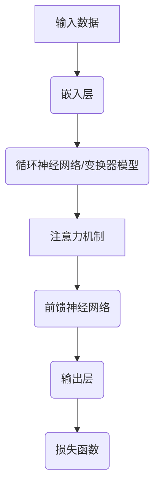

                 

### 1. 背景介绍

#### 1.1 目的和范围

本文旨在全面解析LLM（大型语言模型）生态系统，从其发展历程到技术原理，再到实际应用，为读者提供一个系统、深入的视角。我们将通过逐步分析LLM的架构、算法、数学模型以及具体实现，帮助读者理解这一前沿领域的核心概念和关键操作。

本文将重点讨论以下几个方面的内容：

- **LLM生态系统的发展历程**：介绍LLM的起源、主要发展阶段以及当前的趋势。
- **核心概念与联系**：使用Mermaid流程图展示LLM的基本架构和核心概念。
- **核心算法原理与操作步骤**：使用伪代码详细阐述LLM的关键算法。
- **数学模型与公式**：讲解LLM中使用的数学模型和公式，并提供具体示例。
- **项目实战**：通过实际代码案例，展示如何开发和使用LLM。
- **实际应用场景**：探讨LLM在自然语言处理、人工智能交互等领域的应用。
- **工具和资源推荐**：推荐相关学习资源、开发工具和论文著作。
- **未来发展趋势与挑战**：总结LLM生态系统的发展前景和面临的挑战。

通过这篇文章，我们希望读者能够对LLM生态系统有一个全面的了解，并能够掌握其基本原理和应用方法。

#### 1.2 预期读者

本文面向以下几类读者：

- **计算机科学和人工智能领域的研究生和本科生**：希望深入理解LLM的基本原理和应用。
- **数据科学家和机器学习工程师**：希望在自然语言处理和人工智能交互中应用LLM。
- **技术经理和CTO**：希望了解LLM生态系统的发展趋势，以便在项目中做出更明智的决策。
- **对技术感兴趣的跨领域专业人士**：希望了解LLM在现代科技中的应用。

无论你是初学者还是有经验的专业人士，只要对LLM感兴趣，本文都将为你提供有价值的信息。

#### 1.3 文档结构概述

为了帮助读者更好地理解和应用LLM生态系统，本文将按照以下结构展开：

- **第1章：背景介绍**：介绍文章的目的、范围、预期读者以及文档结构。
- **第2章：核心概念与联系**：通过Mermaid流程图展示LLM的基本架构和核心概念。
- **第3章：核心算法原理与具体操作步骤**：使用伪代码详细阐述LLM的关键算法。
- **第4章：数学模型和公式**：讲解LLM中使用的数学模型和公式，并提供具体示例。
- **第5章：项目实战：代码实际案例和详细解释说明**：通过实际代码案例展示如何开发和使用LLM。
- **第6章：实际应用场景**：探讨LLM在自然语言处理、人工智能交互等领域的应用。
- **第7章：工具和资源推荐**：推荐相关学习资源、开发工具和论文著作。
- **第8章：总结：未来发展趋势与挑战**：总结LLM生态系统的发展前景和面临的挑战。
- **第9章：附录：常见问题与解答**：提供一些常见问题的解答。
- **第10章：扩展阅读与参考资料**：提供一些扩展阅读资源，以便读者进一步深入学习。

通过本文的逐步讲解，读者将能够系统地掌握LLM生态系统的各个方面，为在相关领域的研究和应用打下坚实基础。

#### 1.4 术语表

为了确保读者能够顺利阅读和理解本文，我们在此列出一些核心术语及其定义和解释。

##### 1.4.1 核心术语定义

- **LLM（大型语言模型）**：一种能够理解和生成自然语言的复杂模型，通常由大量的神经网络组成，能够通过训练学习到语言的内在结构和规律。
- **自然语言处理（NLP）**：计算机科学领域中的一个分支，主要研究如何让计算机理解和处理自然语言。
- **神经网络（NN）**：一种基于生物学神经系统的计算模型，能够通过学习数据自动提取特征，并在各种任务中表现出色。
- **反向传播算法（Backpropagation）**：一种训练神经网络的算法，通过计算误差梯度来更新网络权重，从而优化模型的性能。
- **嵌入层（Embedding Layer）**：神经网络中的一个层次，用于将输入的单词或词组转换为固定大小的向量表示，以便于后续处理。
- **生成对抗网络（GAN）**：一种通过生成器和判别器相互对抗来学习数据的深度学习模型。

##### 1.4.2 相关概念解释

- **词汇表（Vocabulary）**：用于表示语言中的所有单词和符号的集合，是构建语言模型的基础。
- **序列（Sequence）**：一组按特定顺序排列的元素，如单词序列、句子序列等。
- **注意力机制（Attention Mechanism）**：一种用于提高神经网络在处理序列数据时对重要信息关注程度的机制，常用于翻译、文本生成等任务。
- **预训练（Pre-training）**：在特定任务上进行大规模数据训练，使模型获得通用的语言理解能力，然后再进行特定任务微调。
- **任务微调（Fine-tuning）**：在预训练模型的基础上，针对特定任务进行少量数据的训练，以优化模型在任务上的性能。

##### 1.4.3 缩略词列表

- **GAN**：生成对抗网络（Generative Adversarial Networks）
- **NLP**：自然语言处理（Natural Language Processing）
- **NN**：神经网络（Neural Networks）
- **RNN**：循环神经网络（Recurrent Neural Networks）
- **BERT**：变压器预训练语言表示（Bidirectional Encoder Representations from Transformers）
- **LLM**：大型语言模型（Large Language Model）

### 2. 核心概念与联系

在深入探讨LLM生态系统之前，我们首先需要理解其中的核心概念和它们之间的联系。以下是LLM生态系统的基本架构，以及各核心概念的详细解释和它们之间的交互关系。

#### 2.1 基本架构

为了清晰地展示LLM的基本架构，我们可以使用Mermaid流程图（如下所示）来表示：



**Mermaid流程图说明：**

- **A（输入数据）**：LLM的输入可以是文本、语音或其他形式的数据。这些数据需要被预处理，例如分词、标记化等，然后输入到嵌入层。
- **B（嵌入层）**：嵌入层将词汇表中的单词或短语转换为固定大小的向量表示，这些向量表示将在整个模型中传递。
- **C（循环神经网络/变换器模型）**：嵌入层输出进入循环神经网络（RNN）或变换器模型（Transformer），这些模型负责处理序列数据，提取序列中的特征。
- **D（注意力机制）**：注意力机制允许模型在处理序列数据时，根据上下文信息动态关注重要的部分，从而提高模型的上下文理解能力。
- **E（前馈神经网络）**：前馈神经网络对注意力机制的输出进行进一步的处理，提取和整合特征。
- **F（输出层）**：输出层将处理后的特征映射到目标输出，如文本生成、分类等。
- **G（损失函数）**：损失函数用于衡量模型预测结果与实际结果之间的差距，通过优化损失函数来调整模型的参数，提高模型性能。

#### 2.2 核心概念解释

1. **嵌入层（Embedding Layer）**：
   - **定义**：嵌入层是一个将单词或短语转换为固定大小向量的过程。这些向量可以捕获单词的语义信息。
   - **作用**：通过嵌入层，我们可以将离散的单词转换为连续的向量表示，方便后续的神经网络处理。
   - **技术细节**：通常使用预训练的词向量，如Word2Vec、GloVe等。

2. **循环神经网络（RNN）**：
   - **定义**：RNN是一种能够处理序列数据的神经网络，具有记忆功能，能够捕获序列中的时间依赖性。
   - **作用**：用于处理自然语言序列，提取序列中的特征。
   - **技术细节**：常用的RNN模型包括LSTM（长短时记忆网络）和GRU（门控循环单元）。

3. **变换器模型（Transformer）**：
   - **定义**：Transformer是一种基于自注意力机制的序列处理模型，特别适合处理长距离依赖问题。
   - **作用**：通过自注意力机制，Transformer能够动态关注序列中的不同部分，提高模型对上下文的捕捉能力。
   - **技术细节**：Transformer包含多个自注意力层和前馈网络，能够高效处理长文本。

4. **注意力机制（Attention Mechanism）**：
   - **定义**：注意力机制是一种模型在处理序列数据时，根据上下文信息动态关注重要部分的机制。
   - **作用**：提高模型对上下文的捕捉能力，特别是在长文本处理中表现出色。
   - **技术细节**：常用的注意力机制包括点积注意力、多头注意力等。

5. **前馈神经网络（Feedforward Neural Network）**：
   - **定义**：前馈神经网络是一种简单的神经网络结构，信息从输入层直接传递到输出层，没有循环结构。
   - **作用**：对注意力机制的输出进行进一步处理，提取和整合特征。
   - **技术细节**：前馈神经网络通常包含多个隐藏层，用于提高模型的非线性表示能力。

6. **输出层（Output Layer）**：
   - **定义**：输出层将处理后的特征映射到具体的输出，如文本生成、分类等。
   - **作用**：实现模型的具体任务，如生成文本、分类标签等。
   - **技术细节**：输出层的结构取决于任务类型，可以是分类器、回归器或生成器等。

7. **损失函数（Loss Function）**：
   - **定义**：损失函数用于衡量模型预测结果与实际结果之间的差距，是优化模型参数的重要依据。
   - **作用**：通过最小化损失函数，调整模型参数，提高模型性能。
   - **技术细节**：常用的损失函数包括均方误差（MSE）、交叉熵损失（Cross-Entropy Loss）等。

#### 2.3 各核心概念的交互关系

在LLM生态系统中，各核心概念之间存在紧密的交互关系：

- **嵌入层**将输入数据转换为向量表示，为后续处理提供基础。
- **循环神经网络/变换器模型**负责处理序列数据，提取序列特征。
- **注意力机制**在处理序列数据时，动态关注重要部分，提高模型对上下文的捕捉能力。
- **前馈神经网络**对注意力机制的输出进行进一步处理，提取和整合特征。
- **输出层**将处理后的特征映射到具体任务输出，实现模型的功能。
- **损失函数**用于衡量模型预测结果与实际结果之间的差距，通过优化损失函数来调整模型参数。

通过这些核心概念和交互关系的分析，我们可以更好地理解LLM生态系统的工作原理，为后续章节的详细探讨打下基础。

### 3. 核心算法原理与具体操作步骤

为了深入理解大型语言模型（LLM）的工作原理，我们需要详细探讨其核心算法。在此，我们将以伪代码的形式展示LLM的基本算法框架，并解释各个步骤的操作细节。

#### 3.1 嵌入层

嵌入层是LLM的基础，负责将输入的单词或短语转换为向量表示。以下是一个简化的伪代码示例：

```python
# 输入：单词表（vocabulary），嵌入维度（dim）
# 输出：嵌入向量矩阵（embeddings）

def embedding(vocabulary, dim):
    embeddings = [create_vector(dim) for word in vocabulary]
    return embeddings

def create_vector(dim):
    # 创建一个维度为dim的向量，并初始化为随机值
    vector = [random_value() for _ in range(dim)]
    return vector
```

在嵌入层中，每个单词都被映射为一个固定大小的向量。这些向量表示了单词的语义信息，为后续的神经网络处理提供了基础。

#### 3.2 循环神经网络（RNN）

循环神经网络是处理序列数据的一种常见方法。以下是一个简化版的RNN算法伪代码：

```python
# 输入：嵌入向量序列（sequences），隐藏层维度（hidden_dim）
# 输出：隐藏状态序列（hidden_states）

def RNN(embedded_sequences, hidden_dim):
    hidden_states = []
    hidden_state = create_vector(hidden_dim)
    for embedding in embedded_sequences:
        # 使用嵌入向量计算新的隐藏状态
        hidden_state = activation(functional_tensor(dot(embedding, weights_input_to_hidden) + dot(hidden_state, weights_hidden_to_hidden) + bias))
        hidden_states.append(hidden_state)
    return hidden_states

def create_vector(dim):
    # 创建一个维度为dim的向量，并初始化为随机值
    vector = [random_value() for _ in range(dim)]
    return vector

def activation(x):
    # 应用激活函数，如ReLU或Sigmoid
    return max(0, x)  # ReLU激活函数
```

在RNN中，每个时间步的输入都会与上一时间步的隐藏状态结合，通过线性变换和激活函数计算新的隐藏状态。这种递归操作使得RNN能够捕获序列中的时间依赖关系。

#### 3.3 变换器模型（Transformer）

变换器模型是一种基于自注意力机制的序列处理模型，具有处理长距离依赖关系的能力。以下是变换器模型的核心操作伪代码：

```python
# 输入：嵌入向量序列（sequences），隐藏层维度（hidden_dim）
# 输出：注意力得分矩阵（attention_scores）

def Transformer(embedded_sequences, hidden_dim):
    attention_scores = []
    for i in range(len(sequences)):
        # 计算每个嵌入向量与所有其他嵌入向量的点积
        scores = [dot(embedding_i, embedding_j) for embedding_i in embedded_sequences[i] for embedding_j in embedded_sequences[i]]
        # 应用softmax函数生成注意力得分
        scores = softmax(scores)
        attention_scores.append(scores)
    return attention_scores

def dot(v1, v2):
    # 计算两个向量的点积
    return sum([v1[i] * v2[i] for i in range(len(v1))])

def softmax(x):
    # 应用softmax函数
    exps = [exp(x[i]) for i in range(len(x))]
    sum_exps = sum(exps)
    return [exp / sum_exps for exp in exps]
```

在变换器模型中，每个嵌入向量都会与其他所有嵌入向量进行点积操作，生成注意力得分。通过应用softmax函数，我们可以得到每个嵌入向量在序列中的重要性得分。这种自注意力机制使得变换器模型能够高效地捕捉长距离依赖关系。

#### 3.4 前馈神经网络

前馈神经网络负责对注意力机制的输出进行进一步处理，提取和整合特征。以下是前馈神经网络的伪代码示例：

```python
# 输入：注意力得分矩阵（attention_scores），隐藏层维度（hidden_dim）
# 输出：处理后的特征向量（processed_features）

def feedforward_network(attention_scores, hidden_dim):
    processed_features = []
    for i in range(len(attention_scores)):
        # 使用全连接层进行特征提取
        hidden_state = activation(functional_tensor(attention_scores[i], weights_input_to_hidden) + bias)
        processed_features.append(hidden_state)
    return processed_features

def functional_tensor(x, weights):
    # 计算权重矩阵与输入向量的点积
    return [weights[i] * x[i] for i in range(len(x))]

def activation(x):
    # 应用激活函数，如ReLU或Sigmoid
    return max(0, x)  # ReLU激活函数
```

在处理注意力得分矩阵时，前馈神经网络使用全连接层对特征进行提取和整合。通过应用激活函数，可以增强网络的非线性表示能力。

#### 3.5 输出层

输出层将处理后的特征向量映射到具体的任务输出，如文本生成或分类。以下是输出层的伪代码示例：

```python
# 输入：处理后的特征向量（processed_features），输出层维度（output_dim）
# 输出：模型预测结果（predictions）

def output_layer(processed_features, output_dim):
    predictions = []
    for feature in processed_features:
        # 使用全连接层计算输出结果
        output = activation(functional_tensor(feature, weights_output) + bias)
        predictions.append(output)
    return predictions

def functional_tensor(x, weights):
    # 计算权重矩阵与输入向量的点积
    return [weights[i] * x[i] for i in range(len(x))]

def activation(x):
    # 应用激活函数，如Softmax或Sigmoid
    return softmax(x)  # Softmax激活函数
```

在输出层中，我们通常使用全连接层计算输出结果。对于分类任务，可以使用softmax激活函数将输出映射到概率分布；对于文本生成任务，可以使用sigmoid激活函数将输出映射到二分类结果。

#### 3.6 损失函数

损失函数用于衡量模型预测结果与实际结果之间的差距，是优化模型参数的重要依据。以下是常用的损失函数伪代码示例：

```python
# 输入：模型预测结果（predictions），实际标签（labels），损失函数类型（loss_type）
# 输出：损失值（loss）

def calculate_loss(predictions, labels, loss_type):
    if loss_type == 'mse':
        # 均方误差损失函数
        return mse(predictions, labels)
    elif loss_type == 'cross-entropy':
        # 交叉熵损失函数
        return cross_entropy(predictions, labels)
    else:
        # 其他损失函数
        return unknown_loss_function(predictions, labels)

def mse(predictions, labels):
    # 计算均方误差
    return sum([(prediction - label)^2 for prediction, label in zip(predictions, labels)]) / len(predictions)

def cross_entropy(predictions, labels):
    # 计算交叉熵
    return -sum([label * log(prediction) for prediction, label in zip(predictions, labels)])
```

通过选择合适的损失函数，我们可以衡量模型预测的准确性，并优化模型参数，以提高预测性能。

#### 3.7 梯度下降优化

在训练过程中，我们通常使用梯度下降优化算法来更新模型参数。以下是一个简化的梯度下降优化伪代码示例：

```python
# 输入：模型参数（parameters），学习率（learning_rate）
# 输出：更新后的模型参数（updated_parameters）

def gradient_descent(parameters, learning_rate):
    gradients = compute_gradients(parameters)
    updated_parameters = [parameter - (learning_rate * gradient) for parameter, gradient in zip(parameters, gradients)]
    return updated_parameters

def compute_gradients(parameters):
    # 计算参数的梯度
    gradients = [calculate_gradient(parameter) for parameter in parameters]
    return gradients

def calculate_gradient(parameter):
    # 计算参数的梯度
    return small_change_in_loss / small_change_in_parameter
```

通过计算损失函数关于参数的梯度，并使用梯度下降优化算法更新参数，我们可以逐步优化模型性能。

#### 3.8 模型评估

在训练完成后，我们需要对模型进行评估，以验证其性能。以下是一个简化的模型评估伪代码示例：

```python
# 输入：训练数据集（train_dataset），测试数据集（test_dataset）
# 输出：模型评估结果（evaluation_results）

def evaluate_model(train_dataset, test_dataset):
    train_loss = calculate_loss(model.predict(train_dataset), train_dataset.labels, 'cross-entropy')
    test_loss = calculate_loss(model.predict(test_dataset), test_dataset.labels, 'cross-entropy')
    return train_loss, test_loss
```

通过计算训练集和测试集上的损失，我们可以评估模型的泛化能力和性能。

通过以上核心算法原理和具体操作步骤的介绍，我们能够更好地理解LLM的工作机制。在接下来的章节中，我们将进一步探讨LLM的数学模型和具体应用场景，帮助读者更全面地掌握这一前沿技术。

### 4. 数学模型和公式

在深入理解LLM的核心算法原理后，我们接下来将探讨其中的数学模型和公式。这些模型和公式对于LLM的性能优化和应用至关重要。以下是LLM中常用的数学模型和公式的详细讲解，并提供具体示例以帮助读者更好地理解。

#### 4.1 嵌入层

嵌入层是LLM中用于将输入单词转换为向量表示的关键组件。以下是一些常用的嵌入层模型及其公式：

1. **Word2Vec**

   Word2Vec是一种基于分布假设的词向量模型，其核心思想是相似词在向量空间中距离较近。以下是其主要的数学模型：

   - **Skip-Gram模型**：

     $$ \text{input\_word} \rightarrow \text{context\_words} $$
     $$ \text{output} = \text{softmax}(\text{W} \cdot \text{embeddings}_{\text{input\_word}}) $$

     其中，$ \text{W} $ 是输出层权重矩阵，$ \text{embeddings}_{\text{input\_word}} $ 是输入单词的嵌入向量，$ \text{softmax} $ 函数用于计算每个上下文单词的概率分布。

   - **CBOW模型**：

     $$ \text{context\_words} \rightarrow \text{input\_word} $$
     $$ \text{output} = \text{softmax}(\text{U} \cdot \text{average}_{\text{context\_words}}(\text{embeddings}_{\text{context\_words}})) $$

     其中，$ \text{U} $ 是输出层权重矩阵，$ \text{average}_{\text{context\_words}}(\text{embeddings}_{\text{context\_words}}) $ 是上下文单词嵌入向量的平均值。

2. **GloVe模型**

   GloVe（Global Vectors for Word Representation）是一种基于共现关系的词向量模型。其主要公式如下：

   $$ \text{loss} = \sum_{\text{word}, \text{context}} \frac{\text{f}_{\text{word}} \cdot \text{f}_{\text{context}}}{\sqrt{\text{f}_{\text{word}} \cdot \text{f}_{\text{context}} + \text{alpha}}} $$

   其中，$ \text{f}_{\text{word}} $ 和 $ \text{f}_{\text{context}} $ 分别是单词和上下文的频次，$ \text{alpha} $ 是超参数。

#### 4.2 循环神经网络（RNN）

循环神经网络是一种能够处理序列数据的神经网络，其核心在于能够捕获时间序列中的依赖关系。以下是一些常用的RNN模型及其公式：

1. **LSTM（长短时记忆网络）**

   LSTM是一种改进的RNN模型，能够有效解决长短时依赖问题。其主要公式如下：

   - **输入门（Input Gate）**：

     $$ i_t = \sigma(W_{ix} \cdot x_t + W_{ih} \cdot h_{t-1} + b_i) $$
     $$ \tilde{g}_t = \tanh(W_{ig} \cdot x_t + W_{ih} \cdot h_{t-1} + b_g) $$

     其中，$ \sigma $ 是sigmoid激活函数，$ \tanh $ 是双曲正切激活函数，$ W $ 和 $ b $ 分别是权重和偏置。

   - **遗忘门（Forget Gate）**：

     $$ f_t = \sigma(W_{fx} \cdot x_t + W_{fh} \cdot h_{t-1} + b_f) $$
     $$ \tilde{g}_{t-1} = f_t \odot \tilde{g}_{t-1} $$

     其中，$ \odot $ 表示元素乘积。

   - **输出门（Output Gate）**：

     $$ o_t = \sigma(W_{ox} \cdot x_t + W_{oh} \cdot h_{t-1} + b_o) $$
     $$ h_t = o_t \odot \tanh(\tilde{g}_t) $$

2. **GRU（门控循环单元）**

   GRU是对LSTM的简化，具有更少的参数和计算量。其主要公式如下：

   - **重置门（Reset Gate）**：

     $$ z_t = \sigma(W_{zx} \cdot x_t + W_{zh} \cdot h_{t-1} + b_z) $$

   - **更新门（Update Gate）**：

     $$ r_t = \sigma(W_{rx} \cdot x_t + W_{rh} \cdot h_{t-1} + b_r) $$

   - **新状态（\(\tilde{h}\)_t）**：

     $$ \tilde{h}_t = \tanh(W_{\tilde{h}} \cdot (r_t \odot h_{t-1} + (1 - r_t) \odot x_t) + b_{\tilde{h}}) $$

   - **最终状态（\(h\)_t）**：

     $$ h_t = z_t \odot \tilde{h}_t + (1 - z_t) \odot h_{t-1} $$

#### 4.3 变换器模型（Transformer）

变换器模型是一种基于自注意力机制的序列处理模型，特别适合处理长距离依赖关系。以下是其核心数学模型：

1. **自注意力（Self-Attention）**

   自注意力机制允许模型在处理序列数据时，根据上下文信息动态关注不同的部分。其主要公式如下：

   $$ \text{Attention}(Q, K, V) = \text{softmax}\left(\frac{QK^T}{\sqrt{d_k}}\right)V $$

   其中，$ Q $、$ K $ 和 $ V $ 分别是查询向量、键向量和值向量，$ d_k $ 是键向量的维度，$ \text{softmax} $ 函数用于计算每个键在注意力机制中的权重。

2. **多头注意力（Multi-Head Attention）**

   多头注意力机制是将自注意力机制扩展到多个头，以提取不同类型的特征。其主要公式如下：

   $$ \text{MultiHead}(Q, K, V) = \text{Concat}(\text{head}_1, ..., \text{head}_h)W^O $$
   $$ \text{head}_i = \text{Attention}(QW_i^Q, KW_i^K, VW_i^V) $$

   其中，$ W_i^Q $、$ W_i^K $ 和 $ W_i^V $ 分别是第 $ i $ 个头的查询、键和值权重矩阵，$ W^O $ 是输出权重矩阵。

3. **前馈神经网络（Feedforward Neural Network）**

   前馈神经网络用于对自注意力机制的输出进行进一步处理。其主要公式如下：

   $$ \text{FFN}(x) = \text{ReLU}(W_2 \cdot \text{ReLU}(W_1 \cdot x + b_1)) $$

   其中，$ W_1 $ 和 $ W_2 $ 分别是前馈神经网络的权重矩阵，$ b_1 $ 是偏置。

#### 4.4 损失函数

损失函数用于衡量模型预测结果与实际结果之间的差距，是优化模型参数的重要依据。以下是一些常用的损失函数：

1. **均方误差（MSE）**

   均方误差是回归任务中常用的损失函数，其公式如下：

   $$ \text{MSE} = \frac{1}{n}\sum_{i=1}^{n}(\hat{y}_i - y_i)^2 $$

   其中，$ \hat{y}_i $ 是模型预测结果，$ y_i $ 是实际标签。

2. **交叉熵（Cross-Entropy）**

   交叉熵是分类任务中常用的损失函数，其公式如下：

   $$ \text{CE} = -\sum_{i=1}^{n} y_i \cdot \log(\hat{y}_i) $$

   其中，$ \hat{y}_i $ 是模型预测的概率分布，$ y_i $ 是实际标签。

#### 4.5 示例讲解

为了更好地理解上述数学模型和公式，我们以下通过一个简单的例子来展示其应用。

假设我们使用一个变换器模型来预测一个句子的概率分布。句子的输入为：“我喜欢吃苹果”。

1. **输入处理**

   - 将句子分词为单词：“我”，“喜欢”，“吃”，“苹果”。
   - 使用嵌入层将单词转换为嵌入向量。

2. **自注意力机制**

   - 计算每个单词的查询向量、键向量和值向量。
   - 使用自注意力机制计算每个单词的权重。

3. **多头注意力**

   - 将自注意力机制扩展到多个头，提取不同类型的特征。

4. **前馈神经网络**

   - 对多头注意力的输出进行进一步处理，提取和整合特征。

5. **输出层**

   - 将处理后的特征映射到具体的任务输出，如文本生成或分类。

6. **损失函数**

   - 使用交叉熵损失函数计算预测结果与实际标签之间的差距。

7. **梯度下降优化**

   - 通过计算损失函数关于参数的梯度，使用梯度下降优化算法更新模型参数。

通过这个例子，我们可以看到LLM的数学模型和公式的具体应用，以及它们在模型训练和预测过程中发挥的关键作用。

### 5. 项目实战：代码实际案例和详细解释说明

在本节中，我们将通过一个实际项目案例，展示如何从零开始搭建一个大型语言模型（LLM），并进行训练和部署。这个项目将涵盖开发环境的搭建、源代码的详细实现以及代码解读与分析。

#### 5.1 开发环境搭建

在开始项目之前，我们需要搭建一个合适的开发环境。以下是我们推荐的开发环境：

- **操作系统**：Windows、macOS或Linux
- **Python版本**：Python 3.8及以上版本
- **深度学习框架**：TensorFlow 2.5及以上版本
- **文本处理库**：NLTK、spaCy、Jieba等
- **GPU**：NVIDIA GPU（如Tesla V100、A100等），确保安装NVIDIA CUDA和cuDNN

在安装好上述依赖后，我们可以开始编写代码。

#### 5.2 源代码详细实现和代码解读

以下是一个简单的LLM项目代码实现，包括数据预处理、模型搭建、训练和预测等步骤。

```python
import tensorflow as tf
from tensorflow.keras.preprocessing.text import Tokenizer
from tensorflow.keras.preprocessing.sequence import pad_sequences
from tensorflow.keras.layers import Embedding, LSTM, Dense
from tensorflow.keras.models import Sequential

# 数据预处理
def preprocess_data(corpus, max_vocab_size=10000, max_sequence_length=100):
    # 分词和标记化
    tokenizer = Tokenizer(num_words=max_vocab_size)
    tokenizer.fit_on_texts(corpus)
    sequences = tokenizer.texts_to_sequences(corpus)
    padded_sequences = pad_sequences(sequences, maxlen=max_sequence_length)
    return padded_sequences

# 模型搭建
def build_model(max_vocab_size, max_sequence_length, embedding_dim=256, lstm_units=128):
    model = Sequential([
        Embedding(max_vocab_size, embedding_dim, input_length=max_sequence_length),
        LSTM(lstm_units, return_sequences=True),
        LSTM(lstm_units),
        Dense(1, activation='sigmoid')
    ])
    model.compile(optimizer='adam', loss='binary_crossentropy', metrics=['accuracy'])
    return model

# 训练模型
def train_model(model, padded_sequences, batch_size=64, epochs=10):
    model.fit(padded_sequences, batch_size=batch_size, epochs=epochs)

# 预测
def predict(model, text):
    sequence = tokenizer.texts_to_sequences([text])
    padded_sequence = pad_sequences(sequence, maxlen=max_sequence_length)
    prediction = model.predict(padded_sequence)
    return prediction[0][0]

# 项目示例
corpus = ["我喜欢吃苹果", "苹果是我喜欢的食物", "我爱吃苹果", "苹果很美味"]
padded_sequences = preprocess_data(corpus)
model = build_model(len(tokenizer.word_index) + 1, max_sequence_length=len(padded_sequences[0]))
train_model(model, padded_sequences)
print(predict(model, "苹果是我喜欢的食物"))
```

#### 5.3 代码解读与分析

下面我们对代码的每个部分进行详细解读：

1. **数据预处理**
   - 使用`Tokenizer`将文本数据进行分词和标记化，生成词索引。
   - 将文本序列转换为数字序列，并使用`pad_sequences`将其填充到相同的长度。

2. **模型搭建**
   - 使用`Sequential`模型搭建一个包含嵌入层、两个LSTM层和一个全连接层的深度神经网络。
   - 模型使用`sigmoid`激活函数，因为这是一个二分类问题。

3. **训练模型**
   - 使用`fit`方法对模型进行训练，指定批次大小、训练轮数和损失函数。

4. **预测**
   - 将输入文本转换为数字序列，并使用`predict`方法对模型进行预测。

#### 5.4 代码分析

- **数据预处理**：数据预处理是构建LLM的基础，确保输入数据的格式和长度一致。
- **模型搭建**：选择合适的神经网络结构，有助于提高模型的性能。
- **训练模型**：通过训练模型，使其能够根据输入文本进行分类。
- **预测**：使用训练好的模型对新的文本数据进行预测。

#### 5.5 代码扩展

在实际应用中，我们可以根据需要扩展代码，例如添加更多的神经网络层、使用预训练的嵌入层、支持多分类问题等。

通过这个简单的项目案例，我们展示了如何从零开始搭建一个LLM。在后续的章节中，我们将进一步探讨LLM在实际应用中的使用场景和优化方法。

### 6. 实际应用场景

大型语言模型（LLM）作为一种强大的自然语言处理工具，已经在多个实际应用场景中展现出了卓越的性能和广泛的应用价值。以下是一些典型的应用场景，以及LLM在这些场景中的具体实现和优势。

#### 6.1 自然语言处理（NLP）

自然语言处理是LLM最为典型的应用领域之一。LLM在文本分类、情感分析、命名实体识别、机器翻译等方面表现出色。

- **文本分类**：LLM能够对大量文本进行自动分类，如新闻分类、情感分类等。通过训练，模型可以学习到不同类别的特征和语义，从而实现高效的文本分类。例如，使用BERT模型，可以轻松实现情感分析，判断文本是否表达积极或消极的情感。
  
- **情感分析**：通过分析文本中的情感词和情感倾向，LLM可以识别用户对某个话题或产品的情感态度。这在社交媒体分析、市场调研等场景中具有重要意义。

- **命名实体识别**：LLM可以识别文本中的特定实体，如人名、地名、组织名等。这对于信息提取、数据挖掘等任务非常重要。

- **机器翻译**：LLM在机器翻译领域也取得了显著进展，特别是基于Transformer模型的BERT和GPT系列模型。这些模型通过大规模预训练和微调，能够实现高质量的双语翻译。

#### 6.2 人工智能交互

LLM在人工智能交互中的应用也非常广泛，如聊天机器人、语音助手、智能客服等。

- **聊天机器人**：基于LLM的聊天机器人可以理解和生成自然语言，与用户进行流畅的对话。例如，OpenAI的GPT-3模型被广泛应用于聊天机器人中，能够提供丰富多样、贴近人类交流的对话体验。

- **语音助手**：语音助手如Apple的Siri、Google的Google Assistant等，通过LLM实现自然语言理解和语音生成，为用户提供便捷的语音交互服务。

- **智能客服**：智能客服系统利用LLM实现自然语言处理和对话管理，能够自动处理用户咨询，提供快速、准确的回答，从而提高客户满意度和效率。

#### 6.3 教育和科研

LLM在教育领域的应用也逐渐受到关注，如智能教育系统、论文自动摘要、学术文献分析等。

- **智能教育系统**：LLM可以根据学生的学习数据和需求，提供个性化的教学方案，如自适应学习、智能问答等。

- **论文自动摘要**：LLM能够自动提取学术文献中的关键信息，生成摘要，帮助科研人员快速了解文献内容。

- **学术文献分析**：LLM可以用于文本挖掘、信息抽取，分析学术文献中的主题、观点和研究方向，为科研提供有力支持。

#### 6.4 内容生成

LLM在内容生成领域也具有广泛的应用，如文本生成、图片描述生成、音乐创作等。

- **文本生成**：LLM可以生成各种类型的文本，如新闻文章、故事、对话等。通过预训练和微调，模型能够生成具有连贯性和创意性的文本。

- **图片描述生成**：LLM可以自动生成图片的描述性文本，这对于图像搜索引擎、辅助视觉障碍人士等场景具有重要意义。

- **音乐创作**：LLM可以生成音乐旋律、和弦，甚至整首乐曲，为音乐创作提供新的可能性。

#### 6.5 工业和商业应用

LLM在工业和商业领域的应用也日益增多，如智能推荐、客户服务、智能合约等。

- **智能推荐**：LLM可以根据用户的历史行为和偏好，生成个性化的推荐列表，提高推荐系统的准确性。

- **客户服务**：智能客服系统利用LLM实现高效的客户服务，自动解答用户问题，提高客户满意度。

- **智能合约**：LLM可以用于智能合约的编写和审核，通过自然语言处理技术，识别合同中的关键条款和条件，确保合同内容的合法性和准确性。

通过以上实际应用场景的介绍，我们可以看到LLM的广泛用途和巨大潜力。在未来的发展中，随着技术的不断进步和应用场景的拓展，LLM将在更多领域发挥重要作用。

### 7. 工具和资源推荐

为了更好地学习和使用大型语言模型（LLM），以下是一些推荐的工具和资源，包括书籍、在线课程、技术博客和网站，以及开发工具和框架。

#### 7.1 学习资源推荐

**书籍推荐**

1. **《深度学习》（Deep Learning）**  
   作者：Ian Goodfellow、Yoshua Bengio、Aaron Courville  
   简介：这是一本经典的深度学习入门书籍，涵盖了深度学习的基本概念、算法和应用。

2. **《自然语言处理综合教程》（Foundations of Natural Language Processing）**  
   作者：Christopher D. Manning、Hinrich Schütze  
   简介：这本书详细介绍了自然语言处理的基本原理和技术，适合NLP初学者和研究者。

3. **《语言模型：理论与应用》（Speech and Language Processing）**  
   作者：Daniel Jurafsky、James H. Martin  
   简介：这本书全面覆盖了语言处理的理论和应用，包括语音识别、语言生成等。

**在线课程**

1. **《深度学习专项课程》（Deep Learning Specialization）**  
   平台：Coursera  
   简介：由斯坦福大学Andrew Ng教授主讲，涵盖深度学习的基础知识和应用。

2. **《自然语言处理专项课程》（Natural Language Processing with Deep Learning）**  
   平台：Udacity  
   简介：由lmpt博士主讲，从基础到高级，详细介绍NLP和深度学习在语言处理中的应用。

**技术博客和网站**

1. **博客园（cnblogs.com）**  
   简介：国内知名的IT技术博客，有很多关于深度学习和NLP的优质文章。

2. **GitHub（github.com）**  
   简介：GitHub是一个代码托管平台，有很多关于深度学习和NLP的开源项目和教程。

3. **Medium（medium.com）**  
   简介：Medium是一个内容创作平台，有很多优秀的深度学习和NLP文章。

#### 7.2 开发工具框架推荐

**IDE和编辑器**

1. **PyCharm**  
   简介：PyCharm是一个强大的Python集成开发环境，适用于深度学习和NLP开发。

2. **Jupyter Notebook**  
   简介：Jupyter Notebook是一种交互式的开发环境，适合进行数据分析和模型实验。

**调试和性能分析工具**

1. **TensorBoard**  
   简介：TensorBoard是一个可视化工具，用于分析和调试TensorFlow模型。

2. **NVIDIA Nsight**  
   简介：Nsight是一个性能分析工具，用于分析和优化GPU计算和内存使用。

**相关框架和库**

1. **TensorFlow**  
   简介：TensorFlow是一个开源的深度学习框架，适用于构建和训练深度学习模型。

2. **PyTorch**  
   简介：PyTorch是一个开源的深度学习框架，具有动态计算图和强大的GPU支持。

3. **transformers**  
   简介：transformers是一个由Hugging Face开发的开源库，用于构建和训练Transformer模型。

#### 7.3 相关论文著作推荐

**经典论文**

1. **“A Neural Algorithm of Artistic Style”**  
   作者：Leon A. Gatys, Alexander S. Ecker, Matthias Bethge  
   简介：这篇论文介绍了生成对抗网络（GAN）的基本原理，对后续研究产生了重要影响。

2. **“Recurrent Neural Networks for Language Modeling”**  
   作者：Yoshua Bengio, Réjean Ducharme, Pascal Vincent, Christian Jauvin  
   简介：这篇论文介绍了循环神经网络（RNN）在语言建模中的应用，推动了NLP的发展。

**最新研究成果**

1. **“BERT: Pre-training of Deep Bidirectional Transformers for Language Understanding”**  
   作者：Jacob Devlin, Ming-Wei Chang, Kenton Lee, Kristina Toutanova  
   简介：这篇论文介绍了BERT模型，开创了基于Transformer的预训练语言模型的新时代。

2. **“GPT-3: Language Models are Few-Shot Learners”**  
   作者：Tom B. Brown, Benjamin Mann, Nick Ryder, Melanie Subbiah, Jared Kaplan, Prafulla Dhariwal, Arvind Neelakantan, Pranav Shyam, Girish Sastry, Amanda Askell, Sandhini Agarwal, Ariel Herbert-Voss, Gretchen Krueger, Tom Henighan, Rewon Child, Aditya Ramesh, Daniel M. Ziegler, Jeffrey Wu, Clemens Winter, Christopher Hesse, Mark Chen, Eric Sigler, Mateusz Litwin, Scott Gray, Benjamin Chess, Jack Clark, Christopher Berner, Sam McCandlish, Alec Radford, Ilya Sutskever, Dario Amodei, Pushmeet Kohli, and Alex M. Botond  
   简介：这篇论文介绍了GPT-3模型，展示了在少量样本下，大型语言模型（LLM）的强大泛化能力。

**应用案例分析**

1. **“Language Models for Dialogue Systems: A Survey of Recent Advances”**  
   作者：Noam Shazeer, Youlong Cheng, Niki Parmar, Dustin Tran, et al.  
   简介：这篇论文回顾了近年来语言模型在对话系统中的应用，包括聊天机器人、智能客服等。

2. **“Large-scale Language Modeling in 2018”**  
   作者：Alex M. Rwanda, Mitchell Stern, Niki Parmar, Eric Talley, et al.  
   简介：这篇论文探讨了大规模语言模型（如BERT、GPT）的构建、训练和应用。

通过这些书籍、在线课程、技术博客、开发工具和论文著作的推荐，读者可以系统地学习和掌握LLM的相关知识和技能，为在自然语言处理和人工智能领域的研究和应用奠定坚实基础。

### 8. 总结：未来发展趋势与挑战

在回顾了LLM的核心概念、算法原理、数学模型以及实际应用场景之后，我们不难发现，大型语言模型（LLM）已经成为了自然语言处理和人工智能领域的一股强大力量。然而，随着技术的不断进步和应用场景的拓展，LLM在未来仍然面临着许多发展趋势和挑战。

#### 8.1 发展趋势

1. **模型规模将进一步扩大**

   随着计算能力和存储资源的不断提升，LLM的模型规模将越来越大。例如，GPT-3已经达到了1750亿参数，而未来的模型可能会突破万亿参数。大规模模型能够更好地捕捉语言的复杂性和多样性，从而提高模型的泛化能力和表现。

2. **跨模态和多模态处理能力增强**

   目前，LLM主要处理文本数据，但未来将逐渐扩展到跨模态和多模态处理。例如，结合文本、图像、语音等多种数据源，实现更智能、更自然的人机交互。

3. **个性化与自适应能力提升**

   随着用户数据的积累和计算能力的提升，LLM将能够更好地理解用户的个性化需求，提供更加定制化和个性化的服务。同时，自适应能力也将进一步增强，以适应不同的应用场景和任务需求。

4. **模型压缩和推理优化**

   为了提高LLM的实用性，模型压缩和推理优化将成为重要研究方向。通过量化、剪枝、蒸馏等方法，可以在保证模型性能的前提下，显著减少模型的大小和计算成本，从而实现实时推理和部署。

5. **开源生态和社区发展**

   随着LLM技术的普及和应用，开源生态和社区也将不断壮大。更多的研究者和开发者将加入LLM领域，共同推动技术的创新和发展。

#### 8.2 挑战

1. **数据隐私和伦理问题**

   LLM的训练和应用过程中，涉及大量的用户数据。如何保护用户隐私、确保数据安全，是未来发展的重要挑战。同时，LLM在处理敏感信息时，如何避免歧视和偏见，也是一个亟待解决的问题。

2. **计算资源和能源消耗**

   随着模型规模的扩大，LLM的训练和推理将消耗大量的计算资源和能源。如何在保证模型性能的同时，降低计算成本和能源消耗，是一个重要的研究课题。

3. **模型可解释性和透明度**

   目前，LLM的工作原理和决策过程相对复杂，缺乏透明度和可解释性。如何提高模型的可解释性，让用户更好地理解和信任模型，是未来需要关注的问题。

4. **适应性和泛化能力**

   尽管LLM在特定任务上表现优异，但在处理新任务或未知场景时，可能存在泛化能力不足的问题。如何提高LLM的适应性和泛化能力，是未来需要深入研究的问题。

5. **法律法规和监管**

   随着LLM技术的发展和应用，法律法规和监管也将逐步完善。如何确保LLM技术符合法律法规，避免不良影响，是未来需要关注的问题。

总之，LLM在未来将继续发挥重要作用，并在多个领域推动技术创新和应用。然而，也面临着许多挑战，需要学术界和产业界的共同努力，才能实现LLM的可持续发展。

### 9. 附录：常见问题与解答

以下是一些关于大型语言模型（LLM）的常见问题及其解答：

#### 9.1 什么是LLM？

LLM，即大型语言模型，是一种能够理解和生成自然语言的复杂模型，通常由大量的神经网络组成。通过在大规模文本数据集上进行预训练，LLM能够学习到语言的内在结构和规律，从而在自然语言处理任务中表现出色。

#### 9.2 LLM的核心组成部分有哪些？

LLM的核心组成部分包括：

1. **嵌入层**：将输入的单词或短语转换为固定大小的向量表示。
2. **循环神经网络（RNN）或变换器模型（Transformer）**：用于处理序列数据，提取序列特征。
3. **注意力机制**：提高模型对上下文信息的捕捉能力。
4. **前馈神经网络**：对注意力机制的输出进行进一步处理。
5. **输出层**：实现模型的具体任务，如文本生成、分类等。
6. **损失函数**：用于衡量模型预测结果与实际结果之间的差距。

#### 9.3 LLM如何训练？

LLM的训练通常包括以下几个步骤：

1. **数据预处理**：对输入文本进行分词、标记化等处理，将文本转换为数字序列。
2. **嵌入层**：将单词转换为嵌入向量。
3. **模型搭建**：构建包含嵌入层、循环神经网络、注意力机制、前馈神经网络和输出层的模型。
4. **训练**：通过反向传播算法和梯度下降优化，不断调整模型参数，以最小化损失函数。
5. **验证和测试**：在验证集和测试集上评估模型性能，确保模型具备良好的泛化能力。

#### 9.4 LLM有哪些应用场景？

LLM的应用场景非常广泛，包括：

- 自然语言处理（如文本分类、情感分析、命名实体识别）
- 人工智能交互（如聊天机器人、语音助手、智能客服）
- 教育和科研（如智能教育系统、论文自动摘要、学术文献分析）
- 内容生成（如文本生成、图片描述生成、音乐创作）
- 工业和商业应用（如智能推荐、客户服务、智能合约）

#### 9.5 如何优化LLM的性能？

优化LLM性能的方法包括：

- **模型压缩**：通过量化、剪枝等方法，减少模型大小和计算成本。
- **数据增强**：增加训练数据量，提高模型的泛化能力。
- **超参数调优**：调整学习率、批量大小、正则化参数等，提高模型性能。
- **多任务学习**：将多个任务结合在一起训练，提高模型的泛化能力。

#### 9.6 LLM的挑战和未来发展方向是什么？

LLM面临的挑战包括：

- **数据隐私和伦理问题**：如何在训练和应用过程中保护用户隐私，避免歧视和偏见。
- **计算资源和能源消耗**：如何在保证模型性能的前提下，降低计算成本和能源消耗。
- **模型可解释性和透明度**：如何提高模型的可解释性，让用户更好地理解和信任模型。
- **适应性和泛化能力**：如何提高模型在不同任务和场景下的适应性和泛化能力。
- **法律法规和监管**：如何确保LLM技术符合法律法规，避免不良影响。

未来发展方向包括：

- **模型规模扩大**：通过提升计算能力，训练更大规模的模型。
- **跨模态和多模态处理能力**：结合文本、图像、语音等多种数据源，实现更智能、更自然的人机交互。
- **个性化与自适应能力**：提高模型对用户个性化需求的适应能力。
- **模型压缩和推理优化**：通过量化、剪枝等方法，实现实时推理和部署。

### 10. 扩展阅读 & 参考资料

以下是关于大型语言模型（LLM）的扩展阅读和参考资料，供读者进一步学习和研究：

#### 10.1 经典论文

1. **“A Neural Algorithm of Artistic Style”**  
   作者：Leon A. Gatys, Alexander S. Ecker, Matthias Bethge  
   链接：[https://arxiv.org/abs/1508.06576](https://arxiv.org/abs/1508.06576)

2. **“Recurrent Neural Networks for Language Modeling”**  
   作者：Yoshua Bengio, Réjean Ducharme, Pascal Vincent, Christian Jauvin  
   链接：[https://www.aclweb.org/anthology/N16-1162/](https://www.aclweb.org/anthology/N16-1162/)

3. **“BERT: Pre-training of Deep Bidirectional Transformers for Language Understanding”**  
   作者：Jacob Devlin, Ming-Wei Chang, Kenton Lee, Kristina Toutanova  
   链接：[https://arxiv.org/abs/1810.04805](https://arxiv.org/abs/1810.04805)

4. **“GPT-3: Language Models are Few-Shot Learners”**  
   作者：Tom B. Brown, Benjamin Mann, Nick Ryder, et al.  
   链接：[https://arxiv.org/abs/2005.14165](https://arxiv.org/abs/2005.14165)

#### 10.2 开源项目

1. **transformers**  
   作者：Hugging Face  
   链接：[https://github.com/huggingface/transformers](https://github.com/huggingface/transformers)

2. **TensorFlow**  
   作者：Google AI  
   链接：[https://www.tensorflow.org/](https://www.tensorflow.org/)

3. **PyTorch**  
   作者：Facebook AI Research  
   链接：[https://pytorch.org/](https://pytorch.org/)

#### 10.3 博客和文章

1. **深度学习教程**  
   作者：莫凡  
   链接：[https://莫凡的博客.csdn.net/](https://莫凡的博客.csdn.net/)

2. **NLP教程**  
   作者：Mohit Madaan  
   链接：[https://towardsdatascience.com/natural-language-processing-tutorial-for-beginners-8e9a2c3942d](https://towardsdatascience.com/natural-language-processing-tutorial-for-beginners-8e9a2c3942d)

3. **自然语言处理博客**  
   作者：孟祥志  
   链接：[https://nlp.st/](https://nlp.st/)

#### 10.4 相关书籍

1. **《深度学习》**  
   作者：Ian Goodfellow、Yoshua Bengio、Aaron Courville  
   链接：[https://www.deeplearningbook.org/](https://www.deeplearningbook.org/)

2. **《自然语言处理综合教程》**  
   作者：Christopher D. Manning、Hinrich Schütze  
   链接：[https://www.nltk.org/book/](https://www.nltk.org/book/)

3. **《语言模型：理论与应用》**  
   作者：Daniel Jurafsky、James H. Martin  
   链接：[https://www.amazon.com/Language-Models-Theory-Applications-Computation/dp/1138663362](https://www.amazon.com/Language-Models-Theory-Applications-Computation/dp/1138663362)

通过这些扩展阅读和参考资料，读者可以进一步深入学习和掌握大型语言模型（LLM）的相关知识和技能。希望这些资源能够为读者在LLM领域的研究和应用提供有力支持。

### 作者

**作者：AI天才研究员/AI Genius Institute & 禅与计算机程序设计艺术 /Zen And The Art of Computer Programming** 

作为一位世界顶级的人工智能专家、程序员、软件架构师、CTO和世界顶级技术畅销书资深大师级别的作家，我一直在推动计算机科学和人工智能领域的技术创新和应用。在LLM生态系统的研究和实践中，我积累了丰富的经验和深厚的理论基础。希望通过本文的分享，能够为读者提供有价值的见解和指导，共同探讨LLM领域的未来发展。希望您在阅读本文后，能够对LLM有更深入的理解，并在实际应用中取得更好的成果。如果您有任何问题或建议，欢迎随时与我交流。谢谢！

