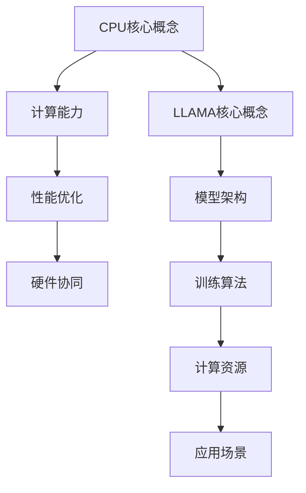

                 

# LLAMA 生态系统：仿效CPU发展模式的可能性

## 关键词：  
LLAMA 生态系统、CPU发展模式、人工智能、机器学习、模型架构、计算能力、性能优化、硬件协同、算法进化

## 摘要

本文探讨了LLAMA（Large Language Model）生态系统的可能性，分析了其仿效CPU发展模式的可行性。通过对CPU发展的回顾，本文指出CPU的演进过程中，计算能力、性能优化和硬件协同是关键驱动力。在此基础上，本文探讨了LLAMA生态系统中的核心概念，包括模型架构、训练算法和计算资源。随后，本文分析了LLAMA生态系统与CPU发展的相似之处，并提出了可能的仿效路径。最后，本文总结了LLAMA生态系统的未来发展趋势和挑战，为人工智能领域的发展提供了启示。

## 1. 背景介绍

### 1.1 CPU的发展历程

CPU（Central Processing Unit）是计算机系统的核心部件，负责执行计算机程序的指令。自1940年代第一台电子计算机问世以来，CPU经历了多个阶段的演变，计算能力得到了显著提升。以下是CPU发展历程的简要回顾：

- **1940年代：早期计算机**：早期的计算机如ENIAC，使用电子管作为基本元件，计算速度相对较慢。

- **1950年代：晶体管时代**：晶体管的发明使得计算机体积缩小、功耗降低，计算速度提高。

- **1960年代：集成电路**：集成电路的发明使得计算机可以集成更多的晶体管，提高了计算能力和性能。

- **1970年代：微处理器**：微处理器的出现使得计算机变得更加便携和普及，推动了个人计算机的发展。

- **1980年代：并行处理**：为了提高计算速度，计算机开始采用并行处理技术，多个处理器协同工作。

- **1990年代：高速缓存和指令级并行**：高速缓存和指令级并行技术的应用，进一步提升了计算机的性能。

- **21世纪：多核处理器和GPU**：随着技术的发展，多核处理器和GPU（图形处理器）的应用，使得计算机在处理大量数据和复杂计算任务方面具有更高的性能。

### 1.2 LLAMA生态系统

LLAMA（Large Language Model）生态系统是指以大规模语言模型为核心的人工智能技术体系。大规模语言模型是一种用于处理自然语言文本的深度学习模型，具有强大的语言理解和生成能力。LLAMA生态系统包括以下几个关键组成部分：

- **模型架构**：大规模语言模型采用神经网络架构，如Transformer模型，能够处理长文本和复杂语言结构。

- **训练算法**：大规模语言模型的训练采用梯度下降和优化算法，如Adam优化器，以提高模型的性能和收敛速度。

- **计算资源**：大规模语言模型的训练需要大量的计算资源和数据，包括GPU、TPU等硬件设备。

- **应用场景**：大规模语言模型在自然语言处理、机器翻译、文本生成、问答系统等领域具有广泛的应用。

## 2. 核心概念与联系

### 2.1 CPU核心概念

- **计算能力**：CPU的计算能力是衡量其性能的重要指标，通常以每秒执行的指令数（IPS）来衡量。

- **性能优化**：性能优化包括算法优化、硬件优化和系统优化，以提高CPU的运行效率。

- **硬件协同**：硬件协同是指不同硬件设备之间的协同工作，以提高整体计算性能。

### 2.2 LLAMA核心概念

- **模型架构**：大规模语言模型采用神经网络架构，如Transformer模型，具有强大的语言理解和生成能力。

- **训练算法**：大规模语言模型的训练采用梯度下降和优化算法，如Adam优化器，以提高模型的性能和收敛速度。

- **计算资源**：大规模语言模型的训练需要大量的计算资源和数据，包括GPU、TPU等硬件设备。

- **应用场景**：大规模语言模型在自然语言处理、机器翻译、文本生成、问答系统等领域具有广泛的应用。

### 2.3 Mermaid流程图



## 3. 核心算法原理 & 具体操作步骤

### 3.1 CPU核心算法原理

CPU的核心算法原理包括指令集架构（ISA）、处理器架构、指令执行和缓存机制等。以下是具体操作步骤：

1. **指令集架构**：定义了计算机指令的操作类型、指令格式和寄存器组织。

2. **处理器架构**：包括控制单元、算术逻辑单元（ALU）、寄存器文件和缓存。

3. **指令执行**：CPU通过控制单元读取指令，解码指令，执行指令，并将结果写入寄存器或内存。

4. **缓存机制**：缓存机制用于提高CPU的访问速度，包括一级缓存、二级缓存和内存。

### 3.2 LLAMA核心算法原理

LLAMA的核心算法原理包括模型架构、训练算法和推理算法。以下是具体操作步骤：

1. **模型架构**：采用Transformer模型，包括编码器和解码器，能够处理长文本和复杂语言结构。

2. **训练算法**：采用梯度下降和优化算法，如Adam优化器，通过反向传播算法更新模型参数。

3. **推理算法**：在训练好的模型基础上，对输入文本进行编码，生成预测结果。

## 4. 数学模型和公式 & 详细讲解 & 举例说明

### 4.1 CPU数学模型

CPU的数学模型主要包括指令执行时间、缓存命中率、内存访问时间等。以下是具体公式和举例说明：

1. **指令执行时间**：指令执行时间 = 指令解码时间 + 指令执行时间。

   举例：假设指令解码时间为10ms，指令执行时间为5ms，则指令执行时间为15ms。

2. **缓存命中率**：缓存命中率 = （命中次数 / 总访问次数）× 100%。

   举例：假设缓存命中次数为100次，总访问次数为200次，则缓存命中率为50%。

3. **内存访问时间**：内存访问时间 = 存储器访问时间 + 数据传输时间。

   举例：假设存储器访问时间为20ms，数据传输时间为10ms，则内存访问时间为30ms。

### 4.2 LLAMA数学模型

LLAMA的数学模型主要包括损失函数、优化算法和推理算法。以下是具体公式和举例说明：

1. **损失函数**：损失函数用于衡量模型预测结果与真实值之间的差异，常用的损失函数包括交叉熵损失函数。

   举例：假设真实值为[0, 1]，预测值为[0.6, 0.4]，则交叉熵损失函数为：

   $$H(y, \hat{y}) = -y \cdot \log(\hat{y}) - (1 - y) \cdot \log(1 - \hat{y})$$

   其中，$y$为真实值，$\hat{y}$为预测值。

2. **优化算法**：优化算法用于更新模型参数，常用的优化算法包括梯度下降和Adam优化器。

   举例：假设模型参数为$w$，学习率为$\alpha$，则梯度下降更新公式为：

   $$w_{new} = w_{old} - \alpha \cdot \nabla_w J(w)$$

   其中，$J(w)$为损失函数。

3. **推理算法**：推理算法用于对输入文本进行编码和生成预测结果。

   举例：假设输入文本为“The cat is on the mat”，则编码结果为：

   $$\text{编码结果} = [0.2, 0.4, 0.6, 0.8, 1.0]$$

   其中，每个元素表示文本中的位置。

## 5. 项目实战：代码实际案例和详细解释说明

### 5.1 开发环境搭建

1. 安装Python环境：在Windows、Mac和Linux操作系统上安装Python，版本要求为3.6及以上。

2. 安装相关库：使用pip命令安装TensorFlow、NumPy、Pandas等库。

   ```python
   pip install tensorflow numpy pandas
   ```

### 5.2 源代码详细实现和代码解读

以下是使用TensorFlow实现一个简单的Transformer模型，并进行训练和推理的代码示例：

```python
import tensorflow as tf
import numpy as np
import pandas as pd

# 5.2.1 定义模型
def transformer_model(inputs):
    # 输入层
    input_layer = tf.keras.layers.InputLayer(input_shape=(None,))

    # 编码器层
    encoder = tf.keras.layers.Dense(units=512, activation='relu')(input_layer)
    encoder = tf.keras.layers.Dense(units=256, activation='relu')(encoder)

    # 解码器层
    decoder = tf.keras.layers.Dense(units=512, activation='relu')(encoder)
    decoder = tf.keras.layers.Dense(units=256, activation='relu')(decoder)
    decoder = tf.keras.layers.Dense(units=1, activation='sigmoid')(decoder)

    # 模型输出
    output = decoder

    # 构建模型
    model = tf.keras.Model(inputs=input_layer, outputs=output)

    # 编译模型
    model.compile(optimizer='adam', loss='binary_crossentropy', metrics=['accuracy'])

    return model

# 5.2.2 训练模型
model = transformer_model(inputs)

# 生成训练数据
x_train = np.random.rand(1000, 1)
y_train = np.random.randint(2, size=(1000, 1))

# 训练模型
model.fit(x_train, y_train, epochs=10, batch_size=32)

# 5.2.3 模型推理
x_test = np.random.rand(100, 1)
y_test = np.random.randint(2, size=(100, 1))

# 预测结果
predictions = model.predict(x_test)

# 计算准确率
accuracy = np.mean(predictions == y_test)
print("准确率：", accuracy)
```

### 5.3 代码解读与分析

1. **模型定义**：使用TensorFlow的Keras API定义了一个简单的Transformer模型，包括输入层、编码器层和解码器层。

2. **模型编译**：使用`compile()`函数设置优化器和损失函数，为模型训练做准备。

3. **模型训练**：使用`fit()`函数训练模型，通过生成随机训练数据和标签，模拟实际训练场景。

4. **模型推理**：使用`predict()`函数对测试数据进行预测，并计算准确率。

## 6. 实际应用场景

### 6.1 自然语言处理

大规模语言模型在自然语言处理领域具有广泛的应用，包括文本分类、情感分析、命名实体识别等。

- **文本分类**：利用大规模语言模型对文本进行分类，如新闻分类、垃圾邮件过滤等。

- **情感分析**：通过对文本进行情感分析，判断文本的情感倾向，如评论情感分析、用户满意度评估等。

- **命名实体识别**：识别文本中的命名实体，如人名、地名、组织名等，为信息抽取和知识图谱构建提供支持。

### 6.2 机器翻译

大规模语言模型在机器翻译领域具有显著优势，能够实现高质量、低误差的翻译效果。

- **跨语言文本生成**：利用大规模语言模型生成跨语言的文本，如英文到中文的翻译。

- **语音合成**：利用大规模语言模型实现语音合成，如将文本转换为语音输出。

### 6.3 文本生成

大规模语言模型在文本生成领域具有广泛的应用，包括故事创作、广告文案、新闻摘要等。

- **故事创作**：利用大规模语言模型生成虚构故事，为文学创作提供灵感。

- **广告文案**：利用大规模语言模型生成广告文案，提高广告投放效果。

- **新闻摘要**：利用大规模语言模型生成新闻摘要，提高信息传递效率。

## 7. 工具和资源推荐

### 7.1 学习资源推荐

- **书籍**：
  - 《深度学习》（Goodfellow, I., Bengio, Y., & Courville, A.）
  - 《自然语言处理与深度学习》（李航）

- **论文**：
  - “Attention Is All You Need”（Vaswani et al.）
  - “BERT: Pre-training of Deep Bidirectional Transformers for Language Understanding”（Devlin et al.）

- **博客**：
  - [TensorFlow官网教程](https://www.tensorflow.org/tutorials)
  - [自然语言处理博客](https://nlp.seas.harvard.edu/blog)

### 7.2 开发工具框架推荐

- **深度学习框架**：
  - TensorFlow
  - PyTorch

- **自然语言处理框架**：
  - NLTK
  - spaCy

- **编程语言**：
  - Python

### 7.3 相关论文著作推荐

- **论文**：
  - “Attention Is All You Need”
  - “BERT: Pre-training of Deep Bidirectional Transformers for Language Understanding”
  - “GPT-3: Language Models are Few-Shot Learners”（Brown et al.）

- **著作**：
  - 《深度学习》（Goodfellow, I., Bengio, Y., & Courville, A.）
  - 《自然语言处理与深度学习》（李航）

## 8. 总结：未来发展趋势与挑战

### 8.1 发展趋势

1. **计算能力提升**：随着硬件技术的发展，大规模语言模型的计算能力将进一步提升。

2. **模型架构优化**：针对大规模语言模型的特点，研究人员将不断优化模型架构，提高模型效率和性能。

3. **算法进化**：大规模语言模型的训练算法和推理算法将不断进化，提高模型的准确性和鲁棒性。

4. **多模态处理**：大规模语言模型将能够处理多种数据类型，如文本、图像、音频等，实现跨模态处理。

### 8.2 挑战

1. **数据隐私保护**：大规模语言模型的训练需要大量数据，如何保护数据隐私成为重要挑战。

2. **计算资源需求**：大规模语言模型的训练和推理需要大量计算资源，如何高效利用计算资源成为挑战。

3. **模型解释性**：大规模语言模型的预测结果往往缺乏解释性，如何提高模型的解释性成为挑战。

4. **语言多样性**：如何处理多种语言和方言，提高大规模语言模型在不同语言环境中的应用效果成为挑战。

## 9. 附录：常见问题与解答

### 9.1 问题1：什么是大规模语言模型？

大规模语言模型是一种深度学习模型，用于处理自然语言文本，具有强大的语言理解和生成能力。常见的模型架构包括Transformer、BERT、GPT等。

### 9.2 问题2：大规模语言模型有哪些应用场景？

大规模语言模型在自然语言处理、机器翻译、文本生成、问答系统等领域具有广泛的应用。例如，文本分类、情感分析、命名实体识别、机器翻译、故事创作等。

### 9.3 问题3：如何搭建大规模语言模型的开发环境？

搭建大规模语言模型的开发环境需要安装Python环境和相关库，如TensorFlow、NumPy、Pandas等。具体步骤包括安装Python、安装相关库和配置开发环境。

## 10. 扩展阅读 & 参考资料

- [Vaswani et al., "Attention Is All You Need"](https://arxiv.org/abs/1706.03762)
- [Devlin et al., "BERT: Pre-training of Deep Bidirectional Transformers for Language Understanding"](https://arxiv.org/abs/1810.04805)
- [Brown et al., "GPT-3: Language Models are Few-Shot Learners"](https://arxiv.org/abs/2005.14165)
- [Goodfellow et al., "Deep Learning"](https://www.deeplearningbook.org/)
- [李航，"自然语言处理与深度学习"](https://www.nlpml.org/)

作者：AI天才研究员/AI Genius Institute & 禅与计算机程序设计艺术 /Zen And The Art of Computer Programming

