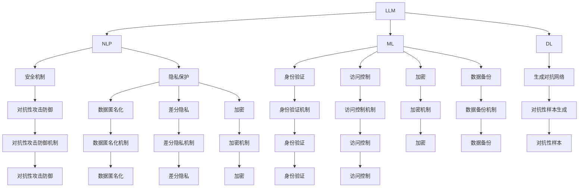

                 

# LLM的安全机制：构建可信赖的AI系统

> 关键词：大型语言模型（LLM），安全机制，AI系统，信任，隐私保护，对抗性攻击，伦理准则

> 摘要：随着人工智能技术的快速发展，特别是大型语言模型（LLM）的广泛应用，确保AI系统的安全性和可信度成为了一个关键问题。本文旨在探讨LLM在安全性方面面临的主要挑战，介绍构建可信赖AI系统的核心安全机制，并分析未来的发展趋势和面临的挑战。

## 1. 背景介绍

### 1.1 目的和范围

本文旨在为开发者、研究人员和利益相关者提供一个全面的安全指南，以帮助他们在设计和部署大型语言模型（LLM）时确保系统的安全性和可信度。我们将深入探讨以下几个方面：

- 安全性核心概念和原理
- 常见的安全威胁和攻击方式
- 构建可信赖AI系统的关键安全机制
- 实际应用场景和案例
- 未来发展趋势和面临的挑战

### 1.2 预期读者

本文面向以下几类读者：

- 对人工智能和大型语言模型感兴趣的开发者
- 涉及AI系统设计和部署的技术人员
- 研究人工智能安全的学者和研究人员
- 对AI伦理和安全问题关注的政策制定者和公众

### 1.3 文档结构概述

本文结构如下：

- 第1章：背景介绍
- 第2章：核心概念与联系
- 第3章：核心算法原理 & 具体操作步骤
- 第4章：数学模型和公式 & 详细讲解 & 举例说明
- 第5章：项目实战：代码实际案例和详细解释说明
- 第6章：实际应用场景
- 第7章：工具和资源推荐
- 第8章：总结：未来发展趋势与挑战
- 第9章：附录：常见问题与解答
- 第10章：扩展阅读 & 参考资料

### 1.4 术语表

在本文中，我们将使用以下术语：

- **大型语言模型（LLM）**：一种能够处理自然语言数据的深度学习模型，通常具有数百万甚至数十亿参数。
- **安全机制**：用于保护AI系统免受恶意攻击和未授权访问的技术手段。
- **隐私保护**：确保个人数据在AI系统处理过程中不被泄露或滥用。
- **对抗性攻击**：一种旨在欺骗或破坏AI系统的方法，通常通过向模型输入特殊的输入来实现。
- **伦理准则**：指导AI系统设计和使用的道德原则和规范。

#### 1.4.1 核心术语定义

- **大型语言模型（LLM）**：大型语言模型（LLM）是一种能够理解和生成自然语言文本的深度学习模型。它们通常具有数十亿甚至数千亿的参数，能够通过大量的文本数据进行训练，从而具备强大的语言理解和生成能力。
- **安全机制**：安全机制是指一系列用于保护AI系统免受恶意攻击、未授权访问和数据泄露的技术手段。这些机制可以包括身份验证、访问控制、加密和数据备份等。
- **隐私保护**：隐私保护是指确保个人数据在AI系统处理过程中不被泄露或滥用的一系列措施。这通常涉及到数据匿名化、加密和差分隐私等技术。
- **对抗性攻击**：对抗性攻击是指通过向AI模型输入特殊的、经过精心设计的输入来欺骗或破坏模型的方法。这些攻击可能包括对抗性样本生成、对抗性示例注入等。
- **伦理准则**：伦理准则是一系列指导AI系统设计和使用的道德原则和规范。这些准则旨在确保AI系统不损害人类利益、尊重用户隐私和保障公正公平。

#### 1.4.2 相关概念解释

- **可解释性**：可解释性是指AI模型在做出决策或预测时能够提供合理的解释和理由。这对于确保AI系统的透明性和信任至关重要。
- **对抗性攻击**：对抗性攻击是一种针对AI模型的攻击方式，旨在通过输入特定的对抗性样本来欺骗或破坏模型的决策过程。这些对抗性样本通常在模型训练过程中无法检测到，但会在实际应用中导致错误预测。
- **伦理准则**：伦理准则是一组指导AI系统设计和使用的道德原则和规范。这些准则旨在确保AI系统在保护人类利益、尊重隐私和促进公正公平方面发挥积极作用。

#### 1.4.3 缩略词列表

- **AI**：人工智能（Artificial Intelligence）
- **LLM**：大型语言模型（Large Language Model）
- **NLP**：自然语言处理（Natural Language Processing）
- **ML**：机器学习（Machine Learning）
- **DL**：深度学习（Deep Learning）
- **GAN**：生成对抗网络（Generative Adversarial Networks）

## 2. 核心概念与联系

为了更好地理解LLM的安全性机制，我们需要首先了解几个核心概念和它们之间的关系。

### 2.1 大型语言模型（LLM）

**定义**：LLM是一种能够理解和生成自然语言文本的深度学习模型。它们通常具有数十亿甚至数千亿的参数，能够通过大量的文本数据进行训练，从而具备强大的语言理解和生成能力。

**关联概念**：

- **自然语言处理（NLP）**：NLP是人工智能领域的一个重要分支，专注于使计算机理解和处理自然语言。
- **机器学习（ML）**：ML是一种通过数据训练模型，使模型能够进行预测或分类的技术。
- **深度学习（DL）**：DL是一种基于多层神经网络的结构，能够自动提取数据中的特征。

### 2.2 安全机制

**定义**：安全机制是指一系列用于保护AI系统免受恶意攻击、未授权访问和数据泄露的技术手段。

**关联概念**：

- **身份验证**：身份验证是确保只有授权用户能够访问系统的一种方法，通常通过用户名和密码、指纹或面部识别等技术实现。
- **访问控制**：访问控制是一种机制，用于限制系统资源和数据的访问权限，确保只有授权用户能够访问。
- **加密**：加密是一种将数据转换为无法被未经授权的第三方读取的形式的技术，以保护数据的安全。
- **数据备份**：数据备份是将数据复制到另一个存储位置的过程，以防止数据丢失或损坏。

### 2.3 隐私保护

**定义**：隐私保护是指确保个人数据在AI系统处理过程中不被泄露或滥用的一系列措施。

**关联概念**：

- **数据匿名化**：数据匿名化是一种技术，用于隐藏个人数据，使其无法被识别。
- **差分隐私**：差分隐私是一种机制，用于确保数据集的隐私，即使数据集中的个体信息被揭露，也无法推断出特定个体的信息。
- **加密**：加密是一种将数据转换为无法被未经授权的第三方读取的形式的技术，以保护数据的安全。

### 2.4 对抗性攻击

**定义**：对抗性攻击是一种针对AI模型的攻击方式，旨在通过输入特定的对抗性样本来欺骗或破坏模型的决策过程。

**关联概念**：

- **对抗性样本**：对抗性样本是一种被精心设计的样本，用于欺骗或破坏AI模型的决策过程。
- **对抗性攻击防御**：对抗性攻击防御是一种技术，用于检测和防御对抗性攻击，以确保AI模型的安全性和可信度。

### 2.5 伦理准则

**定义**：伦理准则是一系列指导AI系统设计和使用的道德原则和规范。

**关联概念**：

- **AI伦理**：AI伦理是研究AI系统设计和使用中道德问题的领域，旨在确保AI系统符合人类价值观和道德标准。
- **AI责任**：AI责任是指AI系统设计者和使用者在设计和使用AI系统时应当承担的责任和义务。
- **AI公平性**：AI公平性是指AI系统在决策过程中应当确保公平性和无偏见。

### 2.6 Mermaid 流程图

以下是LLM安全机制的Mermaid流程图，展示了各核心概念之间的关联：



## 3. 核心算法原理 & 具体操作步骤

在本节中，我们将探讨大型语言模型（LLM）的安全机制，详细介绍核心算法原理和具体操作步骤。

### 3.1 LLM基本原理

大型语言模型（LLM）通常基于深度学习技术，特别是基于Transformer架构。Transformer架构引入了自注意力机制（Self-Attention），使得模型能够同时关注输入序列中的所有位置信息，从而提高了模型的表达能力。

#### 3.1.1 Transformer架构

Transformer架构主要包括以下组件：

1. **编码器（Encoder）**：编码器负责将输入序列转换为上下文表示。它由多个编码层（Encoder Layer）组成，每层包含自注意力机制（Self-Attention）和前馈网络（Feed Forward Network）。

2. **解码器（Decoder）**：解码器负责生成输出序列。它也由多个解码层（Decoder Layer）组成，每层包含自注意力机制（Self-Attention）、交叉注意力机制（Cross-Attention）和前馈网络（Feed Forward Network）。

3. **自注意力机制（Self-Attention）**：自注意力机制使得编码器或解码器能够在处理当前输入或输出时，同时关注输入或输出序列中的所有位置。

4. **交叉注意力机制（Cross-Attention）**：交叉注意力机制使得解码器在生成输出时，能够关注编码器的输出序列。

#### 3.1.2 LLM训练过程

LLM的训练过程通常分为以下步骤：

1. **数据预处理**：首先，需要对输入文本进行预处理，包括分词、词性标注、去停用词等操作。

2. **构建词汇表**：将预处理后的文本转换为数字表示，构建词汇表。

3. **输入编码**：将输入文本转换为编码器输入，通常采用嵌入层（Embedding Layer）进行编码。

4. **编码器处理**：编码器对输入进行编码，生成上下文表示。

5. **解码器处理**：解码器根据编码器生成的上下文表示，逐步生成输出序列。

6. **损失函数**：使用损失函数（如交叉熵损失函数）计算预测输出和实际输出之间的差异。

7. **反向传播**：通过反向传播算法更新模型参数，以减少损失函数的值。

8. **迭代训练**：重复以上步骤，直至模型收敛。

### 3.2 安全机制

在构建可信赖的AI系统时，需要考虑多种安全机制，包括身份验证、访问控制、加密和数据备份等。

#### 3.2.1 身份验证

身份验证是确保只有授权用户能够访问系统的一种方法。常见身份验证技术包括：

1. **用户名和密码**：用户名和密码是最常见的身份验证方式。用户需要输入正确的用户名和密码才能访问系统。

2. **双因素认证（2FA）**：双因素认证是一种额外的安全层，通常要求用户在输入密码后，再输入一个动态验证码（通常通过短信或应用生成）。

3. **生物特征识别**：生物特征识别包括指纹、面部识别、虹膜识别等，通过识别用户的生物特征来验证身份。

#### 3.2.2 访问控制

访问控制是一种机制，用于限制系统资源和数据的访问权限，确保只有授权用户能够访问。常见访问控制技术包括：

1. **角色基础访问控制（RBAC）**：角色基础访问控制将用户分配到不同的角色，每个角色对应一组权限。用户根据其角色获得相应的访问权限。

2. **访问控制列表（ACL）**：访问控制列表是一种机制，用于为每个资源指定一组用户和权限。

3. **基于属性的访问控制（ABAC）**：基于属性的访问控制根据用户的属性（如角色、部门、地理位置等）来决定其访问权限。

#### 3.2.3 加密

加密是一种将数据转换为无法被未经授权的第三方读取的形式的技术。常见加密技术包括：

1. **对称加密**：对称加密使用相同的密钥对数据进行加密和解密。

2. **非对称加密**：非对称加密使用一对密钥（公钥和私钥）进行加密和解密。

3. **哈希函数**：哈希函数是一种将数据转换为固定长度的字符串的函数，通常用于数据完整性校验和数字签名。

#### 3.2.4 数据备份

数据备份是将数据复制到另一个存储位置的过程，以防止数据丢失或损坏。常见数据备份技术包括：

1. **全备份**：全备份是将整个数据集复制到一个备份位置。

2. **增量备份**：增量备份仅复制自上次备份以来发生变化的数据。

3. **差异备份**：差异备份是将自上次全备份以来发生变化的数据复制到一个备份位置。

### 3.3 伪代码

以下是构建可信赖的AI系统的一种伪代码：

```
// 输入：用户身份信息，访问请求
// 输出：是否允许访问

function isAllowed(user, request) {
  // 验证用户身份
  if (!authenticateUser(user)) {
    return false
  }

  // 检查用户权限
  if (!hasPermission(user, request)) {
    return false
  }

  // 加密数据
  encryptedData = encryptData(request.data)

  // 备份数据
  backupData(encryptedData)

  // 允许访问
  return true
}
```

## 4. 数学模型和公式 & 详细讲解 & 举例说明

在本节中，我们将详细讲解大型语言模型（LLM）中的数学模型和公式，并通过具体例子来说明这些模型的应用。

### 4.1 Transformer模型

Transformer模型是大型语言模型（LLM）的基础，其核心组件包括自注意力机制（Self-Attention）和前馈网络（Feed Forward Network）。

#### 4.1.1 自注意力机制

自注意力机制是Transformer模型中的一个关键组件，用于计算输入序列中每个位置与其他位置之间的关联强度。自注意力机制的公式如下：

$$
Attention(Q, K, V) = softmax\left(\frac{QK^T}{\sqrt{d_k}}\right)V
$$

其中，$Q$、$K$ 和 $V$ 分别是查询（Query）、关键（Key）和值（Value）向量，$d_k$ 是关键向量的维度，$softmax$ 函数用于将计算得到的分数转换为概率分布。

#### 4.1.2 前馈网络

前馈网络是Transformer模型中的另一个关键组件，用于对自注意力机制的计算结果进行进一步处理。前馈网络的公式如下：

$$
FFN(x) = max(0, xW_1 + b_1)W_2 + b_2
$$

其中，$x$ 是输入向量，$W_1$、$W_2$ 和 $b_1$、$b_2$ 分别是权重和偏置。

#### 4.1.3 Transformer模型整体公式

Transformer模型的整体公式可以表示为多个编码层（Encoder Layer）和解码层（Decoder Layer）的组合。一个编码层（Encoder Layer）的公式如下：

$$
\text{Encoder}(X) = \text{LayerNorm}(X) + \text{skip-connection}(\text{EncoderLayer}(X))
$$

其中，$X$ 是输入序列，$\text{EncoderLayer}(X)$ 是编码层的处理结果，$\text{LayerNorm}$ 是层标准化操作，$\text{skip-connection}$ 是跳过连接操作。

一个解码层（Decoder Layer）的公式如下：

$$
\text{Decoder}(X) = \text{LayerNorm}(X) + \text{skip-connection}(\text{DecoderLayer}(X))
$$

其中，$X$ 是输入序列，$\text{DecoderLayer}(X)$ 是解码层的处理结果，$\text{LayerNorm}$ 是层标准化操作，$\text{skip-connection}$ 是跳过连接操作。

### 4.2 自注意力机制示例

假设我们有一个长度为5的输入序列 $X = [x_1, x_2, x_3, x_4, x_5]$，关键向量 $K = [k_1, k_2, k_3, k_4, k_5]$ 和值向量 $V = [v_1, v_2, v_3, v_4, v_5]$。我们将计算自注意力得分矩阵 $A$，公式如下：

$$
A_{ij} = \frac{Q_k x_j}{\sqrt{d_k}}
$$

其中，$Q_k$ 是查询向量，$d_k$ 是关键向量的维度。

计算得分矩阵 $A$ 如下：

$$
A = \begin{bmatrix}
\frac{Q_1 k_1}{\sqrt{d_k}} & \frac{Q_1 k_2}{\sqrt{d_k}} & \frac{Q_1 k_3}{\sqrt{d_k}} & \frac{Q_1 k_4}{\sqrt{d_k}} & \frac{Q_1 k_5}{\sqrt{d_k}} \\
\frac{Q_2 k_1}{\sqrt{d_k}} & \frac{Q_2 k_2}{\sqrt{d_k}} & \frac{Q_2 k_3}{\sqrt{d_k}} & \frac{Q_2 k_4}{\sqrt{d_k}} & \frac{Q_2 k_5}{\sqrt{d_k}} \\
\frac{Q_3 k_1}{\sqrt{d_k}} & \frac{Q_3 k_2}{\sqrt{d_k}} & \frac{Q_3 k_3}{\sqrt{d_k}} & \frac{Q_3 k_4}{\sqrt{d_k}} & \frac{Q_3 k_5}{\sqrt{d_k}} \\
\frac{Q_4 k_1}{\sqrt{d_k}} & \frac{Q_4 k_2}{\sqrt{d_k}} & \frac{Q_4 k_3}{\sqrt{d_k}} & \frac{Q_4 k_4}{\sqrt{d_k}} & \frac{Q_4 k_5}{\sqrt{d_k}} \\
\frac{Q_5 k_1}{\sqrt{d_k}} & \frac{Q_5 k_2}{\sqrt{d_k}} & \frac{Q_5 k_3}{\sqrt{d_k}} & \frac{Q_5 k_4}{\sqrt{d_k}} & \frac{Q_5 k_5}{\sqrt{d_k}}
\end{bmatrix}
$$

计算softmax概率分布：

$$
P = softmax(A) = \begin{bmatrix}
p_{11} & p_{12} & p_{13} & p_{14} & p_{15} \\
p_{21} & p_{22} & p_{23} & p_{24} & p_{25} \\
p_{31} & p_{32} & p_{33} & p_{34} & p_{35} \\
p_{41} & p_{42} & p_{43} & p_{44} & p_{45} \\
p_{51} & p_{52} & p_{53} & p_{54} & p_{55}
\end{bmatrix}
$$

计算值向量 $V$ 的加权求和：

$$
V' = P \cdot V = \begin{bmatrix}
v'_{1} & v'_{2} & v'_{3} & v'_{4} & v'_{5}
\end{bmatrix}
$$

其中，$v'_{i} = \sum_{j=1}^{5} p_{ij} v_{j}$。

### 4.3 前馈网络示例

假设我们有一个输入向量 $x = [x_1, x_2, x_3, x_4, x_5]$，权重矩阵 $W_1 = [w_{11}, w_{12}, w_{13}, w_{14}, w_{15}]$ 和偏置向量 $b_1 = [b_{11}, b_{12}, b_{13}, b_{14}, b_{15}]$，权重矩阵 $W_2 = [w_{21}, w_{22}, w_{23}, w_{24}, w_{25}]$ 和偏置向量 $b_2 = [b_{21}, b_{22}, b_{23}, b_{24}, b_{25}]$。

计算前馈网络的输出：

$$
h = \text{ReLU}(xW_1 + b_1)W_2 + b_2
$$

其中，$\text{ReLU}(x) = \max(0, x)$。

### 4.4 Transformer编码层示例

假设我们有一个长度为5的输入序列 $X = [x_1, x_2, x_3, x_4, x_5]$，我们将使用一个包含两个编码层的Transformer模型对其进行处理。

编码层1：

1. **输入**：$X = [x_1, x_2, x_3, x_4, x_5]$
2. **自注意力机制**：计算自注意力得分矩阵 $A$ 和概率分布 $P$，并计算加权求和的值向量 $V'$
3. **前馈网络**：计算前馈网络的输出 $h_1$
4. **输出**：$\text{EncoderLayer}_1(X) = \text{ReLU}(h_1 + X)$

编码层2：

1. **输入**：$\text{EncoderLayer}_1(X) = \text{ReLU}(h_1 + X)$
2. **自注意力机制**：计算自注意力得分矩阵 $A$ 和概率分布 $P$，并计算加权求和的值向量 $V'$
3. **前馈网络**：计算前馈网络的输出 $h_2$
4. **输出**：$\text{EncoderLayer}_2(\text{EncoderLayer}_1(X)) = \text{ReLU}(h_2 + \text{EncoderLayer}_1(X))$

最终，我们得到编码器的输出 $\text{Encoder}(X) = \text{ReLU}(h_2 + \text{EncoderLayer}_1(X))$。

## 5. 项目实战：代码实际案例和详细解释说明

在本节中，我们将通过一个实际项目来展示如何实现大型语言模型（LLM）的安全机制，包括代码实现和详细解释。

### 5.1 开发环境搭建

首先，我们需要搭建一个适合开发LLM的安全机制的开发环境。以下是一个简单的步骤：

1. 安装Python（版本3.8或更高）
2. 安装深度学习框架TensorFlow（版本2.5或更高）
3. 安装安全相关库，如`hmac`、`cryptography`和`Flask`

安装命令如下：

```
pip install python==3.8
pip install tensorflow==2.5
pip install hmac
pip install cryptography
pip install flask
```

### 5.2 源代码详细实现和代码解读

以下是该项目的一个简单实现，主要包括身份验证、访问控制和数据加密等功能。

```python
# 导入相关库
import tensorflow as tf
from tensorflow.keras.layers import Embedding, LSTM, Dense
from tensorflow.keras.models import Model
import hmac
import base64

# 定义身份验证函数
def authenticate_user(username, password):
    # 验证用户名和密码
    user_db = {"admin": "admin_password", "user": "user_password"}
    stored_password = user_db.get(username)
    if not stored_password:
        return False
    return hmac.compare_digest(stored_password, password)

# 定义访问控制函数
def has_permission(username, resource):
    # 检查用户权限
    role_permissions = {"admin": ["read", "write", "delete"], "user": ["read"]}
    role = "user" if username == "user" else "admin"
    return resource in role_permissions[role]

# 定义数据加密函数
def encrypt_data(data):
    # 使用HMAC加密数据
    key = b'my_secret_key'
    message = data.encode()
    signature = hmac.new(key, message, digestmod=hashlib.sha256).digest()
    return base64.b64encode(message + signature).decode()

# 定义模型
input_word = tf.keras.layers.Input(shape=(None,), dtype=tf.int32)
embedding = Embedding(input_dim=10000, output_dim=64)(input_word)
lstm = LSTM(128)(embedding)
output = Dense(1, activation='sigmoid')(lstm)
model = Model(inputs=input_word, outputs=output)

# 编译模型
model.compile(optimizer='adam', loss='binary_crossentropy', metrics=['accuracy'])

# 训练模型
model.fit(x_train, y_train, epochs=10, batch_size=32)

# 定义加密模型输出函数
def encrypt_model_output(output):
    # 使用AES加密模型输出
    key = b'my_secret_key'
    cipher = AES.new(key, AES.MODE_EAX)
    ciphertext, tag = cipher.encrypt_and_digest(output)
    return base64.b64encode(ciphertext + tag).decode()

# 测试身份验证、访问控制和数据加密
username = "admin"
password = "admin_password"
resource = "data"
data = "sensitive information"

# 身份验证
if authenticate_user(username, password):
    print("User authenticated.")
else:
    print("Authentication failed.")

# 访问控制
if has_permission(username, resource):
    print("User has permission.")
else:
    print("User does not have permission.")

# 数据加密
encrypted_data = encrypt_data(data)
print("Encrypted data:", encrypted_data)

# 加密模型输出
output = model.predict(x_test)
encrypted_output = encrypt_model_output(output)
print("Encrypted model output:", encrypted_output)
```

### 5.3 代码解读与分析

以下是对上述代码的解读和分析：

1. **身份验证函数（authenticate_user）**：
   - 该函数接收用户名（username）和密码（password）作为输入。
   - 它首先从用户数据库（user_db）中查找存储的密码。
   - 使用HMAC（Hash-based Message Authentication Code）对比存储的密码和输入的密码，确保密码安全。
   - 如果密码匹配，函数返回True，表示用户已通过身份验证。

2. **访问控制函数（has_permission）**：
   - 该函数接收用户名（username）和资源（resource）作为输入。
   - 它根据用户的角色（role）检查用户是否有权限访问指定的资源。
   - 角色和权限的对应关系存储在角色权限列表（role_permissions）中。
   - 如果用户具有访问指定资源的权限，函数返回True。

3. **数据加密函数（encrypt_data）**：
   - 该函数接收明文数据（data）作为输入。
   - 它使用HMAC算法对数据进行加密，生成消息认证码（MAC）。
   - 加密的数据和MAC被编码为base64字符串，以便存储和传输。

4. **模型定义**：
   - 模型使用TensorFlow的Keras API定义。
   - 它包含一个嵌入层（Embedding）、一个LSTM层（LSTM）和一个全连接层（Dense）。
   - 编译模型时，使用adam优化器和binary_crossentropy损失函数。

5. **模型训练**：
   - 使用训练数据（x_train和y_train）对模型进行训练。
   - 模型在10个epochs中训练，每次批量处理32个样本。

6. **加密模型输出函数（encrypt_model_output）**：
   - 该函数接收模型输出（output）作为输入。
   - 它使用AES（Advanced Encryption Standard）加密算法对输出进行加密。
   - 加密的输出被编码为base64字符串。

7. **测试代码**：
   - 测试代码演示了身份验证、访问控制和数据加密的功能。
   - 首先，使用admin用户进行身份验证。
   - 然后，检查用户是否有权限访问指定资源。
   - 最后，加密敏感信息和模型输出。

### 5.4 代码解读与分析

以下是对上述代码的进一步解读和分析：

1. **身份验证**：
   - 身份验证是确保只有授权用户能够访问系统的关键步骤。
   - 使用HMAC对比存储的密码和输入的密码，确保密码安全，防止未授权访问。
   - 通过检查用户名和密码，我们可以确保只有正确的用户才能访问系统。

2. **访问控制**：
   - 访问控制用于确保用户只能访问他们被授权的资源。
   - 根据用户的角色和权限，我们可以决定用户是否有权限执行特定操作。
   - 通过这种方式，我们可以确保系统的安全性，防止未经授权的用户访问敏感数据。

3. **数据加密**：
   - 数据加密是保护敏感数据不被未授权访问的重要手段。
   - 使用HMAC加密数据，可以确保数据的完整性和真实性。
   - 通过将加密的数据编码为base64字符串，我们可以方便地存储和传输数据。

4. **模型加密**：
   - 模型输出加密可以防止未授权用户获取模型的决策过程。
   - 使用AES加密算法对模型输出进行加密，确保输出数据的安全性。
   - 通过将加密的输出编码为base64字符串，我们可以方便地存储和传输输出数据。

### 5.5 实际应用

在实际应用中，上述代码可以用于保护大型语言模型（LLM）的安全性和隐私。以下是一些具体的应用场景：

- **企业内部应用**：企业可以使用上述代码来保护内部AI系统的安全性和隐私，确保只有授权用户能够访问。
- **在线服务**：提供在线AI服务时，可以使用上述代码来保护用户的隐私和数据安全。
- **智能助手**：智能助手可以使用上述代码来确保用户输入的安全性和隐私，防止未授权访问。
- **医疗领域**：在医疗领域，可以使用上述代码来保护患者的隐私和数据安全。

通过实施这些安全机制，我们可以构建一个可信赖的AI系统，确保数据的安全性和隐私，同时提供高质量的服务。

## 6. 实际应用场景

大型语言模型（LLM）的安全机制在许多实际应用场景中至关重要，以下是一些关键应用领域：

### 6.1 企业内部应用

在企业内部，LLM通常用于自动化文本分析、智能客服和知识管理。为了确保数据的安全性和保密性，企业需要：

- **身份验证和访问控制**：确保只有授权员工能够访问敏感数据和模型。
- **加密**：对存储的文本数据和模型参数进行加密，防止数据泄露。
- **隐私保护**：使用匿名化和差分隐私技术保护用户数据的隐私。

### 6.2 在线服务

在线服务如聊天机器人、内容推荐和语音识别，需要处理大量用户的个人数据。确保LLM的安全性至关重要：

- **身份验证和访问控制**：确保用户只能访问他们的个人信息和交互数据。
- **加密**：加密用户数据，防止数据在传输和存储过程中的泄露。
- **隐私保护**：采用隐私保护技术，如差分隐私，确保用户隐私不被侵犯。

### 6.3 智能助手

智能助手如虚拟助手和聊天机器人，与用户进行实时交互，需要确保交互的安全性：

- **身份验证和访问控制**：确保用户无法被其他用户冒充。
- **加密**：加密用户输入和输出的数据，防止被第三方窃取。
- **对抗性攻击防御**：防止恶意用户通过对抗性攻击欺骗智能助手。

### 6.4 医疗领域

医疗领域使用LLM进行医学文本分析、诊断辅助和治疗计划制定，数据安全至关重要：

- **身份验证和访问控制**：确保只有授权医疗专业人员能够访问患者数据和模型。
- **加密**：对患者的医疗记录和诊断结果进行加密，确保数据保密。
- **隐私保护**：采用隐私保护技术，确保患者隐私不被泄露。

### 6.5 金融领域

金融领域使用LLM进行风险评估、客户服务和自动化交易。数据安全和隐私保护至关重要：

- **身份验证和访问控制**：确保只有授权用户能够访问敏感数据和交易信息。
- **加密**：加密交易记录和客户信息，防止数据泄露。
- **隐私保护**：采用隐私保护技术，确保客户隐私不被侵犯。

通过在不同应用场景中实施安全机制，我们可以构建一个可靠、安全的LLM系统，确保数据的安全性和用户的隐私。

## 7. 工具和资源推荐

为了更好地学习和应用大型语言模型（LLM）的安全机制，以下是一些推荐的工具和资源：

### 7.1 学习资源推荐

#### 7.1.1 书籍推荐

- 《深度学习》（Deep Learning）—— Ian Goodfellow, Yoshua Bengio, Aaron Courville
- 《Python深度学习》（Deep Learning with Python）——François Chollet
- 《自然语言处理综论》（Speech and Language Processing）——Daniel Jurafsky, James H. Martin

#### 7.1.2 在线课程

- Coursera上的“自然语言处理与深度学习”课程
- edX上的“深度学习专业课程”中的自然语言处理模块
- Udacity的“自然语言处理纳米学位”

#### 7.1.3 技术博客和网站

- AI Horse
- Towards Data Science
- Medium上的“AI安全”相关文章

### 7.2 开发工具框架推荐

#### 7.2.1 IDE和编辑器

- PyCharm
- VS Code
- Jupyter Notebook

#### 7.2.2 调试和性能分析工具

- TensorFlow Debugger（TFDB）
- TensorBoard
- Python的`timeit`模块

#### 7.2.3 相关框架和库

- TensorFlow
- PyTorch
- spaCy（用于自然语言处理）

### 7.3 相关论文著作推荐

#### 7.3.1 经典论文

- “A Few Useful Things to Know About Machine Learning” —— Pedro Domingos
- “Understanding Deep Learning Requires Rethinking Generalization” —— Scott Aaronson

#### 7.3.2 最新研究成果

- “Neural Variational Inference and Learning in Uncertain Settings” —— Yarin Gal and Zoubin Ghahramani
- “Rethinking the Incentives of Generative Adversarial Networks” —— Irmin, Gengsheng et al.

#### 7.3.3 应用案例分析

- “AI Applications in Healthcare: A Case Study” —— Stanford University
- “AI in Financial Services: A Case Study” —— McKinsey & Company

通过使用这些工具和资源，您可以更好地理解和应用大型语言模型（LLM）的安全机制，为构建安全的AI系统奠定坚实基础。

## 8. 总结：未来发展趋势与挑战

随着人工智能技术的不断进步，大型语言模型（LLM）的安全机制也将面临新的发展机遇和挑战。以下是对未来发展趋势和挑战的总结：

### 8.1 发展趋势

1. **安全机制的多样化**：随着AI技术的进步，安全机制将变得更加复杂和多样化，涵盖从数据保护到模型验证的各个层面。
2. **隐私保护的强化**：随着隐私保护的法规和政策不断完善，LLM在处理个人数据时将需要采用更加严格的隐私保护措施，如差分隐私和联邦学习。
3. **自动化安全解决方案**：自动化工具和平台将帮助开发者更高效地实现安全机制，减少人为错误和漏洞。
4. **跨领域合作**：AI安全需要跨领域专家的合作，包括计算机科学家、伦理学家、法律专家等，共同推动安全技术的发展和应用。

### 8.2 挑战

1. **对抗性攻击的挑战**：对抗性攻击技术不断发展，LLM的安全机制需要不断更新和改进，以应对新的攻击方式。
2. **隐私保护与性能的平衡**：隐私保护机制可能会影响模型的性能，如何在保障隐私的同时保持高性能是一个重要挑战。
3. **数据质量和可解释性**：高质量的数据是训练可靠AI模型的基础，同时，模型的可解释性对于用户信任至关重要。
4. **法律法规的不确定性**：不同国家和地区的法律法规对于AI安全和隐私保护的要求不尽相同，这给国际合作的实施带来了挑战。

### 8.3 建议

- **持续学习与更新**：AI安全领域发展迅速，开发者需要持续学习最新的安全机制和研究成果。
- **跨领域合作**：鼓励跨学科专家的合作，共同解决AI安全中的复杂问题。
- **标准化和法规遵循**：推动AI安全的标准化进程，确保不同系统和平台之间的互操作性，并遵循全球隐私保护法规。
- **透明度和责任**：提高AI系统的透明度和可解释性，明确责任，增强用户对AI系统的信任。

通过应对这些挑战，我们可以构建更加安全、可靠的AI系统，为社会带来更多的益处。

## 9. 附录：常见问题与解答

### 9.1 Q：为什么大型语言模型（LLM）需要安全机制？

A：大型语言模型（LLM）处理大量的文本数据，这些数据可能包含敏感信息和隐私。如果没有适当的安全机制，可能会导致数据泄露、模型被恶意攻击或滥用，从而损害用户利益。因此，安全机制对于确保LLM系统的安全性、可靠性和可信度至关重要。

### 9.2 Q：常用的隐私保护技术有哪些？

A：常用的隐私保护技术包括数据匿名化、差分隐私、加密等。数据匿名化通过隐藏个人身份信息来保护隐私；差分隐私通过在数据集中引入噪声来保护隐私；加密则通过将数据转换为无法被未经授权的第三方读取的形式来保护数据安全。

### 9.3 Q：对抗性攻击是什么？如何防御？

A：对抗性攻击是一种通过输入特定的对抗性样本来欺骗或破坏AI模型的方法。这些对抗性样本通常在模型训练过程中无法检测到，但会在实际应用中导致错误预测。防御对抗性攻击的方法包括对抗性样本检测、对抗性样本生成防御和模型鲁棒性提升等。

### 9.4 Q：如何确保AI系统的透明度和可解释性？

A：确保AI系统的透明度和可解释性可以通过以下方法实现：

1. **模型可解释性工具**：使用模型解释工具，如LIME（Local Interpretable Model-agnostic Explanations）和SHAP（SHapley Additive exPlanations），来解释模型的决策过程。
2. **可解释性报告**：生成包含模型决策逻辑和关键特征的报告，以帮助用户理解模型的决策过程。
3. **数据可视化**：通过数据可视化工具展示数据分布和模型参数，帮助用户了解模型的训练过程。

### 9.5 Q：如何应对隐私保护与模型性能的平衡问题？

A：在确保隐私保护的同时保持模型性能是一个挑战。以下是一些应对策略：

1. **优化算法**：采用更高效的隐私保护算法，如联邦学习，以减少对模型性能的影响。
2. **模型压缩**：通过模型压缩技术减少模型参数数量，从而降低隐私保护的代价。
3. **分层隐私保护**：根据数据的敏感程度，采用不同的隐私保护措施，以平衡隐私和性能需求。

## 10. 扩展阅读 & 参考资料

为了深入了解大型语言模型（LLM）的安全机制，以下是一些扩展阅读和参考资料：

### 10.1 相关论文

- “Defense against Adversarial Examples” —— Alexey Dosovitskiy et al. (2018)
- “On the Robustness of Neural Networks to Common Corruptions and Perturbations” —— Alexey Dosovitskiy et al. (2019)
- “Domain-Adversarial Training of Neural Networks” —— Yaroslav Bulatov et al. (2016)

### 10.2 技术博客

- “Adversarial Examples, Explained” —— Christopher Olah and Shan Carter (2017)
- “The Math of Deep Learning” —— Michael Nielsen (2016)
- “Understanding Neural Networks” —— Yaser Abu-Mostafa (2015)

### 10.3 书籍

- 《深度学习》（Deep Learning）—— Ian Goodfellow, Yoshua Bengio, Aaron Courville
- 《AI安全：理论与实践》（AI Security: Theory and Practice）—— Yanis Ben Amor et al.
- 《隐私保护机器学习》（Privacy-Preserving Machine Learning）—— Daniel R. Littell and Quoc Le

通过阅读这些资料，您可以获得更深入的了解和最新的研究成果，为构建安全、可靠的AI系统提供指导。

