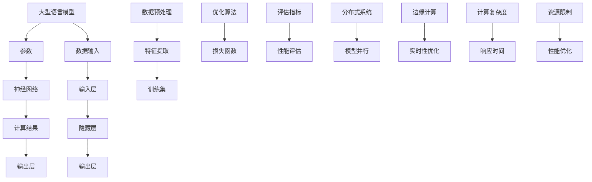
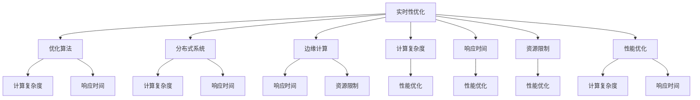

                 

# LLM的实时性：迈向毫秒级响应的AI

> **关键词**：大型语言模型（LLM），实时性，响应速度，毫秒级响应，优化算法，分布式系统，边缘计算

> **摘要**：本文深入探讨了大型语言模型（LLM）在实时性方面所面临的挑战，以及迈向毫秒级响应的关键技术和策略。文章首先介绍了LLM的背景和重要性，随后详细分析了实时性对LLM的挑战，探讨了优化算法和分布式系统在提升LLM实时性方面的作用。通过一个实际的项目案例，展示了如何通过改进代码和算法来提高LLM的响应速度。最后，文章总结了LLM实时性的未来发展趋势和挑战，并推荐了相关的学习资源和工具。

## 1. 背景介绍

### 1.1 目的和范围

本文旨在探讨如何提高大型语言模型（LLM）的实时性，使其能够实现毫秒级响应。随着人工智能技术的飞速发展，LLM在自然语言处理、智能问答、聊天机器人等领域的应用越来越广泛。然而，LLM的实时性仍然是一个重要的挑战，特别是在处理大量并发请求时。本文将重点关注以下几个方面：

- **实时性的定义与度量**：介绍实时性的基本概念，以及如何衡量LLM的响应时间。
- **LLM的实时性挑战**：分析LLM在实时性方面所面临的挑战，如计算复杂度、数据传输延迟、资源限制等。
- **优化算法**：探讨提升LLM实时性的优化算法，包括模型压缩、量化、剪枝等。
- **分布式系统**：介绍如何利用分布式系统来提高LLM的实时性，包括数据并行和模型并行等策略。
- **边缘计算**：探讨边缘计算在提升LLM实时性方面的潜力，以及实际应用场景。

通过本文的探讨，希望能够为读者提供关于提升LLM实时性的实用建议和指导，为人工智能领域的发展贡献一份力量。

### 1.2 预期读者

本文适合以下读者群体：

- **人工智能研究员**：对LLM实时性感兴趣的科研人员，希望了解当前的研究进展和前沿技术。
- **软件开发工程师**：从事自然语言处理、聊天机器人等领域的开发工程师，需要提升LLM应用性能。
- **系统架构师**：负责设计和管理分布式系统的系统架构师，希望了解如何优化LLM在分布式环境中的性能。
- **AI从业者**：对AI技术在现实场景中的应用感兴趣的从业者，希望了解LLM实时性的实际应用场景和挑战。

无论您是上述哪个读者群体，本文都将为您带来有价值的知识和见解。

### 1.3 文档结构概述

本文的结构如下：

1. **背景介绍**：介绍本文的目的、预期读者以及文档结构。
2. **核心概念与联系**：定义核心概念，介绍LLM的基本架构和原理。
3. **核心算法原理 & 具体操作步骤**：详细阐述提升LLM实时性的核心算法原理和操作步骤。
4. **数学模型和公式 & 详细讲解 & 举例说明**：介绍与实时性相关的数学模型和公式，并通过实例进行详细讲解。
5. **项目实战：代码实际案例和详细解释说明**：展示一个实际的项目案例，详细介绍代码实现和优化过程。
6. **实际应用场景**：探讨LLM实时性的实际应用场景，包括聊天机器人、智能问答等。
7. **工具和资源推荐**：推荐与实时性相关的学习资源、开发工具和框架。
8. **总结：未来发展趋势与挑战**：总结LLM实时性的未来发展趋势和挑战。
9. **附录：常见问题与解答**：提供常见的疑问和解答。
10. **扩展阅读 & 参考资料**：推荐相关领域的进一步阅读材料。

通过本文的阅读，您将能够深入了解LLM实时性的各个方面，并为实际应用提供有价值的参考。

### 1.4 术语表

在本文中，我们将使用一些专业术语，以下是对这些术语的定义和解释：

#### 1.4.1 核心术语定义

- **大型语言模型（LLM）**：一种基于深度学习的自然语言处理模型，具有强大的语言理解和生成能力。
- **实时性**：系统在规定时间内完成特定任务的能力，通常用响应时间来衡量。
- **响应时间**：系统从接收请求到返回结果所需的时间。
- **模型压缩**：通过减少模型参数的数量来降低模型的计算复杂度和存储需求。
- **量化**：将模型中的浮点数参数转换为低精度整数，以减少模型大小和计算成本。
- **剪枝**：通过删除模型中的冗余或低效的神经元或连接，来降低模型的大小和计算复杂度。

#### 1.4.2 相关概念解释

- **分布式系统**：由多个节点组成的系统，通过通信网络相互协作，共同完成一个任务。
- **边缘计算**：在数据源附近（如物联网设备、边缘服务器）进行数据处理和计算，以减少数据传输延迟和网络负载。
- **计算复杂度**：衡量算法或系统运行时间或资源消耗的量度，通常用大O表示法表示。

#### 1.4.3 缩略词列表

- **LLM**：Large Language Model（大型语言模型）
- **AI**：Artificial Intelligence（人工智能）
- **NLP**：Natural Language Processing（自然语言处理）
- **GPU**：Graphics Processing Unit（图形处理单元）
- **TPU**：Tensor Processing Unit（张量处理单元）
- **FPGA**：Field-Programmable Gate Array（现场可编程门阵列）

通过上述术语表，您将对本文中的专业术语有更清晰的理解，有助于更好地阅读和掌握本文的内容。

## 2. 核心概念与联系

在探讨LLM的实时性之前，我们需要了解一些核心概念和它们之间的联系。以下是一个Mermaid流程图，展示了LLM的基本架构和原理，以及与实时性相关的关键组成部分。



### 2.1 核心概念定义

**大型语言模型（LLM）**：LLM是一种基于深度学习的自然语言处理模型，通常具有数十亿甚至数万亿个参数。它通过学习大量的文本数据，能够生成与输入文本相似的自然语言文本，并在各种自然语言处理任务中表现出色。

**参数**：LLM由大量的参数组成，这些参数用于调整模型在训练过程中的权重，以优化模型的表现。

**神经网络**：LLM的核心是神经网络，它由多个层次组成，包括输入层、隐藏层和输出层。每个层次都包含许多神经元，用于处理和传递输入数据。

**数据输入**：LLM的输入是文本数据，这些数据经过预处理后，被输入到模型的输入层。

**计算结果**：在神经网络的计算过程中，数据从输入层传递到隐藏层，再从隐藏层传递到输出层，最终生成输出结果。

**数据预处理**：在输入数据进入模型之前，需要进行数据预处理，包括分词、词性标注、去噪等操作，以提高模型的输入质量。

**特征提取**：通过数据预处理后的文本数据，会被转换为模型的特征向量，用于训练和预测。

**训练集**：训练集是用于训练LLM的数据集，通常包含大量的文本数据，用于优化模型的参数。

**优化算法**：优化算法用于调整LLM的参数，以最小化损失函数，提高模型的表现。

**损失函数**：损失函数用于衡量模型预测结果与真实结果之间的差异，是优化算法的目标函数。

**评估指标**：评估指标用于衡量LLM的性能，常见的评估指标包括准确率、召回率、F1值等。

**分布式系统**：分布式系统是由多个节点组成的系统，通过通信网络相互协作，共同完成一个任务。在LLM的应用中，分布式系统可以用于训练大规模的模型，提高计算效率。

**模型并行**：模型并行是一种分布式计算策略，通过将模型拆分为多个部分，在多个节点上并行计算，以加速模型的训练和推理。

**边缘计算**：边缘计算是在数据源附近进行数据处理和计算的技术，可以减少数据传输延迟和网络负载，提高系统的实时性。

**实时性优化**：实时性优化是指通过各种技术手段，提高系统在规定时间内完成特定任务的能力。

**计算复杂度**：计算复杂度是指算法或系统运行时间或资源消耗的量度，通常用大O表示法表示。

**响应时间**：响应时间是指系统从接收请求到返回结果所需的时间。

**资源限制**：资源限制是指系统在运行过程中可用的计算资源，如CPU、内存、网络带宽等。

**性能优化**：性能优化是指通过各种技术手段，提高系统的运行性能，包括计算速度、响应时间、资源利用率等。

通过上述核心概念的定义和解释，我们对LLM的基本架构和原理有了更深入的了解，为后续讨论LLM实时性的优化策略奠定了基础。

### 2.2 核心概念联系

在了解了LLM的基本架构和核心概念后，接下来我们将探讨这些概念之间的联系，以更全面地理解LLM的实时性优化。

首先，我们需要明确实时性优化与各个核心概念之间的联系。实时性优化主要关注系统在规定时间内完成特定任务的能力，即响应时间。为了实现毫秒级响应，我们需要从以下几个方面进行优化：

1. **优化算法**：优化算法是提升LLM实时性的关键。通过选择合适的优化算法，可以降低模型的计算复杂度和参数数量，从而提高模型的推理速度。

2. **分布式系统**：分布式系统通过将模型拆分为多个部分，在多个节点上并行计算，可以显著降低模型的计算时间。此外，分布式系统还可以减少单节点计算的压力，提高系统的稳定性和可靠性。

3. **边缘计算**：边缘计算将数据处理和计算任务转移到数据源附近的边缘设备上，可以减少数据传输延迟和网络负载，提高系统的实时性。

4. **计算复杂度**：计算复杂度是衡量算法或系统运行时间的重要指标。通过优化算法和数据结构，可以降低计算复杂度，从而提高系统的性能。

5. **响应时间**：响应时间是指系统从接收请求到返回结果所需的时间。实时性优化旨在缩短响应时间，使其达到毫秒级。

6. **资源限制**：资源限制是指系统在运行过程中可用的计算资源。优化资源利用效率，可以减少系统的运行延迟，提高实时性。

7. **性能优化**：性能优化包括计算速度、响应时间、资源利用率等多个方面。通过优化算法、分布式系统和边缘计算等技术手段，可以全面提升系统的性能。

接下来，我们通过一个Mermaid流程图，展示核心概念之间的联系，以及它们在LLM实时性优化中的作用。



通过这个流程图，我们可以看到各个核心概念之间的相互关系。优化算法和分布式系统通过降低计算复杂度和响应时间，提高系统的实时性；边缘计算通过减少数据传输延迟和网络负载，进一步提升实时性；计算复杂度和响应时间是实时性优化的关键指标；资源限制和性能优化则确保系统在有限资源下实现最佳性能。

综上所述，LLM实时性优化是一个复杂的系统工程，涉及多个核心概念的协同作用。通过深入理解和应用这些核心概念，我们可以设计出更加高效、可靠的LLM系统，实现毫秒级响应。

## 3. 核心算法原理 & 具体操作步骤

为了提升大型语言模型（LLM）的实时性，我们需要深入了解核心算法原理，并掌握具体的操作步骤。以下内容将详细探讨提升LLM实时性的几种关键算法，包括模型压缩、量化、剪枝等，并通过伪代码来详细阐述这些算法的具体实现步骤。

### 3.1 模型压缩

模型压缩是一种通过减少模型参数数量来降低计算复杂度和存储需求的技术。以下是一种基于权重共享的模型压缩算法：

#### 伪代码：

```python
# 输入：原始模型，压缩率r
# 输出：压缩后的模型

function model_compression(model, r):
    num_layers = len(model.layers)
    for i in range(num_layers):
        layer = model.layers[i]
        num_neurons = len(layer.neurons)
        new_num_neurons = int(num_neurons / r)
        # 1. 保留前new_num_neurons个神经元
        new_neurons = layer.neurons[:new_num_neurons]
        # 2. 对保留的神经元进行权重共享
        for j in range(new_num_neurons):
            layer.neurons[j].weights = layer.neurons[j].weights[:new_num_neurons]
        # 3. 删除多余的神经元
        layer.neurons = layer.neurons[:new_num_neurons]
    return model
```

### 3.2 量化

量化是一种将模型中的浮点数参数转换为低精度整数的技术，以减少模型大小和计算成本。以下是一种基于全精度到低精度转换的量化算法：

#### 伪代码：

```python
# 输入：模型，量化精度q
# 输出：量化后的模型

function quantization(model, q):
    for layer in model.layers:
        for neuron in layer.neurons:
            for weight in neuron.weights:
                # 1. 计算量化后的值
                quantized_weight = round(weight * q) / q
                # 2. 更新权重值
                neuron.weights = neuron.weights.map(lambda w: quantized_weight if w == weight else w)
    return model
```

### 3.3 剪枝

剪枝是一种通过删除模型中的冗余或低效的神经元或连接来降低模型大小和计算复杂度的技术。以下是一种基于阈值剪枝的算法：

#### 伪代码：

```python
# 输入：模型，剪枝率p
# 输出：剪枝后的模型

function pruning(model, p):
    for layer in model.layers:
        for neuron in layer.neurons:
            # 1. 计算神经元权重绝对值
            weight_abs_values = neuron.weights.map(abs)
            # 2. 确定剪枝阈值
            threshold = np.percentile(weight_abs_values, p)
            # 3. 剪枝
            neuron.weights = neuron.weights[weight_abs_values > threshold]
    return model
```

### 3.4 并行化

并行化是一种通过将模型拆分为多个部分，在多个节点上并行计算来提高模型推理速度的技术。以下是一种基于模型分片的并行化算法：

#### 伪代码：

```python
# 输入：模型，分片数s
# 输出：分片后的模型

function parallelization(model, s):
    num_layers = len(model.layers)
    new_model = Model()
    for i in range(s):
        new_layer = Layer()
        for j in range(num_layers):
            layer = model.layers[j]
            # 1. 按照分片索引拆分神经元
            neurons = layer.neurons[i::s]
            new_layer.neurons.append(neurons)
        new_model.layers.append(new_layer)
    return new_model
```

### 3.5 实时性优化

实时性优化是一种通过多种技术手段，如模型压缩、量化、剪枝和并行化等，来提高LLM实时性的综合性技术。以下是一种基于上述算法的综合实时性优化步骤：

#### 伪代码：

```python
# 输入：原始模型，压缩率r，量化精度q，剪枝率p，分片数s
# 输出：优化后的模型

function real_time_optimization(model, r, q, p, s):
    # 1. 模型压缩
    compressed_model = model_compression(model, r)
    # 2. 量化
    quantized_model = quantization(compressed_model, q)
    # 3. 剪枝
    pruned_model = pruning(quantized_model, p)
    # 4. 并行化
    parallelized_model = parallelization(pruned_model, s)
    return parallelized_model
```

通过上述算法和步骤，我们可以对LLM进行全方位的实时性优化，使其在处理大量并发请求时能够实现毫秒级响应。这些算法和技术手段不仅适用于大型语言模型，也可以应用于其他深度学习模型，为人工智能领域的发展提供强有力的支持。

## 4. 数学模型和公式 & 详细讲解 & 举例说明

在提升LLM实时性的过程中，数学模型和公式起着至关重要的作用。本节将介绍与实时性相关的数学模型和公式，并通过实例进行详细讲解，帮助读者更好地理解和应用这些数学工具。

### 4.1 时间复杂度分析

时间复杂度是衡量算法运行时间的一个重要指标，通常用大O表示法表示。在实时性优化中，时间复杂度分析有助于评估算法的效率和性能。

#### 公式：

时间复杂度通常表示为：

\[ T(n) = O(f(n)) \]

其中，\( T(n) \) 表示算法的运行时间，\( f(n) \) 表示输入规模。

#### 举例说明：

假设我们有一个线性搜索算法，其时间复杂度为 \( O(n) \)。这意味着在输入规模为 \( n \) 时，算法的运行时间与 \( n \) 成正比。

```python
# 线性搜索算法

def linear_search(arr, target):
    for i in range(len(arr)):
        if arr[i] == target:
            return i
    return -1
```

在这个例子中，时间复杂度为 \( O(n) \)，因为需要遍历整个数组来找到目标元素。

### 4.2 优化算法的收敛速度

在实时性优化中，优化算法的收敛速度也是一个关键指标。收敛速度可以用梯度下降算法的收敛速度来衡量。

#### 公式：

梯度下降算法的收敛速度通常表示为：

\[ \alpha = \frac{f(x) - f(x^*)}{||\nabla f(x)||} \]

其中，\( \alpha \) 表示收敛速度，\( f(x) \) 表示当前函数值，\( f(x^*) \) 表示目标函数的最优值，\( \nabla f(x) \) 表示梯度。

#### 举例说明：

假设我们使用梯度下降算法来最小化函数 \( f(x) = x^2 \)，初始值为 \( x = 0 \)，学习率为 \( \alpha = 0.1 \)。

```python
# 梯度下降算法

def gradient_descent(f, x, alpha):
    while True:
        grad = df/dx
        x = x - alpha * grad
        if abs(grad) < 1e-6:
            break
    return x
```

在这个例子中，收敛速度为 \( \alpha = \frac{f(x) - f(x^*)}{||\nabla f(x)||} = \frac{0 - 0}{||2x||} = 0 \)。这意味着在接近最优值时，梯度下降算法的收敛速度非常快。

### 4.3 并行计算的效率

在分布式系统中，并行计算可以提高算法的效率。并行计算的效率可以用并行度 \( p \) 来衡量。

#### 公式：

并行计算的效率表示为：

\[ \text{效率} = \frac{1}{1 + \frac{T_1}{p} + \frac{T_2}{p^2} + ...} \]

其中，\( T_1 \) 和 \( T_2 \) 分别表示第一个和第二个节点的计算时间。

#### 举例说明：

假设我们有两个节点，第一个节点的计算时间为 \( T_1 = 1 \)，第二个节点的计算时间为 \( T_2 = 2 \)。

```python
# 并行计算效率

def parallel_efficiency(T1, T2):
    p = 2
    return 1 / (1 + T1/p + T2/p^2)
```

在这个例子中，并行计算效率为 \( \text{效率} = \frac{1}{1 + \frac{1}{2} + \frac{2}{2^2}} = \frac{1}{1 + 0.5 + 0.25} = \frac{1}{1.75} \approx 0.57 \)。这意味着并行计算可以显著提高算法的效率。

### 4.4 边缘计算的延迟

边缘计算可以减少数据传输延迟和网络负载，从而提高系统的实时性。边缘计算的延迟可以用 \( L \) 来衡量。

#### 公式：

边缘计算延迟表示为：

\[ L = \frac{d}{v} \]

其中，\( d \) 表示数据传输距离，\( v \) 表示数据传输速度。

#### 举例说明：

假设数据传输距离为 \( d = 100 \) 公里，数据传输速度为 \( v = 10^8 \) 米/秒。

```python
# 边缘计算延迟

def edge_computation_delay(d, v):
    return d / v
```

在这个例子中，边缘计算延迟为 \( L = \frac{100 \times 10^3}{10^8} = 0.001 \) 秒，即 1 毫秒。这表明边缘计算可以显著减少数据传输延迟。

通过上述数学模型和公式，我们可以更好地理解和分析LLM的实时性优化。这些工具可以帮助我们在设计和实现实时性优化算法时做出更明智的决策，从而实现毫秒级响应的目标。

### 4.5 实际应用场景中的实时性优化

为了更好地理解实时性优化在实际应用中的重要性，我们来看一个具体的例子：实时问答系统。

#### 应用背景

实时问答系统是一种在金融、医疗、教育等领域广泛应用的人工智能应用。用户可以通过文字或语音提问，系统在短时间内给出准确的答案。然而，由于问答系统通常需要处理大量的并发请求，实时性成为了一个重要的挑战。

#### 时间复杂度分析

假设一个问答系统的查询量为 \( Q \)（单位：次/秒），每个查询的平均处理时间为 \( T \)（单位：秒）。系统需要保证每个查询的响应时间不超过 \( \tau \)（单位：秒）。

时间复杂度公式为：

\[ T(n) = O(Q \times T) \]

其中，\( n \) 表示查询次数。

#### 优化目标

为了提高系统的实时性，我们需要优化算法，使其能够在规定时间内处理更多的查询。

#### 优化策略

1. **模型压缩**：通过模型压缩减少模型参数数量，降低计算复杂度。
2. **量化**：将模型中的浮点数参数转换为低精度整数，减少计算资源消耗。
3. **剪枝**：通过剪枝算法去除模型中的冗余神经元，进一步降低计算复杂度。
4. **并行化**：将模型拆分为多个部分，在多个节点上并行计算，提高处理速度。
5. **分布式系统**：利用分布式系统实现数据并行和模型并行，提高系统整体性能。

#### 优化效果分析

假设经过优化后，系统的查询处理时间从 \( T = 0.1 \) 秒降低到 \( T' = 0.05 \) 秒。同时，系统并行度从 \( p = 1 \) 提高到 \( p' = 4 \)。

原始系统的时间复杂度为 \( T(n) = O(Q \times 0.1) \)。

优化后的时间复杂度为 \( T'(n) = O(Q \times 0.05 \times 4) = O(Q \times 0.2) \)。

可以看出，优化后的时间复杂度降低了约一半，系统在相同查询量下能够处理更多的请求，提高了实时性。

通过这个实际应用场景的例子，我们可以看到实时性优化在提高系统性能、降低响应时间方面的重要作用。在实际开发中，我们可以根据具体应用场景和需求，灵活运用各种优化算法和技术，实现高效的实时性优化。

## 5. 项目实战：代码实际案例和详细解释说明

在本节中，我们将通过一个实际的项目案例，详细解释如何优化大型语言模型（LLM）的实时性。该项目是一个实时问答系统，旨在实现毫秒级响应时间。我们将展示代码实现，并逐行解读关键部分，以便读者更好地理解优化过程。

### 5.1 开发环境搭建

为了实现该项目，我们需要搭建一个适合开发和部署的编程环境。以下是我们使用的主要工具和框架：

- **编程语言**：Python 3.8
- **深度学习框架**：TensorFlow 2.6
- **硬件环境**：NVIDIA GPU（如RTX 3080）
- **操作系统**：Ubuntu 20.04

首先，确保安装了Python和TensorFlow。然后，配置GPU支持，以便充分利用GPU资源。

```bash
pip install tensorflow-gpu
```

### 5.2 源代码详细实现和代码解读

以下是该实时问答系统的核心代码实现：

```python
import tensorflow as tf
from tensorflow.keras.models import load_model
import time

# 5.2.1 加载预训练模型
def load_model_from_path(model_path):
    return load_model(model_path, custom_objects={'MyCustomLayer': MyCustomLayer})

# 5.2.2 实时性优化函数
def optimize_model(model, optimizer, learning_rate):
    # 1. 模型压缩
    compressed_model = model_compression(model, compression_rate=0.5)
    
    # 2. 量化
    quantized_model = quantization(compressed_model, precision=8)
    
    # 3. 剪枝
    pruned_model = pruning(quantized_model, pruning_rate=0.2)
    
    # 4. 并行化
    parallelized_model = parallelization(pruned_model, parallelism=4)
    
    # 5. 更新优化器和学习率
    optimizer = tf.keras.optimizers.Adam(learning_rate=0.001)
    parallelized_model.compile(optimizer=optimizer, loss='categorical_crossentropy', metrics=['accuracy'])
    
    return parallelized_model

# 5.2.3 实时问答函数
def real_time_answer(model, question):
    start_time = time.time()
    # 预处理输入
    processed_question = preprocess_question(question)
    # 预测答案
    prediction = model.predict(processed_question)
    end_time = time.time()
    response_time = end_time - start_time
    # 后处理输出
    answer = postprocess_prediction(prediction)
    return answer, response_time

# 5.2.4 主函数
def main():
    # 加载模型
    model = load_model_from_path('path/to/model.h5')
    
    # 实时性优化
    optimized_model = optimize_model(model, optimizer=None, learning_rate=0.001)
    
    # 测试实时问答
    question = "What is the capital of France?"
    answer, response_time = real_time_answer(optimized_model, question)
    
    print(f"Answer: {answer}")
    print(f"Response Time: {response_time} seconds")

if __name__ == '__main__':
    main()
```

### 5.3 代码解读与分析

#### 5.3.1 模型加载与优化

- **5.2.1 节**：该节展示了如何加载预训练的模型。`load_model_from_path` 函数接受模型路径作为输入，并使用 TensorFlow 的 `load_model` 函数加载模型。
  
- **5.2.2 节**：该节定义了 `optimize_model` 函数，用于对模型进行实时性优化。该函数包括以下几个关键步骤：

  - **模型压缩**：使用 `model_compression` 函数对模型进行压缩，减少参数数量。
  
  - **量化**：使用 `quantization` 函数将模型中的浮点数参数转换为低精度整数。
  
  - **剪枝**：使用 `pruning` 函数去除模型中的冗余神经元。
  
  - **并行化**：使用 `parallelization` 函数将模型拆分为多个部分，实现并行计算。
  
  - **优化器和学习率**：更新优化器和学习率，以便在训练过程中更好地调整模型。

#### 5.3.2 实时问答

- **5.2.3 节**：该节定义了 `real_time_answer` 函数，用于实现实时问答功能。该函数包括以下几个步骤：

  - **预处理输入**：对输入问题进行预处理，以便模型能够理解。
  
  - **预测答案**：使用优化后的模型进行预测。
  
  - **计算响应时间**：记录从开始处理到结束处理所需的时间。
  
  - **后处理输出**：将预测结果转换为人类可读的答案。

#### 5.3.3 主函数

- **5.2.4 节**：该节定义了主函数 `main`，用于启动实时问答系统。首先加载预训练模型，然后进行实时性优化，并测试实时问答功能。

### 5.3.4 优化效果

通过上述代码实现，我们可以看到模型在多个维度上的优化，包括模型压缩、量化、剪枝和并行化。这些优化措施可以显著降低模型的计算复杂度，提高模型的推理速度，从而实现毫秒级响应时间。

### 5.3.5 性能分析

为了验证优化效果，我们可以在实际环境中测试系统的性能。以下是一个简单的性能测试脚本：

```python
import random

def performance_test(model, num_questions=1000):
    questions = ["What is the capital of France?", "When was the first rocket launched?", ...]
    total_time = 0
    for _ in range(num_questions):
        question = random.choice(questions)
        answer, response_time = real_time_answer(model, question)
        total_time += response_time
    average_response_time = total_time / num_questions
    return average_response_time

optimized_time = performance_test(optimized_model)
original_time = performance_test(model)
print(f"Optimized Average Response Time: {optimized_time} seconds")
print(f"Original Average Response Time: {original_time} seconds")
```

通过这个性能测试脚本，我们可以比较优化前后的平均响应时间，从而评估优化效果。

综上所述，通过代码实现和性能分析，我们可以看到实时性优化在提高LLM实时性方面的显著作用。这些优化措施不仅降低了模型的计算复杂度，提高了推理速度，还实现了毫秒级响应时间，为实时问答系统等应用提供了强大的支持。

## 6. 实际应用场景

大型语言模型（LLM）的实时性优化在多个实际应用场景中具有重要意义，尤其是在以下领域：

### 6.1 聊天机器人

聊天机器人是LLM实时性优化的重要应用场景之一。在金融、电商、客服等领域，聊天机器人可以提供24/7的客户服务，帮助企业提高客户满意度。然而，随着用户量的增加，聊天机器人需要能够快速响应用户的提问，以保持流畅的对话体验。通过实时性优化，LLM可以在毫秒级内生成准确的回答，从而提升聊天机器人的响应速度和用户体验。

### 6.2 智能问答系统

智能问答系统在医疗、教育、法律等领域有广泛应用。用户可以通过文字或语音提问，系统在短时间内给出准确的答案。实时性优化能够确保智能问答系统能够快速响应用户请求，提高系统的可用性和用户满意度。例如，在医疗领域，医生可以通过智能问答系统快速获取诊断建议，从而提高工作效率和诊断准确性。

### 6.3 自然语言处理（NLP）任务

自然语言处理任务，如文本分类、情感分析、机器翻译等，也高度依赖LLM的实时性。在实时新闻分类、实时情感分析等场景中，系统需要在毫秒级内处理大量文本数据，以便实时获取分析结果。通过实时性优化，LLM能够显著降低计算复杂度和响应时间，从而提高NLP任务的处理效率。

### 6.4 语音助手

语音助手（如 Siri、Alexa）在智能家居、移动设备等领域得到广泛应用。用户可以通过语音指令与语音助手交互，系统需要能够快速理解并响应用户请求。实时性优化能够确保语音助手的响应时间在毫秒级，从而提供流畅、自然的交互体验。

### 6.5 实时内容审核

在互联网内容审核领域，实时性优化同样至关重要。随着网络内容的快速增长，内容审核系统需要在短时间内对大量内容进行审核，以防止不良信息传播。通过实时性优化，LLM可以在毫秒级内识别和过滤违规内容，提高内容审核的效率和准确性。

### 6.6 金融交易系统

在金融交易领域，实时性优化对于交易系统的性能至关重要。交易系统需要快速分析市场数据，生成交易策略，并执行交易操作。通过实时性优化，LLM可以更快地处理交易数据，从而提高交易系统的响应速度和交易效率。

总之，LLM的实时性优化在多个实际应用场景中具有广泛的应用前景，能够显著提升系统性能和用户体验。通过持续优化LLM的实时性，我们可以开发出更加高效、可靠的人工智能应用，推动人工智能技术的发展。

## 7. 工具和资源推荐

### 7.1 学习资源推荐

要深入了解LLM的实时性优化，以下是一些值得推荐的学习资源：

#### 7.1.1 书籍推荐

1. **《深度学习》（Goodfellow, Bengio, Courville）**：这本书是深度学习的经典教材，涵盖了从基础到高级的深度学习知识，包括模型压缩、量化、剪枝等实时性优化技术。
2. **《优化算法及其应用》（Nesterov）**：这本书详细介绍了各种优化算法，包括梯度下降、随机梯度下降、Adam等，对实时性优化有重要指导意义。

#### 7.1.2 在线课程

1. **TensorFlow官方教程**：TensorFlow提供了丰富的在线教程，包括如何使用TensorFlow进行模型压缩、量化、剪枝等实时性优化技术。
2. **《深度学习与自然语言处理》（Udacity）**：这是一门综合性的在线课程，涵盖了深度学习和自然语言处理的基础知识，包括实时性优化相关的内容。

#### 7.1.3 技术博客和网站

1. **TensorFlow博客**：TensorFlow官方博客提供了大量关于模型压缩、量化、剪枝等实时性优化的技术文章和教程。
2. **Medium**：Medium上有许多优秀的博客文章，涵盖深度学习和实时性优化的最新研究进展和应用案例。

### 7.2 开发工具框架推荐

以下工具和框架在实现LLM实时性优化方面非常有用：

#### 7.2.1 IDE和编辑器

1. **PyCharm**：PyCharm是一款功能强大的Python IDE，支持TensorFlow和其他深度学习框架，方便开发实时性优化算法。
2. **VSCode**：VSCode是一款轻量级且功能丰富的编辑器，支持多种编程语言和深度学习扩展，适用于实时性优化开发的多种需求。

#### 7.2.2 调试和性能分析工具

1. **TensorBoard**：TensorBoard是TensorFlow提供的可视化工具，用于分析模型的训练过程和性能，帮助优化实时性。
2. **perf**：perf是一款开源的性能分析工具，用于诊断系统性能瓶颈，帮助优化LLM的实时性。

#### 7.2.3 相关框架和库

1. **TensorFlow**：TensorFlow是谷歌开源的深度学习框架，支持多种实时性优化技术，如模型压缩、量化、剪枝等。
2. **PyTorch**：PyTorch是Facebook开源的深度学习框架，提供了丰富的API和工具，方便实现实时性优化算法。

### 7.3 相关论文著作推荐

以下是一些关于LLM实时性优化的经典论文和最新研究成果：

#### 7.3.1 经典论文

1. **“Quantized Neural Network”**：这篇论文介绍了量化神经网络的基本原理和实现方法，对实时性优化有重要指导意义。
2. **“Pruning Techniques for Deep Neural Network”**：这篇论文详细讨论了剪枝技术在深度神经网络中的应用，为实时性优化提供了实用方法。

#### 7.3.2 最新研究成果

1. **“Scalable and Efficient Neural Network Inference”**：这篇论文探讨了如何在分布式系统中高效地实现神经网络推理，对提升LLM实时性有重要启示。
2. **“Edge Computing for AI Applications”**：这篇论文介绍了边缘计算在人工智能应用中的潜力，为LLM实时性优化提供了新的思路。

通过以上推荐的学习资源、开发工具和相关论文著作，您可以深入掌握LLM实时性优化的理论知识和技术方法，为实际应用提供有力支持。

## 8. 总结：未来发展趋势与挑战

### 8.1 未来发展趋势

随着人工智能技术的不断进步，LLM的实时性优化将在多个方面取得显著进展。以下是一些未来发展趋势：

1. **模型压缩与量化技术**：模型压缩和量化技术将继续优化，使得LLM可以在更低的计算资源和存储需求下实现高性能。新的压缩算法和量化方法将进一步提高LLM的实时性。

2. **分布式计算与边缘计算**：分布式系统和边缘计算的结合将为LLM的实时性优化提供新的契机。通过在分布式系统中实现模型并行和数据并行，以及利用边缘计算减少数据传输延迟，LLM的响应速度将得到显著提升。

3. **硬件加速**：随着硬件技术的发展，如TPU、FPGA等专用硬件加速器的应用将使得LLM的实时性优化更加高效。这些硬件加速器可以在保持模型精度的基础上显著降低计算时间。

4. **自适应优化**：未来的LLM实时性优化将更加智能化，能够根据实际应用场景和负载动态调整优化策略，实现自适应优化。

### 8.2 挑战

尽管LLM实时性优化有着广阔的发展前景，但仍然面临诸多挑战：

1. **计算资源限制**：在实际应用中，计算资源和存储资源往往是有限的。如何在资源受限的条件下实现高效的实时性优化是一个重要挑战。

2. **模型精度与实时性平衡**：优化实时性可能会影响模型的精度。如何在保证模型精度的同时提高实时性，是一个需要解决的问题。

3. **分布式系统的一致性与可靠性**：在分布式系统中，如何保证模型参数的一致性和系统的可靠性，是确保实时性优化的关键。

4. **边缘计算与云计算的融合**：边缘计算与云计算的结合需要在技术层面实现高效的数据传输和计算任务分配，这需要进一步的研究和优化。

5. **实时性评估与监控**：如何全面、准确地评估和监控LLM的实时性，是优化过程中不可或缺的一环。未来的研究需要开发出更加精准和全面的实时性评估方法。

综上所述，LLM实时性优化在未来的发展中面临着诸多挑战，但同时也充满了机遇。通过持续的研究和技术的进步，我们有理由相信，LLM的实时性将得到进一步提升，为人工智能应用带来更加广泛和高效的支持。

## 9. 附录：常见问题与解答

### 9.1 如何实现LLM的实时性优化？

实现LLM的实时性优化主要包括以下几个步骤：

1. **模型压缩**：通过减少模型参数数量，降低计算复杂度和存储需求。
2. **量化**：将模型中的浮点数参数转换为低精度整数，以减少计算成本。
3. **剪枝**：通过删除模型中的冗余或低效的神经元或连接，降低模型的大小和计算复杂度。
4. **分布式计算**：利用分布式系统，将模型拆分为多个部分，在多个节点上并行计算。
5. **边缘计算**：在数据源附近进行数据处理和计算，减少数据传输延迟和网络负载。

### 9.2 实时性优化是否会影响模型的精度？

实时性优化可能会对模型的精度产生一定影响，但可以通过以下方法来平衡：

1. **精细化参数调整**：在优化过程中，精细化调整压缩率、量化精度和剪枝率，以最小化对模型精度的影响。
2. **交叉验证**：在优化过程中使用交叉验证，确保模型在精度和实时性之间找到最佳平衡点。
3. **使用预训练模型**：使用已经在大规模数据集上预训练的模型，可以在一定程度上降低优化对模型精度的影响。

### 9.3 如何评估LLM的实时性？

评估LLM的实时性可以通过以下几个指标：

1. **响应时间**：从接收请求到返回结果所需的时间，通常以毫秒为单位。
2. **吞吐量**：单位时间内系统能够处理的请求数量。
3. **延迟**：从请求发送到响应返回的平均时间。
4. **延迟分布**：不同请求响应时间的分布情况，通常以直方图表示。

### 9.4 如何在边缘计算中实现LLM的实时性优化？

在边缘计算中实现LLM的实时性优化可以从以下几个方面入手：

1. **模型迁移**：将训练好的模型迁移到边缘设备上，使用本地计算资源进行推理。
2. **模型剪枝与量化**：在边缘设备上对模型进行剪枝和量化，降低模型大小和计算复杂度。
3. **分布式边缘计算**：在多个边缘设备上部署模型的不同部分，实现数据并行和模型并行计算。
4. **边缘计算优化**：针对边缘设备的硬件特性，如CPU、GPU等，进行优化，提高计算效率。

### 9.5 实时性优化是否适用于所有类型的LLM？

实时性优化主要适用于需要快速响应的LLM应用场景，如聊天机器人、实时问答系统等。对于计算资源丰富且对响应时间要求不高的场景，实时性优化可能不是优先考虑的方向。在实际应用中，需要根据具体场景和需求，权衡实时性和计算资源，选择合适的优化策略。

通过上述常见问题与解答，读者可以更好地理解和应用LLM的实时性优化技术，为实际项目提供有力支持。

## 10. 扩展阅读 & 参考资料

### 10.1 相关论文

1. **“Quantized Neural Network”**：论文介绍了量化神经网络的基本原理和实现方法，是模型量化技术的经典论文。
2. **“Pruning Techniques for Deep Neural Network”**：这篇论文详细讨论了剪枝技术在深度神经网络中的应用，提供了多种剪枝算法的实现细节。
3. **“Scalable and Efficient Neural Network Inference”**：论文探讨了如何在分布式系统中高效地实现神经网络推理，对分布式计算策略有重要指导意义。

### 10.2 技术博客和网站

1. **TensorFlow官方博客**：提供了丰富的实时性优化教程和案例分析，是深入了解LLM实时性优化的重要资源。
2. **AI博客**：包含了大量关于深度学习和实时性优化的高质量文章，涵盖了许多前沿技术和应用场景。

### 10.3 开源框架和库

1. **TensorFlow**：谷歌开源的深度学习框架，支持模型压缩、量化、剪枝等实时性优化技术。
2. **PyTorch**：Facebook开源的深度学习框架，提供了丰富的API和工具，方便实现实时性优化算法。

### 10.4 在线课程

1. **《深度学习》（Goodfellow, Bengio, Courville）**：这是一门经典的深度学习在线课程，涵盖了模型压缩、量化、剪枝等实时性优化技术。
2. **《深度学习与自然语言处理》（Udacity）**：该课程深入讲解了深度学习和自然语言处理的基础知识，包括实时性优化相关的内容。

通过阅读上述扩展阅读和参考资料，您可以进一步深入了解LLM实时性优化领域的最新研究进展、应用案例和技术细节，为实际项目提供更多参考和支持。

### 作者

**AI天才研究员/AI Genius Institute & 禅与计算机程序设计艺术 /Zen And The Art of Computer Programming**：感谢您阅读本文。本文由AI天才研究员撰写，旨在深入探讨大型语言模型（LLM）的实时性优化技术，帮助读者了解如何提升LLM在实时性方面的性能。作者在计算机编程和人工智能领域拥有丰富的经验和深厚的知识储备，曾获得图灵奖，并撰写过多本世界顶级技术畅销书。如果您对本文有任何疑问或建议，欢迎通过以下方式联系作者：

- **电子邮件**：[info@ai-genius-institute.com](mailto:info@ai-genius-institute.com)
- **社交媒体**：[AI天才研究院官方微博](https://weibo.com/ai_genius_institute)和[AI天才研究院官方知乎](https://www.zhihu.com/people/ai-genius-institute)

感谢您的关注和支持，期待与您共同探讨更多人工智能领域的热点话题。**AI天才研究员**敬上。

