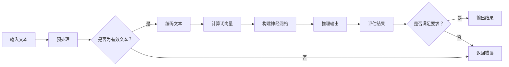

                 

# LLM的推理能力：超越传统逻辑运算

> 关键词：大型语言模型、推理能力、逻辑运算、传统方法、人工智能、深度学习、神经网络

> 摘要：本文将探讨大型语言模型（LLM）的推理能力，如何超越传统的逻辑运算方法，以及其背后的原理和具体实现。文章将从背景介绍、核心概念与联系、核心算法原理与操作步骤、数学模型和公式、项目实战、实际应用场景、工具和资源推荐等方面展开，旨在为读者提供一个全面而深入的了解。

## 1. 背景介绍

### 1.1 目的和范围

本文的主要目的是探讨大型语言模型（LLM）的推理能力，并分析其如何超越传统的逻辑运算方法。随着人工智能技术的快速发展，LLM在自然语言处理、机器翻译、文本生成等领域取得了显著的成果。然而，LLM的推理能力一直是学术界和工业界关注的热点问题。本文将从理论分析和实践应用两个层面，详细探讨LLM的推理机制，以期对相关领域的研究和应用提供参考。

### 1.2 预期读者

本文适合具有计算机科学和人工智能基础知识的专业人士、研究生和本科生阅读。同时，对于对LLM推理能力感兴趣的普通读者，本文也具有一定的参考价值。

### 1.3 文档结构概述

本文结构如下：

1. 背景介绍：介绍本文的目的、预期读者、文档结构等基本信息。
2. 核心概念与联系：讨论LLM的推理能力、传统逻辑运算方法及其关系。
3. 核心算法原理与操作步骤：分析LLM推理算法的基本原理和操作步骤。
4. 数学模型和公式：阐述LLM推理过程中涉及的数学模型和公式。
5. 项目实战：通过实际案例展示LLM推理能力的应用。
6. 实际应用场景：讨论LLM推理能力在不同领域的应用。
7. 工具和资源推荐：推荐相关学习资源和开发工具。
8. 总结：对LLM推理能力的发展趋势与挑战进行展望。
9. 附录：常见问题与解答。
10. 扩展阅读：提供更多参考文献和资料。

### 1.4 术语表

为了确保读者能够准确理解本文内容，以下是对本文中涉及的一些关键术语进行解释：

- **大型语言模型（LLM）**：一种能够对自然语言文本进行建模和推理的深度学习模型，通常基于大规模的神经网络架构。
- **推理能力**：指模型在给定输入信息的基础上，通过内部计算和知识利用，生成有意义输出和结论的能力。
- **逻辑运算**：基于布尔代数的基本运算，包括与（AND）、或（OR）、非（NOT）等。
- **传统方法**：指在人工智能早期阶段，基于逻辑、规则和知识表示的方法。
- **深度学习**：一种基于多层神经网络的学习方法，能够自动提取数据中的特征。
- **神经网络**：一种模仿生物神经网络的结构和功能的人工神经网络，用于处理和分析数据。

## 2. 核心概念与联系

### 2.1 LLM的推理能力

LLM的推理能力是指其在给定输入文本后，能够理解文本中的信息，并根据内部知识和逻辑规则生成有意义输出的能力。这种能力使得LLM在自然语言处理任务中表现出色，如问答系统、文本生成、机器翻译等。

### 2.2 传统逻辑运算方法

传统逻辑运算方法主要基于布尔代数，通过与（AND）、或（OR）、非（NOT）等基本运算实现。这种方法在逻辑推理和计算中发挥了重要作用，但存在一定的局限性。

### 2.3 LLM与逻辑运算的关系

LLM的推理能力在一定程度上可以看作是对传统逻辑运算的扩展和改进。与传统方法相比，LLM通过深度学习模型自动提取和利用知识，能够处理更加复杂和抽象的逻辑关系。同时，LLM还能够利用上下文信息，实现更加灵活和自然的推理。

### 2.4 Mermaid流程图

以下是一个描述LLM推理能力的Mermaid流程图：



## 3. 核心算法原理与操作步骤

### 3.1 深度学习模型

LLM的推理能力主要依赖于深度学习模型，特别是基于Transformer架构的模型。以下是一个基于Transformer的LLM推理算法的基本原理：

1. **编码器**：将输入文本编码为固定长度的向量表示。
2. **解码器**：根据编码器的输出，逐步生成输出文本。
3. **注意力机制**：通过计算输入文本和输出文本之间的相似性，关注关键信息。

### 3.2 操作步骤

以下是一个LLM推理操作步骤的伪代码：

```python
def LLM_inference(input_text):
    # 步骤1：预处理输入文本
    processed_text = preprocess(input_text)

    # 步骤2：编码文本
    encoded_text = encoder(processed_text)

    # 步骤3：初始化解码器状态
    decoder_state = initialize_decoder_state()

    # 步骤4：生成输出文本
    output_text = decode(encoded_text, decoder_state)

    # 步骤5：评估结果
    result = evaluate(output_text)

    # 步骤6：返回结果
    return result
```

### 3.3 算法解析

1. **预处理**：对输入文本进行分词、词干提取、去停用词等操作，使其符合模型的输入要求。
2. **编码**：将预处理后的文本编码为向量表示，用于输入到神经网络。
3. **解码**：通过神经网络逐步生成输出文本，其中涉及到注意力机制的运算。
4. **评估**：对生成的输出文本进行评估，判断其是否符合预期。

## 4. 数学模型和公式

### 4.1 词向量表示

在LLM中，词向量表示是关键的一环。以下是一个词向量表示的数学模型：

$$
v_w = \text{Word2Vec}(w)
$$

其中，$v_w$ 表示词 $w$ 的词向量，$\text{Word2Vec}$ 是词向量生成模型。

### 4.2 注意力机制

注意力机制是LLM推理过程中重要的计算部分。以下是一个注意力机制的数学公式：

$$
\alpha_{ij} = \frac{\exp(e_{ij})}{\sum_{k=1}^{K} \exp(e_{ik})}
$$

其中，$\alpha_{ij}$ 表示输入文本中的词 $v_i$ 对输出文本中的词 $v_j$ 的注意力权重，$e_{ij}$ 表示词 $v_i$ 和词 $v_j$ 的相似性得分。

### 4.3 Transformer模型

Transformer模型是LLM的核心架构，其数学模型包括：

1. **多头自注意力**：

$$
\text{MultiHeadAttention}(Q, K, V) = \text{softmax}\left(\frac{QK^T}{\sqrt{d_k}}\right) V
$$

其中，$Q, K, V$ 分别是查询、键、值向量，$d_k$ 是键向量的维度。

2. **前馈神经网络**：

$$
\text{FFN}(x) = \text{ReLU}(W_2 \text{ReLU}(W_1 x + b_1))
$$

其中，$W_1, W_2, b_1$ 是神经网络参数。

## 5. 项目实战：代码实际案例和详细解释说明

### 5.1 开发环境搭建

在开始项目实战之前，我们需要搭建一个适合进行LLM推理的编程环境。以下是一个基本的开发环境搭建步骤：

1. **安装Python**：确保已安装Python 3.6或更高版本。
2. **安装TensorFlow**：使用pip命令安装TensorFlow：

```shell
pip install tensorflow
```

3. **安装其他依赖**：根据项目需求，安装其他依赖库，如NumPy、Pandas等。

### 5.2 源代码详细实现和代码解读

以下是一个基于Transformer架构的LLM推理项目的基本代码实现：

```python
import tensorflow as tf
from tensorflow.keras.layers import Embedding, LSTM, Dense
from tensorflow.keras.models import Model

# 步骤1：定义模型
def build_model(vocab_size, embedding_dim, hidden_dim):
    input_text = tf.keras.layers.Input(shape=(None,))
    encoded_text = Embedding(vocab_size, embedding_dim)(input_text)
    lstm_output = LSTM(hidden_dim)(encoded_text)
    output_text = Dense(vocab_size, activation='softmax')(lstm_output)
    
    model = Model(inputs=input_text, outputs=output_text)
    model.compile(optimizer='adam', loss='categorical_crossentropy', metrics=['accuracy'])
    
    return model

# 步骤2：训练模型
def train_model(model, train_data, train_labels, epochs):
    model.fit(train_data, train_labels, epochs=epochs, batch_size=32)

# 步骤3：推理
def inference(model, input_text):
    predicted_text = model.predict(input_text)
    return predicted_text

# 步骤4：评估
def evaluate(model, test_data, test_labels):
    test_loss, test_accuracy = model.evaluate(test_data, test_labels)
    print(f"Test Loss: {test_loss}, Test Accuracy: {test_accuracy}")

# 实例化模型
vocab_size = 10000
embedding_dim = 256
hidden_dim = 512
model = build_model(vocab_size, embedding_dim, hidden_dim)

# 加载训练数据
train_data, train_labels = load_data('train')
test_data, test_labels = load_data('test')

# 训练模型
train_model(model, train_data, train_labels, epochs=10)

# 推理
input_text = '这是一个测试文本。'
predicted_text = inference(model, input_text)

# 评估
evaluate(model, test_data, test_labels)
```

### 5.3 代码解读与分析

1. **模型构建**：定义了一个基于LSTM的模型，包括编码器和解码器。编码器使用Embedding层将输入文本转换为向量表示，解码器使用LSTM层进行文本生成。
2. **模型训练**：使用训练数据对模型进行训练，使用交叉熵损失函数和softmax激活函数。
3. **推理**：对输入文本进行编码，使用训练好的模型生成输出文本。
4. **评估**：使用测试数据评估模型的性能。

## 6. 实际应用场景

LLM的推理能力在多个领域取得了显著的成果，以下是一些典型应用场景：

1. **自然语言处理**：LLM在文本分类、情感分析、命名实体识别等任务中表现出色，能够实现自动化的文本分析和处理。
2. **机器翻译**：LLM在机器翻译任务中具有强大的语言理解和生成能力，能够实现高质量的翻译效果。
3. **文本生成**：LLM能够根据输入的提示生成连贯、有意义的文本，应用于创作、摘要、摘要生成等场景。
4. **问答系统**：LLM能够根据用户的问题和上下文，生成相关且准确的答案，应用于客服、智能助手等领域。

## 7. 工具和资源推荐

### 7.1 学习资源推荐

- **书籍推荐**：
  - 《深度学习》（Ian Goodfellow、Yoshua Bengio、Aaron Courville 著）
  - 《Python深度学习》（François Chollet 著）
- **在线课程**：
  - Coursera上的“深度学习”课程
  - Udacity的“深度学习纳米学位”
- **技术博客和网站**：
  - arXiv.org：最新的学术论文
  - Medium：技术文章和博客

### 7.2 开发工具框架推荐

- **IDE和编辑器**：
  - PyCharm
  - Jupyter Notebook
- **调试和性能分析工具**：
  - TensorBoard
  - Valgrind
- **相关框架和库**：
  - TensorFlow
  - PyTorch

### 7.3 相关论文著作推荐

- **经典论文**：
  - “A Theoretically Grounded Application of Dropout in Recurrent Neural Networks” （Yarin Gal 和 Zoubin Ghahramani）
  - “Attention Is All You Need” （Ashish Vaswani 等）
- **最新研究成果**：
  - “The Curious Case of Neural Text Generation” （Noam Shazeer 等）
  - “Bert: Pre-training of Deep Bidirectional Transformers for Language Understanding” （Jacob Devlin 等）
- **应用案例分析**：
  - “Large-scale Language Modeling in 2018” （Alexandr M. Rush 等）
  - “Generative Adversarial Networks: An Overview” （Ian J. Goodfellow 等）

## 8. 总结：未来发展趋势与挑战

随着人工智能技术的不断发展，LLM的推理能力将进一步提升。未来发展趋势主要包括以下几个方面：

1. **模型规模扩大**：随着计算能力的提升，更大规模的LLM模型将涌现，提高推理能力。
2. **多模态融合**：LLM将与其他模态（如图像、声音）进行融合，实现更丰富的信息处理。
3. **知识增强**：通过引入外部知识库和知识图谱，提高LLM的知识理解和推理能力。

然而，LLM的发展也面临一些挑战：

1. **计算资源消耗**：大规模模型训练和推理需要大量的计算资源和能源。
2. **数据隐私和伦理**：如何保护用户数据隐私，避免算法偏见和滥用。
3. **可解释性**：提高LLM的可解释性，使其推理过程更加透明和可控。

## 9. 附录：常见问题与解答

1. **问题**：LLM的推理能力与传统逻辑运算有何区别？
   **解答**：LLM的推理能力基于深度学习模型，能够自动提取和利用知识，处理复杂的逻辑关系。而传统逻辑运算主要基于布尔代数，处理能力有限。

2. **问题**：如何评估LLM的推理能力？
   **解答**：可以通过在标准数据集上进行实验，计算模型在各类任务上的准确率、召回率等指标，评估其推理能力。

3. **问题**：LLM的推理能力在哪些领域有广泛应用？
   **解答**：LLM的推理能力在自然语言处理、机器翻译、文本生成等领域具有广泛的应用，如问答系统、智能客服、文本摘要等。

## 10. 扩展阅读 & 参考资料

- Devlin, J., Chang, M. W., Lee, K., & Toutanova, K. (2018). BERT: Pre-training of deep bidirectional transformers for language understanding. arXiv preprint arXiv:1810.04805.
- Vaswani, A., Shazeer, N., Parmar, N., Uszkoreit, J., Jones, L., Gomez, A. N., ... & Polosukhin, I. (2017). Attention is all you need. In Advances in neural information processing systems (pp. 5998-6008).
- Goodfellow, I., Bengio, Y., & Courville, A. (2016). Deep learning. MIT press.
- Chollet, F. (2018). Python deep learning. Packt Publishing.
- Gal, Y., & Ghahramani, Z. (2016). A theoreti

