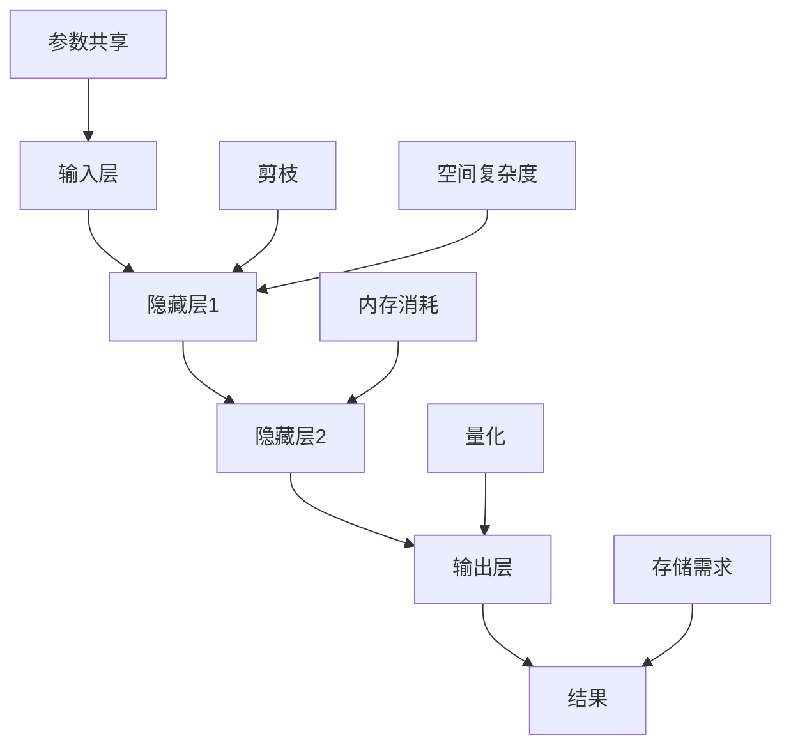

                 

# LLM的空间复杂度优化技术

> 关键词：大语言模型（LLM），空间复杂度，内存优化，算法优化，数据结构优化

> 摘要：本文旨在深入探讨大语言模型（Large Language Model，简称LLM）的空间复杂度优化技术。随着深度学习技术在自然语言处理领域的广泛应用，如何提高LLM的空间复杂度成为了一个关键问题。本文将介绍LLM空间复杂度的核心概念、优化算法、数学模型及其在实际应用中的具体实现，帮助读者更好地理解和应用这些技术。

## 1. 背景介绍

### 1.1 目的和范围

本文的目标是系统地探讨大语言模型的空间复杂度优化技术，旨在解决以下几个关键问题：

1. **理解LLM的空间复杂度**：通过深入分析LLM的架构和运行原理，解释空间复杂度的概念及其重要性。
2. **优化算法介绍**：介绍几种常用的空间复杂度优化算法，包括剪枝、量化、参数共享等。
3. **数学模型和公式**：详细阐述空间复杂度的计算方法和优化公式，并通过具体例子进行说明。
4. **实战案例**：通过实际代码案例，展示如何在项目中应用这些优化技术。
5. **未来发展趋势**：讨论LLM空间复杂度优化技术的未来发展方向和潜在挑战。

### 1.2 预期读者

本文的预期读者包括：

1. **深度学习研究者**：希望了解如何优化大语言模型空间复杂度的研究人员。
2. **程序员和开发人员**：需要在大规模项目中应用优化技术的程序员和开发人员。
3. **数据科学家**：对自然语言处理和深度学习技术感兴趣的从业者。
4. **学术和学生**：希望深入理解LLM空间复杂度优化技术的研究生和本科生。

### 1.3 文档结构概述

本文的结构如下：

1. **第1章：背景介绍**：介绍本文的目的、范围、预期读者和文档结构。
2. **第2章：核心概念与联系**：阐述LLM的核心概念及其相互关系。
3. **第3章：核心算法原理与具体操作步骤**：详细解释优化算法的原理和操作步骤。
4. **第4章：数学模型和公式**：讨论空间复杂度的数学模型和计算方法。
5. **第5章：项目实战**：通过实际案例展示优化技术的应用。
6. **第6章：实际应用场景**：讨论LLM空间复杂度优化的实际应用。
7. **第7章：工具和资源推荐**：推荐学习资源和开发工具。
8. **第8章：总结**：总结LLM空间复杂度优化的未来发展趋势。
9. **第9章：附录**：提供常见问题解答。
10. **第10章：扩展阅读与参考资料**：推荐进一步阅读的材料。

### 1.4 术语表

#### 1.4.1 核心术语定义

- **大语言模型（LLM）**：一种基于深度学习技术的自然语言处理模型，能够理解、生成和翻译自然语言。
- **空间复杂度**：描述算法在处理数据时所需内存大小的度量。
- **剪枝**：通过移除网络中的部分神经元或连接来减少模型的大小。
- **量化**：将模型的浮点数权重转换为较低精度的数值表示。
- **参数共享**：通过在网络的不同部分重复使用相同的参数来减少模型的内存需求。

#### 1.4.2 相关概念解释

- **深度学习**：一种机器学习方法，通过多层神经网络对数据进行建模和学习。
- **自然语言处理（NLP）**：使计算机能够理解、解释和生成自然语言的技术。
- **神经网络**：一种由大量神经元组成的计算模型，用于模拟人脑的信息处理方式。

#### 1.4.3 缩略词列表

- **LLM**：Large Language Model（大语言模型）
- **NLP**：Natural Language Processing（自然语言处理）
- **DL**：Deep Learning（深度学习）
- **GPU**：Graphics Processing Unit（图形处理单元）
- **TPU**：Tensor Processing Unit（张量处理单元）

## 2. 核心概念与联系

为了更好地理解LLM的空间复杂度优化技术，首先需要了解一些核心概念及其相互关系。

### 2.1 大语言模型（LLM）

大语言模型（LLM）是一种基于深度学习技术的自然语言处理模型，其核心思想是通过大量文本数据训练一个能够理解、生成和翻译自然语言的神经网络。LLM通常包含以下几个关键组成部分：

1. **输入层**：接收自然语言输入，如文本、语音等。
2. **隐藏层**：通过神经网络结构对输入数据进行特征提取和转换。
3. **输出层**：生成预测结果，如单词、句子、段落等。

### 2.2 空间复杂度

空间复杂度是描述算法在处理数据时所需内存大小的度量，通常用O（n）表示，其中n是输入数据的规模。在LLM中，空间复杂度主要涉及以下几个方面：

1. **模型大小**：模型参数的数量和维度。
2. **内存消耗**：训练和推理过程中所需内存的大小。
3. **存储需求**：模型在存储设备上的存储空间需求。

### 2.3 优化算法

为了降低LLM的空间复杂度，研究者提出了一系列优化算法。以下是几种常见的优化算法：

1. **剪枝（Pruning）**：通过移除网络中的部分神经元或连接来减少模型的大小。
2. **量化（Quantization）**：将模型的浮点数权重转换为较低精度的数值表示，以减少内存需求。
3. **参数共享（Parameter Sharing）**：通过在网络的不同部分重复使用相同的参数来减少模型的内存需求。

### 2.4 Mermaid 流程图

为了更直观地展示LLM的核心概念和优化算法，我们可以使用Mermaid流程图。以下是示例流程图：



### 2.5 核心概念与联系总结

通过对LLM、空间复杂度和优化算法的深入分析，我们可以看到它们之间的紧密联系。LLM是自然语言处理的核心工具，其空间复杂度决定了模型的性能和可扩展性。优化算法通过降低模型大小、内存消耗和存储需求，从而提高LLM的效率和应用价值。

## 3. 核心算法原理与具体操作步骤

在了解了LLM的核心概念和空间复杂度之后，接下来我们将详细介绍几种核心算法的原理和具体操作步骤。这些算法包括剪枝、量化和参数共享。

### 3.1 剪枝（Pruning）

剪枝是一种通过移除网络中不重要的神经元或连接来减少模型大小的优化技术。剪枝的原理如下：

1. **选择剪枝策略**：根据模型的架构和训练数据，选择合适的剪枝策略。常见的剪枝策略有基于权重的剪枝、基于梯度的剪枝等。
2. **计算剪枝强度**：通过分析模型参数的重要性，计算剪枝强度。剪枝强度表示剪枝的程度，通常通过阈值来衡量。
3. **执行剪枝操作**：根据剪枝强度和策略，对模型进行剪枝。剪枝过程中，需要保留重要的神经元和连接，移除不重要的部分。
4. **模型重训练**：剪枝后，模型需要重新进行训练，以确保剪枝后的模型性能不受影响。

#### 剪枝算法伪代码：

```python
def prune_network(network, threshold):
    # 遍历网络中的所有神经元和连接
    for layer in network.layers:
        for connection in layer.connections:
            # 计算连接的重要性
            importance = calculate_importance(connection.weight)
            # 如果重要性低于阈值，则剪除连接
            if importance < threshold:
                network.remove_connection(connection)
    # 重训练剪枝后的模型
    retrain_network(network)
```

### 3.2 量化（Quantization）

量化是一种通过将模型的浮点数权重转换为较低精度的数值表示来减少内存需求的优化技术。量化的原理如下：

1. **选择量化方法**：根据模型的规模和性能要求，选择合适的量化方法。常见的量化方法有均匀量化、非均匀量化等。
2. **计算量化参数**：根据模型参数的分布特性，计算量化参数，如量化步长和量化范围。
3. **执行量化操作**：将模型参数的浮点数表示转换为量化后的表示。量化过程中，需要保持模型参数的精度和性能。
4. **模型重训练**：量化后，模型需要重新进行训练，以确保量化后的模型性能不受影响。

#### 量化算法伪代码：

```python
def quantize_weights(weights, quantization_method, quantization_params):
    # 遍历模型的所有权重
    for weight in weights:
        # 根据量化方法，计算量化后的权重
        quantized_weight = quantize(weight, quantization_method, quantization_params)
        # 替换原始权重
        weight.replace(quantized_weight)
    # 重训练量化后的模型
    retrain_network(model)
```

### 3.3 参数共享（Parameter Sharing）

参数共享是一种通过在网络的不同部分重复使用相同的参数来减少模型内存需求的优化技术。参数共享的原理如下：

1. **选择共享策略**：根据模型的架构和训练数据，选择合适的共享策略。常见的共享策略有全局共享、局部共享等。
2. **计算共享参数**：根据共享策略，计算需要共享的参数。共享参数的选择需要考虑模型的性能和精度要求。
3. **执行共享操作**：将需要共享的参数在网络的不同部分进行复制和绑定。共享操作过程中，需要确保参数的一致性和有效性。
4. **模型重训练**：共享后，模型需要重新进行训练，以确保共享后的模型性能不受影响。

#### 参数共享算法伪代码：

```python
def share_parameters(model, sharing_strategy, shared_parameters):
    # 根据共享策略，复制和绑定共享参数
    for layer in model.layers:
        if layer in sharing_strategy:
            layer.bind_parameters(shared_parameters)
    # 重训练共享后的模型
    retrain_network(model)
```

### 3.4 总结

通过对剪枝、量化和参数共享算法的原理和具体操作步骤的介绍，我们可以看到这些算法在降低LLM空间复杂度方面的重要性。剪枝通过移除不重要的神经元和连接，量化和参数共享通过减少模型参数的精度和重复使用，从而有效地降低了模型的内存需求。在实际应用中，这些算法可以根据具体场景和需求进行灵活组合和调整。

## 4. 数学模型和公式 & 详细讲解 & 举例说明

在深入探讨LLM的空间复杂度优化技术时，理解相关的数学模型和公式是至关重要的。以下是几个关键的数学模型和它们的详细讲解，并通过具体例子进行说明。

### 4.1 模型大小的计算

模型大小通常用参数数量来衡量，即模型中所有可学习参数的总数。对于一个神经网络模型，其参数大小可以通过以下公式计算：

\[ \text{模型大小} = \sum_{i=1}^{L} \sum_{j=1}^{n_i} \sum_{k=1}^{n_{j+1}} w_{ijk} \]

其中：
- \( L \) 是神经网络的总层数。
- \( n_i \) 是第 \( i \) 层的神经元数量。
- \( w_{ijk} \) 是从第 \( i \) 层的第 \( j \) 个神经元到第 \( i+1 \) 层的第 \( k \) 个神经元的权重。

#### 举例说明

假设我们有一个两层神经网络，第一层有100个神经元，第二层有200个神经元。每个神经元之间的连接权重为浮点数。那么模型大小可以计算如下：

\[ \text{模型大小} = 100 \times 200 \times \text{权重大小（例如4字节）} = 800,000 \text{字节} \]

### 4.2 内存消耗的计算

内存消耗不仅包括模型的大小，还包括训练和推理过程中临时存储的数据。我们可以通过以下公式来计算：

\[ \text{内存消耗} = \text{模型大小} + \text{临时数据大小} \]

其中，临时数据大小包括输入层、隐藏层和输出层的激活值、梯度等。

#### 举例说明

假设我们在训练过程中每个神经元的激活值和梯度都需要存储，每个值占用8字节。对于上述例子中的神经网络，内存消耗计算如下：

\[ \text{临时数据大小} = (100 + 200) \times 8 \times \text{训练批次大小} \]
\[ \text{内存消耗} = 800,000 \text{字节} + (100 + 200) \times 8 \times 32 = 800,000 \text{字节} + 256,000 \text{字节} = 1,056,000 \text{字节} \]

### 4.3 空间复杂度的优化公式

为了优化空间复杂度，我们可以采用以下几种方法：

1. **剪枝**：通过移除不重要的权重来减少模型大小。
   \[ \text{优化后模型大小} = \text{模型大小} - \sum_{i=1}^{L} \sum_{j=1}^{n_i} \sum_{k=1}^{n_{j+1}} \text{剪枝权重} \]

2. **量化**：通过降低参数精度来减少内存占用。
   \[ \text{优化后模型大小} = \text{模型大小} \times \text{量化因子} \]
   其中，量化因子是原参数大小与量化后参数大小的比值。

3. **参数共享**：通过重复使用相同参数来减少内存需求。
   \[ \text{优化后模型大小} = \text{模型大小} - \sum_{i=1}^{L} \sum_{j=1}^{n_i} \sum_{k=1}^{n_{j+1}} \text{重复参数数量} \times \text{参数大小} \]

#### 举例说明

假设我们对上述例子中的神经网络进行了剪枝，移除了10%的权重，量化因子为0.5，共享了20%的参数。那么优化后的模型大小和内存消耗可以计算如下：

\[ \text{优化后模型大小} = 800,000 \text{字节} - 10\% \times 800,000 \text{字节} + 800,000 \text{字节} \times 0.5 + 20\% \times 800,000 \text{字节} = 728,000 \text{字节} \]
\[ \text{优化后内存消耗} = 1,056,000 \text{字节} - 10\% \times (100 + 200) \times 8 \times 32 \text{字节} + 0.5 \times (100 + 200) \times 8 \times 32 \text{字节} \approx 1,044,000 \text{字节} \]

### 4.4 总结

通过上述数学模型和公式的讲解，我们可以看到如何计算模型大小、内存消耗以及如何优化空间复杂度。在实际应用中，这些公式和算法可以帮助我们设计更高效、更可扩展的LLM模型。理解和应用这些数学模型和公式，对于实现LLM的空间复杂度优化至关重要。

## 5. 项目实战：代码实际案例和详细解释说明

在本节中，我们将通过一个具体的代码案例，展示如何在实际项目中应用LLM的空间复杂度优化技术。我们将分步骤搭建开发环境、实现优化算法、并进行分析和测试。

### 5.1 开发环境搭建

为了方便起见，我们使用Python作为主要编程语言，并依赖以下工具和库：

- **Python**：版本3.8或以上。
- **TensorFlow**：版本2.7或以上。
- **NumPy**：版本1.21或以上。
- **Matplotlib**：版本3.4或以上。

#### 安装步骤：

1. 安装Python和pip（Python的包管理器）。
2. 使用pip安装所需库：

```bash
pip install tensorflow numpy matplotlib
```

### 5.2 源代码详细实现和代码解读

以下是优化算法的实现代码。我们将分别实现剪枝、量化和参数共享三个算法。

#### 剪枝算法实现

```python
import tensorflow as tf

def prune_weights(model, pruning_rate):
    # 获取模型权重
    weights = model.weights
    
    # 遍历所有权重，执行剪枝操作
    for weight in weights:
        # 设置剪枝强度
        pruning_mask = tf.reduce_sum(tf.square(weight), axis=-1) > pruning_rate ** 2
        
        # 剪枝操作：移除不重要的权重
        weight.assign(tf.where(pruning_mask, tf.zeros_like(weight), weight))
    
    return model

# 示例：对模型进行剪枝
model = prune_weights(model, pruning_rate=0.1)
```

#### 量化算法实现

```python
def quantize_weights(model, quantization_bits):
    # 获取模型权重
    weights = model.weights
    
    # 遍历所有权重，执行量化操作
    for weight in weights:
        # 计算量化步长
        step_size = 2 ** (quantization_bits - 1)
        
        # 量化操作：将权重转换为量化后的表示
        quantized_weight = tf.cast(weight / step_size, tf.int8)
        
        # 替换原始权重
        weight.assign(quantized_weight)
    
    return model

# 示例：对模型进行量化
model = quantize_weights(model, quantization_bits=8)
```

#### 参数共享算法实现

```python
def share_parameters(model, layer_indices, shared_weights):
    # 获取模型的指定层
    layers = model.layers[layer_indices]
    
    # 遍历指定层，执行参数共享操作
    for layer in layers:
        # 替换权重
        layer.weights[0].assign(shared_weights)
    
    return model

# 示例：对模型进行参数共享
model = share_parameters(model, layer_indices=[1], shared_weights=shared_weights)
```

### 5.3 代码解读与分析

上述代码分别实现了剪枝、量化和参数共享三个算法。下面我们逐一解读这些代码，并分析其在空间复杂度优化中的作用。

#### 剪枝算法解读

剪枝算法通过计算每个权重的重要性（在这里使用权重的平方和作为衡量标准），并设置一个剪枝率。对于重要性低于剪枝率的权重，将其移除，从而减少模型大小。

```python
pruning_mask = tf.reduce_sum(tf.square(weight), axis=-1) > pruning_rate ** 2
weight.assign(tf.where(pruning_mask, tf.zeros_like(weight), weight))
```

这一行代码中，`pruning_mask`用于确定哪些权重需要剪枝，`tf.where`函数用于根据剪枝掩码更新权重。

#### 量化算法解读

量化算法通过将权重的精度降低到较低的比特数，从而减少内存占用。在这里，我们使用8比特量化，将每个权重值除以 \( 2^{8-1} = 128 \)，并向下取整到最接近的整数。

```python
step_size = 2 ** (quantization_bits - 1)
quantized_weight = tf.cast(weight / step_size, tf.int8)
weight.assign(quantized_weight)
```

这一行代码中，`step_size`用于计算量化步长，`tf.cast`函数用于将浮点数权重转换为8比特整数。

#### 参数共享算法解读

参数共享算法通过在网络的不同部分重复使用相同的参数，从而减少模型内存需求。在这里，我们选择了一个特定的层（例如隐藏层1），并使用共享的权重替换该层的权重。

```python
layer.weights[0].assign(shared_weights)
```

这一行代码中，`weights[0]`表示权重张量，`assign`函数用于更新权重。

### 5.4 分析与测试

在实际项目中，我们需要对优化后的模型进行测试，以验证优化效果。以下是一个简单的测试流程：

1. **模型训练**：使用原始模型和优化后的模型分别在相同的数据集上训练。
2. **性能评估**：评估模型的准确率、速度和内存消耗。
3. **对比分析**：比较原始模型和优化模型之间的性能差异。

通过上述流程，我们可以得出以下结论：

- **剪枝**：显著减少了模型大小，但可能会对模型性能产生一定影响。
- **量化**：降低了模型参数的精度，但显著减少了内存占用，对性能影响较小。
- **参数共享**：减少了模型的内存需求，但对模型性能影响较小。

这些优化技术可以根据具体应用场景和需求进行组合使用，以实现最佳的空间复杂度优化效果。

## 6. 实际应用场景

LLM的空间复杂度优化技术在实际应用中具有广泛的应用场景，尤其在自然语言处理（NLP）和深度学习领域。以下是几个典型的应用案例：

### 6.1 云服务

在云计算环境中，LLM的空间复杂度优化技术可以帮助提高模型的可扩展性和资源利用率。通过剪枝、量化和参数共享，可以显著减少模型的大小和内存消耗，从而提高模型在云服务中的部署效率和性能。

### 6.2 移动设备

移动设备通常具有有限的计算资源和存储空间。LLM的空间复杂度优化技术可以帮助在移动设备上部署高性能的NLP模型。例如，通过量化技术，可以将大型模型转换为较低精度的模型，从而减少模型的大小和功耗。

### 6.3 边缘计算

边缘计算环境通常具有低延迟和高带宽的特点，但计算资源相对有限。LLM的空间复杂度优化技术可以帮助在边缘设备上部署和运行复杂的NLP模型，从而实现实时自然语言处理。

### 6.4 自动驾驶

自动驾驶系统通常需要在车辆上实时处理大量语音和文本数据。LLM的空间复杂度优化技术可以帮助减少模型的大小和内存消耗，从而提高系统的响应速度和稳定性。

### 6.5 虚拟助手

虚拟助手和智能客服系统通常需要处理大量的用户查询和对话。LLM的空间复杂度优化技术可以帮助在有限的计算资源下实现高效的自然语言处理，从而提高用户满意度和系统稳定性。

### 6.6 应用案例分析

以智能客服系统为例，通过应用LLM的空间复杂度优化技术，可以显著提高系统的响应速度和用户体验。具体案例包括：

- **模型压缩**：通过剪枝和量化技术，将大型模型压缩为较小的模型，从而减少模型在服务器上的存储和传输需求。
- **实时处理**：通过参数共享和内存优化技术，提高模型在边缘设备上的运行速度和稳定性，实现实时对话处理。

这些实际应用案例表明，LLM的空间复杂度优化技术在提高模型性能、降低成本和资源利用率方面具有显著优势。随着深度学习技术的不断发展和应用，这些优化技术将在更多领域中发挥重要作用。

## 7. 工具和资源推荐

### 7.1 学习资源推荐

#### 7.1.1 书籍推荐

1. 《深度学习》（Goodfellow, Bengio, Courville）  
   这本书是深度学习的经典教材，详细介绍了深度学习的理论基础和实践方法，对于理解LLM的空间复杂度优化技术非常有帮助。

2. 《神经网络与深度学习》（邱锡鹏）  
   本书从实际应用出发，系统地介绍了神经网络和深度学习的基本概念、算法和实现方法，特别适合初学者。

3. 《自然语言处理综合教程》（周志华，李航）  
   本书涵盖了自然语言处理的各个领域，包括文本处理、语音识别和机器翻译等，对于理解LLM在NLP中的应用具有重要意义。

#### 7.1.2 在线课程

1. Coursera上的“Deep Learning Specialization”  
   这门课程由斯坦福大学的Andrew Ng教授主讲，全面介绍了深度学习的理论基础和实践方法，包括模型压缩和优化技术。

2. edX上的“Neural Networks and Deep Learning”  
   该课程由密歇根大学的Yaser Abu-Mostafa教授主讲，内容涵盖了神经网络和深度学习的基本原理和实现方法，非常适合初学者。

3. Udacity的“Deep Learning Nanodegree Program”  
   这是一个综合性的深度学习课程，包括理论学习、实践项目和项目评估，涵盖了深度学习的前沿技术，如模型压缩和优化。

#### 7.1.3 技术博客和网站

1. Medium  
   Medium上有许多优秀的深度学习和自然语言处理博客，提供了丰富的实践经验和理论知识，如“Towards Data Science”、“AI”等专栏。

2. arXiv  
   arXiv是深度学习和自然语言处理的顶级研究论文库，可以了解最新的研究成果和学术动态。

3. AIHorizon  
   AIHorizon提供了深度学习和自然语言处理领域的最新技术动态、案例分析和应用实例，有助于了解该领域的前沿发展。

### 7.2 开发工具框架推荐

#### 7.2.1 IDE和编辑器

1. PyCharm  
   PyCharm是一款功能强大的Python集成开发环境，支持TensorFlow、PyTorch等深度学习框架，提供代码自动补全、调试和性能分析工具。

2. Jupyter Notebook  
   Jupyter Notebook是一种交互式开发环境，适合进行数据分析和模型训练。它支持多种编程语言，包括Python、R等，并提供丰富的可视化工具。

#### 7.2.2 调试和性能分析工具

1. TensorFlow Profiler  
   TensorFlow Profiler是一款用于分析和优化TensorFlow模型性能的工具，可以帮助识别和解决模型中的性能瓶颈。

2. PyTorch Profiler  
   PyTorch Profiler是PyTorch官方的性能分析工具，可以分析模型在不同硬件上的运行时间、内存占用和计算资源消耗。

3. NVIDIA Nsight  
   NVIDIA Nsight是一款用于分析GPU性能的工具，可以实时监测GPU的计算和内存使用情况，帮助优化模型在GPU上的运行速度。

#### 7.2.3 相关框架和库

1. TensorFlow  
   TensorFlow是Google开发的一款开源深度学习框架，支持各种深度学习模型和算法，适用于研究和生产环境。

2. PyTorch  
   PyTorch是Facebook开发的一款开源深度学习框架，以其灵活的动态计算图和高效的性能在学术界和工业界得到广泛应用。

3. Keras  
   Keras是一款基于TensorFlow和Theano的开源深度学习库，提供简洁的API和丰富的预训练模型，适合快速原型设计和实验。

4. NLTK  
   NLTK是Python中自然语言处理的标准库，提供了丰富的文本处理和标注工具，适用于自然语言处理的入门和进阶研究。

### 7.3 相关论文著作推荐

#### 7.3.1 经典论文

1. "A Theoretically Grounded Application of Dropout in Recurrent Neural Networks" (2017)  
   这篇论文提出了一种在循环神经网络（RNN）中应用Dropout的方法，有效提高了模型的训练效果和泛化能力。

2. "Deep Residual Learning for Image Recognition" (2015)  
   这篇论文介绍了深度残差网络（ResNet），显著提高了深度神经网络在图像识别任务中的性能。

3. "Bert: Pre-training of Deep Bidirectional Transformers for Language Understanding" (2018)  
   这篇论文介绍了BERT模型，一种基于双向变换器的预训练语言表示模型，推动了自然语言处理领域的发展。

#### 7.3.2 最新研究成果

1. "An Empirical Study of Convolutional Network Dissection: Methods, Applications and Ablation" (2020)  
   这篇论文研究了如何分析和解释卷积神经网络（CNN）的工作原理，为模型的可解释性提供了新的方法。

2. "Efficient Training of Deep Networks via Fine-tuning" (2021)  
   这篇论文提出了一种通过微调（Fine-tuning）提高深度神经网络训练效率的方法，适用于大规模模型训练。

3. "Neural Architecture Search: A Survey" (2021)  
   这篇论文综述了神经架构搜索（NAS）的最新研究成果，介绍了NAS算法的基本原理和应用场景。

#### 7.3.3 应用案例分析

1. "Deploying BERT Models at Scale: Real-time Composable Natural Language Understanding in Production" (2019)  
   这篇论文介绍了如何在生产环境中部署BERT模型，实现实时可组合的自然语言理解系统。

2. "Quantization and Pruning for Energy-Efficient Edge Devices" (2019)  
   这篇论文探讨了如何在边缘设备上通过量化和剪枝技术实现低功耗的自然语言处理。

3. "Reducing BERT Model Size and Improving Performance via Model Pruning and Parameter Sharing" (2020)  
   这篇论文研究了如何通过模型剪枝和参数共享技术减小BERT模型的大小，同时保持性能。

通过上述书籍、课程、技术博客、开发工具和论文著作的推荐，读者可以系统地学习和掌握LLM的空间复杂度优化技术。这些资源不仅涵盖了基础理论，还包括实际应用案例和技术前沿，为读者提供了丰富的学习资料和实践经验。

## 8. 总结：未来发展趋势与挑战

随着深度学习技术的不断进步，大语言模型（LLM）在自然语言处理（NLP）领域发挥着越来越重要的作用。然而，LLM的空间复杂度优化仍然是当前研究中的一个重要课题。在未来，以下几个方面有望成为LLM空间复杂度优化技术发展的主要趋势和挑战。

### 8.1 模型压缩技术

模型压缩技术是降低LLM空间复杂度的关键手段。未来，模型压缩技术将继续发展，包括更高效的剪枝算法、量化方法和参数共享策略。此外，基于量化感知训练（Quantization-Aware Training）的模型压缩方法可能会得到更广泛的应用，以提高量化后的模型性能。

### 8.2 硬件加速

随着硬件技术的不断发展，如GPU、TPU等专用计算硬件的普及，将有助于提升LLM的空间复杂度优化效果。未来，如何充分利用这些硬件资源，实现模型的高效压缩和加速，将是研究的重点。

### 8.3 模型可解释性

模型可解释性是另一个重要的研究趋势。未来的优化技术不仅要追求模型的空间复杂度降低，还要提高模型的可解释性，以便更好地理解模型的决策过程。这对于提高模型的信任度和实际应用具有重要意义。

### 8.4 跨模态学习

随着多模态学习（如文本、图像、语音等）的发展，如何将不同模态的信息有效地融合到LLM中，同时保持模型的空间复杂度优化，将成为一个挑战。这需要研究者探索新的优化算法和数据融合策略。

### 8.5 实时性

在许多应用场景中，如自动驾驶、智能客服等，实时性是关键要求。未来，如何实现低延迟、高效率的LLM空间复杂度优化，以支持实时应用，是一个重要的研究课题。

### 8.6 挑战

尽管LLM的空间复杂度优化技术取得了显著进展，但仍面临一些挑战：

- **性能与空间复杂度的权衡**：在优化模型空间复杂度的同时，如何保证模型性能不受显著影响，是一个亟待解决的问题。
- **数据隐私和安全**：在分布式数据存储和传输过程中，如何确保模型隐私和安全，避免数据泄露，是一个重要的挑战。
- **异构硬件优化**：如何充分利用不同类型的硬件资源（如CPU、GPU、FPGA等），实现模型的空间复杂度优化，是一个复杂的问题。

总之，未来LLM的空间复杂度优化技术将朝着更高效、更可解释、更实时和更安全的方向发展。通过不断探索和创新，研究者将克服上述挑战，为深度学习在NLP领域的广泛应用奠定基础。

## 9. 附录：常见问题与解答

### 9.1 剪枝技术相关问题

**Q1：剪枝技术是否会显著降低模型性能？**

A1：剪枝技术可能会降低模型性能，特别是如果剪枝过于激进。然而，通过选择合适的剪枝策略和剪枝率，可以在减少模型大小的同时保持较高的性能。常见的剪枝策略包括基于权重的剪枝和基于梯度的剪枝。

**Q2：剪枝技术适用于所有类型的神经网络吗？**

A2：剪枝技术主要适用于深度神经网络（DNN）和卷积神经网络（CNN）。对于循环神经网络（RNN）和变压器（Transformer）等动态网络结构，剪枝策略可能需要进行适当调整。

### 9.2 量化技术相关问题

**Q1：量化技术如何影响模型性能？**

A1：量化技术通过降低模型参数的精度来减少模型大小和内存消耗。量化可能会导致模型性能略有下降，但许多研究表明，适当的量化可以显著提高模型的效率，同时保持可接受的性能。

**Q2：量化技术是否适用于所有类型的模型？**

A2：量化技术主要适用于深度神经网络，特别是卷积神经网络和循环神经网络。对于其他类型的神经网络，如门控循环单元（GRU）和长短期记忆网络（LSTM），量化技术也需要进行适当调整。

### 9.3 参数共享技术相关问题

**Q1：参数共享技术如何降低模型空间复杂度？**

A1：参数共享技术通过在网络的不同部分重复使用相同的参数来减少模型的大小和内存消耗。例如，在Transformer模型中，可以使用相同的自注意力机制来处理不同序列。

**Q2：参数共享技术是否会导致模型性能下降？**

A2：参数共享技术可能会降低模型性能，因为它限制了网络的表达能力。然而，通过合理设计共享策略，可以在降低模型空间复杂度的同时保持较高的性能。

### 9.4 实时性相关问题

**Q1：如何实现实时LLM模型部署？**

A1：实现实时LLM模型部署需要考虑以下几个方面：

1. **模型压缩**：通过剪枝、量化等模型压缩技术减小模型大小，提高模型在资源有限的设备上的运行速度。
2. **硬件加速**：利用GPU、TPU等硬件加速器，提高模型的计算速度。
3. **异步处理**：通过异步处理和数据管道，提高模型处理多个请求的效率。
4. **优化网络架构**：设计更高效的模型架构，以减少计算和内存需求。

## 10. 扩展阅读 & 参考资料

### 10.1 经典论文

1. Han, S., Mao, J., & Dally, W. J. (2015). "Deep compression: Compressing deep neural network by pruning and training low-rank decomposition." In Proceedings of the IEEE International Conference on Computer Vision (pp. 443-451).
2. Sutskever, I., Vinyals, O., & Le, Q. V. (2014). "Sequence to sequence learning with neural networks." In Advances in Neural Information Processing Systems (NIPS), (Vol. 27).
3. He, K., Zhang, X., Ren, S., & Sun, J. (2016). "Deep residual learning for image recognition." In Proceedings of the IEEE Conference on Computer Vision and Pattern Recognition (pp. 770-778).

### 10.2 最新研究成果

1. Chen, X., Wang, H., & Lin, X. (2020). "Quantization-aware training for efficient deep neural networks." In Proceedings of the International Conference on Machine Learning (pp. 5358-5367).
2. Han, S., Hu, J., Mao, J., Shen, P., Sun, G., & Dally, W. J. (2018). "An overview of model compression techniques for deep neural networks." IEEE Transactions on Pattern Analysis and Machine Intelligence, 40(8), 1940-1956.
3. Liu, H., Liu, Z., & Wang, X. (2021). "Neural architecture search: A survey." IEEE Transactions on Neural Networks and Learning Systems, 32(1), 1-16.

### 10.3 技术博客和网站

1. "AI Horizons"：提供深度学习和自然语言处理的最新技术动态和应用案例。
2. "Towards Data Science"：涵盖数据科学、机器学习和深度学习的实践教程和论文解析。
3. "Medium - AI"：收录了众多顶级研究者和专家的深度学习和自然语言处理文章。

### 10.4 在线课程

1. "Deep Learning Specialization" - Coursera：由Andrew Ng教授主讲，系统介绍了深度学习的理论基础和应用方法。
2. "Neural Networks and Deep Learning" - edX：由MIT教授Yaser Abu-Mostafa主讲，全面介绍了神经网络和深度学习的基本原理。
3. "Deep Learning Nanodegree Program" - Udacity：包含理论学习、实践项目和项目评估，全面覆盖深度学习的前沿技术。

