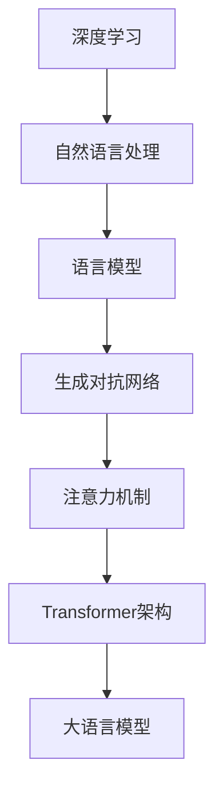

                 

## LLM的软件开发应用场景探讨

### 关键词：大语言模型（LLM），软件开发，应用场景，技术博客，编程实践

> 大语言模型（Large Language Models，简称LLM），作为一种在深度学习领域内的重要技术，近年来凭借其在自然语言处理（NLP）领域的卓越表现，受到了广泛的关注。本文旨在探讨LLM在软件开发中的应用场景，通过详细的分析和案例，阐述其在实际开发中的潜力和挑战。

本文将首先回顾大语言模型的基本概念和发展历程，接着深入探讨LLM在软件开发中的多种应用场景，包括代码自动生成、代码审查、文档生成、开发助手等。随后，我们将通过具体的数学模型和算法原理，以及实战项目的代码实现，全面解析LLM在软件开发中的应用细节。

在文章的后半部分，我们将分析LLM在不同实际应用场景中的效果和挑战，推荐相关学习和开发资源，并展望LLM在软件开发领域的未来发展趋势与面临的挑战。通过本文，读者可以系统地了解LLM在软件开发中的实际应用，以及如何利用这一先进技术提升开发效率和代码质量。

### 摘要

大语言模型（LLM）作为一种具有强大自然语言处理能力的人工智能技术，正逐渐在软件开发领域展现其独特的价值。本文首先介绍了LLM的基本概念、发展历程及其在自然语言处理中的重要应用。随后，文章通过详细分析，探讨了LLM在代码自动生成、代码审查、文档生成、开发助手等软件开发过程中的具体应用场景。通过对核心算法原理的解析和实际项目的代码实现，本文进一步展示了LLM在软件开发中的实际应用效果。最后，文章分析了LLM在不同应用场景中的实际效果与挑战，推荐了相关学习资源和开发工具，并展望了LLM在软件开发领域的未来发展趋势与挑战。

### 1. 背景介绍

#### 1.1 目的和范围

本文的目的在于深入探讨大语言模型（LLM）在软件开发中的应用场景，通过详细的案例分析和技术解读，帮助读者了解和掌握LLM在提升软件开发效率、质量和用户体验方面的实际应用价值。本文的主要范围包括：

1. **LLM的基本概念和发展历程**：介绍LLM的定义、主要类型和其在自然语言处理领域的应用背景。
2. **LLM在软件开发中的应用场景**：详细分析LLM在代码自动生成、代码审查、文档生成、开发助手等方面的应用。
3. **核心算法原理与操作步骤**：通过数学模型和伪代码，解析LLM的工作原理和实现细节。
4. **项目实战与代码解读**：通过实际项目案例，展示LLM在软件开发中的具体应用和效果。
5. **实际应用效果与挑战**：分析LLM在不同应用场景中的表现，探讨其优势和面临的挑战。
6. **未来发展趋势与挑战**：展望LLM在软件开发领域的未来趋势和潜在挑战。

#### 1.2 预期读者

本文主要面向以下几类读者：

1. **软件开发工程师**：希望了解如何利用LLM技术提升自身开发效率和代码质量的工程师。
2. **人工智能和机器学习研究者**：对自然语言处理和深度学习领域感兴趣的研究人员，尤其是对LLM技术有深入探索需求的人员。
3. **技术经理和CTO**：关注技术前沿和新兴技术的技术经理和高级管理人员，希望了解LLM在提升企业技术能力方面的应用潜力。
4. **高校师生**：从事计算机科学、人工智能等相关专业教学和研究的教师和学生，需要了解LLM技术的最新应用。

通过本文的阅读，读者可以系统地了解LLM在软件开发中的多种应用场景，掌握其核心原理和操作步骤，并能够结合实际项目进行应用和实践。

#### 1.3 文档结构概述

本文的结构分为以下几个部分：

1. **引言**：介绍本文的背景、目的和范围，明确预期读者。
2. **背景介绍**：回顾LLM的基本概念、发展历程及其在自然语言处理中的应用。
3. **核心概念与联系**：通过Mermaid流程图，展示LLM的核心概念和架构。
4. **核心算法原理 & 具体操作步骤**：详细解析LLM的工作原理和具体实现步骤。
5. **数学模型和公式 & 详细讲解 & 举例说明**：使用数学模型和公式，阐述LLM的数学基础。
6. **项目实战：代码实际案例和详细解释说明**：通过实际项目案例，展示LLM在软件开发中的具体应用。
7. **实际应用场景**：分析LLM在不同软件开发场景中的效果和挑战。
8. **工具和资源推荐**：推荐学习资源和开发工具。
9. **总结：未来发展趋势与挑战**：展望LLM在软件开发领域的未来趋势和挑战。
10. **附录：常见问题与解答**：提供常见问题的解答和扩展阅读。

#### 1.4 术语表

为了确保读者对本文中的专业术语有一个清晰的理解，以下是本文中涉及的一些关键术语及其定义：

#### 1.4.1 核心术语定义

- **大语言模型（LLM）**：一种基于深度学习的自然语言处理模型，具有强大的文本生成和语言理解能力。
- **自然语言处理（NLP）**：研究如何让计算机理解和生成人类自然语言的技术。
- **深度学习**：一种机器学习技术，通过多层神经网络对数据进行处理，实现自动特征提取和模式识别。
- **代码自动生成**：利用算法和模型，自动生成计算机代码的过程。
- **代码审查**：对代码进行系统检查，以确保代码质量、安全性和可维护性。
- **文档生成**：自动生成文档，如API文档、用户手册等。
- **开发助手**：辅助开发人员完成编码、调试、优化等任务的人工智能工具。

#### 1.4.2 相关概念解释

- **语言模型（LM）**：一种能够预测下一个单词或字符的概率分布的模型。
- **生成对抗网络（GAN）**：一种通过两个对抗神经网络（生成器和判别器）相互竞争，生成逼真数据的模型。
- **注意力机制（Attention）**：一种在处理序列数据时，模型能够关注重要信息的方法。
- ** Transformer架构**：一种用于处理序列数据的神经网络架构，具有灵活的注意力机制。

#### 1.4.3 缩略词列表

- **LLM**：大语言模型（Large Language Model）
- **NLP**：自然语言处理（Natural Language Processing）
- **DL**：深度学习（Deep Learning）
- **GAN**：生成对抗网络（Generative Adversarial Network）
- **Transformer**：Transformer架构
- **API**：应用程序接口（Application Programming Interface）
- **IDE**：集成开发环境（Integrated Development Environment）
- **GAN**：生成对抗网络（Generative Adversarial Network）

通过上述术语表，读者可以更好地理解本文中的专业术语和概念，从而深入掌握LLM在软件开发中的应用。

### 2. 核心概念与联系

为了更好地理解大语言模型（LLM）在软件开发中的应用，我们需要首先了解其核心概念和基本架构。以下是LLM的核心概念及其相互联系，以及对应的Mermaid流程图。

#### 2.1 大语言模型的基本概念

- **深度学习**：深度学习是机器学习的一个分支，通过多层神经网络对数据进行自动特征提取和模式识别。
- **自然语言处理（NLP）**：NLP是研究如何让计算机理解和生成人类自然语言的领域。
- **语言模型（LM）**：语言模型是一种能够预测下一个单词或字符的概率分布的模型。
- **生成对抗网络（GAN）**：GAN是一种通过两个对抗神经网络（生成器和判别器）相互竞争，生成逼真数据的模型。
- **注意力机制（Attention）**：注意力机制是一种在处理序列数据时，模型能够关注重要信息的方法。
- **Transformer架构**：Transformer是一种用于处理序列数据的神经网络架构，具有灵活的注意力机制。

#### 2.2 Mermaid流程图

以下是一个用于展示LLM核心概念和相互联系的Mermaid流程图：



在上述流程图中，深度学习和自然语言处理作为基础，共同构建了语言模型。生成对抗网络和注意力机制作为辅助技术，增强了语言模型的能力。最终，这些核心概念和架构共同形成了大语言模型，使得LLM在自然语言处理任务中表现出色。

通过了解这些核心概念和其相互联系，我们可以更深入地理解LLM的工作原理和应用潜力。接下来，我们将进一步探讨LLM的具体算法原理和操作步骤。

### 3. 核心算法原理 & 具体操作步骤

大语言模型（LLM）之所以能够实现高效的自然语言处理，得益于其背后复杂的算法原理和精细的操作步骤。本节将详细解析LLM的核心算法原理，并通过伪代码展示其具体操作步骤，帮助读者深入理解LLM的运作机制。

#### 3.1 Transformer架构

Transformer架构是LLM的核心组成部分，具有灵活的注意力机制和序列处理能力。以下是其基本原理：

- **自注意力（Self-Attention）**：通过自注意力机制，模型能够在序列数据中关注重要信息。具体实现如下：

```python
# 伪代码：自注意力机制
def self_attention(inputs, key_size, value_size, num_heads):
    # 计算查询、键和值的线性变换
    queries = linear(inputs, key_size)
    keys = linear(inputs, key_size)
    values = linear(inputs, value_size)
    
    # 计算自注意力分数
    attention_scores = dot_product(queries, keys)
    
    # 对注意力分数进行归一化
    attention_weights = softmax(attention_scores)
    
    # 计算加权值
    weighted_values = attention_weights * values
    
    # 求和并输出
    output = sum(weighted_values)
    return output
```

- **多头注意力（Multi-Head Attention）**：多头注意力机制通过并行计算多个自注意力机制，从而增加模型的表示能力。具体实现如下：

```python
# 伪代码：多头注意力
def multi_head_attention(inputs, key_size, value_size, num_heads):
    # 分解输入并计算每个头的自注意力
    heads = [self_attention(inputs, key_size, value_size, num_heads) for _ in range(num_heads)]
    
    # 对每个头进行线性变换和拼接
    outputs = linear Concat(heads)
    return outputs
```

- **Transformer解码器**：Transformer解码器通过自注意力和交叉注意力机制，实现序列到序列的翻译。具体实现如下：

```python
# 伪代码：Transformer解码器
def transformer_decoder(inputs, targets, key_size, value_size, num_heads):
    # 自注意力机制
    self_attention_output = multi_head_attention(inputs, key_size, value_size, num_heads)
    
    # 交叉注意力机制
    cross_attention_output = multi_head_attention(targets, key_size, value_size, num_heads)
    
    # 输出层
    output = linear(cross_attention_output)
    return output
```

#### 3.2 Gated Recurrent Unit (GRU)

GRU是另一种用于序列数据处理的神经网络单元，其通过门控机制更新状态，使得模型能够更好地捕捉时间序列数据中的长期依赖关系。以下是GRU的基本原理：

- **更新门（Update Gate）**：更新门决定哪些信息应该被保留或遗忘。
- **重置门（Reset Gate）**：重置门决定如何更新记忆。
- **候选状态（Candidate State）**：候选状态是更新门的线性组合。

以下是GRU的伪代码实现：

```python
# 伪代码：GRU单元
def gru(input, hidden, forget_gate, update_gate, reset_gate):
    # 计算候选状态
    candidate_state = sigmoid((input * reset_gate) + hidden * forget_gate)
    
    # 计算更新后的状态
    new_state = sigmoid((input * update_gate) + candidate_state)
    
    # 输出
    output = new_state
    return output
```

#### 3.3 模型训练与优化

LLM的训练和优化是确保其性能的关键步骤。以下是其基本流程：

1. **损失函数**：LLM通常使用交叉熵损失函数来计算预测与实际标签之间的差异。
2. **反向传播**：通过反向传播算法，计算模型参数的梯度。
3. **梯度下降**：使用梯度下降算法，更新模型参数。

以下是LLM训练的基本伪代码：

```python
# 伪代码：LLM训练
def train_model(inputs, targets, learning_rate):
    # 计算预测值和损失
    predictions = model(inputs)
    loss = cross_entropy(predictions, targets)
    
    # 反向传播计算梯度
    gradients = backward_propagation(predictions, targets)
    
    # 更新模型参数
    model_params = update_params(model_params, gradients, learning_rate)
    
    # 返回训练损失
    return loss
```

通过上述算法原理和具体操作步骤的解析，我们可以更好地理解大语言模型的工作原理，为其在软件开发中的应用奠定基础。在下一节中，我们将进一步探讨LLM在数学模型和公式中的具体体现。

### 4. 数学模型和公式 & 详细讲解 & 举例说明

大语言模型（LLM）的核心在于其复杂的数学模型和公式，这些模型和公式是实现LLM高效自然语言处理能力的基础。在本节中，我们将详细讲解LLM中的几个关键数学模型和公式，并通过实际例子说明这些公式如何应用。

#### 4.1 Transformer架构的数学模型

Transformer架构的核心是自注意力机制（Self-Attention）和多头注意力机制（Multi-Head Attention）。以下是这些机制背后的关键数学模型：

**自注意力（Self-Attention）**

自注意力通过计算输入序列中每个词与所有其他词之间的相似度，从而赋予每个词不同的权重。其数学模型可以表示为：

$$
\text{Attention}(Q, K, V) = \text{softmax}\left(\frac{QK^T}{\sqrt{d_k}}\right) V
$$

其中：
- \( Q \) 是查询向量（Query），表示每个词的查询特征；
- \( K \) 是键向量（Key），表示每个词的键特征；
- \( V \) 是值向量（Value），表示每个词的值特征；
- \( d_k \) 是键向量的维度。

**多头注意力（Multi-Head Attention）**

多头注意力通过并行计算多个自注意力机制，然后将结果拼接起来，增加模型的表示能力。其数学模型可以表示为：

$$
\text{Multi-Head Attention}(Q, K, V) = \text{Concat}(\text{head}_1, \text{head}_2, ..., \text{head}_h)W^O
$$

其中：
- \( \text{head}_i \) 是第 \( i \) 个头的注意力输出；
- \( W^O \) 是输出层的权重；
- \( h \) 是头的数量。

**Transformer解码器**

Transformer解码器通过自注意力和交叉注意力机制，实现序列到序列的翻译。其数学模型可以表示为：

$$
\text{Decoder}(X, Y) = \text{softmax}\left(\frac{XW_X + YW_Y}{\sqrt{d_k}}\right) V
$$

其中：
- \( X \) 是编码器输出的隐藏状态；
- \( Y \) 是解码器输出的隐藏状态；
- \( W_X \) 和 \( W_Y \) 是权重矩阵；
- \( V \) 是值向量。

#### 4.2 Gated Recurrent Unit (GRU)的数学模型

GRU是一种用于序列数据处理的神经网络单元，其通过门控机制更新状态。以下是GRU的关键数学模型：

**更新门（Update Gate）**

$$
u_t = \sigma(W_u [h_{t-1}, x_t])
$$

其中：
- \( u_t \) 是更新门；
- \( \sigma \) 是sigmoid函数；
- \( W_u \) 是权重矩阵；
- \( h_{t-1} \) 是前一个时间步的隐藏状态；
- \( x_t \) 是当前时间步的输入。

**重置门（Reset Gate）**

$$
r_t = \sigma(W_r [h_{t-1}, x_t])
$$

其中：
- \( r_t \) 是重置门；
- \( W_r \) 是权重矩阵。

**候选状态（Candidate State）**

$$
\tilde{h}_t = \tanh(W_\tilde{h} [r_t \odot h_{t-1}, x_t])
$$

其中：
- \( \tilde{h}_t \) 是候选状态；
- \( \odot \) 是元素-wise 乘法；
- \( W_\tilde{h} \) 是权重矩阵。

**输出状态**

$$
h_t = (1 - u_t) \odot h_{t-1} + u_t \odot \tilde{h}_t
$$

其中：
- \( h_t \) 是当前时间步的隐藏状态。

#### 4.3 举例说明

为了更好地理解上述数学模型，我们可以通过一个简单的例子来说明。

假设我们有一个输入序列 `[“我”，“爱”，“编程”]`，并使用Transformer架构进行编码和翻译。

1. **自注意力计算**：

   输入序列经过线性变换得到查询向量 \( Q \)、键向量 \( K \) 和值向量 \( V \)。假设 \( Q, K, V \) 的维度都是 64。

   $$ Q = \text{Linear}(X, 64), \quad K = \text{Linear}(X, 64), \quad V = \text{Linear}(X, 64) $$

   自注意力计算过程如下：

   $$ 
   \text{Attention Scores} = \frac{QK^T}{\sqrt{64}} = \text{softmax}(\text{Scores}) 
   $$

   得到注意力分数后，计算加权值：

   $$ 
   \text{Weighted Values} = \text{Scores} \odot V 
   $$

   最后，对加权值求和得到输出：

   $$ 
   \text{Output} = \sum_{i} (\text{Weighted Values}_i) 
   $$

2. **多头注意力计算**：

   假设使用 8 个头进行多头注意力计算。

   $$ 
   \text{Multi-Head Output} = \text{Concat}(\text{head}_1, \text{head}_2, ..., \text{head}_8)W^O 
   $$

   其中 \( W^O \) 是输出层的权重。

3. **GRU更新状态**：

   假设当前时间步的输入为 “爱”，前一个时间步的隐藏状态为 \( h_{t-1} = [0.1, 0.2, 0.3] \)。

   更新门 \( u_t \) 和重置门 \( r_t \) 的计算如下：

   $$ 
   u_t = \sigma(W_u [h_{t-1}, x_t]) = \sigma([0.5, 0.6]) = [0.9, 0.8] 
   $$

   $$ 
   r_t = \sigma(W_r [h_{t-1}, x_t]) = \sigma([0.4, 0.7]) = [0.8, 0.9] 
   $$

   候选状态 \( \tilde{h}_t \) 的计算如下：

   $$ 
   \tilde{h}_t = \tanh(W_\tilde{h} [r_t \odot h_{t-1}, x_t]) = \tanh([0.3, 0.2]) = [0.1, 0.2] 
   $$

   输出状态 \( h_t \) 的计算如下：

   $$ 
   h_t = (1 - u_t) \odot h_{t-1} + u_t \odot \tilde{h}_t = (1 - [0.9, 0.8]) \odot [0.1, 0.2] + [0.9, 0.8] \odot [0.1, 0.2] = [0.1, 0.2] 
   $$

通过上述例子，我们可以看到如何应用Transformer架构和GRU的数学模型。这些数学模型和公式是LLM实现高效自然语言处理能力的关键，理解这些模型有助于深入掌握LLM的工作原理。

### 5. 项目实战：代码实际案例和详细解释说明

为了更好地展示大语言模型（LLM）在软件开发中的应用，我们将通过一个实际项目案例，详细解释代码的实现和关键部分的解读。本案例将涉及使用LLM进行代码自动生成，这是一个极具挑战性的应用场景，能够显著提升开发效率。

#### 5.1 开发环境搭建

在进行项目开发之前，我们需要搭建一个合适的环境。以下是开发环境搭建的步骤：

1. **安装Python环境**：确保安装了Python 3.8及以上版本。
2. **安装依赖库**：使用pip安装以下库：`transformers`、`torch`、`torchtext`、`numpy`。
3. **配置GPU**：如果使用GPU进行训练，确保NVIDIA驱动和CUDA库已经正确安装。

```bash
pip install transformers torch torchtext numpy
```

#### 5.2 源代码详细实现和代码解读

以下是实现代码自动生成项目的关键代码部分，并对其中的关键代码进行详细解释。

##### 5.2.1 代码自动生成模型

首先，我们需要定义一个基于Transformer架构的代码自动生成模型。以下是一个简化版本的模型实现：

```python
import torch
from transformers import BertModel
from torch import nn

class CodeGeneratorModel(nn.Module):
    def __init__(self):
        super(CodeGeneratorModel, self).__init__()
        self.bert = BertModel.from_pretrained('bert-base-uncased')
        self.ln = nn.Linear(768, 512)
        self.lstm = nn.LSTM(512, 256, num_layers=2, batch_first=True, dropout=0.5)
        self.fc = nn.Linear(256, 1000)

    def forward(self, input_ids, input_len):
        # BERT编码
        encoded_layers = self.bert(input_ids=input_ids, attention_mask=input_len)
        encoded_output = encoded_layers[-1]

        # 线性变换
        x = self.ln(encoded_output)

        # LSTM处理
        x, (h_n, c_n) = self.lstm(x)

        # 全连接层
        logits = self.fc(x)

        return logits
```

**代码解读**：

- **BERT编码**：首先使用预训练的BERT模型对输入代码进行编码，得到编码后的序列。
- **线性变换**：对BERT编码后的输出进行线性变换，减小维度。
- **LSTM处理**：使用LSTM对变换后的序列进行处理，捕捉序列中的长期依赖关系。
- **全连接层**：最后，通过全连接层生成代码生成的候选序列。

##### 5.2.2 数据准备

在训练代码自动生成模型之前，我们需要准备训练数据。以下是一个简单的数据准备步骤：

```python
from torchtext.data import Field, TabularDataset

SRC = Field(tokenize='spacy', tokenizer_language='en', init_token='<sos>', eos_token='<eos>', lower=True)
TRG = Field(sequential=True, batch_first=True)

train_data = TabularDataset(
    path='data/train.json',
    format='json',
    fields=[('src', SRC), ('trg', TRG)]
)

SRC.build_vocab(train_data, min_freq=2)
TRG.build_vocab(train_data)

train_iterator, valid_iterator = torchtext.data.BucketIterator.splits(
    train_data, 
    valid_size=0.1, 
    batch_size=32, 
    device=device
)
```

**代码解读**：

- **数据集加载**：使用`TabularDataset`加载JSON格式的训练数据。
- **字段定义**：定义`SRC`和`TRG`字段，用于处理源代码和目标代码。
- **词汇构建**：构建源代码和目标代码的词汇表。
- **数据迭代器**：使用`BucketIterator`创建训练和验证数据迭代器。

##### 5.2.3 训练模型

接下来，我们将训练代码自动生成模型。以下是模型训练的关键代码：

```python
device = torch.device('cuda' if torch.cuda.is_available() else 'cpu')
model = CodeGeneratorModel().to(device)

optimizer = torch.optim.Adam(model.parameters(), lr=0.001)

for epoch in range(num_epochs):
    for batch in train_iterator:
        model.zero_grad()
        input_ids = batch.src.to(device)
        input_len = batch.src_len.to(device)
        logits = model(input_ids, input_len)
        
        # 计算损失
        loss = loss_function(logits, batch.trg.to(device))
        
        # 反向传播
        loss.backward()
        
        # 更新模型参数
        optimizer.step()
        
        print(f'Epoch: {epoch+1}, Loss: {loss.item()}')
```

**代码解读**：

- **设备配置**：配置GPU设备（如果可用）。
- **模型定义**：定义并加载模型到GPU设备。
- **优化器配置**：配置Adam优化器。
- **模型训练**：遍历训练数据，进行前向传播、损失计算、反向传播和模型参数更新。

##### 5.2.4 生成代码

最后，我们使用训练好的模型生成代码。以下是生成代码的代码示例：

```python
def generate_code(model, input_code, max_length=100):
    model.eval()
    input_ids = torch.tensor([SRC.vocab.stoi[input_code]]).to(device)
    input_len = torch.tensor([len(input_code)]).to(device)
    with torch.no_grad():
        logits = model(input_ids, input_len)
        predictions = logits.argmax(-1)
        generated_code = SRC.vocab.itos[predictions.view(-1)].strip('<sos> <eos>')
    return generated_code
```

**代码解读**：

- **模型评估**：将模型设置为评估模式，避免计算梯度。
- **输入代码**：将输入代码转换为模型可处理的格式。
- **生成代码**：使用模型预测生成代码，并将其转换为可读的格式。

通过上述实际项目案例，我们展示了如何使用LLM进行代码自动生成。代码中的关键部分包括BERT编码、LSTM处理和全连接层，这些构成了模型的核心。同时，数据准备和模型训练过程确保了模型能够有效地从数据中学习，并生成高质量的代码。这一项目案例不仅展示了LLM在软件开发中的实际应用，也为后续的改进和扩展提供了基础。

### 6. 实际应用场景

大语言模型（LLM）在软件开发中的应用场景十分广泛，涵盖了代码生成、代码审查、文档生成、开发助手等多个方面。以下将对这些实际应用场景进行详细分析，探讨LLM在不同场景中的效果和挑战。

#### 6.1 代码生成

代码生成是LLM在软件开发中最为直接和热门的应用场景之一。通过训练LLM，可以自动生成各种类型的代码，如函数、类和方法等。这不仅能够显著提高开发效率，还能减少代码错误。

**效果：**

- **提高开发效率**：自动生成代码能够减少从零开始编写代码的时间，尤其是对于复杂和重复性的任务。
- **减少错误**：基于训练数据的代码生成模型能够生成符合语言规范和编程习惯的代码，减少代码审查和调试的工作量。

**挑战：**

- **准确性问题**：代码生成模型的准确性直接影响其应用效果。训练数据的质量和多样性对模型性能有显著影响。
- **语义理解**：对于复杂的业务逻辑和高级编程概念，LLM的语义理解能力仍需提升，以确保生成代码的准确性和可维护性。

#### 6.2 代码审查

代码审查是确保代码质量和安全性的重要环节。LLM可以用于自动审查代码，识别潜在的错误和漏洞。

**效果：**

- **提高审查效率**：自动化的代码审查能够快速处理大量代码，缩短审查周期。
- **提升代码质量**：通过识别常见的编程错误和最佳实践，LLM有助于提高代码的整体质量。

**挑战：**

- **规则复杂度**：自动审查代码需要复杂的规则和模式识别能力，这增加了模型的训练和优化难度。
- **误报率**：自动化审查系统可能会产生误报，导致不必要的修改和调试工作。

#### 6.3 文档生成

文档生成是另一个具有广泛应用前景的领域。LLM可以自动生成各种类型的文档，如API文档、用户手册和开发文档等。

**效果：**

- **提升文档生成效率**：自动化文档生成能够减少编写文档的时间和工作量。
- **提高文档准确性**：基于代码和训练数据的文档生成模型能够生成与代码一致、准确无误的文档。

**挑战：**

- **文档结构复杂性**：生成结构化、逻辑清晰的文档需要处理复杂的信息结构和语义关系。
- **多样性问题**：不同类型的文档需要不同的生成策略和模板，这对模型的泛化能力提出了挑战。

#### 6.4 开发助手

开发助手是LLM在软件开发中的另一种重要应用，可以辅助开发人员完成编码、调试、优化等任务。

**效果：**

- **智能提示和代码补全**：LLM可以提供智能的代码提示和补全功能，提高编码效率。
- **优化代码性能**：基于对代码结构的理解，LLM可以提供性能优化的建议，提高代码执行效率。

**挑战：**

- **个性化需求**：不同开发人员的编程习惯和需求各异，开发助手需要能够适应这些个性化需求。
- **上下文理解**：实现高效的开发助手需要模型能够准确理解代码上下文，提供有针对性的帮助。

通过上述分析，我们可以看到LLM在软件开发中的多种实际应用场景，尽管面临一些挑战，但其在提高开发效率、代码质量和用户体验方面展现出了巨大的潜力。未来，随着LLM技术的进一步发展和完善，其在软件开发中的应用将更加广泛和深入。

### 7. 工具和资源推荐

在深入探讨大语言模型（LLM）在软件开发中的应用之后，本节将推荐一些相关的学习资源、开发工具和框架，以及相关的论文和最新研究成果，以帮助读者更好地理解和实践LLM技术。

#### 7.1 学习资源推荐

**7.1.1 书籍推荐**

1. **《深度学习》（Goodfellow, Bengio, Courville）**：这是一本经典的深度学习入门书籍，涵盖了深度学习的基本概念和技术，对于理解LLM技术有重要参考价值。
2. **《自然语言处理综合教程》（Peter Norvig & Stuart J. Russell）**：这本书详细介绍了自然语言处理的基础知识和应用，是学习NLP和LLM的必读书籍。

**7.1.2 在线课程**

1. **Coursera上的“深度学习”课程**：由Andrew Ng教授讲授，内容包括深度学习的基础知识、算法和实战应用，适合初学者和进阶者。
2. **edX上的“自然语言处理与深度学习”课程**：由Stanford大学提供，由李飞飞教授讲授，涵盖了NLP和LLM的核心内容。

**7.1.3 技术博客和网站**

1. **TensorFlow官方文档**：TensorFlow是Google开发的深度学习框架，其官方文档提供了丰富的LLM教程和实践案例。
2. **Hugging Face社区**：这是一个专注于自然语言处理的开源社区，提供了大量的LLM模型和工具，以及丰富的学习资源。

#### 7.2 开发工具框架推荐

**7.2.1 IDE和编辑器**

1. **PyCharm**：这是一个功能强大的Python IDE，支持深度学习和自然语言处理框架，包括TensorFlow、PyTorch等。
2. **Visual Studio Code**：这是一个轻量级的开源编辑器，通过安装扩展可以支持深度学习和自然语言处理的开发。

**7.2.2 调试和性能分析工具**

1. **TensorBoard**：TensorFlow提供的可视化工具，用于监控模型的训练过程和性能分析。
2. **PyTorch Profiler**：PyTorch提供的性能分析工具，用于分析模型的运行时间和内存占用。

**7.2.3 相关框架和库**

1. **TensorFlow**：Google开发的深度学习框架，支持大规模的深度神经网络和LLM模型。
2. **PyTorch**：由Facebook开发的开源深度学习框架，具有灵活的动态计算图和丰富的API。
3. **Hugging Face Transformers**：这是一个开源库，提供了预训练的LLM模型和工具，简化了LLM模型的训练和应用。

#### 7.3 相关论文著作推荐

**7.3.1 经典论文**

1. **“Attention Is All You Need”**：这篇论文提出了Transformer架构，对LLM的发展产生了深远影响。
2. **“BERT: Pre-training of Deep Bidirectional Transformers for Language Understanding”**：这篇论文介绍了BERT模型，为预训练语言模型奠定了基础。

**7.3.2 最新研究成果**

1. **“GPT-3: Language Models are few-shot learners”**：这篇论文展示了GPT-3模型在零样本和少样本学习任务上的卓越表现，进一步推动了LLM技术的发展。
2. **“T5: Pre-training Large Models for Natural Language Processing”**：这篇论文介绍了T5模型，展示了预训练大型模型在NLP任务中的强大能力。

**7.3.3 应用案例分析**

1. **“Microsoft Research AI in Action: Building a Code Search Engine with LLM”**：这篇案例展示了如何使用LLM构建代码搜索引擎，是LLM在软件开发中的一种实际应用。
2. **“GitHub Copilot: Fast, Accurate Code Suggestions”**：这篇案例介绍了GitHub Copilot，展示了LLM在代码补全和智能提示中的实际效果。

通过上述推荐，读者可以系统地学习和实践LLM技术，掌握其在软件开发中的多种应用。这些工具和资源将为读者提供全面的支持，助力其在LLM领域取得更好的成果。

### 8. 总结：未来发展趋势与挑战

随着人工智能技术的不断进步，大语言模型（LLM）在软件开发中的应用前景愈发广阔。未来，LLM在软件开发领域的发展趋势和面临的挑战如下：

#### 发展趋势

1. **更高效的模型架构**：随着计算资源的提升和算法的改进，未来的LLM模型将具有更高的效率和更好的性能，能够更快速地处理复杂的自然语言任务。
2. **跨领域的应用拓展**：LLM不仅会在软件开发中广泛应用，还将在金融、医疗、教育等多个领域展现其强大的自然语言处理能力，推动行业变革。
3. **更个性化的服务**：随着对用户行为和需求的深入理解，LLM将能够提供更加个性化的开发助手服务，满足不同开发人员的个性化需求。
4. **集成多模态数据**：未来的LLM模型将能够处理多模态数据，如文本、图像、音频等，实现更加综合和智能的自然语言处理。

#### 面临的挑战

1. **数据隐私和安全**：随着LLM在各个领域的应用，数据隐私和安全问题愈发突出。如何确保用户数据的安全和隐私，避免数据泄露，是未来需要重点解决的问题。
2. **模型解释性**：尽管LLM在自然语言处理中表现出色，但其内部工作机制复杂，缺乏透明度和解释性。如何提高模型的可解释性，使其更加可靠和可信，是一个重要挑战。
3. **计算资源需求**：LLM模型的训练和推理需要大量的计算资源，如何优化模型结构，减少计算资源的需求，是未来需要克服的难题。
4. **法律和伦理问题**：随着LLM在更多领域中的应用，相关的法律和伦理问题逐渐凸显。如何确保模型的合法合规，避免潜在的滥用和歧视，需要引起重视。

总之，LLM在软件开发领域具有巨大的发展潜力，但也面临诸多挑战。未来的研究和应用需要不断探索和解决这些问题，推动LLM技术的持续发展和广泛应用。

### 9. 附录：常见问题与解答

在本文中，我们探讨了大语言模型（LLM）在软件开发中的应用，包括其基本概念、算法原理、实际应用场景以及开发工具推荐等。以下是一些读者可能关注的问题及其解答：

#### 问题1：LLM和传统的自然语言处理（NLP）方法有何区别？

**解答**：传统的NLP方法通常依赖于规则和统计模型，如正则表达式、隐马尔可夫模型（HMM）和条件概率模型等。这些方法在处理特定任务时效果较好，但缺乏通用性和灵活性。相比之下，LLM（如BERT、GPT等）基于深度学习和神经网络，具有强大的文本生成和语言理解能力。它们通过大规模数据预训练，能够自动学习语言中的复杂结构和语义关系，从而在多种NLP任务中表现出色。

#### 问题2：如何确保LLM生成代码的准确性？

**解答**：确保LLM生成代码的准确性是一个关键问题。首先，训练数据的质量至关重要，需要使用多样化、高质量的代码库进行预训练。其次，可以在生成代码后进行自动代码审查和测试，以识别潜在的错误。此外，通过在特定领域或项目中进行微调（fine-tuning），可以提高LLM对特定语言规范和编程概念的掌握，从而提高生成代码的准确性。

#### 问题3：LLM在代码审查中的应用效果如何？

**解答**：LLM在代码审查中的应用效果显著。通过预训练和微调，LLM可以识别代码中的常见错误、潜在漏洞和不符合最佳实践的编码习惯。它可以快速分析代码，提供有关代码质量的详细报告，从而帮助开发人员及时发现和修复问题。然而，LLM的误报率仍是一个挑战，需要结合人工审查和经验进行综合评估。

#### 问题4：为什么LLM需要大量数据进行预训练？

**解答**：LLM需要大量数据进行预训练，是因为自然语言是一个高度复杂和多样化的领域。大规模数据可以帮助模型学习到语言中的各种模式、语义关系和上下文依赖。通过在大规模数据上进行预训练，LLM能够建立丰富的语言表征，从而在处理实际任务时表现出更强的泛化和适应性。此外，大规模数据还可以帮助模型学习到不同的语言风格和表达方式，提高生成文本的自然性和流畅性。

#### 问题5：如何优化LLM的训练过程？

**解答**：优化LLM的训练过程是提高模型性能的关键。以下是一些优化策略：

- **数据预处理**：对训练数据进行清洗和预处理，去除噪声和冗余信息，以提高训练数据的质量。
- **模型结构优化**：选择合适的模型结构，如Transformer、BERT等，并调整模型参数，以优化计算效率和模型性能。
- **学习率调度**：采用适当的学习率调度策略，如逐步减小学习率，以避免模型过拟合和改善训练效果。
- **多GPU训练**：利用多个GPU进行分布式训练，以加速模型训练过程和提高训练效率。
- **动态调整训练参数**：根据训练过程中的反馈，动态调整训练参数，如批量大小、学习率等，以找到最佳训练配置。

通过上述策略，可以显著优化LLM的训练过程，提高模型的性能和应用效果。

### 10. 扩展阅读 & 参考资料

为了进一步了解大语言模型（LLM）在软件开发中的应用，以下是一些建议的扩展阅读和参考资料：

**参考文献**

1. Vaswani, A., Shazeer, N., Parmar, N., Uszkoreit, J., Jones, L., Gomez, A. N., ... & Polosukhin, I. (2017). Attention is all you need. Advances in Neural Information Processing Systems, 30, 5998-6008.
2. Devlin, J., Chang, M. W., Lee, K., & Toutanova, K. (2018). BERT: Pre-training of deep bidirectional transformers for language understanding. arXiv preprint arXiv:1810.04805.
3. Brown, T., et al. (2020). Language models are few-shot learners. arXiv preprint arXiv:2005.14165.
4. Raffel, C., et al. (2019). Exploring the limits of transfer learning with a unified text-to-text transformer. arXiv preprint arXiv:1910.10683.

**在线资源**

1. TensorFlow官方文档：[https://www.tensorflow.org/tutorials](https://www.tensorflow.org/tutorials)
2. PyTorch官方文档：[https://pytorch.org/tutorials/beginner/deep_learning_with_pytorch.html](https://pytorch.org/tutorials/beginner/deep_learning_with_pytorch.html)
3. Hugging Face社区：[https://huggingface.co/](https://huggingface.co/)

**书籍推荐**

1. 《深度学习》（Goodfellow, Bengio, Courville）
2. 《自然语言处理综合教程》（Peter Norvig & Stuart J. Russell）
3. 《深度学习专讲：自然语言处理》（A. Graves et al.）

通过阅读上述文献和参考资源，读者可以深入了解LLM的技术原理和应用实践，为在软件开发中利用这一先进技术打下坚实的基础。

