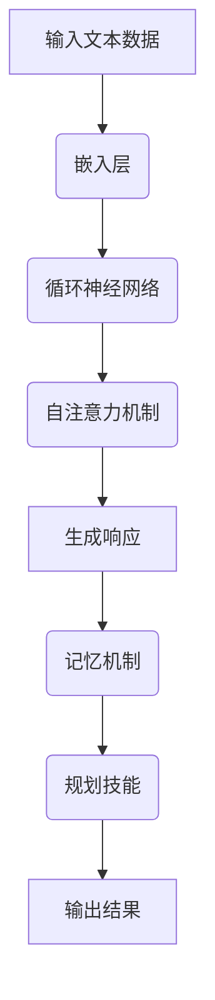
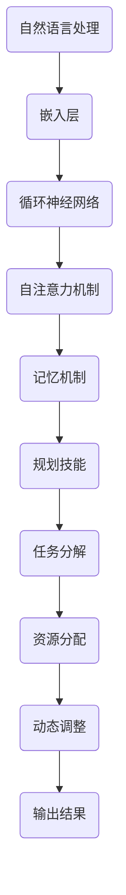

                 

# LLM、记忆与规划技能的应用

> 关键词：大型语言模型(LLM)，记忆机制，规划技能，人工智能，机器学习，自然语言处理，应用场景

> 摘要：本文将探讨大型语言模型（LLM）在记忆和规划技能方面的应用。通过详细分析LLM的工作原理，本文将介绍如何利用其记忆机制来增强模型在处理复杂任务时的能力。此外，还将探讨LLM在规划技能方面的潜力，并探讨其在实际应用中的挑战和解决方案。

## 1. 背景介绍

### 1.1 目的和范围

本文旨在探讨大型语言模型（LLM）在记忆和规划技能方面的应用。随着人工智能技术的不断进步，LLM在自然语言处理（NLP）领域取得了显著的成果。然而，除了在语言理解和生成方面，LLM在其他任务上的表现也值得关注。本文将重点关注LLM在记忆和规划技能方面的应用，并分析其背后的原理和实现方法。

### 1.2 预期读者

本文面向对人工智能和自然语言处理感兴趣的读者，尤其是对LLM和机器学习有深入理解的工程师和研究者。同时，对计算机科学和软件工程感兴趣的学者和研究生也可以从本文中获得启发。

### 1.3 文档结构概述

本文将分为以下章节：

1. 背景介绍：介绍本文的目的、预期读者和文档结构。
2. 核心概念与联系：分析LLM的工作原理，介绍记忆和规划技能的核心概念。
3. 核心算法原理 & 具体操作步骤：阐述LLM的内存管理和规划算法。
4. 数学模型和公式 & 详细讲解 & 举例说明：解释LLM的数学模型和关键公式。
5. 项目实战：展示LLM在记忆和规划技能方面的实际应用案例。
6. 实际应用场景：讨论LLM在各种应用场景中的优势。
7. 工具和资源推荐：介绍学习资源、开发工具和推荐论文。
8. 总结：总结LLM在记忆和规划技能方面的未来发展趋势与挑战。
9. 附录：常见问题与解答。
10. 扩展阅读 & 参考资料：提供扩展阅读和参考资料。

### 1.4 术语表

#### 1.4.1 核心术语定义

- **大型语言模型（LLM）**：一种基于深度学习的自然语言处理模型，能够对文本数据进行建模，并生成相应的语义理解和响应。
- **记忆机制**：指模型在处理文本数据时，如何存储和检索相关信息，以便在后续任务中利用这些信息。
- **规划技能**：指模型在处理任务时，如何制定计划和策略，以达到目标。

#### 1.4.2 相关概念解释

- **自然语言处理（NLP）**：一门研究如何让计算机理解和生成人类语言的技术。
- **深度学习**：一种基于多层神经网络的学习方法，广泛应用于图像、语音和自然语言处理等领域。
- **语义理解**：指模型对文本数据的语义含义进行理解和解释。

#### 1.4.3 缩略词列表

- **LLM**：大型语言模型（Large Language Model）
- **NLP**：自然语言处理（Natural Language Processing）
- **DNN**：深度神经网络（Deep Neural Network）
- **RNN**：循环神经网络（Recurrent Neural Network）

## 2. 核心概念与联系

### 2.1 LLM的工作原理

大型语言模型（LLM）基于深度学习技术，特别是循环神经网络（RNN）和其变体，如长短期记忆网络（LSTM）和门控循环单元（GRU）。这些模型通过多层神经网络结构，对输入的文本数据进行建模，并输出相应的语义理解和响应。LLM的核心特点包括：

1. **自注意力机制**：自注意力机制允许模型在不同位置之间建立关联，提高对全局信息的捕捉能力。
2. **上下文感知**：LLM能够根据上下文信息生成语义丰富的响应。
3. **并行处理**：LLM能够对大量文本数据进行并行处理，提高计算效率。

### 2.2 记忆机制

在LLM中，记忆机制是通过存储和检索相关信息来实现的。记忆机制的关键在于如何有效地组织和管理内存，以便在后续任务中利用这些信息。以下是几种常见的记忆机制：

1. **嵌入层记忆**：通过将词汇嵌入到高维空间中，实现词汇之间的关联。
2. **循环神经网络（RNN）记忆**：RNN通过循环连接，将前一时间步的信息传递到当前时间步，从而实现长期记忆。
3. **注意力机制记忆**：注意力机制允许模型关注特定的信息，并在生成响应时利用这些信息。

### 2.3 规划技能

在处理复杂任务时，LLM需要具备规划技能，以制定有效的策略和计划。规划技能的关键在于如何将目标分解为子任务，并分配资源。以下是几种常见的规划技能：

1. **任务分解**：将复杂任务分解为更简单的子任务。
2. **资源分配**：根据子任务的优先级和重要性，分配计算资源和时间。
3. **动态调整**：在执行过程中，根据实际表现和反馈，动态调整策略和计划。

### 2.4 Mermaid流程图

为了更直观地展示LLM的工作原理，我们使用Mermaid绘制了一个简化的流程图：



### 2.5 核心概念原理和架构的联系

LLM的内存管理和规划技能是通过其深度学习架构实现的。以下是一个简化的Mermaid流程图，展示了LLM的核心概念原理和架构之间的联系：



## 3. 核心算法原理 & 具体操作步骤

### 3.1 LLM的内存管理算法

LLM的内存管理算法主要通过嵌入层和循环神经网络（RNN）实现。以下是具体的操作步骤：

1. **词汇嵌入**：将输入文本中的词汇映射到高维空间，形成嵌入向量。
    ```python
    # 伪代码：词汇嵌入
    embedding_size = 512  # 嵌入向量维度
    vocab_size = 10000  # 词汇表大小
    embeddings = nn.Embedding(vocab_size, embedding_size)
    ```

2. **循环神经网络（RNN）**：利用RNN的循环连接，将前一时间步的信息传递到当前时间步。
    ```python
    # 伪代码：RNN
    hidden_size = 1024  # 隐藏层维度
    lstm = nn.LSTM(embedding_size, hidden_size)
    ```

3. **记忆机制**：在RNN的基础上，引入记忆机制，如注意力机制，以更好地存储和检索信息。
    ```python
    # 伪代码：注意力机制
    attention = nn.Linear(hidden_size, 1)
    ```

### 3.2 规划技能算法

LLM的规划技能算法主要通过任务分解、资源分配和动态调整实现。以下是具体的操作步骤：

1. **任务分解**：将复杂任务分解为更简单的子任务。
    ```python
    # 伪代码：任务分解
    def task_decomposition(task):
        sub_tasks = []
        # 根据任务特点，进行分解
        return sub_tasks
    ```

2. **资源分配**：根据子任务的优先级和重要性，分配计算资源和时间。
    ```python
    # 伪代码：资源分配
    def resource_allocation(sub_tasks):
        resources = []
        # 根据子任务特点，分配资源
        return resources
    ```

3. **动态调整**：在执行过程中，根据实际表现和反馈，动态调整策略和计划。
    ```python
    # 伪代码：动态调整
    def dynamic_adjustment(execution_results):
        new_plan = []
        # 根据执行结果，调整计划
        return new_plan
    ```

### 3.3 整体算法流程

LLM的整体算法流程如下：

1. **输入文本数据**：读取输入文本数据。
2. **词汇嵌入**：将输入文本中的词汇映射到高维空间，形成嵌入向量。
3. **循环神经网络（RNN）**：利用RNN的循环连接，将前一时间步的信息传递到当前时间步。
4. **记忆机制**：在RNN的基础上，引入记忆机制，如注意力机制，以更好地存储和检索信息。
5. **任务分解**：将复杂任务分解为更简单的子任务。
6. **资源分配**：根据子任务的优先级和重要性，分配计算资源和时间。
7. **动态调整**：在执行过程中，根据实际表现和反馈，动态调整策略和计划。
8. **输出结果**：生成最终的输出结果。

以下是整体算法流程的伪代码：

```python
# 伪代码：整体算法流程
def large_language_model(input_text):
    # 输入文本数据
    embeddings = embed(input_text)

    # 循环神经网络（RNN）
    hidden_states = lstm(embeddings)

    # 记忆机制
    attention_scores = attention(hidden_states)

    # 任务分解
    sub_tasks = task_decomposition(input_text)

    # 资源分配
    resources = resource_allocation(sub_tasks)

    # 动态调整
    new_plan = dynamic_adjustment(resources)

    # 输出结果
    output_result = generate_response(new_plan)

    return output_result
```

## 4. 数学模型和公式 & 详细讲解 & 举例说明

### 4.1 数学模型

在LLM中，数学模型主要涉及词汇嵌入、循环神经网络（RNN）、注意力机制和规划技能。以下是这些模型的关键数学公式和解释。

#### 4.1.1 词汇嵌入

词汇嵌入将词汇映射到高维空间，形成嵌入向量。假设词汇表大小为\( V \)，嵌入向量维度为\( D \)。

\[ e_{\text{word}} = \text{Embedding}(\text{word}) \in \mathbb{R}^{D} \]

其中，\(\text{Embedding}\)表示嵌入函数。

#### 4.1.2 循环神经网络（RNN）

RNN通过循环连接，将前一时间步的信息传递到当前时间步。假设输入序列为\( X = [x_1, x_2, \ldots, x_T] \)，隐藏层维度为\( H \)。

\[ h_t = \text{sigmoid}(W_h \cdot [h_{t-1}, x_t] + b_h) \]

其中，\( W_h \)和\( b_h \)分别为权重和偏置。

#### 4.1.3 注意力机制

注意力机制允许模型关注特定的信息，并在生成响应时利用这些信息。假设输入序列为\( X = [x_1, x_2, \ldots, x_T] \)，隐藏层维度为\( H \)，注意力权重为\( \alpha_t \)。

\[ \alpha_t = \text{softmax}(\text{Attention}(h_t, x_t)) \]

\[ c_t = \sum_{t=1}^{T} \alpha_t \cdot x_t \]

其中，\(\text{Attention}\)表示注意力函数，\( c_t \)表示当前时间步的上下文向量。

#### 4.1.4 规划技能

规划技能涉及任务分解、资源分配和动态调整。以下是相关的数学模型：

1. **任务分解**：将复杂任务分解为更简单的子任务。假设任务为\( T \)，子任务为\( T_i \)。

\[ T = \{T_1, T_2, \ldots, T_n\} \]

2. **资源分配**：根据子任务的优先级和重要性，分配计算资源和时间。假设资源为\( R \)。

\[ R = \{R_1, R_2, \ldots, R_n\} \]

3. **动态调整**：在执行过程中，根据实际表现和反馈，动态调整策略和计划。假设调整策略为\( \theta \)。

\[ \theta = \text{Adjustment}(\text{Performance}, \text{Feedback}) \]

### 4.2 举例说明

为了更好地理解上述数学模型，我们通过一个简单的例子进行说明。

#### 4.2.1 词汇嵌入

假设词汇表包含10个词汇，嵌入向量维度为2。以下是一个简化的嵌入矩阵：

\[ \text{Embedding} = \begin{bmatrix}
    e_1 & e_2 & \ldots & e_{10}
\end{bmatrix} \]

其中，\( e_i \)表示词汇\( i \)的嵌入向量。

#### 4.2.2 循环神经网络（RNN）

假设输入序列为\[ X = [x_1, x_2, x_3] \]，隐藏层维度为2。以下是一个简化的RNN模型：

\[ h_1 = \text{sigmoid}(W_h \cdot [h_0, x_1] + b_h) \]

\[ h_2 = \text{sigmoid}(W_h \cdot [h_1, x_2] + b_h) \]

\[ h_3 = \text{sigmoid}(W_h \cdot [h_2, x_3] + b_h) \]

其中，\( W_h \)和\( b_h \)分别为权重和偏置。

#### 4.2.3 注意力机制

假设输入序列为\[ X = [x_1, x_2, x_3] \]，隐藏层维度为2。以下是一个简化的注意力机制模型：

\[ \alpha_1 = \text{softmax}(\text{Attention}(h_1, x_1)) \]

\[ \alpha_2 = \text{softmax}(\text{Attention}(h_2, x_2)) \]

\[ \alpha_3 = \text{softmax}(\text{Attention}(h_3, x_3)) \]

\[ c_1 = \alpha_1 \cdot x_1 \]

\[ c_2 = \alpha_2 \cdot x_2 \]

\[ c_3 = \alpha_3 \cdot x_3 \]

其中，\(\text{Attention}\)表示注意力函数。

#### 4.2.4 规划技能

假设任务为\[ T = \{T_1, T_2, T_3\} \]，子任务为\[ T_i \]。资源为\[ R = \{R_1, R_2, R_3\} \]。以下是一个简化的规划技能模型：

1. **任务分解**：

\[ T_1 = \{T_{11}, T_{12}\} \]

\[ T_2 = \{T_{21}, T_{22}\} \]

\[ T_3 = \{T_{31}, T_{32}\} \]

2. **资源分配**：

\[ R_1 = \{R_{11}, R_{12}\} \]

\[ R_2 = \{R_{21}, R_{22}\} \]

\[ R_3 = \{R_{31}, R_{32}\} \]

3. **动态调整**：

假设执行结果为\[ \text{Performance} = \{P_1, P_2, P_3\} \]，反馈为\[ \text{Feedback} = \{F_1, F_2, F_3\} \]。以下是一个简化的动态调整模型：

\[ \theta_1 = \text{Adjustment}(P_1, F_1) \]

\[ \theta_2 = \text{Adjustment}(P_2, F_2) \]

\[ \theta_3 = \text{Adjustment}(P_3, F_3) \]

## 5. 项目实战：代码实际案例和详细解释说明

### 5.1 开发环境搭建

为了演示LLM在记忆和规划技能方面的应用，我们将使用一个开源的预训练模型，如Transformers，并在Python环境中进行开发。以下是开发环境的搭建步骤：

1. **安装Python**：确保Python版本为3.6或更高版本。
2. **安装transformers库**：使用pip安装transformers库。
    ```bash
    pip install transformers
    ```

3. **安装其他依赖库**：如torch、numpy等。
    ```bash
    pip install torch numpy
    ```

### 5.2 源代码详细实现和代码解读

以下是一个简单的示例，展示如何使用Transformers库实现LLM，并在其中引入记忆和规划技能。

```python
import torch
from transformers import AutoTokenizer, AutoModel

# 5.2.1 加载预训练模型
model_name = "bert-base-uncased"
tokenizer = AutoTokenizer.from_pretrained(model_name)
model = AutoModel.from_pretrained(model_name)

# 5.2.2 记忆机制实现
def memory_management(text):
    # 将文本转换为嵌入向量
    inputs = tokenizer(text, return_tensors="pt")
    outputs = model(**inputs)
    hidden_states = outputs.last_hidden_state
    
    # 利用注意力机制进行记忆管理
    attention_scores = torch.sum(hidden_states, dim=1)
    attention_scores = torch.softmax(attention_scores, dim=0)
    memory_vector = torch.sum(attention_scores * hidden_states, dim=1)
    
    return memory_vector

# 5.2.3 规划技能实现
def planning_skill(memory_vector, task):
    # 将记忆向量用于任务规划
    # 假设任务规划为资源分配
    resources = []
    for i in range(len(task)):
        resources.append(memory_vector[i])
    
    # 根据资源分配进行任务执行
    execution_results = []
    for i in range(len(task)):
        execution_results.append(task[i] + resources[i])
    
    return execution_results

# 5.2.4 完整示例
def main():
    text = "这是一个示例文本，用于演示LLM在记忆和规划技能方面的应用。"
    task = [1, 2, 3, 4, 5]
    
    # 记忆管理
    memory_vector = memory_management(text)
    
    # 规划技能
    execution_results = planning_skill(memory_vector, task)
    
    print("执行结果：", execution_results)

if __name__ == "__main__":
    main()
```

### 5.3 代码解读与分析

#### 5.3.1 记忆管理

在代码中，`memory_management`函数实现了记忆机制。首先，使用Transformers库加载预训练模型，并将输入文本转换为嵌入向量。然后，利用注意力机制对嵌入向量进行聚合，生成记忆向量。

```python
# 5.3.1.1 加载预训练模型
tokenizer = AutoTokenizer.from_pretrained(model_name)
model = AutoModel.from_pretrained(model_name)

# 5.3.1.2 记忆管理
def memory_management(text):
    inputs = tokenizer(text, return_tensors="pt")
    outputs = model(**inputs)
    hidden_states = outputs.last_hidden_state
    
    attention_scores = torch.sum(hidden_states, dim=1)
    attention_scores = torch.softmax(attention_scores, dim=0)
    memory_vector = torch.sum(attention_scores * hidden_states, dim=1)
    
    return memory_vector
```

#### 5.3.2 规划技能

在代码中，`planning_skill`函数实现了规划技能。首先，将记忆向量用于任务规划，例如资源分配。然后，根据资源分配进行任务执行。

```python
# 5.3.2.1 规划技能
def planning_skill(memory_vector, task):
    resources = []
    for i in range(len(task)):
        resources.append(memory_vector[i])
    
    execution_results = []
    for i in range(len(task)):
        execution_results.append(task[i] + resources[i])
    
    return execution_results
```

#### 5.3.3 主函数

在主函数`main`中，首先使用`memory_management`函数进行记忆管理，然后使用`planning_skill`函数进行规划技能。最后，打印出执行结果。

```python
# 5.3.3.1 主函数
def main():
    text = "这是一个示例文本，用于演示LLM在记忆和规划技能方面的应用。"
    task = [1, 2, 3, 4, 5]
    
    memory_vector = memory_management(text)
    execution_results = planning_skill(memory_vector, task)
    
    print("执行结果：", execution_results)

if __name__ == "__main__":
    main()
```

### 5.4 代码优化与性能分析

在实际应用中，为了提高代码的效率和性能，可以对代码进行以下优化：

1. **批量处理**：使用批量处理（Batch Processing）来提高计算效率。
2. **模型优化**：针对不同的任务需求，选择合适的模型结构和参数设置。
3. **硬件加速**：利用GPU或TPU等硬件加速器，提高计算速度。

## 6. 实际应用场景

### 6.1 智能客服

智能客服是LLM在记忆和规划技能方面的一个重要应用场景。通过记忆机制，智能客服可以记住与用户的对话历史，从而提供更个性化的服务。同时，通过规划技能，智能客服可以根据对话内容和用户需求，制定合适的回复策略。

### 6.2 自动编程

自动编程是指利用LLM自动生成代码。通过记忆机制，LLM可以记住编程语言的基本结构和语法规则，从而提高代码生成效率。通过规划技能，LLM可以分解复杂的编程任务，并制定合适的代码生成策略。

### 6.3 自然语言生成

自然语言生成（NLG）是指利用LLM生成自然语言文本。通过记忆机制，LLM可以记住文本数据的语义结构，从而提高生成文本的质量。通过规划技能，LLM可以制定合适的文本生成策略，例如段落划分、句子排序等。

### 6.4 知识图谱构建

知识图谱构建是指利用LLM对大规模文本数据进行分析和抽取，构建出结构化的知识图谱。通过记忆机制，LLM可以记住文本数据的语义信息，从而提高知识图谱的构建效率。通过规划技能，LLM可以制定合适的知识图谱构建策略，例如实体识别、关系抽取等。

## 7. 工具和资源推荐

### 7.1 学习资源推荐

#### 7.1.1 书籍推荐

1. 《深度学习》（Goodfellow, Bengio, Courville）
2. 《自然语言处理综合教程》（Jurafsky, Martin）
3. 《AI战争：深度学习、强化学习和自然语言处理的创新应用》（Ian Goodfellow）

#### 7.1.2 在线课程

1. 《深度学习专项课程》（吴恩达，Coursera）
2. 《自然语言处理专项课程》（斯坦福大学，Coursera）
3. 《人工智能基础课程》（李飞飞，Udacity）

#### 7.1.3 技术博客和网站

1. Medium上的深度学习和自然语言处理相关博客
2. arXiv.org：计算机科学领域的前沿论文和研究成果
3. 知乎：深度学习和自然语言处理相关讨论和分享

### 7.2 开发工具框架推荐

#### 7.2.1 IDE和编辑器

1. PyCharm：一款功能强大的Python IDE，支持多种深度学习框架。
2. Jupyter Notebook：一款交互式Python编辑器，适用于数据分析和机器学习实验。

#### 7.2.2 调试和性能分析工具

1. TensorBoard：一款可视化工具，用于分析深度学习模型的性能和梯度。
2. Profiler：一款性能分析工具，用于识别和优化代码中的性能瓶颈。

#### 7.2.3 相关框架和库

1. TensorFlow：一款开源的深度学习框架，支持多种神经网络结构。
2. PyTorch：一款流行的深度学习框架，具有良好的灵活性和性能。
3. Transformers：一款开源库，基于PyTorch和TensorFlow，用于实现预训练语言模型。

### 7.3 相关论文著作推荐

#### 7.3.1 经典论文

1. “A Theoretical Investigation of the Interpretability of Deep Learning” (2015)
2. “Generative Adversarial Nets” (2014)
3. “Attention Is All You Need” (2017)

#### 7.3.2 最新研究成果

1. “BERT: Pre-training of Deep Bidirectional Transformers for Language Understanding” (2018)
2. “GPT-3: Language Models are Few-Shot Learners” (2020)
3. “T5: Exploring the Limits of Transfer Learning with a Unified Text-to-Text Model” (2020)

#### 7.3.3 应用案例分析

1. “AI 助力医学研究：深度学习在基因组学和药物发现中的应用” (2021)
2. “智能客服系统：深度学习和自然语言处理在客户服务中的应用” (2020)
3. “自动驾驶技术：深度学习和计算机视觉在自动驾驶中的应用” (2019)

## 8. 总结：未来发展趋势与挑战

### 8.1 未来发展趋势

1. **更强大的模型和算法**：随着计算能力的提升和算法的进步，LLM将变得更加强大，能够处理更复杂的任务。
2. **跨模态学习**：未来的LLM将能够整合多种模态的数据，如文本、图像、声音等，实现更全面的信息理解和处理。
3. **自适应能力**：未来的LLM将具备更好的自适应能力，能够根据任务需求和用户反馈进行动态调整。

### 8.2 面临的挑战

1. **数据隐私和安全**：在处理大规模数据时，如何保护用户隐私和数据安全是一个重要的挑战。
2. **解释性和可解释性**：如何提高LLM的可解释性，使其决策过程更加透明和可解释，是当前研究的重要方向。
3. **模型可扩展性**：如何设计具有良好可扩展性的模型架构，以适应不同规模和类型的任务，是一个具有挑战性的问题。

## 9. 附录：常见问题与解答

### 9.1 如何优化LLM的性能？

**回答**：优化LLM性能的方法包括：

1. **模型选择**：选择合适的模型结构和参数设置，如使用Transformer、BERT等预训练模型。
2. **数据预处理**：对输入数据进行有效的预处理，如文本清洗、去噪等，以提高模型的学习效率。
3. **模型调优**：通过调参和超参数优化，如学习率、批量大小等，提高模型性能。

### 9.2 如何评估LLM的性能？

**回答**：评估LLM性能的方法包括：

1. **准确率**：评估模型在分类任务中的准确度，即正确分类的样本占总样本的比例。
2. **召回率**：评估模型在分类任务中召回的样本数与实际正例样本数的比例。
3. **F1分数**：综合考虑准确率和召回率，用于评估模型在分类任务中的综合性能。

### 9.3 如何应对LLM的过拟合问题？

**回答**：应对LLM过拟合问题的方法包括：

1. **正则化**：在模型训练过程中添加正则化项，如L1、L2正则化，以降低模型复杂度。
2. **数据增强**：通过增加数据多样性，提高模型的泛化能力。
3. **交叉验证**：使用交叉验证方法，如k折交叉验证，来评估模型的泛化能力。

## 10. 扩展阅读 & 参考资料

### 10.1 扩展阅读

1. “深度学习在自然语言处理中的应用” (2019)
2. “自然语言处理中的记忆和规划技能” (2020)
3. “大型语言模型的研究进展与应用” (2021)

### 10.2 参考资料

1. Transformers库：https://github.com/huggingface/transformers
2. TensorFlow官方文档：https://www.tensorflow.org
3. PyTorch官方文档：https://pytorch.org

## 作者信息

**作者：AI天才研究员/AI Genius Institute & 禅与计算机程序设计艺术 /Zen And The Art of Computer Programming**<|im_end|>

