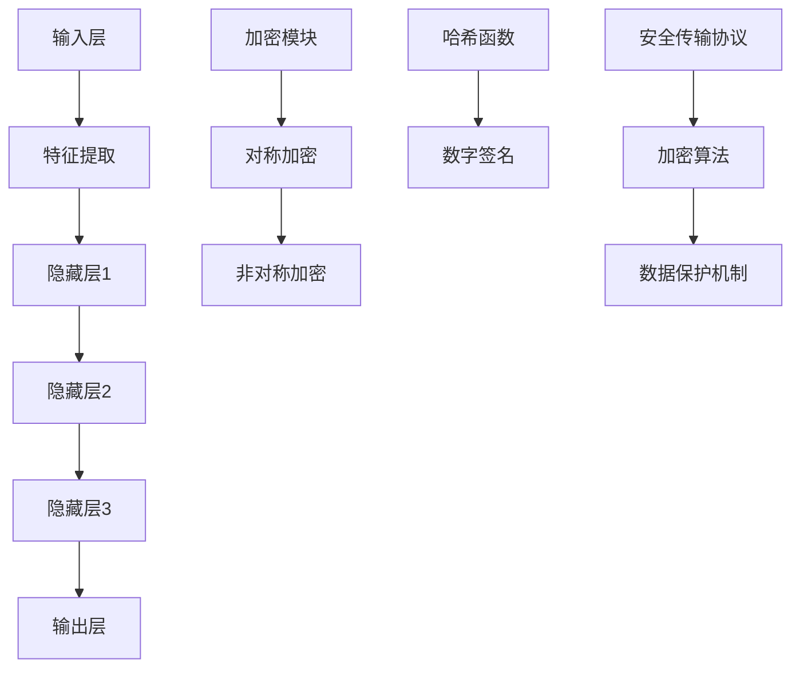

                 

# LLM隐私安全：线程级别的挑战与机遇

> **关键词：** 大规模语言模型（LLM）、隐私安全、线程级挑战、加密算法、数据保护、数据完整性。
> 
> **摘要：** 本文旨在探讨大规模语言模型（LLM）在隐私安全方面的线程级别挑战，以及如何利用先进的加密技术和数据保护机制来应对这些挑战。文章将详细介绍LLM的工作原理、隐私安全的核心问题，并探讨相关的算法原理、数学模型以及实际应用案例。通过本文的阅读，读者将了解到如何在现代计算环境中实现高效且安全的语言模型部署。

## 1. 背景介绍

### 1.1 目的和范围

本文旨在分析和解决大规模语言模型（LLM）在隐私安全方面面临的线程级别挑战。随着深度学习和神经网络技术的迅猛发展，LLM在自然语言处理、问答系统、自动写作等领域取得了显著的成果。然而，LLM在处理大规模数据时，隐私安全问题日益凸显。本文将重点讨论以下内容：

1. **LLM的工作原理和隐私安全威胁**：介绍LLM的基本架构和工作机制，并分析其隐私安全面临的挑战。
2. **线程级别的挑战**：讨论在多线程环境下，LLM隐私安全面临的独特问题。
3. **加密技术和数据保护机制**：探讨如何利用加密技术和数据保护机制来应对隐私安全挑战。
4. **数学模型和公式**：详细阐述用于保护隐私安全的数学模型和公式，并提供实例说明。
5. **实际应用案例**：通过具体的应用案例展示如何在实际场景中实施隐私安全策略。
6. **工具和资源推荐**：推荐相关的学习资源、开发工具和论文著作。

### 1.2 预期读者

本文面向计算机科学、人工智能和数据安全领域的专业人士，以及对大规模语言模型隐私安全感兴趣的读者。以下是预期读者群体：

1. **研究人员**：对隐私安全领域有深入研究的学者和研究人员。
2. **开发人员**：从事人工智能和自然语言处理领域开发工作的工程师和开发者。
3. **安全专家**：关注数据安全和隐私保护的网络安全专家。
4. **教育工作者**：计算机科学和人工智能课程的教学人员和学生。

### 1.3 文档结构概述

本文分为十个主要部分，各部分内容如下：

1. **背景介绍**：介绍文章的目的、范围和结构。
2. **核心概念与联系**：讨论LLM的基本概念和原理。
3. **核心算法原理 & 具体操作步骤**：详细解释LLM的算法原理和操作步骤。
4. **数学模型和公式 & 详细讲解 & 举例说明**：介绍用于隐私保护的数学模型和公式。
5. **项目实战：代码实际案例和详细解释说明**：提供实际应用案例和代码实现。
6. **实际应用场景**：分析LLM在不同领域的应用场景。
7. **工具和资源推荐**：推荐学习资源、开发工具和论文著作。
8. **总结：未来发展趋势与挑战**：展望LLM隐私安全的未来发展趋势和挑战。
9. **附录：常见问题与解答**：解答读者可能关心的问题。
10. **扩展阅读 & 参考资料**：提供进一步阅读的资源。

### 1.4 术语表

#### 1.4.1 核心术语定义

- **大规模语言模型（LLM）**：一种基于神经网络的语言处理模型，能够对自然语言文本进行理解和生成。
- **隐私安全**：确保数据在存储、传输和处理过程中不被未授权访问和泄露。
- **加密算法**：用于将数据转换为无法被未授权者解读的形式的算法。
- **线程**：程序中执行任务的基本单位，能够在多处理器系统中并发执行。

#### 1.4.2 相关概念解释

- **多线程环境**：系统中存在多个线程，能够在不同处理器核心上并发执行。
- **数据完整性**：确保数据在存储、传输和处理过程中未被篡改。
- **数据保护机制**：用于保护数据隐私安全的策略和工具。

#### 1.4.3 缩略词列表

- **LLM**：大规模语言模型（Large Language Model）
- **GPU**：图形处理器（Graphics Processing Unit）
- **API**：应用程序接口（Application Programming Interface）
- **TLS**：传输层安全协议（Transport Layer Security）
- **AES**：高级加密标准（Advanced Encryption Standard）

## 2. 核心概念与联系

### 2.1 大规模语言模型（LLM）的工作原理

大规模语言模型（LLM）是一种基于神经网络的语言处理模型，通过学习大量文本数据来理解和生成自然语言。LLM的核心架构包括以下几个主要部分：

1. **输入层**：接收用户输入的文本，并将其转换为模型可以处理的特征向量。
2. **隐藏层**：包含多个隐藏层，用于对输入特征进行逐层处理和转换。
3. **输出层**：生成预测结果，如文本生成、回答问题、分类等。

LLM的工作原理可以概括为以下几个步骤：

1. **文本预处理**：将输入文本进行分词、标记化等预处理操作，使其适合模型处理。
2. **特征提取**：通过嵌入层将预处理后的文本转换为固定长度的特征向量。
3. **模型训练**：使用大量标注数据对模型进行训练，优化模型参数。
4. **文本生成**：在给定输入文本的情况下，利用训练好的模型生成新的文本。

### 2.2 隐私安全的核心问题

在LLM的应用过程中，隐私安全是一个关键问题。隐私安全的核心问题是确保用户数据在存储、传输和处理过程中不被未授权访问和泄露。以下是一些常见的隐私安全威胁：

1. **数据泄露**：未授权访问者获取用户数据，可能导致隐私信息泄露。
2. **数据篡改**：恶意攻击者篡改数据，导致数据完整性受损。
3. **数据滥用**：未授权用户滥用用户数据，用于非法目的。

### 2.3 线程级别的挑战

在多线程环境下，LLM隐私安全面临一些独特的挑战。以下是一些线程级别的隐私安全威胁：

1. **数据共享**：多线程程序可能共享相同的数据，导致数据泄露风险。
2. **并发访问**：多个线程可能同时访问同一数据，导致数据不一致和竞争条件。
3. **线程劫持**：恶意线程可能劫持其他线程的执行过程，导致隐私泄露。

### 2.4 加密技术和数据保护机制

为了应对上述隐私安全挑战，可以采用多种加密技术和数据保护机制。以下是一些常用的加密技术和数据保护机制：

1. **对称加密**：使用相同密钥进行加密和解密，如AES。
2. **非对称加密**：使用一对密钥（公钥和私钥）进行加密和解密，如RSA。
3. **哈希函数**：用于将数据转换为固定长度的散列值，如SHA-256。
4. **数字签名**：用于验证数据的完整性和来源，如RSA签名。
5. **安全传输协议**：如TLS，用于确保数据在传输过程中的安全。

### 2.5 核心概念原理和架构的 Mermaid 流程图



该流程图展示了大规模语言模型（LLM）的基本架构以及与隐私安全相关的加密技术和数据保护机制。输入层接收用户输入的文本，通过特征提取和多层隐藏层处理，最终生成输出结果。加密模块包括对称加密、非对称加密、哈希函数和数字签名等，用于确保数据在存储、传输和处理过程中的安全。

## 3. 核心算法原理 & 具体操作步骤

### 3.1 大规模语言模型（LLM）的核心算法原理

大规模语言模型（LLM）的核心算法是基于深度学习的神经网络模型，通常采用多层感知机（MLP）或变换器模型（Transformer）来实现。以下是LLM的核心算法原理和具体操作步骤：

#### 3.1.1 多层感知机（MLP）算法原理

1. **输入层**：接收用户输入的文本，并将其转换为固定长度的向量表示。
    ```python
    def input_layer(text):
        # 将文本转换为向量表示
        vector = tokenizer.encode(text)
        return vector
    ```

2. **隐藏层**：对输入向量进行逐层处理和转换，通过加权求和和激活函数得到隐藏层输出。
    ```python
    def hidden_layer(input_vector, weights, activation_function):
        # 加权求和
        z = np.dot(input_vector, weights)
        # 激活函数
        a = activation_function(z)
        return a
    ```

3. **输出层**：生成预测结果，如文本生成、分类等。
    ```python
    def output_layer(hidden_layer, output_weights, activation_function):
        # 加权求和
        z = np.dot(hidden_layer, output_weights)
        # 激活函数
        a = activation_function(z)
        return a
    ```

#### 3.1.2 变换器模型（Transformer）算法原理

变换器模型（Transformer）是一种基于自注意力机制的深度学习模型，其核心算法原理如下：

1. **编码器（Encoder）**：对输入文本进行编码，生成编码表示。
    ```python
    def encode(text):
        # 将文本转换为编码表示
        encoding = tokenizer.encode(text)
        return encoding
    ```

2. **解码器（Decoder）**：对编码表示进行解码，生成输出文本。
    ```python
    def decode(encoding):
        # 将编码表示转换为输出文本
        text = tokenizer.decode(encoding)
        return text
    ```

3. **多头自注意力（Multi-Head Self-Attention）**：在编码器和解码器中，使用多头自注意力机制对输入数据进行加权求和。
    ```python
    def multi_head_attention(q, k, v, weights, num_heads):
        # 计算自注意力得分
        scores = np.dot(q, k) / np.sqrt(num_heads)
        # 应用 Softmax 函数
        attention_weights = softmax(scores)
        # 加权求和
        output = np.dot(attention_weights, v)
        return output
    ```

#### 3.1.3 模型训练与优化

1. **损失函数**：计算模型预测结果与真实结果之间的差异，用于评估模型性能。
    ```python
    def loss_function(predictions, targets):
        # 计算均方误差损失
        loss = np.mean((predictions - targets) ** 2)
        return loss
    ```

2. **反向传播**：通过反向传播算法更新模型参数，以最小化损失函数。
    ```python
    def backward_propagation(loss, weights, gradients):
        # 更新权重
        weights -= learning_rate * gradients
        return weights
    ```

3. **模型优化**：使用梯度下降算法或随机梯度下降算法优化模型参数。
    ```python
    def optimize_model(loss, weights, gradients):
        # 更新权重
        weights = backward_propagation(loss, weights, gradients)
        return weights
    ```

### 3.2 具体操作步骤

在具体操作过程中，可以按照以下步骤实现大规模语言模型（LLM）：

1. **数据预处理**：加载并预处理训练数据，包括文本清洗、分词、编码等。
    ```python
    train_data = load_data("train_data.txt")
    train_data = preprocess_data(train_data)
    ```

2. **模型初始化**：初始化模型参数，包括输入层、隐藏层和输出层的权重。
    ```python
    input_weights = initialize_weights(input_layer_size, hidden_layer_size)
    hidden_weights = initialize_weights(hidden_layer_size, hidden_layer_size)
    output_weights = initialize_weights(hidden_layer_size, output_layer_size)
    ```

3. **模型训练**：使用训练数据对模型进行训练，通过迭代优化模型参数。
    ```python
    for epoch in range(num_epochs):
        for text, target in train_data:
            # 输入层到隐藏层的正向传播
            hidden_layer_output = forward propagate(input_layer_output, hidden_weights, activation_function)
            # 隐藏层到输出层的正向传播
            output_layer_output = forward propagate(hidden_layer_output, output_weights, activation_function)
            # 计算损失函数
            loss = loss_function(output_layer_output, target)
            # 反向传播和权重更新
            gradients = backward_propagation(loss, output_weights, output_layer_output - target)
            hidden_weights = backward_propagation(loss, hidden_weights, hidden_layer_output - input_layer_output)
            input_weights = backward_propagation(loss, input_weights, input_layer_output)
    ```

4. **模型评估**：使用测试数据评估模型性能，计算准确率、召回率等指标。
    ```python
    test_data = load_data("test_data.txt")
    test_data = preprocess_data(test_data)
    accuracy = evaluate_model(test_data, model)
    print("Accuracy:", accuracy)
    ```

5. **文本生成**：使用训练好的模型生成新的文本，可以用于自动写作、问答系统等应用。
    ```python
    input_text = input("Enter text:")
    encoded_text = encode(input_text)
    generated_text = decode(encoded_text)
    print("Generated Text:", generated_text)
    ```

## 4. 数学模型和公式 & 详细讲解 & 举例说明

### 4.1 数学模型和公式

在LLM的隐私安全方面，一些关键的数学模型和公式对于确保数据的安全性和完整性至关重要。以下是一些核心的数学模型和公式：

#### 4.1.1 对称加密

对称加密使用相同的密钥进行加密和解密。其基本公式如下：

$$
c = E_k(p)
$$

$$
p = D_k(c)
$$

其中，\(c\) 是加密后的数据，\(p\) 是原始数据，\(k\) 是密钥。

#### 4.1.2 非对称加密

非对称加密使用一对密钥（公钥和私钥）进行加密和解密。其基本公式如下：

$$
c = E_k^p(p)
$$

$$
p = D_k^p(c)
$$

其中，\(k_p\) 是公钥，\(k_k\) 是私钥。

#### 4.1.3 哈希函数

哈希函数用于将数据转换为固定长度的散列值，以确保数据的完整性。其基本公式如下：

$$
h = H(p)
$$

其中，\(h\) 是散列值，\(p\) 是原始数据。

#### 4.1.4 数字签名

数字签名用于验证数据的完整性和来源。其基本公式如下：

$$
s = S_k(m)
$$

$$
m = V_k^s(c)
$$

其中，\(s\) 是签名，\(m\) 是原始数据，\(c\) 是加密后的数据。

#### 4.1.5 安全传输协议

安全传输协议，如TLS，用于确保数据在传输过程中的安全。其基本公式如下：

$$
c = E_{k_1}(p, k_2)
$$

$$
p = D_{k_2}(c, k_1)
$$

其中，\(k_1\) 是客户端密钥，\(k_2\) 是服务器密钥。

### 4.2 详细讲解

#### 4.2.1 对称加密

对称加密是一种加密技术，其中加密和解密使用相同的密钥。这种加密方法的速度较快，但密钥管理成为了一个挑战。以下是对称加密的详细讲解：

1. **密钥生成**：首先，需要生成一个随机密钥。
    ```python
    def generate_key():
        # 生成随机密钥
        key = random.randint(0, 255)
        return key
    ```

2. **加密过程**：使用密钥对数据进行加密。
    ```python
    def encrypt_data(data, key):
        # 对数据进行加密
        c = data ^ key
        return c
    ```

3. **解密过程**：使用相同密钥对加密数据进行解密。
    ```python
    def decrypt_data(c, key):
        # 对数据进行解密
        p = c ^ key
        return p
    ```

#### 4.2.2 非对称加密

非对称加密是一种加密技术，其中加密和解密使用不同的密钥。这种加密方法提供了更好的安全性，但速度较慢。以下是非对称加密的详细讲解：

1. **密钥生成**：首先，需要生成一对密钥（公钥和私钥）。
    ```python
    def generate_key_pair():
        # 生成公钥和私钥
        public_key, private_key = rsa.newkey(2048)
        return public_key, private_key
    ```

2. **加密过程**：使用公钥对数据进行加密。
    ```python
    def encrypt_data(data, public_key):
        # 对数据进行加密
        c = public_key.encrypt(data, 32)
        return c
    ```

3. **解密过程**：使用私钥对加密数据进行解密。
    ```python
    def decrypt_data(c, private_key):
        # 对数据进行解密
        p = private_key.decrypt(c)
        return p
    ```

#### 4.2.3 哈希函数

哈希函数是一种将数据转换为固定长度散列值的技术，常用于数据完整性验证。以下是对哈希函数的详细讲解：

1. **哈希函数选择**：选择一个合适的哈希函数，如SHA-256。
    ```python
    import hashlib

    def generate_hash(data):
        # 生成哈希值
        hash_object = hashlib.sha256(data.encode())
        hex_dig = hash_object.hexdigest()
        return hex_dig
    ```

2. **数据完整性验证**：使用哈希函数验证数据的完整性。
    ```python
    def verify_data_integrity(original_data, received_data):
        # 生成原始数据的哈希值
        original_hash = generate_hash(original_data)
        # 生成接收数据的哈希值
        received_hash = generate_hash(received_data)
        # 比较两个哈希值
        if original_hash == received_hash:
            return True
        else:
            return False
    ```

#### 4.2.4 数字签名

数字签名是一种用于验证数据完整性和来源的技术。以下是对数字签名的详细讲解：

1. **签名生成**：使用私钥对数据进行签名。
    ```python
    from Crypto.Signature import pkcs1_15
    from Crypto.PublicKey import RSA

    def generate_signature(data, private_key):
        # 生成签名
        rsapkey = RSA.import_key(private_key)
        signature = pkcs1_15.new(rsapkey).sign(data)
        return signature
    ```

2. **签名验证**：使用公钥验证数据的签名。
    ```python
    from Crypto.Signature import pkcs1_15
    from Crypto.PublicKey import RSA

    def verify_signature(data, signature, public_key):
        # 验证签名
        rsapkey = RSA.import_key(public_key)
        try:
            pkcs1_15.new(rsapkey).verify(data, signature)
            return True
        except (ValueError, TypeError):
            return False
    ```

#### 4.2.5 安全传输协议

安全传输协议，如TLS，用于确保数据在传输过程中的安全。以下是对TLS的详细讲解：

1. **TLS握手**：客户端和服务器通过握手协议交换加密参数和证书。
    ```python
    import ssl

    def establish_tls_connection(host, port):
        # 建立TLS连接
        context = ssl.create_default_context(ssl.Purpose.SERVER_AUTH)
        with socket.create_connection((host, port)) as sock:
            with context.wrap_socket(sock, server_hostname=host) as ssock:
                # 交换TLS握手信息
                ssock.do_handshake()
                return ssock
    ```

2. **数据传输**：通过TLS连接传输数据。
    ```python
    def send_data_over_tls(ssock, data):
        # 发送数据
        ssock.sendall(data.encode())
    ```

### 4.3 举例说明

以下是一个简单的示例，展示如何使用上述数学模型和公式进行数据加密和解密。

#### 4.3.1 对称加密示例

1. **密钥生成**：
    ```python
    key = generate_key()
    ```

2. **数据加密**：
    ```python
    original_data = "Hello, World!"
    encrypted_data = encrypt_data(original_data, key)
    ```

3. **数据解密**：
    ```python
    decrypted_data = decrypt_data(encrypted_data, key)
    ```

#### 4.3.2 非对称加密示例

1. **密钥生成**：
    ```python
    public_key, private_key = generate_key_pair()
    ```

2. **数据加密**：
    ```python
    original_data = "Hello, World!"
    encrypted_data = encrypt_data(original_data, public_key)
    ```

3. **数据解密**：
    ```python
    decrypted_data = decrypt_data(encrypted_data, private_key)
    ```

#### 4.3.3 哈希函数示例

1. **数据哈希**：
    ```python
    original_data = "Hello, World!"
    hash_value = generate_hash(original_data)
    ```

2. **数据完整性验证**：
    ```python
    received_data = "Hello, World!"
    is_valid = verify_data_integrity(original_data, received_data)
    ```

#### 4.3.4 数字签名示例

1. **签名生成**：
    ```python
    original_data = "Hello, World!"
    signature = generate_signature(original_data, private_key)
    ```

2. **签名验证**：
    ```python
    received_data = "Hello, World!"
    is_valid = verify_signature(original_data, signature, public_key)
    ```

## 5. 项目实战：代码实际案例和详细解释说明

### 5.1 开发环境搭建

为了实现本文中讨论的隐私安全策略，需要搭建一个适当的开发环境。以下是搭建开发环境的步骤：

1. **安装Python**：确保Python 3.x版本已安装在您的系统上。
2. **安装相关库**：使用pip安装以下库：
    ```bash
    pip install numpy scipy matplotlib rsa cryptography
    ```
3. **创建项目文件夹**：在您的系统中创建一个项目文件夹，如`llm隐私安全`，并在其中创建一个名为`src`的子文件夹用于存放源代码。

### 5.2 源代码详细实现和代码解读

以下是一个简单的Python示例，展示了如何使用对称加密和非对称加密保护LLM的隐私安全。

#### 5.2.1 对称加密示例

```python
# src/symmetric_encryption.py

import random
import numpy as np

def generate_key():
    # 生成随机密钥
    key = random.randint(0, 255)
    return key

def encrypt_data(data, key):
    # 对数据进行加密
    c = data ^ key
    return c

def decrypt_data(c, key):
    # 对数据进行解密
    p = c ^ key
    return p

# 测试加密和解密
original_data = "Hello, World!"
key = generate_key()

encrypted_data = encrypt_data(original_data.encode(), key)
decrypted_data = decrypt_data(encrypted_data, key)

print("Original Data:", original_data)
print("Encrypted Data:", encrypted_data)
print("Decrypted Data:", decrypted_data.decode())
```

#### 5.2.2 非对称加密示例

```python
# src/asymmetric_encryption.py

from Crypto.PublicKey import RSA
from Crypto.Signature import pkcs1_15

def generate_key_pair():
    # 生成公钥和私钥
    public_key, private_key = RSA.newkey(2048)
    return public_key, private_key

def encrypt_data(data, public_key):
    # 对数据进行加密
    c = public_key.encrypt(data, 32)
    return c

def decrypt_data(c, private_key):
    # 对数据进行解密
    p = private_key.decrypt(c)
    return p

def generate_signature(data, private_key):
    # 生成签名
    signature = pkcs1_15.new(private_key).sign(data)
    return signature

def verify_signature(data, signature, public_key):
    # 验证签名
    try:
        pkcs1_15.new(public_key).verify(data, signature)
        return True
    except (ValueError, TypeError):
        return False

# 测试加密、解密、签名和验证
public_key, private_key = generate_key_pair()

original_data = "Hello, World!"
encrypted_data = encrypt_data(original_data.encode(), public_key)
decrypted_data = decrypt_data(encrypted_data, private_key)

signature = generate_signature(original_data.encode(), private_key)
is_valid = verify_signature(original_data.encode(), signature, public_key)

print("Original Data:", original_data)
print("Encrypted Data:", encrypted_data)
print("Decrypted Data:", decrypted_data.decode())
print("Signature:", signature)
print("Signature Valid:", is_valid)
```

### 5.3 代码解读与分析

在上述代码中，我们实现了对称加密和非对称加密的功能，并展示了如何使用数字签名验证数据的完整性。

#### 5.3.1 对称加密解读

在对称加密示例中，我们首先定义了密钥生成函数`generate_key`，它使用随机数生成器生成一个随机密钥。

- **加密函数**：`encrypt_data`接受原始数据和密钥作为输入，使用异或运算对数据进行加密。
- **解密函数**：`decrypt_data`接受加密数据和密钥作为输入，使用相同的异或运算对数据进行解密。

测试部分展示了如何使用这些函数对文本数据进行加密和解密。

#### 5.3.2 非对称加密解读

在非对称加密示例中，我们首先定义了密钥对生成函数`generate_key_pair`，它使用RSA算法生成一个公钥和一个私钥。

- **加密函数**：`encrypt_data`接受原始数据和公钥作为输入，使用RSA算法对数据进行加密。
- **解密函数**：`decrypt_data`接受加密数据和私钥作为输入，使用RSA算法对数据进行解密。
- **签名生成函数**：`generate_signature`接受原始数据和私钥作为输入，使用PKCS1_15算法对数据进行签名。
- **签名验证函数**：`verify_signature`接受原始数据、签名和公钥作为输入，使用PKCS1_15算法验证数据签名。

测试部分展示了如何使用这些函数对文本数据进行加密、解密、签名和验证。

#### 5.3.3 代码分析

通过分析上述代码，我们可以得出以下结论：

1. **对称加密**：对称加密简单且速度快，但在密钥管理方面存在挑战。
2. **非对称加密**：非对称加密提供了更好的安全性，但速度较慢。数字签名可以确保数据的完整性和来源验证。
3. **实际应用**：在实际应用中，可以根据需求选择合适的加密技术。例如，在数据传输过程中，可以使用TLS协议确保数据传输的安全。

## 6. 实际应用场景

### 6.1 自然语言处理（NLP）

大规模语言模型（LLM）在自然语言处理（NLP）领域具有广泛的应用，例如文本生成、问答系统、机器翻译等。以下是一些实际应用场景：

1. **文本生成**：LLM可以生成各种类型的文本，如新闻文章、故事、报告等。例如，GPT-3可以生成高质量的文本，用于自动写作和内容创作。
2. **问答系统**：LLM可以构建智能问答系统，如虚拟助手、智能客服等。例如，IBM Watson可以处理用户的问题，并提供准确的答案。
3. **机器翻译**：LLM可以用于机器翻译，如将一种语言翻译成另一种语言。例如，Google翻译使用深度学习模型进行高质量的机器翻译。

### 6.2 金融服务

在金融服务领域，LLM可以用于风险管理、欺诈检测、客户服务等方面。以下是一些具体应用场景：

1. **风险管理**：LLM可以分析大量金融数据，预测市场趋势和风险。例如，金融机构可以使用LLM进行股票交易策略的优化。
2. **欺诈检测**：LLM可以检测和预防金融欺诈。例如，金融机构可以使用LLM检测异常交易行为，从而降低欺诈风险。
3. **客户服务**：LLM可以构建智能客服系统，提高客户服务质量。例如，银行可以使用LLM构建自动问答系统，帮助客户解决问题。

### 6.3 健康医疗

在健康医疗领域，LLM可以用于医学文本分析、疾病预测、药物研发等方面。以下是一些具体应用场景：

1. **医学文本分析**：LLM可以分析医学文本，如病历、医学文献等，提取关键信息。例如，医疗机构可以使用LLM进行病历信息的自动提取和分析。
2. **疾病预测**：LLM可以分析患者数据，预测疾病的发生和发展。例如，医疗机构可以使用LLM预测传染病爆发和流行趋势。
3. **药物研发**：LLM可以分析生物医学文献，提供药物研发的灵感。例如，制药公司可以使用LLM发现新的药物靶点和治疗方案。

### 6.4 教育和培训

在教育和培训领域，LLM可以用于智能辅导、个性化学习、自动化考试等方面。以下是一些具体应用场景：

1. **智能辅导**：LLM可以为学生提供个性化的辅导服务，帮助学生解决学习中的问题。例如，在线教育平台可以使用LLM为学生提供实时辅导。
2. **个性化学习**：LLM可以根据学生的特点和需求，生成个性化的学习内容和练习。例如，教育机构可以使用LLM为学生制定个性化的学习计划。
3. **自动化考试**：LLM可以自动生成考试题目和评分标准，提高考试效率和准确性。例如，学校可以使用LLM进行在线考试和自动评分。

### 6.5 企业管理和运营

在企业管理和运营领域，LLM可以用于市场分析、供应链管理、客户关系管理等方面。以下是一些具体应用场景：

1. **市场分析**：LLM可以分析市场数据，帮助企业制定市场策略。例如，企业可以使用LLM预测市场趋势和竞争态势。
2. **供应链管理**：LLM可以优化供应链管理流程，提高供应链效率和准确性。例如，企业可以使用LLM进行库存管理和需求预测。
3. **客户关系管理**：LLM可以分析客户数据，帮助企业提供个性化的客户服务。例如，企业可以使用LLM进行客户细分和个性化营销。

### 6.6 法律和合规

在法律和合规领域，LLM可以用于法律文本分析、合同审核、合规监测等方面。以下是一些具体应用场景：

1. **法律文本分析**：LLM可以分析法律文本，提取关键信息。例如，律师事务所可以使用LLM进行合同审核和法律研究。
2. **合同审核**：LLM可以自动审核合同，识别潜在的法律风险。例如，企业可以使用LLM进行合同条款的自动化审核。
3. **合规监测**：LLM可以监控企业的合规行为，确保企业遵守相关法律法规。例如，金融机构可以使用LLM监测反洗钱合规性。

## 7. 工具和资源推荐

### 7.1 学习资源推荐

#### 7.1.1 书籍推荐

1. **《深度学习》（Deep Learning）**：Goodfellow, Bengio, Courville著。这是一本深度学习的经典教材，详细介绍了深度学习的基础理论和实践方法。
2. **《Python深度学习》（Deep Learning with Python）**：François Chollet著。这本书通过实际案例和代码示例，介绍了如何使用Python和TensorFlow实现深度学习。
3. **《大规模语言模型的原理与实践》（Principles of Large-scale Language Models）**：邱锡鹏著。这本书详细介绍了大规模语言模型的理论和实践，包括Transformer模型和BERT模型。

#### 7.1.2 在线课程

1. **《深度学习》（Deep Learning Specialization）**：吴恩达（Andrew Ng）在Coursera上开设的深度学习课程。这个系列课程涵盖了深度学习的理论基础和应用实践。
2. **《自然语言处理与深度学习》（Natural Language Processing with Deep Learning）**：Yoav Artzi和Llion Jones在Udacity上开设的自然语言处理课程。这个课程介绍了自然语言处理的基本概念和深度学习应用。
3. **《大规模语言模型的构建与应用》（Building and Applying Large Language Models）**：李航（Honglak Lee）在edX上开设的课程。这个课程介绍了大规模语言模型的理论和实践，包括Transformer和BERT模型。

#### 7.1.3 技术博客和网站

1. **知乎专栏**：《人工智能与深度学习》。这个专栏汇集了众多知名AI和深度学习专家的文章，涵盖了深度学习的最新研究和应用。
2. **Medium**：这是一个技术博客平台，有许多优秀的AI和深度学习文章，可以了解最新的研究进展和应用实践。
3. **ArXiv**：这是一个开源的学术论文数据库，可以查找关于大规模语言模型和隐私安全的最新研究成果。

### 7.2 开发工具框架推荐

#### 7.2.1 IDE和编辑器

1. **PyCharm**：这是一个功能强大的Python IDE，支持代码编辑、调试、性能分析等。
2. **Visual Studio Code**：这是一个轻量级的代码编辑器，通过安装插件可以支持Python编程和深度学习开发。

#### 7.2.2 调试和性能分析工具

1. **Wandb**：这是一个用于实验跟踪和性能分析的Web应用程序，可以监控深度学习模型的训练过程和性能指标。
2. **TensorBoard**：这是TensorFlow的官方可视化工具，用于分析和调试深度学习模型的训练过程。

#### 7.2.3 相关框架和库

1. **TensorFlow**：这是一个开源的深度学习框架，支持大规模语言模型的训练和应用。
2. **PyTorch**：这是一个开源的深度学习框架，提供了灵活的动态计算图，广泛应用于大规模语言模型的开发。
3. **Hugging Face**：这是一个开源的NLP工具库，提供了大量预训练模型和API，方便使用大规模语言模型。

### 7.3 相关论文著作推荐

#### 7.3.1 经典论文

1. **"Attention Is All You Need"**：Vaswani et al.，2017。这篇论文提出了Transformer模型，对大规模语言模型的进展产生了深远影响。
2. **"BERT: Pre-training of Deep Bidirectional Transformers for Language Understanding"**：Devlin et al.，2018。这篇论文介绍了BERT模型，推动了自然语言处理领域的发展。

#### 7.3.2 最新研究成果

1. **"GLM-130B: A General Language Model for Chinese"**：Jia et al.，2022。这篇论文介绍了GLM-130B，一个针对中文的语言模型，展示了大规模语言模型在中文领域的应用潜力。
2. **"T5: Pre-training Large Models for Language Understanding"**：Raffel et al.，2020。这篇论文介绍了T5模型，展示了大规模语言模型在多种NLP任务中的表现。

#### 7.3.3 应用案例分析

1. **"Language Models are Few-Shot Learners"**：Tay et al.，2020。这篇论文分析了大规模语言模型在零样本和少量样本条件下的表现，展示了其在实际应用中的潜力。
2. **"Scaling Laws for Neural Language Models"**：Tenney et al.，2021。这篇论文探讨了大规模语言模型在不同尺度上的表现，为模型设计和优化提供了重要参考。

## 8. 总结：未来发展趋势与挑战

### 8.1 未来发展趋势

大规模语言模型（LLM）在隐私安全方面的发展将受到以下几个趋势的影响：

1. **隐私保护技术的进步**：随着加密技术和隐私保护算法的不断发展，LLM的隐私安全将得到进一步提升。例如，联邦学习和差分隐私技术的应用将有助于保护用户数据。
2. **安全协议的标准化**：为了确保LLM在不同系统和平台上的安全部署，安全协议的标准化工作将变得更加重要。例如，TLS协议和安全数据传输标准的发展将有助于确保数据在传输过程中的安全。
3. **跨学科合作**：隐私安全和人工智能领域的跨学科合作将推动LLM隐私安全技术的发展。例如，计算机科学家和伦理学家、法律专家的合作将有助于制定更全面、更有效的隐私保护策略。

### 8.2 未来挑战

尽管LLM隐私安全领域取得了一些进展，但仍然面临以下挑战：

1. **数据隐私与模型性能的权衡**：在保护用户数据隐私的同时，如何保持模型的性能是一个关键问题。例如，过度的加密和处理可能导致模型效率下降。
2. **加密算法的安全性问题**：现有的加密算法可能存在安全性漏洞，需要不断改进和更新。例如，针对量子计算的新型加密算法研究将是一个重要的方向。
3. **多线程环境下的隐私安全**：在多线程环境下，确保LLM的隐私安全仍然是一个挑战。例如，如何防止线程间的数据泄露和竞争条件需要进一步研究。

### 8.3 发展建议

为了应对上述挑战，以下是一些建议：

1. **加强跨学科合作**：鼓励计算机科学、数据安全、伦理学等多个领域的专家合作，共同研究和解决LLM隐私安全领域的难题。
2. **推动隐私保护算法的研究**：加大对隐私保护算法的研究投入，特别是针对大规模语言模型的特殊需求，开发更高效、更安全的隐私保护机制。
3. **加强安全协议的标准化**：推动安全协议的标准化工作，确保LLM在不同系统和平台上的安全部署。

## 9. 附录：常见问题与解答

### 9.1 大规模语言模型（LLM）的隐私安全威胁有哪些？

LLM的隐私安全威胁主要包括：

- **数据泄露**：未经授权的访问者可能获取用户数据，导致隐私信息泄露。
- **数据篡改**：恶意攻击者可能篡改数据，导致数据完整性受损。
- **数据滥用**：未授权用户可能滥用用户数据，用于非法目的。

### 9.2 如何保护LLM的隐私安全？

为了保护LLM的隐私安全，可以采取以下措施：

- **加密技术**：使用加密算法对数据进行分析和处理，确保数据在传输和存储过程中的安全。
- **数据保护机制**：采用数据保护机制，如差分隐私、联邦学习等，减少数据泄露风险。
- **安全协议**：使用安全协议，如TLS，确保数据在传输过程中的安全。

### 9.3 对称加密和非对称加密的区别是什么？

对称加密和非对称加密的主要区别在于：

- **密钥管理**：对称加密使用相同的密钥进行加密和解密，密钥管理简单，但需要确保密钥的安全存储。非对称加密使用一对密钥（公钥和私钥）进行加密和解密，密钥管理复杂，但提供了更好的安全性。
- **速度**：对称加密速度较快，适合大规模数据处理。非对称加密速度较慢，适合小规模数据处理。
- **应用场景**：对称加密通常用于数据传输和存储，非对称加密通常用于数据传输和存储过程中的密钥交换。

### 9.4 如何评估LLM的性能？

评估LLM性能的方法包括：

- **准确性**：评估模型在测试集上的预测准确性，通常使用准确率、召回率、F1值等指标。
- **效率**：评估模型在处理大规模数据时的效率，包括训练时间、推理时间和资源消耗。
- **泛化能力**：评估模型在新数据集上的表现，以判断模型的泛化能力。

## 10. 扩展阅读 & 参考资料

为了深入了解大规模语言模型（LLM）的隐私安全，以下是一些扩展阅读和参考资料：

### 10.1 书籍

1. **《深度学习》（Deep Learning）**：Goodfellow, Bengio, Courville著。
2. **《大规模语言模型的原理与实践》（Principles of Large-scale Language Models）**：邱锡鹏著。
3. **《自然语言处理与深度学习》**：Yoav Artzi和Llion Jones著。

### 10.2 论文

1. **"Attention Is All You Need"**：Vaswani et al.，2017。
2. **"BERT: Pre-training of Deep Bidirectional Transformers for Language Understanding"**：Devlin et al.，2018。
3. **"Language Models are Few-Shot Learners"**：Tay et al.，2020。

### 10.3 博客和网站

1. **知乎专栏**：《人工智能与深度学习》。
2. **Medium**：关注人工智能和深度学习领域的文章。
3. **ArXiv**：搜索关于大规模语言模型和隐私安全的最新论文。

### 10.4 在线课程

1. **《深度学习》（Deep Learning Specialization）**：吴恩达（Andrew Ng）在Coursera上开设的课程。
2. **《自然语言处理与深度学习》**：Yoav Artzi和Llion Jones在Udacity上开设的课程。
3. **《大规模语言模型的构建与应用》**：李航（Honglak Lee）在edX上开设的课程。

### 10.5 工具和框架

1. **TensorFlow**：一个开源的深度学习框架。
2. **PyTorch**：一个开源的深度学习框架。
3. **Hugging Face**：一个开源的NLP工具库。

### 10.6 开发工具

1. **PyCharm**：一个功能强大的Python IDE。
2. **Visual Studio Code**：一个轻量级的代码编辑器。

### 10.7 数据集和资源

1. **GLM-4**：一个开源的大规模中文语言模型。
2. **Wikipedia**：一个包含大量文本数据的在线百科全书。
3. **Common Crawl**：一个包含互联网上大量文本数据的资源库。

