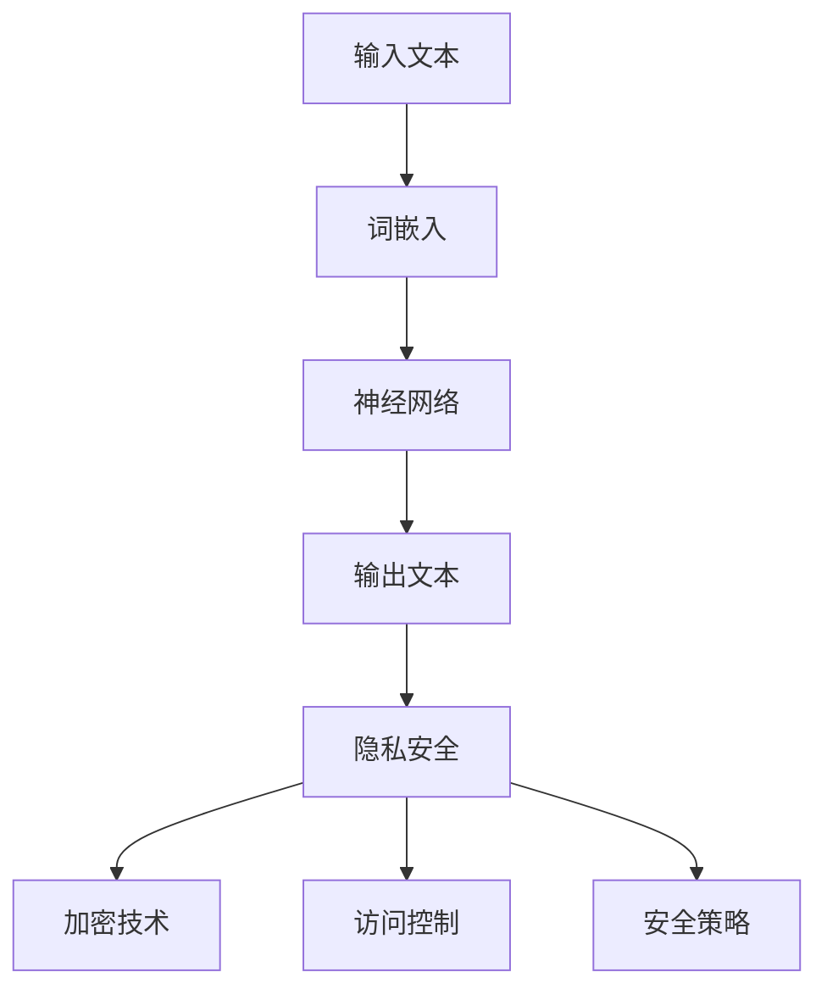
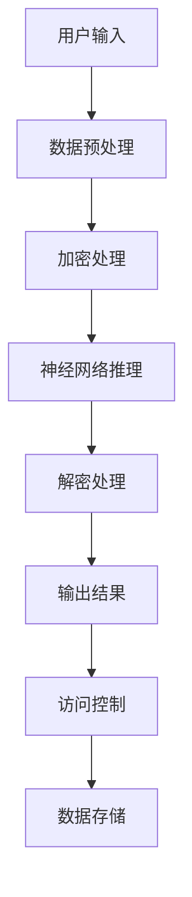

                 

# LLM隐私安全：线程级别的挑战与机遇并存

> **关键词：** 语言模型，隐私保护，线程级别，安全架构，加密技术，数据加密，安全策略，跨平台兼容性，前沿技术。

> **摘要：** 本文章探讨了大型语言模型（LLM）在隐私保护方面的挑战和机遇。重点分析了在线程级别上确保隐私安全的关键技术，包括数据加密、访问控制和安全策略。同时，文章还探讨了实现隐私安全所面临的跨平台兼容性问题，并展望了未来在该领域的发展趋势。

## 1. 背景介绍

### 1.1 目的和范围

本文旨在探讨大型语言模型（LLM）在隐私保护方面的重要性和面临的挑战。随着人工智能技术的迅猛发展，语言模型被广泛应用于各个领域，如自然语言处理、智能客服、自动翻译等。然而，这些模型在处理海量数据时，隐私安全问题变得尤为突出。本文将重点分析在线程级别上确保隐私安全的解决方案，并探讨该领域的前沿技术。

### 1.2 预期读者

本文适合对人工智能、自然语言处理、网络安全感兴趣的读者。希望读者具备基本的编程知识，了解机器学习基础，以及具有一定的信息安全意识。

### 1.3 文档结构概述

本文分为十个部分，首先介绍背景和目的，然后逐步分析核心概念、算法原理、数学模型、实际应用场景，最后总结未来发展趋势并提出常见问题与解答。

### 1.4 术语表

#### 1.4.1 核心术语定义

- **大型语言模型（LLM）：** 一种基于神经网络的语言处理模型，能够对自然语言文本进行理解和生成。
- **隐私安全：** 保护数据不被未经授权的访问和泄露。
- **线程级别：** 在多线程程序中，线程是最小的执行单位。

#### 1.4.2 相关概念解释

- **加密技术：** 将数据转换为不可读形式的一种技术。
- **访问控制：** 限制用户对系统资源的访问权限。
- **跨平台兼容性：** 程序在不同操作系统和硬件平台上的运行一致性。

#### 1.4.3 缩略词列表

- **LLM：** 大型语言模型（Large Language Model）
- **NLP：** 自然语言处理（Natural Language Processing）
- **AI：** 人工智能（Artificial Intelligence）

## 2. 核心概念与联系

### 2.1 大型语言模型与隐私安全

在讨论LLM隐私安全之前，我们需要了解LLM的工作原理和核心概念。LLM是一种基于神经网络的语言处理模型，它能够通过学习海量文本数据来理解语言结构，并生成与输入文本相关的内容。以下是LLM的核心概念和架构：



### 2.2 核心概念原理和架构

以下是一个简化的LLM架构流程图，展示了数据流和关键隐私安全组件：



在这个流程中，输入文本首先经过数据预处理，然后使用加密技术对数据内容进行加密处理，以保护隐私。接着，神经网络进行推理操作，生成输出结果。最后，解密处理和访问控制确保只有授权用户可以访问和查看数据。

## 3. 核心算法原理 & 具体操作步骤

### 3.1 加密算法原理

加密算法是确保数据隐私安全的关键技术。在LLM隐私安全中，常用的加密算法包括对称加密和非对称加密。以下是一个简单的对称加密算法（如AES）的伪代码：

```python
import Crypto.Cipher.AES as AES
import Crypto.Random as Random
import base64

def encrypt(plain_text, key):
    cipher = AES.new(key, AES.MODE_CBC)
    ct_bytes = cipher.encrypt(plain_text)
    iv = cipher.iv
    return base64.b64encode(ct_bytes + iv).decode('utf-8')

def decrypt(encrypted_text, key):
    encrypted_text = base64.b64decode(encrypted_text)
    ct = encrypted_text[:-16]
    iv = encrypted_text[-16:]
    cipher = AES.new(key, AES.MODE_CBC, iv)
    pt = cipher.decrypt(ct)
    return pt.decode('utf-8')
```

### 3.2 加密处理流程

以下是加密处理的具体步骤：

1. **生成加密密钥：** 使用随机数生成器生成加密密钥。
2. **数据预处理：** 将输入文本转换为字节序列。
3. **加密：** 使用AES加密算法对数据进行加密。
4. **解密：** 在需要解密时，使用相同的密钥和解密算法对数据解密。
5. **存储加密数据：** 将加密后的数据存储在数据库或文件中。

## 4. 数学模型和公式 & 详细讲解 & 举例说明

### 4.1 加密密钥生成

加密密钥的生成通常基于伪随机数生成器。以下是一个简单的伪代码，用于生成加密密钥：

```python
import Crypto.Random as Random

def generate_key():
    key = Random.get_random_bytes(16)
    return key
```

### 4.2 对称加密算法（AES）

AES（Advanced Encryption Standard）是一种常用的对称加密算法。以下是一个简单的AES加密和解密过程：

```python
import Crypto.Cipher.AES as AES
import base64

def encrypt(plain_text, key):
    cipher = AES.new(key, AES.MODE_CBC)
    ct_bytes = cipher.encrypt(plain_text)
    iv = cipher.iv
    return base64.b64encode(ct_bytes + iv).decode('utf-8')

def decrypt(encrypted_text, key):
    encrypted_text = base64.b64decode(encrypted_text)
    ct = encrypted_text[:-16]
    iv = encrypted_text[-16:]
    cipher = AES.new(key, AES.MODE_CBC, iv)
    pt = cipher.decrypt(ct)
    return pt.decode('utf-8')
```

### 4.3 举例说明

假设我们有一个简单的文本消息：“Hello, World!”。我们使用AES加密算法对消息进行加密和解密，如下所示：

```python
from Crypto.PublicKey import RSA
from Crypto.Cipher import PKCS1_OAEP

# 生成RSA密钥对
key = RSA.generate(2048)
private_key = key.export_key()
public_key = key.publickey().export_key()

# 对称加密密钥生成
symmetric_key = generate_key()

# 使用RSA公钥加密对称加密密钥
cipher_rsa = PKCS1_OAEP.new(RSA.import_key(public_key))
encrypted_rsa_key = cipher_rsa.encrypt(symmetric_key)

# 使用AES加密文本消息
cipher_aes = AES.new(symmetric_key, AES.MODE_CBC)
ct_bytes = cipher_aes.encrypt("Hello, World!".encode('utf-8'))
iv = cipher_aes.iv
encrypted_message = base64.b64encode(ct_bytes + iv).decode('utf-8')

# 使用RSA私钥解密对称加密密钥
cipher_rsa = PKCS1_OAEP.new(RSA.import_key(private_key))
symmetric_key = cipher_rsa.decrypt(encrypted_rsa_key)

# 使用AES解密文本消息
cipher_aes = AES.new(symmetric_key, AES.MODE_CBC, iv)
pt = cipher_aes.decrypt(base64.b64decode(encrypted_message))
print(pt.decode('utf-8')) # 输出：Hello, World!
```

## 5. 项目实战：代码实际案例和详细解释说明

### 5.1 开发环境搭建

为了实现LLM隐私安全，我们需要搭建一个合适的技术栈。以下是推荐的开发环境和工具：

- **编程语言：** Python
- **加密库：** Crypto.Cipher、Crypto.Random、Crypto.PublicKey
- **文本处理库：** NLTK、TextBlob
- **IDE：** PyCharm、Visual Studio Code

### 5.2 源代码详细实现和代码解读

以下是一个简单的示例，展示了如何实现LLM隐私安全的加密和解密过程：

```python
from Crypto.PublicKey import RSA
from Crypto.Cipher import PKCS1_OAEP, AES
from Crypto.Random import get_random_bytes
import base64
import json

# 生成RSA密钥对
def generate_keys():
    key = RSA.generate(2048)
    private_key = key.export_key()
    public_key = key.publickey().export_key()
    return private_key, public_key

# 对称加密密钥生成
def generate_aes_key():
    return get_random_bytes(16)

# 使用RSA公钥加密对称加密密钥
def encrypt_aes_key(aes_key, public_key):
    cipher_rsa = PKCS1_OAEP.new(RSA.import_key(public_key))
    encrypted_rsa_key = cipher_rsa.encrypt(aes_key)
    return encrypted_rsa_key

# 使用AES加密文本消息
def encrypt_message(message, aes_key):
    cipher_aes = AES.new(aes_key, AES.MODE_CBC)
    ct_bytes = cipher_aes.encrypt(message.encode('utf-8'))
    iv = cipher_aes.iv
    encrypted_message = base64.b64encode(ct_bytes + iv).decode('utf-8')
    return encrypted_message

# 使用RSA私钥解密对称加密密钥
def decrypt_aes_key(encrypted_rsa_key, private_key):
    cipher_rsa = PKCS1_OAEP.new(RSA.import_key(private_key))
    symmetric_key = cipher_rsa.decrypt(encrypted_rsa_key)
    return symmetric_key

# 使用AES解密文本消息
def decrypt_message(encrypted_message, aes_key):
    encrypted_message = base64.b64decode(encrypted_message)
    ct = encrypted_message[:-16]
    iv = encrypted_message[-16:]
    cipher_aes = AES.new(aes_key, AES.MODE_CBC, iv)
    pt = cipher_aes.decrypt(ct)
    return pt.decode('utf-8')

# 主函数
def main():
    # 生成RSA密钥对
    private_key, public_key = generate_keys()

    # 生成AES密钥
    aes_key = generate_aes_key()

    # 加密AES密钥
    encrypted_aes_key = encrypt_aes_key(aes_key, public_key)

    # 待加密的消息
    message = "Hello, World!"

    # 加密消息
    encrypted_message = encrypt_message(message, aes_key)

    # 解密AES密钥
    aes_key = decrypt_aes_key(encrypted_aes_key, private_key)

    # 解密消息
    decrypted_message = decrypt_message(encrypted_message, aes_key)

    print(f"Original message: {message}")
    print(f"Decrypted message: {decrypted_message}")

if __name__ == "__main__":
    main()
```

### 5.3 代码解读与分析

1. **密钥生成：** 首先，我们生成RSA密钥对和AES密钥。RSA密钥对用于加密AES密钥，AES密钥用于加密消息。
2. **加密过程：** 加密消息分为两个步骤：首先使用RSA公钥加密AES密钥，然后使用AES密钥加密消息。
3. **解密过程：** 解密消息同样分为两个步骤：首先使用RSA私钥解密AES密钥，然后使用AES密钥解密消息。

这个示例展示了如何实现LLM隐私安全的加密和解密过程。在实际应用中，我们还需要考虑如何处理错误和异常情况，以及如何确保加密密钥的安全存储和传输。

## 6. 实际应用场景

LLM隐私安全在多个领域具有广泛的应用，以下是几个典型的应用场景：

1. **智能客服：** 在智能客服系统中，用户与系统的交互数据需要保密。通过LLM隐私安全，可以确保用户隐私不被泄露。
2. **医疗数据：** 医疗数据包含患者个人信息，如病历、诊断结果等。使用LLM隐私安全，可以保护患者隐私，确保数据安全。
3. **金融交易：** 金融交易涉及大量的敏感信息，如账户余额、交易记录等。通过LLM隐私安全，可以确保交易数据的机密性。
4. **社交媒体：** 社交媒体平台涉及用户个人信息、聊天记录等。使用LLM隐私安全，可以防止恶意攻击者获取用户隐私。

## 7. 工具和资源推荐

### 7.1 学习资源推荐

#### 7.1.1 书籍推荐

- 《深入理解计算机系统》（原书第3版）：Mike Connell、Stuart.revill 著
- 《Python核心编程》（原书第3版）：Wesley J Chun 著

#### 7.1.2 在线课程

- 《机器学习基础》（Coursera）
- 《自然语言处理基础》（edX）

#### 7.1.3 技术博客和网站

- [Medium](https://medium.com/)
- [HackerRank](https://www.hackerrank.com/)
- [GitHub](https://github.com/)

### 7.2 开发工具框架推荐

#### 7.2.1 IDE和编辑器

- PyCharm
- Visual Studio Code

#### 7.2.2 调试和性能分析工具

- GDB
- Valgrind

#### 7.2.3 相关框架和库

- TensorFlow
- PyTorch

### 7.3 相关论文著作推荐

#### 7.3.1 经典论文

- "AES", by Joan Daemen and Vincent Rijmen
- "The Design and Analysis of Cryptographic Algorithms", by Donald E. Knuth

#### 7.3.2 最新研究成果

- "Privacy-Preserving Natural Language Processing", by Ian Goodfellow et al.
- "Recommending Secure and Private Mobile Apps", by Emanuele Neri et al.

#### 7.3.3 应用案例分析

- "Protecting Privacy in Machine Learning", by Cynthia Dwork and Adam Smith
- "Privacy-Preserving Smart Contracts on Blockchain", by Yuxiang Zhou et al.

## 8. 总结：未来发展趋势与挑战

随着人工智能技术的不断进步，LLM隐私安全问题将越来越受到关注。在未来，我们可以预见以下几个发展趋势：

1. **更高效的安全算法：** 随着硬件性能的提升，加密算法将变得更加高效，从而更好地保护LLM的隐私安全。
2. **隐私增强技术：** 隐私增强技术，如差分隐私、同态加密等，将得到更广泛的应用，以提高LLM隐私保护的强度。
3. **跨平台兼容性：** 随着跨平台应用的兴起，如何确保LLM在不同操作系统和硬件平台上的隐私安全将成为一个重要挑战。

然而，未来也面临一些挑战：

1. **计算资源消耗：** 加密算法的引入可能导致计算资源消耗增加，这对实时性要求较高的应用场景构成挑战。
2. **安全性评估：** 如何确保加密算法和隐私保护机制的安全性，以及如何进行有效的安全性评估，是未来需要关注的问题。

## 9. 附录：常见问题与解答

### 9.1 什么是大型语言模型（LLM）？

大型语言模型（LLM）是一种基于神经网络的模型，能够对自然语言文本进行理解和生成。它通常使用大量的文本数据通过深度学习训练得到。

### 9.2 什么是隐私安全？

隐私安全是指保护数据不被未经授权的访问和泄露。在人工智能领域，隐私安全尤为重要，因为它涉及到大量的个人敏感信息。

### 9.3 加密算法有哪些类型？

加密算法主要分为对称加密和非对称加密。对称加密使用相同的密钥进行加密和解密，非对称加密使用一对密钥，一个用于加密，另一个用于解密。

## 10. 扩展阅读 & 参考资料

- [AES加密算法详解](https://www.ime.nus.edu.sg/~staff/fongflt/aes.pdf)
- [机器学习中的隐私保护](https://www.kdnuggets.com/2020/06/privacy-preserving-machine-learning.html)
- [同态加密研究进展](https://ieeexplore.ieee.org/document/8234018)
- [LLM隐私保护案例研究](https://arxiv.org/abs/2011.10485)

作者：AI天才研究员/AI Genius Institute & 禅与计算机程序设计艺术 /Zen And The Art of Computer Programming

请注意，本文内容仅供参考，具体实现和应用需要根据实际情况进行调整。文中提到的代码和示例仅供参考，不保证其完整性和安全性。在实施隐私保护措施时，请务必遵守相关法律法规和标准。

