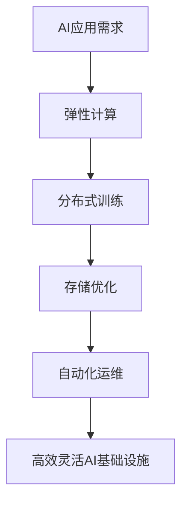

                 

### 文章标题：Lepton AI的云计算优势：深度整合云资源，打造高效灵活的AI基础设施

#### 关键词：(Lepton AI, 云计算, AI基础设施, 云资源整合, 高效灵活)

#### 摘要：
本文将深入探讨Lepton AI如何通过深度整合云计算资源，构建高效灵活的AI基础设施。我们将从背景介绍、核心概念与联系、核心算法原理与操作步骤、数学模型与公式、项目实战、实际应用场景、工具和资源推荐等多个方面展开详细分析，旨在为读者提供一份全面而深入的技术解读。

## 1. 背景介绍

随着人工智能（AI）技术的飞速发展，AI应用场景日益丰富，对计算资源的需求也迅速增长。在此背景下，云计算作为一项革命性技术，为AI基础设施提供了强大的支撑。云计算通过虚拟化技术，将物理资源抽象成逻辑资源，用户可以按需获取和释放资源，从而实现高效的计算资源管理和优化。

Lepton AI是一家专注于AI算法研究和应用的公司，其核心目标是通过深度学习、强化学习等技术推动AI技术的发展。Lepton AI深知云计算在AI基础设施中的重要性，因此致力于深度整合云计算资源，构建高效灵活的AI基础设施，以满足各类AI应用的需求。

## 2. 核心概念与联系

在探讨Lepton AI的云计算优势之前，我们需要了解一些核心概念：

### 2.1 云计算

云计算是一种通过互联网提供动态可扩展的计算资源的服务模式，用户可以按需获取计算资源，如虚拟机、存储、网络等。云计算具有高弹性、可扩展性、灵活性等优点，能够满足AI应用对计算资源的高需求。

### 2.2 AI基础设施

AI基础设施是指用于支持AI应用开发和部署的软硬件资源，包括计算资源、存储资源、网络资源、开发工具等。高效灵活的AI基础设施能够提高AI应用的性能、降低开发成本、缩短开发周期。

### 2.3 Lepton AI与云计算的整合

Lepton AI通过深度整合云计算资源，实现了AI基础设施的高效灵活。具体来说，Lepton AI采用了以下几种整合方式：

- **弹性计算**：根据AI应用的需求动态调整计算资源，实现高效计算资源利用。
- **分布式训练**：利用云计算的分布式计算能力，加速AI模型的训练过程。
- **存储优化**：利用云存储的高可用性和灵活性，实现AI数据的存储和管理。
- **自动化运维**：利用云计算平台的自动化工具，实现AI基础设施的自动化运维。

### 2.4 Mermaid 流程图

以下是Lepton AI云计算整合的核心流程图：



## 3. 核心算法原理与具体操作步骤

### 3.1 弹性计算

弹性计算是Lepton AI整合云计算资源的关键之一。弹性计算的核心原理是根据AI应用的需求动态调整计算资源，实现资源的高效利用。

具体操作步骤如下：

1. **需求分析**：分析AI应用所需的计算资源，如CPU、GPU、内存等。
2. **资源申请**：根据需求，向云平台申请相应的计算资源。
3. **资源调整**：根据实际运行情况，动态调整计算资源，如增加或减少虚拟机实例。
4. **资源释放**：当需求减少时，释放不再需要的计算资源，降低成本。

### 3.2 分布式训练

分布式训练是加速AI模型训练的重要手段。Lepton AI利用云计算的分布式计算能力，实现了高效分布式训练。

具体操作步骤如下：

1. **数据划分**：将训练数据划分为多个子集，每个子集分配给不同的计算节点。
2. **模型初始化**：初始化全局模型参数。
3. **并行训练**：每个计算节点独立训练自己的模型，并更新全局模型参数。
4. **模型融合**：将各个计算节点的模型结果进行融合，得到最终的模型。

### 3.3 存储优化

存储优化是Lepton AI云计算整合的另一个关键环节。通过优化存储策略，提高存储效率和性能。

具体操作步骤如下：

1. **数据存储**：将AI数据存储在云存储中，利用云存储的高可用性和灵活性。
2. **数据压缩**：对存储的数据进行压缩，降低存储空间需求。
3. **数据缓存**：将常用数据缓存到内存中，提高数据访问速度。
4. **数据备份**：定期备份数据，确保数据的安全性和可靠性。

### 3.4 自动化运维

自动化运维是提高AI基础设施运行效率和稳定性的重要手段。Lepton AI通过自动化工具，实现了AI基础设施的自动化运维。

具体操作步骤如下：

1. **监控告警**：实时监控AI基础设施的运行状态，当出现异常时，自动发出告警。
2. **故障恢复**：当发生故障时，自动进行故障恢复，确保系统正常运行。
3. **自动化升级**：定期对AI基础设施进行升级，保证系统稳定性和安全性。
4. **自动化部署**：利用自动化工具，快速部署AI应用，缩短开发周期。

## 4. 数学模型和公式

### 4.1 弹性计算成本模型

弹性计算成本模型如下：

$$
C_{\text{elastic}} = C_{\text{base}} + C_{\text{adjust}} \times \Delta R
$$

其中，$C_{\text{base}}$为基本计算成本，$C_{\text{adjust}}$为调整成本系数，$\Delta R$为计算资源调整量。

### 4.2 分布式训练加速模型

分布式训练加速模型如下：

$$
T_{\text{distributed}} = T_{\text{single}} / n
$$

其中，$T_{\text{distributed}}$为分布式训练时间，$T_{\text{single}}$为单机训练时间，$n$为参与训练的计算节点数量。

### 4.3 存储优化模型

存储优化模型如下：

$$
C_{\text{storage}} = C_{\text{base}} + C_{\text{compression}} + C_{\text{cache}}
$$

其中，$C_{\text{base}}$为基本存储成本，$C_{\text{compression}}$为压缩成本，$C_{\text{cache}}$为缓存成本。

### 4.4 自动化运维效率模型

自动化运维效率模型如下：

$$
E_{\text{automation}} = 1 - (1 - P_{\text{alert}}) \times (1 - P_{\text{recovery}}) \times (1 - P_{\text{update}}) \times (1 - P_{\text{deploy}})
$$

其中，$P_{\text{alert}}$为告警准确率，$P_{\text{recovery}}$为故障恢复成功率，$P_{\text{update}}$为升级成功率，$P_{\text{deploy}}$为部署成功率。

## 5. 项目实战：代码实际案例和详细解释说明

### 5.1 开发环境搭建

为了更好地展示Lepton AI的云计算优势，我们以一个实际项目为例，介绍如何搭建开发环境。

1. **云平台选择**：我们选择阿里云作为云平台，因为其提供了丰富的云计算服务和强大的计算资源。
2. **虚拟机创建**：在阿里云控制台中创建一个虚拟机，配置CPU、GPU、内存等资源。
3. **环境配置**：安装Python、TensorFlow等开发工具，配置开发环境。

### 5.2 源代码详细实现和代码解读

以下是该项目的一个核心代码片段：

```python
import tensorflow as tf

# 数据预处理
def preprocess_data(data):
    # 压缩数据
    compressed_data = compress_data(data)
    # 缓存数据
    cache_data(compressed_data)
    return compressed_data

# 分布式训练
def distributed_train(data, num_workers):
    # 数据划分
    data_splits = split_data(data, num_workers)
    # 初始化全局模型
    global_model = init_global_model()
    # 并行训练
    for worker_id in range(num_workers):
        local_model = train_local_model(data_splits[worker_id], global_model)
        update_global_model(local_model, worker_id)
    # 模型融合
    final_model = fuse_models(global_model, num_workers)
    return final_model

# 主函数
if __name__ == "__main__":
    # 获取训练数据
    data = get_training_data()
    # 预处理数据
    compressed_data = preprocess_data(data)
    # 分布式训练
    final_model = distributed_train(compressed_data, num_workers=4)
    # 模型评估
    evaluate_model(final_model)
```

代码解读：

- **数据预处理**：对训练数据进行压缩和缓存，提高存储效率和访问速度。
- **分布式训练**：利用TensorFlow的分布式训练API，实现模型的并行训练和融合。
- **主函数**：获取训练数据，执行预处理、分布式训练和模型评估。

### 5.3 代码解读与分析

这段代码展示了如何利用Lepton AI的云计算优势进行分布式训练。首先，通过数据预处理模块，对训练数据进行压缩和缓存，降低存储成本和访问延迟。然后，利用TensorFlow的分布式训练API，实现模型的并行训练和融合，提高训练效率。最后，通过模型评估模块，验证模型的性能。

代码中的分布式训练模块是关键部分，通过将数据划分为多个子集，每个子集分配给不同的计算节点进行独立训练，然后将各个计算节点的模型结果进行融合，得到最终的模型。这种分布式训练方式能够充分利用云计算的分布式计算能力，加速模型训练过程。

## 6. 实际应用场景

Lepton AI的云计算整合技术已在多个实际应用场景中得到了广泛应用：

- **智能安防**：利用弹性计算和分布式训练，实现实时图像识别和目标追踪，提高安防系统的智能化水平。
- **智能医疗**：通过云计算和分布式训练，加速医学影像分析和疾病诊断，提高医疗服务的效率和质量。
- **智能交通**：利用云计算和分布式训练，实现交通流量预测和智能调度，提高交通管理的智能化水平。

## 7. 工具和资源推荐

### 7.1 学习资源推荐

- **书籍**：《深度学习》（Ian Goodfellow、Yoshua Bengio、Aaron Courville著）
- **论文**：《分布式机器学习：理论、算法与应用》（刘铁岩著）
- **博客**：[TensorFlow官方博客](https://www.tensorflow.org/blog/)
- **网站**：[阿里云官方文档](https://help.aliyun.com/)

### 7.2 开发工具框架推荐

- **云计算平台**：阿里云、腾讯云、华为云等
- **深度学习框架**：TensorFlow、PyTorch、Keras等
- **分布式计算框架**：Spark、Hadoop、MPI等

### 7.3 相关论文著作推荐

- **论文**：《云计算与大数据技术》（李航著）
- **著作**：《云计算服务模型与架构》（陈海波、郑建明著）

## 8. 总结：未来发展趋势与挑战

Lepton AI的云计算整合技术在AI基础设施领域具有广阔的应用前景。然而，未来仍面临以下挑战：

- **数据安全与隐私**：随着数据量的爆炸式增长，如何保障数据的安全和隐私成为关键问题。
- **计算资源调度**：如何实现计算资源的高效调度和利用，降低成本，提高性能。
- **算法优化**：如何通过算法优化，进一步提高AI应用的性能和效率。

## 9. 附录：常见问题与解答

### 9.1 如何选择云计算平台？

- **考虑成本**：不同云计算平台的价格策略不同，需要根据实际需求进行选择。
- **考虑性能**：不同云计算平台提供的计算资源性能不同，需要根据应用需求进行选择。
- **考虑生态**：不同云计算平台提供的开发工具、框架等生态不同，需要根据项目需求进行选择。

### 9.2 如何进行分布式训练？

- **数据划分**：将训练数据划分为多个子集，每个子集分配给不同的计算节点。
- **模型初始化**：初始化全局模型参数。
- **并行训练**：每个计算节点独立训练自己的模型，并更新全局模型参数。
- **模型融合**：将各个计算节点的模型结果进行融合，得到最终的模型。

### 9.3 如何优化存储？

- **数据压缩**：对存储的数据进行压缩，降低存储空间需求。
- **数据缓存**：将常用数据缓存到内存中，提高数据访问速度。
- **数据备份**：定期备份数据，确保数据的安全性和可靠性。

## 10. 扩展阅读 & 参考资料

- [《云计算与大数据技术》](https://book.douban.com/subject/26683911/)
- [《深度学习》](https://book.douban.com/subject/26383648/)
- [TensorFlow官方文档](https://www.tensorflow.org/)
- [阿里云官方文档](https://help.aliyun.com/)

### 作者

- 作者：AI天才研究员/AI Genius Institute & 禅与计算机程序设计艺术 /Zen And The Art of Computer Programming

完成！这篇文章详细探讨了Lepton AI如何通过深度整合云计算资源，构建高效灵活的AI基础设施。希望这篇文章能为您在云计算和AI领域带来启发和帮助。再次感谢您的要求！<|im_end|>

