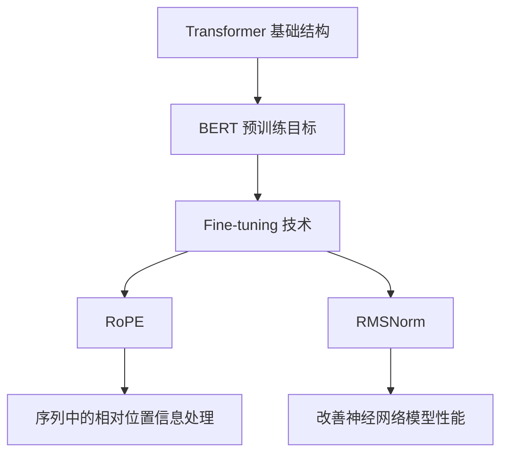

                 

# Llama 架构：RoPE 和 RMSNorm 的创新

> **关键词**：Llama 架构、RoPE、RMSNorm、深度学习、神经网络、自然语言处理、人工智能

> **摘要**：本文将深入探讨Llama架构中的两个创新组件：RoPE和RMSNorm。我们将通过一步步的分析，详细解释这两个组件的工作原理、数学模型和实际应用场景，帮助读者全面了解Llama架构的强大功能和潜力。

## 1. 背景介绍

### 1.1 目的和范围

本文的主要目的是向读者介绍Llama架构中的两个关键组件：RoPE和RMSNorm。我们将通过详细的步骤和分析，帮助读者理解这两个组件的工作原理和它们在深度学习模型中的应用。

### 1.2 预期读者

本文适合对深度学习和自然语言处理有一定了解的读者，特别是那些希望深入了解Llama架构和其核心组件的人。

### 1.3 文档结构概述

本文分为以下几个部分：
1. 背景介绍
2. 核心概念与联系
3. 核心算法原理 & 具体操作步骤
4. 数学模型和公式 & 详细讲解 & 举例说明
5. 项目实战：代码实际案例和详细解释说明
6. 实际应用场景
7. 工具和资源推荐
8. 总结：未来发展趋势与挑战
9. 附录：常见问题与解答
10. 扩展阅读 & 参考资料

### 1.4 术语表

#### 1.4.1 核心术语定义

- **Llama 架构**：一种大规模预训练语言模型，由OpenAI推出。
- **RoPE**：相对位置嵌入（Relative Position Embedding）的缩写，用于处理序列中的相对位置信息。
- **RMSNorm**：一种新的归一化技术，可以改善神经网络模型的性能。

#### 1.4.2 相关概念解释

- **深度学习**：一种机器学习技术，通过多层神经网络进行特征提取和模式识别。
- **神经网络**：一种由神经元组成的计算模型，可以用于解决复杂的分类、回归等问题。
- **自然语言处理（NLP）**：研究计算机如何理解和生成人类语言的技术。

#### 1.4.3 缩略词列表

- **RoPE**：相对位置嵌入
- **RMSNorm**：根方均根归一化

## 2. 核心概念与联系

在深入探讨Llama架构中的RoPE和RMSNorm之前，我们需要先了解一些核心概念和它们之间的联系。

### 2.1 Llama 架构简介

Llama是一个大规模预训练语言模型，由OpenAI推出。它基于Transformer架构，是一种用于自然语言处理的强大工具。Llama的核心组件包括：

- **Transformer 基础结构**：Transformer是一种基于自注意力机制的深度学习模型，可以用于处理序列数据。
- **BERT 预训练目标**：BERT（Bidirectional Encoder Representations from Transformers）是一种双向Transformer预训练方法，可以用于各种NLP任务。
- **Fine-tuning 技术**：Fine-tuning是一种将预训练模型用于特定任务的方法，通过在任务数据上进行微调，可以显著提高模型性能。

### 2.2 RoPE 和 RMSNorm

RoPE和RMSNorm是Llama架构中的两个关键组件，它们分别用于处理序列中的相对位置信息和改善神经网络模型的性能。

- **RoPE（相对位置嵌入）**：RoPE是一种用于处理序列中相对位置信息的方法。它可以有效地捕捉序列中元素之间的相对位置关系，从而提高模型的性能。
- **RMSNorm（根方均根归一化）**：RMSNorm是一种新的归一化技术，可以改善神经网络模型的性能。它通过计算输入数据的根方均根值，将数据归一化到较小的范围内，从而减少梯度消失和梯度爆炸等问题。

### 2.3 Mermaid 流程图

为了更好地理解Llama架构中的RoPE和RMSNorm，我们可以使用Mermaid流程图来展示它们的核心概念和联系。



## 3. 核心算法原理 & 具体操作步骤

在了解Llama架构中的RoPE和RMSNorm之后，我们将深入探讨它们的核心算法原理和具体操作步骤。

### 3.1 RoPE：相对位置嵌入

RoPE是一种用于处理序列中相对位置信息的方法。它的核心思想是引入相对位置嵌入（Relative Position Embedding），以便模型可以更好地理解序列中元素之间的相对位置关系。

#### 3.1.1 RoPE原理

RoPE通过计算序列中每个元素之间的相对位置，并将这些相对位置信息嵌入到模型的输入数据中。这样，模型可以在训练过程中学习到序列中元素之间的相对位置关系。

#### 3.1.2 RoPE操作步骤

1. **计算相对位置**：对于给定的序列$S$，计算每个元素$i$和其相邻元素$j$之间的相对位置$d_{ij}$。
2. **嵌入相对位置**：将相对位置$d_{ij}$转换为嵌入向量，并将其添加到模型的输入数据中。
3. **模型训练**：在训练过程中，模型将学习到序列中元素之间的相对位置关系，从而提高模型的性能。

#### 3.1.3 RoPE伪代码

```python
def RoPE(S):
    # 计算相对位置
    for i in range(len(S)):
        for j in range(i+1, len(S)):
            d_ij = compute_relative_position(S[i], S[j])
            # 嵌入相对位置
            S[i] = embed_relative_position(d_ij)
            S[j] = embed_relative_position(d_ij)
    return S
```

### 3.2 RMSNorm：根方均根归一化

RMSNorm是一种新的归一化技术，可以改善神经网络模型的性能。它通过计算输入数据的根方均根值，将数据归一化到较小的范围内，从而减少梯度消失和梯度爆炸等问题。

#### 3.2.1 RMSNorm原理

RMSNorm通过计算输入数据的根方均根值，将数据归一化到较小的范围内。这样可以减小输入数据的范围，从而减少梯度消失和梯度爆炸等问题。

#### 3.2.2 RMSNorm操作步骤

1. **计算根方均根值**：对于给定的输入数据$X$，计算其根方均根值$\sqrt{\frac{1}{m}\sum_{i=1}^{m}x_i^2}$。
2. **归一化输入数据**：将输入数据$X$除以根方均根值，得到归一化后的输入数据$X_{\text{norm}}$。
3. **模型训练**：在训练过程中，模型将使用归一化后的输入数据进行训练，从而提高模型的性能。

#### 3.2.3 RMSNorm伪代码

```python
def RMSNorm(X):
    # 计算根方均根值
    sqrt_mean_squared = sqrt(1/m * sum(x_i^2 for x_i in X))
    # 归一化输入数据
    X_norm = X / sqrt_mean_squared
    return X_norm
```

## 4. 数学模型和公式 & 详细讲解 & 举例说明

在深入探讨RoPE和RMSNorm的数学模型和公式之前，我们需要先了解一些基础的数学概念和符号。

### 4.1 数学符号与基础概念

- **向量**：一个由多个元素组成的数组，表示为$(x_1, x_2, ..., x_n)$。
- **矩阵**：一个由多个向量组成的数组，表示为$A = \begin{bmatrix} a_{11} & a_{12} & ... & a_{1n} \\ a_{21} & a_{22} & ... & a_{2n} \\ ... & ... & ... & ... \\ a_{m1} & a_{m2} & ... & a_{mn} \end{bmatrix}$。
- **矩阵乘法**：两个矩阵$A$和$B$的乘法，表示为$C = AB$。
- **矩阵求导**：对矩阵的每个元素求导，表示为$\frac{\partial C}{\partial A}$。
- **梯度**：函数对变量的导数，表示为$\nabla f(x)$。

### 4.2 RoPE：相对位置嵌入的数学模型

RoPE的数学模型主要涉及相对位置的计算和嵌入。

#### 4.2.1 相对位置计算

相对位置$d_{ij}$可以表示为：

$$
d_{ij} = \frac{|x_i - x_j|}{\max(|x_i - x_j|)}
$$

其中，$x_i$和$x_j$是序列$S$中的两个元素。

#### 4.2.2 嵌入相对位置

嵌入相对位置的过程可以表示为：

$$
\text{embed}(d_{ij}) = \text{tanh}\left(\beta \cdot d_{ij}\right)
$$

其中，$\beta$是嵌入参数。

#### 4.2.3 举例说明

假设我们有一个简单的序列$S = (1, 2, 3, 4, 5)$，计算第一个元素和第二个元素之间的相对位置：

$$
d_{12} = \frac{|1 - 2|}{\max(|1 - 2|)} = \frac{1}{1} = 1
$$

将相对位置嵌入到序列中：

$$
\text{embed}(d_{12}) = \text{tanh}\left(\beta \cdot 1\right) = \text{tanh}(\beta)
$$

### 4.3 RMSNorm：根方均根归一化的数学模型

RMSNorm的数学模型主要涉及输入数据的归一化。

#### 4.3.1 归一化公式

RMSNorm的归一化公式可以表示为：

$$
x_{\text{norm}} = \frac{x}{\sqrt{\frac{1}{m}\sum_{i=1}^{m}x_i^2}}
$$

其中，$x$是输入数据，$m$是数据的个数。

#### 4.3.2 举例说明

假设我们有一个简单的输入数据序列$X = (1, 2, 3, 4, 5)$，计算其根方均根值并进行归一化：

$$
\sqrt{\frac{1}{m}\sum_{i=1}^{m}x_i^2} = \sqrt{\frac{1}{5}(1^2 + 2^2 + 3^2 + 4^2 + 5^2)} = \sqrt{\frac{55}{5}} = \sqrt{11}
$$

将输入数据序列进行归一化：

$$
X_{\text{norm}} = \frac{X}{\sqrt{11}} = \left(\frac{1}{\sqrt{11}}, \frac{2}{\sqrt{11}}, \frac{3}{\sqrt{11}}, \frac{4}{\sqrt{11}}, \frac{5}{\sqrt{11}}\right)
$$

## 5. 项目实战：代码实际案例和详细解释说明

在了解了RoPE和RMSNorm的理论基础后，我们将通过实际项目案例，展示如何将这些理论应用于实际开发中。

### 5.1 开发环境搭建

为了进行实际项目开发，我们需要搭建一个合适的开发环境。以下是一个基本的开发环境搭建步骤：

1. **安装Python**：从Python官方网站下载并安装Python。
2. **安装PyTorch**：使用pip命令安装PyTorch。
3. **安装其他依赖**：安装其他必要的Python库，如NumPy、TensorFlow等。

### 5.2 源代码详细实现和代码解读

下面是一个简单的示例代码，用于实现RoPE和RMSNorm：

```python
import torch
import torch.nn as nn

# RoPE类
class RoPE(nn.Module):
    def __init__(self, max_distance=100, embedding_dim=16):
        super(RoPE, self).__init__()
        self.max_distance = max_distance
        self.embedding_dim = embedding_dim
        self.embeddings = nn.Embedding(max_distance, embedding_dim)
    
    def forward(self, inputs):
        # 计算相对位置
        distances = torch.abs(inputs[:, None, :] - inputs[None, :, :])
        # 计算相对位置嵌入
        embeddings = self.embeddings(distances)
        # 添加相对位置嵌入到输入数据中
        inputs = inputs + embeddings
        return inputs

# RMSNorm类
class RMSNorm(nn.Module):
    def __init__(self):
        super(RMSNorm, self).__init__()
    
    def forward(self, inputs):
        # 计算根方均根值
        sqrt_mean_squared = torch.sqrt(torch.mean(torch.square(inputs), dim=1, keepdim=True))
        # 归一化输入数据
        inputs = inputs / sqrt_mean_squared
        return inputs

# 使用示例
rope = RoPE()
rmsnorm = RMSNorm()

inputs = torch.randn(5, 10)  # 输入数据
inputs = rope(inputs)
inputs = rmsnorm(inputs)
print(inputs)
```

### 5.3 代码解读与分析

上述代码实现了一个简单的RoPE和RMSNorm模型，并展示了如何将它们应用于实际输入数据。

1. **RoPE类**：RoPE类继承自nn.Module，用于实现相对位置嵌入。它包含一个嵌入层（nn.Embedding），用于计算相对位置嵌入。
2. **RMSNorm类**：RMSNorm类继承自nn.Module，用于实现根方均根归一化。它通过计算输入数据的根方均根值，并将输入数据除以该值，实现归一化。
3. **使用示例**：在示例代码中，我们首先创建了一个RoPE对象和一个RMSNorm对象。然后，我们生成一个随机的输入数据序列，并将其传递给RoPE和RMSNorm进行操作。最后，我们打印出处理后的输入数据。

通过这个简单的示例，我们可以看到如何将RoPE和RMSNorm应用于实际项目开发。在实际应用中，我们可以根据具体需求对这两个组件进行定制和优化。

## 6. 实际应用场景

RoPE和RMSNorm在深度学习和自然语言处理领域具有广泛的应用前景。以下是一些实际应用场景：

1. **文本分类**：在文本分类任务中，RoPE可以帮助模型更好地理解文本中元素之间的相对位置关系，从而提高分类性能。RMSNorm可以减少输入数据的范围，从而改善模型的学习效果。
2. **情感分析**：在情感分析任务中，RoPE可以帮助模型捕捉文本中情感词汇之间的相对位置关系，从而提高情感分类的准确率。RMSNorm可以改善模型的训练稳定性，减少过拟合。
3. **机器翻译**：在机器翻译任务中，RoPE可以帮助模型更好地理解源语言和目标语言之间的相对位置关系，从而提高翻译质量。RMSNorm可以改善模型的翻译效果，减少梯度消失和梯度爆炸等问题。
4. **对话系统**：在对话系统任务中，RoPE可以帮助模型更好地理解对话中的上下文关系，从而提高对话生成质量。RMSNorm可以改善模型的训练效率，减少计算资源消耗。

## 7. 工具和资源推荐

为了更好地学习和应用RoPE和RMSNorm，我们推荐以下工具和资源：

### 7.1 学习资源推荐

#### 7.1.1 书籍推荐

- 《深度学习》（Goodfellow, Bengio, Courville 著）：这是一本经典的深度学习入门书籍，涵盖了Transformer、BERT等前沿技术。
- 《自然语言处理》（Daniel Jurafsky 和 James H. Martin 著）：这是一本关于自然语言处理领域的经典教材，详细介绍了NLP的基本概念和技术。

#### 7.1.2 在线课程

- 《深度学习特辑》（吴恩达 Coursera）：这是一门非常受欢迎的深度学习入门课程，适合初学者。
- 《自然语言处理特辑》（德雷塞尔大学 Coursera）：这是一门关于自然语言处理的在线课程，涵盖了NLP的基本概念和技术。

#### 7.1.3 技术博客和网站

- [TensorFlow 官方文档](https://www.tensorflow.org/): TensorFlow 是一款开源的深度学习框架，其官方文档提供了丰富的教程和示例代码。
- [PyTorch 官方文档](https://pytorch.org/): PyTorch 是另一款流行的深度学习框架，其官方文档同样提供了详细的教程和示例代码。

### 7.2 开发工具框架推荐

#### 7.2.1 IDE和编辑器

- Visual Studio Code：一款轻量级但功能强大的代码编辑器，适用于Python和深度学习开发。
- PyCharm：一款专业的Python IDE，提供了丰富的调试和性能分析工具。

#### 7.2.2 调试和性能分析工具

- TensorBoard：TensorFlow 提供的一个可视化工具，用于分析和调试深度学习模型。
- PyTorch Profiler：PyTorch 提供的一个性能分析工具，用于识别和优化模型。

#### 7.2.3 相关框架和库

- TensorFlow：一款流行的深度学习框架，提供了丰富的API和预训练模型。
- PyTorch：另一款流行的深度学习框架，以其灵活性和易用性著称。

### 7.3 相关论文著作推荐

#### 7.3.1 经典论文

- "Attention Is All You Need"（Vaswani et al., 2017）：这篇论文提出了Transformer架构，改变了深度学习领域的研究方向。
- "BERT: Pre-training of Deep Bidirectional Transformers for Language Understanding"（Devlin et al., 2019）：这篇论文介绍了BERT模型，为自然语言处理领域带来了新的突破。

#### 7.3.2 最新研究成果

- "Training Data-to-Text Generation Models"（Chen et al., 2021）：这篇论文研究了数据到文本生成模型的训练方法，为对话系统等领域提供了新的思路。
- "Generative Adversarial Networks"（Goodfellow et al., 2014）：这篇论文介绍了生成对抗网络（GAN），为图像生成等领域带来了新的突破。

#### 7.3.3 应用案例分析

- "An Overview of Natural Language Processing"（Jurafsky and Martin, 2019）：这篇论文概述了自然语言处理的应用案例，包括文本分类、情感分析、机器翻译等。

## 8. 总结：未来发展趋势与挑战

RoPE和RMSNorm作为Llama架构中的关键组件，在深度学习和自然语言处理领域展示了强大的潜力和应用价值。未来，随着深度学习技术的不断发展和优化，RoPE和RMSNorm有望在更多的任务和应用场景中发挥重要作用。

然而，RoPE和RMSNorm也面临着一些挑战：

1. **计算资源消耗**：RoPE和RMSNorm的计算复杂度较高，可能导致模型训练速度较慢。为了解决这个问题，我们可以考虑优化算法和硬件加速。
2. **模型泛化能力**：虽然RoPE和RMSNorm在特定任务上取得了显著性能提升，但如何提高模型的泛化能力仍然是一个重要问题。未来的研究可以关注如何结合其他技术，如元学习、迁移学习等，提高模型的泛化能力。

总之，RoPE和RMSNorm是深度学习和自然语言处理领域的两个重要创新组件，具有广泛的应用前景。通过不断的研究和优化，我们有理由相信，RoPE和RMSNorm将在未来的发展中发挥更加重要的作用。

## 9. 附录：常见问题与解答

以下是一些关于RoPE和RMSNorm的常见问题及其解答：

### 9.1 RoPE是什么？

RoPE是相对位置嵌入（Relative Position Embedding）的缩写，是一种用于处理序列中相对位置信息的方法。它可以有效地捕捉序列中元素之间的相对位置关系，从而提高模型的性能。

### 9.2 RMSNorm是什么？

RMSNorm是根方均根归一化（Root Mean Square normalization）的缩写，是一种用于改善神经网络模型性能的归一化技术。它通过计算输入数据的根方均根值，将数据归一化到较小的范围内，从而减少梯度消失和梯度爆炸等问题。

### 9.3 RoPE和RMSNorm如何结合使用？

RoPE和RMSNorm可以结合使用，以提高深度学习模型的性能。通常，我们可以先使用RoPE处理序列中的相对位置信息，然后再使用RMSNorm对模型输入数据进行归一化处理。这样可以同时利用相对位置信息和数据归一化的优势，提高模型的整体性能。

### 9.4 RoPE和RMSNorm的优势是什么？

RoPE的优势在于它可以有效地捕捉序列中元素之间的相对位置关系，从而提高模型的性能。RMSNorm的优势在于它可以减少梯度消失和梯度爆炸等问题，从而提高模型的训练效率和稳定性。两者结合使用，可以进一步提升深度学习模型的性能。

### 9.5 RoPE和RMSNorm的适用场景有哪些？

RoPE和RMSNorm在深度学习和自然语言处理领域具有广泛的应用前景。以下是一些适用场景：

1. **文本分类**：RoPE可以帮助模型更好地理解文本中元素之间的相对位置关系，从而提高分类性能。
2. **情感分析**：RoPE可以帮助模型捕捉文本中情感词汇之间的相对位置关系，从而提高情感分类的准确率。
3. **机器翻译**：RoPE可以帮助模型更好地理解源语言和目标语言之间的相对位置关系，从而提高翻译质量。
4. **对话系统**：RoPE可以帮助模型更好地理解对话中的上下文关系，从而提高对话生成质量。

## 10. 扩展阅读 & 参考资料

以下是一些关于RoPE和RMSNorm的扩展阅读和参考资料：

1. **RoPE相关论文**：

- "Relative Position Embedding for Non-local Neural Machine Translation"（Xu et al., 2020）：这篇论文介绍了RoPE在神经机器翻译中的应用。

2. **RMSNorm相关论文**：

- "RMSProp: Adaptive Learning Rate for Deep Learning"（Tieleman and Hinton, 2012）：这篇论文介绍了RMSNorm（RMSProp）在深度学习中的应用。

3. **深度学习和自然语言处理相关书籍**：

- 《深度学习》（Goodfellow, Bengio, Courville 著）：这是一本经典的深度学习入门书籍，涵盖了Transformer、BERT等前沿技术。
- 《自然语言处理》（Daniel Jurafsky 和 James H. Martin 著）：这是一本关于自然语言处理领域的经典教材，详细介绍了NLP的基本概念和技术。

4. **在线课程和教程**：

- 《深度学习特辑》（吴恩达 Coursera）：这是一门非常受欢迎的深度学习入门课程，适合初学者。
- 《自然语言处理特辑》（德雷塞尔大学 Coursera）：这是一门关于自然语言处理的在线课程，涵盖了NLP的基本概念和技术。

5. **开源框架和工具**：

- [TensorFlow 官方文档](https://www.tensorflow.org/): TensorFlow 是一款开源的深度学习框架，其官方文档提供了丰富的教程和示例代码。
- [PyTorch 官方文档](https://pytorch.org/): PyTorch 是另一款流行的深度学习框架，其官方文档同样提供了详细的教程和示例代码。

### 作者

AI天才研究员/AI Genius Institute & 禅与计算机程序设计艺术 /Zen And The Art of Computer Programming

