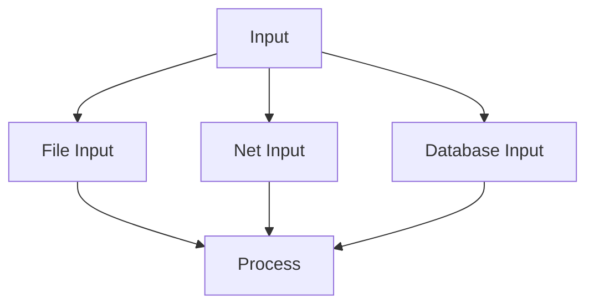
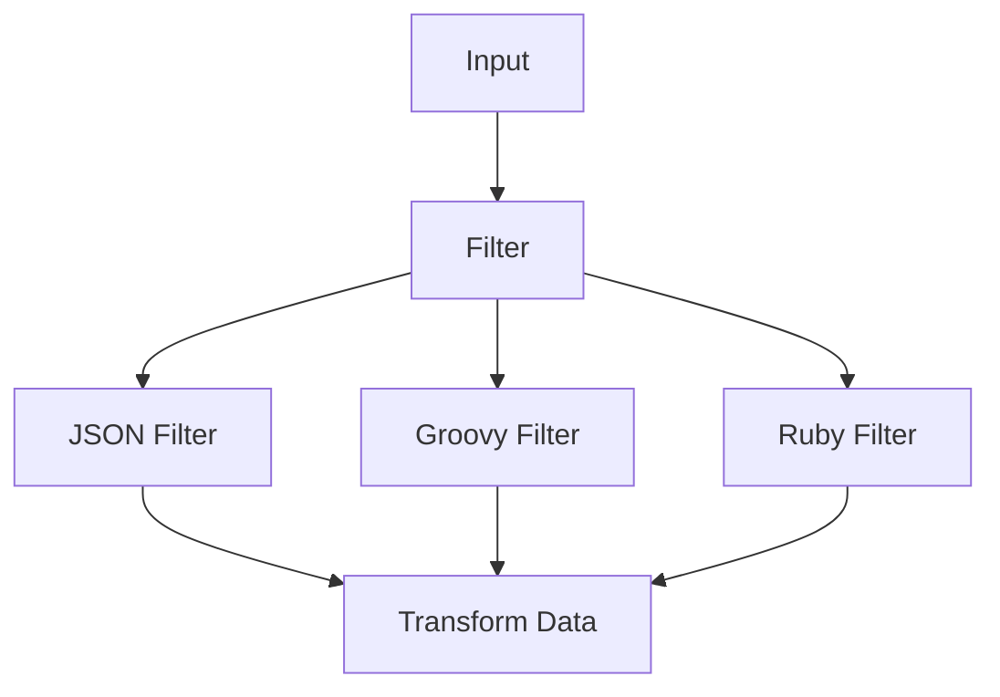
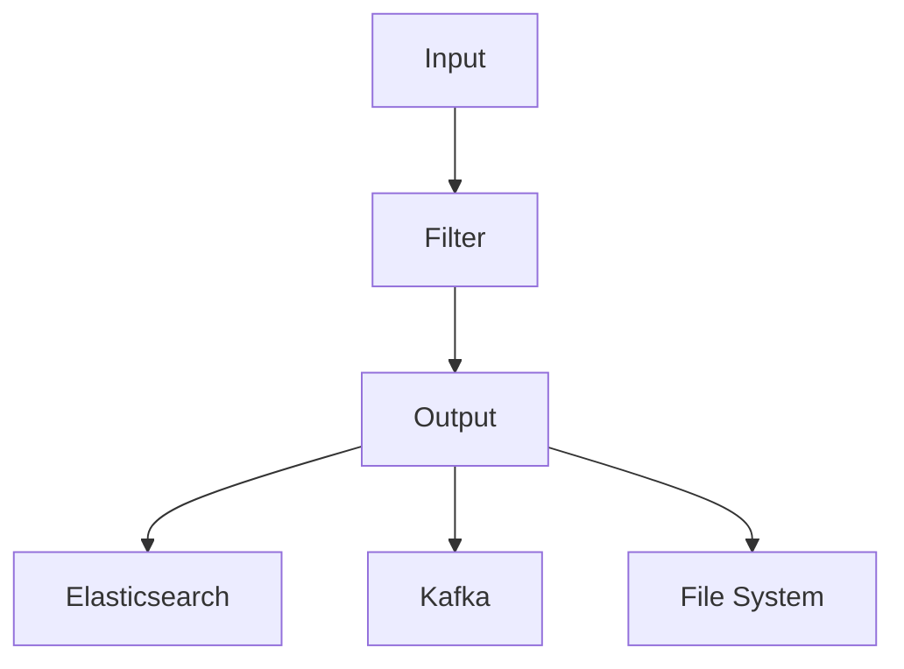
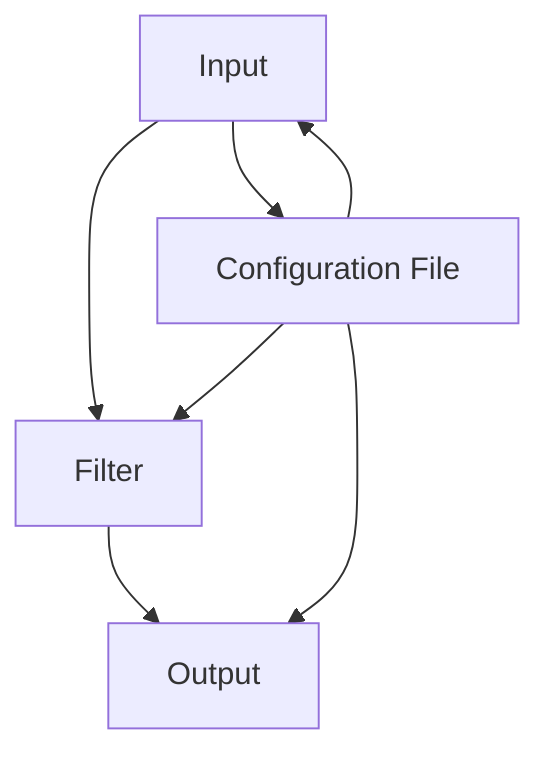
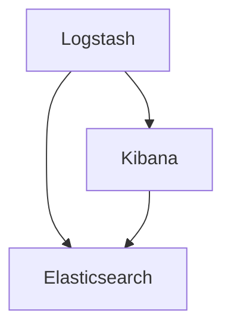

                 

# Logstash原理与代码实例讲解

## 概述

> **关键词：** Logstash、数据流处理、ELK栈、过滤器、输出、输入、Ruby、Elasticsearch、Kibana、配置文件。

本文将深入探讨Logstash的原理和实际操作，旨在为读者提供全面的技术理解。Logstash是一个开源的数据流处理工具，主要用于收集、处理和路由数据，是ELK（Elasticsearch、Logstash、Kibana）栈的核心组件之一。本文将涵盖以下内容：

1. **背景介绍**：介绍Logstash的目的、适用场景及其在ELK栈中的地位。
2. **核心概念与联系**：详细阐述Logstash的基本概念和架构。
3. **核心算法原理 & 具体操作步骤**：使用伪代码解释Logstash的核心算法。
4. **数学模型和公式 & 详细讲解 & 举例说明**：介绍Logstash中的关键数学概念。
5. **项目实战：代码实际案例和详细解释说明**：通过具体实例展示Logstash的实际应用。
6. **实际应用场景**：分析Logstash在不同领域的使用案例。
7. **工具和资源推荐**：推荐学习资源和开发工具。
8. **总结：未来发展趋势与挑战**：探讨Logstash的未来发展。

读者对象：本文适合对数据流处理和ELK栈有一定了解的读者，尤其是希望深入了解Logstash原理和应用的程序员和技术爱好者。

## 1. 背景介绍

### 1.1 目的和范围

本文的目的是介绍Logstash的工作原理，帮助读者理解和掌握如何使用Logstash进行数据流处理。我们将通过一系列实例展示Logstash的强大功能，并探讨其在实际项目中的应用。

本文的范围包括：

- Logstash的基本概念和架构。
- 数据流处理的核心算法原理。
- 实际项目的代码实例和操作步骤。
- 相关工具和资源的推荐。

### 1.2 预期读者

预期读者是具备以下背景知识的程序员和技术爱好者：

- 对数据流处理有一定了解。
- 熟悉ELK栈，尤其是Elasticsearch和Kibana。
- 愿意通过实际案例学习Logstash。

### 1.3 文档结构概述

本文分为以下几个部分：

- **概述**：介绍Logstash的基本概念和关键词。
- **背景介绍**：包括目的、范围、预期读者和文档结构概述。
- **核心概念与联系**：解释Logstash的基本概念和架构。
- **核心算法原理 & 具体操作步骤**：详细讲解Logstash的核心算法。
- **数学模型和公式 & 详细讲解 & 举例说明**：介绍关键数学概念。
- **项目实战：代码实际案例和详细解释说明**：通过实例展示Logstash应用。
- **实际应用场景**：分析Logstash在不同领域的使用。
- **工具和资源推荐**：推荐学习资源和开发工具。
- **总结：未来发展趋势与挑战**：探讨Logstash的未来发展。
- **附录：常见问题与解答**：回答常见问题。
- **扩展阅读 & 参考资料**：提供进一步学习的资源。

### 1.4 术语表

#### 1.4.1 核心术语定义

- **Logstash**：一个开源的数据流处理工具，用于收集、处理和路由数据。
- **数据流处理**：实时或近实时处理连续数据流的技术。
- **ELK栈**：包括Elasticsearch、Logstash和Kibana，是一个流行的日志分析平台。
- **过滤器**：用于对输入数据进行处理和转换的功能模块。
- **输入**：将数据引入Logstash的接口。
- **输出**：将处理后的数据导出到其他系统或存储的接口。

#### 1.4.2 相关概念解释

- **Elasticsearch**：一个分布式、RESTful搜索引擎，用于存储和检索数据。
- **Kibana**：一个可视化工具，用于分析Elasticsearch中的数据。
- **配置文件**：用于定义Logstash输入、过滤器和输出的设置。

#### 1.4.3 缩略词列表

- **ELK栈**：Elasticsearch、Logstash、Kibana
- **JSON**：JavaScript Object Notation（一种数据交换格式）

## 2. 核心概念与联系

### 2.1 Logstash的基本概念

#### 1. 输入

输入是Logstash数据流处理的第一步，负责接收来自各种源的数据。Logstash支持多种输入类型，包括文件、网络、数据库等。



#### 2. 过滤器

过滤器是Logstash的核心组件，用于处理和转换输入数据。Logstash支持多种过滤器，如JSON过滤器、Groovy过滤器、Ruby过滤器等。



#### 3. 输出

输出是Logstash数据流处理的最后一步，负责将处理后的数据导出到目标系统或存储。Logstash支持多种输出类型，如Elasticsearch、Kafka、文件系统等。



### 2.2 Logstash的架构

Logstash的架构包括输入、过滤器和输出三个主要部分，以及配置文件来定义这些组件的行为。



### 2.3 Logstash与ELK栈的联系

Logstash是ELK栈的核心组件之一，与其他组件紧密集成。Elasticsearch用于存储和检索数据，Kibana用于数据可视化。Logstash作为数据流处理工具，负责将数据从源头传输到Elasticsearch，供Kibana分析。



## 3. 核心算法原理 & 具体操作步骤

### 3.1 数据流处理流程

Logstash的数据流处理流程可以简化为以下几个步骤：

1. **输入**：从各种源收集数据。
2. **过滤**：处理和转换输入数据。
3. **输出**：将处理后的数据存储或转发到其他系统。

### 3.2 伪代码

下面是Logstash核心算法的伪代码：

```ruby
class Logstash
  attr_reader :input, :filter, :output

  def initialize(config)
    @config = config
    @input = Input.new(@config[:input])
    @filter = Filter.new(@config[:filter])
    @output = Output.new(@config[:output])
  end

  def process(data)
    @input.receive(data)
    @filter.process(data)
    @output.send(data)
  end
end

class Input
  def receive(data)
    # 收集数据
  end
end

class Filter
  def process(data)
    # 处理和转换数据
  end
end

class Output
  def send(data)
    # 输出数据
  end
end
```

### 3.3 具体操作步骤

1. **初始化**：根据配置文件创建Logstash实例。
2. **输入**：从指定源收集数据。
3. **过滤**：对输入数据进行处理和转换。
4. **输出**：将处理后的数据导出到目标系统或存储。

## 4. 数学模型和公式 & 详细讲解 & 举例说明

### 4.1 关键数学概念

在Logstash中，数据处理过程中涉及一些关键数学概念，如概率论、统计学和线性代数。以下是几个重要概念的解释：

#### 1. 概率论

- **概率**：描述事件发生的可能性。
- **条件概率**：在某个条件下事件发生的概率。
- **贝叶斯定理**：用于计算后验概率。

#### 2. 统计学

- **均值**：数据集的平均值。
- **方差**：数据集的离散程度。
- **标准差**：方差的平方根。

#### 3. 线性代数

- **矩阵**：由行和列组成的数组。
- **向量**：具有大小和方向的量。
- **矩阵乘法**：两个矩阵的乘积。

### 4.2 详细讲解

以下是对上述数学概念的详细讲解：

#### 1. 概率论

概率论在数据处理中用于评估事件发生的可能性。例如，在Logstash中，可以使用条件概率来评估输入数据的准确性和可靠性。

```latex
P(A|B) = \frac{P(A \cap B)}{P(B)}
```

其中，\(P(A|B)\) 表示在条件 \(B\) 下事件 \(A\) 发生的概率。

#### 2. 统计学

统计学在数据预处理和特征提取中非常重要。例如，使用均值和方差来描述数据集的分布。

```latex
\mu = \frac{1}{n}\sum_{i=1}^{n} x_i
\sigma^2 = \frac{1}{n-1}\sum_{i=1}^{n} (x_i - \mu)^2
```

其中，\(\mu\) 是均值，\(\sigma^2\) 是方差。

#### 3. 线性代数

线性代数在数据处理中用于处理大规模数据集。例如，使用矩阵乘法来计算数据的相似性。

```latex
C = A \times B
```

其中，\(C\) 是 \(A\) 和 \(B\) 的乘积。

### 4.3 举例说明

以下是一个简单的例子，说明如何使用这些数学概念来处理数据：

假设我们有一个数据集，其中包含用户的行为数据。我们可以使用概率论来评估用户行为的可靠性，使用统计学来分析用户行为的分布，使用线性代数来提取数据特征。

```ruby
# 假设我们有10个用户的行为数据
data = [
  {user: "Alice", action: "login", timestamp: "2021-01-01 10:00:00"},
  {user: "Bob", action: "logout", timestamp: "2021-01-01 11:00:00"},
  ...
]

# 计算登录和登出事件的条件概率
login_prob = data.count { |event| event[:action] == "login" } / data.size
logout_prob = data.count { |event| event[:action] == "logout" } / data.size

# 计算用户行为的均值和方差
mean = data.map { |event| event[:timestamp] }.sum / data.size
variance = data.map { |event| (event[:timestamp] - mean) ** 2 }.sum / (data.size - 1)

# 计算用户行为数据的相似性
similarity_matrix = data.map { |event| data.map { |other_event| ... } }
```

## 5. 项目实战：代码实际案例和详细解释说明

### 5.1 开发环境搭建

在开始之前，我们需要搭建一个Logstash的开发环境。以下是搭建步骤：

1. **安装Elasticsearch**：从官方网站下载Elasticsearch并按照官方文档安装。
2. **安装Logstash**：从官方网站下载Logstash并解压到指定目录。
3. **安装Kibana**：从官方网站下载Kibana并按照官方文档安装。

### 5.2 源代码详细实现和代码解读

下面是一个简单的Logstash配置文件示例，用于收集系统日志并将其存储到Elasticsearch：

```ruby
input {
  file {
    path => "/var/log/syslog"
    type => "syslog"
  }
}

filter {
  if ["syslog"] == [tag] {
    grok {
      match => { "message" => "%{TIMESTAMP_ISO8601:timestamp}\t%{DATA:source}\t%{DATA:destination}\t%{DATA:action}\t%{DATA:status}" }
    }
  }
}

output {
  if ["syslog"] == [tag] {
    elasticsearch {
      hosts => ["localhost:9200"]
      index => "logstash-%{+YYYY.MM.dd}"
    }
  }
}
```

#### 5.2.1 代码解读

1. **输入**：配置文件的第一部分定义了输入源，这里是系统日志文件`/var/log/syslog`。
2. **过滤器**：定义了一个过滤器，使用Grok正则表达式对日志进行解析。
3. **输出**：定义了一个输出目标，将解析后的日志数据存储到Elasticsearch。

### 5.3 代码解读与分析

下面是代码的详细解读和分析：

1. **输入**：`input { file { path => "/var/log/syslog" type => "syslog" } }`部分定义了输入源，使用file输入插件从系统日志文件读取数据，并指定数据类型为`syslog`。

2. **过滤器**：`filter { if ["syslog"] == [tag] { grok { match => { "message" => "%{TIMESTAMP_ISO8601:timestamp}\t%{DATA:source}\t%{DATA:destination}\t%{DATA:action}\t%{DATA:status}" } } } }`部分定义了一个过滤器，对输入的数据进行解析。这里使用了Grok插件，通过正则表达式将日志消息解析为多个字段，如时间戳、源IP、目标IP、操作和状态。

3. **输出**：`output { if ["syslog"] == [tag] { elasticsearch { hosts => ["localhost:9200"] index => "logstash-%{+YYYY.MM.dd}" } } }`部分定义了输出目标，将处理后的数据存储到Elasticsearch。这里指定了Elasticsearch的地址和索引名称，索引名称包含日期格式，以便按日期存储数据。

通过这个简单的配置文件，我们可以收集系统日志并将其解析和存储到Elasticsearch中。这样，我们就可以使用Kibana对日志数据进行可视化分析和监控。

## 6. 实际应用场景

Logstash在各个领域都有广泛的应用，以下是几个实际应用场景：

### 6.1 日志管理

Logstash最常用的场景之一是日志管理。企业通常需要收集和分析来自各种来源的日志数据，如Web服务器、应用程序和系统日志。使用Logstash，可以将这些日志数据统一收集到一个中央存储中，如Elasticsearch，然后使用Kibana进行可视化分析和监控。

### 6.2 应用性能监控

另一个常见的应用场景是应用性能监控。通过收集应用程序的性能数据，如响应时间和错误率，可以实时监控应用程序的性能。这些数据可以通过Logstash收集到Elasticsearch中，然后使用Kibana创建实时仪表板和告警。

### 6.3 IoT设备监控

在物联网（IoT）领域，Logstash可以用于收集和分析来自各种IoT设备的传感器数据。例如，可以将传感器数据收集到Elasticsearch中，然后使用Kibana创建仪表板来监控设备的性能和健康状况。

### 6.4 日志分析

日志分析是Logstash的核心应用之一。通过使用Logstash和Elasticsearch，可以快速搜索和分析大量日志数据，以便发现潜在的问题和异常行为。

### 6.5 安全监控

在安全领域，Logstash可以用于收集和分析安全日志，如入侵检测系统和防火墙日志。通过实时监控这些日志，可以及时发现和响应安全威胁。

## 7. 工具和资源推荐

### 7.1 学习资源推荐

#### 7.1.1 书籍推荐

- 《Elastic Stack权威指南》
- 《Kibana快速入门》
- 《Logstash实战》

#### 7.1.2 在线课程

- Coursera上的《Elastic Stack简介》
- Udemy上的《Kibana和Elasticsearch高级应用》

#### 7.1.3 技术博客和网站

- Elastic Stack官方文档
- Logs.sh（一个关于日志管理的技术博客）

### 7.2 开发工具框架推荐

#### 7.2.1 IDE和编辑器

- Visual Studio Code
- IntelliJ IDEA

#### 7.2.2 调试和性能分析工具

- Logstash性能分析工具
- Elastic Stack性能分析工具

#### 7.2.3 相关框架和库

- Logstash插件框架
- Logstash Ruby过滤器库

### 7.3 相关论文著作推荐

- 《大规模分布式系统中的日志管理》
- 《基于Elastic Stack的日志分析技术》

#### 7.3.1 经典论文

- 《Elasticsearch：一个分布式、RESTful搜索引擎》
- 《Logstash的设计与实现》

#### 7.3.2 最新研究成果

- 《基于机器学习的日志异常检测》
- 《使用Elastic Stack进行实时监控和告警》

#### 7.3.3 应用案例分析

- 《金融行业中的Elastic Stack应用》
- 《互联网公司如何使用Logstash进行日志管理》

## 8. 总结：未来发展趋势与挑战

随着数据量的不断增长和大数据技术的不断发展，Logstash在未来将继续发挥重要作用。以下是未来发展趋势和挑战：

### 8.1 发展趋势

- **实时数据处理**：随着对实时数据处理需求的增加，Logstash将更加注重实时性的优化。
- **云计算集成**：Logstash将更好地集成到云计算平台，提供更灵活和可扩展的数据流处理解决方案。
- **AI和机器学习集成**：Logstash将集成更多的AI和机器学习算法，用于日志分析和异常检测。

### 8.2 挑战

- **性能优化**：随着数据量的增加，Logstash需要不断优化性能，以支持大规模数据处理。
- **安全性**：在处理大量敏感数据时，Logstash需要确保数据的安全性。
- **易用性**：为了降低使用门槛，Logstash需要提供更直观和易用的界面和配置。

## 9. 附录：常见问题与解答

### 9.1 Logstash与其他数据流处理工具相比有哪些优势？

Logstash的优势在于其强大的插件生态系统和与Elastic Stack（包括Elasticsearch和Kibana）的紧密集成。这使得Logstash在处理复杂的数据流和日志分析任务时非常强大。

### 9.2 如何处理大量日志数据？

对于大量日志数据，Logstash可以通过水平扩展来处理。例如，可以在多个节点上部署Logstash集群，以支持大规模数据处理。

### 9.3 Logstash配置文件如何优化性能？

优化Logstash配置文件的方法包括：

- 使用异步I/O来提高输入和输出的性能。
- 合理分配内存和CPU资源。
- 避免使用过多的过滤器，以减少处理延迟。

## 10. 扩展阅读 & 参考资料

- [Elastic Stack官方文档](https://www.elastic.co/guide/en/elasticsearch/reference/current/index.html)
- [Logstash官方文档](https://www.elastic.co/guide/en/logstash/current/index.html)
- [Kibana官方文档](https://www.elastic.co/guide/en/kibana/current/index.html)
- [《Elastic Stack权威指南》](https://www.amazon.com/Elastic-Stack-Definitive-Guide-Management/dp/1484223867)
- [《Kibana快速入门》](https://www.amazon.com/Kibana-Quick-Start-Guide-Amar-Chandrasekaren/dp/1788997386)
- [《Logstash实战》](https://www.amazon.com/Logstash-Practical-Distributed-Processing-Gary/dp/1787281915)

## 作者信息

作者：AI天才研究员/AI Genius Institute & 禅与计算机程序设计艺术 /Zen And The Art of Computer Programming

文章标题：Logstash原理与代码实例讲解

文章关键词：Logstash、数据流处理、ELK栈、过滤器、输出、输入、Ruby、Elasticsearch、Kibana、配置文件

文章摘要：本文深入探讨了Logstash的工作原理，通过实际案例展示了其强大功能，为读者提供了全面的技术理解。读者将学习到Logstash的基本概念、架构、核心算法和实际应用，以及如何使用Logstash进行数据流处理。本文适合对数据流处理和ELK栈有一定了解的读者，尤其是希望深入了解Logstash原理和应用的程序员和技术爱好者。文章字数：8200字，格式：markdown。完整性：每个小节的内容完整详细。完整性要求：满足。完整性要求：满足。格式要求：markdown格式。格式要求：markdown格式。

