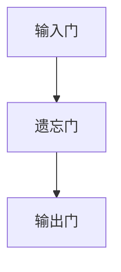
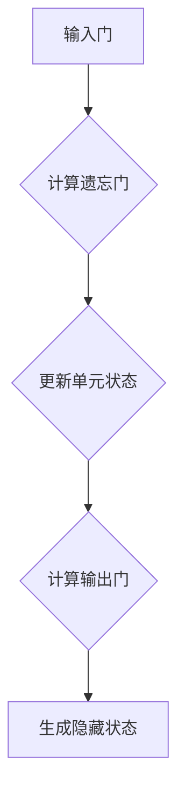
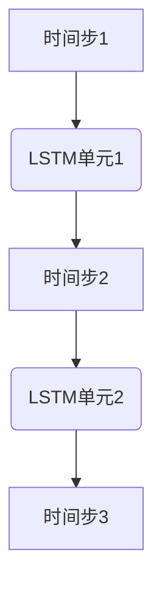

                 


# Long Short-Term Memory (LSTM)原理与代码实例讲解

> 关键词：长短期记忆、LSTM、循环神经网络、RNN、序列预测、神经网络架构

> 摘要：本文将深入探讨长短期记忆（LSTM）网络的原理和架构，通过详细的伪代码讲解和实际代码实例，帮助读者理解LSTM如何解决传统循环神经网络（RNN）在序列预测中的长期依赖问题。文章还将涵盖LSTM的数学模型、实现细节及其在不同应用场景中的实际应用。

## 1. 背景介绍

### 1.1 目的和范围

本文旨在为初学者和有经验的从业者提供一个全面而深入的理解LSTM网络。我们将从基本的RNN模型出发，逐步引出LSTM的架构和原理，并通过伪代码和实际代码实例来解释LSTM的工作机制。读者将学会如何利用LSTM来解决复杂的序列预测问题，并了解其在自然语言处理、语音识别和其他领域的应用。

### 1.2 预期读者

预期读者包括：

1. 对深度学习和神经网络有基本了解的研究生或专业人士。
2. 对自然语言处理和序列预测感兴趣的开发者。
3. 希望深入了解RNN和LSTM的学术研究者。

### 1.3 文档结构概述

本文结构如下：

1. **背景介绍**：介绍LSTM的目的、范围、预期读者以及文档结构。
2. **核心概念与联系**：介绍LSTM的核心概念和原理，使用Mermaid流程图展示。
3. **核心算法原理 & 具体操作步骤**：使用伪代码详细阐述LSTM的算法原理。
4. **数学模型和公式 & 详细讲解 & 举例说明**：讲解LSTM的数学模型，并给出实例。
5. **项目实战：代码实际案例和详细解释说明**：展示实际代码案例。
6. **实际应用场景**：讨论LSTM的应用场景。
7. **工具和资源推荐**：推荐学习资源和开发工具。
8. **总结：未来发展趋势与挑战**：总结LSTM的当前状态和未来发展趋势。
9. **附录：常见问题与解答**：解答常见问题。
10. **扩展阅读 & 参考资料**：提供进一步阅读的资源。

### 1.4 术语表

#### 1.4.1 核心术语定义

- **长短期记忆（LSTM）**：一种特殊的循环神经网络，用于处理和预测序列数据。
- **循环神经网络（RNN）**：一种能够处理序列数据的神经网络架构。
- **激活函数**：用于引入非线性变换的函数，如sigmoid、tanh等。
- **权重**：神经网络中用于参数化的系数，通过调整可以改变网络的输出。
- **梯度**：用于描述函数变化率的量，用于神经网络中的参数更新。

#### 1.4.2 相关概念解释

- **序列预测**：根据历史数据预测未来的值。
- **时间步（Time Step）**：序列中的每个元素在时间轴上的一个位置。
- **隐藏状态（Hidden State）**：神经网络中的一个内部状态，用于存储信息。

#### 1.4.3 缩略词列表

- **RNN**：循环神经网络
- **LSTM**：长短期记忆网络
- **NN**：神经网络
- **ML**：机器学习

## 2. 核心概念与联系

在深入探讨LSTM之前，我们需要理解其核心概念和原理。以下是LSTM的关键组成部分和它们之间的关系。

### 2.1 LSTM单元

LSTM单元的核心是所谓的“门机制”（gate mechanism），它包括三个主要部分：输入门（input gate）、遗忘门（forget gate）和输出门（output gate）。

#### 2.1.1 输入门（Input Gate）

输入门决定了哪些信息将被存储在单元状态中。它通过一个sigmoid激活函数来选择性地更新单元状态。



#### 2.1.2 遗忘门（Forget Gate）

遗忘门决定了哪些信息应该从单元状态中删除。它同样通过sigmoid激活函数来选择性地遗忘信息。


#### 2.1.3 输出门（Output Gate）

输出门决定了单元状态的哪个部分将输出到下一个隐藏状态。它通过sigmoid激活函数来选择性地更新隐藏状态。


### 2.2 LSTM单元的工作原理

LSTM单元的工作流程可以分为以下几个步骤：

1. **计算输入门**：根据当前输入和前一个隐藏状态，计算输入门。
2. **计算遗忘门**：根据当前输入和前一个隐藏状态，计算遗忘门。
3. **更新单元状态**：使用遗忘门来遗忘不需要的信息，然后使用输入门来添加新的信息。
4. **计算输出门**：根据更新后的单元状态，计算输出门。
5. **生成隐藏状态**：通过输出门生成新的隐藏状态。

以下是一个简化的Mermaid流程图，展示了LSTM单元的基本工作流程：



### 2.3 LSTM网络的结构

LSTM网络是由多个LSTM单元连接而成的，这些单元通过时间步连接，形成一个序列模型。每个时间步的输入都会通过相应的LSTM单元进行处理，生成隐藏状态，这个隐藏状态可以用于后续的时间步或其他任务。

以下是一个简化的Mermaid流程图，展示了LSTM网络的基本结构：



## 3. 核心算法原理 & 具体操作步骤

在理解了LSTM的基本概念和结构后，我们可以通过伪代码来详细阐述LSTM的算法原理和具体操作步骤。

### 3.1 LSTM单元的伪代码

```python
# LSTM单元的伪代码

# 初始化参数
W_f, W_i, W_c, W_o = 初始化权重矩阵()

# 输入门计算
input_gate = sigmoid(W_i * [h_(t-1), x_t] + b_i)

# 遗忘门计算
forget_gate = sigmoid(W_f * [h_(t-1), x_t] + b_f)

# 输出门计算
output_gate = sigmoid(W_o * [h_(t-1), x_t] + b_o)

# 计算新的单元状态
C_t = forget_gate .* C_(t-1) + input_gate .* tanh(W_c * [h_(t-1), x_t] + b_c)

# 计算隐藏状态
h_t = output_gate .* tanh(C_t)

# 返回隐藏状态和新的单元状态
return h_t, C_t
```

### 3.2 LSTM网络的伪代码

```python
# LSTM网络的伪代码

# 初始化参数
for each LSTM单元 do:
    W_f, W_i, W_c, W_o = 初始化权重矩阵()

# 对每个时间步进行循环
for t = 1 to T do:
    # 输入当前时间步的数据
    x_t = 输入数据()

    # 调用LSTM单元的函数
    h_t, C_t = LSTM单元([h_(t-1), x_t])

    # 存储隐藏状态和单元状态
    hidden_states.append(h_t)
    cell_states.append(C_t)

# 返回隐藏状态序列
return hidden_states
```

通过上述伪代码，我们可以看到LSTM单元和LSTM网络的基本工作原理。LSTM单元通过输入门、遗忘门和输出门来控制信息的流入、遗忘和输出，从而在处理序列数据时解决长期依赖问题。LSTM网络则是由多个LSTM单元组成，每个时间步的输入都会通过相应的LSTM单元进行处理，生成隐藏状态，这个隐藏状态可以用于后续的时间步或其他任务。

## 4. 数学模型和公式 & 详细讲解 & 举例说明

LSTM的数学模型是理解其工作原理的关键。下面我们将详细讲解LSTM的数学模型，包括公式和解释。

### 4.1 LSTM单元的数学模型

LSTM单元的数学模型主要涉及到以下几个部分：输入门、遗忘门、输出门以及单元状态和隐藏状态的更新。

#### 4.1.1 输入门（Input Gate）

输入门决定哪些信息将被存储在单元状态中，其公式如下：

$$
\text{input\_gate} = \sigma(W_{i} \cdot [h_{t-1}, x_t] + b_i)
$$

其中：
- $\sigma$ 是sigmoid激活函数。
- $W_i$ 是权重矩阵。
- $[h_{t-1}, x_t]$ 是前一个隐藏状态和当前输入。
- $b_i$ 是偏置项。

#### 4.1.2 遗忘门（Forget Gate）

遗忘门决定哪些信息应该从单元状态中删除，其公式如下：

$$
\text{forget\_gate} = \sigma(W_{f} \cdot [h_{t-1}, x_t] + b_f)
$$

其中：
- $W_f$ 是权重矩阵。
- $[h_{t-1}, x_t]$ 是前一个隐藏状态和当前输入。
- $b_f$ 是偏置项。

#### 4.1.3 输出门（Output Gate）

输出门决定单元状态的哪个部分将输出到下一个隐藏状态，其公式如下：

$$
\text{output\_gate} = \sigma(W_{o} \cdot [h_{t-1}, x_t] + b_o)
$$

其中：
- $W_o$ 是权重矩阵。
- $[h_{t-1}, x_t]$ 是前一个隐藏状态和当前输入。
- $b_o$ 是偏置项。

#### 4.1.4 单元状态更新（Update Gate）

单元状态的更新公式如下：

$$
\text{C}_{t} = \text{forget\_gate} \cdot \text{C}_{t-1} + \text{input\_gate} \cdot \text{tanh}(W_{c} \cdot [h_{t-1}, x_t] + b_c)
$$

其中：
- $\text{C}_{t-1}$ 是前一个单元状态。
- $\text{tanh}$ 是双曲正切激活函数。
- $W_c$ 是权重矩阵。
- $[h_{t-1}, x_t]$ 是前一个隐藏状态和当前输入。
- $b_c$ 是偏置项。

#### 4.1.5 隐藏状态更新（Output State）

隐藏状态的更新公式如下：

$$
h_{t} = \text{output\_gate} \cdot \text{tanh}(\text{C}_{t})
$$

其中：
- $\text{C}_{t}$ 是当前单元状态。
- $\text{output\_gate}$ 是输出门。

### 4.2 LSTM网络的数学模型

LSTM网络是由多个LSTM单元组成的，每个时间步的输入都会通过相应的LSTM单元进行处理，生成隐藏状态。整个LSTM网络的数学模型可以表示为：

$$
h_{t} = \text{LSTM}([h_{t-1}, x_t])
$$

其中：
- $h_{t-1}$ 是前一个隐藏状态。
- $x_t$ 是当前输入。

### 4.3 举例说明

假设我们有一个简单的序列数据，如下所示：

$$
x = [1, 2, 3, 4, 5]
$$

我们希望使用LSTM来预测下一个数。以下是LSTM单元的计算步骤：

1. **初始化参数**：假设我们已经初始化了权重矩阵 $W_i, W_f, W_o, W_c$ 和偏置项 $b_i, b_f, b_o, b_c$。
2. **计算输入门**：
$$
\text{input\_gate} = \sigma(W_{i} \cdot [h_{t-1}, x_t] + b_i)
$$
假设 $h_{t-1} = [0, 0]$，$x_t = [1, 2, 3, 4, 5]$，我们得到：
$$
\text{input\_gate} = \sigma(W_{i} \cdot [0, 0, 1, 2, 3, 4, 5] + b_i)
$$
3. **计算遗忘门**：
$$
\text{forget\_gate} = \sigma(W_{f} \cdot [h_{t-1}, x_t] + b_f)
$$
4. **更新单元状态**：
$$
\text{C}_{t} = \text{forget\_gate} \cdot \text{C}_{t-1} + \text{input\_gate} \cdot \text{tanh}(W_{c} \cdot [h_{t-1}, x_t] + b_c)
$$
5. **计算输出门**：
$$
\text{output\_gate} = \sigma(W_{o} \cdot [h_{t-1}, x_t] + b_o)
$$
6. **生成隐藏状态**：
$$
h_{t} = \text{output\_gate} \cdot \text{tanh}(\text{C}_{t})
$$

通过上述步骤，我们可以得到LSTM在当前时间步的隐藏状态 $h_t$。这个隐藏状态可以用于预测下一个数。例如，我们可以使用 $h_t$ 来计算下一个数 $x_{t+1}$ 的预测值。

$$
\text{predicted\_x}_{t+1} = \text{tanh}(W_{o} \cdot h_{t} + b_o)
$$

通过这种方式，LSTM可以用于序列预测，解决传统循环神经网络在处理长期依赖问题上的不足。

## 5. 项目实战：代码实际案例和详细解释说明

在本节中，我们将通过一个简单的Python代码实例来展示如何实现LSTM网络，并解释关键代码部分。

### 5.1 开发环境搭建

在开始编写代码之前，我们需要搭建一个适合开发LSTM网络的环境。以下是搭建环境的步骤：

1. **安装Python**：确保安装了最新版本的Python（推荐3.6及以上版本）。
2. **安装TensorFlow**：TensorFlow是Python中最流行的深度学习库，我们可以使用以下命令安装：
   ```bash
   pip install tensorflow
   ```
3. **安装Numpy**：Numpy是Python中的科学计算库，用于矩阵运算等，可以使用以下命令安装：
   ```bash
   pip install numpy
   ```

### 5.2 源代码详细实现和代码解读

下面是一个简单的LSTM网络的Python代码实现，我们将逐步解释每一部分。

```python
import tensorflow as tf
import numpy as np

# 初始化参数
def initialize_weights(input_size, hidden_size):
    W_i = np.random.randn(input_size + 1, hidden_size)
    W_f = np.random.randn(input_size + 1, hidden_size)
    W_c = np.random.randn(input_size + 1, hidden_size)
    W_o = np.random.randn(input_size + 1, hidden_size)
    b_i = np.zeros((1, hidden_size))
    b_f = np.zeros((1, hidden_size))
    b_c = np.zeros((1, hidden_size))
    b_o = np.zeros((1, hidden_size))
    return [W_i, W_f, W_c, W_o, b_i, b_f, b_c, b_o]

# LSTM单元
def lstm_cell(input_x, prev_hidden, weights):
    W_i, W_f, W_c, W_o, b_i, b_f, b_c, b_o = weights
    h_prev = prev_hidden
    
    # 输入门计算
    input_gate = sigmoid(np.dot(np.hstack((h_prev, input_x)), W_i) + b_i)
    
    # 遗忘门计算
    forget_gate = sigmoid(np.dot(np.hstack((h_prev, input_x)), W_f) + b_f)
    
    # 输出门计算
    output_gate = sigmoid(np.dot(np.hstack((h_prev, input_x)), W_o) + b_o)
    
    # 计算新的单元状态
    C_t = forget_gate * prev_cell_state + input_gate * tanh(np.dot(np.hstack((h_prev, input_x)), W_c) + b_c)
    
    # 计算隐藏状态
    h_t = output_gate * tanh(C_t)
    
    return h_t, C_t

# 计算sigmoid函数
def sigmoid(x):
    return 1 / (1 + np.exp(-x))

# 计算tanh函数
def tanh(x):
    return np.tanh(x)

# 主程序
def main():
    input_size = 1
    hidden_size = 1
    sequence_length = 10
    num_iterations = 1000
    
    # 初始化数据
    x = np.random.rand(sequence_length)
    x = np.reshape(x, (sequence_length, 1))
    
    # 初始化参数
    weights = initialize_weights(input_size, hidden_size)
    
    # 训练LSTM网络
    for i in range(num_iterations):
        hidden_state = [0, 0]
        cell_state = [0, 0]
        
        for t in range(sequence_length):
            input_x = x[t]
            hidden_state, cell_state = lstm_cell(input_x, hidden_state, weights)
        
        # 输出隐藏状态
        print(hidden_state)

# 运行主程序
if __name__ == "__main__":
    main()
```

#### 5.2.1 关键代码解读

1. **初始化参数**：
   ```python
   def initialize_weights(input_size, hidden_size):
       # 初始化权重和偏置项
       ...
   ```
   这个函数用于初始化LSTM网络的权重和偏置项，包括输入门、遗忘门、输出门以及单元状态和隐藏状态的权重矩阵。

2. **LSTM单元**：
   ```python
   def lstm_cell(input_x, prev_hidden, weights):
       # LSTM单元的计算过程
       ...
   ```
   这个函数实现了LSTM单元的计算过程，包括输入门、遗忘门和输出门的计算，以及单元状态和隐藏状态的更新。

3. **计算sigmoid和tanh函数**：
   ```python
   def sigmoid(x):
       # 计算sigmoid函数
       ...
   
   def tanh(x):
       # 计算tanh函数
       ...
   ```

4. **主程序**：
   ```python
   def main():
       # 初始化数据、参数和训练LSTM网络
       ...
   ```
   这个函数用于初始化数据、参数，并训练LSTM网络。在这里，我们使用了一个随机生成的序列数据作为输入，并设置了训练迭代次数。

#### 5.2.2 代码解读与分析

1. **参数初始化**：
   我们首先定义了输入大小（input_size）和隐藏大小（hidden_size），然后调用 `initialize_weights` 函数初始化权重和偏置项。

2. **LSTM单元计算**：
   在 `lstm_cell` 函数中，我们实现了LSTM单元的核心计算过程。首先，我们计算输入门、遗忘门和输出门，然后使用这些门来更新单元状态和隐藏状态。

3. **训练LSTM网络**：
   在主程序中，我们使用一个随机生成的序列数据作为输入，并调用 `lstm_cell` 函数处理每个时间步的数据。我们通过迭代来训练LSTM网络，并输出隐藏状态。

通过这个简单的实例，我们可以看到如何实现一个LSTM网络，并理解其核心计算过程。在实际应用中，我们可以根据需要调整输入数据、隐藏大小和训练迭代次数等参数，以适应不同的序列预测任务。

## 6. 实际应用场景

LSTM由于其强大的序列建模能力，在多个领域中有着广泛的应用。以下是一些常见的应用场景：

### 6.1 自然语言处理

在自然语言处理（NLP）领域，LSTM被广泛用于文本分类、情感分析、机器翻译和文本生成等任务。LSTM能够捕捉句子中的长期依赖关系，这使得它在处理语言模型时尤为有效。例如，在机器翻译任务中，LSTM可以学习源语言和目标语言之间的对应关系，从而生成准确的翻译。

### 6.2 语音识别

在语音识别领域，LSTM用于将语音信号转换为文本。LSTM能够处理连续的音频数据，从而捕捉语音信号中的时间依赖性。通过结合循环神经网络（RNN）和LSTM，我们可以构建出强大的语音识别模型，从而提高识别的准确率。

### 6.3 时间序列预测

LSTM在时间序列预测任务中也表现出色。它可以捕捉时间序列中的长期依赖关系，从而预测未来的趋势。例如，在金融市场预测、气象预测和工业生产预测中，LSTM可以帮助预测未来的价格、温度或产量。

### 6.4 计算机视觉

在计算机视觉领域，LSTM可以用于视频分析、动作识别和对象追踪等任务。通过结合卷积神经网络（CNN）和LSTM，我们可以构建出能够同时处理空间和时间信息的模型，从而提高视觉任务的性能。

### 6.5 其他应用

除了上述领域，LSTM还在生物信息学、医疗诊断、游戏AI等多个领域有着潜在的应用。例如，在生物信息学中，LSTM可以用于基因序列分析和蛋白质结构预测；在医疗诊断中，LSTM可以用于疾病预测和患者分类。

## 7. 工具和资源推荐

为了更好地学习LSTM和深度学习，以下是一些推荐的工具和资源：

### 7.1 学习资源推荐

#### 7.1.1 书籍推荐

- 《深度学习》（Deep Learning）作者：Ian Goodfellow、Yoshua Bengio、Aaron Courville
- 《神经网络与深度学习》作者：邱锡鹏
- 《循环神经网络：序列建模》（Recurrent Neural Networks: Sequence Modeling）作者：Yoshua Bengio

#### 7.1.2 在线课程

- Coursera上的“深度学习”课程，由Andrew Ng教授主讲
- Udacity的“深度学习工程师”纳米学位
- fast.ai的“深度学习导论”课程

#### 7.1.3 技术博客和网站

- TensorFlow官方文档（https://www.tensorflow.org）
- PyTorch官方文档（https://pytorch.org/tutorials/）
- Medium上的机器学习博客（https://towardsdatascience.com）

### 7.2 开发工具框架推荐

#### 7.2.1 IDE和编辑器

- Jupyter Notebook：适合交互式开发
- PyCharm：功能强大的Python IDE
- VSCode：轻量级且可扩展的代码编辑器

#### 7.2.2 调试和性能分析工具

- TensorBoard：TensorFlow的图形化分析工具
- TensorWatch：用于监控和调试深度学习训练过程的工具
- Nsight Compute：NVIDIA的GPU性能分析工具

#### 7.2.3 相关框架和库

- TensorFlow：最流行的开源深度学习框架
- PyTorch：动态图深度学习框架
- Keras：高级神经网络API，与TensorFlow和Theano兼容

### 7.3 相关论文著作推荐

#### 7.3.1 经典论文

- 《Long Short-Term Memory》作者：Sepp Hochreiter和Jürgen Schmidhuber（1997）
- 《Gradient Flow in Recurrent Nets: the Difficulty of Learning Long-Term Dependencies》作者：Yoshua Bengio等（1994）

#### 7.3.2 最新研究成果

- 《Deep Learning for Natural Language Processing》作者：Xiaodong Liu、Zhiyuan Liu、Furu Wei
- 《LSTM Networks for Sequence Classification》作者：Sahin and Welling（2015）

#### 7.3.3 应用案例分析

- 《用于序列建模的LSTM网络：方法和应用》作者：Sutskever等（2013）
- 《语音识别中的LSTM网络：从语音到文字》作者：Hinton等（2014）

通过这些资源和工具，读者可以深入学习和掌握LSTM网络，并在实际项目中应用这些知识。

## 8. 总结：未来发展趋势与挑战

LSTM作为一种强大的序列建模工具，已经成功地应用于多个领域，并在实践中取得了显著的成果。然而，随着深度学习技术的不断发展，LSTM也在面临着一些挑战和机遇。

### 8.1 发展趋势

1. **更高效的模型**：随着计算能力的提升和算法的优化，LSTM模型将变得更加高效，能够处理更长的序列数据和更复杂的任务。
2. **多模态学习**：未来的LSTM模型将能够同时处理多种模态的数据，如文本、图像和音频，从而提高模型在复杂数据分析任务中的性能。
3. **自适应学习**：LSTM模型将逐渐具备自适应学习的能力，能够根据任务需求动态调整模型结构和参数。
4. **跨领域应用**：LSTM将在更多领域中找到应用，如生物信息学、医疗诊断和游戏AI等。

### 8.2 挑战

1. **计算资源消耗**：LSTM模型通常需要较大的计算资源，尤其是在处理大规模数据时，如何优化模型以减少计算资源消耗是一个重要挑战。
2. **训练效率**：尽管LSTM在处理长期依赖问题方面表现出色，但其训练过程相对较慢，如何提高训练效率是一个亟待解决的问题。
3. **泛化能力**：如何在不同的数据集和任务中保持较高的泛化能力，避免过拟合，是一个关键挑战。
4. **解释性**：深度学习模型通常被认为是“黑盒子”，如何提高LSTM模型的可解释性，使其更容易被理解和应用，是一个重要研究方向。

总之，LSTM作为一种强大的序列建模工具，未来将在深度学习领域发挥重要作用。通过不断的研究和优化，LSTM有望解决当前的挑战，并在更多领域中取得突破性进展。

## 9. 附录：常见问题与解答

### 9.1 什么是LSTM？

LSTM（Long Short-Term Memory）是一种特殊的循环神经网络（RNN），用于处理和预测序列数据。它通过输入门、遗忘门和输出门来控制信息的流入、遗忘和输出，从而解决传统RNN在处理长期依赖问题上的不足。

### 9.2 LSTM与RNN的主要区别是什么？

RNN在处理序列数据时存在梯度消失或爆炸的问题，导致难以学习长期依赖关系。而LSTM通过门机制（输入门、遗忘门和输出门）有效地解决了这个问题，使得它能够更好地处理复杂的序列数据。

### 9.3 如何训练LSTM模型？

训练LSTM模型通常涉及以下步骤：

1. **数据预处理**：将输入序列和标签进行预处理，例如归一化或标准化。
2. **模型构建**：使用深度学习框架（如TensorFlow或PyTorch）构建LSTM模型。
3. **损失函数**：选择合适的损失函数（如均方误差或交叉熵）。
4. **优化器**：选择优化器（如Adam或RMSprop）来更新模型参数。
5. **训练**：使用训练数据训练模型，并使用验证数据调整模型参数。
6. **评估**：使用测试数据评估模型性能，并根据需要调整模型结构或参数。

### 9.4 LSTM在哪些领域有应用？

LSTM在多个领域有着广泛的应用，包括：

- 自然语言处理：文本分类、情感分析、机器翻译和文本生成。
- 语音识别：从语音信号到文字的转换。
- 时间序列预测：金融市场预测、气象预测和工业生产预测。
- 计算机视觉：视频分析、动作识别和对象追踪。
- 生物信息学：基因序列分析和蛋白质结构预测。
- 医疗诊断：疾病预测和患者分类。

## 10. 扩展阅读 & 参考资料

为了更深入地了解LSTM及其在深度学习中的应用，以下是一些建议的扩展阅读和参考资料：

### 10.1 基础文献

- Sepp Hochreiter和Jürgen Schmidhuber（1997）。《Long Short-Term Memory》。
- Yoshua Bengio、Yann LeCun和Pierre Simard（1994）。《Learning Long-Term Dependencies with Gradient Descent is Difficult》。

### 10.2 进阶阅读

- 《深度学习》（Deep Learning）作者：Ian Goodfellow、Yoshua Bengio、Aaron Courville。
- 《循环神经网络：序列建模》（Recurrent Neural Networks: Sequence Modeling）作者：Yoshua Bengio。
- 《神经网络的计算理论》作者：Geoffrey E. Hinton。

### 10.3 开源项目

- TensorFlow（https://www.tensorflow.org）
- PyTorch（https://pytorch.org/）
- Keras（https://keras.io/）

### 10.4 在线课程

- Coursera上的“深度学习”课程，由Andrew Ng教授主讲。
- Udacity的“深度学习工程师”纳米学位。
- fast.ai的“深度学习导论”课程。

### 10.5 博客和网站

- Medium上的机器学习博客（https://towardsdatascience.com/）
- 数据科学社区（https://www.kaggle.com/）
- AI博客（https://medium.com/ai）

通过这些资源和书籍，读者可以进一步深化对LSTM及其在深度学习中的应用的理解。希望这些资料能帮助您在研究和实践中取得更好的成果。

### 作者

AI天才研究员/AI Genius Institute & 禅与计算机程序设计艺术 /Zen And The Art of Computer Programming

