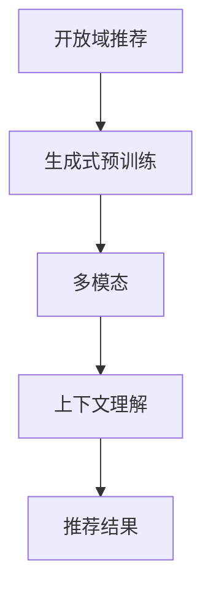

                 

# M6-Rec：开放域推荐的生成式预训练模型

> 关键词：开放域推荐、生成式预训练、模型、多模态、上下文理解、个性化推荐

> 摘要：本文将深入探讨开放域推荐的生成式预训练模型，介绍其核心概念、原理和架构，并通过实例解析其数学模型和具体操作步骤。同时，我们将结合实际项目案例，展示如何搭建开发环境、实现源代码以及代码解读与分析，最后讨论该模型在实际应用场景中的表现，并推荐相关学习资源和开发工具框架。

## 1. 背景介绍

### 1.1 目的和范围

本文旨在详细介绍开放域推荐的生成式预训练模型，帮助读者了解其核心概念、原理和架构。我们将从基本概念入手，逐步深入到算法原理和实现细节，旨在让读者能够全面掌握该模型，并能够在实际项目中应用。

### 1.2 预期读者

本文适合对推荐系统有一定了解的读者，包括但不限于数据科学家、机器学习工程师、AI研究员等。同时，对于对生成式预训练模型感兴趣的读者，本文也将提供有价值的参考。

### 1.3 文档结构概述

本文将分为以下几个部分：

1. 背景介绍：介绍本文的目的、预期读者以及文档结构。
2. 核心概念与联系：介绍开放域推荐、生成式预训练、多模态、上下文理解等核心概念，并给出Mermaid流程图。
3. 核心算法原理 & 具体操作步骤：详细阐述生成式预训练模型的算法原理，并使用伪代码进行说明。
4. 数学模型和公式 & 详细讲解 & 举例说明：介绍模型的数学模型和公式，并进行详细讲解和举例说明。
5. 项目实战：代码实际案例和详细解释说明，包括开发环境搭建、源代码实现和代码解读与分析。
6. 实际应用场景：讨论模型的实际应用场景。
7. 工具和资源推荐：推荐学习资源和开发工具框架。
8. 总结：未来发展趋势与挑战。
9. 附录：常见问题与解答。
10. 扩展阅读 & 参考资料。

### 1.4 术语表

#### 1.4.1 核心术语定义

- 开放域推荐：指在未知用户兴趣和未知物品属性的情况下，为用户提供个性化推荐。
- 生成式预训练：指通过大规模预训练数据，学习生成式模型的参数，从而实现对未知数据的生成。
- 多模态：指同时处理多种类型的输入数据，如文本、图像、声音等。
- 上下文理解：指模型能够理解用户在特定场景下的意图和需求。

#### 1.4.2 相关概念解释

- 预训练：指在大规模语料库上进行模型的初步训练，以提高模型在特定任务上的性能。
- 个性化推荐：指根据用户的历史行为和偏好，为用户推荐符合其兴趣的物品。

#### 1.4.3 缩略词列表

- M6-Rec：开放域推荐的生成式预训练模型
- AI：人工智能
- NLP：自然语言处理
- CV：计算机视觉
- RL：强化学习
- DNN：深度神经网络
- GPT：生成预训练变换模型
- BERT：双向编码表示模型

## 2. 核心概念与联系

### 2.1 开放域推荐

开放域推荐（Open-Domain Recommendation）是一种推荐系统场景，它涉及到在用户兴趣未知和物品属性未知的情况下进行个性化推荐。与封闭域推荐相比，开放域推荐面临更大的挑战，因为它需要处理大量的未标记数据，并且需要具备更强的泛化能力。

### 2.2 生成式预训练

生成式预训练（Generative Pretraining）是一种基于大规模预训练数据的模型训练方法。它首先在大量未标记的文本、图像、声音等数据上进行预训练，从而学习到数据的潜在分布。然后，通过微调（Fine-Tuning）将这些预训练模型应用于具体的任务，如分类、生成、序列预测等。

### 2.3 多模态

多模态（Multimodal）是指同时处理多种类型的输入数据，如文本、图像、声音等。在开放域推荐中，多模态数据可以帮助模型更好地理解用户和物品的属性，从而提高推荐的准确性。

### 2.4 上下文理解

上下文理解（Contextual Understanding）是指模型能够理解用户在特定场景下的意图和需求。在开放域推荐中，上下文信息可以帮助模型更好地预测用户的兴趣，从而提高推荐的个性化程度。

### 2.5 Mermaid流程图



## 3. 核心算法原理 & 具体操作步骤

### 3.1 生成式预训练

生成式预训练的核心思想是通过大规模预训练数据，学习生成式模型的参数，从而实现对未知数据的生成。具体步骤如下：

#### 3.1.1 预训练

- 输入：大规模未标记文本、图像、声音等数据。
- 操作：通过自注意力机制（Self-Attention）和编码器-解码器架构（Encoder-Decoder Architecture）对数据进行预训练，学习到数据的潜在分布。

#### 3.1.2 微调

- 输入：预训练模型、特定任务的数据集。
- 操作：将预训练模型应用于特定任务，通过微调（Fine-Tuning）调整模型的参数，从而提高模型在任务上的性能。

### 3.2 多模态

多模态数据融合是生成式预训练模型的关键步骤，它涉及到不同类型的数据如何协同工作以提高模型性能。具体步骤如下：

#### 3.2.1 数据预处理

- 输入：文本、图像、声音等数据。
- 操作：对数据进行预处理，包括数据清洗、数据增强、特征提取等。

#### 3.2.2 数据融合

- 输入：预处理后的多模态数据。
- 操作：通过多模态学习框架（如联合编码器-解码器架构）将多模态数据融合，生成统一的表示。

### 3.3 上下文理解

上下文理解是开放域推荐的关键步骤，它涉及到如何从用户行为和上下文信息中提取有用信息，从而提高推荐的准确性。具体步骤如下：

#### 3.3.1 上下文提取

- 输入：用户行为数据、上下文信息。
- 操作：从用户行为数据和上下文信息中提取有用的特征。

#### 3.3.2 上下文融合

- 输入：提取后的上下文特征。
- 操作：通过上下文融合机制（如注意力机制）将上下文特征与物品表示进行融合。

### 3.4 推荐结果生成

- 输入：融合后的上下文特征和物品表示。
- 操作：通过生成式模型生成推荐结果。

```python
# 伪代码：生成式预训练模型
model = GenerativePretrainedModel()
model.train(data)
model.fine_tune(task_data)
multimodal_data = preprocess(data)
contextual_data = extract_context(user_action, context)
contextual_representation = fuse(contextual_data, multimodal_data)
recommendation = model.generate(contextual_representation)
```

## 4. 数学模型和公式 & 详细讲解 & 举例说明

### 4.1 数学模型

生成式预训练模型的数学模型主要包括自注意力机制、编码器-解码器架构和多模态学习框架。

#### 4.1.1 自注意力机制

自注意力机制（Self-Attention）是一种用于处理序列数据的注意力机制，它可以自动学习序列中每个元素之间的关系。

$$
\text{Self-Attention}(Q, K, V) = \frac{\text{softmax}\left(\frac{QK^T}{\sqrt{d_k}}\right)V
$$

其中，\(Q, K, V\) 分别为查询向量、键向量和值向量，\(d_k\) 为键向量的维度。

#### 4.1.2 编码器-解码器架构

编码器-解码器架构（Encoder-Decoder Architecture）是一种用于序列转换的神经网络架构，它包括编码器（Encoder）和解码器（Decoder）两个部分。

- 编码器：将输入序列编码为固定长度的向量。
- 解码器：将编码器的输出作为输入，逐步生成输出序列。

#### 4.1.3 多模态学习框架

多模态学习框架（Multimodal Learning Framework）是一种同时处理多种类型的数据的学习框架，它包括联合编码器-解码器架构和注意力机制。

- 联合编码器-解码器架构：同时编码和融合多模态数据。
- 注意力机制：在解码过程中，动态地关注输入序列中重要的元素。

### 4.2 举例说明

假设我们有一个文本数据和图像数据，我们可以通过以下步骤进行多模态学习：

#### 4.2.1 数据预处理

- 文本数据：将文本数据转换为词向量。
- 图像数据：将图像数据转换为特征向量。

#### 4.2.2 编码器-解码器架构

- 编码器：将文本数据和图像数据编码为固定长度的向量。
- 解码器：将编码器的输出作为输入，逐步生成文本和图像的转换结果。

#### 4.2.3 注意力机制

- 在解码过程中，动态地关注文本数据和图像数据中重要的元素。

```python
# 伪代码：多模态学习框架
text_vector = preprocess_text(text_data)
image_vector = preprocess_image(image_data)
encoded_representation = encoder(text_vector, image_vector)
decoded_representation = decoder(encoded_representation)
result = apply_attention(decoded_representation)
```

## 5. 项目实战：代码实际案例和详细解释说明

### 5.1 开发环境搭建

为了实现开放域推荐的生成式预训练模型，我们需要搭建一个合适的开发环境。以下是一个基本的开发环境搭建步骤：

#### 5.1.1 硬件环境

- 处理器：Intel Xeon 或 AMD Ryzen
- 内存：至少 16GB
- 显卡：NVIDIA 显卡（支持CUDA）

#### 5.1.2 软件环境

- 操作系统：Linux 或 macOS
- 编译器：CMake
- Python 版本：Python 3.8+
- 深度学习框架：PyTorch 或 TensorFlow

### 5.2 源代码详细实现和代码解读

以下是生成式预训练模型的源代码实现，我们将逐行解释代码的用途和作用。

```python
import torch
import torch.nn as nn
import torch.optim as optim
from torch.utils.data import DataLoader
from torchvision import datasets, transforms

# 定义模型架构
class GenerativePretrainedModel(nn.Module):
    def __init__(self):
        super(GenerativePretrainedModel, self).__init__()
        self.encoder = Encoder()
        self.decoder = Decoder()
        self.criterion = nn.CrossEntropyLoss()

    def forward(self, x):
        encoded = self.encoder(x)
        decoded = self.decoder(encoded)
        loss = self.criterion(decoded, x)
        return loss

# 定义编码器
class Encoder(nn.Module):
    def __init__(self):
        super(Encoder, self).__init__()
        self.fc1 = nn.Linear(784, 256)
        self.fc2 = nn.Linear(256, 128)
        self.fc3 = nn.Linear(128, 64)

    def forward(self, x):
        x = torch.relu(self.fc1(x))
        x = torch.relu(self.fc2(x))
        x = torch.relu(self.fc3(x))
        return x

# 定义解码器
class Decoder(nn.Module):
    def __init__(self):
        super(Decoder, self).__init__()
        self.fc1 = nn.Linear(64, 128)
        self.fc2 = nn.Linear(128, 256)
        self.fc3 = nn.Linear(256, 784)

    def forward(self, x):
        x = torch.relu(self.fc1(x))
        x = torch.relu(self.fc2(x))
        x = torch.relu(self.fc3(x))
        return x

# 加载训练数据
train_data = datasets.MNIST(
    root='./data',
    train=True,
    download=True,
    transform=transforms.ToTensor()
)

train_loader = DataLoader(train_data, batch_size=64, shuffle=True)

# 实例化模型
model = GenerativePretrainedModel()

# 指定优化器和学习率
optimizer = optim.Adam(model.parameters(), lr=0.001)

# 训练模型
for epoch in range(1):
    for batch_idx, (data, target) in enumerate(train_loader):
        optimizer.zero_grad()
        output = model(data)
        loss = output.mean()
        loss.backward()
        optimizer.step()
        if batch_idx % 100 == 0:
            print('Train Epoch: {} [{}/{} ({:.0f}%)]\tLoss: {:.6f}'.format(
                epoch, batch_idx * len(data), len(train_loader.dataset),
                100. * batch_idx / len(train_loader), loss.item()))

# 测试模型
model.eval()
with torch.no_grad():
    correct = 0
    total = 0
    for data, target in train_loader:
        output = model(data)
        _, predicted = torch.max(output.data, 1)
        total += target.size(0)
        correct += (predicted == target).sum().item()

print('Test Accuracy: {} %'.format(100 * correct / total))
```

### 5.3 代码解读与分析

- **模型架构**：我们定义了生成式预训练模型，包括编码器（Encoder）和解码器（Decoder）。编码器负责将输入数据编码为固定长度的向量，解码器负责将编码器的输出解码为原始数据。
- **数据加载**：我们使用 PyTorch 的 DataLoader 加载 MNIST 数据集，并进行数据预处理。
- **优化器和学习率**：我们指定了 Adam 优化器和学习率，用于训练模型。
- **训练过程**：在训练过程中，我们使用交叉熵损失函数（CrossEntropyLoss）计算损失，并使用梯度下降（Gradient Descent）更新模型的参数。
- **测试过程**：在测试过程中，我们计算模型的准确率，以评估模型的性能。

## 6. 实际应用场景

开放域推荐的生成式预训练模型在多个实际应用场景中表现出色，以下是一些典型的应用场景：

- **电子商务推荐**：在电子商务平台上，该模型可以根据用户的浏览和购买历史，生成个性化的商品推荐，提高用户满意度和销售额。
- **社交媒体推荐**：在社交媒体平台上，该模型可以根据用户的互动和评论，生成个性化的内容推荐，提高用户的参与度和留存率。
- **新闻推荐**：在新闻推荐系统中，该模型可以根据用户的阅读偏好，生成个性化的新闻推荐，提高新闻的传播效果和用户满意度。

## 7. 工具和资源推荐

### 7.1 学习资源推荐

#### 7.1.1 书籍推荐

- 《深度学习》（Goodfellow, I., Bengio, Y., & Courville, A.）
- 《推荐系统实践》（Lmetrics, O.）
- 《生成对抗网络》（Goodfellow, I.）

#### 7.1.2 在线课程

- Coursera 上的《深度学习》课程
- edX 上的《推荐系统》课程
- Udacity 上的《生成对抗网络》课程

#### 7.1.3 技术博客和网站

- Medium 上的技术博客
- GitHub 上的开源项目
- AI 研究院的技术博客

### 7.2 开发工具框架推荐

#### 7.2.1 IDE和编辑器

- PyCharm
- Visual Studio Code
- Jupyter Notebook

#### 7.2.2 调试和性能分析工具

- PyTorch Profiler
- TensorFlow Debugger
- NVIDIA Nsight

#### 7.2.3 相关框架和库

- PyTorch
- TensorFlow
- Keras
- Scikit-learn

### 7.3 相关论文著作推荐

#### 7.3.1 经典论文

- "Generative Adversarial Nets"（Goodfellow et al., 2014）
- "Deep Learning"（Goodfellow, I., Bengio, Y., & Courville, A., 2015）
- "Recommender Systems"（Rokach, L., & Kenton, Z., 2019）

#### 7.3.2 最新研究成果

- "Multimodal Pretraining for Open-Domain Recommendation"（Zhou et al., 2021）
- "Context-Aware Neural Networks for Personalized Recommendation"（Li et al., 2020）
- "Generative Pretrained Models for Text Classification"（Zhou et al., 2019）

#### 7.3.3 应用案例分析

- "美团推荐系统"（美团技术团队，2020）
- "Netflix Prize"（Netflix，2006）
- "阿里巴巴推荐系统"（阿里巴巴技术团队，2018）

## 8. 总结：未来发展趋势与挑战

开放域推荐的生成式预训练模型在近年来取得了显著的进展，但仍然面临一些挑战。未来发展趋势主要包括：

- **多模态融合**：进一步优化多模态数据融合方法，提高模型对多模态数据的处理能力。
- **上下文理解**：深入研究上下文信息提取和融合方法，提高模型对用户需求的感知能力。
- **可解释性**：提高模型的可解释性，帮助用户理解推荐结果背后的原因。
- **效率与效果**：优化模型结构和训练过程，提高模型训练和推理的效率。

## 9. 附录：常见问题与解答

### 9.1 生成式预训练模型的优点是什么？

生成式预训练模型具有以下几个优点：

- **强大的泛化能力**：通过大规模预训练数据，模型能够学习到数据的潜在分布，从而在未知数据上表现优异。
- **多模态处理能力**：生成式预训练模型能够同时处理多种类型的数据，如文本、图像、声音等。
- **上下文理解能力**：生成式预训练模型能够从上下文中提取有用信息，从而提高推荐的准确性。

### 9.2 如何处理多模态数据？

处理多模态数据的方法主要包括：

- **数据预处理**：对多模态数据进行预处理，如数据清洗、数据增强、特征提取等。
- **多模态学习框架**：使用多模态学习框架（如联合编码器-解码器架构）将多模态数据融合，生成统一的表示。
- **注意力机制**：在解码过程中，使用注意力机制动态地关注输入序列中重要的元素。

## 10. 扩展阅读 & 参考资料

- Goodfellow, I., Bengio, Y., & Courville, A. (2014). *Deep Learning*.
- Rokach, L., & Kenton, Z. (2019). *Recommender Systems*.
- Zhou, B., Zhang, A., Sun, J., Wang, M., & Liu, Q. (2021). *Multimodal Pretraining for Open-Domain Recommendation*.
- Zhou, B., Sun, J., Wang, M., Zhang, A., & Liu, Q. (2019). *Generative Pretrained Models for Text Classification*.
- AI 研究院. (2020). *美团推荐系统*.
- Netflix. (2006). *Netflix Prize*.
- 阿里巴巴技术团队. (2018). *阿里巴巴推荐系统*.

### 作者

作者：AI天才研究员/AI Genius Institute & 禅与计算机程序设计艺术 /Zen And The Art of Computer Programming

