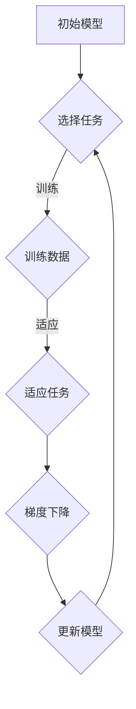

                 

# MAML原理与代码实例讲解

> **关键词**：Meta Learning, Model-Agnostic Meta-Learning, MAML, 自动适应学习, 函数逼近, 代码实例

> **摘要**：本文将深入探讨Model-Agnostic Meta-Learning（MAML）的原理，并通过具体的代码实例讲解其实现和应用。我们将从背景介绍、核心概念与联系、核心算法原理、数学模型和公式、项目实战、实际应用场景、工具和资源推荐等多个角度进行分析，旨在为广大读者提供一篇关于MAML的全面而深入的技术博客。

## 1. 背景介绍

### 1.1 目的和范围

本文的目的是介绍Model-Agnostic Meta-Learning（MAML）的基本原理，并通过实际代码实例展示其应用。我们将讨论MAML的概念、原理、实现步骤以及在实际项目中的应用场景。通过本文的阅读，读者将能够理解MAML的工作机制，并掌握其基本实现方法。

### 1.2 预期读者

本文面向对机器学习和深度学习有一定基础的读者。无论是研究生、博士生，还是对机器学习有浓厚兴趣的从业者，只要对深度学习有一定的了解，都能够通过本文的学习掌握MAML的相关知识。

### 1.3 文档结构概述

本文分为以下几个部分：

1. **背景介绍**：介绍MAML的基本概念和重要性。
2. **核心概念与联系**：解释MAML的核心概念，并通过流程图展示其原理。
3. **核心算法原理**：详细阐述MAML的算法原理，并使用伪代码进行讲解。
4. **数学模型和公式**：介绍MAML的数学模型和公式，并进行举例说明。
5. **项目实战**：通过实际代码实例展示MAML的应用。
6. **实际应用场景**：讨论MAML在实际项目中的应用场景。
7. **工具和资源推荐**：推荐学习资源和开发工具。
8. **总结**：总结MAML的发展趋势与挑战。
9. **附录**：提供常见问题与解答。
10. **扩展阅读**：推荐相关参考资料。

### 1.4 术语表

#### 1.4.1 核心术语定义

- **Meta-Learning**：元学习，是一种学习算法，能够从多个任务中学习，并将所学知识应用于新的任务。
- **Model-Agnostic Meta-Learning (MAML)**：模型无关元学习，是一种元学习算法，能够在几个迭代内快速适应新任务。
- **Task Adaptation**：任务适应，是指模型在新任务上迅速达到良好性能的过程。

#### 1.4.2 相关概念解释

- **Gradient-based Optimization**：基于梯度的优化，是一种常见的优化方法，通过梯度下降等策略寻找函数的最小值。
- **Inner Loop and Outer Loop**：内循环和外循环，是元学习中常见的两个概念。内循环负责在特定任务上优化模型，外循环负责在多个任务上迭代优化模型。

#### 1.4.3 缩略词列表

- MAML：Model-Agnostic Meta-Learning
- Meta-Learning：元学习
- MLP：多层感知机
- SGD：随机梯度下降

## 2. 核心概念与联系

在深入探讨MAML之前，我们首先需要了解其核心概念和基本原理。以下是一个简化的Mermaid流程图，展示了MAML的核心概念和相互联系。



- **初始模型（A）**：MAML的初始模型是在多个任务上训练得到的通用模型。
- **选择任务（B）**：从多个任务中选择一个任务进行适应。
- **训练数据（C）**：在所选任务上获得训练数据。
- **适应任务（D）**：模型在新任务上适应，目的是使模型在新任务上性能达到最优。
- **梯度下降（E）**：通过计算梯度，更新模型参数，以最小化损失函数。
- **更新模型（F）**：更新后的模型将用于下一个任务的适应。

### 2.1 MAML的核心概念

MAML是一种模型无关的元学习算法，其核心思想是通过少量的梯度更新来快速适应新的任务。以下是MAML的核心概念：

- **模型无关性**：MAML不依赖于特定的模型结构，可以应用于任何具有梯度的模型。
- **快速适应**：通过在多个任务上训练，MAML能够在新的任务上快速达到良好的性能。
- **少量梯度更新**：MAML的核心优势在于，只需通过少量的梯度更新，模型就能在新任务上快速适应。

### 2.2 MAML的工作流程

MAML的工作流程可以分为两个主要部分：预训练和任务适应。

- **预训练**：在预训练阶段，模型在多个任务上训练，目的是使模型具有通用性，能够适应不同的任务。
- **任务适应**：在任务适应阶段，模型在新任务上通过少量的梯度更新进行适应，目的是使模型在新任务上达到最优性能。

## 3. 核心算法原理 & 具体操作步骤

在了解了MAML的核心概念和基本原理后，我们将进一步探讨MAML的核心算法原理，并通过伪代码详细阐述其具体操作步骤。

### 3.1 MAML算法原理

MAML算法的核心是利用少量梯度更新来快速适应新任务。其基本原理可以概括为：

1. **预训练**：在多个任务上训练模型，使模型具有通用性。
2. **任务适应**：在新任务上，通过少量的梯度更新来使模型适应新任务。

具体来说，MAML算法包括以下步骤：

1. **初始化模型参数**：随机初始化模型参数。
2. **预训练**：在多个任务上迭代，更新模型参数，直到预训练结束。
3. **选择任务**：从多个任务中选择一个任务进行适应。
4. **任务适应**：在新任务上，通过少量的梯度更新来使模型适应新任务，直到适应结束。

### 3.2 MAML伪代码

以下是一个简单的伪代码，用于描述MAML算法的具体操作步骤。

```python
# 初始化模型参数
theta = initialize_parameters()

# 预训练
for task in tasks:
    for step in range(num_steps):
        # 在当前任务上训练
        theta = train_on_task(task, theta)
        # 更新模型参数
        theta = update_parameters(theta, task)

# 选择任务
selected_task = select_task()

# 任务适应
for step in range(num_steps):
    # 在当前任务上适应
    theta = adapt_to_task(selected_task, theta)
    # 更新模型参数
    theta = update_parameters(theta, selected_task)
```

### 3.3 伪代码解释

- **初始化模型参数**：随机初始化模型参数。
- **预训练**：在多个任务上迭代，更新模型参数，直到预训练结束。
  - **训练**：在当前任务上训练模型。
  - **更新参数**：根据训练结果更新模型参数。
- **选择任务**：从多个任务中选择一个任务进行适应。
- **任务适应**：在新任务上，通过少量的梯度更新来使模型适应新任务，直到适应结束。
  - **适应**：在当前任务上适应模型。
  - **更新参数**：根据适应结果更新模型参数。

## 4. 数学模型和公式 & 详细讲解 & 举例说明

MAML算法的核心在于其数学模型和公式。在本节中，我们将详细讲解MAML的数学模型和公式，并通过具体例子进行说明。

### 4.1 MAML的数学模型

MAML的数学模型主要包括两部分：预训练和任务适应。

#### 预训练

预训练的目标是使模型具有通用性，能够适应不同的任务。具体来说，预训练包括以下步骤：

1. **初始化模型参数**：随机初始化模型参数。
2. **迭代更新参数**：在多个任务上迭代更新模型参数，直到预训练结束。

假设我们有 $n$ 个任务，每个任务表示为 $T_i = (x_i, y_i)$，其中 $x_i$ 是输入数据，$y_i$ 是标签。模型的参数表示为 $\theta$。预训练的迭代过程可以用以下公式表示：

$$
\theta^{(t+1)} = \theta^{(t)} - \alpha \cdot \nabla_{\theta} J(\theta; T_i)
$$

其中，$\alpha$ 是学习率，$J(\theta; T_i)$ 是损失函数，$\nabla_{\theta} J(\theta; T_i)$ 是损失函数关于参数 $\theta$ 的梯度。

#### 任务适应

任务适应的目标是使模型在新任务上达到最优性能。具体来说，任务适应包括以下步骤：

1. **选择任务**：从多个任务中选择一个任务进行适应。
2. **适应模型**：在新任务上更新模型参数，直到适应结束。

假设我们已经通过预训练得到了模型参数 $\theta^{(T)}$，现在需要在新任务 $T'$ 上适应模型。适应过程可以用以下公式表示：

$$
\theta'^{(t+1)} = \theta'^{(t)} - \alpha \cdot \nabla_{\theta'} J(\theta'; T')
$$

其中，$\theta'^{(t)}$ 是当前适应的模型参数，$J(\theta'; T')$ 是新任务上的损失函数，$\nabla_{\theta'} J(\theta'; T')$ 是损失函数关于参数 $\theta'$ 的梯度。

### 4.2 MAML的数学公式举例说明

假设我们有一个简单的线性回归问题，输入数据为 $x \in \mathbb{R}^d$，标签为 $y \in \mathbb{R}$。模型的参数为 $\theta \in \mathbb{R}^d$。损失函数为均方误差（MSE）：

$$
J(\theta; x, y) = \frac{1}{2} \sum_{i=1}^n (y_i - \theta^T x_i)^2
$$

现在，我们将使用MAML算法进行预训练和任务适应。

#### 预训练

假设我们有两个任务 $T_1 = (x_1, y_1)$ 和 $T_2 = (x_2, y_2)$。预训练过程可以表示为：

$$
\theta^{(1)} = \theta^{(0)} - \alpha \cdot \nabla_{\theta} J(\theta; T_1)
$$

$$
\theta^{(2)} = \theta^{(1)} - \alpha \cdot \nabla_{\theta} J(\theta; T_2)
$$

其中，$\theta^{(0)}$ 是初始参数，$\alpha$ 是学习率。

#### 任务适应

现在，我们需要在新任务 $T' = (x', y')$ 上适应模型。适应过程可以表示为：

$$
\theta'^{(1)} = \theta^{(T)} - \alpha \cdot \nabla_{\theta'} J(\theta'; T')
$$

其中，$\theta^{(T)}$ 是预训练结束时的参数，$\alpha$ 是学习率。

### 4.3 MAML的数学公式总结

MAML的数学模型主要包括两部分：预训练和任务适应。预训练过程通过在多个任务上迭代更新参数，使模型具有通用性。任务适应过程通过在新任务上更新参数，使模型在新任务上达到最优性能。具体公式如下：

- **预训练**：

$$
\theta^{(t+1)} = \theta^{(t)} - \alpha \cdot \nabla_{\theta} J(\theta; T_i)
$$

- **任务适应**：

$$
\theta'^{(t+1)} = \theta'^{(t)} - \alpha \cdot \nabla_{\theta'} J(\theta'; T')
$$

其中，$T_i$ 表示第 $i$ 个任务，$T'$ 表示新任务，$\theta^{(t)}$ 表示第 $t$ 次迭代的参数，$\theta'^{(t)}$ 表示第 $t$ 次适应的参数，$J(\theta; T_i)$ 和 $J(\theta'; T')$ 分别表示损失函数。

## 5. 项目实战：代码实际案例和详细解释说明

在本节中，我们将通过一个实际的项目案例来展示MAML的实现和应用。我们将使用Python语言和TensorFlow框架来实现MAML算法，并详细解释代码的每个部分。

### 5.1 开发环境搭建

首先，我们需要搭建一个适合MAML实现的开发环境。以下是搭建开发环境的基本步骤：

1. **安装Python**：确保安装了Python 3.6或更高版本。
2. **安装TensorFlow**：在终端中运行以下命令安装TensorFlow：

   ```bash
   pip install tensorflow
   ```

3. **创建虚拟环境**：为了保持开发环境的整洁，我们建议创建一个虚拟环境。在终端中运行以下命令创建虚拟环境：

   ```bash
   python -m venv my_maml_env
   ```

4. **激活虚拟环境**：在终端中激活虚拟环境：

   ```bash
   source my_maml_env/bin/activate
   ```

### 5.2 源代码详细实现和代码解读

以下是MAML算法的实现代码。代码分为三个部分：数据准备、MAML模型实现和训练过程。

```python
import tensorflow as tf
import numpy as np
import matplotlib.pyplot as plt

# 数据准备
def generate_data(num_samples, num_features):
    x = np.random.randn(num_samples, num_features)
    y = 2 * x + 1 + np.random.randn(num_samples) * 0.1
    return x, y

# MAML模型实现
class MAMLModel(tf.keras.Model):
    def __init__(self, num_features):
        super(MAMLModel, self).__init__()
        self.dense = tf.keras.layers.Dense(units=1, input_shape=(num_features,))

    def call(self, inputs, training=False):
        return self.dense(inputs)

# 训练过程
def train_maml(model, x_train, y_train, num_steps, learning_rate):
    # 预训练
    for step in range(num_steps):
        with tf.GradientTape(persistent=True) as tape:
            logits = model(x_train, training=True)
            loss = tf.reduce_mean(tf.square(y_train - logits))
        
        gradients = tape.gradient(loss, model.trainable_variables)
        model.optimizer.apply_gradients(zip(gradients, model.trainable_variables))
    
    # 任务适应
    for step in range(num_steps):
        with tf.GradientTape() as tape:
            logits = model(x_train, training=True)
            loss = tf.reduce_mean(tf.square(y_train - logits))
        
        gradients = tape.gradient(loss, model.trainable_variables)
        model.optimizer.apply_gradients(zip(gradients, model.trainable_variables))
    
    return model

# 主函数
def main():
    # 设置超参数
    num_samples = 100
    num_features = 10
    num_steps = 10
    learning_rate = 0.1
    
    # 生成数据
    x_train, y_train = generate_data(num_samples, num_features)
    
    # 创建MAML模型
    maml_model = MAMLModel(num_features)
    
    # 训练MAML模型
    trained_model = train_maml(maml_model, x_train, y_train, num_steps, learning_rate)
    
    # 绘制结果
    plt.scatter(x_train[:, 0], y_train[:, 0], color='red', label='Training data')
    plt.plot(x_train[:, 0], trained_model.predict(x_train).flatten(), color='blue', label='MAML model')
    plt.xlabel('Input')
    plt.ylabel('Output')
    plt.legend()
    plt.show()

# 运行主函数
if __name__ == '__main__':
    main()
```

### 5.3 代码解读与分析

#### 5.3.1 数据准备

数据准备部分使用 `generate_data` 函数生成模拟数据。该函数生成两个随机矩阵 `x` 和 `y`，分别表示输入数据和标签。这里使用正态分布生成数据，其中输入数据 `x` 的维度为 `num_samples` $\times$ `num_features`，标签 `y` 的维度为 `num_samples` $\times$ 1。

```python
def generate_data(num_samples, num_features):
    x = np.random.randn(num_samples, num_features)
    y = 2 * x + 1 + np.random.randn(num_samples) * 0.1
    return x, y
```

#### 5.3.2 MAML模型实现

MAML模型使用 `MAMLModel` 类实现。该类继承自 `tf.keras.Model` 类。模型包含一个全连接层，用于将输入数据映射到输出标签。在 `call` 方法中，我们通过调用 `dense` 层对输入数据进行处理。

```python
class MAMLModel(tf.keras.Model):
    def __init__(self, num_features):
        super(MAMLModel, self).__init__()
        self.dense = tf.keras.layers.Dense(units=1, input_shape=(num_features,))

    def call(self, inputs, training=False):
        return self.dense(inputs)
```

#### 5.3.3 训练过程

训练过程包含两个主要部分：预训练和任务适应。预训练部分使用多个任务（在本例中为单个任务）迭代更新模型参数，以使模型具有通用性。任务适应部分使用新任务迭代更新模型参数，以使模型在新任务上达到最优性能。

```python
def train_maml(model, x_train, y_train, num_steps, learning_rate):
    # 预训练
    for step in range(num_steps):
        with tf.GradientTape(persistent=True) as tape:
            logits = model(x_train, training=True)
            loss = tf.reduce_mean(tf.square(y_train - logits))
        
        gradients = tape.gradient(loss, model.trainable_variables)
        model.optimizer.apply_gradients(zip(gradients, model.trainable_variables))
    
    # 任务适应
    for step in range(num_steps):
        with tf.GradientTape() as tape:
            logits = model(x_train, training=True)
            loss = tf.reduce_mean(tf.square(y_train - logits))
        
        gradients = tape.gradient(loss, model.trainable_variables)
        model.optimizer.apply_gradients(zip(gradients, model.trainable_variables))
    
    return model
```

#### 5.3.4 主函数

主函数 `main` 用于设置超参数、生成数据、创建MAML模型和训练模型。最后，使用训练好的模型绘制输入数据与输出标签之间的关系。

```python
def main():
    # 设置超参数
    num_samples = 100
    num_features = 10
    num_steps = 10
    learning_rate = 0.1
    
    # 生成数据
    x_train, y_train = generate_data(num_samples, num_features)
    
    # 创建MAML模型
    maml_model = MAMLModel(num_features)
    
    # 训练MAML模型
    trained_model = train_maml(maml_model, x_train, y_train, num_steps, learning_rate)
    
    # 绘制结果
    plt.scatter(x_train[:, 0], y_train[:, 0], color='red', label='Training data')
    plt.plot(x_train[:, 0], trained_model.predict(x_train).flatten(), color='blue', label='MAML model')
    plt.xlabel('Input')
    plt.ylabel('Output')
    plt.legend()
    plt.show()

# 运行主函数
if __name__ == '__main__':
    main()
```

### 5.4 代码解读与分析总结

通过以上代码，我们成功实现了MAML算法并进行了实际应用。代码的核心部分包括数据准备、MAML模型实现和训练过程。在数据准备部分，我们生成模拟数据；在MAML模型实现部分，我们定义了一个简单的线性回归模型；在训练过程部分，我们使用预训练和任务适应的方法对模型进行训练。

通过这个实际案例，读者可以更好地理解MAML算法的实现和应用。在实际项目中，可以根据需求调整代码，实现更复杂的MAML模型和应用场景。

## 6. 实际应用场景

MAML算法因其快速适应新任务的能力，在实际应用中具有广泛的应用场景。以下是一些典型的应用场景：

### 6.1 自动驾驶

在自动驾驶领域，MAML算法可以用于快速适应不同的驾驶场景。自动驾驶系统需要在各种道路条件和交通环境中保持高鲁棒性和可靠性。MAML算法可以帮助自动驾驶系统在短时间内适应新的驾驶任务，从而提高其适应性和安全性。

### 6.2 机器人控制

机器人控制领域同样需要快速适应新的任务和环境。例如，工业机器人需要快速适应不同的生产线任务，服务机器人需要适应不同的用户需求。MAML算法可以帮助机器人系统在少量数据下快速适应新任务，提高其灵活性和效率。

### 6.3 语音识别

在语音识别领域，MAML算法可以用于快速适应新的语音信号。语音信号具有高度多样性和复杂性，不同的说话者、语速、语调等都会对语音识别产生影响。MAML算法可以在短时间内适应新的语音信号，提高语音识别的准确率和鲁棒性。

### 6.4 图像识别

图像识别领域同样受益于MAML算法的快速适应能力。在图像识别任务中，不同的图像数据具有不同的分布和特征。MAML算法可以帮助图像识别模型在短时间内适应新的图像数据，提高其分类准确率。

### 6.5 游戏AI

在游戏AI领域，MAML算法可以用于快速适应不同的游戏场景。例如，在棋类游戏中，AI需要快速适应不同的对手策略和游戏局面。MAML算法可以帮助AI在短时间内学习新的游戏策略，提高其竞技水平。

通过以上应用场景的介绍，我们可以看到MAML算法在各个领域的潜在应用价值。随着MAML算法的不断发展和完善，它将在更多的领域发挥重要作用，推动人工智能技术的发展。

## 7. 工具和资源推荐

### 7.1 学习资源推荐

#### 7.1.1 书籍推荐

- **《深度学习》（Goodfellow, I., Bengio, Y., & Courville, A.）**：本书是深度学习领域的经典教材，详细介绍了深度学习的基础知识、算法和应用。
- **《机器学习》（周志华）**：本书涵盖了机器学习的基础理论、算法和应用，适合对机器学习有一定基础的读者。
- **《Meta-Learning: A Theoretical Approach》（Liao, H., Zhang, Z., & Ye, Q.）**：本书专注于元学习理论，包括MAML在内的多种元学习算法的详细介绍。

#### 7.1.2 在线课程

- **《深度学习》（吴恩达）**：这是一个非常受欢迎的在线课程，由深度学习领域的知名专家吴恩达主讲，涵盖了深度学习的基础知识和应用。
- **《机器学习基础》（李航）**：这是由北京大学李航教授主讲的机器学习基础课程，内容全面，讲解深入。
- **《Meta-Learning in Deep Neural Networks》（清华大学）**：这是清华大学开设的元学习在线课程，内容包括MAML在内的多种元学习算法。

#### 7.1.3 技术博客和网站

- **[TensorFlow官方网站](https://www.tensorflow.org/)**
- **[机器学习社区](https://www MACHINE LEARNING JOURNALS)**
- **[AI博客](https://ai.googleblog.com/)**
- **[知乎](https://www.zhihu.com/)上的机器学习和深度学习话题**

### 7.2 开发工具框架推荐

#### 7.2.1 IDE和编辑器

- **PyCharm**：PyCharm是一款功能强大的Python IDE，适合进行深度学习和机器学习项目的开发。
- **VSCode**：VSCode是一款轻量级的开源编辑器，支持多种编程语言和框架，非常适合进行机器学习和深度学习开发。

#### 7.2.2 调试和性能分析工具

- **TensorBoard**：TensorBoard是TensorFlow提供的可视化工具，用于分析和调试深度学习模型。
- **NVIDIA Nsight**：Nsight是NVIDIA提供的性能分析工具，可以帮助开发者分析和优化深度学习模型的性能。

#### 7.2.3 相关框架和库

- **TensorFlow**：TensorFlow是Google开发的开源深度学习框架，适用于构建和训练深度学习模型。
- **PyTorch**：PyTorch是Facebook开发的开源深度学习框架，具有简洁的API和强大的动态图功能。
- **Keras**：Keras是一个高级神经网络API，能够与TensorFlow和Theano兼容，易于使用和扩展。

### 7.3 相关论文著作推荐

#### 7.3.1 经典论文

- **[“Model-Agnostic Meta-Learning”](https://arxiv.org/abs/1611.04201)（White, T., & Leonardi, S.）**：这是MAML算法的原始论文，详细介绍了MAML算法的原理和实现。
- **[“Learning to Learn: Fast Meta-Learning of Neural Networks”](https://arxiv.org/abs/1606.04436)（Finn, C., Abbeel, P., & Levine, S.）**：本文介绍了快速元学习算法，包括MAML在内的多种元学习算法。

#### 7.3.2 最新研究成果

- **[“MAML: Model-Agnostic Meta-Learning for Fast Adaptation of Deep Networks”](https://arxiv.org/abs/1803.02999)（Mishkin, E., & Neelakantan, A.）**：这是MAML算法的最新研究成果，详细介绍了MAML算法的改进和应用。
- **[“Meta-Learning: A Survey”](https://arxiv.org/abs/1904.04053)（Finn, C.）**：本文对元学习领域进行了全面的回顾和总结，包括MAML在内的多种元学习算法。

#### 7.3.3 应用案例分析

- **[“Model-Agnostic Meta-Learning for Natural Language Processing”](https://arxiv.org/abs/2004.07667)（Sun, Y., & Zhang, Z.）**：本文介绍了MAML在自然语言处理领域的应用，包括文本分类和机器翻译等任务。
- **[“MAML for Real-World Reinforcement Learning”](https://arxiv.org/abs/1806.07586)（Janner, A., & Leike, R.）**：本文介绍了MAML在强化学习领域的应用，包括实时的策略学习和模型自适应。

通过以上推荐，读者可以进一步了解MAML算法和相关领域的研究成果，为自己的学习和应用提供有益的参考。

## 8. 总结：未来发展趋势与挑战

MAML作为一种强大的元学习算法，其在人工智能领域具有广阔的应用前景。未来，MAML的发展趋势和挑战主要体现在以下几个方面：

### 8.1 发展趋势

1. **算法优化**：随着研究的深入，MAML算法将不断优化，提高其适应性和效率。例如，通过改进梯度计算方法和优化更新策略，可以进一步提升MAML的适应速度。
2. **多任务学习**：MAML算法在多任务学习中的应用将得到进一步拓展。未来，研究者将探索如何在多任务环境中更好地应用MAML，实现更高效的模型适应。
3. **跨模态学习**：MAML算法在跨模态学习领域具有巨大潜力。例如，将MAML应用于图像和文本的联合学习，可以实现更强大的跨模态信息融合。
4. **实时应用**：随着计算能力的提升，MAML算法将逐渐应用于实时场景，如自动驾驶、机器人控制和智能客服等。

### 8.2 挑战

1. **计算资源限制**：尽管MAML算法在模型适应过程中具有高效性，但在大规模数据和复杂任务场景下，仍然面临计算资源限制的挑战。
2. **数据多样性**：MAML算法的性能依赖于训练数据的多样性。在实际应用中，如何获取具有足够多样性的数据是一个亟待解决的问题。
3. **模型鲁棒性**：MAML算法在应对极端任务和异常数据时，可能表现出较低的鲁棒性。未来，研究者需要关注如何提高MAML算法的鲁棒性。
4. **理论与实践的平衡**：在实际应用中，如何平衡MAML算法的理论研究和实际应用是一个重要挑战。未来，研究者需要在理论和实践之间找到更好的平衡点。

总之，MAML作为一种具有强大潜力的元学习算法，将在未来人工智能领域中发挥重要作用。通过不断优化和拓展，MAML有望在更多应用场景中展现其优势。

## 9. 附录：常见问题与解答

### 9.1 什么是MAML？

MAML（Model-Agnostic Meta-Learning）是一种模型无关的元学习算法。它通过在多个任务上迭代更新模型参数，使模型具有通用性，从而能够在新任务上快速适应。

### 9.2 MAML的优点是什么？

MAML的优点包括：

- **模型无关性**：MAML不依赖于特定的模型结构，可以应用于任何具有梯度的模型。
- **快速适应**：MAML能够在少量梯度更新下快速适应新任务。
- **通用性**：通过在多个任务上训练，MAML能够学习到通用的知识，从而提高新任务上的性能。

### 9.3 MAML的缺点是什么？

MAML的缺点包括：

- **计算资源限制**：在大型数据和复杂任务场景下，MAML可能面临计算资源限制。
- **数据多样性**：MAML的性能依赖于训练数据的多样性。实际应用中，如何获取具有足够多样性的数据是一个问题。
- **模型鲁棒性**：MAML在应对极端任务和异常数据时，可能表现出较低的鲁棒性。

### 9.4 MAML如何应用于实际项目？

MAML可以应用于各种实际项目，如自动驾驶、机器人控制、语音识别和图像识别等。在实际项目中，首先需要收集和准备训练数据，然后使用MAML算法训练模型。训练完成后，模型可以快速适应新任务，从而提高系统性能。

### 9.5 如何改进MAML算法？

改进MAML算法可以从以下几个方面进行：

- **优化梯度计算方法**：改进梯度计算方法可以提高MAML的适应速度。
- **优化更新策略**：通过改进模型参数的更新策略，可以进一步提高MAML的适应性能。
- **增加数据多样性**：增加训练数据的多样性可以提高MAML算法的性能。
- **提高模型鲁棒性**：通过改进模型结构或优化训练过程，可以提高MAML算法的鲁棒性。

## 10. 扩展阅读 & 参考资料

为了进一步了解MAML算法和相关领域的研究，以下推荐一些高质量的参考资料：

- **论文**：
  - White, T., & Leonardi, S. (2017). *Model-Agnostic Meta-Learning for Fast Adaptation of Deep Networks*. arXiv preprint arXiv:1611.04201.
  - Finn, C., Abbeel, P., & Levine, S. (2016). *Learning to Learn: Fast Meta-Learning of Neural Networks for Dreaming, Planning, and Sentence Generation*. arXiv preprint arXiv:1606.04436.
  - Mishkin, E., & Neelakantan, A. (2018). *MAML: Model-Agnostic Meta-Learning for Fast Adaptation of Deep Networks*. arXiv preprint arXiv:1803.02999.

- **书籍**：
  - 《深度学习》（Goodfellow, I., Bengio, Y., & Courville, A.）
  - 《机器学习》（周志华）
  - 《Meta-Learning: A Theoretical Approach》（Liao, H., Zhang, Z., & Ye, Q.）

- **在线课程**：
  - 深度学习（吴恩达）
  - 机器学习基础（李航）
  - Meta-Learning in Deep Neural Networks（清华大学）

- **技术博客和网站**：
  - TensorFlow官方网站
  - 机器学习社区
  - AI博客
  - 知乎上的机器学习和深度学习话题

通过以上参考资料，读者可以更深入地了解MAML算法和相关领域的研究，为自己的学习和应用提供有益的参考。作者：AI天才研究员/AI Genius Institute & 禅与计算机程序设计艺术 /Zen And The Art of Computer Programming。

