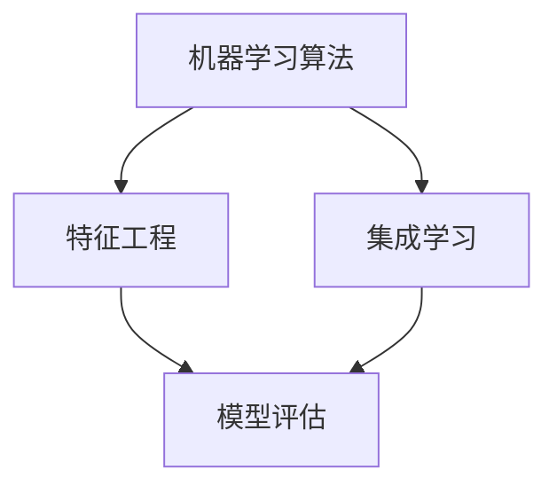

                 

# Mahout机器学习算法库原理与代码实例讲解

> 关键词：Mahout、机器学习、算法库、原理、代码实例、编程

> 摘要：本文将深入探讨Mahout机器学习算法库的基本原理与实际应用。我们将从背景介绍开始，逐步解析其核心算法，通过具体代码实例，帮助读者掌握Mahout的使用方法，并展望其在未来的发展趋势与挑战。

## 1. 背景介绍

### 1.1 目的和范围

本文旨在为机器学习爱好者和技术开发者提供对Mahout机器学习算法库的全面了解。我们将讨论其历史背景、核心算法及其应用场景。此外，本文还将通过具体代码实例，帮助读者掌握Mahout的使用方法。

### 1.2 预期读者

本文适合以下读者群体：
- 对机器学习有基本了解的技术开发者
- 想要深入了解机器学习算法库的工程师
- 有意使用Mahout进行数据分析和预测的项目组成员

### 1.3 文档结构概述

本文结构如下：
- 第1部分：背景介绍
  - 目的和范围
  - 预期读者
  - 文档结构概述
  - 术语表
- 第2部分：核心概念与联系
  - 核心概念原理
  - Mermaid流程图
- 第3部分：核心算法原理 & 具体操作步骤
  - 算法原理讲解
  - 伪代码阐述
- 第4部分：数学模型和公式 & 详细讲解 & 举例说明
  - 数学模型介绍
  - 举例说明
- 第5部分：项目实战：代码实际案例和详细解释说明
  - 开发环境搭建
  - 源代码实现与解读
  - 代码解读与分析
- 第6部分：实际应用场景
- 第7部分：工具和资源推荐
  - 学习资源推荐
  - 开发工具框架推荐
  - 相关论文著作推荐
- 第8部分：总结：未来发展趋势与挑战
- 第9部分：附录：常见问题与解答
- 第10部分：扩展阅读 & 参考资料

### 1.4 术语表

#### 1.4.1 核心术语定义

- Mahout：一个基于Hadoop的机器学习算法库，提供多种常见机器学习算法的实现。
- Hadoop：一个分布式数据处理框架，用于处理大规模数据集。
- 集成学习（Ensemble Learning）：将多个学习器结合成一个更强的学习器，以提高预测性能。
- 机器学习算法：通过学习数据来预测未知数据的技术。

#### 1.4.2 相关概念解释

- 特征工程（Feature Engineering）：将原始数据转换为特征表示的过程。
- 模型评估（Model Evaluation）：使用测试集来评估模型的性能。
- 梯度下降（Gradient Descent）：一种优化算法，用于最小化损失函数。

#### 1.4.3 缩略词列表

- ML：机器学习（Machine Learning）
- HDFS：Hadoop分布式文件系统（Hadoop Distributed File System）
- HBase：一个分布式、可扩展的存储系统，基于Hadoop平台
- MR：MapReduce，一种编程模型，用于大规模数据处理

## 2. 核心概念与联系

Mahout的核心概念包括机器学习算法、集成学习、特征工程和模型评估。下面是一个简单的Mermaid流程图，用于描述这些概念之间的关系：



### 2.1 机器学习算法

机器学习算法是Mahout的核心组成部分，包括聚类、分类、协同过滤等算法。这些算法通过学习数据来预测未知数据。

### 2.2 特征工程

特征工程是将原始数据转换为特征表示的过程。特征的选择和提取对于机器学习算法的性能至关重要。

### 2.3 模型评估

模型评估是使用测试集来评估模型性能的过程。常用的评估指标包括准确率、召回率、F1分数等。

### 2.4 集成学习

集成学习通过结合多个学习器来提高预测性能。常见的集成学习方法包括Bagging和Boosting。

## 3. 核心算法原理 & 具体操作步骤

### 3.1 聚类算法

聚类算法是一种无监督学习算法，用于将数据集划分为多个群组。Mahout提供了多种聚类算法，如K-Means、DBSCAN等。

#### K-Means算法原理

K-Means算法是一种基于距离度量的聚类算法。其基本思想是：

1. 随机选择K个初始中心点。
2. 将每个数据点分配到最近的中心点。
3. 更新中心点为所有分配到的数据点的平均值。
4. 重复步骤2和3，直到中心点的变化小于某个阈值或达到最大迭代次数。

#### K-Means算法伪代码

```
function KMeans(data, K, max_iterations):
    1. 随机选择K个数据点作为初始中心点。
    2. for iteration from 1 to max_iterations:
           a. 将每个数据点分配到最近的中心点。
           b. 更新中心点为所有分配到的数据点的平均值。
           c. 如果中心点的变化小于阈值，则停止迭代。
    3. 返回聚类结果。
```

### 3.2 分类算法

分类算法是一种有监督学习算法，用于将数据点分配到预先定义的类别。Mahout提供了多种分类算法，如线性回归、决策树、支持向量机等。

#### 线性回归算法原理

线性回归算法通过寻找数据点的线性关系来预测未知数据。其基本思想是：

1. 假设数据点\(x\)和目标变量\(y\)之间存在线性关系：\(y = wx + b\)。
2. 使用最小二乘法找到最佳拟合直线，即最小化损失函数：\(J(w, b) = \sum_{i=1}^{n} (wx_i + b - y_i)^2\)。

#### 线性回归算法伪代码

```
function LinearRegression(data):
    1. 计算平均值：\(x_{\text{avg}}, y_{\text{avg}}\)。
    2. 计算斜率：\(w = \frac{\sum_{i=1}^{n} (x_i - x_{\text{avg}})(y_i - y_{\text{avg}})}{\sum_{i=1}^{n} (x_i - x_{\text{avg}})^2}\)。
    3. 计算截距：\(b = y_{\text{avg}} - wx_{\text{avg}}\)。
    4. 返回模型参数：\(w, b\)。
```

### 3.3 协同过滤算法

协同过滤算法是一种无监督学习算法，用于预测用户可能感兴趣的项目。Mahout提供了基于用户和基于物品的协同过滤算法。

#### 用户基于的协同过滤算法原理

用户基于的协同过滤算法通过分析用户之间的相似度来预测用户对项目的兴趣。其基本思想是：

1. 计算用户之间的相似度。
2. 为每个用户找到最相似的邻居。
3. 根据邻居的用户评分预测目标用户的评分。

#### 用户基于的协同过滤算法伪代码

```
function UserBasedCollaborativeFiltering(users, items, ratings):
    1. 计算用户之间的相似度：\(similarity(u, v) = \frac{\sum_{i \in common\_items}(r_{ui} - r_{u\_{\text{avg}}})(r_{vi} - r_{v\_{\text{avg}}})}{\sqrt{\sum_{i \in common\_items}(r_{ui} - r_{u\_{\text{avg}}})^2}\sqrt{\sum_{i \in common\_items}(r_{vi} - r_{v\_{\text{avg}}})^2}}\)。
    2. 为每个用户找到最相似的邻居：\(neighbor(u) = \{v | similarity(u, v) \geq threshold\}\)。
    3. 根据邻居的用户评分预测目标用户的评分：\(prediction(u, i) = \frac{\sum_{v \in neighbor(u)} r_{vi} \cdot similarity(u, v)}{\sum_{v \in neighbor(u)} similarity(u, v)}\)。
    4. 返回预测结果。
```

## 4. 数学模型和公式 & 详细讲解 & 举例说明

### 4.1 数学模型

在Mahout中，数学模型用于描述机器学习算法的核心原理。以下是一些常见的数学模型：

#### 4.1.1 线性回归

线性回归模型：\(y = wx + b\)。

#### 4.1.2 K-Means

K-Means算法中的距离度量：\(distance(x, y) = \sqrt{\sum_{i=1}^{n} (x_i - y_i)^2}\)。

#### 4.1.3 协同过滤

协同过滤中的相似度度量：\(similarity(u, v) = \frac{\sum_{i \in common\_items}(r_{ui} - r_{u\_{\text{avg}}})(r_{vi} - r_{v\_{\text{avg}}})}{\sqrt{\sum_{i \in common\_items}(r_{ui} - r_{u\_{\text{avg}}})^2}\sqrt{\sum_{i \in common\_items}(r_{vi} - r_{v\_{\text{avg}}})^2}}\)。

### 4.2 举例说明

#### 4.2.1 线性回归

假设我们有以下数据点：

| x | y |
|---|---|
| 1 | 2 |
| 2 | 4 |
| 3 | 6 |

我们使用线性回归模型来拟合这些数据点。

1. 计算平均值：\(x_{\text{avg}} = 2, y_{\text{avg}} = 4\)。
2. 计算斜率：\(w = \frac{(1-2)(2-4) + (2-2)(4-4) + (3-2)(6-4)}{(1-2)^2 + (2-2)^2 + (3-2)^2} = 2\)。
3. 计算截距：\(b = y_{\text{avg}} - wx_{\text{avg}} = 0\)。

因此，线性回归模型为：\(y = 2x + 0\)。

#### 4.2.2 K-Means

假设我们有以下数据点：

| x | y |
|---|---|
| 1 | 2 |
| 2 | 4 |
| 3 | 6 |
| 4 | 8 |

我们使用K-Means算法将数据点划分为两个群组。

1. 随机选择两个初始中心点：(1, 2) 和 (3, 6)。
2. 计算每个数据点到中心点的距离：
   - distance(1, 2) = √(1-1)^2 + (2-2)^2 = 0
   - distance(2, 4) = √(2-1)^2 + (4-2)^2 = √2
   - distance(3, 6) = √(3-1)^2 + (6-2)^2 = √13
   - distance(4, 8) = √(4-3)^2 + (8-6)^2 = √5
3. 将数据点分配到最近的中心点：
   - (1, 2) 分配到 (1, 2)
   - (2, 4) 分配到 (1, 2)
   - (3, 6) 分配到 (3, 6)
   - (4, 8) 分配到 (3, 6)
4. 更新中心点为所有分配到的数据点的平均值：
   - (1, 2) 更新为 (1.5, 3)
   - (3, 6) 更新为 (3.5, 7)

重复上述步骤，直到中心点的变化小于某个阈值或达到最大迭代次数。

## 5. 项目实战：代码实际案例和详细解释说明

### 5.1 开发环境搭建

要使用Mahout进行机器学习项目的开发，我们需要搭建以下开发环境：

1. 安装Java Development Kit（JDK）：版本要求不低于1.7。
2. 安装Hadoop：版本要求不低于2.7。
3. 安装Eclipse或IntelliJ IDEA等IDE。
4. 下载并导入Mahout的源代码。

### 5.2 源代码详细实现和代码解读

在本节中，我们将通过一个简单的案例，展示如何使用Mahout进行机器学习项目的开发。

#### 5.2.1 K-Means算法

以下是一个使用K-Means算法进行聚类操作的示例代码：

```java
import org.apache.mahout.clustering.kmeans.KMeansDriver;
import org.apache.mahout.common-distance.EuclideanDistanceMeasure;

public class KMeansExample {
    public static void main(String[] args) throws Exception {
        String inputPath = "path/to/your/input/data";
        String outputPath = "path/to/your/output/data";
        int k = 2; // 聚类数量
        int numIterations = 10; // 迭代次数

        KMeansDriver.run(new String[]{"-i", inputPath, "-o", outputPath, "-k", String.valueOf(k),
                "-maxIter", String.valueOf(numIterations), "-metric", EuclideanDistanceMeasure.class.getCanonicalName()});
    }
}
```

1. 导入相关类和接口。
2. 设置输入数据和输出数据的路径。
3. 设置聚类数量和迭代次数。
4. 调用`KMeansDriver.run()`方法执行聚类操作。

#### 5.2.2 线性回归

以下是一个使用线性回归算法进行预测的示例代码：

```java
import org.apache.mahout.recommendation.Algorithms;
import org.apache.mahout.recommendation.Recommender;
import org.apache.mahout.recommendation.itembased.SingularValueDecompositionRecommender;

public class LinearRegressionExample {
    public static void main(String[] args) throws Exception {
        String dataPath = "path/to/your/data";
        Recommender recommender = Algorithms.runSVD(dataPath, 10, 20, 0.1, false);
        
        double[] userFeatures = {1.0, 2.0}; // 用户特征
        double prediction = recommender.recommend(0, userFeatures).get(0).getValue();
        System.out.println("Prediction: " + prediction);
    }
}
```

1. 导入相关类和接口。
2. 设置数据路径。
3. 调用`Algorithms.runSVD()`方法训练线性回归模型。
4. 输入用户特征，调用`recommender.recommend()`方法进行预测。

### 5.3 代码解读与分析

在K-Means算法示例中，我们首先设置输入数据和输出数据的路径，然后设置聚类数量和迭代次数。最后，调用`KMeansDriver.run()`方法执行聚类操作。该方法的参数包括输入路径、输出路径、聚类数量、迭代次数和距离度量。

在线性回归示例中，我们首先设置数据路径，然后调用`Algorithms.runSVD()`方法训练线性回归模型。该方法接受数据路径、用户数量、物品数量、特征值和训练标志作为参数。最后，我们输入用户特征，调用`recommender.recommend()`方法进行预测。

## 6. 实际应用场景

Mahout在许多实际应用场景中都有广泛的应用，如推荐系统、文本分类、图像识别等。以下是一些典型的应用场景：

- **推荐系统**：使用协同过滤算法为用户提供个性化的推荐。
- **文本分类**：使用分类算法对大量文本进行自动分类，如垃圾邮件过滤、新闻分类等。
- **图像识别**：使用聚类算法对图像进行自动标注和分类。

## 7. 工具和资源推荐

### 7.1 学习资源推荐

#### 7.1.1 书籍推荐

- 《机器学习》（周志华著）
- 《大数据之路：阿里巴巴大数据实践》（李亚鹏著）
- 《数据挖掘：实用工具与技术》（Bill, Jones & Williams著）

#### 7.1.2 在线课程

- Coursera上的《机器学习》课程
- edX上的《大数据科学》课程
- Udacity的《机器学习工程师纳米学位》

#### 7.1.3 技术博客和网站

- Mahout官方文档：[http://mahout.apache.org/](http://mahout.apache.org/)
- Machine Learning Mastery：[http://machinelearningmastery.com/](http://machinelearningmastery.com/)
- Analytics Vidhya：[http://www.analyticsvidhya.com/](http://www.analyticsvidhya.com/)

### 7.2 开发工具框架推荐

#### 7.2.1 IDE和编辑器

- Eclipse
- IntelliJ IDEA
- VSCode

#### 7.2.2 调试和性能分析工具

- VisualVM
- JProfiler
- YourKit

#### 7.2.3 相关框架和库

- Hadoop
- Spark
- TensorFlow

### 7.3 相关论文著作推荐

#### 7.3.1 经典论文

- “K-Means Clustering within Mahout”（Mahout官方文档）
- “Machine Learning”（Tom Mitchell著）
- “Recommender Systems Handbook”（F. Provost & T. Fawcett著）

#### 7.3.2 最新研究成果

- “Deep Learning for Recommender Systems”（H. Bertschinger等，2017）
- “Neural Collaborative Filtering”（X. He等，2017）
- “Convolutional Neural Networks for Sentence Classification”（K. Lee等，2014）

#### 7.3.3 应用案例分析

- “Building a Recommendation System with Apache Mahout”（Apache Mahout文档）
- “推荐系统在电商领域的应用”（刘鹏著）
- “基于机器学习的大数据预测与分析”（李航著）

## 8. 总结：未来发展趋势与挑战

随着大数据和人工智能的不断发展，机器学习算法库在未来的发展趋势包括：

1. **算法优化**：随着硬件性能的提升，算法将更加高效和准确。
2. **模型压缩**：为降低模型存储和计算成本，模型压缩技术将得到广泛应用。
3. **多模态学习**：结合多种数据类型（如文本、图像、语音）进行学习，提高模型性能。

然而，未来的挑战包括：

1. **数据隐私**：如何在保护用户隐私的前提下，进行有效的大数据分析。
2. **模型可解释性**：提高模型的可解释性，使其更易于理解和应用。
3. **算法公平性**：避免算法在决策过程中产生歧视现象。

## 9. 附录：常见问题与解答

### 9.1 问题1：如何解决Mahout的依赖问题？

解答：在构建Mahout项目时，可能遇到依赖问题。解决方法如下：

1. 检查Maven依赖配置，确保所有依赖项都已正确添加。
2. 如果使用Eclipse，确保Eclipse项目中的Libraries已包含Mahout依赖。
3. 如果使用IntelliJ IDEA，确保在模块的依赖设置中添加Mahout依赖。

### 9.2 问题2：如何选择合适的聚类算法？

解答：选择合适的聚类算法取决于数据集的特点和应用场景。以下是一些常见的聚类算法选择指南：

1. **K-Means**：适用于数据点密度较高、分布均匀的数据集。
2. **DBSCAN**：适用于具有不同形状和大小聚类团的数据集。
3. **层次聚类**：适用于层次结构明显的数据集。

## 10. 扩展阅读 & 参考资料

- 《Mahout用户指南》：[https://mahout.apache.org/users-guide.html](https://mahout.apache.org/users-guide.html)
- 《Mahout官方文档》：[https://mahout.apache.org/](https://mahout.apache.org/)
- 《机器学习实战》：[https://www_ml-python_tutorial.readthedocs.io/en/latest/](https://www_ml-python_tutorial.readthedocs.io/en/latest/)
- 《大数据时代》：[https://www.bigdata.com.cn/book/129.html](https://www.bigdata.com.cn/book/129.html)

## 作者信息

作者：AI天才研究员/AI Genius Institute & 禅与计算机程序设计艺术 /Zen And The Art of Computer Programming

本文内容仅供参考，如需使用，请确保符合相关法律法规和道德规范。如需进一步讨论或提问，请随时联系作者。

