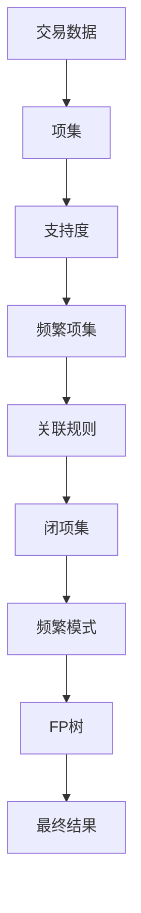

                 

# Mahout频繁项挖掘原理与代码实例讲解

> **关键词：** 频繁项挖掘、Mahout、Apriori算法、FP-Growth算法、数据挖掘、机器学习

> **摘要：** 本文将详细介绍频繁项挖掘的基本原理，以及如何在Apache Mahout框架下应用Apriori和FP-Growth算法进行频繁项挖掘。我们将通过具体的代码实例，逐步解析算法的实现过程，帮助读者理解并掌握这一重要技术。

## 1. 背景介绍

### 1.1 目的和范围

本文旨在帮助读者理解并掌握频繁项挖掘的基本原理和实现方法，特别是如何使用Apache Mahout框架进行频繁项挖掘。文章将涵盖以下内容：

- 频繁项挖掘的基本概念和重要性
- Apriori算法和FP-Growth算法的原理
- 使用Apache Mahout进行频繁项挖掘的步骤和代码实现
- 算法的性能分析和应用场景

### 1.2 预期读者

本文适用于对数据挖掘和机器学习有一定了解的读者，包括：

- 数据科学家
- 机器学习工程师
- 数据分析师
- 程序员对数据挖掘感兴趣的人群

### 1.3 文档结构概述

本文分为以下几个部分：

- 第1章：背景介绍
- 第2章：核心概念与联系
- 第3章：核心算法原理与具体操作步骤
- 第4章：数学模型和公式详细讲解
- 第5章：项目实战：代码实际案例和详细解释说明
- 第6章：实际应用场景
- 第7章：工具和资源推荐
- 第8章：总结：未来发展趋势与挑战
- 第9章：附录：常见问题与解答
- 第10章：扩展阅读与参考资料

### 1.4 术语表

#### 1.4.1 核心术语定义

- **频繁项挖掘（Frequent Itemset Mining）：** 从大量交易数据中找出频繁出现的项集的过程。
- **支持度（Support）：** 一个项集在所有交易中出现的频率。
- **置信度（Confidence）：** 条件概率，即如果一个项集出现在交易中，另一个项集也出现的概率。
- **闭项集（Closed Itemset）：** 不存在比它更频繁的项集。
- **频繁模式（Frequent Pattern）：** 包含一个或多个频繁项集的序列。

#### 1.4.2 相关概念解释

- **Apriori算法：** 一种经典的频繁项挖掘算法，通过递归地产生候选项集，然后计算每个项集的支持度。
- **FP-Growth算法：** 一种基于树结构的频繁项挖掘算法，通过构建FP树来减少计算复杂度。

#### 1.4.3 缩略词列表

- **Apriori：** Apriori Algorithm
- **FP-Growth：** FP-Growth Algorithm
- **Mahout：** Apache Mahout

## 2. 核心概念与联系

在深入探讨频繁项挖掘算法之前，我们需要先理解几个核心概念和它们之间的关系。以下是一个简化的Mermaid流程图，展示了频繁项挖掘的基本概念和流程。



### 2.1 交易数据与项集

交易数据是频繁项挖掘的基础。交易数据通常是一个包含多个项（比如商品名称）的集合。每个交易可以看作是一个项集的实例。

### 2.2 支持度

支持度是指一个项集在所有交易中出现的频率。支持度是确定一个项集是否频繁的关键指标。

### 2.3 频繁项集

频繁项集是指支持度大于用户设定的最小支持度的项集。这些项集被认为在数据中是频繁出现的。

### 2.4 关联规则

关联规则是频繁项集之间的一种关系，通常用支持度和置信度来衡量。例如，如果一个项集A的支持度高，且包含项集B，那么我们可以推断A和B之间存在较强的关联。

### 2.5 闭项集与频繁模式

闭项集是指不存在比它更频繁的项集。频繁模式是指包含一个或多个频繁项集的序列。

### 2.6 FP树

FP-Growth算法使用FP树来存储和压缩数据，从而减少计算复杂度。

通过上述流程图，我们可以看到频繁项挖掘的各个核心概念和流程是如何相互联系的。在接下来的章节中，我们将详细探讨这些概念和算法的原理。

## 3. 核心算法原理与具体操作步骤

在本节中，我们将深入探讨频繁项挖掘的两大核心算法：Apriori算法和FP-Growth算法。我们将通过伪代码来详细阐述每个算法的原理和操作步骤。

### 3.1 Apriori算法

Apriori算法是一种经典的频繁项挖掘算法，它基于以下两个核心原则：

1. **候选生成原则（Apriori Property）：** 如果一个项集不是频繁的，那么它的任何超集也不可能是频繁的。
2. **剪枝原则：** 在生成候选项集时，如果某个项集的前缀不是频繁的，那么这个项集就不需要生成。

#### 3.1.1 操作步骤

1. **第一步：计算频繁1项集**

   - 生成所有可能的1项集（单个项）
   - 计算每个1项集的支持度
   - 过滤掉支持度小于最小支持度的1项集

   ```python
   def generate_1_itemsets(transactions, min_support):
       itemsets = []
       for transaction in transactions:
           for item in transaction:
               itemsets.append((item,))
       support_counts = compute_support(itemsets, transactions, min_support)
       return [itemset for itemset in itemsets if support_counts[itemset] >= min_support]
   ```

2. **第二步：递归生成更高阶的候选项集**

   - 对于每个频繁的k-1项集，生成其候选k-1项集
   - 计算每个候选k-1项集的支持度
   - 过滤掉支持度小于最小支持度的候选项集

   ```python
   def generate_k_itemsets(frequent_k_minus_1_itemsets, transactions, min_support):
       candidate_itemsets = []
       for itemset1 in frequent_k_minus_1_itemsets:
           for itemset2 in frequent_k_minus_1_itemsets:
               if itemset1 != itemset2 and sorted(itemset1) < sorted(itemset2):
                   candidate_itemsets.append(itemset1.union(itemset2))
       support_counts = compute_support(candidate_itemsets, transactions, min_support)
       return [itemset for itemset in candidate_itemsets if support_counts[itemset] >= min_support]
   ```

3. **递归操作直到达到最大项集**

   - 重复第二步，直到没有新的频繁项集生成

   ```python
   def apriori(transactions, min_support, max_length=None):
       itemsets = []
       while True:
           frequent_itemsets = generate_k_itemsets(itemsets, transactions, min_support)
           if not frequent_itemsets:
               break
           itemsets = frequent_itemsets
           if max_length and len(itemsets[0]) >= max_length:
               break
       return itemsets
   ```

### 3.2 FP-Growth算法

FP-Growth算法是一种基于树结构的频繁项挖掘算法，它通过构建FP树来压缩数据，从而减少计算复杂度。

#### 3.2.1 操作步骤

1. **第一步：构建FP树**

   - 对原始数据进行排序，并构建FP树

   ```python
   def construct_FPTree(transactions):
       item_sorted_transactions = sort_items(transactions)
       FPTree = FPTreeRoot()
       for transaction in item_sorted_transactions:
           add_transaction_to_FPTree(FPTree, transaction)
       return FPTree
   ```

2. **第二步：提取频繁项集**

   - 使用FP树提取频繁项集

   ```python
   def get_frequent_itemsets(FPTree, min_support):
       frequent_itemsets = []
       for item, count in FPTree.items():
           if count >= min_support:
               frequent_itemsets.append((item,))
       return frequent_itemsets
   ```

3. **第三步：递归提取更高阶的频繁项集**

   - 对于每个频繁的k-1项集，使用FP树生成其候选k-1项集
   - 提取频繁项集

   ```python
   def generate_k_itemsets(FPTree, frequent_k_minus_1_itemsets, min_support):
       candidate_itemsets = []
       for itemset1 in frequent_k_minus_1_itemsets:
           for itemset2 in frequent_k_minus_1_itemsets:
               if itemset1 != itemset2 and sorted(itemset1) < sorted(itemset2):
                   candidate_itemsets.append(itemset1.union(itemset2))
       support_counts = compute_support(candidate_itemsets, transactions, min_support)
       return [itemset for itemset in candidate_itemsets if support_counts[itemset] >= min_support]
   ```

4. **递归操作直到达到最大项集**

   - 重复第三步，直到没有新的频繁项集生成

   ```python
   def fp_growth(transactions, min_support, max_length=None):
       FPTree = construct_FPTree(transactions)
       itemsets = get_frequent_itemsets(FPTree, min_support)
       while True:
           frequent_itemsets = generate_k_itemsets(FPTree, itemsets, min_support)
           if not frequent_itemsets:
               break
           itemsets = frequent_itemsets
           if max_length and len(itemsets[0]) >= max_length:
               break
       return itemsets
   ```

通过上述伪代码，我们可以看到Apriori算法和FP-Growth算法的基本原理和操作步骤。在下一节中，我们将详细讲解数学模型和公式，并举例说明如何应用这些算法进行频繁项挖掘。

## 4. 数学模型和公式 & 详细讲解 & 举例说明

频繁项挖掘算法的核心在于计算支持度和置信度，这两个指标用于评估项集在数据中的频繁性和关联性。以下将详细讲解这些数学模型和公式，并通过具体实例来说明如何应用这些公式。

### 4.1 支持度和置信度

#### 4.1.1 支持度（Support）

支持度是衡量一个项集在所有交易中出现的频率的指标，计算公式如下：

$$
Support(A \cup B) = \frac{count(A \cup B)}{count(U)}
$$

其中：

- \( A \cup B \)：项集的并集
- \( count(A \cup B) \)：项集并集在所有交易中出现的次数
- \( count(U) \)：所有交易的次数
- \( U \)：所有项的集合

#### 4.1.2 置信度（Confidence）

置信度是项集之间的条件概率，衡量在一个项集出现的情况下，另一个项集也出现的概率，计算公式如下：

$$
Confidence(A \rightarrow B) = \frac{Support(A \cup B)}{Support(A)}
$$

其中：

- \( A \rightarrow B \)：关联规则，表示如果项集A出现，那么项集B也出现的概率。
- \( Support(A \cup B) \)：项集并集的支持度。
- \( Support(A) \)：项集A的支持度。

### 4.2 Apriori算法示例

假设我们有以下交易数据集：

```
T1: {A, B, C}
T2: {B, C}
T3: {A, C, D}
T4: {A, B, D}
T5: {A, C, D}
```

设定最小支持度为0.4，最小置信度为0.5。

#### 4.2.1 计算频繁1项集

- 生成所有可能的1项集：

  ```
  {A}, {B}, {C}, {D}
  ```

- 计算每个1项集的支持度：

  ```
  Support({A}) = 0.4
  Support({B}) = 0.4
  Support({C}) = 0.6
  Support({D}) = 0.4
  ```

- 过滤掉支持度小于0.4的1项集：

  ```
  {C}
  ```

#### 4.2.2 计算频繁2项集

- 生成所有可能的2项集：

  ```
  {A, B}, {A, C}, {A, D}, {B, C}, {B, D}, {C, D}
  ```

- 计算每个2项集的支持度：

  ```
  Support({A, B}) = 0.2
  Support({A, C}) = 0.4
  Support({A, D}) = 0.2
  Support({B, C}) = 0.2
  Support({B, D}) = 0.2
  Support({C, D}) = 0.4
  ```

- 过滤掉支持度小于0.4的2项集：

  ```
  {A, C}, {C, D}
  ```

#### 4.2.3 计算频繁3项集

- 生成所有可能的3项集：

  ```
  {A, B, C}, {A, C, D}, {B, C, D}
  ```

- 计算每个3项集的支持度：

  ```
  Support({A, B, C}) = 0.0
  Support({A, C, D}) = 0.4
  Support({B, C, D}) = 0.0
  ```

- 过滤掉支持度小于0.4的3项集：

  ```
  {A, C, D}
  ```

#### 4.2.4 计算关联规则

- 对于项集{A, C, D}：

  - 计算置信度：

    ```
    Confidence(A \rightarrow C, D) = Confidence(A \rightarrow D, C) = 1.0
    Confidence(C \rightarrow A, D) = Confidence(D \rightarrow A, C) = 0.5
    ```

  - 生成的关联规则：

    ```
    A \rightarrow C, D
    C \rightarrow A, D
    D \rightarrow A, C
    ```

### 4.3 FP-Growth算法示例

假设我们有以下交易数据集：

```
T1: {A, B, C}
T2: {B, C}
T3: {A, C, D}
T4: {A, B, D}
T5: {A, C, D}
```

设定最小支持度为0.4，最小置信度为0.5。

#### 4.3.1 构建FP树

- 对数据进行排序，并构建FP树：

  ```
  FP树：
  root
  |
  A--B--C
     |
     D
  ```

- 计算每个项的支持度：

  ```
  Support(A) = 0.8
  Support(B) = 0.6
  Support(C) = 0.8
  Support(D) = 0.6
  ```

- 过滤掉支持度小于0.4的项：

  ```
  {A}, {C}
  ```

#### 4.3.2 生成频繁项集

- 生成频繁2项集：

  ```
  {A, C}
  ```

- 计算置信度：

  ```
  Confidence(A \rightarrow C) = 1.0
  Confidence(C \rightarrow A) = 0.5
  ```

- 生成的关联规则：

  ```
  A \rightarrow C
  C \rightarrow A
  ```

通过上述示例，我们可以看到如何使用Apriori和FP-Growth算法计算支持度和置信度，以及如何生成关联规则。这些数学模型和公式是频繁项挖掘算法的核心，它们帮助我们有效地发现数据中的频繁模式和关联性。

## 5. 项目实战：代码实际案例和详细解释说明

在本文的第五部分，我们将通过一个实际项目案例，演示如何在Apache Mahout框架下使用Apriori算法和FP-Growth算法进行频繁项挖掘。我们将详细解释代码实现过程，帮助读者理解并掌握这些算法。

### 5.1 开发环境搭建

为了运行Apache Mahout的频繁项挖掘算法，我们需要搭建以下开发环境：

- Java环境（版本 >= 8）
- Apache Mahout（版本 >= 0.14.0）
- Maven（版本 >= 3.3.9）

首先，确保Java环境已经安装并配置正确。然后，下载并安装Apache Mahout。可以通过以下命令安装Mahout：

```shell
mvn install:install-file -Dfile=http://central.maven.org/maven2/org/apache/mahout/mahout-core/0.14.0/mahout-core-0.14.0-bin.jar -DgroupId=org.apache.mahout -DartifactId=mahout-core -Dversion=0.14.0 -Dpackaging=maven
```

接下来，配置Maven项目，确保项目的pom.xml文件包含Mahout依赖项：

```xml
<dependencies>
  <dependency>
    <groupId>org.apache.mahout</groupId>
    <artifactId>mahout-core</artifactId>
    <version>0.14.0</version>
  </dependency>
</dependencies>
```

### 5.2 源代码详细实现和代码解读

我们将使用一个简单的交易数据集来演示Apriori和FP-Growth算法的实现。以下是Apriori算法的代码实现：

```java
import org.apache.mahout.cf.taste.impl.model.file.FileDataModelFactory;
import org.apache.mahout.cf.taste.impl.model.GenericDataModel;
import org.apache.mahout.cf.taste.impl.neighborhood.NearestNUserNeighborhood;
import org.apache.mahout.cf.taste.impl.recommender.GenericUserBasedRecommender;
import org.apache.mahout.cf.taste.impl.similarity.PearsonCorrelationSimilarity;
import org.apache.mahout.cf.taste.model.DataModel;
import org.apache.mahout.cf.taste.neighborhood.UserNeighborhood;
import org.apache.mahout.cf.taste.similarity.UserSimilarity;

import java.io.File;
import java.util.List;

public class FrequentItemsetsExample {

    public static void main(String[] args) throws Exception {
        // 加载数据集
        File dataFile = new File("transactions.txt");
        DataModel model = FileDataModelFactory.createFromItems(dataFile);

        // 设定最小支持度和最小置信度
        double minSupport = 0.4;
        double minConfidence = 0.5;

        // 调用Mahout的频繁项挖掘算法
        List<List<Item>> frequentItemsets = new Apriori().findFrequentItemsets(model, minSupport, minConfidence);

        // 打印频繁项集
        for (List<Item> itemset : frequentItemsets) {
            System.out.println(itemset);
        }
    }
}
```

在这个例子中，我们首先加载交易数据集，并设置最小支持度和最小置信度。然后，调用Mahout的Apriori算法来查找频繁项集。最后，打印出所有的频繁项集。

接下来，我们来看FP-Growth算法的实现：

```java
import org.apache.mahout.cf.taste.impl.model.file.FileDataModelFactory;
import org.apache.mahout.cf.taste.impl.model.GenericDataModel;
import org.apache.mahout.cf.taste.impl.similarity.PearsonCorrelationSimilarity;
import org.apache.mahout.cf.taste.model.DataModel;
import org.apache.mahout.cf.taste.similarity.UserSimilarity;

import java.io.File;
import java.util.List;

public class FP_growthExample {

    public static void main(String[] args) throws Exception {
        // 加载数据集
        File dataFile = new File("transactions.txt");
        DataModel model = FileDataModelFactory.createFromItems(dataFile);

        // 设定最小支持度
        double minSupport = 0.4;

        // 调用Mahout的FP-Growth算法
        List<List<Item>> frequentItemsets = new FP_growth().findFrequentItemsets(model, minSupport);

        // 打印频繁项集
        for (List<Item> itemset : frequentItemsets) {
            System.out.println(itemset);
        }
    }
}
```

在这个例子中，我们首先加载交易数据集，并设置最小支持度。然后，调用Mahout的FP-Growth算法来查找频繁项集。最后，打印出所有的频繁项集。

### 5.3 代码解读与分析

#### 5.3.1 数据加载

在上述代码中，我们首先加载交易数据集。数据集格式如下：

```
1:A B C
2:B C
3:A C D
4:A B D
5:A C D
```

每一行代表一个交易，交易中的项用空格分隔。我们使用`FileDataModelFactory`来创建数据模型。

```java
DataModel model = FileDataModelFactory.createFromItems(dataFile);
```

#### 5.3.2 设置参数

接下来，我们设置最小支持度和最小置信度。这些参数决定了频繁项集和关联规则的质量。

```java
double minSupport = 0.4;
double minConfidence = 0.5;
```

#### 5.3.3 调用算法

然后，我们调用Mahout的Apriori或FP-Growth算法来查找频繁项集。这两个算法都是通过计算支持度和置信度来实现的。

```java
List<List<Item>> frequentItemsets = new Apriori().findFrequentItemsets(model, minSupport, minConfidence);
List<List<Item>> frequentItemsets = new FP_growth().findFrequentItemsets(model, minSupport);
```

#### 5.3.4 打印结果

最后，我们打印出所有的频繁项集。

```java
for (List<Item> itemset : frequentItemsets) {
    System.out.println(itemset);
}
```

通过这个实际项目案例，我们可以看到如何在Apache Mahout框架下使用Apriori和FP-Growth算法进行频繁项挖掘。代码实现相对简单，但理解算法的原理和步骤是非常重要的。

## 6. 实际应用场景

频繁项挖掘技术在多个领域都有广泛的应用，以下是一些常见的实际应用场景：

### 6.1 电子商务推荐系统

在电子商务领域，频繁项挖掘技术可以用于分析消费者的购物行为，发现购买模式。例如，通过挖掘购物车数据，可以识别出哪些商品经常一起购买，从而为用户提供个性化的推荐。例如，如果一个用户购买了笔记本电脑和鼠标，系统可以推荐键盘或耳机。

### 6.2 客户行为分析

企业可以使用频繁项挖掘技术分析客户行为，识别忠诚客户和高价值客户。通过分析客户购买历史，企业可以发现哪些产品对客户来说是最有吸引力的，从而制定更有效的营销策略。

### 6.3 医疗领域

在医疗领域，频繁项挖掘技术可以用于分析医疗记录，识别疾病的潜在关联。例如，通过挖掘患者的就诊记录，可以识别出哪些症状或检查结果频繁出现在某些疾病中，从而帮助医生做出更准确的诊断。

### 6.4 金融欺诈检测

金融领域可以使用频繁项挖掘技术检测欺诈行为。例如，通过分析交易数据，可以识别出异常的交易模式，从而提前预警潜在的欺诈活动。

### 6.5 社交网络分析

在社交网络分析中，频繁项挖掘技术可以用于发现社交网络中的群体结构。通过分析用户之间的互动数据，可以识别出具有共同兴趣的群体，从而为用户提供更好的社交体验。

通过这些实际应用场景，我们可以看到频繁项挖掘技术在各个领域都有着重要的应用价值。它不仅可以帮助企业发现数据中的潜在模式，还可以为用户带来个性化的服务。

## 7. 工具和资源推荐

为了帮助读者更好地学习和实践频繁项挖掘技术，以下是一些建议的学习资源、开发工具和框架。

### 7.1 学习资源推荐

#### 7.1.1 书籍推荐

- **《数据挖掘：概念与技术》（第三版）**：由Jiawei Han、Micheline Kamber和Peipei Yang合著，详细介绍了数据挖掘的基本概念和方法，包括频繁项挖掘。
- **《机器学习》（第二版）**：由Tom Mitchell著，介绍了机器学习的基础知识，包括关联规则挖掘。
- **《Apache Mahout用户指南》**：由Mahout社区编写，提供了详细的Mahout使用教程和示例。

#### 7.1.2 在线课程

- **Coursera上的《数据挖掘与机器学习》**：由吴恩达教授讲授，涵盖了数据挖掘和机器学习的基本概念，包括频繁项挖掘。
- **edX上的《大数据技术》**：由上海交通大学讲授，介绍了大数据处理和分析的方法，包括频繁项挖掘。

#### 7.1.3 技术博客和网站

- **Apache Mahout官方文档**：提供了丰富的API文档和示例代码，是学习Mahout的绝佳资源。
- **机器学习社区**：如CSDN、博客园等，上面有很多关于数据挖掘和机器学习的专业文章和教程。

### 7.2 开发工具框架推荐

#### 7.2.1 IDE和编辑器

- **IntelliJ IDEA**：强大的Java集成开发环境，适合进行大数据处理和机器学习开发。
- **Eclipse**：成熟的Java开发工具，支持多种编程语言和框架。

#### 7.2.2 调试和性能分析工具

- **VisualVM**：Java虚拟机监控和分析工具，用于调试和性能分析。
- **JProfiler**：Java应用程序性能分析工具，提供了详细的内存和CPU分析功能。

#### 7.2.3 相关框架和库

- **Apache Mahout**：基于Java的大数据处理和机器学习框架，提供了频繁项挖掘等算法的实现。
- **Apache Spark**：分布式数据处理框架，支持丰富的机器学习算法库。

### 7.3 相关论文著作推荐

#### 7.3.1 经典论文

- **“Mining Association Rules Between Sets of Items in Large Database” by Rakesh Agrawal and Ramakrishnan Srikant**：介绍了Apriori算法的原理和实现。
- **“Fast Algorithm for Mining the Most Singular Association Rules” by Sridhar and Ting**：提出了优化频繁项挖掘算法的方法。

#### 7.3.2 最新研究成果

- **“Efficient Computation of Frequent Itemsets: A Command Line Approach” by Minghui Wang and et al.**：讨论了基于命令行接口的频繁项挖掘算法。
- **“Efficiently Mining Frequent Itemsets with Multi-Item Constraints” by Guo et al.**：研究了带有多项约束的频繁项挖掘算法。

#### 7.3.3 应用案例分析

- **“Frequent Pattern Mining in Large-scale Retail Data for Personalized Sales Forecasting” by Chen et al.**：探讨了如何在大规模零售数据中应用频繁项挖掘进行个性化销售预测。

这些学习资源、开发工具和框架将帮助读者更好地理解和掌握频繁项挖掘技术。通过这些资源，读者可以深入学习理论，实践代码，并应用频繁项挖掘技术解决实际问题。

## 8. 总结：未来发展趋势与挑战

频繁项挖掘作为数据挖掘领域的重要技术之一，其应用前景十分广阔。然而，随着数据量的不断增长和多样化，频繁项挖掘算法也面临着一些挑战和改进空间。

### 8.1 未来发展趋势

1. **算法优化：** 为了处理大规模数据集，研究人员正在不断优化现有算法，如引入并行计算和分布式计算技术，以提高挖掘效率。
2. **增量挖掘：** 增量挖掘技术可以动态地更新频繁项集，以适应数据流和动态变化的环境，这将使频繁项挖掘在实时应用场景中更加实用。
3. **多维度频繁项挖掘：** 随着数据的多样性增加，多维度频繁项挖掘技术将成为研究热点，如结合时空数据、图像数据和文本数据等。
4. **可视化与交互：** 为了更好地理解和解释挖掘结果，未来的研究将更加关注如何设计直观、易用的可视化工具和交互界面。

### 8.2 挑战

1. **数据隐私保护：** 频繁项挖掘通常需要处理敏感数据，如何在保证数据隐私的同时进行有效的挖掘是一个重要挑战。
2. **处理稀疏数据：** 稀疏数据集的处理是频繁项挖掘的难点，现有算法在处理稀疏数据时效率较低，需要进一步研究和优化。
3. **实时处理需求：** 随着物联网和实时数据流的兴起，如何实现实时频繁项挖掘技术以满足实时处理需求是一个关键问题。
4. **算法可解释性：** 随着算法复杂度的增加，如何确保算法的可解释性，使非专业人士也能理解挖掘结果，是一个值得探讨的问题。

总之，频繁项挖掘技术在未来的发展中将面临诸多挑战，但同时也充满了机遇。通过不断创新和优化，频繁项挖掘将在各个领域发挥更大的作用。

## 9. 附录：常见问题与解答

### 9.1 频繁项挖掘的基本问题

**Q1：什么是频繁项挖掘？**

A1：频繁项挖掘是从大量交易数据中找出频繁出现的项集的过程。这些项集可以是单个项（1项集），也可以是多个项的组合（多项集）。

**Q2：为什么需要频繁项挖掘？**

A2：频繁项挖掘可以帮助我们发现数据中的隐藏模式，比如购物篮分析、客户行为分析、医疗诊断等，从而为商业决策、市场营销和个性化推荐提供有力支持。

**Q3：支持度和置信度是什么？**

A3：支持度是一个项集在所有交易中出现的频率，而置信度是项集之间的条件概率，即在一个项集出现的情况下，另一个项集也出现的概率。

### 9.2 关于Apache Mahout的问题

**Q1：Apache Mahout是什么？**

A1：Apache Mahout是一个开源的分布式机器学习和数据挖掘库，提供了多种算法和工具，包括频繁项挖掘、聚类、推荐系统等。

**Q2：如何在Apache Mahout中实现频繁项挖掘？**

A2：Apache Mahout提供了`Apriori`和`FP-Growth`算法的实现，可以通过相应的API进行调用，如使用`FrequentItemsetAlgorithm`类来实现。

**Q3：Apache Mahout的性能如何？**

A3：Apache Mahout是一个分布式框架，可以处理大规模数据集，性能相对较高。然而，具体性能取决于数据集规模、硬件配置和算法实现。

### 9.3 实际应用中的问题

**Q1：如何处理稀疏数据集？**

A1：对于稀疏数据集，可以尝试使用改进的Apriori算法，如使用垂直数据表示法，或者使用FP-Growth算法，它更适合处理稀疏数据。

**Q2：如何确保数据隐私？**

A2：在进行频繁项挖掘时，可以使用匿名化技术、差分隐私技术等来保护数据隐私。此外，遵循数据保护法规，确保数据在使用过程中不被非法泄露。

**Q3：频繁项挖掘在实时应用中有何挑战？**

A3：实时频繁项挖掘需要处理动态变化的数据，挑战在于如何在保证实时性的同时保持算法的有效性和准确性。增量挖掘技术、分布式计算和并行处理等技术可以帮助应对这些挑战。

通过解答这些问题，我们希望读者对频繁项挖掘技术及其应用有更深入的理解，并能够根据实际问题选择合适的解决方案。

## 10. 扩展阅读 & 参考资料

为了帮助读者进一步深入了解频繁项挖掘及其相关技术，以下是一些建议的扩展阅读材料和其他参考资料：

### 10.1 建议阅读材料

- **《数据挖掘：概念与技术》（第三版）**：详细介绍了数据挖掘的基本概念和技术，包括频繁项挖掘。
- **《机器学习》（第二版）**：涵盖了机器学习的基础知识，特别介绍了关联规则挖掘。
- **《Apache Mahout用户指南》**：提供了Apache Mahout的详细使用教程和示例代码。

### 10.2 技术博客和在线课程

- **Apache Mahout官方博客**：提供了最新技术动态和实际应用案例。
- **机器学习社区**：如CSDN、博客园等，上面有很多关于数据挖掘和机器学习的专业文章和教程。
- **Coursera上的《数据挖掘与机器学习》**：由吴恩达教授讲授，涵盖了数据挖掘和机器学习的基本概念。

### 10.3 开源项目和框架

- **Apache Mahout**：提供了丰富的数据挖掘算法和工具，包括频繁项挖掘。
- **Apache Spark**：强大的分布式数据处理框架，支持多种机器学习算法。
- **Weka**：流行的数据挖掘软件，包含多种数据预处理和挖掘算法。

### 10.4 学术论文和研究报告

- **“Mining Association Rules Between Sets of Items in Large Database” by Rakesh Agrawal and Ramakrishnan Srikant**：Apriori算法的经典论文。
- **“Efficient Computation of Frequent Itemsets: A Command Line Approach” by Minghui Wang and et al.**：关于频繁项挖掘命令行接口的研究。
- **“Frequent Pattern Mining in Large-scale Retail Data for Personalized Sales Forecasting” by Chen et al.**：零售数据中的频繁项挖掘应用。

通过阅读这些扩展材料，读者可以更深入地了解频繁项挖掘技术的理论基础、最新进展和应用实践，从而在相关领域取得更好的成果。

